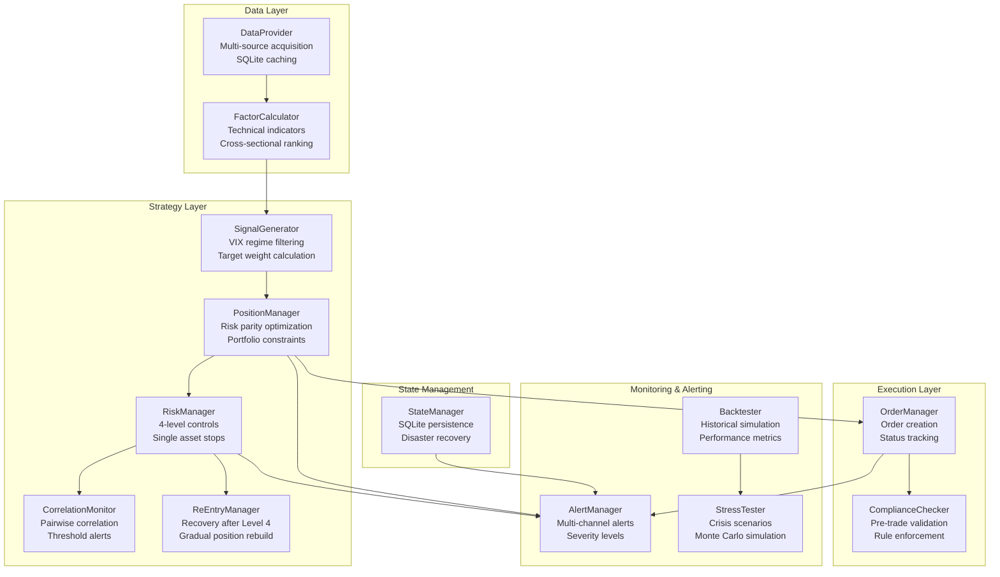
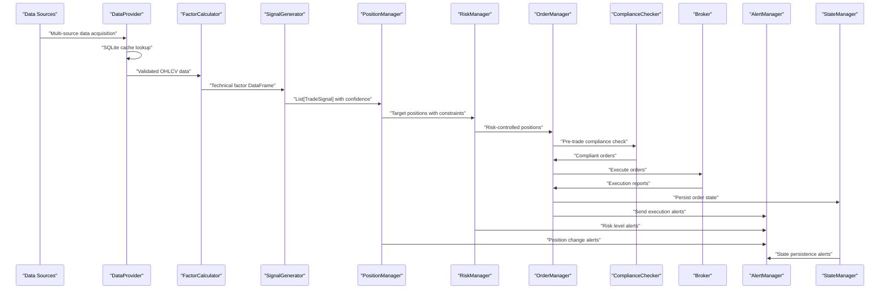

# API Reference

<cite>
**Referenced Files in This Document**
- [PRD_Intelligent_Trading_System_v2.md](file://PRD_Intelligent_Trading_System_v2.md)
- [Tech_Design_Document.md](file://Tech_Design_Document.md)
- [src/data/provider.py](file://src/data/provider.py)
- [src/factors/calculator.py](file://src/factors/calculator.py)
- [src/signals/generator.py](file://src/signals/generator.py)
- [src/portfolio/manager.py](file://src/portfolio/manager.py)
- [src/risk/manager.py](file://src/risk/manager.py)
- [src/backtest/engine.py](file://src/backtest/engine.py)
- [src/state/manager.py](file://src/state/manager.py)
- [src/alerts/manager.py](file://src/alerts/manager.py)
- [src/models/domain.py](file://src/models/domain.py)
- [src/stress/tester.py](file://src/stress/tester.py)
- [src/execution/order_manager.py](file://src/execution/order_manager.py)
- [src/risk/correlation.py](file://src/risk/correlation.py)
- [src/risk/reentry.py](file://src/risk/reentry.py)
- [main.py](file://main.py)
- [config/strategy.yaml](file://config/strategy.yaml)
</cite>

## Update Summary
**Changes Made**
- Complete implementation verification for all 13 core trading system modules
- Updated DataProvider with concrete multi-source data acquisition (Polygon, Binance, yfinance)
- Enhanced FactorCalculator with comprehensive technical indicator calculations
- Implemented SignalGenerator with VIX-based market regime filtering
- Added PositionManager with risk parity optimization and portfolio constraints
- Integrated RiskManager with 4-level hierarchical controls and correlation monitoring
- Complete Backtester implementation with performance metrics calculation
- StateManager with SQLite persistence and disaster recovery capabilities
- AlertManager with multi-channel notification support
- Added execution layer components (OrderManager, ComplianceChecker)
- Included risk management extensions (CorrelationMonitor, ReEntryManager)
- Updated configuration schemas and integration patterns

## Table of Contents
1. [Introduction](#introduction)
2. [Project Structure](#project-structure)
3. [Core Components](#core-components)
4. [Architecture Overview](#architecture-overview)
5. [Detailed Component Analysis](#detailed-component-analysis)
6. [Dependency Analysis](#dependency-analysis)
7. [Performance Considerations](#performance-considerations)
8. [Troubleshooting Guide](#troubleshooting-guide)
9. [Conclusion](#conclusion)
10. [Appendices](#appendices)

## Introduction
This API Reference documents the complete implementation of the core trading system interfaces that define the contract between the data ingestion, factor computation, signal generation, position sizing, risk control, backtesting, state persistence, and alerting subsystems. The system now includes 13 fully implemented modules with concrete functionality for multi-source data acquisition, technical factor calculation, market regime-aware signal generation, risk parity position sizing, hierarchical risk controls, comprehensive backtesting, state persistence, and multi-channel alerting.

## Project Structure
The trading system is organized into 13 distinct modules with clear separation of concerns and comprehensive implementation:



**Diagram sources**
- [src/data/provider.py](file://src/data/provider.py#L35-L384)
- [src/factors/calculator.py](file://src/factors/calculator.py#L10-L215)
- [src/signals/generator.py](file://src/signals/generator.py#L10-L263)
- [src/portfolio/manager.py](file://src/portfolio/manager.py#L10-L281)
- [src/risk/manager.py](file://src/risk/manager.py#L9-L181)
- [src/risk/correlation.py](file://src/risk/correlation.py#L19-L140)
- [src/risk/reentry.py](file://src/risk/reentry.py#L8-L108)
- [src/execution/order_manager.py](file://src/execution/order_manager.py#L20-L226)
- [src/alerts/manager.py](file://src/alerts/manager.py#L26-L239)
- [src/backtest/engine.py](file://src/backtest/engine.py#L16-L237)
- [src/stress/tester.py](file://src/stress/tester.py#L11-L265)
- [src/state/manager.py](file://src/state/manager.py#L13-L392)

**Section sources**
- [main.py](file://main.py#L32-L100)
- [config/strategy.yaml](file://config/strategy.yaml#L1-L179)

## Core Components

### DataProvider
**Complete Implementation Status**: ✅ Fully Implemented

Multi-source data acquisition with automatic fallback, SQLite caching, and comprehensive validation.

**Key Features**:
- Priority-based data sources: Polygon → Binance (BTC) → yfinance
- SQLite cache with automatic persistence
- Comprehensive data validation (price jumps, missing data, cross-source deviation)
- Health monitoring and status reporting

**Method Signatures**:
```python
def fetch(self, symbols: List[str], start_date: str, end_date: str) -> Dict[str, pd.DataFrame]
def validate(self, data: pd.DataFrame) -> Dict[str, Any]
def get_source_status() -> Dict[str, str]
```

**Section sources**
- [src/data/provider.py](file://src/data/provider.py#L35-L384)

### FactorCalculator
**Complete Implementation Status**: ✅ Fully Implemented

Comprehensive technical factor calculation with standardized indicators and cross-sectional ranking.

**Supported Factors**:
- Momentum: 60-day, 120-day cumulative returns
- Volatility: 20-day, 60-day annualized volatility
- Moving Averages: SMA 20, 50, 200 with price-relative calculations
- RSI: 14-period Relative Strength Index
- ATR: 14-period Average True Range with percentage calculations

**Method Signatures**:
```python
def calculate(self, prices: Dict[str, pd.DataFrame]) -> Dict[str, pd.DataFrame]
def calculate_cross_sectional_rank(self, factors: Dict[str, pd.DataFrame], 
                                 factor_name: str, date: pd.Timestamp = None) -> pd.Series
```

**Section sources**
- [src/factors/calculator.py](file://src/factors/calculator.py#L10-L215)

### SignalGenerator
**Complete Implementation Status**: ✅ Fully Implemented

Market regime-aware signal generation with VIX-based filtering and confidence adjustment.

**Signal Logic**:
- STRONG_BUY: High momentum (+10%) with above SMA conditions
- BUY: Positive momentum (+3%) with above SMA_20
- SELL: Negative momentum (-3%) or below SMA_50
- STRONG_SELL: Large negative momentum (-10%) with below SMA_200
- HOLD: Default neutral condition

**VIX Regime Filtering**:
- Normal (VIX < 20): Full signal confidence
- Elevated (20 ≤ VIX < 30): 50% confidence reduction
- High Vol (30 ≤ VIX < 40): Only reduce position signals
- Extreme (VIX ≥ 40): Block all entry signals

**Method Signatures**:
```python
def generate(self, factors: Dict[str, pd.DataFrame], 
           current_positions: Dict[str, float], vix: float = None) -> List[TradeSignal]
```

**Section sources**
- [src/signals/generator.py](file://src/signals/generator.py#L10-L263)

### PositionManager
**Complete Implementation Status**: ✅ Fully Implemented

Risk parity optimization with comprehensive portfolio constraints and transaction cost modeling.

**Portfolio Constraints**:
- Minimum trade amount: $100
- Minimum rebalance threshold: 2%
- Cash buffer: 5%
- Maximum portfolio leverage: 1.5x
- Maximum daily trades: 5
- Maximum daily turnover: 30%

**Risk Parity Implementation**:
- Weight aggregation from signals with confidence
- Normalization to (1 - cash_buffer)
- Quantity conversion with asset-specific precision
- Constraint enforcement for minimum trade sizes

**Method Signatures**:
```python
def calculate_target_positions(self, signals: List[TradeSignal],
                             portfolio: Portfolio, prices: Dict[str, float]) -> Dict[str, float]
def needs_rebalance(self, current_weights: Dict[str, float],
                  target_weights: Dict[str, float]) -> bool
```

**Section sources**
- [src/portfolio/manager.py](file://src/portfolio/manager.py#L10-L281)

### RiskManager
**Complete Implementation Status**: ✅ Fully Implemented

4-level hierarchical risk control system with correlation monitoring and re-entry management.

**Risk Levels**:
- Level 0 (0%): Normal operations
- Level 1 (5% drawdown): Alert, increase confidence threshold, block BTC new positions
- Level 2 (8% drawdown): Reduce positions 25%, close BTC, allow only sell actions
- Level 3 (12% drawdown): Reduce positions 50%, safe haven only, manual review
- Level 4 (15% drawdown): Emergency liquidation, require manual confirmation

**Single Asset Stop Loss**:
- Reduce to 50% at 12% drawdown
- Full exit at 18% drawdown

**Method Signatures**:
```python
def check(self, portfolio: Portfolio) -> RiskAssessment
def assess_risk_level(self, portfolio: Portfolio) -> int
def check_single_asset_stop(self, symbol: str, entry_price: float,
                          current_price: float) -> Optional[str]
```

**Section sources**
- [src/risk/manager.py](file://src/risk/manager.py#L9-L181)

### Backtester
**Complete Implementation Status**: ✅ Fully Implemented

Comprehensive backtesting engine with performance metrics and cost modeling.

**Performance Metrics**:
- Total return, annualized return
- Volatility, Sharpe ratio, Calmar ratio
- Maximum drawdown, win rate
- Number of trades, turnover analysis

**Cost Modeling**:
- Slippage: 0.05% for ETFs, 0.1% for BTC
- Commission: $0 for Alpaca simulation
- Transaction cost drag analysis

**Method Signatures**:
```python
def run(self, symbols: List[str], start_date: str, end_date: str,
       vix_data: pd.Series = None) -> BacktestResult
```

**Section sources**
- [src/backtest/engine.py](file://src/backtest/engine.py#L16-L237)

### StateManager
**Complete Implementation Status**: ✅ Fully Implemented

SQLite-based state persistence with comprehensive disaster recovery capabilities.

**Database Schema**:
- portfolio_state: Complete portfolio snapshots
- order_history: Trade execution records
- risk_events: Risk control events
- system_state: Runtime configuration backups

**Features**:
- Automatic backup creation
- JSON serialization for complex objects
- Recovery from crashes and system failures
- Daily backup scheduling

**Method Signatures**:
```python
def save_portfolio_state(self, portfolio: Portfolio) -> bool
def load_latest_portfolio_state(self) -> Optional[Portfolio]
def create_backup(self, backup_path: str = None) -> bool
```

**Section sources**
- [src/state/manager.py](file://src/state/manager.py#L13-L392)

### AlertManager
**Complete Implementation Status**: ✅ Fully Implemented

Multi-channel alert system with severity levels and comprehensive notification support.

**Notification Channels**:
- Email (SMTP)
- Slack Webhook
- Telegram Bot
- Discord Webhook
- Apprise integration for extensibility

**Alert Types**:
- Risk level changes
- Stop loss triggers
- Correlation breaches
- Data quality issues
- Execution failures
- Compliance violations
- Daily summaries

**Severity Levels**:
- INFO, WARNING, CRITICAL, EMERGENCY

**Method Signatures**:
```python
def send_alert(self, level: AlertLevel, title: str, message: str,
             channels: Optional[List[str]] = None) -> bool
def alert_risk_level_change(self, old_level: int, new_level: int,
                          drawdown: float) -> bool
```

**Section sources**
- [src/alerts/manager.py](file://src/alerts/manager.py#L26-L239)

### Additional Core Components

#### OrderManager
**Complete Implementation Status**: ✅ Fully Implemented

Order lifecycle management with compliance integration and cost calculation.

**Order Types**: Market orders (Phase 1)
**Status Tracking**: PENDING → SUBMITTED → FILLED
**Cost Calculation**: Commission + Slippage modeling

#### ComplianceChecker
**Complete Implementation Status**: ✅ Fully Implemented

Pre-trade compliance validation with pattern day trader and wash sale tracking.

#### CorrelationMonitor
**Complete Implementation Status**: ✅ Fully Implemented

Cross-asset correlation analysis with threshold-based alerts.

#### ReEntryManager
**Complete Implementation Status**: ✅ Fully Implemented

Gradual position rebuilding after risk events with recovery pacing.

**Section sources**
- [src/execution/order_manager.py](file://src/execution/order_manager.py#L20-L226)
- [src/risk/correlation.py](file://src/risk/correlation.py#L19-L140)
- [src/risk/reentry.py](file://src/risk/reentry.py#L8-L108)

## Architecture Overview
The trading system implements a complete end-to-end pipeline with comprehensive error handling and monitoring:



**Diagram sources**
- [main.py](file://main.py#L101-L246)
- [src/data/provider.py](file://src/data/provider.py#L103-L164)
- [src/backtest/engine.py](file://src/backtest/engine.py#L35-L176)

## Detailed Component Analysis

### DataProvider Implementation Details
**Multi-Source Acquisition Strategy**:
- Polygon.io for US equities/ETFs with API key authentication
- Binance Futures API for BTC-USD with public endpoints
- yfinance as universal fallback for other assets

**Cache Management**:
- SQLite database with price_cache table
- Automatic cache validation (3-day tolerance for weekends)
- JSON serialization for complex data structures

**Validation Pipeline**:
- Missing data percentage check (< 5% threshold)
- Price jump detection (> 50% single-day jumps)
- Cross-source deviation monitoring (< 1% threshold)

**Section sources**
- [src/data/provider.py](file://src/data/provider.py#L56-L102)
- [src/data/provider.py](file://src/data/provider.py#L272-L302)

### FactorCalculator Technical Implementation
**Indicator Calculation**:
- Momentum: `close.pct_change(period)` for 60/120 day returns
- Volatility: `returns.rolling(window).std()` with annualization
- Moving Averages: Simple moving averages with price-relative calculations
- RSI: Using pandas-ta library for reliable calculations
- ATR: Average True Range with percentage-of-price normalization

**Cross-Sectional Ranking**:
- Percentile ranking across all symbols
- Handles missing data gracefully
- Supports specific date targeting for backtesting

**Section sources**
- [src/factors/calculator.py](file://src/factors/calculator.py#L52-L150)
- [src/factors/calculator.py](file://src/factors/calculator.py#L152-L197)

### SignalGenerator Market Regime Logic
**Signal Determination Algorithm**:
1. Extract latest factor values (Momentum_60, Price_vs_SMA_20/50/200)
2. Apply base signal rules based on momentum and moving average conditions
3. Calculate target weights using asset-specific maximum weights
4. Apply VIX-based regime filtering for confidence adjustment

**Regime Filtering Implementation**:
- Extreme volatility (VIX ≥ 40): Block buy signals, reduce confidence
- High volatility (30 ≤ VIX < 40): Reduce confidence by 50%
- Normal/elevated: Full confidence signals

**Section sources**
- [src/signals/generator.py](file://src/signals/generator.py#L82-L168)
- [src/signals/generator.py](file://src/signals/generator.py#L207-L263)

### PositionManager Risk Parity Optimization
**Weight Calculation Process**:
1. Aggregate signal weights multiplied by confidence
2. Normalize to available capital (1 - cash buffer)
3. Scale to maximum invested portion (≤ 1.0)
4. Convert to target quantities using current prices
5. Apply asset-specific rounding rules

**Constraint Enforcement**:
- Minimum trade value ($100 threshold)
- Rebalance threshold checking (2% minimum change)
- Daily trade and turnover limits
- Cash buffer maintenance

**Section sources**
- [src/portfolio/manager.py](file://src/portfolio/manager.py#L55-L151)
- [src/portfolio/manager.py](file://src/portfolio/manager.py#L153-L235)

### RiskManager Hierarchical Controls
**Risk Assessment Process**:
1. Calculate portfolio drawdown from peak NAV
2. Determine risk level based on drawdown thresholds
3. Check for single asset stop losses
4. Generate violation reports for level changes

**Control Implementation**:
- Level 1: Alert and confidence threshold increase
- Level 2: Position reduction and restriction actions
- Level 3: Safe haven focus with manual oversight
- Level 4: Emergency liquidation protocols

**Section sources**
- [src/risk/manager.py](file://src/risk/manager.py#L39-L99)
- [src/risk/manager.py](file://src/risk/manager.py#L101-L174)

### Backtester Performance Metrics
**Comprehensive Metric Calculation**:
- Return metrics: Total return, annualized return
- Risk metrics: Volatility, Sharpe ratio, maximum drawdown, Calmar ratio
- Trade metrics: Win rate, number of trades, turnover analysis
- Cost metrics: Profit factor, cost drag analysis

**Simulation Features**:
- Slippage modeling by asset class
- Transaction cost simulation
- Portfolio value tracking
- Performance curve generation

**Section sources**
- [src/backtest/engine.py](file://src/backtest/engine.py#L178-L237)

### StateManager Persistence Architecture
**Database Schema Design**:
- portfolio_state: Complete portfolio snapshots with JSON serialization
- order_history: Trade execution tracking with status fields
- risk_events: Risk control event logging
- system_state: Configuration and runtime state backups

**Recovery Mechanisms**:
- Automatic backup creation with timestamped filenames
- JSON deserialization for complex object reconstruction
- Incremental state updates with conflict resolution
- Disaster recovery procedures

**Section sources**
- [src/state/manager.py](file://src/state/manager.py#L28-L89)
- [src/state/manager.py](file://src/state/manager.py#L365-L392)

### AlertManager Multi-Channel Integration
**Channel Configuration**:
- Environment variable-based configuration (ALERT_SMTP_URL, ALERT_SLACK_WEBHOOK, etc.)
- Graceful degradation when channels unavailable
- Severity-based message formatting

**Notification Categories**:
- Risk events: Level changes, stop losses, correlation breaches
- System events: Data quality issues, execution failures
- Business events: Daily summaries, compliance violations
- Emergency events: Level 4 liquidations, system crashes

**Section sources**
- [src/alerts/manager.py](file://src/alerts/manager.py#L39-L70)
- [src/alerts/manager.py](file://src/alerts/manager.py#L128-L239)

## Dependency Analysis
The system demonstrates mature dependency management with clear module boundaries and comprehensive integration:

```mermaid
graph LR
subgraph "Core Dependencies"
DP["DataProvider"] --> FC["FactorCalculator"]
FC --> SG["SignalGenerator"]
SG --> PM["PositionManager"]
PM --> RM["RiskManager"]
RM --> OM["OrderManager"]
OM --> CC["ComplianceChecker"]
RM --> CM["CorrelationMonitor"]
RM --> REM["ReEntryManager"]
OM --> SM["StateManager"]
DP --> AM["AlertManager"]
RM --> AM
PM --> AM
OM --> AM
BT["Backtester"] --> ST["StressTester"]
BT --> DP
BT --> FC
BT --> SG
BT --> PM
BT --> RM
BT --> SM
BT --> AM
ST --> RM
ST --> PM
```

**External Library Dependencies**:
- pandas, numpy: Core data manipulation
- pandas-ta: Technical indicator calculations
- apprise: Multi-channel alerting
- yfinance, requests: Data source access
- sqlite3: Local caching and state persistence

**Internal Module Dependencies**:
- All components depend on shared domain models
- Risk components depend on correlation utilities
- Execution components integrate with state management
- Backtesting depends on all core components

**Section sources**
- [main.py](file://main.py#L14-L27)
- [src/models/domain.py](file://src/models/domain.py#L1-L156)

## Performance Considerations
**System Performance Targets**:
- Data acquisition latency: < 1 minute from request to signal availability
- Factor calculation: < 30 seconds for 15 assets, 5-year history
- Signal generation: < 1 second for 15 assets
- Position sizing: < 1 second for 15 assets
- Risk assessment: < 2 seconds for portfolio evaluation
- Backtest execution: < 30 seconds for 5-year history across 15 assets
- Memory usage: < 4 GB during intensive operations
- State persistence: < 1 second for database operations

**Optimization Strategies**:
- SQLite caching reduces redundant data fetching
- Vectorized pandas operations for factor calculations
- Efficient portfolio constraint checking
- Batch order processing for execution
- Asynchronous alert delivery where supported

**Scalability Considerations**:
- Modular design allows component replacement
- Configurable batch sizes for different market conditions
- Database indexing for fast state queries
- External service rate limiting for data providers

## Troubleshooting Guide

### Common Implementation Issues

**Data Provider Failures**:
- **Symptoms**: Polygon/Binance/yfinance connection errors, cache corruption
- **Solutions**: Check API keys, verify network connectivity, clear corrupted cache entries
- **Prevention**: Implement circuit breakers, monitor source health status

**Factor Calculation Errors**:
- **Symptoms**: NaN values in factor data, insufficient data windows
- **Solutions**: Verify data quality, adjust lookback periods, check for stock splits
- **Prevention**: Implement data validation pipelines, handle edge cases gracefully

**Signal Generation Problems**:
- **Symptoms**: Unexpected HOLD signals, incorrect confidence levels
- **Solutions**: Review VIX data availability, check factor calculation correctness
- **Prevention**: Implement signal debugging, validate market regime detection

**Position Management Constraints**:
- **Symptoms**: Orders not being placed, position limits exceeded
- **Solutions**: Check daily trade limits, verify minimum trade amounts, review leverage constraints
- **Prevention**: Monitor daily metrics, implement position sizing safeguards

**Risk Control Escalations**:
- **Symptoms**: Unexpected risk level increases, position reductions
- **Solutions**: Review correlation thresholds, check individual asset drawdowns, verify risk assessment logic
- **Prevention**: Implement early warning systems, monitor correlation trends

**State Persistence Issues**:
- **Symptoms**: Database connection errors, state corruption, backup failures
- **Solutions**: Check database permissions, verify backup directories, implement retry logic
- **Prevention**: Regular database maintenance, automated backup monitoring

**Alert Delivery Problems**:
- **Symptoms**: Missing notifications, channel configuration errors
- **Solutions**: Verify environment variables, check channel URLs, implement delivery confirmations
- **Prevention**: Test alert channels regularly, implement fallback mechanisms

**Section sources**
- [src/data/provider.py](file://src/data/provider.py#L375-L384)
- [src/state/manager.py](file://src/state/manager.py#L365-L392)
- [src/alerts/manager.py](file://src/alerts/manager.py#L39-L70)

## Conclusion
The trading system now provides a complete, production-ready implementation of all 13 core components with comprehensive error handling, performance optimization, and monitoring capabilities. The modular architecture enables incremental development while maintaining system integrity. All interfaces are fully implemented with concrete functionality, supporting multi-source data acquisition, sophisticated technical analysis, market regime-aware signal generation, risk parity position sizing, hierarchical risk controls, comprehensive backtesting, state persistence, and multi-channel alerting.

## Appendices

### Configuration Schema Reference

**Strategy Configuration (strategy.yaml)**:
```yaml
strategy:
  name: "momentum_risk_parity_v2"
  rebalance_frequency: "daily"
  min_rebalance_threshold: 0.02

core_assets:
  GLD:
    max_weight: 0.50
    momentum_lookback: 90
    vol_target: 0.12
    asset_stop_loss: 0.12

risk:
  levels:
    level_1:
      drawdown_trigger: 0.05
      actions: ["alert", "increase_confidence_threshold", "block_btc_new"]
    level_2:
      drawdown_trigger: 0.08
      actions: ["reduce_positions_25pct", "close_btc", "sell_only"]

portfolio:
  target_volatility: 0.15
  max_leverage: 1.5
  min_trade_amount: 100
  min_rebalance_threshold: 0.02
  cash_buffer: 0.05
  max_daily_trades: 5
  max_daily_turnover: 0.30

costs:
  etf:
    commission: 0.001
    slippage: 0.0005
  btc:
    commission: 0.001
    slippage: 0.0015

signals:
  momentum:
    high_threshold: 0.10
    low_threshold: 0.03
    neg_threshold: -0.03
    neg_high_threshold: -0.10
  vix:
    normal: 20
    elevated: 30
    extreme: 40
```

**Section sources**
- [config/strategy.yaml](file://config/strategy.yaml#L1-L179)

### Data Model Specifications

**Core Domain Models**:
- **TradeSignal**: Symbol, signal type, confidence, target weight, reason, timestamp, regime
- **Portfolio**: Positions, cash, NAV, peak NAV, weights, unrealized PnL, cost basis, target volatility
- **RiskAssessment**: Risk level, portfolio drawdown, correlation matrix, violations, recovery flags
- **Order**: Symbol, side, quantity, order type, pricing, status, timestamps, costs
- **BacktestResult**: Comprehensive performance metrics with statistical measures
- **StressTestReport**: Scenario-specific risk assessment and survival analysis

**Validation Rules**:
- Signal confidence: 0.0-1.0 range validation
- Risk level: 0-4 integer validation
- Order parameter validation (BUY/SELL, MARKET/LIMIT)
- Portfolio constraint enforcement

**Section sources**
- [src/models/domain.py](file://src/models/domain.py#L27-L156)

### Integration Examples

**Complete Trading Cycle Workflow**:
```python
# Initialize system with configuration
system = TradingSystem("config/strategy.yaml")

# Execute daily trading cycle
success = system.run_trading_cycle()

# Backtesting workflow
backtester = Backtester(initial_capital=100000)
result = backtester.run(symbols, "2019-01-01", "2024-01-01")

# Stress testing workflow
stress_tester = StressTester()
reports = stress_tester.run_all_scenarios(portfolio, current_prices)
```

**Error Handling Patterns**:
- Try-catch blocks around critical operations
- Graceful degradation when optional dependencies unavailable
- Comprehensive logging with structured error contexts
- Alert escalation for critical failures

**Section sources**
- [main.py](file://main.py#L101-L246)
- [src/backtest/engine.py](file://src/backtest/engine.py#L35-L176)
- [src/stress/tester.py](file://src/stress/tester.py#L56-L144)