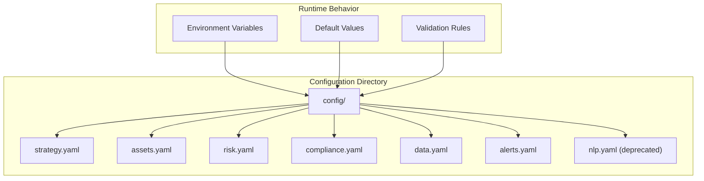
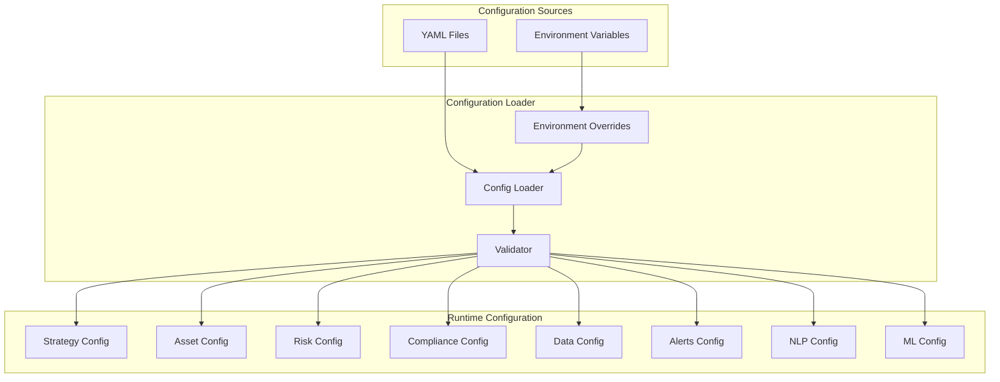
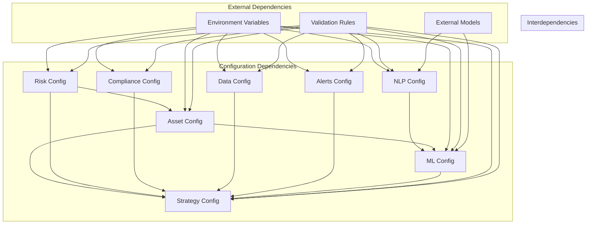

# Configuration Schema

<cite>
**Referenced Files in This Document**
- [PRD_Intelligent_Trading_System_v2.md](file://PRD_Intelligent_Trading_System_v2.md)
- [Tech_Design_Document.md](file://Tech_Design_Document.md)
- [strategy.yaml](file://config/strategy.yaml)
- [sentiment.py](file://src/nlp/sentiment.py)
- [cot.py](file://src/nlp/cot.py)
- [integrator.py](file://src/nlp/integrator.py)
- [trainer.py](file://src/ml/trainer.py)
</cite>

## Update Summary
**Changes Made**
- Added comprehensive NLP configuration section documenting FinBERT sentiment analysis
- Enhanced ML configuration with detailed hyperparameter optimization settings
- Updated strategy configuration to include NLP sentiment integration weights
- Added COT (Commitment of Traders) parameters and sentiment weighting mechanisms

## Table of Contents
1. [Introduction](#introduction)
2. [Project Structure](#project-structure)
3. [Core Components](#core-components)
4. [Architecture Overview](#architecture-overview)
5. [Detailed Component Analysis](#detailed-component-analysis)
6. [Dependency Analysis](#dependency-analysis)
7. [Performance Considerations](#performance-considerations)
8. [Troubleshooting Guide](#troubleshooting-guide)
9. [Conclusion](#conclusion)
10. [Appendices](#appendices)

## Introduction
This document provides a comprehensive configuration schema for the Intelligent Trading Decision System. It covers all system configuration options including strategy parameters, risk limits, data source settings, broker configurations, compliance rules, and the newly added NLP sentiment analysis capabilities. The schema documents YAML configuration formats, default values, validation rules, and environment-specific overrides. It also includes examples for different deployment scenarios and configuration best practices.

## Project Structure
The configuration system is organized around a modular structure with dedicated configuration files for strategies, assets, risk management, compliance, data sources, alerts, and now NLP sentiment analysis. The repository defines a clear directory layout for configuration files under a config/ folder.

**Diagram sources**
- [PRD_Intelligent_Trading_System_v2.md](file://PRD_Intelligent_Trading_System_v2.md#L1006-L1014)

**Section sources**
- [PRD_Intelligent_Trading_System_v2.md](file://PRD_Intelligent_Trading_System_v2.md#L1006-L1014)

## Core Components
The configuration schema encompasses the following core components:

- Strategy configuration: Defines strategy name, rebalancing frequency, and minimum rebalance threshold.
- Asset configuration: Specifies maximum weights, momentum lookback periods, volatility targets, and asset-specific stop losses for core and extended assets.
- Risk configuration: Establishes hierarchical risk levels, correlation thresholds, re-entry parameters, and portfolio constraints.
- Compliance configuration: Controls PDT tracking, wash sale tracking, and tax lot methods.
- Data configuration: Selects primary and fallback data sources, sets BTC-specific primary source, and configures caching backend.
- Alert configuration: Defines notification channels and environment variable overrides for webhook URLs and email addresses.
- **NLP configuration**: Manages FinBERT sentiment analysis, COT sentiment integration, and sentiment factor weights.
- **Enhanced ML configuration**: Includes hyperparameter optimization settings, model lifecycle management, and signal fusion parameters.

**Section sources**
- [PRD_Intelligent_Trading_System_v2.md](file://PRD_Intelligent_Trading_System_v2.md#L1227-L1323)

## Architecture Overview
The configuration architecture integrates YAML-based configuration files with environment variable overrides. The system supports deployment-specific overrides through environment variables, enabling flexible configuration across development, staging, and production environments. The NLP and enhanced ML components are seamlessly integrated into the existing configuration framework.

**Diagram sources**
- [Tech_Design_Document.md](file://Tech_Design_Document.md#L1174-L1217)
- [PRD_Intelligent_Trading_System_v2.md](file://PRD_Intelligent_Trading_System_v2.md#L1227-L1323)

## Detailed Component Analysis

### Strategy Configuration
The strategy configuration defines high-level strategy parameters and rebalancing behavior.

Key parameters:
- name: Strategy identifier (e.g., "momentum_risk_parity_v2")
- rebalance_frequency: Rebalancing cadence ("daily")
- min_rebalance_threshold: Minimum weight change threshold (default: 0.02)

Validation rules:
- name must be a non-empty string
- rebalance_frequency must be one of supported frequencies
- min_rebalance_threshold must be a positive decimal between 0 and 1

Default values:
- min_rebalance_threshold: 0.02 (2%)

Best practices:
- Set rebalance_frequency aligned with strategy horizon
- Adjust min_rebalance_threshold to balance transaction costs and drift control

**Section sources**
- [PRD_Intelligent_Trading_System_v2.md](file://PRD_Intelligent_Trading_System_v2.md#L1227-L1233)

### Asset Configuration
Asset configuration manages both core and extended asset parameters.

Core assets (GLD, SPY, QQQ, BTC-USD):
- max_weight: Maximum portfolio weight per asset
- momentum_lookback: Lookback period for momentum calculations
- vol_target: Target volatility for volatility targeting
- asset_stop_loss: Single asset stop loss threshold

Extended assets (15-asset pool):
- symbol: Asset identifier
- max_weight: Maximum portfolio weight for extended assets

Validation rules:
- max_weight values must sum to 1.0 across all assets
- momentum_lookback must be a positive integer
- vol_target must be a positive decimal between 0 and 1
- asset_stop_loss must be a positive decimal between 0 and 1

Default values:
- Core assets: Defined per asset specification
- Extended assets: Default max_weight varies by asset category

Best practices:
- Ensure max_weight allocations reflect asset characteristics
- Align momentum_lookback with strategy time horizon
- Set vol_target according to risk capacity

**Section sources**
- [PRD_Intelligent_Trading_System_v2.md](file://PRD_Intelligent_Trading_System_v2.md#L1234-L1270)

### Risk Configuration
Risk configuration establishes the hierarchical risk management system.

Risk levels:
- level_1: Drawdown trigger 0.05 with alert and confidence threshold increase
- level_2: Drawdown trigger 0.08 with 25% position reduction, BTC closure, and sell-only mode
- level_3: Drawdown trigger 0.12 with 50% position reduction and safe-haven focus
- level_4: Drawdown trigger 0.15 with emergency liquidation and manual review requirement

Correlation monitoring:
- warning_threshold: 0.7 for individual asset pairs
- portfolio_warning: 0.5 for portfolio average correlation
- extreme_threshold: 0.8 for all-assets same-direction correlation

Re-entry parameters:
- cooldown_days: 5 days of low volatility required
- initial_position_pct: 0.25 (25%) initial recovery position
- ramp_up_weekly_pct: 0.25 (25%) weekly ramp-up
- max_leverage_during_recovery: 1.0x maximum leverage during recovery

Portfolio constraints:
- max_portfolio_leverage: 1.5x maximum portfolio leverage
- cash_buffer: 0.05 (5%) minimum cash reserve
- max_daily_trades: 5 maximum daily trades
- max_daily_turnover: 0.30 (30%) maximum daily turnover
- commission_rate: 0.001 (0.1%) commission rate
- slippage_rate: 0.0005 (0.05%) slippage rate

Validation rules:
- Risk level thresholds must be monotonically increasing
- Correlation thresholds must satisfy warning < portfolio_warning < extreme
- Re-entry parameters must be positive decimals
- Portfolio constraints must be within acceptable ranges

Default values:
- All risk parameters defined in configuration schema

Best practices:
- Monitor correlation thresholds for early warning signals
- Use re-entry parameters to manage recovery from severe drawdowns
- Adjust leverage limits based on market conditions

**Section sources**
- [PRD_Intelligent_Trading_System_v2.md](file://PRD_Intelligent_Trading_System_v2.md#L1271-L1304)

### Compliance Configuration
Compliance configuration controls regulatory compliance features.

Parameters:
- pdt_tracking: Enable Pattern Day Trader rule tracking
- wash_sale_tracking: Enable wash sale rule tracking
- tax_lot_method: Tax lot accounting method (e.g., "FIFO")

Validation rules:
- pdt_tracking and wash_sale_tracking must be boolean values
- tax_lot_method must be one of supported methods

Default values:
- pdt_tracking: true
- wash_sale_tracking: true
- tax_lot_method: "FIFO"

Best practices:
- Enable pdt_tracking for accounts subject to PDT rules
- Configure tax_lot_method according to tax strategy
- Regularly review compliance settings for regulatory changes

**Section sources**
- [PRD_Intelligent_Trading_System_v2.md](file://PRD_Intelligent_Trading_System_v2.md#L1305-L1310)

### Data Configuration
Data configuration manages data source selection and caching.

Parameters:
- primary: Primary data source (e.g., "polygon")
- fallback: Fallback data source (e.g., "yfinance")
- btc_primary: BTC-specific primary source (e.g., "binance")
- cache_backend: Caching backend (e.g., "sqlite")
- cache_retention_days: Cache retention period (default: 30 days)

Validation rules:
- primary and fallback must be valid data source identifiers
- btc_primary must be a valid cryptocurrency data source
- cache_backend must be a supported caching mechanism

Default values:
- primary: "polygon"
- fallback: "yfinance"
- btc_primary: "binance"
- cache_backend: "sqlite"
- cache_retention_days: 30

Best practices:
- Choose primary data source based on data quality and cost
- Configure fallback for resilience and redundancy
- Use appropriate cache backend for deployment scale

**Section sources**
- [PRD_Intelligent_Trading_System_v2.md](file://PRD_Intelligent_Trading_System_v2.md#L1311-L1317)

### Alert Configuration
Alert configuration defines notification channels and environment overrides.

Parameters:
- channels: Enabled notification channels (e.g., ["slack", "email"])
- levels: Channel-specific alert levels (info, warning, critical, emergency)
- slack_webhook: Slack webhook URL (environment variable override)
- email_to: Email recipient address (environment variable override)

Validation rules:
- channels must be a non-empty list of supported channel types
- levels must define appropriate alert categories
- Environment variable overrides must be properly formatted URLs or email addresses

Default values:
- channels: ["slack", "email"]
- levels: {
  - info: ["daily_summary", "normal_signals"]
  - warning: ["risk_level_1", "data_quality"]
  - critical: ["risk_level_2_plus", "system_errors"]
  - emergency: ["risk_level_4", "system_crash"]
- slack_webhook: ${SLACK_WEBHOOK_URL}
- email_to: ${ALERT_EMAIL}

Best practices:
- Use environment variable overrides for sensitive credentials
- Configure multiple channels for redundancy
- Test alert configurations before deployment

**Section sources**
- [PRD_Intelligent_Trading_System_v2.md](file://PRD_Intelligent_Trading_System_v2.md#L1318-L1323)

### NLP Configuration
**Updated** Added comprehensive NLP sentiment analysis configuration

The NLP configuration enables advanced sentiment analysis capabilities through FinBERT and COT sentiment integration.

#### News Sentiment Configuration (FinBERT)
- model_name: FinBERT model for financial text analysis (default: "ProsusAI/finbert")
- use_gpu: Enable GPU acceleration for faster processing (default: false)
- batch_size: Processing batch size for sentiment analysis (default: 32)
- sentiment_momentum_window: 5-day moving average window for sentiment momentum (default: 5)
- min_articles_per_day: Minimum articles required for valid sentiment calculation (default: 3)
- use_gdelt: Enable GDELT news source (default: true)
- use_rss: Enable RSS feed news source (default: true)

#### COT Sentiment Configuration
- lookback_years: 3-year rolling percentile calculation window (default: 3)
- bullish_threshold: Extreme bullish threshold (default: 0.90)
- bearish_threshold: Extreme bearish threshold (default: 0.10)

#### Sentiment Integration Configuration
- news_weight: Weight for news sentiment in combined factor (default: 0.6)
- cot_weight: Weight for COT sentiment in combined factor (default: 0.4)
- min_shap_contribution: Minimum SHAP contribution threshold for feature retention (default: 0.05)

Validation rules:
- model_name must be a valid HuggingFace model identifier
- use_gpu must be boolean
- batch_size must be a positive integer
- sentiment_momentum_window must be a positive integer
- min_articles_per_day must be a positive integer
- lookback_years must be a positive integer
- thresholds must be between 0 and 1
- weights must sum to 1.0
- min_shap_contribution must be between 0 and 1

Default values:
- All NLP parameters defined in configuration schema

Best practices:
- Enable GPU acceleration for production deployments
- Monitor SHAP contributions to maintain model interpretability
- Balance news and COT weights based on market conditions
- Configure appropriate thresholds for contrarian signals

**Section sources**
- [strategy.yaml](file://config/strategy.yaml#L123-L147)
- [sentiment.py](file://src/nlp/sentiment.py#L49-L72)
- [cot.py](file://src/nlp/cot.py#L44-L59)
- [integrator.py](file://src/nlp/integrator.py#L15-L32)

### Enhanced ML Configuration
**Updated** Enhanced with comprehensive hyperparameter optimization settings

The ML configuration provides advanced machine learning capabilities with automatic hyperparameter optimization.

#### Feature Engineering Configuration
- return_periods: Time periods for return calculations (default: [1, 5, 10, 20, 60])
- volatility_periods: Time periods for volatility calculations (default: [5, 20, 60])
- ma_periods: Moving average periods (default: [5, 10, 20, 50, 200])
- min_ic_threshold: Minimum Information Coefficient threshold (default: 0.02)
- max_features: Maximum number of features to retain (default: 20)

#### Training Configuration
- model_type: Model algorithm selection (default: "xgboost")
- target_type: Prediction type (default: "binary")
- cv_method: Cross-validation method (default: "purged_walkforward")
- train_window: Training window length (default: 756)
- test_window: Testing window length (default: 126)
- purge_gap: Purge gap for walk-forward validation (default: 21)
- embargo_pct: Embargo period percentage (default: 0.02)

#### Hyperparameter Optimization Configuration
- enabled: Enable automatic hyperparameter optimization (default: true)
- max_trials: Maximum optimization trials (default: 100)
- timeout_seconds: Optimization timeout in seconds (default: 3600)

#### Signal Fusion Configuration
- ml_max_weight: Maximum weight for ML-generated signals (default: 0.50)
- traditional_min_weight: Minimum weight for traditional signals (default: 0.50)
- ic_threshold_degradation: IC degradation threshold (default: 0.02)
- disagreement_threshold: Signal disagreement threshold (default: 0.30)
- rolling_window: Rolling window for signal aggregation (default: 20)

#### Model Lifecycle Configuration
- retrain_monthly: Enable monthly model retraining (default: true)
- retrain_trigger_ic: IC threshold for forced retraining (default: 0.02)
- retire_ic_threshold: IC threshold for model retirement (default: 0.0)
- retire_ic_days: Days to wait before retirement (default: 30)
- drift_ks_alert: Kolmogorov-Smirnov drift alert threshold (default: 0.10)
- drift_ks_retrain: Drift threshold for automatic retraining (default: 0.20)
- min_ic_improvement: Minimum IC improvement threshold (default: 0.01)

Validation rules:
- model_type must be one of supported algorithms
- target_type must be "binary" or "regression"
- cv_method must be valid cross-validation method
- periods must be positive integers
- thresholds must be non-negative decimals
- weights must be between 0 and 1
- windows must be positive integers

Default values:
- All ML parameters defined in configuration schema

Best practices:
- Monitor IC improvements to determine optimal retraining schedules
- Use conservative thresholds for model retirement to avoid premature obsolescence
- Regularly evaluate model performance against drift thresholds
- Configure appropriate optimization timeouts for production environments

**Section sources**
- [strategy.yaml](file://config/strategy.yaml#L78-L121)
- [trainer.py](file://src/ml/trainer.py#L26-L76)

## Dependency Analysis
The configuration system exhibits clear separation of concerns with explicit dependencies between components. The addition of NLP and enhanced ML configurations creates new interdependencies.

**Diagram sources**
- [PRD_Intelligent_Trading_System_v2.md](file://PRD_Intelligent_Trading_System_v2.md#L1227-L1323)

**Section sources**
- [PRD_Intelligent_Trading_System_v2.md](file://PRD_Intelligent_Trading_System_v2.md#L1227-L1323)

## Performance Considerations
Configuration performance considerations include:

- YAML parsing overhead: Keep configuration files minimal and well-structured
- Environment variable resolution: Cache resolved values to avoid repeated environment lookups
- Validation performance: Implement lazy validation for optional configuration sections
- Memory usage: Store configuration objects efficiently to minimize memory footprint
- **NLP processing overhead**: GPU acceleration significantly improves FinBERT performance
- **Hyperparameter optimization**: Configure appropriate timeouts to avoid blocking training processes
- **Model lifecycle management**: Implement efficient model versioning and cleanup procedures

## Troubleshooting Guide
Common configuration issues and resolutions:

- Invalid YAML syntax: Validate YAML files using standard validators
- Missing environment variables: Ensure all environment variable overrides are properly set
- Parameter conflicts: Verify that configuration parameters are consistent with each other
- Data source connectivity: Test data source connections before deployment
- Alert delivery failures: Validate webhook URLs and email configurations
- **NLP model loading failures**: Verify HuggingFace model availability and GPU memory allocation
- **Hyperparameter optimization timeouts**: Increase timeout values for complex model optimization
- **SHAP analysis failures**: Ensure SHAP library is installed and model supports explainability

**Section sources**
- [Tech_Design_Document.md](file://Tech_Design_Document.md#L1054-L1071)

## Conclusion
The configuration schema provides a comprehensive and flexible framework for managing the Intelligent Trading Decision System. It supports environment-specific overrides, validates critical parameters, and enables deployment flexibility across different environments. The addition of NLP sentiment analysis and enhanced ML capabilities significantly expands the system's analytical capabilities while maintaining the modular design that allows for easy maintenance and extension of configuration options as the system evolves.

## Appendices

### Configuration Best Practices
- Use environment variable overrides for sensitive data
- Validate configuration files before deployment
- Document configuration changes in version control
- Test configuration changes in staging environments
- Monitor configuration drift across deployments
- **Implement GPU acceleration for NLP processing in production**
- **Configure appropriate hyperparameter optimization parameters for model performance**
- **Regularly review SHAP contributions to maintain model interpretability**

### Environment-Specific Configuration Examples
Development environment:
- Lower risk thresholds for testing
- Reduced transaction cost assumptions
- Simplified alert configurations
- **GPU acceleration disabled for CPU-only development**

Production environment:
- Conservative risk parameters
- Full compliance tracking enabled
- Robust alerting and monitoring
- **GPU acceleration enabled for NLP processing**
- **Hyperparameter optimization configured with appropriate timeouts**

**Section sources**
- [Tech_Design_Document.md](file://Tech_Design_Document.md#L1174-L1217)