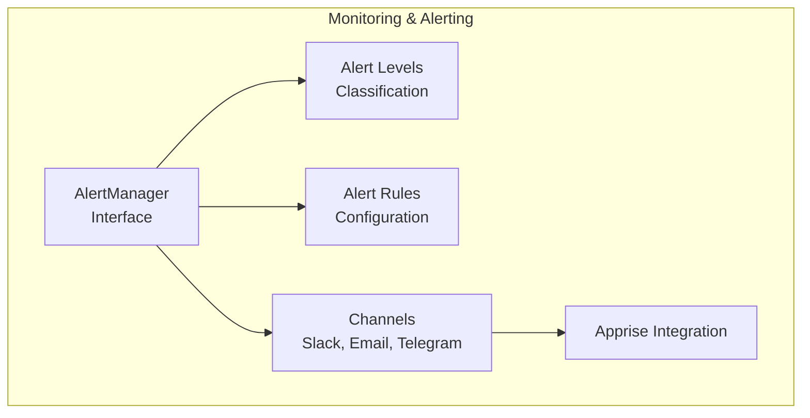
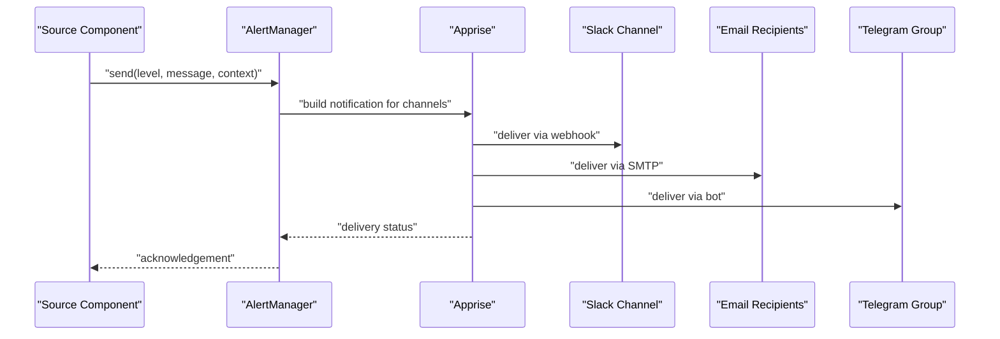
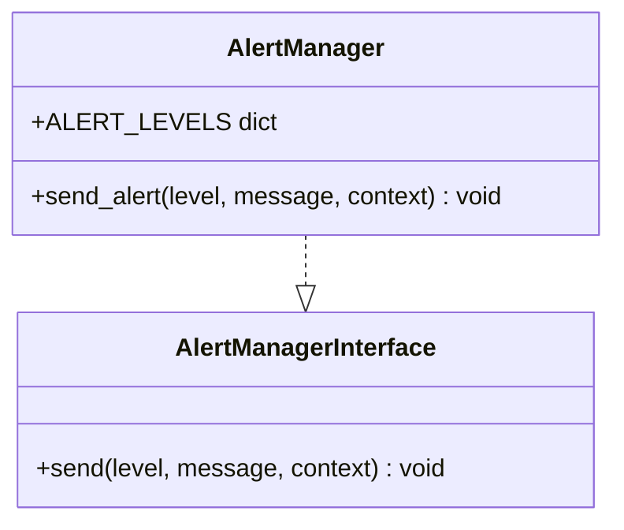
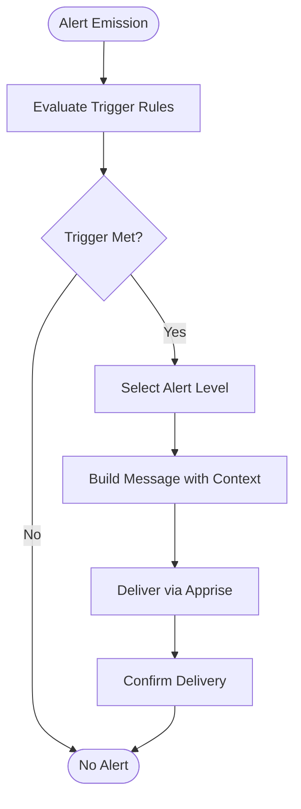
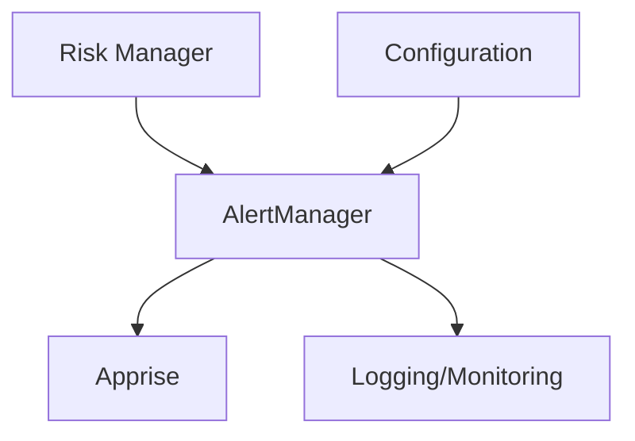

# AlertManager Interface

<cite>
**Referenced Files in This Document**
- [PRD_Intelligent_Trading_System_v2.md](file://PRD_Intelligent_Trading_System_v2.md)
- [Tech_Design_Document.md](file://Tech_Design_Document.md)
</cite>

## Table of Contents
1. [Introduction](#introduction)
2. [Project Structure](#project-structure)
3. [Core Components](#core-components)
4. [Architecture Overview](#architecture-overview)
5. [Detailed Component Analysis](#detailed-component-analysis)
6. [Dependency Analysis](#dependency-analysis)
7. [Performance Considerations](#performance-considerations)
8. [Troubleshooting Guide](#troubleshooting-guide)
9. [Conclusion](#conclusion)
10. [Appendices](#appendices)

## Introduction
This document provides comprehensive API documentation for the AlertManager interface class responsible for multi-channel alert distribution across Slack, Email, and Telegram platforms. It covers alert level classification, alert rule configuration, notification delivery mechanisms, channel-specific formatting, escalation procedures, context data structures, integration with external notification services via Apprise, alert throttling, delivery confirmation, and monitoring of notification system health.

## Project Structure
The AlertManager interface is defined within the technical design documentation alongside other core system components. It participates in the monitoring and alerting subsystem of the intelligent trading system.

**Section sources**
- [Tech_Design_Document.md](file://Tech_Design_Document.md#L815-L833)
- [PRD_Intelligent_Trading_System_v2.md](file://PRD_Intelligent_Trading_System_v2.md#L401-L416)

## Core Components
- AlertManager interface: Defines the contract for sending alerts across multiple channels.
- Alert levels: INFO, WARNING, CRITICAL, EMERGENCY with associated risk contexts.
- Alert rules: Trigger conditions for alert emission.
- Channels: Slack, Email, Telegram configured via Apprise.
- Context data: Structured payload for alert messages.

**Section sources**
- [Tech_Design_Document.md](file://Tech_Design_Document.md#L815-L833)
- [PRD_Intelligent_Trading_System_v2.md](file://PRD_Intelligent_Trading_System_v2.md#L401-L416)

## Architecture Overview
The AlertManager sits within the monitoring and alerting subsystem, coordinating alert emission across multiple channels using Apprise. It receives alert level, message, and context, then dispatches notifications accordingly.

**Diagram sources**
- [Tech_Design_Document.md](file://Tech_Design_Document.md#L815-L833)
- [PRD_Intelligent_Trading_System_v2.md](file://PRD_Intelligent_Trading_System_v2.md#L401-L416)

## Detailed Component Analysis

### AlertManager Interface
- Purpose: Centralized alerting interface for multi-channel notifications.
- Methods:
  - send(level, message, context): Dispatches alerts across configured channels.
- Integration: Uses Apprise for channel abstraction and delivery.

**Section sources**
- [Tech_Design_Document.md](file://Tech_Design_Document.md#L1476-L1483)
- [Tech_Design_Document.md](file://Tech_Design_Document.md#L815-L833)

### Alert Level Classification
- INFO: Normal trading signals and daily summaries.
- WARNING: Risk Level 1 and data quality issues.
- CRITICAL: Risk Level 2+ and system errors.
- EMERGENCY: Risk Level 4 and system crashes.

These classifications align with the hierarchical risk management system and inform escalation behavior.

**Section sources**
- [PRD_Intelligent_Trading_System_v2.md](file://PRD_Intelligent_Trading_System_v2.md#L405-L409)
- [Tech_Design_Document.md](file://Tech_Design_Document.md#L352-L404)

### Alert Rule Configuration
- Data acquisition failure (consecutive failures): CRITICAL.
- Broker API connection lost: CRITICAL.
- Unknown exception: CRITICAL plus automatic trading suspension.
- Daily close summary: INFO.

Rules drive when and how often alerts are emitted, supporting both routine and emergency communications.

**Section sources**
- [PRD_Intelligent_Trading_System_v2.md](file://PRD_Intelligent_Trading_System_v2.md#L411-L415)

### Notification Delivery Mechanisms
- Channels: Slack, Email, Telegram.
- Transport: Apprise library for unified multi-channel delivery.
- Configuration: Channels and credentials are managed via environment variables and configuration files.

**Section sources**
- [PRD_Intelligent_Trading_System_v2.md](file://PRD_Intelligent_Trading_System_v2.md#L401-L416)
- [Tech_Design_Document.md](file://Tech_Design_Document.md#L121-L140)

### Channel-Specific Formatting
- Slack: Webhook URL configured via environment variable; formatted for chat consumption.
- Email: Recipient list configured via environment variable; structured for digest-style summaries.
- Telegram: Bot-based delivery; formatted for concise notifications.

Formatting ensures readability and actionable insights across channels.

**Section sources**
- [PRD_Intelligent_Trading_System_v2.md](file://PRD_Intelligent_Trading_System_v2.md#L1318-L1323)
- [Tech_Design_Document.md](file://Tech_Design_Document.md#L121-L140)

### Escalation Procedures
Escalation is implicit in the alert level classification and risk management hierarchy:
- INFO: Routine updates; minimal escalation.
- WARNING: Risk Level 1; increased confidence thresholds and restrictions.
- CRITICAL: Risk Level 2+; system errors and trading controls.
- EMERGENCY: Risk Level 4; system crash requiring manual intervention.

Escalation influences both alert content and downstream operational actions.

**Section sources**
- [PRD_Intelligent_Trading_System_v2.md](file://PRD_Intelligent_Trading_System_v2.md#L405-L409)
- [Tech_Design_Document.md](file://Tech_Design_Document.md#L352-L404)

### Alert Level Enumeration
While the AlertManager defines a dictionary of alert levels, a dedicated enumeration is not present in the provided documents. The levels are represented as string keys with associated descriptors.

**Section sources**
- [Tech_Design_Document.md](file://Tech_Design_Document.md#L815-L833)

### Context Data Structures
Context is a structured dictionary passed to the AlertManager’s send method. Typical fields include:
- Event metadata: timestamp, severity, source component.
- Portfolio state: NAV, drawdown, risk level.
- Strategy state: signals, targets, reasons.
- System state: health metrics, error counts.

Context enables rich, actionable alerts tailored to the recipient’s role and urgency.

**Section sources**
- [Tech_Design_Document.md](file://Tech_Design_Document.md#L815-L833)

### Integration with External Notification Services via Apprise
- Apprise is used to abstract channel-specific APIs and credentials.
- Configuration includes channel endpoints and secrets stored in environment variables.
- Delivery is asynchronous; status is tracked for monitoring and retries.

**Section sources**
- [Tech_Design_Document.md](file://Tech_Design_Document.md#L121-L140)
- [Tech_Design_Document.md](file://Tech_Design_Document.md#L815-L833)

### Alert Throttling
- Throttling is not explicitly defined in the provided documents.
- Recommended practice: Implement rate limiting per channel and per alert type to avoid alert fatigue.
- Consider time-based suppression windows for repeated identical events.

[No sources needed since this section provides general guidance]

### Delivery Confirmation
- Delivery confirmation is not explicitly defined in the provided documents.
- Recommended practice: Capture delivery receipts and track failures for reattempts.
- Maintain a delivery log for auditability and troubleshooting.

[No sources needed since this section provides general guidance]

### Monitoring Notification System Health
- Health checks: Verify channel connectivity and credential validity periodically.
- Metrics: Track alert delivery latency, success rate, and retry counts.
- Dashboards: Display recent alerts and system health indicators.

**Section sources**
- [Tech_Design_Document.md](file://Tech_Design_Document.md#L1233-L1270)

## Dependency Analysis
The AlertManager depends on:
- Risk manager for determining alert levels.
- Configuration system for channel endpoints and credentials.
- Apprise for transport abstraction.
- Logging and monitoring for observability.

**Diagram sources**
- [Tech_Design_Document.md](file://Tech_Design_Document.md#L352-L404)
- [Tech_Design_Document.md](file://Tech_Design_Document.md#L121-L140)
- [Tech_Design_Document.md](file://Tech_Design_Document.md#L1233-L1270)

**Section sources**
- [Tech_Design_Document.md](file://Tech_Design_Document.md#L352-L404)
- [Tech_Design_Document.md](file://Tech_Design_Document.md#L121-L140)
- [Tech_Design_Document.md](file://Tech_Design_Document.md#L1233-L1270)

## Performance Considerations
- Asynchronous delivery: Use non-blocking calls to Apprise to avoid impacting core trading operations.
- Batch alerts: Group related events to reduce channel traffic.
- Retry policies: Implement exponential backoff for transient failures.
- Circuit breakers: Temporarily disable channels under sustained failure conditions.

[No sources needed since this section provides general guidance]

## Troubleshooting Guide
Common issues and resolutions:
- Channel connectivity failures: Verify webhook URLs, SMTP settings, and bot tokens.
- Authentication errors: Check environment variables and secret rotation.
- Rate limits: Implement throttling and backoff strategies.
- Silent failures: Enable detailed logging and delivery receipts.

**Section sources**
- [Tech_Design_Document.md](file://Tech_Design_Document.md#L121-L140)
- [Tech_Design_Document.md](file://Tech_Design_Document.md#L1233-L1270)

## Conclusion
The AlertManager interface provides a robust foundation for multi-channel alerting within the intelligent trading system. Its integration with Apprise, alignment with risk levels, and structured context enable timely and actionable communications across Slack, Email, and Telegram. While explicit throttling and delivery confirmation are not defined in the documents, adopting industry best practices will enhance reliability and operability.

## Appendices
- Configuration examples demonstrate channel setup and environment variables.
- Example alert triggering workflows illustrate rule-driven emissions.

**Section sources**
- [PRD_Intelligent_Trading_System_v2.md](file://PRD_Intelligent_Trading_System_v2.md#L1318-L1323)