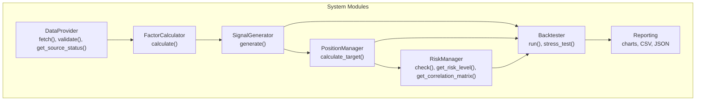
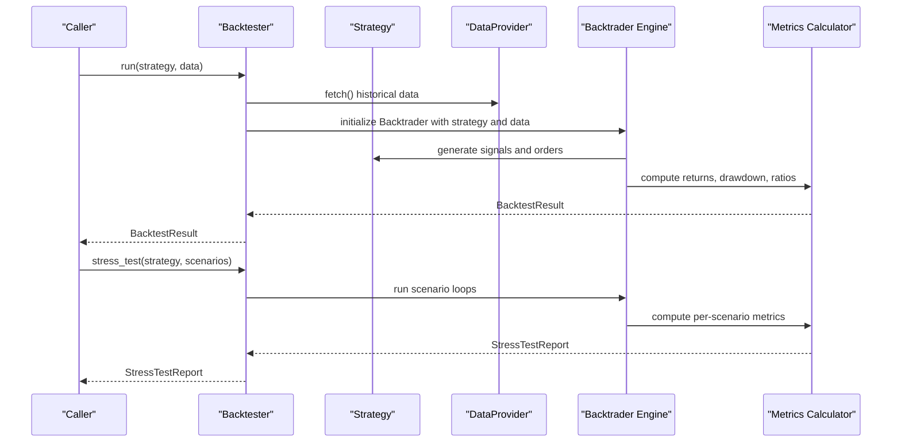
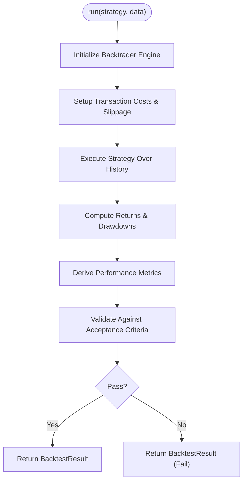
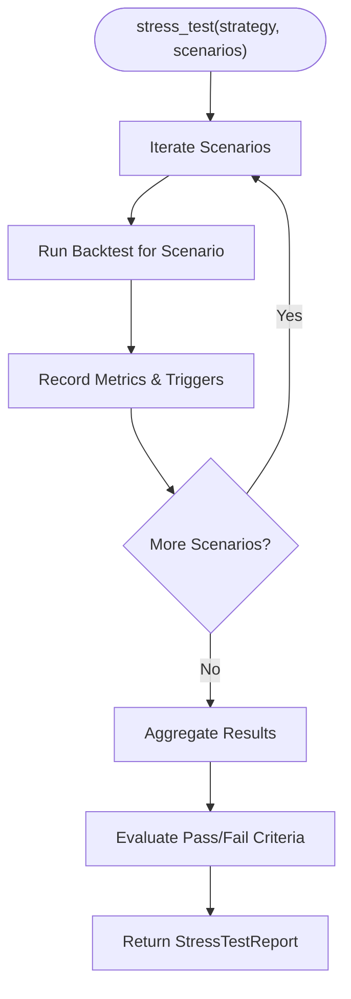
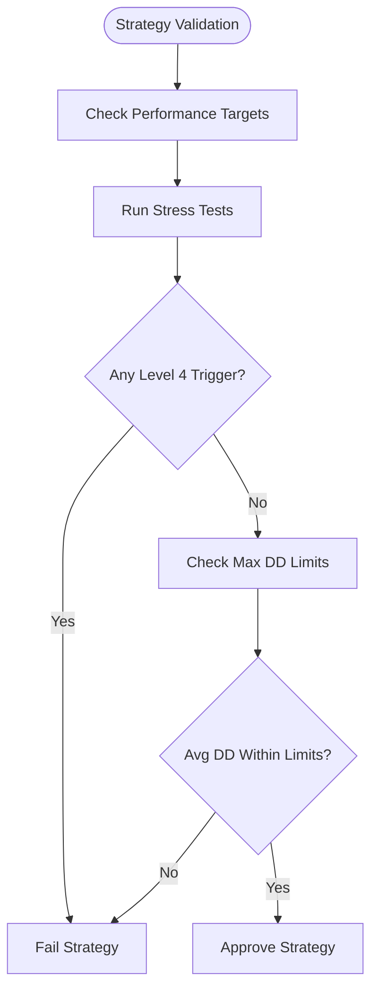
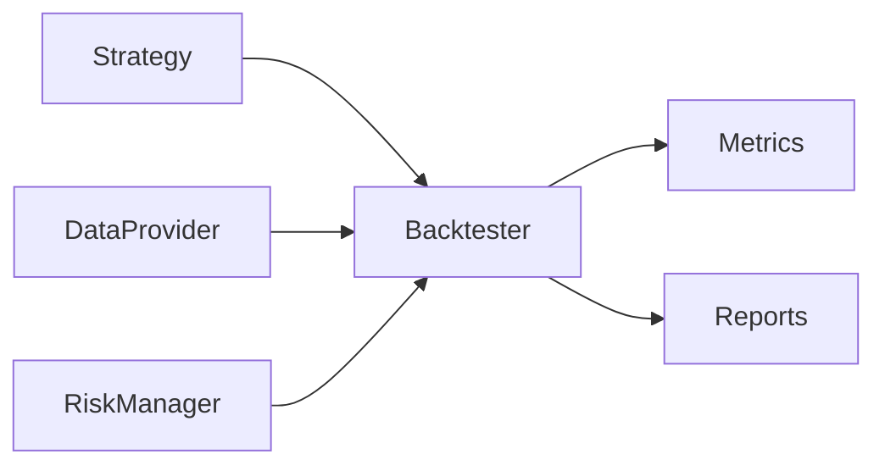

# Backtester Interface

<cite>
**Referenced Files in This Document**
- [PRD_Intelligent_Trading_System_v2.md](file://PRD_Intelligent_Trading_System_v2.md)
- [Tech_Design_Document.md](file://Tech_Design_Document.md)
</cite>

## Table of Contents
1. [Introduction](#introduction)
2. [Project Structure](#project-structure)
3. [Core Components](#core-components)
4. [Architecture Overview](#architecture-overview)
5. [Detailed Component Analysis](#detailed-component-analysis)
6. [Dependency Analysis](#dependency-analysis)
7. [Performance Considerations](#performance-considerations)
8. [Troubleshooting Guide](#troubleshooting-guide)
9. [Conclusion](#conclusion)
10. [Appendices](#appendices)

## Introduction
This document provides comprehensive API documentation for the Backtester interface class, focusing on:
- The run() method for executing historical strategy backtests
- The stress_test() method for comprehensive scenario validation
- Backtrader integration and strategy testing frameworks
- Performance metric calculation and reporting
- Backtesting workflows, stress testing scenario configuration, and result interpretation
- BacktestResult and StressTestReport data structures
- Performance benchmarking and comparison methodologies
- Data requirements for historical testing, transaction cost modeling, and validation criteria for strategy acceptance

The Backtester interface is defined in the product requirements and technical design documents and integrates with the broader trading system’s modular architecture.

## Project Structure
The Backtester resides within the trading system’s modular architecture and interacts with the data layer, factor calculation, signal generation, portfolio optimization, risk management, and reporting modules. The system commits to Backtrader as the sole backtesting framework.

**Diagram sources**
- [Tech_Design_Document.md](file://Tech_Design_Document.md#L34-L86)
- [PRD_Intelligent_Trading_System_v2.md](file://PRD_Intelligent_Trading_System_v2.md#L418-L455)

**Section sources**
- [Tech_Design_Document.md](file://Tech_Design_Document.md#L34-L86)
- [PRD_Intelligent_Trading_System_v2.md](file://PRD_Intelligent_Trading_System_v2.md#L418-L455)

## Core Components
The Backtester interface defines two primary methods:
- run(strategy, data) -> BacktestResult
- stress_test(strategy, scenarios) -> StressTestReport

These methods orchestrate historical simulation and scenario validation respectively, integrating with the rest of the system to compute performance metrics and enforce validation criteria.

Key responsibilities:
- Historical backtest execution using Backtrader
- Scenario-driven stress testing across predefined and synthetic regimes
- Transaction cost modeling and performance attribution
- Validation against acceptance criteria and risk thresholds

**Section sources**
- [PRD_Intelligent_Trading_System_v2.md](file://PRD_Intelligent_Trading_System_v2.md#L444-L446)
- [Tech_Design_Document.md](file://Tech_Design_Document.md#L121-L140)

## Architecture Overview
The Backtester sits at the intersection of strategy composition and performance evaluation. It consumes:
- Strategy objects implementing signal and portfolio logic
- Historical OHLCV data for multiple assets
- Risk and compliance constraints
- Transaction cost assumptions

It produces:
- BacktestResult with aggregated performance metrics
- StressTestReport with per-scenario outcomes and pass/fail status

**Diagram sources**
- [Tech_Design_Document.md](file://Tech_Design_Document.md#L121-L140)
- [PRD_Intelligent_Trading_System_v2.md](file://PRD_Intelligent_Trading_System_v2.md#L444-L446)

## Detailed Component Analysis

### Backtester.run() API
Purpose:
- Execute a historical backtest over the provided dataset
- Enforce transaction costs, slippage, and position constraints
- Compute comprehensive performance metrics

Inputs:
- strategy: Strategy object implementing signal and portfolio logic
- data: Dict[str, pd.DataFrame] containing OHLCV for each symbol

Outputs:
- BacktestResult: structured performance summary

Processing logic outline:
- Initialize Backtrader engine with strategy and data
- Configure transaction cost model and slippage
- Execute the strategy over the historical period
- Aggregate daily returns, compute drawdowns, and derive metrics
- Produce BacktestResult with standardized fields

Validation criteria:
- Acceptance thresholds for key metrics (see Performance Targets)

**Diagram sources**
- [Tech_Design_Document.md](file://Tech_Design_Document.md#L121-L140)
- [PRD_Intelligent_Trading_System_v2.md](file://PRD_Intelligent_Trading_System_v2.md#L334-L362)

**Section sources**
- [PRD_Intelligent_Trading_System_v2.md](file://PRD_Intelligent_Trading_System_v2.md#L334-L362)
- [Tech_Design_Document.md](file://Tech_Design_Document.md#L121-L140)

### Backtester.stress_test() API
Purpose:
- Validate strategy resilience under adverse and synthetic market conditions
- Enforce pass/fail criteria across all scenarios

Inputs:
- strategy: Strategy object
- scenarios: List[StressScenario] defining periods and constraints

Processing logic outline:
- Iterate through each scenario (historical and synthetic)
- Run Backtrader simulation for each scenario
- Track maximum drawdown, risk level triggers, and other scenario-specific metrics
- Aggregate per-scenario results into a consolidated report

Validation criteria:
- No single scenario exceeds max drawdown thresholds
- Average drawdown across scenarios remains within limits
- No scenario triggers emergency risk level (Level 4)

**Diagram sources**
- [Tech_Design_Document.md](file://Tech_Design_Document.md#L890-L933)
- [PRD_Intelligent_Trading_System_v2.md](file://PRD_Intelligent_Trading_System_v2.md#L351-L362)

**Section sources**
- [Tech_Design_Document.md](file://Tech_Design_Document.md#L890-L933)
- [PRD_Intelligent_Trading_System_v2.md](file://PRD_Intelligent_Trading_System_v2.md#L351-L362)

### Backtrader Integration
- Backtrader is the unified backtesting framework for the system
- The Backtester initializes the engine, wires strategy and data, and executes simulations
- Transaction cost modeling and slippage are configured centrally

Benefits:
- Mature ecosystem, extensive documentation, and community support
- Seamless integration with pandas DataFrames and downstream metrics computation

**Section sources**
- [Tech_Design_Document.md](file://Tech_Design_Document.md#L121-L140)
- [PRD_Intelligent_Trading_System_v2.md](file://PRD_Intelligent_Trading_System_v2.md#L23)

### Performance Metric Calculation
Core metrics computed during backtests:
- Cumulative Return
- Annualized Return
- Annualized Volatility
- Sharpe Ratio
- Max Drawdown
- Calmar Ratio
- Win Rate
- Profit Factor
- Turnover Rate
- Cost Drag

Acceptance targets and minimums define strategy viability thresholds.

**Section sources**
- [PRD_Intelligent_Trading_System_v2.md](file://PRD_Intelligent_Trading_System_v2.md#L339-L350)
- [PRD_Intelligent_Trading_System_v2.md](file://PRD_Intelligent_Trading_System_v2.md#L854-L864)

### Data Requirements for Historical Testing
- Multi-asset OHLCV datasets spanning sufficient history for robust statistics
- Data quality validation to ensure reliability
- Cost model configuration per asset class (commissions, slippage)

Constraints:
- Minimum trade amount and rebalance thresholds
- Cash buffer and leverage caps
- Maximum daily turnover and trade counts

**Section sources**
- [Tech_Design_Document.md](file://Tech_Design_Document.md#L190-L204)
- [PRD_Intelligent_Trading_System_v2.md](file://PRD_Intelligent_Trading_System_v2.md#L184-L201)

### Transaction Cost Modeling
- Commissions: 0.10% for ETFs, 0.10% for Bitcoin
- Slippage: 0.05% for liquidity ETFs, 0.15% for Bitcoin
- Minimum trade units and cost drag estimation included in metrics

These assumptions are embedded in the Backtester to reflect realistic trading costs.

**Section sources**
- [Tech_Design_Document.md](file://Tech_Design_Document.md#L190-L196)
- [PRD_Intelligent_Trading_System_v2.md](file://PRD_Intelligent_Trading_System_v2.md#L270-L274)

### Validation Criteria for Strategy Acceptance
- Performance targets and minimums define pass/fail boundaries
- Stress testing requires all scenarios to pass, with no Level 4 risk triggers

**Diagram sources**
- [PRD_Intelligent_Trading_System_v2.md](file://PRD_Intelligent_Trading_System_v2.md#L854-L864)
- [PRD_Intelligent_Trading_System_v2.md](file://PRD_Intelligent_Trading_System_v2.md#L358-L362)

**Section sources**
- [PRD_Intelligent_Trading_System_v2.md](file://PRD_Intelligent_Trading_System_v2.md#L854-L864)
- [PRD_Intelligent_Trading_System_v2.md](file://PRD_Intelligent_Trading_System_v2.md#L358-L362)

### BacktestResult and StressTestReport Data Structures
BacktestResult:
- Fields: cumulative_return, annualized_return, annualized_volatility, sharpe_ratio, max_drawdown, calmar_ratio, win_rate, profit_factor, turnover_rate, cost_drag, and any additional derived metrics
- Purpose: summarize strategy performance over the historical period

StressTestReport:
- Fields: scenario_results (per-scenario metrics and outcomes), overall_metrics (aggregate across scenarios), pass_fail_status, and any risk trigger logs
- Purpose: validate strategy robustness across adverse market conditions

Note: The exact field names and types are defined by the implementation; the Backtester interface specifies the outputs.

**Section sources**
- [PRD_Intelligent_Trading_System_v2.md](file://PRD_Intelligent_Trading_System_v2.md#L339-L350)
- [Tech_Design_Document.md](file://Tech_Design_Document.md#L890-L933)

### Performance Benchmarking and Comparison Methodologies
- Use standardized metrics to compare strategies across identical historical periods
- Normalize by volatility and time horizon (annualized metrics)
- Compare Sharpe ratios, maximum drawdowns, and turnover rates
- Employ walk-forward or CPCV validation for robustness

**Section sources**
- [PRD_Intelligent_Trading_System_v2.md](file://PRD_Intelligent_Trading_System_v2.md#L1077-L1089)
- [Tech_Design_Document.md](file://Tech_Design_Document.md#L501-L524)

### Examples of Backtesting Workflows
- Basic backtest: prepare data, configure strategy, run Backtester.run(), interpret BacktestResult
- Stress testing: define scenarios, run Backtester.stress_test(), review StressTestReport, address failing scenarios

**Section sources**
- [PRD_Intelligent_Trading_System_v2.md](file://PRD_Intelligent_Trading_System_v2.md#L1294-L1309)
- [Tech_Design_Document.md](file://Tech_Design_Document.md#L1006-L1113)

### Stress Testing Scenario Configuration
- Historical scenarios: 2008 Financial Crisis, COVID Crash, 2022 Rate Hikes, custom synthetic all-asset decline
- Synthetic scenarios: simulate uniform market-wide declines for robustness
- Pass criteria: single-scenario max drawdown thresholds, average drawdown limits, no Level 4 triggers

**Section sources**
- [Tech_Design_Document.md](file://Tech_Design_Document.md#L892-L918)
- [PRD_Intelligent_Trading_System_v2.md](file://PRD_Intelligent_Trading_System_v2.md#L351-L362)

### Result Interpretation
- Positive Sharpe and Calmar ratios indicate risk-adjusted performance
- Max drawdown and turnover help assess downside risk and trading activity
- Stress test outcomes inform strategy robustness and risk control effectiveness

**Section sources**
- [PRD_Intelligent_Trading_System_v2.md](file://PRD_Intelligent_Trading_System_v2.md#L854-L864)
- [PRD_Intelligent_Trading_System_v2.md](file://PRD_Intelligent_Trading_System_v2.md#L1077-L1089)

## Dependency Analysis
The Backtester depends on:
- Strategy interface for signal and portfolio logic
- DataProvider for reliable historical data
- RiskManager for constraint enforcement and risk triggers
- Metrics calculator for performance aggregation
- Reporting subsystem for output artifacts

**Diagram sources**
- [PRD_Intelligent_Trading_System_v2.md](file://PRD_Intelligent_Trading_System_v2.md#L418-L455)
- [Tech_Design_Document.md](file://Tech_Design_Document.md#L34-L86)

**Section sources**
- [PRD_Intelligent_Trading_System_v2.md](file://PRD_Intelligent_Trading_System_v2.md#L418-L455)
- [Tech_Design_Document.md](file://Tech_Design_Document.md#L34-L86)

## Performance Considerations
- Backtest speed targets and memory usage are defined for scalability
- Multi-asset extended universe increases computational load; optimization and caching strategies are recommended
- Cost drag estimates should be validated against realized trading costs

**Section sources**
- [Tech_Design_Document.md](file://Tech_Design_Document.md#L1075-L1111)
- [Tech_Design_Document.md](file://Tech_Design_Document.md#L190-L204)

## Troubleshooting Guide
Common issues and resolutions:
- Data quality problems: validate inputs and handle missing periods gracefully
- Overfitting: employ walk-forward validation and stress testing
- Excessive turnover or cost drag: adjust position constraints and rebalance thresholds
- Stress test failures: refine risk controls and scenario definitions

**Section sources**
- [PRD_Intelligent_Trading_System_v2.md](file://PRD_Intelligent_Trading_System_v2.md#L1294-L1309)
- [Tech_Design_Document.md](file://Tech_Design_Document.md#L501-L524)

## Conclusion
The Backtester interface provides a robust foundation for historical strategy validation and stress testing within the intelligent trading system. By integrating with Backtrader, enforcing transaction cost modeling, and applying strict acceptance criteria, it ensures strategies meet both performance targets and resilience requirements before progressing to paper trading and beyond.

## Appendices
- Stress testing scenarios and pass criteria are documented for reproducible validation
- Reporting outputs include charts, CSV trade records, and JSON signal reports

**Section sources**
- [Tech_Design_Document.md](file://Tech_Design_Document.md#L890-L933)
- [PRD_Intelligent_Trading_System_v2.md](file://PRD_Intelligent_Trading_System_v2.md#L364-L379)