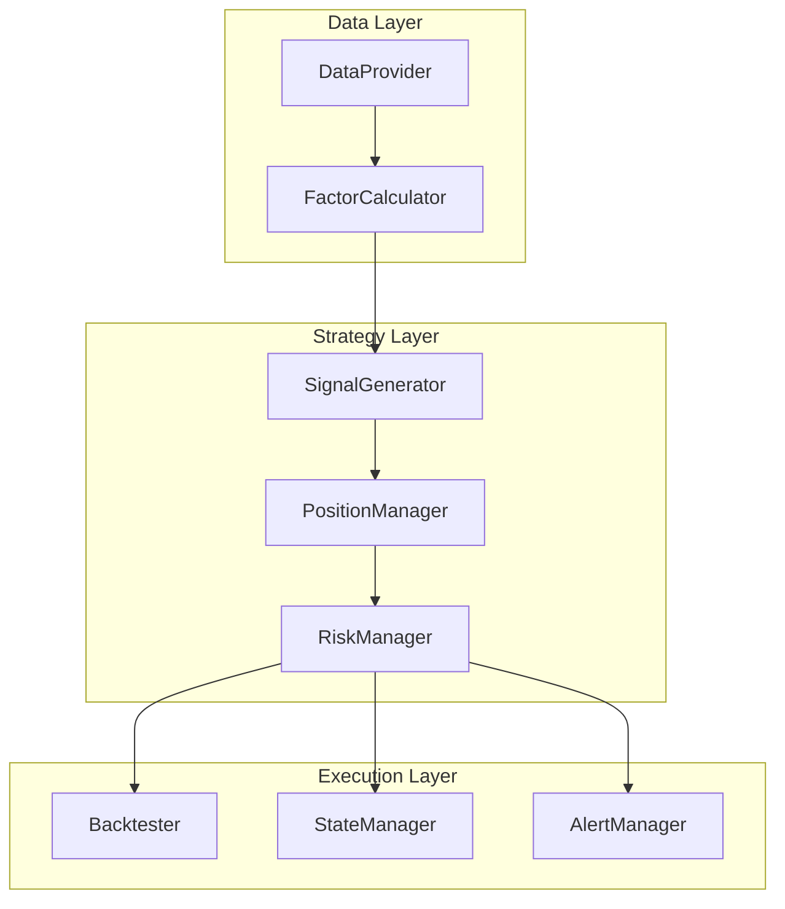
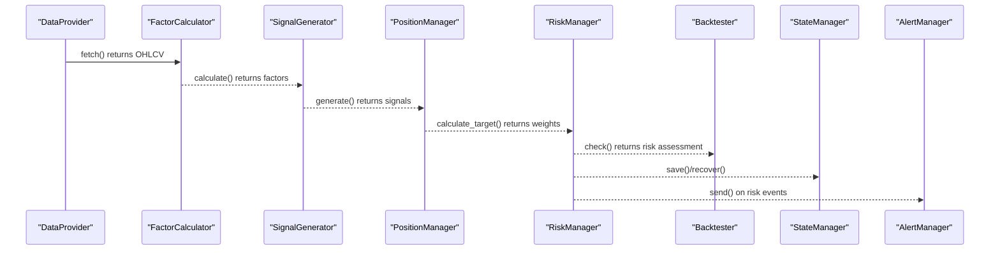
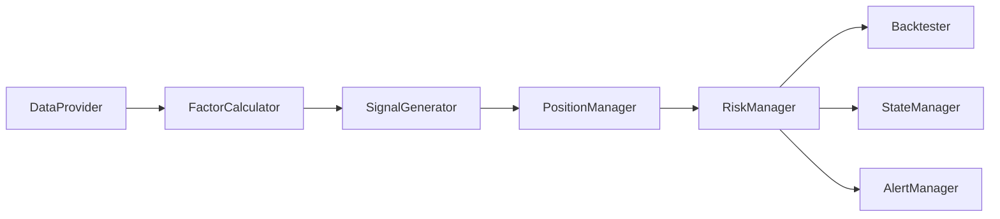

# Core Interfaces

<cite>
**Referenced Files in This Document**
- [PRD_Intelligent_Trading_System_v2.md](file://PRD_Intelligent_Trading_System_v2.md)
- [Tech_Design_Document.md](file://Tech_Design_Document.md)
</cite>

## Table of Contents
1. [Introduction](#introduction)
2. [Project Structure](#project-structure)
3. [Core Components](#core-components)
4. [Architecture Overview](#architecture-overview)
5. [Detailed Component Analysis](#detailed-component-analysis)
6. [Dependency Analysis](#dependency-analysis)
7. [Performance Considerations](#performance-considerations)
8. [Troubleshooting Guide](#troubleshooting-guide)
9. [Conclusion](#conclusion)
10. [Appendices](#appendices)

## Introduction
This document describes the core trading system interfaces that define the contract between modules in the intelligent trading decision system. It focuses on the following interfaces:
- DataProvider
- FactorCalculator
- SignalGenerator
- PositionManager
- RiskManager
- Backtester
- StateManager
- AlertManager

It explains method signatures, parameters, return values, error handling patterns, configuration schemas, and integration workflows from data acquisition through signal generation to execution.

## Project Structure
The system is organized into layers and modules aligned with the PRD and Technical Design Document. The core interfaces are defined in the PRD and formalized as abstract base classes in the Technical Design Document.

**Diagram sources**
- [Tech_Design_Document.md](file://Tech_Design_Document.md#L38-L117)
- [PRD_Intelligent_Trading_System_v2.md](file://PRD_Intelligent_Trading_System_v2.md#L418-L455)

**Section sources**
- [Tech_Design_Document.md](file://Tech_Design_Document.md#L38-L117)
- [PRD_Intelligent_Trading_System_v2.md](file://PRD_Intelligent_Trading_System_v2.md#L418-L455)

## Core Components
This section documents each core interface with method signatures, parameters, return values, and error handling patterns. It also provides configuration schemas and integration patterns.

### DataProvider
Purpose: Acquire OHLCV data from multiple sources with fallback and validation.

Methods
- fetch(symbols: List[str], start: str, end: str) -> Dict[str, pd.DataFrame]
  - Parameters:
    - symbols: list of asset identifiers
    - start: ISO date string
    - end: ISO date string
  - Returns: dictionary mapping symbol to OHLCV DataFrame
  - Error handling: Implements retry with exponential backoff and circuit breaker; raises exceptions on persistent failures; returns partial data if available
- validate(data: pd.DataFrame) -> DataQualityReport
  - Parameters:
    - data: DataFrame to validate
  - Returns: DataQualityReport indicating validity and issues
  - Error handling: Detects excessive price jumps, missing data proportions, and cross-source deviations; may raise warnings or reject invalid segments
- get_source_status() -> Dict[str, str]
  - Returns: health status per data source
  - Error handling: Returns status for each source; may indicate degraded or unavailable

Configuration schema (example)
- Primary sources: Polygon.io (US/EFT), Binance API (BTC)
- Fallback: yfinance
- Cache: SQLite cache layer
- Retry policy: exponential backoff up to a maximum number of attempts
- Validation thresholds:
  - Price jump threshold
  - Missing data percentage threshold
  - Cross-source deviation threshold

Integration pattern
- Called by FactorCalculator to obtain price series
- Validates data before factor computation
- Provides status for monitoring and alerting

**Section sources**
- [PRD_Intelligent_Trading_System_v2.md](file://PRD_Intelligent_Trading_System_v2.md#L184-L201)
- [Tech_Design_Document.md](file://Tech_Design_Document.md#L213-L239)

### FactorCalculator
Purpose: Compute technical factors from price data.

Methods
- calculate(prices: pd.DataFrame) -> pd.DataFrame
  - Parameters:
    - prices: OHLCV DataFrame
  - Returns: DataFrame containing computed factors (e.g., momentum, volatility, moving averages, RSI, ATR)
  - Error handling: Validates input shape and column presence; handles missing values appropriately; returns empty DataFrame on invalid input

Configuration schema (example)
- Factor groups and parameters:
  - Momentum: lookbacks 60 and 120 days
  - Volatility: 20-day and 60-day annualized standard deviations
  - Moving averages: 20, 50, 200-day SMAs
  - RSI: 14-day
  - ATR: 14-day

Integration pattern
- Consumes output from DataProvider
- Produces factors for SignalGenerator
- Supports cross-sectional ranking for phase 2 strategies

**Section sources**
- [PRD_Intelligent_Trading_System_v2.md](file://PRD_Intelligent_Trading_System_v2.md#L203-L218)
- [Tech_Design_Document.md](file://Tech_Design_Document.md#L268-L295)

### SignalGenerator
Purpose: Generate trade signals with market regime filtering.

Methods
- generate(factors: pd.DataFrame, positions: Dict, regime: MarketRegime) -> List[Signal]
  - Parameters:
    - factors: DataFrame of computed factors
    - positions: current holdings
    - regime: MarketRegime enum
  - Returns: list of TradeSignal objects with signal type, confidence, target weight, reason, and regime
  - Error handling: Applies regime filters; reduces confidence or restricts actions based on volatility thresholds

Signal logic (example)
- STRONG_BUY: momentum exceeds high threshold AND price above SMA_50 AND price above SMA_200 AND VIX < 30
- BUY: momentum exceeds low threshold AND price above SMA_20
- SELL: momentum below negative threshold OR price below SMA_50
- STRONG_SELL: momentum below negative high threshold AND price below SMA_200
- HOLD: otherwise

Regime filters (example)
- High volatility (VIX > 30): reduce all signal confidence by 50%
- Extreme volatility (VIX > 40): allow only reduce-position signals

Integration pattern
- Consumes factors from FactorCalculator
- Uses current positions and market regime to produce actionable signals
- Outputs signals consumed by PositionManager

**Section sources**
- [PRD_Intelligent_Trading_System_v2.md](file://PRD_Intelligent_Trading_System_v2.md#L220-L245)
- [Tech_Design_Document.md](file://Tech_Design_Document.md#L320-L350)

### PositionManager
Purpose: Calculate target position weights based on signals and risk budget.

Methods
- calculate_target(signals: List[Signal], portfolio_value: float, risk_budget: RiskBudget) -> Dict[str, float]
  - Parameters:
    - signals: list of generated signals
    - portfolio_value: total portfolio value
    - risk_budget: RiskBudget object
  - Returns: dictionary mapping symbol to target weight
  - Error handling: Enforces maximum weights per asset, minimum trade amounts, minimum rebalance thresholds, and cash buffers; applies risk budget scaling

Constraints (example)
- Maximum weight per asset (e.g., GLD 50%, SPY 40%, QQQ 30%, BTC 15%)
- Target portfolio volatility (e.g., 15%)
- Maximum portfolio leverage (e.g., 1.5x)
- Minimum trade amount (e.g., $100)
- Minimum rebalance threshold (e.g., 2% weight change)
- Cash buffer (e.g., ≥5%)

Integration pattern
- Consumes signals from SignalGenerator
- Uses portfolio value and risk budget to compute target weights
- Produces target weights consumed by RiskManager and Backtester

**Section sources**
- [PRD_Intelligent_Trading_System_v2.md](file://PRD_Intelligent_Trading_System_v2.md#L247-L263)
- [Tech_Design_Document.md](file://Tech_Design_Document.md#L355-L404)

### RiskManager
Purpose: Assess risk state and enforce hierarchical controls.

Methods
- check(portfolio: Portfolio) -> RiskAssessment
  - Parameters:
    - portfolio: current Portfolio state
  - Returns: RiskAssessment with level, portfolio drawdown, correlation matrix, violations, recovery mode, and weeks in recovery
  - Error handling: Computes drawdown from peak NAV; evaluates correlation matrix; flags violations
- get_risk_level() -> int
  - Returns: current risk level (0–4)
- get_correlation_matrix() -> pd.DataFrame
  - Returns: rolling correlation matrix
- check_reentry_conditions() -> bool
  - Returns: whether re-entry conditions are met after emergency exit

Hierarchical controls (example)
- Level 1 (monitoring/alert): portfolio drawdown 5–8%
  - Actions: alert, increase confidence threshold, block new BTC positions
- Level 2 (progressive reduction): portfolio drawdown 8–12%
  - Actions: reduce positions by 25%, allow only reduce-position/sell-only, clear BTC
- Level 3 (major reduction): portfolio drawdown 12–15%
  - Actions: reduce positions to 50%, retain safe-haven assets, manual review
- Level 4 (emergency liquidation): portfolio drawdown > 15%
  - Actions: liquidate risk assets, retain cash and GLD if applicable, require manual confirmation

Single asset stop loss (example)
- Reduce to 50% when drawdown exceeds 12%
- Exit when drawdown exceeds 18%

Re-entry logic (example)
- Requires consecutive days of portfolio volatility below target
- Gradual rebuild: 25% → 50% → 75% → 100% over weeks
- Reduced leverage during recovery

Integration pattern
- Consumes Portfolio from PositionManager
- Produces RiskAssessment consumed by Backtester and AlertManager
- Coordinates with StateManager for recovery

**Section sources**
- [PRD_Intelligent_Trading_System_v2.md](file://PRD_Intelligent_Trading_System_v2.md#L288-L332)
- [Tech_Design_Document.md](file://Tech_Design_Document.md#L355-L437)

### Backtester
Purpose: Execute backtests and stress tests on strategies.

Methods
- run(strategy: Strategy, data: Dict[str, pd.DataFrame]) -> BacktestResult
  - Parameters:
    - strategy: Strategy object
    - data: dictionary of symbol to OHLCV DataFrame
  - Returns: BacktestResult with performance metrics
  - Error handling: Validates strategy and data; handles missing data; computes metrics; raises on invalid configuration
- stress_test(strategy: Strategy, scenarios: List[StressScenario]) -> StressTestReport
  - Parameters:
    - strategy: Strategy object
    - scenarios: list of StressScenario objects
  - Returns: StressTestReport with scenario results
  - Error handling: Runs scenarios; validates pass criteria; aggregates results

Stress test scenarios (example)
- 2008 Financial Crisis: 2008–2009, max drawdown < 25%
- COVID Crash: 2020–03, max drawdown < 18%
- 2022 Rate Hikes: 2022, max drawdown < 20%
- All-Asset Decline: synthetic scenario, max drawdown < 22%

Pass criteria (example)
- Max single scenario drawdown < 25%
- Average scenario drawdown < 18%
- No Level 4 risk trigger in any scenario

Integration pattern
- Consumes PositionManager target weights and RiskManager assessments
- Produces performance reports consumed by StateManager and AlertManager

**Section sources**
- [PRD_Intelligent_Trading_System_v2.md](file://PRD_Intelligent_Trading_System_v2.md#L334-L362)
- [Tech_Design_Document.md](file://Tech_Design_Document.md#L904-L930)

### StateManager
Purpose: Persist and recover portfolio state.

Methods
- save(portfolio: Portfolio) -> None
  - Parameters:
    - portfolio: Portfolio to persist
  - Returns: None
  - Error handling: Writes to SQLite database; performs backup; raises on persistence failure
- load() -> Portfolio
  - Returns: restored Portfolio
  - Error handling: Loads latest persisted state; raises if no state found
- recover() -> RecoveryReport
  - Returns: RecoveryReport detailing recovery actions
  - Error handling: Queries broker API for pending orders; cancels unexecuted; updates partially executed; writes recovery log

Persistence items (example)
- Portfolio state: positions, cost basis, unrealized P&L
- Risk state: current level, peak NAV, drawdown
- Trade history: complete audit trail
- Signal history: signals with reasons
- Pending orders: orders not yet confirmed

Integration pattern
- Consumed by RiskManager for crash recovery
- Used by AlertManager for status reporting
- Backtested by Backtester for continuity

**Section sources**
- [PRD_Intelligent_Trading_System_v2.md](file://PRD_Intelligent_Trading_System_v2.md#L381-L399)
- [Tech_Design_Document.md](file://Tech_Design_Document.md#L839-L888)

### AlertManager
Purpose: Send alerts across multiple channels.

Methods
- send(level: AlertLevel, message: str, context: Dict) -> None
  - Parameters:
    - level: AlertLevel enum
    - message: alert text
    - context: structured context for traceability
  - Returns: None
  - Error handling: Sends via configured channels (e.g., Slack, Email, Telegram); retries on transient failures; logs delivery status

Alert levels (example)
- INFO: daily summary, normal signals
- WARNING: risk Level 1, data quality issues
- CRITICAL: risk Level 2+, system errors
- EMERGENCY: risk Level 4, system crash

Integration pattern
- Consumed by RiskManager for risk events
- Used by StateManager for recovery notifications
- Backtester may trigger alerts for invalid configurations

**Section sources**
- [PRD_Intelligent_Trading_System_v2.md](file://PRD_Intelligent_Trading_System_v2.md#L401-L416)
- [Tech_Design_Document.md](file://Tech_Design_Document.md#L820-L833)

## Architecture Overview
The system follows a layered architecture with clear separation of concerns. The data acquisition layer feeds factors to the strategy layer, which generates signals and calculates targets. Risk management coordinates controls and state persistence, while backtesting and alerting support validation and observability.

**Diagram sources**
- [Tech_Design_Document.md](file://Tech_Design_Document.md#L38-L117)
- [PRD_Intelligent_Trading_System_v2.md](file://PRD_Intelligent_Trading_System_v2.md#L418-L455)

## Detailed Component Analysis

### DataProvider
- Responsibilities:
  - Multi-source acquisition with fallback
  - Data caching and validation
  - Health monitoring
- Error handling:
  - Retry with exponential backoff
  - Circuit breaker on repeated failures
  - Partial data return when feasible
- Configuration:
  - Primary: Polygon.io, Binance API
  - Fallback: yfinance
  - Cache: SQLite
  - Validation thresholds

**Section sources**
- [Tech_Design_Document.md](file://Tech_Design_Document.md#L213-L239)
- [PRD_Intelligent_Trading_System_v2.md](file://PRD_Intelligent_Trading_System_v2.md#L184-L201)

### FactorCalculator
- Responsibilities:
  - Compute technical factors
  - Support cross-sectional ranking
- Error handling:
  - Input validation and missing data handling
- Configuration:
  - Factor groups and lookbacks

**Section sources**
- [Tech_Design_Document.md](file://Tech_Design_Document.md#L268-L295)
- [PRD_Intelligent_Trading_System_v2.md](file://PRD_Intelligent_Trading_System_v2.md#L203-L218)

### SignalGenerator
- Responsibilities:
  - Generate signals with regime filtering
- Error handling:
  - Regime-based confidence adjustments
- Integration:
  - Consumes factors and positions
  - Produces signals for PositionManager

**Section sources**
- [Tech_Design_Document.md](file://Tech_Design_Document.md#L320-L350)
- [PRD_Intelligent_Trading_System_v2.md](file://PRD_Intelligent_Trading_System_v2.md#L220-L245)

### PositionManager
- Responsibilities:
  - Calculate target weights
- Error handling:
  - Enforce constraints and budgets
- Integration:
  - Consumes signals and risk budget
  - Produces weights for RiskManager

**Section sources**
- [Tech_Design_Document.md](file://Tech_Design_Design_Document.md#L355-L404)
- [PRD_Intelligent_Trading_System_v2.md](file://PRD_Intelligent_Trading_System_v2.md#L247-L263)

### RiskManager
- Responsibilities:
  - Assess risk state and enforce controls
  - Monitor correlation and re-entry conditions
- Error handling:
  - Hierarchical actions based on drawdown
  - Single asset stop loss logic
- Integration:
  - Consumes Portfolio
  - Produces RiskAssessment for Backtester and AlertManager

**Section sources**
- [Tech_Design_Document.md](file://Tech_Design_Document.md#L355-L437)
- [PRD_Intelligent_Trading_System_v2.md](file://PRD_Intelligent_Trading_System_v2.md#L288-L332)

### Backtester
- Responsibilities:
  - Run backtests and stress tests
- Error handling:
  - Validates strategy and data
  - Enforces pass criteria
- Integration:
  - Consumes PositionManager and RiskManager outputs
  - Produces reports for StateManager and AlertManager

**Section sources**
- [Tech_Design_Document.md](file://Tech_Design_Document.md#L904-L930)
- [PRD_Intelligent_Trading_System_v2.md](file://PRD_Intelligent_Trading_System_v2.md#L334-L362)

### StateManager
- Responsibilities:
  - Persist and recover portfolio state
- Error handling:
  - Backup and recovery procedures
- Integration:
  - Used by RiskManager and AlertManager

**Section sources**
- [Tech_Design_Document.md](file://Tech_Design_Document.md#L839-L888)
- [PRD_Intelligent_Trading_System_v2.md](file://PRD_Intelligent_Trading_System_v2.md#L381-L399)

### AlertManager
- Responsibilities:
  - Multi-channel alerting
- Error handling:
  - Delivery retries and logging
- Integration:
  - Consumed by RiskManager and StateManager

**Section sources**
- [Tech_Design_Document.md](file://Tech_Design_Document.md#L820-L833)
- [PRD_Intelligent_Trading_System_v2.md](file://PRD_Intelligent_Trading_System_v2.md#L401-L416)

## Dependency Analysis
The interfaces exhibit clear dependency relationships:
- DataProvider depends on external data sources and caches
- FactorCalculator depends on DataProvider
- SignalGenerator depends on FactorCalculator and market regime
- PositionManager depends on SignalGenerator and risk budget
- RiskManager depends on PositionManager and Portfolio
- Backtester depends on RiskManager and PositionManager
- StateManager depends on RiskManager
- AlertManager depends on RiskManager

**Diagram sources**
- [Tech_Design_Document.md](file://Tech_Design_Document.md#L38-L117)
- [PRD_Intelligent_Trading_System_v2.md](file://PRD_Intelligent_Trading_System_v2.md#L418-L455)

**Section sources**
- [Tech_Design_Document.md](file://Tech_Design_Document.md#L38-L117)
- [PRD_Intelligent_Trading_System_v2.md](file://PRD_Intelligent_Trading_System_v2.md#L418-L455)

## Performance Considerations
- Data refresh latency: target under 30 minutes from market close
- Backtest speed: target under 30 seconds for 5-year history across 15 assets
- Memory usage: peak under 4GB during backtesting
- Recovery time: target under 5 minutes from crash to operational
- Signal latency: target under 1 minute from data receipt to signal generation

[No sources needed since this section provides general guidance]

## Troubleshooting Guide
Common issues and resolutions:
- Data quality problems:
  - Symptoms: frequent validation failures, missing data, price jumps
  - Actions: verify source status, adjust thresholds, enable fallback
- Risk control triggers:
  - Symptoms: Level 1–4 alerts, reduced positions
  - Actions: review correlation matrix, check re-entry conditions, restore from StateManager
- Backtest failures:
  - Symptoms: pass criteria not met
  - Actions: adjust strategy parameters, rerun stress tests, refine risk controls
- State persistence failures:
  - Symptoms: inability to load or save state
  - Actions: check database connectivity, verify backup, inspect recovery logs

**Section sources**
- [PRD_Intelligent_Trading_System_v2.md](file://PRD_Intelligent_Trading_System_v2.md#L184-L201)
- [PRD_Intelligent_Trading_System_v2.md](file://PRD_Intelligent_Trading_System_v2.md#L288-L332)
- [PRD_Intelligent_Trading_System_v2.md](file://PRD_Intelligent_Trading_System_v2.md#L334-L362)
- [Tech_Design_Document.md](file://Tech_Design_Document.md#L839-L888)

## Conclusion
The core interfaces define a robust, modular trading system architecture. They enable clear separation of concerns, facilitate testing and validation, and support scalable evolution from basic factor strategies to machine learning-enhanced and NLP-driven systems. Adhering to the documented contracts ensures reliable integration across data acquisition, factor computation, signal generation, position sizing, risk management, backtesting, state persistence, and alerting.

[No sources needed since this section summarizes without analyzing specific files]

## Appendices

### Configuration Schemas
- DataProvider
  - Primary sources: Polygon.io, Binance API
  - Fallback: yfinance
  - Cache: SQLite
  - Validation thresholds: price jump, missing data, cross-source deviation
- FactorCalculator
  - Factor groups: momentum (60, 120), volatility (20, 60), SMA (20, 50, 200), RSI (14), ATR (14)
- SignalGenerator
  - Thresholds: high/low momentum, SMA filters, VIX-based regime adjustments
- PositionManager
  - Constraints: max weights per asset, target volatility, leverage limits, minimum trade amount, cash buffer, minimum rebalance
- RiskManager
  - Hierarchical levels: 0–4 with defined actions
  - Single asset stops: 12% and 18% drawdown thresholds
  - Re-entry: consecutive low-volatility days, gradual position rebuild, reduced leverage
- Backtester
  - Stress scenarios: 2008–2009, 2020–03, 2022, all-asset decline
  - Pass criteria: max drawdown thresholds, no Level 4 triggers
- StateManager
  - Persistence items: portfolio state, risk state, trade history, signal history, pending orders
- AlertManager
  - Levels: INFO, WARNING, CRITICAL, EMERGENCY
  - Channels: Slack, Email, Telegram

**Section sources**
- [PRD_Intelligent_Trading_System_v2.md](file://PRD_Intelligent_Trading_System_v2.md#L184-L362)
- [Tech_Design_Document.md](file://Tech_Design_Document.md#L213-L437)
- [Tech_Design_Document.md](file://Tech_Design_Document.md#L820-L888)