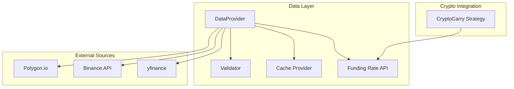
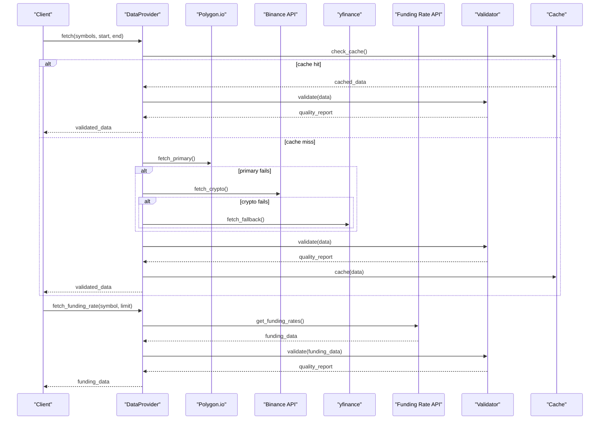
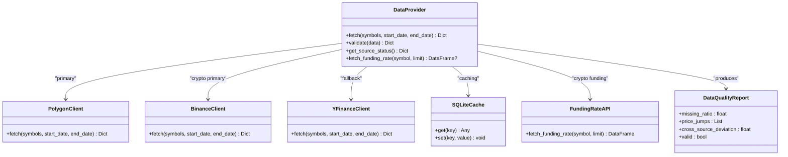

# DataProvider Interface

<cite>
**Referenced Files in This Document**
- [provider.py](file://src/data/provider.py)
- [carry.py](file://src/factors/carry.py)
- [demo_phase2.py](file://demo_phase2.py)
- [verify_carry.py](file://verify_carry.py)
- [.env.example](file://.env.example)
- [Tech_Design_Document.md](file://Tech_Design_Document.md)
- [PRD_Intelligent_Trading_System_v2.md](file://PRD_Intelligent_Trading_System_v2.md)
</cite>

## Update Summary
**Changes Made**
- Added comprehensive documentation for the new `fetch_funding_rate()` method
- Updated timezone standardization details for all data sources
- Enhanced cryptocurrency data capabilities section
- Added examples for funding rate integration in trading strategies
- Updated configuration requirements for Binance API access

## Table of Contents
1. [Introduction](#introduction)
2. [Project Structure](#project-structure)
3. [Core Components](#core-components)
4. [Architecture Overview](#architecture-overview)
5. [Detailed Component Analysis](#detailed-component-analysis)
6. [Dependency Analysis](#dependency-analysis)
7. [Performance Considerations](#performance-considerations)
8. [Troubleshooting Guide](#troubleshooting-guide)
9. [Conclusion](#conclusion)

## Introduction
This document provides comprehensive API documentation for the DataProvider interface used in the Intelligent Trading System. It focuses on the fetch() method for retrieving market data from multiple sources (Polygon.io, Binance, yfinance), the validate() method for data quality assurance, the get_source_status() method for monitoring data source health, and the newly enhanced fetch_funding_rate() method for cryptocurrency funding rate data acquisition. It also covers method signatures, parameter types, return value formats, error handling patterns, retry mechanisms, configuration options, caching mechanisms, and performance considerations for large-scale data retrieval.

## Project Structure
The DataProvider interface is part of the data layer within the Intelligent Trading System. The system follows a modular architecture with clear separation of concerns across data acquisition, validation, caching, factor computation, risk management, and execution. The enhanced system now includes specialized cryptocurrency data capabilities with funding rate integration.

**Diagram sources**
- [provider.py](file://src/data/provider.py#L35-L433)
- [carry.py](file://src/factors/carry.py#L1-L100)

**Section sources**
- [Tech_Design_Document.md](file://Tech_Design_Document.md#L209-L239)
- [PRD_Intelligent_Trading_System_v2.md](file://PRD_Intelligent_Trading_System_v2.md#L182-L201)

## Core Components
The DataProvider interface defines four primary methods:
- fetch(): Retrieves OHLCV data for a list of symbols over a specified date range from multiple sources with automatic fallback.
- validate(): Performs data quality checks to ensure integrity and reliability.
- get_source_status(): Reports the health status of each data source.
- fetch_funding_rate(): **NEW** - Retrieves funding rate history from Binance Futures for cryptocurrency carry strategies.

Key capabilities:
- Multi-source acquisition with priority ordering and fallback.
- Automatic retry with exponential backoff and circuit breaker behavior.
- Data quality validation including missing data thresholds, price jump detection, and cross-source deviation checks.
- Caching layer to avoid redundant downloads and improve performance.
- Configurable behavior for different asset classes (equities, crypto).
- **Enhanced** - Timezone-standardized data across all sources (UTC, timezone-naive).
- **Enhanced** - Comprehensive cryptocurrency data support with funding rate integration.

**Section sources**
- [Tech_Design_Document.md](file://Tech_Design_Document.md#L213-L239)
- [PRD_Intelligent_Trading_System_v2.md](file://PRD_Intelligent_Trading_System_v2.md#L182-L201)
- [provider.py](file://src/data/provider.py#L390-L433)

## Architecture Overview
The DataProvider participates in a layered data pipeline that emphasizes resilience, quality, and performance. The architecture supports:
- Primary source for production-grade data (Polygon.io for equities/ETFs, Binance for crypto).
- Fallback to yfinance for robustness and development/production continuity.
- Validation and caching layers integrated into the data acquisition process.
- **Enhanced** - Dedicated funding rate API for cryptocurrency carry strategies.
- Clear separation between data acquisition, validation, and downstream processing.

**Diagram sources**
- [provider.py](file://src/data/provider.py#L103-L164)
- [provider.py](file://src/data/provider.py#L390-L433)

## Detailed Component Analysis

### DataProvider.fetch()
**Updated** Enhanced with timezone standardization and improved error handling

Purpose:
- Retrieve OHLCV data for a list of symbols over a specified date range.
- Implement multi-source acquisition with priority ordering and automatic fallback.
- Apply exponential backoff and circuit breaker behavior for resilience.
- **Enhanced** - Standardize all timestamps to timezone-naive UTC across all sources.

Method signature:
- fetch(symbols: List[str], start_date: str, end_date: str) -> Dict[str, pd.DataFrame]

Behavior:
- Priority order: Polygon.io (primary for equities/ETFs) → Binance API (primary for crypto) → yfinance (fallback).
- Retry mechanism: Exponential backoff with a maximum number of attempts (as defined in the design).
- Circuit breaker: Temporarily disable failing sources to prevent cascading failures.
- Caching: Check cache before external calls; store successful results for reuse.
- **Enhanced** - All returned DataFrames have timezone-naive UTC indices for consistency.

Parameters:
- symbols: List of asset identifiers (e.g., ticker symbols for equities/ETFs, unified identifiers for crypto).
- start_date: Start date in a standardized string format (YYYY-MM-DD).
- end_date: End date in a standardized string format (YYYY-MM-DD).

Return value:
- Dictionary mapping each symbol to a pandas DataFrame containing OHLCV data aligned to the requested date range with timezone-naive UTC indexing.

Error handling:
- Exceptions from external APIs trigger fallback to the next source.
- Circuit breaker disables a failing source temporarily.
- On exhaustion of fallbacks, raises a consolidated error indicating the failure.

Retry mechanisms:
- Exponential backoff with jitter to avoid thundering herd effects.
- Maximum retry attempts configurable per source.
- Immediate fallback to next available source upon transient errors.

Examples:
- Multi-source acquisition workflow: Request data for a list of ETFs and BTC pairs; if Polygon.io is unavailable, switch to Binance; if Binance fails, fall back to yfinance; validate and cache the result.
- Fallback strategy: If a symbol is not available from the primary source, attempt to retrieve it from the backup source; if both fail, skip the symbol and continue with others.
- Data validation process: After fetching, validate for missing dates, extreme price jumps, and cross-source deviations; reject segments exceeding thresholds.
- **Enhanced** - Timezone consistency: All returned DataFrames have consistent UTC timezone handling regardless of source.

Configuration options:
- Source-specific timeouts and rate limits.
- Asset classification to route symbols to appropriate sources (e.g., equities to Polygon.io, crypto to Binance).
- Cache retention policies and invalidation rules.

Caching mechanisms:
- In-memory cache for fast access to recent requests.
- Persistent SQLite cache for durability across runs.
- Remote cache (e.g., Redis/S3) for shared access across instances.

Performance considerations:
- Batch symbol requests to minimize API calls.
- Parallelize independent symbol fetches where safe.
- Use caching to avoid repeated downloads for the same date ranges.
- Monitor source latency and adjust priorities dynamically.

**Section sources**
- [Tech_Design_Document.md](file://Tech_Design_Document.md#L213-L239)
- [PRD_Intelligent_Trading_System_v2.md](file://PRD_Intelligent_Trading_System_v2.md#L182-L201)
- [provider.py](file://src/data/provider.py#L103-L164)

### DataProvider.fetch_funding_rate()
**New** Comprehensive cryptocurrency funding rate integration

Purpose:
- Retrieve historical funding rate data from Binance Futures for cryptocurrency carry strategies.
- Enable funding rate arbitrage and crypto carry trading implementations.

Method signature:
- fetch_funding_rate(symbol: str, limit: int = 100) -> Optional[pd.DataFrame]

Behavior:
- Connects to Binance Futures funding rate API endpoint.
- Converts symbol format (e.g., "BTC-USD" to "BTCUSDT").
- Retrieves historical funding rate data with configurable record limits.
- Returns DataFrame with fundingTime index and fundingRate values.

Parameters:
- symbol: Cryptocurrency symbol in unified format (e.g., "BTC-USD", "ETH-USD").
- limit: Number of funding rate records to retrieve (default: 100, max: 1000).

Return value:
- pandas DataFrame with fundingTime index and fundingRate column, or None if fetch fails.

Error handling:
- Graceful fallback if requests library is unavailable.
- Exception logging with specific error messages.
- Returns None on API failures or invalid responses.

Examples:
- Basic usage: `dp.fetch_funding_rate("BTC-USD", limit=50)` retrieves 50 recent funding rate records.
- Integration with carry strategy: Combine funding rate data with CryptoCarry class for signal generation.
- Error handling: Check return value for None before processing funding data.

Configuration options:
- Binance API base URL configurable via BINANCE_FAPI_BASE environment variable.
- Timeout settings (30 seconds) built into request configuration.
- Symbol format conversion for unified naming convention.

**Section sources**
- [provider.py](file://src/data/provider.py#L390-L433)
- [demo_phase2.py](file://demo_phase2.py#L55-L63)
- [verify_carry.py](file://verify_carry.py#L14-L24)

### DataProvider.validate()
Purpose:
- Ensure data integrity and reliability by applying quality checks.

Method signature:
- validate(data: pd.DataFrame) -> Dict

Checks performed:
- Missing data threshold: Reject data segments where missing values exceed a configured percentage.
- Price jump detection: Flag segments with extreme intraday or interday price changes.
- Cross-source deviation: Compare multiple sources for the same symbol and flag significant discrepancies.

Return value:
- Dictionary containing validation results with keys: passed, issues, missing_pct, rows.

Error handling:
- Validation failures can lead to rejection of the dataset or require manual intervention depending on severity.
- Partial validation failures may still allow downstream processing with warnings.

Examples:
- Missing data validation: If more than a threshold percentage of rows are missing for a symbol, mark the segment as invalid.
- Price jump detection: Detect and log extreme moves that could indicate data errors or corporate actions.
- Cross-source deviation: Compare Polygon.io and Binance data for BTC; if deviations exceed thresholds, trigger alerts and require reconciliation.

**Section sources**
- [Tech_Design_Document.md](file://Tech_Design_Document.md#L231-L238)
- [PRD_Intelligent_Trading_System_v2.md](file://PRD_Intelligent_Trading_System_v2.md#L197-L200)

### DataProvider.get_source_status()
Purpose:
- Monitor and report the operational health of each data source.

Method signature:
- get_source_status() -> Dict[str, str]

Return value:
- Dictionary mapping each source identifier to a status string (e.g., healthy, degraded, down).

Usage:
- Integrate into monitoring dashboards and alerting systems.
- Trigger circuit breaker logic when a source is marked down.

Examples:
- Status reporting: Periodically poll each source and update status based on recent success/failure rates.
- Alerting: When a source transitions from healthy to degraded/down, notify operators and temporarily disable that source in acquisition logic.

**Section sources**
- [Tech_Design_Document.md](file://Tech_Design_Document.md#L239-L239)
- [PRD_Intelligent_Trading_System_v2.md](file://PRD_Intelligent_Trading_System_v2.md#L182-L201)

## Dependency Analysis
The DataProvider interacts with external data sources and internal components as follows:

**Diagram sources**
- [provider.py](file://src/data/provider.py#L35-L433)

**Section sources**
- [Tech_Design_Document.md](file://Tech_Design_Document.md#L213-L239)

## Performance Considerations
- Multi-source acquisition reduces single points of failure while increasing complexity; implement intelligent routing and caching to mitigate overhead.
- Use exponential backoff and jitter to avoid overwhelming external APIs during retries.
- Cache frequently accessed symbol/date ranges to reduce latency and bandwidth usage.
- Batch requests where possible to minimize per-request overhead.
- Monitor source latency and adjust priorities dynamically to optimize throughput.
- For large-scale retrieval, consider parallelizing independent symbol fetches and implementing rate limiting per source.
- **Enhanced** - Funding rate data retrieval is optimized for cryptocurrency strategies with configurable record limits.
- **Enhanced** - Timezone standardization eliminates conversion overhead in downstream processing.

## Troubleshooting Guide
Common issues and resolutions:
- Source unavailability: If a primary source is down, the system automatically falls back to the next available source. Monitor get_source_status() to confirm source health.
- Excessive missing data: If validate() detects missing data above thresholds, investigate data gaps and consider extending the date range or adjusting filters.
- Price anomalies: Investigate extreme price jumps flagged by validate(); verify corporate actions or data quality issues.
- Cross-source deviations: Significant differences between sources may indicate inconsistent data; reconcile manually or adjust validation thresholds.
- Retry storms: Excessive retries can overload external APIs; tune exponential backoff parameters and enable circuit breakers.
- **Enhanced** - Funding rate API issues: Check Binance API availability and ensure correct symbol formatting (e.g., "BTCUSDT" for BTC).
- **Enhanced** - Timezone inconsistencies: All data is now standardized to timezone-naive UTC; verify index handling in downstream processing.
- **Enhanced** - Environment configuration: Ensure BINANCE_FAPI_BASE is set correctly for Binance API access.

**Section sources**
- [PRD_Intelligent_Trading_System_v2.md](file://PRD_Intelligent_Trading_System_v2.md#L182-L201)
- [Tech_Design_Document.md](file://Tech_Design_Document.md#L213-L239)
- [provider.py](file://src/data/provider.py#L390-L433)

## Conclusion
The DataProvider interface provides a robust foundation for multi-source market data acquisition with integrated validation and monitoring. Its design emphasizes resilience through fallback mechanisms, quality assurance via validation, and performance through caching and intelligent routing. The recent enhancements include comprehensive cryptocurrency funding rate integration, timezone standardization across all data sources, and expanded crypto capabilities. Proper configuration and monitoring of source health, combined with disciplined error handling and retry strategies, ensure reliable data delivery for downstream analytics and trading workflows. The addition of funding rate capabilities enables sophisticated cryptocurrency carry strategies and expands the system's applicability to modern crypto trading environments.