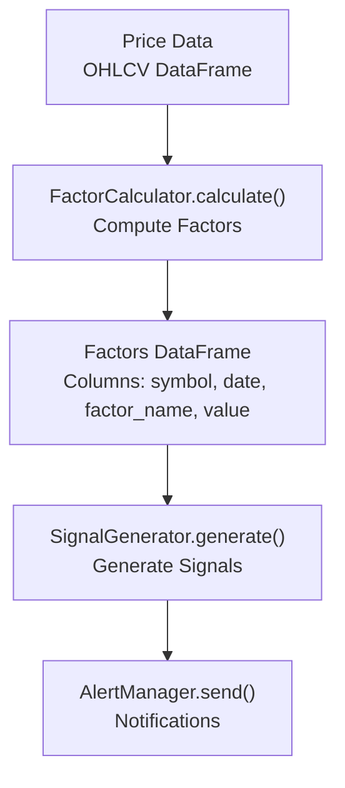
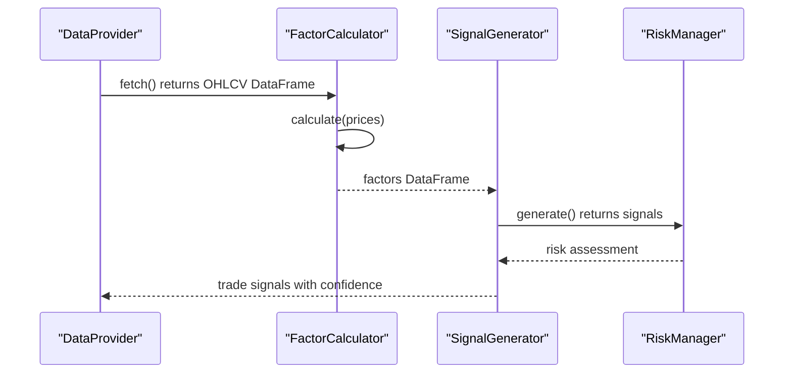
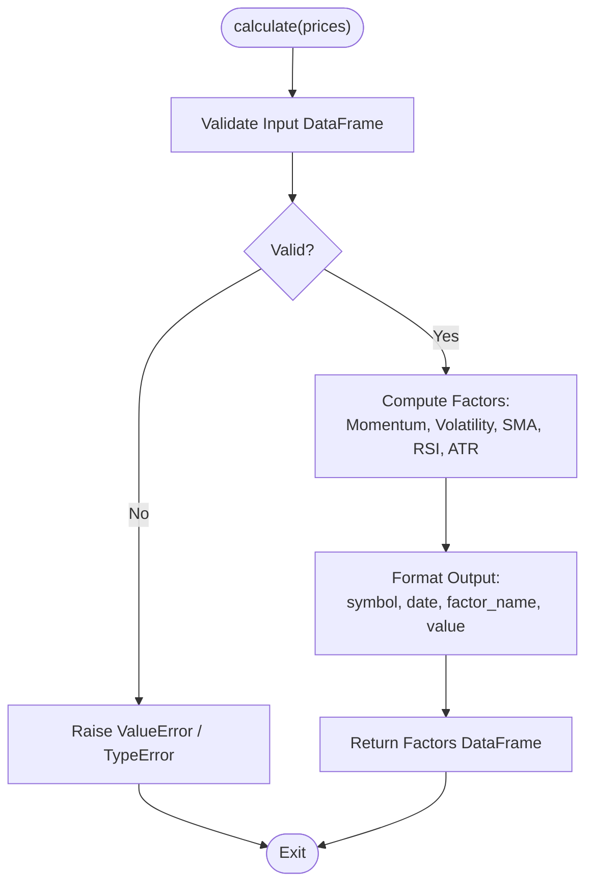
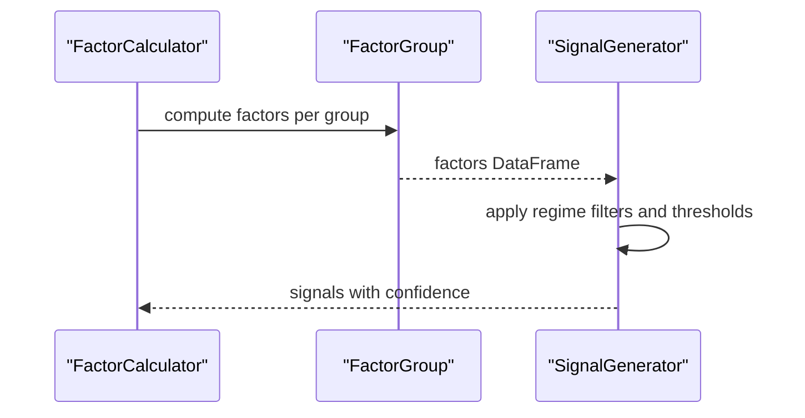
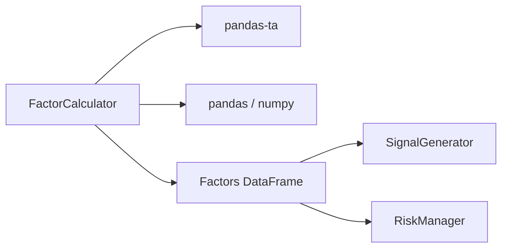

# FactorCalculator Interface

<cite>
**Referenced Files in This Document**
- [PRD_Intelligent_Trading_System_v2.md](file://PRD_Intelligent_Trading_System_v2.md)
- [Tech_Design_Document.md](file://Tech_Design_Document.md)
</cite>

## Table of Contents
1. [Introduction](#introduction)
2. [Project Structure](#project-structure)
3. [Core Components](#core-components)
4. [Architecture Overview](#architecture-overview)
5. [Detailed Component Analysis](#detailed-component-analysis)
6. [Dependency Analysis](#dependency-analysis)
7. [Performance Considerations](#performance-considerations)
8. [Troubleshooting Guide](#troubleshooting-guide)
9. [Conclusion](#conclusion)

## Introduction
This document provides comprehensive API documentation for the FactorCalculator interface used to compute technical indicators and statistical factors from price data. It covers the calculate() method, supported factors (Momentum_60, Momentum_120, Volatility_20/60, SMA_20/50/200, RSI_14, ATR_14), mathematical formulations, parameter requirements, output formats, and integration patterns within the trading system. It also includes performance optimization techniques, memory management guidance for large datasets, and error handling recommendations for invalid inputs.

## Project Structure
The FactorCalculator interface is defined alongside other core interfaces in the project’s documentation. The system architecture organizes factor computation as part of the broader pipeline that transforms raw price data into trade signals.

**Diagram sources**
- [PRD_Intelligent_Trading_System_v2.md](file://PRD_Intelligent_Trading_System_v2.md#L428-L430)
- [Tech_Design_Document.md](file://Tech_Design_Document.md#L268-L295)

**Section sources**
- [PRD_Intelligent_Trading_System_v2.md](file://PRD_Intelligent_Trading_System_v2.md#L428-L430)
- [Tech_Design_Document.md](file://Tech_Design_Document.md#L268-L295)

## Core Components
- FactorCalculator interface
  - Purpose: Compute technical factors from price data.
  - Method: calculate(prices: pd.DataFrame) -> pd.DataFrame
  - Output format: DataFrame with columns symbol, date, factor_name, value
  - Supported factors:
    - Momentum_60: 60-day cumulative return
    - Momentum_120: 120-day cumulative return
    - Volatility_20: 20-day annualized volatility
    - Volatility_60: 60-day annualized volatility
    - SMA_20: 20-day simple moving average
    - SMA_50: 50-day simple moving average
    - SMA_200: 200-day simple moving average
    - RSI_14: 14-day Relative Strength Index
    - ATR_14: 14-day Average True Range

- Integration points:
  - Input: OHLCV DataFrame from DataProvider
  - Output: Factors DataFrame consumed by SignalGenerator
  - Optional cross-sectional ranking for momentum-based strategies

**Section sources**
- [PRD_Intelligent_Trading_System_v2.md](file://PRD_Intelligent_Trading_System_v2.md#L203-L218)
- [PRD_Intelligent_Trading_System_v2.md](file://PRD_Intelligent_Trading_System_v2.md#L428-L430)
- [Tech_Design_Document.md](file://Tech_Design_Document.md#L268-L295)

## Architecture Overview
The FactorCalculator sits in the middle of the pipeline: transforming raw price data into standardized factors for downstream signal generation and risk management.

**Diagram sources**
- [PRD_Intelligent_Trading_System_v2.md](file://PRD_Intelligent_Trading_System_v2.md#L423-L430)
- [Tech_Design_Document.md](file://Tech_Design_Document.md#L299-L315)

## Detailed Component Analysis

### FactorCalculator.calculate()
- Input
  - prices: pd.DataFrame containing OHLCV data aligned by date index and symbol column(s)
  - Assumptions:
    - Close prices are used for returns and trend-based factors
    - Volume is available for volume-weighted factors if applicable
    - Data is sorted ascending by date and free of duplicates
- Processing
  - Computes all supported factors per symbol-date combination
  - Uses pandas-ta for indicator calculations
  - Produces a long-format DataFrame with columns symbol, date, factor_name, value
- Output
  - pd.DataFrame with standardized columns and numeric values
  - One row per symbol-date-factor combination

**Diagram sources**
- [Tech_Design_Document.md](file://Tech_Design_Document.md#L280-L286)

**Section sources**
- [Tech_Design_Document.md](file://Tech_Design_Document.md#L280-L286)

### Supported Factors and Formulations
- Momentum_60
  - Definition: 60-day cumulative return
  - Formula: (P_t / P_{t-60}) - 1
  - Parameter: lookback window 60
- Momentum_120
  - Definition: 120-day cumulative return
  - Formula: (P_t / P_{t-120}) - 1
  - Parameter: lookback window 120
- Volatility_20
  - Definition: Annualized volatility (20-day rolling standard deviation of log returns)
  - Formula: σ_log_returns × sqrt(252)
  - Parameter: rolling window 20, annualization sqrt(252)
- Volatility_60
  - Definition: Annualized volatility (60-day rolling standard deviation of log returns)
  - Formula: σ_log_returns × sqrt(252)
  - Parameter: rolling window 60, annualization sqrt(252)
- SMA_20
  - Definition: 20-day simple moving average
  - Parameter: window 20
- SMA_50
  - Definition: 50-day simple moving average
  - Parameter: window 50
- SMA_200
  - Definition: 200-day simple moving average
  - Parameter: window 200
- RSI_14
  - Definition: 14-day Relative Strength Index
  - Parameter: period 14
- ATR_14
  - Definition: 14-day Average True Range
  - Parameter: period 14

Notes:
- Log returns: ln(Close_t / Close_{t-1})
- Annualization: multiply daily volatility by sqrt(252)
- Factor names in output: e.g., "Momentum_60", "Volatility_20", "SMA_20", "RSI_14", "ATR_14"

**Section sources**
- [PRD_Intelligent_Trading_System_v2.md](file://PRD_Intelligent_Trading_System_v2.md#L208-L217)
- [Tech_Design_Document.md](file://Tech_Design_Document.md#L272-L278)

### Data Preprocessing Requirements
- Required columns: date index, symbol column, close prices
- Missing values:
  - Forward-fill or interpolate short gaps before computing returns
  - Drop segments with excessive missingness (> threshold)
- Outliers:
  - Cap extreme price jumps (e.g., daily change > threshold) prior to computing returns
- Sorting and uniqueness:
  - Ensure ascending date order and unique dates per symbol
- Volume:
  - Optional; include if volume-weighted variants are desired later

**Section sources**
- [PRD_Intelligent_Trading_System_v2.md](file://PRD_Intelligent_Trading_System_v2.md#L184-L201)

### Integration Patterns
- FactorCalculator.calculate() produces a long-format DataFrame suitable for:
  - SignalGenerator.generate(): combine factors with market regime filters
  - RiskManager.check(): monitor factor-driven exposures
  - Backtester.run(): feed factor values for performance attribution
- Cross-sectional ranking:
  - Use calculate_cross_sectional_rank(factor_df, factor_name) to rank assets for momentum strategies

**Diagram sources**
- [Tech_Design_Document.md](file://Tech_Design_Document.md#L288-L294)

**Section sources**
- [Tech_Design_Document.md](file://Tech_Design_Document.md#L288-L294)

## Dependency Analysis
- Internal dependencies
  - FactorCalculator depends on pandas-ta for indicator computations
  - Output format aligns with downstream consumers (signals, risk, backtesting)
- External dependencies
  - pandas, numpy for numerical operations
  - pandas-ta for TA library functions

**Diagram sources**
- [Tech_Design_Document.md](file://Tech_Design_Document.md#L280-L286)

**Section sources**
- [Tech_Design_Document.md](file://Tech_Design_Document.md#L280-L286)

## Performance Considerations
- Vectorization
  - Use vectorized operations on OHLCV arrays; avoid row-wise loops
- Chunking for large datasets
  - Process by symbol or date windows to limit peak memory usage
- Rolling windows
  - Precompute log returns once; reuse for multiple volatility windows
- Output formatting
  - Build long-format DataFrame in a single pass to minimize copies
- Caching
  - Cache intermediate results (returns, rolling stats) when re-running on overlapping windows
- Parallelism
  - Consider parallelizing by symbol if the dataset spans many assets

[No sources needed since this section provides general guidance]

## Troubleshooting Guide
- Invalid input DataFrame
  - Symptoms: Type errors, missing columns, non-numeric close prices
  - Actions: Validate dtypes, ensure presence of required columns, sort by date
- Insufficient data length
  - Symptoms: NaNs for short windows (e.g., 200-day SMA)
  - Actions: Require minimum lookback periods; drop symbols with insufficient history
- Duplicate or out-of-order dates
  - Symptoms: Unexpected NaNs or errors in rolling computations
  - Actions: Deduplicate and sort by date ascending
- Extreme outliers
  - Symptoms: Spurious spikes in returns/volatility
  - Actions: Winsorize or cap returns prior to computation
- Memory pressure
  - Symptoms: Slowdown or OOM during large backtests
  - Actions: Process in chunks, downcast numeric types, and clear intermediate caches

**Section sources**
- [PRD_Intelligent_Trading_System_v2.md](file://PRD_Intelligent_Trading_System_v2.md#L197-L201)

## Conclusion
The FactorCalculator interface provides a standardized mechanism to transform OHLCV data into a unified set of technical factors. By adhering to the documented input requirements, parameter choices, and output format, downstream modules can reliably generate signals, manage risk, and evaluate performance. Proper preprocessing, chunked processing, and robust error handling ensure reliable operation across diverse datasets and time horizons.