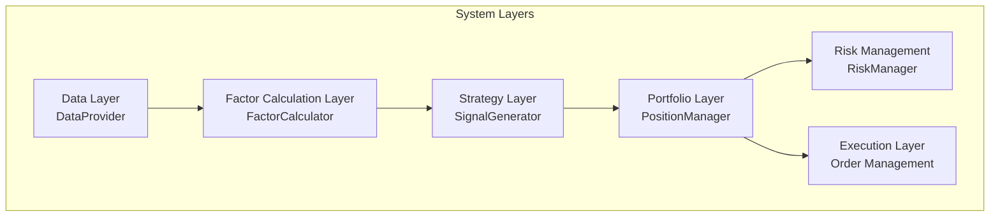
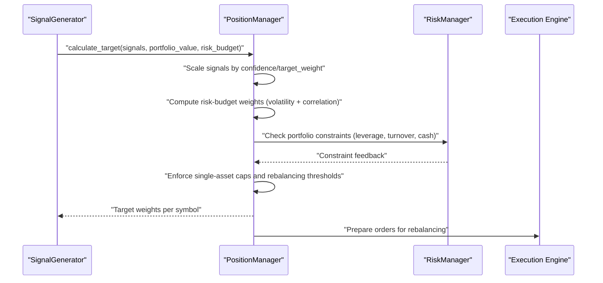
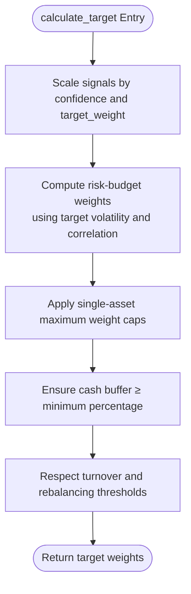
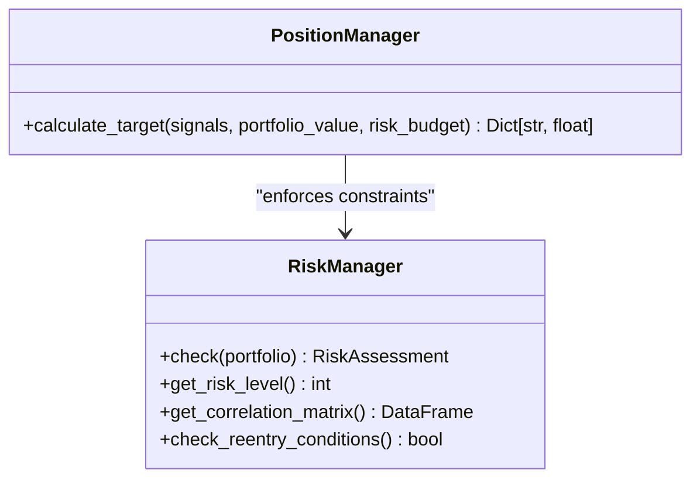
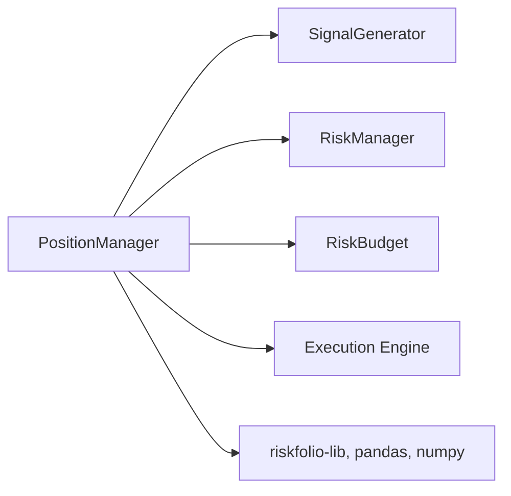

# PositionManager Interface

<cite>
**Referenced Files in This Document**
- [PRD_Intelligent_Trading_System_v2.md](file://PRD_Intelligent_Trading_System_v2.md)
- [Tech_Design_Document.md](file://Tech_Design_Document.md)
- [pyproject.toml](file://pyproject.toml)
</cite>

## Table of Contents
1. [Introduction](#introduction)
2. [Project Structure](#project-structure)
3. [Core Components](#core-components)
4. [Architecture Overview](#architecture-overview)
5. [Detailed Component Analysis](#detailed-component-analysis)
6. [Dependency Analysis](#dependency-analysis)
7. [Performance Considerations](#performance-considerations)
8. [Troubleshooting Guide](#troubleshooting-guide)
9. [Conclusion](#conclusion)

## Introduction
This document provides comprehensive API documentation for the PositionManager interface, focusing on the calculate_target() method. It explains how optimal position allocations are determined based on trading signals, portfolio value, and risk budget constraints. The documentation covers portfolio optimization principles, weight calculation algorithms, and constraint enforcement including single-asset limits, turnover restrictions, and cash buffers. It also includes practical examples of position sizing workflows, risk budget allocation, integration with risk management systems, and performance considerations for multi-asset portfolio construction.

## Project Structure
The PositionManager interface is part of a modular, layered trading system. The relevant components and their roles are defined in the product and technical design documents. The interface definition and functional requirements are documented in the Product Requirements Document (PRD), while the technical design and module-level details are outlined in the Technical Design Document.

**Diagram sources**
- [PRD_Intelligent_Trading_System_v2.md](file://PRD_Intelligent_Trading_System_v2.md#L418-L455)
- [Tech_Design_Document.md](file://Tech_Design_Document.md#L34-L86)

**Section sources**
- [PRD_Intelligent_Trading_System_v2.md](file://PRD_Intelligent_Trading_System_v2.md#L418-L455)
- [Tech_Design_Document.md](file://Tech_Design_Document.md#L34-L86)

## Core Components
The PositionManager interface defines a single method responsible for translating trading signals and risk parameters into target portfolio weights. The PRD specifies the method signature and the functional requirements for position sizing under constraints.

- Interface definition
  - Method: calculate_target(signals, portfolio_value, risk_budget) → Dict[str, float]
  - Inputs:
    - signals: List of trade signals with symbol, signal type, confidence, and target_weight
    - portfolio_value: float representing total portfolio value
    - risk_budget: RiskBudget object encapsulating risk allocation parameters
  - Output: Dictionary mapping symbol to target weight

- Functional requirements
  - Scale signals by confidence and target_weight
  - Enforce single-asset maximum weight constraints
  - Allocate risk budgets considering asset volatilities and correlation adjustments
  - Preserve cash buffer and respect minimum trade amounts
  - Apply turnover and rebalancing thresholds

- Risk budget allocation
  - Target weights derived from risk budgets scaled by target volatility and adjusted for correlation
  - Portfolio-level constraints: maximum leverage, daily turnover, and number of trades

- Constraint enforcement
  - Single-asset caps per asset class
  - Minimum trade amount and rebalancing threshold
  - Cash buffer maintained at or above a fixed percentage

**Section sources**
- [PRD_Intelligent_Trading_System_v2.md](file://PRD_Intelligent_Trading_System_v2.md#L247-L263)
- [PRD_Intelligent_Trading_System_v2.md](file://PRD_Intelligent_Trading_System_v2.md#L434-L436)

## Architecture Overview
The PositionManager sits at the intersection of strategy signals and risk management. It receives signals from the SignalGenerator, applies risk budgeting and constraints, and prepares targets for the execution layer. Risk controls from the RiskManager influence the final target weights.

**Diagram sources**
- [PRD_Intelligent_Trading_System_v2.md](file://PRD_Intelligent_Trading_System_v2.md#L247-L263)
- [PRD_Intelligent_Trading_System_v2.md](file://PRD_Intelligent_Trading_System_v2.md#L434-L436)
- [Tech_Design_Document.md](file://Tech_Design_Document.md#L352-L404)

## Detailed Component Analysis

### PositionManager.calculate_target() API
The calculate_target() method orchestrates position sizing from signals to target weights. It integrates risk budgeting, constraint enforcement, and portfolio-level controls.

- Inputs
  - signals: List of signals containing symbol, signal type, confidence, and target_weight
  - portfolio_value: float indicating total portfolio value
  - risk_budget: RiskBudget object with risk allocation parameters

- Processing steps
  1. Normalize and scale signals by confidence and target_weight
  2. Compute risk-budget weights using target volatility and correlation adjustments
  3. Apply single-asset maximum weight constraints
  4. Enforce cash buffer and minimum trade thresholds
  5. Respect turnover and rebalancing constraints
  6. Return dictionary of target weights per symbol

- Output
  - Dict[str, float]: symbol-to-weight mapping for target positions

- Constraints and risk controls
  - Single-asset caps per asset class
  - Portfolio maximum leverage
  - Cash buffer maintained at or above a fixed percentage
  - Minimum trade amount and rebalancing threshold
  - Daily turnover and number of trades limits

**Diagram sources**
- [PRD_Intelligent_Trading_System_v2.md](file://PRD_Intelligent_Trading_System_v2.md#L247-L263)

**Section sources**
- [PRD_Intelligent_Trading_System_v2.md](file://PRD_Intelligent_Trading_System_v2.md#L247-L263)
- [PRD_Intelligent_Trading_System_v2.md](file://PRD_Intelligent_Trading_System_v2.md#L434-L436)

### RiskBudget Data Structure
The RiskBudget object encapsulates risk allocation parameters used by PositionManager to compute risk-budget weights. While the exact internal fields are not specified in the PRD, the PositionManager’s behavior indicates the following typical usage:

- Purpose: Provide risk allocation parameters for computing risk-budget weights
- Typical fields (derived from usage):
  - target_volatility: Portfolio target volatility for scaling
  - correlation_adjustment: Adjustment factor for asset correlations
  - volatility_per_asset: Asset-specific volatility estimates
  - risk_contribution: Risk contribution targets per asset (if used)

- Role in calculate_target():
  - Compute risk-budget weights proportional to inverse volatility and adjusted for correlation
  - Scale weights by target_volatility to achieve desired portfolio risk level

Note: The precise field names and structure are inferred from PositionManager’s documented behavior and are not explicitly defined in the PRD.

**Section sources**
- [PRD_Intelligent_Trading_System_v2.md](file://PRD_Intelligent_Trading_System_v2.md#L247-L263)

### Portfolio Optimization Principles and Weight Calculation
PositionManager aligns with risk parity-style risk budgeting:

- Risk budget allocation
  - Weights derived from risk budgets scaled by target volatility
  - Correlation adjustments applied to maintain balanced risk contributions
  - Portfolio-level target volatility constrains the overall risk exposure

- Constraint enforcement
  - Single-asset caps prevent concentration risk
  - Cash buffer ensures liquidity and reduces forced liquidations
  - Turnover and rebalancing thresholds limit trading activity and costs

- Practical examples
  - Example workflow: Input signals → scale by confidence → compute risk-budget weights → enforce caps and turnover → output target weights
  - Risk budget allocation: Use target_volatility and correlation-adjusted volatilities to derive weights; normalize to sum to portfolio exposure

**Section sources**
- [PRD_Intelligent_Trading_System_v2.md](file://PRD_Intelligent_Trading_System_v2.md#L247-L263)

### Integration with Risk Management Systems
PositionManager interacts with the RiskManager to ensure compliance with portfolio-level constraints:

- Risk controls
  - Maximum portfolio leverage
  - Daily turnover and number of trades limits
  - Cash buffer requirements
  - Single-asset stop-loss and drawdown controls

- Re-entry logic
  - After severe drawdowns, gradual re-entry with reduced leverage and ramp-up position sizes

- Correlation monitoring
  - Portfolio-level and pairwise correlation thresholds trigger warnings and constraint adjustments

**Diagram sources**
- [PRD_Intelligent_Trading_System_v2.md](file://PRD_Intelligent_Trading_System_v2.md#L438-L442)
- [Tech_Design_Document.md](file://Tech_Design_Document.md#L352-L404)

**Section sources**
- [PRD_Intelligent_Trading_System_v2.md](file://PRD_Intelligent_Trading_System_v2.md#L288-L332)
- [Tech_Design_Document.md](file://Tech_Design_Document.md#L352-L404)

## Dependency Analysis
PositionManager depends on:
- SignalGenerator for trade signals with confidence and target_weight
- RiskManager for constraint checks and risk level assessments
- RiskBudget for risk allocation parameters
- Execution layer for converting target weights into orders

External libraries supporting portfolio optimization and risk management are declared in the project configuration.

**Diagram sources**
- [PRD_Intelligent_Trading_System_v2.md](file://PRD_Intelligent_Trading_System_v2.md#L418-L455)
- [pyproject.toml](file://pyproject.toml#L14-L14)

**Section sources**
- [PRD_Intelligent_Trading_System_v2.md](file://PRD_Intelligent_Trading_System_v2.md#L418-L455)
- [pyproject.toml](file://pyproject.toml#L14-L14)

## Performance Considerations
- Computational complexity
  - Weight calculations are linear in the number of assets
  - Risk budget computations depend on volatility and correlation matrices; typically O(N^2) for covariance-based operations
- Memory usage
  - Maintain intermediate arrays for scaled signals, risk-budget weights, and constraints
- Throughput
  - Batch processing signals and weights improves efficiency
- Cost-aware rebalancing
  - Enforce minimum rebalancing thresholds to avoid excessive turnover and transaction costs

[No sources needed since this section provides general guidance]

## Troubleshooting Guide
Common issues and resolutions when using PositionManager.calculate_target():

- Excessive turnover or frequent rebalancing
  - Cause: Small changes in signals below minimum rebalancing threshold
  - Resolution: Increase min_rebalance_threshold or aggregate signals over longer horizon

- Violation of single-asset caps
  - Cause: Aggregated signal weights exceed individual asset caps
  - Resolution: Apply asset caps before normalization; consider sector or asset-class grouping

- Cash buffer too low
  - Cause: Large positions consume intended cash buffer
  - Resolution: Adjust caps or reduce signal weights; ensure cash buffer ≥ minimum percentage

- Portfolio leverage exceeds limits
  - Cause: Risk budget weights increase leverage beyond maximum
  - Resolution: Reduce target_volatility or apply leverage caps; review correlation adjustments

- Turnover constraints exceeded
  - Cause: Rapid re-pricing or frequent rebalancing
  - Resolution: Enforce monthly or periodic rebalancing; cap turnover per period

**Section sources**
- [PRD_Intelligent_Trading_System_v2.md](file://PRD_Intelligent_Trading_System_v2.md#L247-L263)
- [PRD_Intelligent_Trading_System_v2.md](file://PRD_Intelligent_Trading_System_v2.md#L288-L332)

## Conclusion
PositionManager.calculate_target() provides a robust bridge between trading signals and disciplined portfolio construction. By integrating risk budgeting, constraint enforcement, and risk management controls, it ensures optimal position allocations aligned with portfolio value and risk appetite. Proper configuration of RiskBudget parameters, signal scaling, and constraints leads to efficient, cost-conscious, and compliant multi-asset portfolio management.