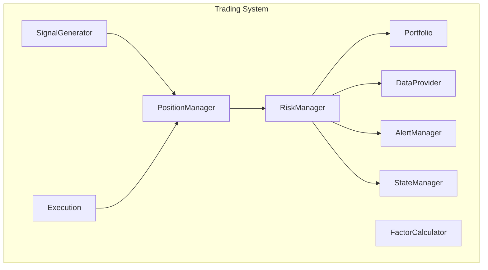
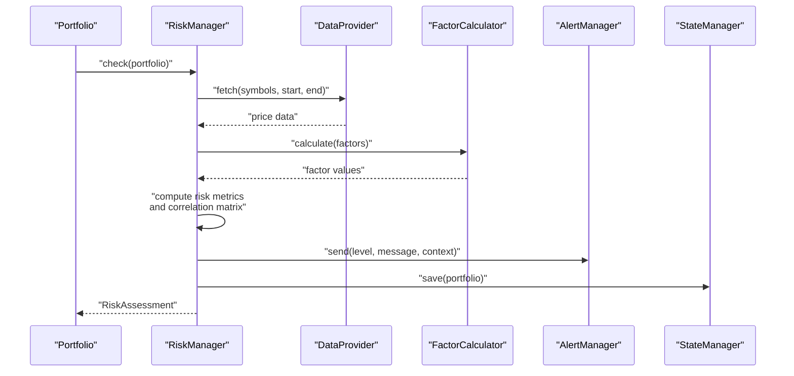
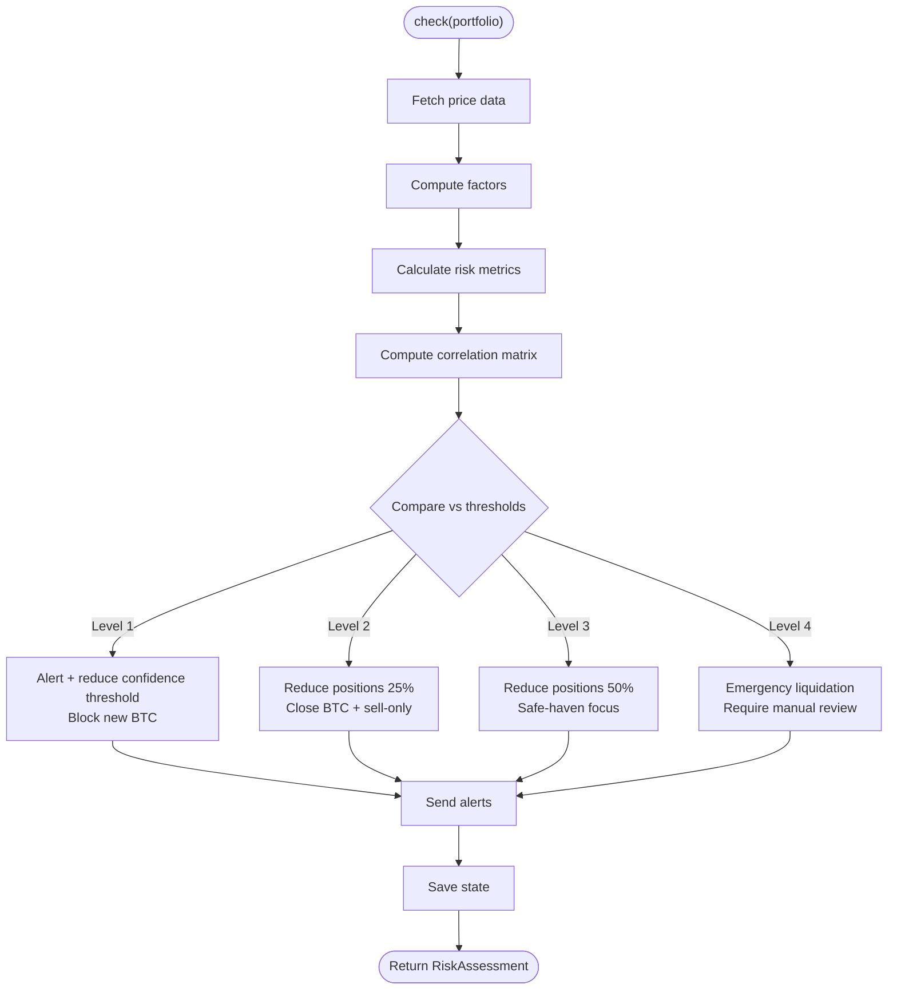
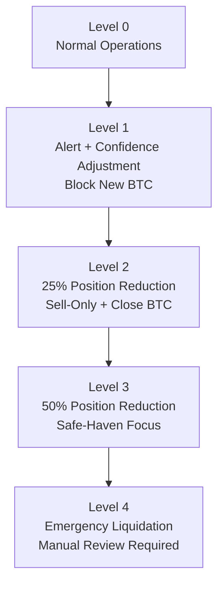
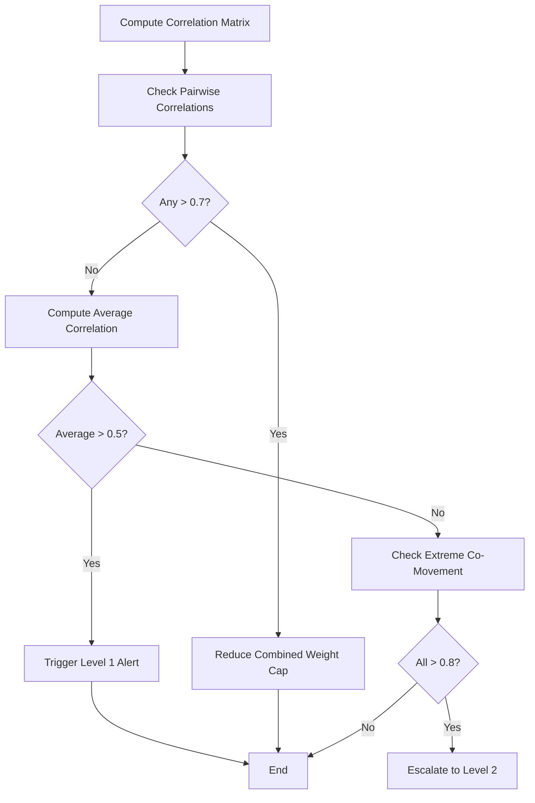
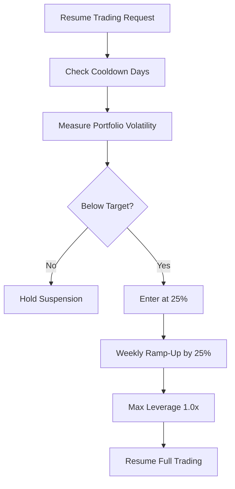
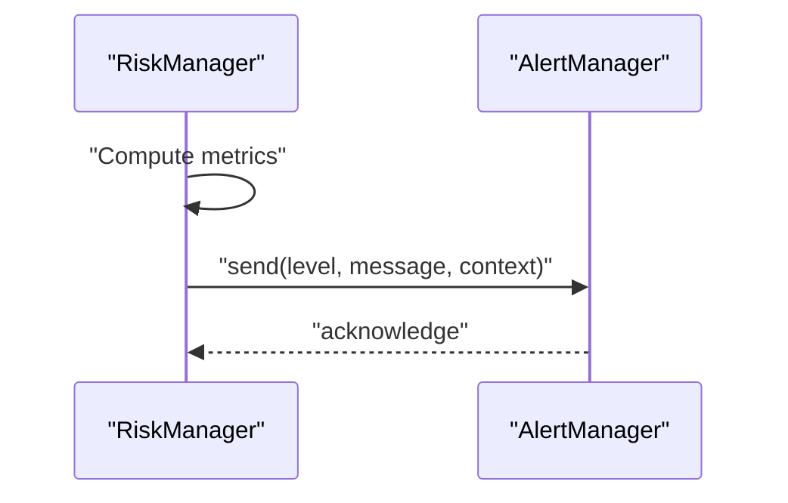
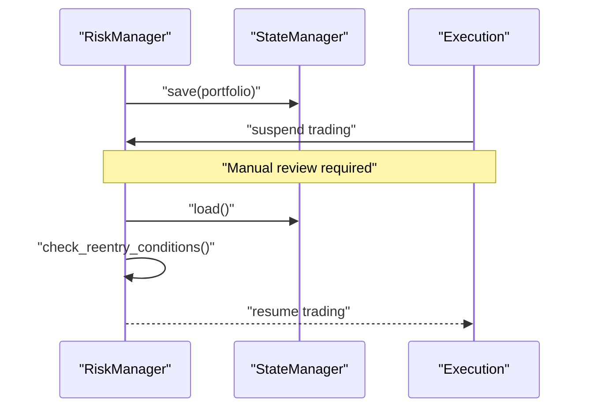
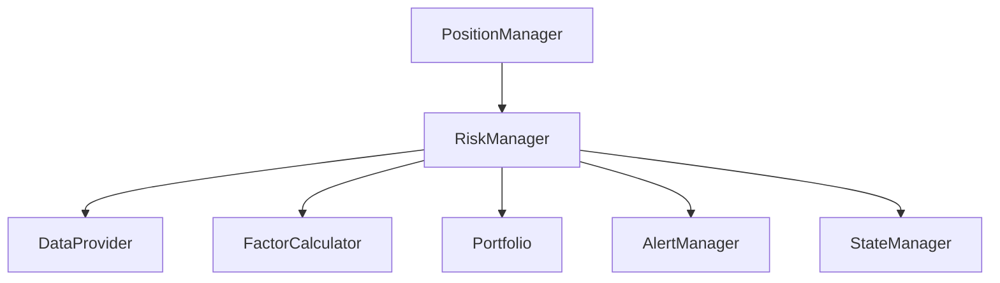

# RiskManager Interface

<cite>
**Referenced Files in This Document**
- [PRD_Intelligent_Trading_System_v2.md](file://PRD_Intelligent_Trading_System_v2.md)
- [Tech_Design_Document.md](file://Tech_Design_Document.md)
</cite>

## Table of Contents
1. [Introduction](#introduction)
2. [Project Structure](#project-structure)
3. [Core Components](#core-components)
4. [Architecture Overview](#architecture-overview)
5. [Detailed Component Analysis](#detailed-component-analysis)
6. [Dependency Analysis](#dependency-analysis)
7. [Performance Considerations](#performance-considerations)
8. [Troubleshooting Guide](#troubleshooting-guide)
9. [Conclusion](#conclusion)
10. [Appendices](#appendices)

## Introduction
This document provides comprehensive API documentation for the RiskManager interface class within the Intelligent Trading System. It focuses on four core methods: check(), get_risk_level(), get_correlation_matrix(), and check_reentry_conditions(). It also documents the hierarchical risk control system (Levels 1–4), correlation monitoring thresholds, de-risking mechanisms, automated de-risking triggers, recovery condition checking, risk metrics calculation, alert generation, integration with trading suspension systems, and performance optimization strategies for real-time risk monitoring and correlation matrix computations.

## Project Structure
The RiskManager interface is part of the broader trading system architecture. The project structure organizes risk-related functionality under the src/risk package, with supporting modules for data, factors, signals, portfolio management, execution, alerts, and state management. The RiskManager interacts with these modules to evaluate portfolio risk, compute correlation matrices, and enforce de-risking and re-entry policies.

**Section sources**
- [PRD_Intelligent_Trading_System_v2.md](file://PRD_Intelligent_Trading_System_v2.md#L1006-L1113)

## Core Components
This section documents the RiskManager interface and its methods, along with the hierarchical risk control system and related configuration parameters.

- RiskManager.check(portfolio: Portfolio) -> RiskAssessment
  - Purpose: Evaluate portfolio risk and return a RiskAssessment containing the current risk level, computed metrics, and recommended actions.
  - Inputs: Portfolio object representing current holdings, weights, and market values.
  - Outputs: RiskAssessment object indicating risk level (0–4), metrics, and action flags.
  - Integration: Uses DataProvider for market data, FactorCalculator for derived metrics, and AlertManager for notifications.

- RiskManager.get_risk_level() -> int
  - Purpose: Return the current risk level (0–4) based on the latest assessment.
  - Notes: Level 0 indicates normal operations; higher levels correspond to increasing de-risking intensity.

- RiskManager.get_correlation_matrix() -> pd.DataFrame
  - Purpose: Return the latest correlation matrix computed over the configured rolling window.
  - Notes: Used for monitoring pairwise correlations among core assets and triggering correlation-based controls.

- RiskManager.check_reentry_conditions() -> bool
  - Purpose: Determine whether re-entry conditions after a trading suspension (e.g., Level 4) are met.
  - Notes: Enforces cooldown days, volatility thresholds, and position ramp-up rules during recovery.

**Section sources**
- [PRD_Intelligent_Trading_System_v2.md](file://PRD_Intelligent_Trading_System_v2.md#L418-L455)

## Architecture Overview
The RiskManager participates in a layered architecture:
- Data ingestion via DataProvider
- Factor computation via FactorCalculator
- Signal generation via SignalGenerator
- Position sizing and optimization via PositionManager
- Risk evaluation and enforcement via RiskManager
- Alerting via AlertManager
- State persistence and recovery via StateManager
- Execution via Execution module

**Diagram sources**
- [PRD_Intelligent_Trading_System_v2.md](file://PRD_Intelligent_Trading_System_v2.md#L418-L455)

## Detailed Component Analysis

### RiskManager.check() Method
Purpose: Compute portfolio risk metrics, compare against thresholds, and determine the appropriate risk level and actions.

Key responsibilities:
- Compute portfolio drawdown and compare against hierarchical thresholds.
- Monitor individual asset drawdowns and apply single-asset stop-loss rules.
- Track correlation metrics and enforce correlation-based controls.
- Enforce daily limits (max trades, turnover, leverage).
- Generate alerts and update state upon risk events.

Processing logic:
- Fetch price data for core and extended assets.
- Calculate returns, cumulative returns, and drawdown series.
- Derive factor-based metrics (e.g., volatility) for risk attribution.
- Compute correlation matrix and average correlation.
- Compare metrics to thresholds to set risk level and actions.
- Trigger alerts and persist state for auditability.

**Section sources**
- [PRD_Intelligent_Trading_System_v2.md](file://PRD_Intelligent_Trading_System_v2.md#L288-L332)
- [PRD_Intelligent_Trading_System_v2.md](file://PRD_Intelligent_Trading_System_v2.md#L1271-L1304)

### Risk Levels and De-Risking Mechanisms
Hierarchical risk control system:
- Level 1 (Monitoring/Alert): Triggered by portfolio drawdown thresholds; actions include alert generation, reduced confidence thresholds for new entries, and prohibition of new BTC positions.
- Level 2 (Gradual Reduction): Triggered by higher drawdown thresholds; actions include proportional position reductions (25%), restriction to selling and hedging, closing BTC exposure, and logging reasons.
- Level 3 (Heavy Reduction): Triggered by further elevated drawdown thresholds; actions include reducing positions to 50% and focusing on safe-haven assets (e.g., GLD, TLT), with manual review workflow.
- Level 4 (Emergency Liquidation): Triggered by severe drawdown thresholds; actions include emergency liquidation of risky assets, retaining cash and GLD (if not subject to single-asset stop-loss), and requiring manual approval to resume trading.

Single-Asset Stop-Loss:
- Asset drawdown > 12%: Reduce position to 50%.
- Asset drawdown > 18%: Liquidate the asset.

**Section sources**
- [PRD_Intelligent_Trading_System_v2.md](file://PRD_Intelligent_Trading_System_v2.md#L288-L321)

### Correlation Monitoring and Controls
Correlation monitoring thresholds:
- Pairwise correlation > 0.7 for any core asset pair: reduce combined weight cap for that pair.
- Average portfolio correlation > 0.5: trigger Level 1 alert.
- Extreme co-movement (all assets moving together > 0.8): automatically escalate to Level 2.

Computation:
- Rolling window: 60-day lookback.
- Matrix: pairwise correlations among core assets.
- Controls: adjust position caps and trigger alerts based on thresholds.

**Section sources**
- [PRD_Intelligent_Trading_System_v2.md](file://PRD_Intelligent_Trading_System_v2.md#L322-L327)
- [PRD_Intelligent_Trading_System_v2.md](file://PRD_Intelligent_Trading_System_v2.md#L1287-L1290)

### Re-Entry Conditions and Recovery Procedures
Recovery rules:
- After Level 4 suspension: require consecutive days of portfolio volatility below target before re-entry.
- Initial re-entry: enter at 25% position; weekly increments of 25% up to full capacity.
- During recovery: maximum leverage capped at 1.0x.

**Section sources**
- [PRD_Intelligent_Trading_System_v2.md](file://PRD_Intelligent_Trading_System_v2.md#L317-L321)
- [PRD_Intelligent_Trading_System_v2.md](file://PRD_Intelligent_Trading_System_v2.md#L1292-L1296)

### Risk Metrics Calculation and Alert Generation
Risk metrics:
- Portfolio drawdown: peak-to-trough decline over the lookback period.
- Individual asset drawdown: per-symbol peak-to-trough.
- Volatility: annualized standard deviation of returns.
- Turnover: sum of absolute weight changes divided by 2.
- Correlation: pairwise and average correlation among core assets.

Alert generation:
- Channels: Slack, Email.
- Context: risk level, metrics, affected assets, and recommended actions.
- Integration: AlertManager.send(level, message, context).

**Section sources**
- [PRD_Intelligent_Trading_System_v2.md](file://PRD_Intelligent_Trading_System_v2.md#L453-L455)
- [PRD_Intelligent_Trading_System_v2.md](file://PRD_Intelligent_Trading_System_v2.md#L1318-L1323)

### Integration with Trading Suspension Systems
Suspension and resumption:
- Level 4 triggers emergency suspension; manual override required for resumption.
- Re-entry checks enforce cooldown and volatility conditions before allowing increased position sizes.
- State persistence ensures recovery can resume from the last saved state.

**Section sources**
- [PRD_Intelligent_Trading_System_v2.md](file://PRD_Intelligent_Trading_System_v2.md#L308-L311)
- [PRD_Intelligent_Trading_System_v2.md](file://PRD_Intelligent_Trading_System_v2.md#L317-L321)

## Dependency Analysis
RiskManager depends on several modules for data, computation, and operational control. The following diagram outlines key dependencies and interactions.

**Diagram sources**
- [PRD_Intelligent_Trading_System_v2.md](file://PRD_Intelligent_Trading_System_v2.md#L418-L455)

**Section sources**
- [PRD_Intelligent_Trading_System_v2.md](file://PRD_Intelligent_Trading_System_v2.md#L418-L455)

## Performance Considerations
Real-time risk monitoring and correlation matrix computations demand efficient implementations:
- Data fetching
  - Batch symbol requests to minimize API calls.
  - Cache recent price windows to avoid redundant fetches.
  - Use asynchronous or concurrent fetching for multiple symbols.

- Factor computation
  - Vectorized calculations for returns and drawdowns.
  - Incremental updates for rolling metrics to avoid recomputing entire histories.

- Correlation matrix
  - Maintain a rolling window buffer; add new periods and drop old ones efficiently.
  - Use optimized linear algebra libraries for covariance and correlation computations.
  - Cache intermediate results (covariance matrix) when the asset universe is stable.

- Risk evaluation
  - Early exits when thresholds are exceeded to avoid unnecessary computation.
  - Parallelize metric computations across assets where possible.

- Alerting and state persistence
  - Asynchronous alert dispatch to avoid blocking risk evaluation.
  - Batch state saves to reduce I/O overhead.

[No sources needed since this section provides general guidance]

## Troubleshooting Guide
Common issues and resolutions:
- Incorrect risk level
  - Verify thresholds in configuration and ensure proper comparison logic.
  - Confirm drawdown calculation uses correct lookback and compounding assumptions.

- Missing or stale correlation matrix
  - Check data availability and ensure sufficient history for the rolling window.
  - Validate correlation computation pipeline and matrix shape consistency.

- Re-entry premature activation
  - Confirm cooldown days and volatility targets are correctly enforced.
  - Review ramp-up logic and leverage caps during recovery.

- Alert delivery failures
  - Validate alert channel configurations and credentials.
  - Check alert payload completeness and context inclusion.

**Section sources**
- [PRD_Intelligent_Trading_System_v2.md](file://PRD_Intelligent_Trading_System_v2.md#L1271-L1304)
- [PRD_Intelligent_Trading_System_v2.md](file://PRD_Intelligent_Trading_System_v2.md#L1318-L1323)

## Conclusion
The RiskManager interface provides a robust framework for dynamic risk control, integrating portfolio-wide and single-asset assessments with correlation monitoring and disciplined re-entry procedures. By adhering to the hierarchical risk levels, enforcing strict daily limits, and leveraging efficient computational strategies, the system maintains resilience across varying market conditions while ensuring transparent alerting and recoverable trading states.

[No sources needed since this section summarizes without analyzing specific files]

## Appendices

### API Reference Summary
- RiskManager.check(portfolio: Portfolio) -> RiskAssessment
  - Evaluates portfolio risk and returns a structured assessment with risk level and actions.
- RiskManager.get_risk_level() -> int
  - Returns current risk level (0–4).
- RiskManager.get_correlation_matrix() -> pd.DataFrame
  - Returns the latest correlation matrix for core assets.
- RiskManager.check_reentry_conditions() -> bool
  - Determines if re-entry conditions after suspension are satisfied.

**Section sources**
- [PRD_Intelligent_Trading_System_v2.md](file://PRD_Intelligent_Trading_System_v2.md#L438-L442)