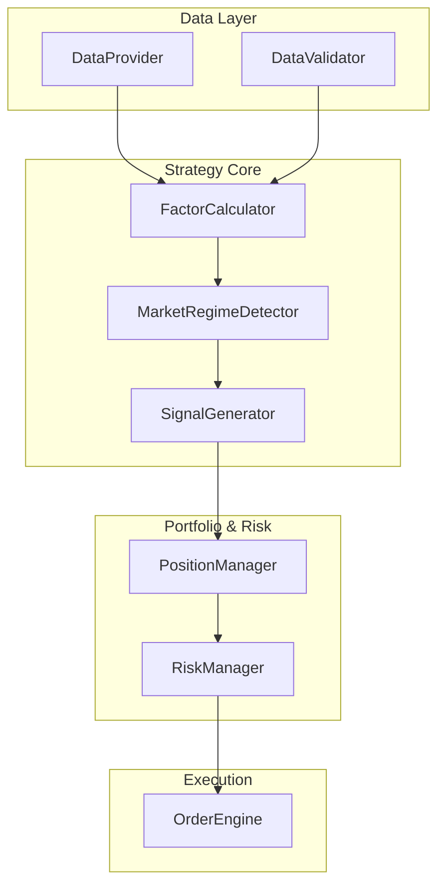
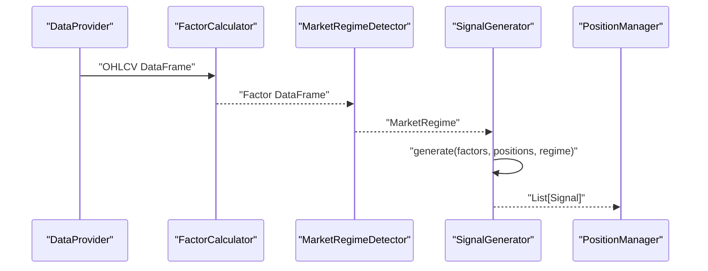
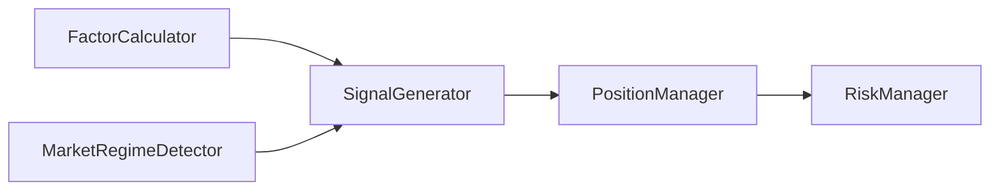

# SignalGenerator Interface

<cite>
**Referenced Files in This Document**
- [PRD_Intelligent_Trading_System_v2.md](file://PRD_Intelligent_Trading_System_v2.md)
- [Tech_Design_Document.md](file://Tech_Design_Document.md)
</cite>

## Table of Contents
1. [Introduction](#introduction)
2. [Project Structure](#project-structure)
3. [Core Components](#core-components)
4. [Architecture Overview](#architecture-overview)
5. [Detailed Component Analysis](#detailed-component-analysis)
6. [Dependency Analysis](#dependency-analysis)
7. [Performance Considerations](#performance-considerations)
8. [Troubleshooting Guide](#troubleshooting-guide)
9. [Conclusion](#conclusion)
10. [Appendices](#appendices)

## Introduction
This document provides comprehensive API documentation for the SignalGenerator interface class. It explains how the generate() method produces trading signals from factor data, including signal types (BUY/SELL/HOLD), confidence scoring, and target weight calculations. It also documents integration with MarketRegime filtering, position constraints, and risk management systems. The document includes examples of signal generation workflows, threshold configurations, market environment adaptation, data structures, parameter validation, error handling, signal quality metrics, backtesting integration, and performance optimization for real-time signal generation.

## Project Structure
The SignalGenerator interface is part of a modular trading system with clear separation of concerns across data ingestion, factor computation, signal generation, portfolio optimization, risk management, and execution. The interface definition and functional requirements are specified in the product requirements and technical design documents.

**Diagram sources**
- [Tech_Design_Document.md](file://Tech_Design_Document.md#L301-L315)
- [PRD_Intelligent_Trading_System_v2.md](file://PRD_Intelligent_Trading_System_v2.md#L418-L455)

**Section sources**
- [Tech_Design_Document.md](file://Tech_Design_Document.md#L301-L315)
- [PRD_Intelligent_Trading_System_v2.md](file://PRD_Intelligent_Trading_System_v2.md#L418-L455)

## Core Components
- SignalGenerator.generate(factors, positions, regime) -> List[Signal]
  - Inputs:
    - factors: DataFrame containing computed factors (momentum, volatility, moving averages, etc.)
    - positions: Dict representing current holdings
    - regime: MarketRegime object indicating current market environment
  - Output:
    - List of Signal objects with fields: symbol, signal type, confidence, target_weight, reason, regime

Key responsibilities:
- Apply signal logic based on factor thresholds and market regime
- Adjust confidence based on volatility regimes
- Produce actionable signals for downstream position management

Integration points:
- MarketRegime filtering affects signal validity and confidence
- Position constraints influence target weight calculation
- Risk management governs allowable actions and position sizing

**Section sources**
- [PRD_Intelligent_Trading_System_v2.md](file://PRD_Intelligent_Trading_System_v2.md#L220-L245)
- [PRD_Intelligent_Trading_System_v2.md](file://PRD_Intelligent_Trading_System_v2.md#L418-L455)
- [Tech_Design_Document.md](file://Tech_Design_Document.md#L317-L350)

## Architecture Overview
The signal generation pipeline transforms raw price data into actionable signals through a series of stages: data acquisition, factor computation, market regime detection, and signal generation. The SignalGenerator sits at the center of this pipeline, consuming factor data and regime information to produce signals consumed by position management and risk controls.

**Diagram sources**
- [Tech_Design_Document.md](file://Tech_Design_Document.md#L301-L315)
- [PRD_Intelligent_Trading_System_v2.md](file://PRD_Intelligent_Trading_System_v2.md#L418-L455)

## Detailed Component Analysis

### SignalGenerator.generate() Method
Purpose:
- Convert factor data into tradeable signals with confidence and rationale
- Adapt signals to current market regime conditions

Inputs:
- factors: DataFrame with factor columns (e.g., momentum, SMA_20, SMA_50, SMA_200, VIX)
- positions: Dict mapping symbol to current position details
- regime: MarketRegime object indicating environment state

Processing logic:
- Threshold-based classification:
  - STRONG_BUY: momentum > high_threshold AND price > SMA_50 AND price > SMA_200 AND VIX < 30
  - BUY: momentum > low_threshold AND price > SMA_20
  - SELL: momentum < neg_threshold OR price < SMA_50
  - STRONG_SELL: momentum < neg_high_threshold AND price < SMA_200
  - HOLD: otherwise
- Market regime adjustments:
  - High volatility (VIX > 30): reduce all signal confidence by 50%
  - Extreme volatility (VIX > 40): only allow reduce-position signals

Outputs:
- List of Signal objects with:
  - symbol: asset identifier
  - signal: BUY/SELL/HOLD/STRONG_BUY/STRONG_SELL
  - confidence: normalized score reflecting signal strength and regime impact
  - target_weight: suggested weight contribution derived from signal strength and risk budget
  - reason: textual explanation for the signal
  - regime: current market environment label

Confidence scoring:
- Base confidence derived from factor strength (e.g., momentum magnitude)
- Regime-adjusted confidence applied post-classification

Target weight calculation:
- Derived from signal strength and risk budget constraints
- Combined with position constraints and portfolio optimization targets

Market regime filtering:
- VIX thresholds drive confidence reduction and action restrictions
- Regime-aware signal types ensure conservative behavior under stress

Position constraints:
- Downstream position management enforces maximum weights and turnover limits
- Signals are scaled to respect existing positions and constraints

Risk management integration:
- Risk controls may override or constrain signals (e.g., reduce-position-only in extreme regimes)
- Signals inform risk assessments and re-entry decisions

**Section sources**
- [PRD_Intelligent_Trading_System_v2.md](file://PRD_Intelligent_Trading_System_v2.md#L220-L245)
- [PRD_Intelligent_Trading_System_v2.md](file://PRD_Intelligent_Trading_System_v2.md#L247-L263)
- [Tech_Design_Document.md](file://Tech_Design_Document.md#L317-L350)

### Signal Data Structure
Fields:
- symbol: string
- signal: enum-like value (BUY/SELL/HOLD/STRONG_BUY/STRONG_SELL)
- confidence: float in [0, 1]
- target_weight: float representing desired weight contribution
- reason: string describing triggering factors and rationale
- regime: string describing current market environment

Validation:
- Ensure symbol exists in asset universe
- Validate factor columns present in input DataFrame
- Confirm positions dictionary keys match symbols
- Verify regime object contains required attributes

Error handling:
- Missing factor data: skip symbol or raise validation error
- Invalid regime state: default to neutral regime and log warning
- NaN or infinite factor values: impute or exclude affected symbols
- Out-of-range confidence/target_weight: clip to valid bounds

Edge cases:
- Flat or trending regimes with minimal momentum
- Symbols near maximum weight limits
- Mixed signals across assets requiring portfolio-level aggregation

**Section sources**
- [PRD_Intelligent_Trading_System_v2.md](file://PRD_Intelligent_Trading_System_v2.md#L236-L245)
- [PRD_Intelligent_Trading_System_v2.md](file://PRD_Intelligent_Trading_System_v2.md#L247-L263)
- [Tech_Design_Document.md](file://Tech_Design_Document.md#L317-L350)

### Market Regime Filtering
Regime logic:
- NORMAL: baseline signal generation
- HIGH_VOLATILITY: reduce signal confidence by 50%
- EXTREME_VOLATILITY: restrict actions to reduce-position signals

Integration:
- Regime detector computes VIX-based environment state
- SignalGenerator applies regime filters to generated signals
- PositionManager and RiskManager further constrain actions

Thresholds:
- VIX > 40: extreme regime
- VIX > 30: high regime
- Else: normal regime

**Section sources**
- [PRD_Intelligent_Trading_System_v2.md](file://PRD_Intelligent_Trading_System_v2.md#L232-L234)
- [Tech_Design_Document.md](file://Tech_Design_Document.md#L317-L350)

### Position Constraints and Risk Management
Constraints:
- Maximum individual asset weights
- Portfolio target volatility and leverage caps
- Minimum trade amounts and rebalance thresholds
- Cash buffer requirements

Risk controls:
- Hierarchical risk levels based on drawdown thresholds
- Single-asset stop-loss triggers
- Correlation monitoring and mitigation
- Re-entry logic after severe drawdowns

Integration with SignalGenerator:
- Signals are scaled to respect constraints
- Risk checks may downgrade or cancel signals
- PositionManager resolves conflicts between signals and constraints

**Section sources**
- [PRD_Intelligent_Trading_System_v2.md](file://PRD_Intelligent_Trading_System_v2.md#L252-L263)
- [Tech_Design_Document.md](file://Tech_Design_Document.md#L352-L404)

### Signal Quality Metrics and Backtesting Integration
Metrics:
- Signal hit rate, precision, recall
- Confusion matrices by regime
- Turnover-adjusted returns
- Stress-test performance across market regimes

Backtesting:
- Historical simulation using stored factor data
- Walk-forward validation to avoid lookahead bias
- Scenario testing under crisis conditions

Integration:
- Signals feed into portfolio optimization and execution
- Performance tracked against benchmarks and regime-specific targets

**Section sources**
- [PRD_Intelligent_Trading_System_v2.md](file://PRD_Intelligent_Trading_System_v2.md#L334-L362)
- [Tech_Design_Document.md](file://Tech_Design_Document.md#L501-L524)

### Examples of Signal Generation Workflows
Workflow A: Normal market conditions
- Input: factors with positive momentum, price above SMA_20 and SMA_50, VIX < 30
- Output: BUY signal with high confidence and moderate target_weight
- Reason: strong momentum and supportive trend

Workflow B: High volatility environment
- Input: factors meet buy criteria, but VIX > 30
- Output: BUY signal with reduced confidence (50%)
- Reason: favorable fundamentals, but elevated volatility reduces signal reliability

Workflow C: Extreme volatility environment
- Input: factors indicate buying, but VIX > 40
- Output: HOLD or reduce-position signal
- Reason: extreme volatility overrides directional bias

Workflow D: Strong momentum with trend confirmation
- Input: momentum exceeds high threshold, price above SMA_50 and SMA_200, VIX < 30
- Output: STRONG_BUY with highest confidence and aggressive target_weight
- Reason: robust momentum with multiple trend confirmations

**Section sources**
- [PRD_Intelligent_Trading_System_v2.md](file://PRD_Intelligent_Trading_System_v2.md#L225-L230)
- [PRD_Intelligent_Trading_System_v2.md](file://PRD_Intelligent_Trading_System_v2.md#L232-L234)

### Threshold Configurations
Configurable thresholds:
- Low and high momentum thresholds for BUY/SELL classification
- SMA-based trend filters (SMA_20, SMA_50, SMA_200)
- VIX thresholds for regime classification
- Confidence adjustment multipliers

Storage and retrieval:
- Strategy configuration YAML defines thresholds
- Runtime updates supported via configuration reload

Validation:
- Threshold ranges validated against historical distributions
- Sensitivity analysis performed to optimize thresholds

**Section sources**
- [PRD_Intelligent_Trading_System_v2.md](file://PRD_Intelligent_Trading_System_v2.md#L225-L230)
- [Tech_Design_Document.md](file://Tech_Design_Document.md#L1009-L1113)

### Market Environment Adaptation
Adaptation mechanisms:
- Regime-aware confidence scaling
- Action restriction in extreme environments
- Trend-filtered signals to avoid counter-trend entries

Monitoring:
- Continuous VIX tracking
- Dynamic adjustment of signal thresholds based on regime statistics

**Section sources**
- [PRD_Intelligent_Trading_System_v2.md](file://PRD_Intelligent_Trading_System_v2.md#L232-L234)
- [Tech_Design_Document.md](file://Tech_Design_Document.md#L317-L350)

### Parameter Validation and Error Handling
Validation steps:
- Factor completeness check
- Position consistency verification
- Regime state sanity checks
- Output normalization and bounds enforcement

Error handling:
- Graceful degradation to HOLD signals under missing data
- Logging and alerting for invalid inputs
- Circuit breakers for persistent regime anomalies

**Section sources**
- [PRD_Intelligent_Trading_System_v2.md](file://PRD_Intelligent_Trading_System_v2.md#L236-L245)
- [Tech_Design_Document.md](file://Tech_Design_Document.md#L317-L350)

### Performance Optimization for Real-Time Signal Generation
Optimization strategies:
- Vectorized factor computations
- Efficient regime filtering
- Minimal memory footprint for streaming data
- Batch processing for multiple symbols

Scalability:
- Parallel processing of symbols
- Caching of recent factor windows
- Incremental updates to avoid recomputation

**Section sources**
- [Tech_Design_Document.md](file://Tech_Design_Document.md#L250-L295)

## Dependency Analysis
SignalGenerator depends on:
- FactorCalculator for factor data
- MarketRegimeDetector for environment state
- PositionManager for constraint enforcement
- RiskManager for risk controls

**Diagram sources**
- [PRD_Intelligent_Trading_System_v2.md](file://PRD_Intelligent_Trading_System_v2.md#L418-L455)
- [Tech_Design_Document.md](file://Tech_Design_Document.md#L301-L315)

**Section sources**
- [PRD_Intelligent_Trading_System_v2.md](file://PRD_Intelligent_Trading_System_v2.md#L418-L455)
- [Tech_Design_Document.md](file://Tech_Design_Document.md#L301-L315)

## Performance Considerations
- Prefer vectorized operations over loops for factor computations
- Cache recent factor windows to minimize recomputation
- Use incremental updates for streaming data
- Limit concurrent symbol processing to avoid resource contention
- Monitor latency and throughput in production deployments

[No sources needed since this section provides general guidance]

## Troubleshooting Guide
Common issues:
- Missing factor data: verify factor computation pipeline and data sources
- Invalid regime state: check VIX data and regime thresholds
- Excessive confidence scaling: review regime thresholds and confidence adjustments
- Position constraint violations: adjust target weights and rebalance thresholds

Diagnostic steps:
- Log input factor statistics and regime state
- Validate signal reason strings for transparency
- Monitor runtime performance and memory usage
- Run unit tests for edge cases and boundary conditions

**Section sources**
- [PRD_Intelligent_Trading_System_v2.md](file://PRD_Intelligent_Trading_System_v2.md#L236-L245)
- [Tech_Design_Document.md](file://Tech_Design_Document.md#L317-L350)

## Conclusion
The SignalGenerator interface provides a robust, regime-adaptive mechanism for transforming factor data into actionable trading signals. Its integration with market regime detection, position constraints, and risk management ensures disciplined, transparent, and resilient signal generation suitable for both research and production environments.

[No sources needed since this section summarizes without analyzing specific files]

## Appendices
- Configuration examples and YAML templates for threshold tuning
- Backtesting harness and scenario definitions
- Alerting and monitoring dashboards for signal quality

[No sources needed since this section provides general guidance]