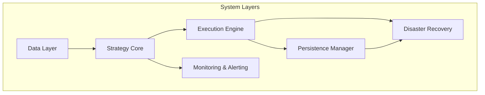
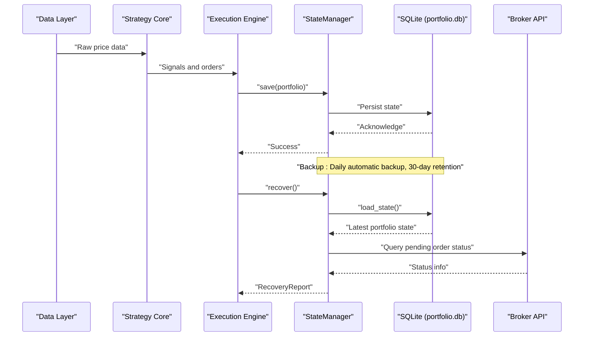
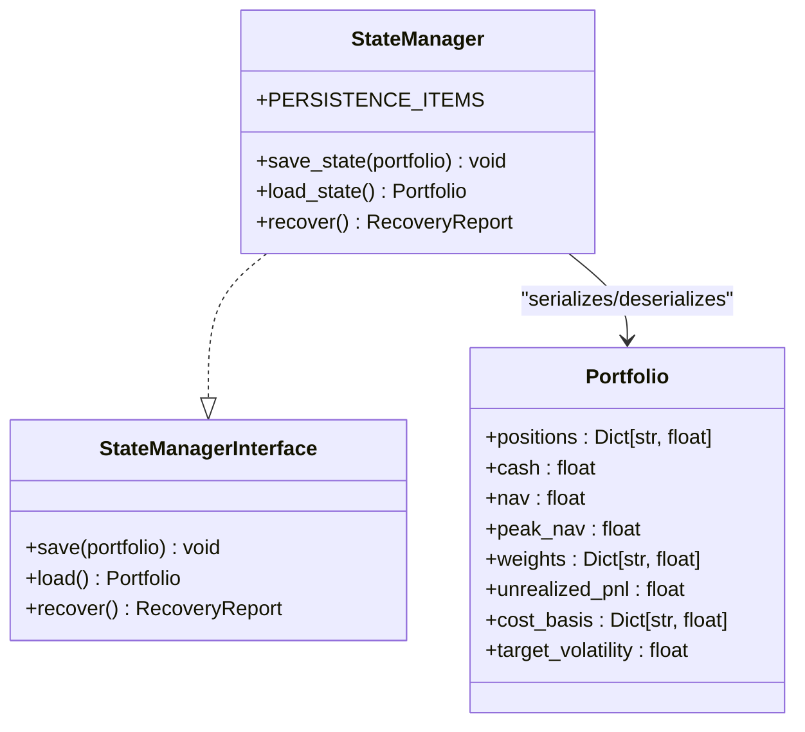
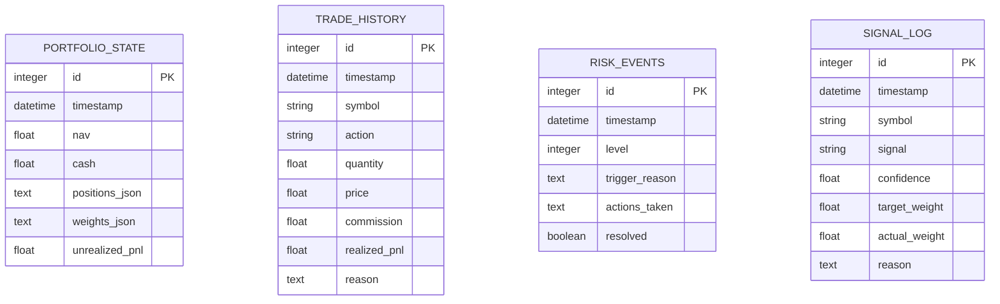
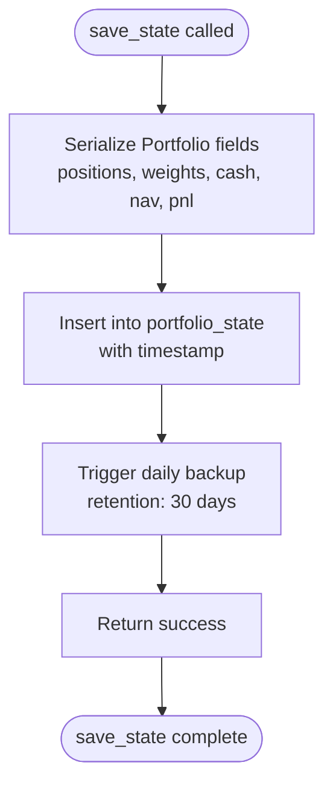
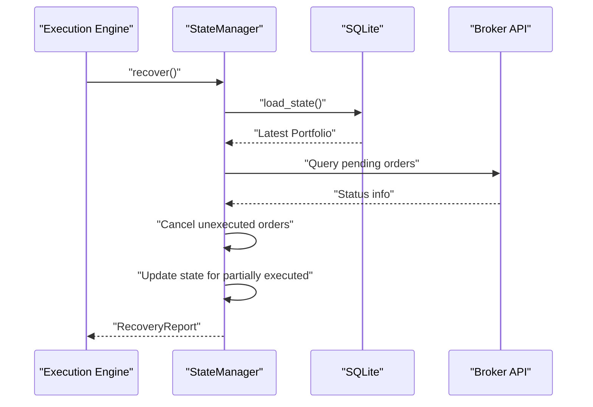
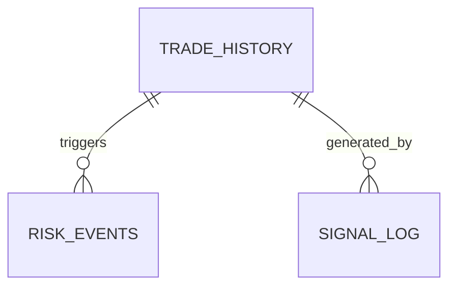
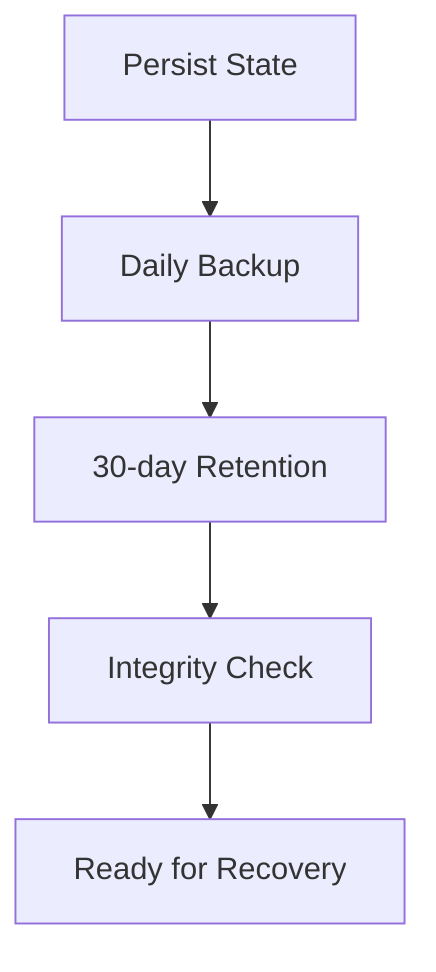
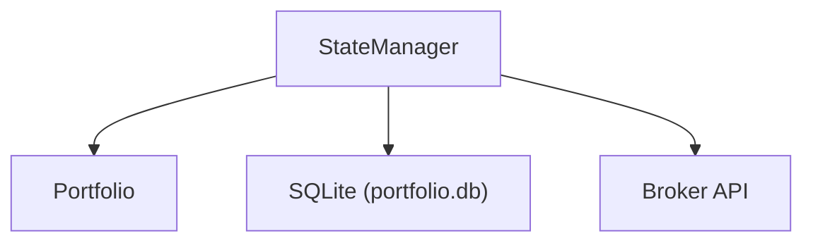

# StateManager Interface

<cite>
**Referenced Files in This Document**
- [Tech_Design_Document.md](file://Tech_Design_Document.md)
- [PRD_Intelligent_Trading_System_v2.md](file://PRD_Intelligent_Trading_System_v2.md)
</cite>

## Table of Contents
1. [Introduction](#introduction)
2. [Project Structure](#project-structure)
3. [Core Components](#core-components)
4. [Architecture Overview](#architecture-overview)
5. [Detailed Component Analysis](#detailed-component-analysis)
6. [Dependency Analysis](#dependency-analysis)
7. [Performance Considerations](#performance-considerations)
8. [Troubleshooting Guide](#troubleshooting-guide)
9. [Conclusion](#conclusion)
10. [Appendices](#appendices)

## Introduction
This document provides comprehensive API documentation for the StateManager interface class, focusing on portfolio state persistence, restoration, and recovery procedures. It covers SQLite database operations, portfolio state serialization, recovery logic after system interruptions, backup strategies, integrity verification, concurrent access handling, and performance optimization for frequent state updates. The documentation also includes examples of state persistence workflows, recovery procedures, and audit trail maintenance.

## Project Structure
The StateManager resides within the broader trading system architecture and interacts with the data, strategy, execution, and monitoring layers. The persistence layer integrates with SQLite for state storage and maintains audit trails for compliance and risk management.

**Diagram sources**
- [Tech_Design_Document.md](file://Tech_Design_Document.md#L60-L86)
- [Tech_Design_Document.md](file://Tech_Design_Document.md#L88-L117)

**Section sources**
- [Tech_Design_Document.md](file://Tech_Design_Document.md#L60-L86)
- [Tech_Design_Document.md](file://Tech_Design_Document.md#L88-L117)

## Core Components
The StateManager interface defines three primary methods:
- save(portfolio): Persist portfolio state to SQLite
- load(): Restore the most recent persisted state
- recover(): Recover from system crashes and reconcile with broker

Key persistence items include portfolio_state, risk_state, trade_history, signal_log, and pending_orders.

**Section sources**
- [Tech_Design_Document.md](file://Tech_Design_Document.md#L839-L861)
- [Tech_Design_Document.md](file://Tech_Design_Document.md#L1456-L1474)

## Architecture Overview
The StateManager participates in the data flow from market data ingestion through factor calculation, signal generation, portfolio optimization, and execution, culminating in state persistence and recovery.

**Diagram sources**
- [Tech_Design_Document.md](file://Tech_Design_Document.md#L88-L117)
- [Tech_Design_Document.md](file://Tech_Design_Document.md#L839-L861)
- [Tech_Design_Document.md](file://Tech_Design_Document.md#L865-L888)

## Detailed Component Analysis

### StateManager Interface
The StateManager interface defines the contract for state persistence and recovery. It encapsulates portfolio state serialization and deserialization, audit trail maintenance, and recovery procedures.

**Diagram sources**
- [Tech_Design_Document.md](file://Tech_Design_Document.md#L1456-L1474)
- [Tech_Design_Document.md](file://Tech_Design_Document.md#L839-L861)
- [Tech_Design_Document.md](file://Tech_Design_Document.md#L968-L978)

**Section sources**
- [Tech_Design_Document.md](file://Tech_Design_Document.md#L1456-L1474)
- [Tech_Design_Document.md](file://Tech_Design_Document.md#L839-L861)
- [Tech_Design_Document.md](file://Tech_Design_Document.md#L968-L978)

### Portfolio Data Structure
The Portfolio data structure captures positions, cash, net asset value, peak NAV, weights, unrealized P&L, cost basis, and target volatility. These fields are persisted as part of the portfolio_state table and serialized to JSON for storage.

**Diagram sources**
- [Tech_Design_Document.md](file://Tech_Design_Document.md#L1004-L1044)

**Section sources**
- [Tech_Design_Document.md](file://Tech_Design_Document.md#L968-L978)
- [Tech_Design_Document.md](file://Tech_Design_Document.md#L1004-L1044)

### State Persistence Workflows
The save_state method persists portfolio state to SQLite with daily automatic backup and 30-day retention. The workflow ensures atomic writes and maintains audit trails.

**Diagram sources**
- [Tech_Design_Document.md](file://Tech_Design_Document.md#L851-L856)

**Section sources**
- [Tech_Design_Document.md](file://Tech_Design_Document.md#L851-L856)

### State Restoration and Recovery Procedures
The load_state method restores the most recent persisted state, while recover orchestrates crash recovery by querying broker APIs, reconciling pending orders, and writing recovery logs.

**Diagram sources**
- [Tech_Design_Document.md](file://Tech_Design_Document.md#L869-L878)
- [Tech_Design_Document.md](file://Tech_Design_Document.md#L881-L887)

**Section sources**
- [Tech_Design_Document.md](file://Tech_Design_Document.md#L858-L861)
- [Tech_Design_Document.md](file://Tech_Design_Document.md#L869-L878)
- [Tech_Design_Document.md](file://Tech_Design_Document.md#L881-L887)

### Audit Trail Maintenance
The system maintains comprehensive audit trails across trade_history, risk_events, and signal_log tables. These records support compliance, risk monitoring, and post-trade analysis.

**Diagram sources**
- [Tech_Design_Document.md](file://Tech_Design_Document.md#L1014-L1044)

**Section sources**
- [Tech_Design_Document.md](file://Tech_Design_Document.md#L1014-L1044)

### Backup Strategies and Integrity Verification
The persistence layer implements daily automatic backups with 30-day retention. Integrity verification mechanisms ensure data consistency and enable recovery from failures.

**Diagram sources**
- [Tech_Design_Document.md](file://Tech_Design_Document.md#L853-L855)

**Section sources**
- [Tech_Design_Document.md](file://Tech_Design_Document.md#L853-L855)

## Dependency Analysis
StateManager depends on the Portfolio data structure and interacts with SQLite for persistence and recovery. It coordinates with the execution engine and broker API for order reconciliation.

**Diagram sources**
- [Tech_Design_Document.md](file://Tech_Design_Document.md#L839-L861)
- [Tech_Design_Document.md](file://Tech_Design_Document.md#L968-L978)
- [Tech_Design_Document.md](file://Tech_Design_Document.md#L865-L888)

**Section sources**
- [Tech_Design_Document.md](file://Tech_Design_Document.md#L839-L861)
- [Tech_Design_Document.md](file://Tech_Design_Document.md#L968-L978)
- [Tech_Design_Document.md](file://Tech_Design_Document.md#L865-L888)

## Performance Considerations
- Frequent state updates: Batch updates and minimize write frequency to reduce I/O overhead.
- Serialization: Use efficient JSON serialization for positions and weights; consider compression for large datasets.
- Indexing: Ensure SQLite tables are indexed appropriately for timestamp queries and lookups.
- Concurrency: Implement advisory locks or WAL mode to handle concurrent access safely.
- Backup scheduling: Schedule backups during off-peak hours to avoid impacting performance.

[No sources needed since this section provides general guidance]

## Troubleshooting Guide
Common issues and resolutions:
- State not loading: Verify the latest timestamp record exists in portfolio_state and check for database corruption.
- Recovery inconsistencies: Use reconcile_with_broker to compare local state with broker positions and flag discrepancies.
- Backup failures: Confirm backup job runs daily and retains 30-day history; validate backup integrity periodically.

**Section sources**
- [Tech_Design_Document.md](file://Tech_Design_Document.md#L869-L878)
- [Tech_Design_Document.md](file://Tech_Design_Document.md#L881-L887)

## Conclusion
The StateManager interface provides a robust foundation for portfolio state persistence, restoration, and recovery. By leveraging SQLite, maintaining comprehensive audit trails, implementing daily backups, and coordinating with broker APIs for reconciliation, the system ensures data consistency and resilience against interruptions. Proper indexing, serialization strategies, and concurrency controls further enhance performance and reliability for frequent state updates.

## Appendices
- Database schema and table definitions for portfolio_state, trade_history, risk_events, and signal_log.
- Interface definitions for StateManagerInterface and related components.

**Section sources**
- [Tech_Design_Document.md](file://Tech_Design_Document.md#L1004-L1044)
- [Tech_Design_Document.md](file://Tech_Design_Document.md#L1456-L1474)