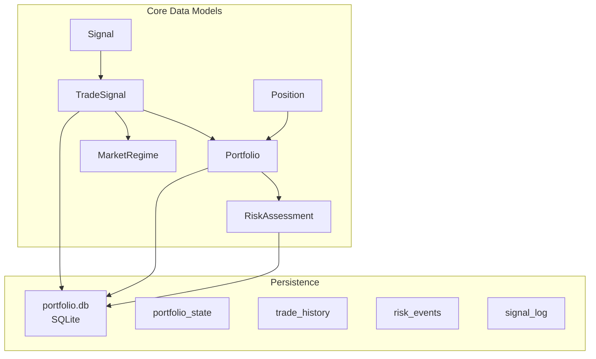
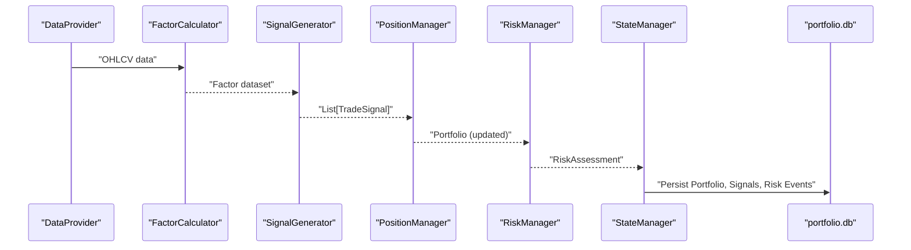
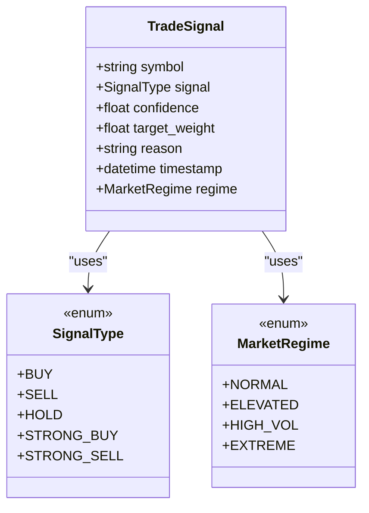
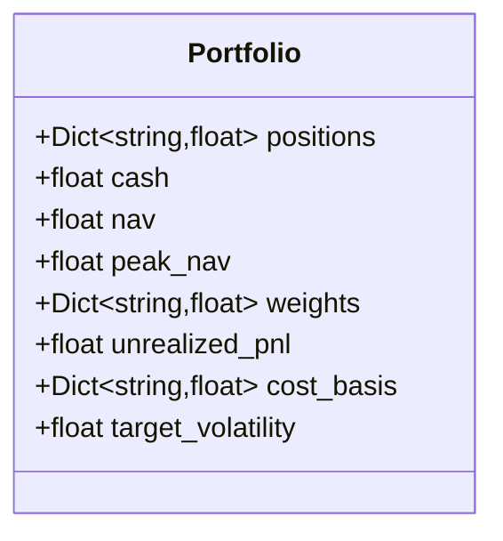
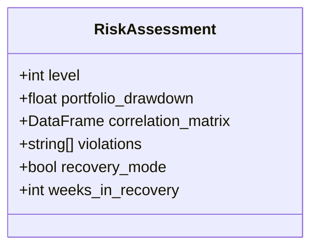
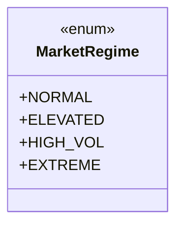
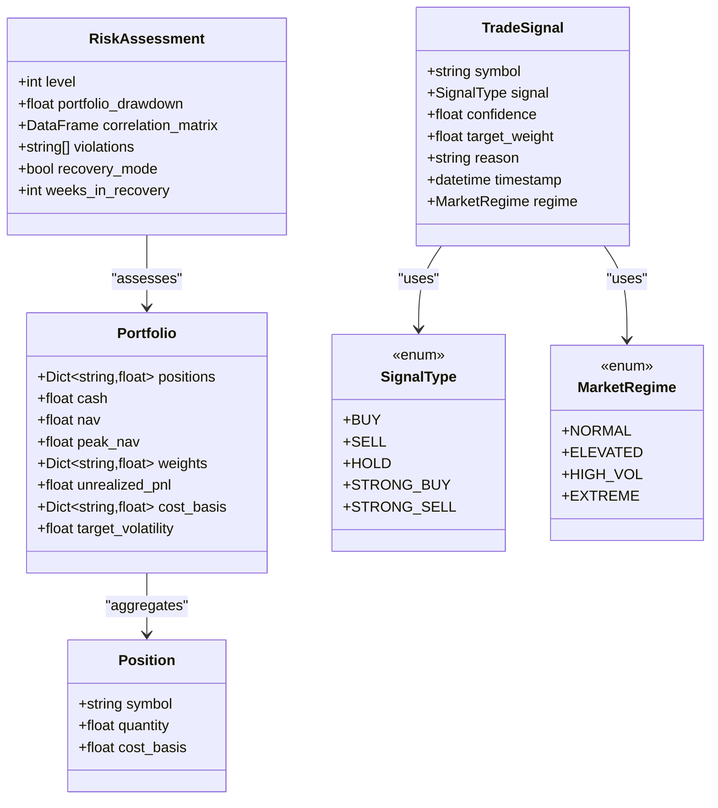
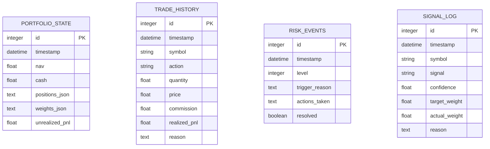

# Data Models and Structures

<cite>
**Referenced Files in This Document**
- [PRD_Intelligent_Trading_System_v2.md](file://PRD_Intelligent_Trading_System_v2.md)
- [Tech_Design_Document.md](file://Tech_Design_Document.md)
</cite>

## Table of Contents
1. [Introduction](#introduction)
2. [Project Structure](#project-structure)
3. [Core Components](#core-components)
4. [Architecture Overview](#architecture-overview)
5. [Detailed Component Analysis](#detailed-component-analysis)
6. [Dependency Analysis](#dependency-analysis)
7. [Performance Considerations](#performance-considerations)
8. [Troubleshooting Guide](#troubleshooting-guide)
9. [Conclusion](#conclusion)
10. [Appendices](#appendices)

## Introduction
This document provides comprehensive data model documentation for the trading system’s core data structures: TradeSignal, Portfolio, RiskAssessment, MarketRegime, Signal, and Position. It details entity relationships, field definitions, data types, validation rules, business constraints, serialization formats, and lifecycle management for database persistence. The goal is to enable both technical and non-technical stakeholders to understand how these models represent real-world trading concepts and how they interoperate within the system.

## Project Structure
The repository defines the trading system’s data models and persistence schema in the technical design document. The PRD provides the business logic and constraints that inform the shape and semantics of these models.

**Diagram sources**
- [Tech_Design_Document.md](file://Tech_Design_Document.md#L934-L1045)

**Section sources**
- [Tech_Design_Document.md](file://Tech_Design_Document.md#L934-L1045)
- [PRD_Intelligent_Trading_System_v2.md](file://PRD_Intelligent_Trading_System_v2.md#L220-L286)

## Core Components
This section introduces the six core data structures and their roles in the system.

- TradeSignal: Represents a single trading recommendation with confidence, target weight, reason, timestamp, and market regime.
- Portfolio: Encapsulates current holdings, cash, net asset value, cost basis, weights, and realized/unrealized PnL.
- RiskAssessment: Captures current risk level, drawdown, correlation matrix, and recovery mode metadata.
- MarketRegime: Enumerates macro environment states derived from VIX thresholds.
- Signal: An alias for TradeSignal used in interfaces and pipelines.
- Position: Represents a single symbol’s holding quantity and cost basis.

These models are defined as dataclasses and enums in the technical design document and are used across the data, strategy, and execution layers.

**Section sources**
- [Tech_Design_Document.md](file://Tech_Design_Document.md#L938-L997)
- [Tech_Design_Document.md](file://Tech_Design_Document.md#L944-L957)

## Architecture Overview
The data models flow through the system as follows:
- Data providers fetch OHLCV data and feed factor calculators.
- Factor calculators produce factor datasets used by the signal generator.
- Signal generator produces TradeSignal objects filtered by MarketRegime.
- Position manager computes target weights constrained by risk budget and portfolio constraints.
- Risk manager evaluates Portfolio and emits RiskAssessment.
- State manager persists Portfolio, TradeSignals, and risk events to SQLite.

**Diagram sources**
- [Tech_Design_Document.md](file://Tech_Design_Document.md#L934-L1045)
- [PRD_Intelligent_Trading_System_v2.md](file://PRD_Intelligent_Trading_System_v2.md#L418-L455)

## Detailed Component Analysis

### TradeSignal
- Purpose: Encapsulates a single trading recommendation with metadata.
- Fields:
  - symbol: string identifier for the asset.
  - signal: enum value indicating BUY, SELL, HOLD, STRONG_BUY, STRONG_SELL.
  - confidence: numeric probability or strength (0.0 to 1.0).
  - target_weight: desired weight for the asset in the portfolio.
  - reason: textual explanation for the signal.
  - timestamp: when the signal was generated.
  - regime: MarketRegime reflecting current VIX-based environment.
- Validation rules:
  - confidence must be within [0.0, 1.0].
  - target_weight must satisfy portfolio constraints (e.g., max weight per asset).
  - reason must be present and explain the logic.
- Serialization formats:
  - JSON representation is used in outputs and logs.
- Lifecycle:
  - Generated by SignalGenerator.
  - Stored in signal_log with actual_weight and reason.
- Business constraints:
  - Market regime filters adjust confidence or restrict actions (e.g., extreme volatility allows only reduce-position signals).

**Diagram sources**
- [Tech_Design_Document.md](file://Tech_Design_Document.md#L944-L966)

**Section sources**
- [Tech_Design_Document.md](file://Tech_Design_Document.md#L958-L966)
- [PRD_Intelligent_Trading_System_v2.md](file://PRD_Intelligent_Trading_System_v2.md#L220-L245)

### Portfolio
- Purpose: Tracks current holdings, cash, NAV, cost basis, weights, and PnL.
- Fields:
  - positions: mapping from symbol to quantity held.
  - cash: available cash balance.
  - nav: net asset value.
  - peak_nav: highest NAV observed for drawdown calculation.
  - weights: mapping from symbol to current weight.
  - unrealized_pnl: PnL from open positions.
  - cost_basis: mapping from symbol to average cost.
  - target_volatility: portfolio-level target (default 0.15).
- Validation rules:
  - positions and weights must sum to approximately 1.0 (plus cash buffer).
  - cash must be non-negative and at least 5% of NAV.
  - nav equals sum of (positions[symbol] * price[symbol]) plus cash.
- Serialization formats:
  - JSON for positions and weights when persisted to portfolio_state.
- Lifecycle:
  - Updated by PositionManager and RiskManager.
  - Persisted to portfolio_state table.

**Diagram sources**
- [Tech_Design_Document.md](file://Tech_Design_Document.md#L968-L977)

**Section sources**
- [Tech_Design_Document.md](file://Tech_Design_Document.md#L968-L977)
- [Tech_Design_Document.md](file://Tech_Design_Document.md#L998-L1045)

### RiskAssessment
- Purpose: Summarizes current risk state and triggers for the system.
- Fields:
  - level: integer from 0 to 4 indicating risk severity.
  - portfolio_drawdown: current drawdown from peak NAV.
  - correlation_matrix: rolling correlation among assets.
  - violations: list of constraint violations detected.
  - recovery_mode: whether the system is in recovery mode.
  - weeks_in_recovery: duration of recovery period.
- Validation rules:
  - level must be within [0, 4]; higher levels imply stricter controls.
  - correlation_matrix must be symmetric and finite.
- Serialization formats:
  - Persisted to risk_events table with actions taken and resolved flag.
- Lifecycle:
  - Produced by RiskManager from Portfolio.
  - Used to enforce risk controls and determine re-entry eligibility.

**Diagram sources**
- [Tech_Design_Document.md](file://Tech_Design_Document.md#L980-L986)

**Section sources**
- [Tech_Design_Document.md](file://Tech_Design_Document.md#L980-L986)
- [Tech_Design_Document.md](file://Tech_Design_Document.md#L998-L1045)

### MarketRegime
- Purpose: Encodes macro environment inferred from VIX thresholds.
- Values:
  - NORMAL: VIX < 20
  - ELEVATED: 20 ≤ VIX < 30
  - HIGH_VOL: 30 ≤ VIX < 40
  - EXTREME: VIX ≥ 40
- Usage:
  - Applied to TradeSignal confidence adjustments and action restrictions.

**Diagram sources**
- [Tech_Design_Document.md](file://Tech_Design_Document.md#L952-L956)

**Section sources**
- [Tech_Design_Document.md](file://Tech_Design_Document.md#L952-L956)
- [PRD_Intelligent_Trading_System_v2.md](file://PRD_Intelligent_Trading_System_v2.md#L232-L234)

### Signal
- Purpose: Alias for TradeSignal used in interfaces and pipelines.
- Relationship:
  - Signal is equivalent to TradeSignal in this system.

**Section sources**
- [Tech_Design_Document.md](file://Tech_Design_Document.md#L1396-L1403)

### Position
- Purpose: Represents a single symbol’s holding quantity and cost basis.
- Fields:
  - symbol: asset identifier.
  - quantity: number of units held.
  - cost_basis: average price paid per unit.
- Relationship:
  - Aggregated into Portfolio.positions and Portfolio.cost_basis.

**Section sources**
- [Tech_Design_Document.md](file://Tech_Design_Document.md#L989-L997)

## Dependency Analysis
The following diagram shows how the core data models depend on each other and on enums:

**Diagram sources**
- [Tech_Design_Document.md](file://Tech_Design_Document.md#L944-L997)

**Section sources**
- [Tech_Design_Document.md](file://Tech_Design_Document.md#L938-L997)

## Performance Considerations
- Data model sizes:
  - TradeSignal and Position are lightweight; Portfolio aggregates many symbols and should be serialized efficiently (JSON for persistence).
- Query patterns:
  - Frequent reads/writes to portfolio_state and signal_log require indexing on timestamp and symbol.
- Memory footprint:
  - RiskAssessment includes a correlation matrix; keep window sizes reasonable to avoid excessive memory usage.

[No sources needed since this section provides general guidance]

## Troubleshooting Guide
Common issues and resolutions:
- Invalid confidence or target_weight:
  - Ensure values are within [0.0, 1.0] and respect max weight constraints.
- Missing reason:
  - Always populate reason for traceability and compliance.
- Portfolio imbalance:
  - Verify positions, weights, cash, and nav sums align; ensure cash buffer ≥ 5%.
- Risk event anomalies:
  - Investigate correlation matrix spikes and drawdown triggers; confirm recovery mode transitions.

**Section sources**
- [Tech_Design_Document.md](file://Tech_Design_Document.md#L980-L986)
- [Tech_Design_Document.md](file://Tech_Design_Document.md#L998-L1045)

## Conclusion
The data models define a robust, traceable, and risk-aware trading system. TradeSignal and MarketRegime capture actionable intelligence; Portfolio and Position track holdings; RiskAssessment enforces controls; and persistence ensures continuity. Together, they support backtesting, live trading, and recovery procedures.

[No sources needed since this section summarizes without analyzing specific files]

## Appendices

### Database Schema and Persistence Details
- portfolio_state: Stores NAV, cash, positions, weights, and unrealized PnL as JSON blobs.
- trade_history: Records executed trades with timestamps, quantities, prices, commissions, and realized PnL.
- risk_events: Logs risk level triggers, actions taken, and resolution status.
- signal_log: Captures generated signals with confidence, target weight, and reason.

Constraints and indexes:
- Primary keys: id for all tables.
- Timestamps: indexed for fast queries by time range.
- Symbol: indexed for asset-level analytics.
- JSON columns: validated on write to ensure integrity.

**Diagram sources**
- [Tech_Design_Document.md](file://Tech_Design_Document.md#L998-L1045)

**Section sources**
- [Tech_Design_Document.md](file://Tech_Design_Document.md#L998-L1045)

### Sample Data Examples
- TradeSignal JSON example:
  - Fields: symbol, signal, confidence, target_weight, reason, timestamp, regime.
  - Example values: symbol "GLD", signal "BUY", confidence 0.75, target_weight 0.35, reason describing momentum and trend conditions, timestamp UTC, regime "NORMAL".
- Portfolio JSON example:
  - Fields: positions (JSON), weights (JSON), cash, nav, unrealized_pnl, cost_basis (JSON), peak_nav, target_volatility.
- RiskAssessment example:
  - Fields: level, portfolio_drawdown, correlation_matrix (DataFrame), violations, recovery_mode, weeks_in_recovery.

**Section sources**
- [PRD_Intelligent_Trading_System_v2.md](file://PRD_Intelligent_Trading_System_v2.md#L236-L244)
- [Tech_Design_Document.md](file://Tech_Design_Document.md#L968-L986)

### Validation Rules and Business Constraints
- TradeSignal:
  - confidence ∈ [0.0, 1.0]; target_weight ≤ max weight per asset; reason must be present.
- Portfolio:
  - cash ≥ 0.05 * nav; positions and weights must be consistent; nav computed from holdings plus cash.
- RiskAssessment:
  - level ∈ [0, 4]; drawdown computed from peak_nav; correlation matrix must be symmetric and finite.
- MarketRegime:
  - VIX thresholds drive regime classification; affects signal confidence and allowed actions.

**Section sources**
- [PRD_Intelligent_Trading_System_v2.md](file://PRD_Intelligent_Trading_System_v2.md#L225-L234)
- [Tech_Design_Document.md](file://Tech_Design_Document.md#L952-L956)
- [Tech_Design_Document.md](file://Tech_Design_Document.md#L968-L977)
- [Tech_Design_Document.md](file://Tech_Design_Document.md#L980-L986)