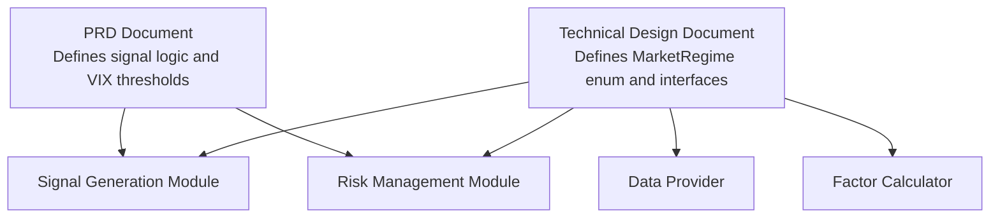
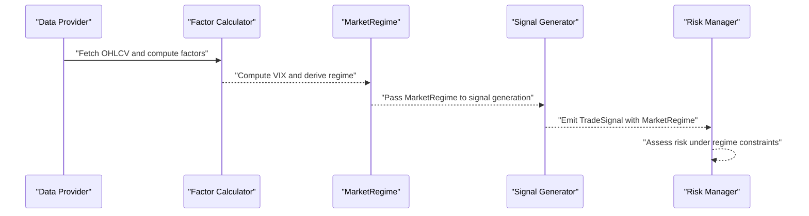
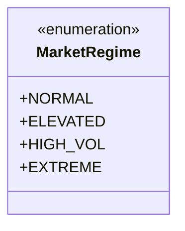
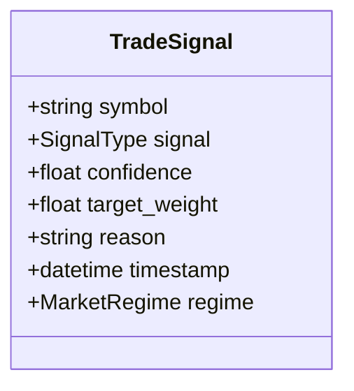
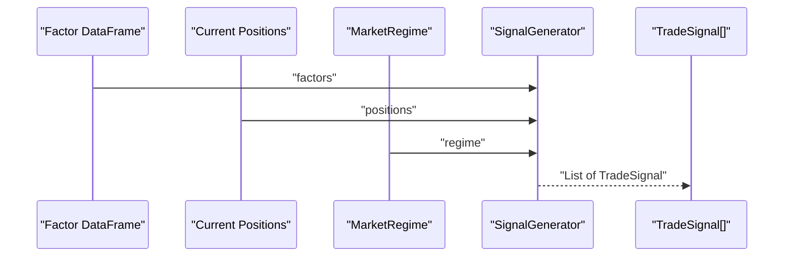
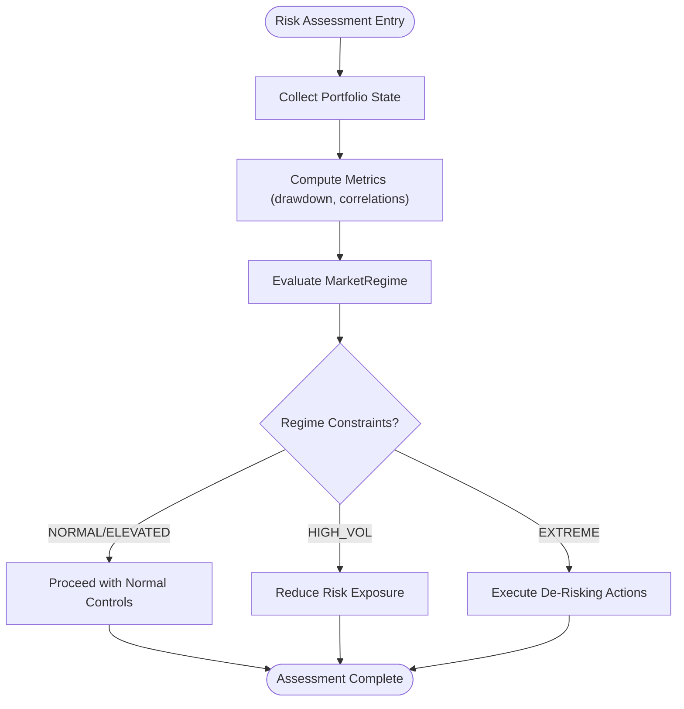
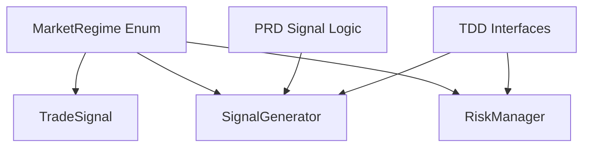

# MarketRegime Model

<cite>
**Referenced Files in This Document**
- [PRD_Intelligent_Trading_System_v2.md](file://PRD_Intelligent_Trading_System_v2.md)
- [Tech_Design_Document.md](file://Tech_Design_Document.md)
</cite>

## Table of Contents
1. [Introduction](#introduction)
2. [Project Structure](#project-structure)
3. [Core Components](#core-components)
4. [Architecture Overview](#architecture-overview)
5. [Detailed Component Analysis](#detailed-component-analysis)
6. [Dependency Analysis](#dependency-analysis)
7. [Performance Considerations](#performance-considerations)
8. [Troubleshooting Guide](#troubleshooting-guide)
9. [Conclusion](#conclusion)
10. [Appendices](#appendices)

## Introduction
This document provides comprehensive data model documentation for the MarketRegime class used for environmental filtering and signal adjustment in the intelligent trading system. It details regime classifications, VIX threshold conditions, and signal modification factors. It also documents field definitions, validation rules for regime transitions, threshold calculations, and signal scaling mechanisms. Finally, it includes examples of regime detection scenarios, signal adjustment calculations, and integration with signal generation and risk management components.

## Project Structure
The MarketRegime model is defined in the technical design document and referenced by functional requirements in the product requirements document. The model integrates with signal generation and risk management components through typed interfaces and enumerated states.

**Diagram sources**
- [Tech_Design_Document.md](file://Tech_Design_Document.md#L952-L956)
- [PRD_Intelligent_Trading_System_v2.md](file://PRD_Intelligent_Trading_System_v2.md#L220-L245)

**Section sources**
- [Tech_Design_Document.md](file://Tech_Design_Document.md#L952-L956)
- [PRD_Intelligent_Trading_System_v2.md](file://PRD_Intelligent_Trading_System_v2.md#L220-L245)

## Core Components
- MarketRegime: An enumeration defining four market states based on VIX thresholds.
- TradeSignal: A data structure carrying signal metadata, including the associated MarketRegime.
- SignalGenerator: An interface that accepts MarketRegime as part of signal generation logic.
- RiskManager: An interface that interacts with portfolio risk assessment and can leverage MarketRegime-aware logic.

Key definitions:
- MarketRegime.NORMAL: VIX < 20
- MarketRegime.ELEVATED: 20 ≤ VIX < 30
- MarketRegime.HIGH_VOL: 30 ≤ VIX < 40
- MarketRegime.EXTREME: VIX ≥ 40

These regimes drive signal confidence adjustments and operational constraints in downstream modules.

**Section sources**
- [Tech_Design_Document.md](file://Tech_Design_Document.md#L952-L956)
- [Tech_Design_Document.md](file://Tech_Design_Document.md#L958-L966)
- [Tech_Design_Document.md](file://Tech_Design_Document.md#L1396-L1403)
- [Tech_Design_Document.md](file://Tech_Design_Document.md#L1417-L1438)

## Architecture Overview
The MarketRegime model sits at the intersection of data ingestion, factor computation, signal generation, and risk management. The PRD defines VIX thresholds and signal filtering rules; the TDD formalizes MarketRegime as an enumerated state and integrates it into the signal data structure and generator interface.

**Diagram sources**
- [PRD_Intelligent_Trading_System_v2.md](file://PRD_Intelligent_Trading_System_v2.md#L220-L245)
- [Tech_Design_Document.md](file://Tech_Design_Document.md#L952-L956)
- [Tech_Design_Document.md](file://Tech_Design_Document.md#L1396-L1403)
- [Tech_Design_Document.md](file://Tech_Design_Document.md#L1417-L1438)

## Detailed Component Analysis

### MarketRegime Enum
The MarketRegime enum defines four distinct market states driven by VIX thresholds. These states inform downstream logic for signal confidence scaling and operational constraints.

**Diagram sources**
- [Tech_Design_Document.md](file://Tech_Design_Document.md#L952-L956)

Field definitions and thresholds:
- NORMAL: VIX < 20
- ELEVATED: 20 ≤ VIX < 30
- HIGH_VOL: 30 ≤ VIX < 40
- EXTREME: VIX ≥ 40

Validation rules for regime transitions:
- Continuous threshold checks against VIX values.
- Strict inequality boundaries ensure deterministic transitions.
- No overlapping ranges; transitions occur at boundary values.

Integration points:
- Signal generation module consumes MarketRegime to adjust confidence.
- Risk management module uses MarketRegime to enforce operational constraints.

**Section sources**
- [Tech_Design_Document.md](file://Tech_Design_Document.md#L952-L956)

### TradeSignal Data Model
TradeSignal carries the generated signal along with metadata, including the MarketRegime observed at the time of generation. This enables downstream modules to apply regime-aware adjustments consistently.

**Diagram sources**
- [Tech_Design_Document.md](file://Tech_Design_Document.md#L958-L966)

Field definitions:
- symbol: Instrument identifier.
- signal: Directional signal type (e.g., BUY, SELL, HOLD).
- confidence: Signal strength normalized to [0, 1].
- target_weight: Target allocation weight for the instrument.
- reason: Human-readable explanation of the signal composition.
- timestamp: Generation time.
- regime: MarketRegime observed at generation time.

Validation rules:
- confidence must be within [0, 1].
- target_weight must be non-negative.
- reason must be present and descriptive.
- timestamp must be a valid datetime.
- regime must be one of the enumerated MarketRegime values.

Integration with MarketRegime:
- The regime field ensures downstream logic can conditionally scale confidence or restrict actions.

**Section sources**
- [Tech_Design_Document.md](file://Tech_Design_Document.md#L958-L966)

### Signal Generation Integration
The SignalGenerator interface accepts MarketRegime as part of the generation process. The PRD defines VIX-based signal filtering and confidence adjustments that align with MarketRegime thresholds.

**Diagram sources**
- [Tech_Design_Document.md](file://Tech_Design_Document.md#L1396-L1403)
- [PRD_Intelligent_Trading_System_v2.md](file://PRD_Intelligent_Trading_System_v2.md#L220-L245)

Signal adjustment mechanisms:
- High volatility environments (VIX > 30): reduce all signal confidences by 50%.
- Extreme volatility environments (VIX > 40): permit only reducing actions (e.g., reduce/increase toward cash).

Threshold calculations:
- VIX thresholds are evaluated continuously against the latest VIX observation.
- Transitions occur deterministically at boundary values.

Examples of regime detection scenarios:
- Scenario A: VIX = 18 → MarketRegime.NORMAL; allow full-strength signals.
- Scenario B: VIX = 32 → MarketRegime.HIGH_VOL; reduce signal confidence by 50%.
- Scenario C: VIX = 41 → MarketRegime.EXTREME; restrict to reducing actions.

Signal adjustment calculations:
- Confidence scaling: confidence = original_confidence × scaling_factor
  - scaling_factor = 1.0 for NORMAL/ELEVATED
  - scaling_factor = 0.5 for HIGH_VOL
  - scaling_factor = 0.0 for EXTREME (only reducing actions allowed)
- Action restriction: in EXTREME regime, new long entries are disallowed; only exits/reductions are permitted.

**Section sources**
- [PRD_Intelligent_Trading_System_v2.md](file://PRD_Intelligent_Trading_System_v2.md#L220-L245)
- [Tech_Design_Document.md](file://Tech_Design_Document.md#L952-L956)

### Risk Management Integration
RiskManager interfaces can leverage MarketRegime to inform risk assessments and operational constraints. While the PRD describes risk levels and re-entry logic, MarketRegime provides the environmental context for these decisions.

**Diagram sources**
- [PRD_Intelligent_Trading_System_v2.md](file://PRD_Intelligent_Trading_System_v2.md#L288-L332)
- [Tech_Design_Document.md](file://Tech_Design_Document.md#L1417-L1438)

Validation rules for risk integration:
- Regime thresholds must be recalculated for each assessment cycle.
- Risk controls must respect regime constraints (e.g., no new long entries in EXTREME).
- Re-entry conditions require sustained improvement in MarketRegime and portfolio metrics.

**Section sources**
- [PRD_Intelligent_Trading_System_v2.md](file://PRD_Intelligent_Trading_System_v2.md#L288-L332)
- [Tech_Design_Document.md](file://Tech_Design_Document.md#L1417-L1438)

## Dependency Analysis
MarketRegime influences multiple subsystems through explicit typed dependencies and implicit environmental context.

**Diagram sources**
- [Tech_Design_Document.md](file://Tech_Design_Document.md#L952-L956)
- [Tech_Design_Document.md](file://Tech_Design_Document.md#L958-L966)
- [Tech_Design_Document.md](file://Tech_Design_Document.md#L1396-L1403)
- [Tech_Design_Document.md](file://Tech_Design_Document.md#L1417-L1438)
- [PRD_Intelligent_Trading_System_v2.md](file://PRD_Intelligent_Trading_System_v2.md#L220-L245)

Cohesion and coupling:
- Cohesion: MarketRegime encapsulates a single concern—market state classification—ensuring high internal cohesion.
- Coupling: MarketRegime is consumed by TradeSignal, SignalGenerator, and RiskManager, indicating moderate coupling across modules.

Potential circular dependencies:
- None identified; MarketRegime is a leaf dependency consumed by higher-level components.

External dependencies:
- No external libraries are assumed for MarketRegime itself; it relies on VIX observations produced by upstream components.

**Section sources**
- [Tech_Design_Document.md](file://Tech_Design_Document.md#L952-L956)
- [Tech_Design_Document.md](file://Tech_Design_Document.md#L958-L966)
- [Tech_Design_Document.md](file://Tech_Design_Document.md#L1396-L1403)
- [Tech_Design_Document.md](file://Tech_Design_Document.md#L1417-L1438)
- [PRD_Intelligent_Trading_System_v2.md](file://PRD_Intelligent_Trading_System_v2.md#L220-L245)

## Performance Considerations
- Threshold evaluation is O(1) per observation; negligible overhead compared to factor computation and signal generation.
- MarketRegime updates should be computed once per cycle and cached to avoid redundant recalculations.
- Signal confidence scaling is a simple multiplication operation; minimal computational cost.
- Risk controls conditioned on MarketRegime should batch evaluate constraints to minimize repeated checks.

## Troubleshooting Guide
Common issues and resolutions:
- Incorrect regime assignment:
  - Verify VIX boundary conditions and ensure strict inequality checks.
  - Confirm that regime transitions occur only at boundary values.
- Signal confidence anomalies:
  - Validate that confidence scaling factors are applied consistently across all signals.
  - Ensure EXTREME regime disables new long entries and allows only reducing actions.
- Risk control failures:
  - Confirm MarketRegime-aware constraints are enforced during risk assessment.
  - Verify re-entry conditions require sustained improvement in MarketRegime and portfolio metrics.

**Section sources**
- [PRD_Intelligent_Trading_System_v2.md](file://PRD_Intelligent_Trading_System_v2.md#L220-L245)
- [PRD_Intelligent_Trading_System_v2.md](file://PRD_Intelligent_Trading_System_v2.md#L288-L332)
- [Tech_Design_Document.md](file://Tech_Design_Document.md#L952-L956)

## Conclusion
The MarketRegime model provides a concise, enumerated representation of market volatility states driven by VIX thresholds. It integrates seamlessly with signal generation and risk management, enabling environment-aware signal confidence scaling and operational constraints. By adhering to strict threshold boundaries and consistent scaling rules, the model supports robust, predictable behavior across normal, elevated, high-volatility, and extreme market conditions.

## Appendices

### Appendix A: Field Reference
- MarketRegime enum values and thresholds:
  - NORMAL: VIX < 20
  - ELEVATED: 20 ≤ VIX < 30
  - HIGH_VOL: 30 ≤ VIX < 40
  - EXTREME: VIX ≥ 40
- TradeSignal fields:
  - symbol, signal, confidence, target_weight, reason, timestamp, regime

**Section sources**
- [Tech_Design_Document.md](file://Tech_Design_Document.md#L952-L956)
- [Tech_Design_Document.md](file://Tech_Design_Document.md#L958-L966)