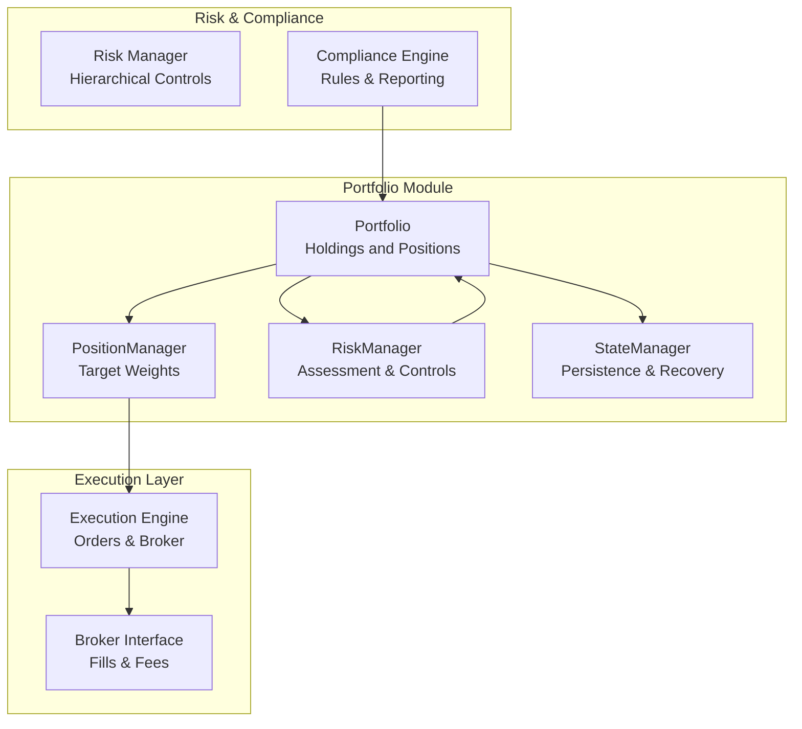
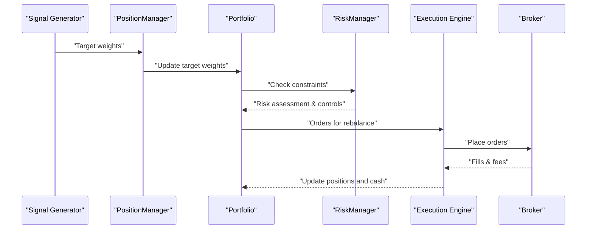
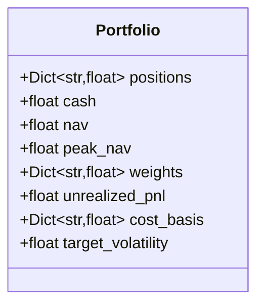
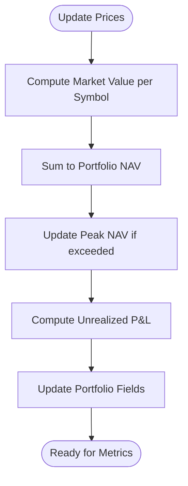
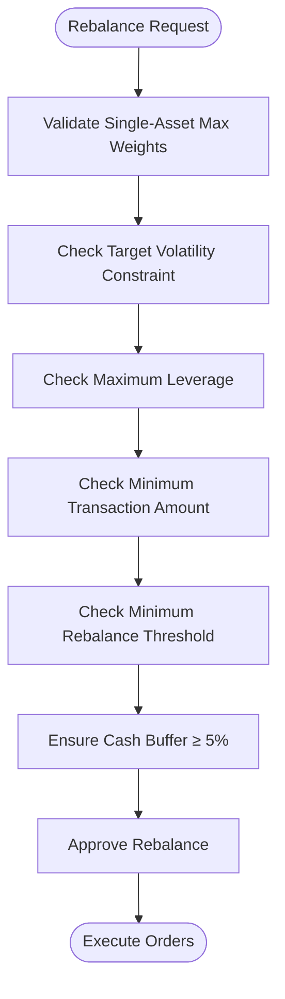
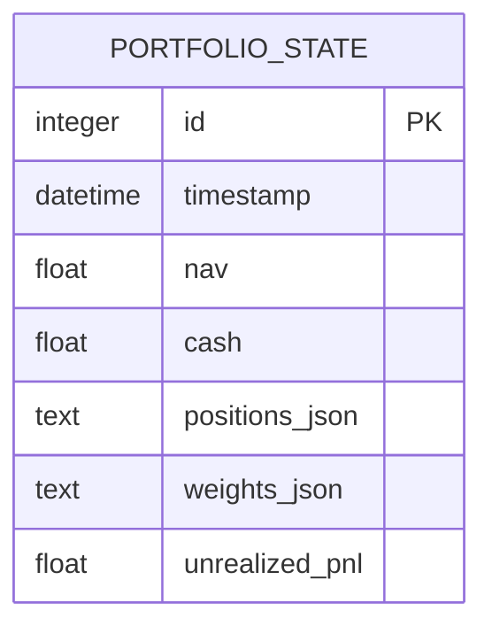
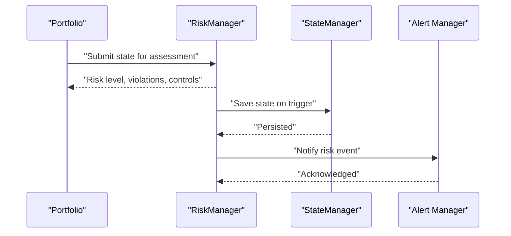
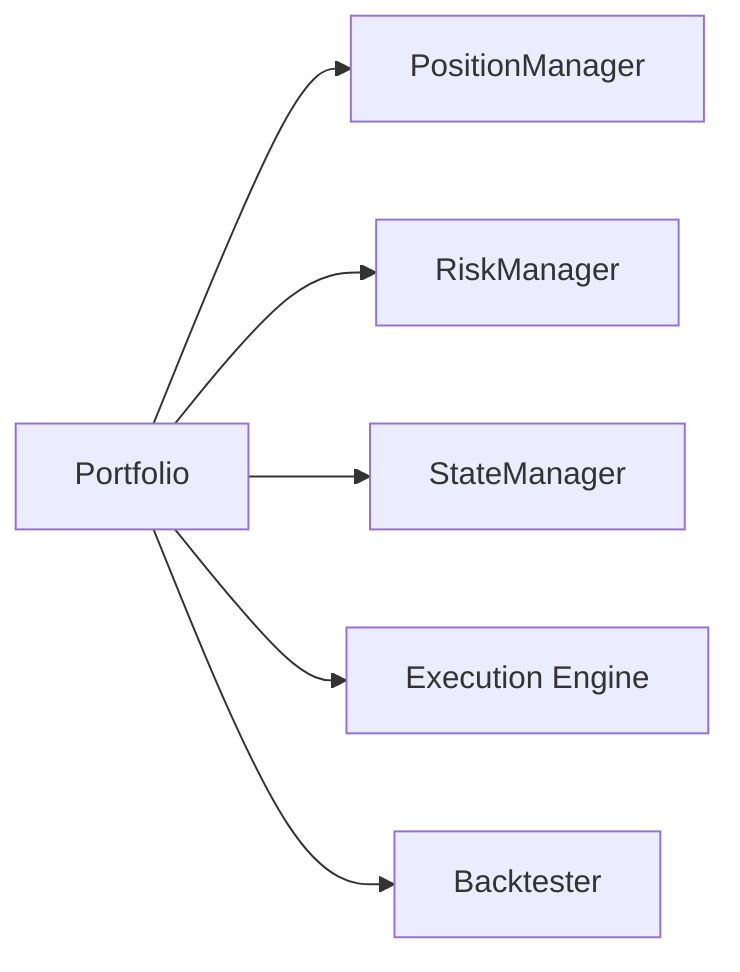

# Portfolio Model

<cite>
**Referenced Files in This Document**
- [Tech_Design_Document.md](file://Tech_Design_Document.md)
- [PRD_Intelligent_Trading_System_v2.md](file://PRD_Intelligent_Trading_System_v2.md)
</cite>

## Table of Contents
1. [Introduction](#introduction)
2. [Project Structure](#project-structure)
3. [Core Components](#core-components)
4. [Architecture Overview](#architecture-overview)
5. [Detailed Component Analysis](#detailed-component-analysis)
6. [Dependency Analysis](#dependency-analysis)
7. [Performance Considerations](#performance-considerations)
8. [Troubleshooting Guide](#troubleshooting-guide)
9. [Conclusion](#conclusion)
10. [Appendices](#appendices)

## Introduction
This document provides comprehensive data model documentation for the Portfolio class that represents the trading system’s holdings and positions. It covers asset allocation structures, cost basis calculations, unrealized profit and loss tracking, and portfolio-level metrics. It also documents field definitions, validation rules for position constraints, maximum weight limits per asset, and portfolio-level restrictions. Finally, it includes examples of portfolio snapshots, state persistence formats, and integration points with risk management systems.

## Project Structure
The Portfolio class is part of a modular trading system designed around data ingestion, factor computation, signal generation, position sizing, risk management, execution, and state persistence. The portfolio module coordinates with risk managers, state managers, and backtesting engines to maintain accurate holdings, enforce constraints, and track performance.

**Diagram sources**
- [Tech_Design_Document.md](file://Tech_Design_Document.md#L968-L987)
- [Tech_Design_Document.md](file://Tech_Design_Document.md#L1406-L1439)
- [Tech_Design_Document.md](file://Tech_Design_Document.md#L1457-L1483)

**Section sources**
- [Tech_Design_Document.md](file://Tech_Design_Document.md#L1009-L1113)

## Core Components
The Portfolio data model encapsulates the current state of a trading account, including positions, cash, valuation metrics, and risk-related attributes. It serves as the central state object for position sizing, risk checks, and performance reporting.

Key fields and responsibilities:
- positions: Dictionary mapping symbol to quantity held
- cash: Available cash balance
- nav: Net Asset Value (total value)
- peak_nav: Historical peak for drawdown calculations
- weights: Dictionary mapping symbol to portfolio weight
- unrealized_pnl: Unrealized profit and loss across all open positions
- cost_basis: Dictionary mapping symbol to average cost basis
- target_volatility: Portfolio-level target volatility constraint

These fields collectively enable:
- Asset allocation tracking and rebalancing
- Cost basis accounting for realized P&L upon exit
- Unrealized P&L computation and drawdown monitoring
- Portfolio-level risk metrics and constraint enforcement

**Section sources**
- [Tech_Design_Document.md](file://Tech_Design_Document.md#L968-L978)

## Architecture Overview
The Portfolio integrates with several subsystems:
- PositionManager: Computes target weights and rebalances positions subject to constraints
- RiskManager: Assesses risk level, enforces maximum weights, and triggers controls
- StateManager: Persists and recovers portfolio snapshots to/from persistent storage
- Execution: Converts target weights into orders and updates positions/cash
- Backtester: Validates strategy performance using portfolio metrics

**Diagram sources**
- [Tech_Design_Document.md](file://Tech_Design_Document.md#L1406-L1439)
- [Tech_Design_Document.md](file://Tech_Design_Document.md#L1457-L1483)

## Detailed Component Analysis

### Portfolio Data Model
The Portfolio class defines the core state structure used across the system. It includes:
- positions: Symbol-to-quantity mapping
- cash: Available cash for trading
- nav: Total portfolio value
- peak_nav: Used to compute drawdown
- weights: Symbol-to-weight mapping
- unrealized_pnl: Sum of unrealized gains/losses
- cost_basis: Average cost per symbol for realized P&L
- target_volatility: Portfolio target volatility constraint

**Diagram sources**
- [Tech_Design_Document.md](file://Tech_Design_Document.md#L968-L978)

**Section sources**
- [Tech_Design_Document.md](file://Tech_Design_Document.md#L968-L978)

### Asset Allocation Structures
Asset allocation is represented by:
- positions: Holdings quantities per symbol
- weights: Normalized weights derived from market value
- target_volatility: Portfolio-level volatility target guiding position sizing

Allocation logic ensures:
- Weights sum to approximately 1.0 (subject to cash buffer)
- Cash buffer maintained to avoid zero liquidity
- Rebalancing constrained by minimum transaction thresholds

**Section sources**
- [PRD_Intelligent_Trading_System_v2.md](file://PRD_Intelligent_Trading_System_v2.md#L247-L263)

### Cost Basis Calculations
Cost basis is tracked per symbol to support realized P&L computation upon exit:
- cost_basis stores the weighted average entry price per symbol
- When exiting positions, realized P&L equals proceeds minus cost basis × quantity
- Aggregates across fills to reflect average entry cost

This enables accurate P&L attribution and tax reporting.

**Section sources**
- [Tech_Design_Document.md](file://Tech_Design_Document.md#L968-L978)

### Unrealized P&L Tracking
Unrealized P&L reflects the change in value of open positions:
- computed as the difference between current market value and cost basis
- aggregated across all symbols in positions
- used for drawdown tracking via peak_nav

**Diagram sources**
- [Tech_Design_Document.md](file://Tech_Design_Document.md#L968-L978)

**Section sources**
- [Tech_Design_Document.md](file://Tech_Design_Document.md#L968-L978)

### Portfolio-Level Metrics
Portfolio-level metrics derived from the Portfolio state:
- NAV: Total value (positions market value + cash)
- Peak NAV: Historical maximum for drawdown calculation
- Drawdown: (NAV − Peak NAV) / Peak NAV
- Target Volatility: Portfolio-level volatility constraint guiding position sizing
- Weight Concentration: Max single-asset weight for diversification checks

These metrics feed risk management and performance reporting.

**Section sources**
- [Tech_Design_Document.md](file://Tech_Design_Document.md#L968-L978)
- [PRD_Intelligent_Trading_System_v2.md](file://PRD_Intelligent_Trading_System_v2.md#L247-L263)

### Validation Rules and Constraints
Position and portfolio constraints enforced by the system:
- Single-asset maximum weight per symbol (e.g., GLD 50%, SPY 40%, QQQ 30%, BTC 15%)
- Portfolio target volatility (e.g., 15%) constraining risk budget allocation
- Maximum leverage (e.g., 1.5x) including implicit leverage from volatility targeting
- Minimum transaction amount (e.g., $100) and minimum rebalancing threshold (e.g., 2% weight change)
- Cash buffer (e.g., ≥ 5% cash) to prevent liquidity crunch

**Diagram sources**
- [PRD_Intelligent_Trading_System_v2.md](file://PRD_Intelligent_Trading_System_v2.md#L247-L263)

**Section sources**
- [PRD_Intelligent_Trading_System_v2.md](file://PRD_Intelligent_Trading_System_v2.md#L247-L263)

### Portfolio Snapshots and State Persistence
Portfolio snapshots are persisted to a database for continuity and recovery:
- Table: portfolio_state
- Columns: timestamp, nav, cash, positions_json, weights_json, unrealized_pnl
- Serialization: positions and weights stored as JSON for portability

**Diagram sources**
- [Tech_Design_Document.md](file://Tech_Design_Document.md#L999-L1045)

**Section sources**
- [Tech_Design_Document.md](file://Tech_Design_Document.md#L999-L1045)

### Integration with Risk Management Systems
Risk management integrates with the Portfolio through:
- RiskAssessment: Captures current risk level, correlation matrix, violations, and recovery mode
- RiskManager: Checks risk level, applies hierarchical controls, and monitors reentry conditions
- StateManager: Saves and loads portfolio state for recovery after risk-triggered halts

**Diagram sources**
- [Tech_Design_Document.md](file://Tech_Design_Document.md#L1417-L1439)
- [Tech_Design_Document.md](file://Tech_Design_Document.md#L1457-L1483)

**Section sources**
- [Tech_Design_Document.md](file://Tech_Design_Document.md#L1417-L1439)
- [Tech_Design_Document.md](file://Tech_Design_Document.md#L1457-L1483)

## Dependency Analysis
The Portfolio class interacts with multiple modules:
- PositionManager: Uses target weights and constraints to update positions
- RiskManager: Enforces maximum weights, volatility, and leverage limits
- StateManager: Serializes/deserializes Portfolio state for persistence
- Execution: Consumes Portfolio updates to place orders and reconcile positions
- Backtester: Uses Portfolio metrics for performance and risk evaluation

**Diagram sources**
- [Tech_Design_Document.md](file://Tech_Design_Document.md#L1406-L1439)
- [Tech_Design_Document.md](file://Tech_Design_Document.md#L1457-L1483)

**Section sources**
- [Tech_Design_Document.md](file://Tech_Design_Document.md#L1406-L1439)
- [Tech_Design_Document.md](file://Tech_Design_Document.md#L1457-L1483)

## Performance Considerations
- Efficient serialization: Store positions and weights as compact JSON to minimize I/O overhead
- Batch updates: Apply rebalancing decisions in a single transaction to reduce state inconsistencies
- Incremental P&L recomputation: Recalculate only changed symbols to improve latency
- Risk checks: Cache correlation matrices and risk thresholds to avoid repeated computations

## Troubleshooting Guide
Common issues and resolutions:
- Exceeded maximum weight per asset: Reduce target weight below the cap or increase cash buffer
- Insufficient cash for rebalancing: Ensure cash buffer remains above the minimum threshold
- Persistent drawdown exceeding targets: Review risk controls and consider lowering target volatility
- State recovery failures: Verify JSON serialization of positions and weights; confirm database connectivity

**Section sources**
- [PRD_Intelligent_Trading_System_v2.md](file://PRD_Intelligent_Trading_System_v2.md#L247-L263)
- [Tech_Design_Document.md](file://Tech_Design_Document.md#L999-L1045)

## Conclusion
The Portfolio class is the central state container for the trading system, enabling precise asset allocation tracking, cost basis accounting, and unrealized P&L computation. Combined with risk controls, state persistence, and integration points across modules, it provides a robust foundation for disciplined trading and reliable performance monitoring.

## Appendices

### Field Reference Summary
- positions: Symbol-to-quantity dictionary
- cash: Available cash balance
- nav: Net Asset Value
- peak_nav: Historical peak NAV for drawdown
- weights: Symbol-to-weight dictionary
- unrealized_pnl: Sum of unrealized gains/losses
- cost_basis: Symbol-to-average-cost dictionary
- target_volatility: Portfolio target volatility constraint

**Section sources**
- [Tech_Design_Document.md](file://Tech_Design_Document.md#L968-L978)