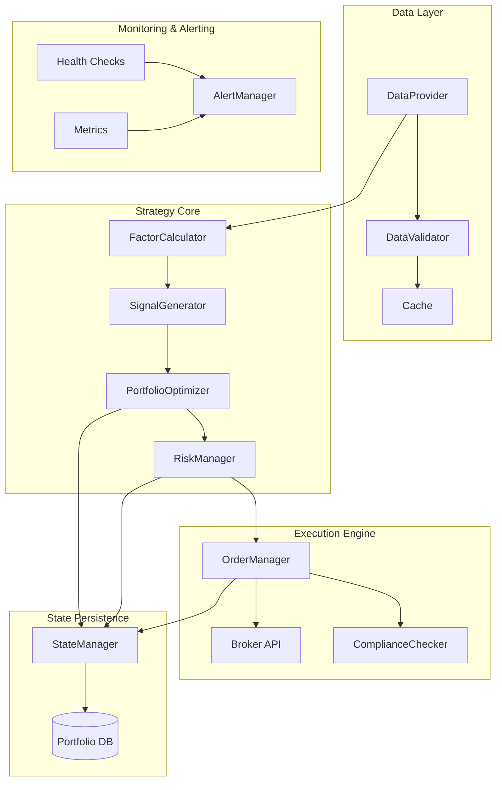
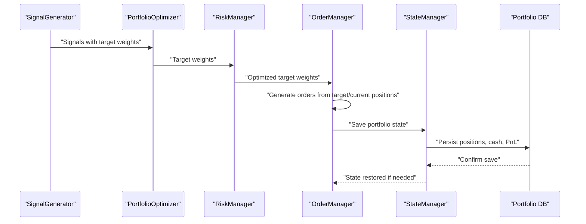
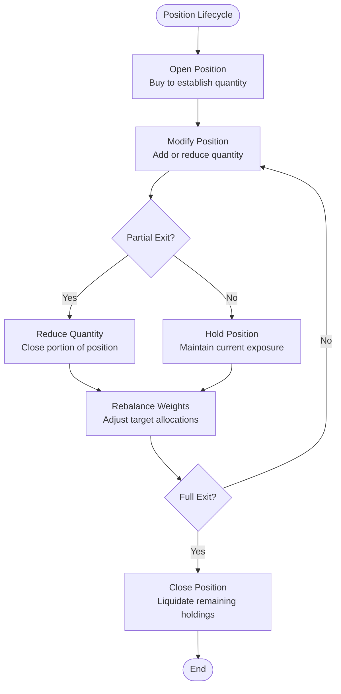
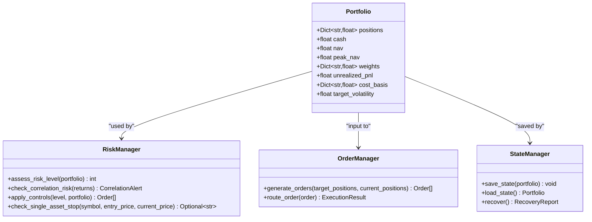
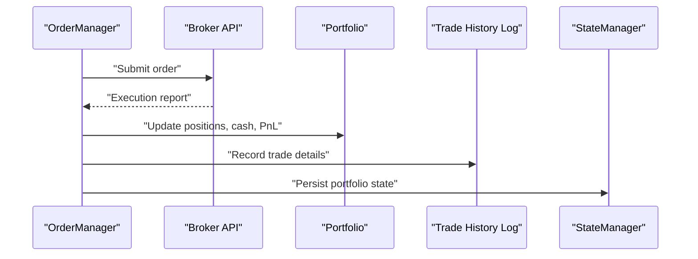
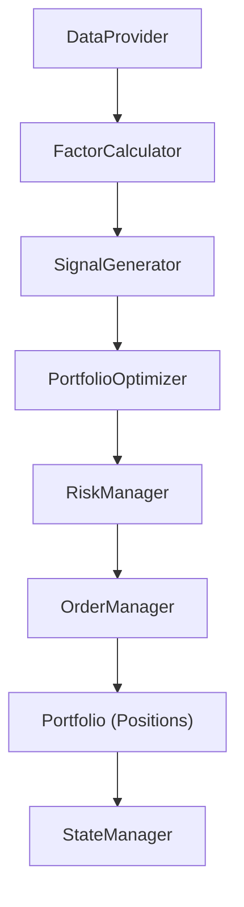

# Position Model

<cite>
**Referenced Files in This Document**
- [PRD_Intelligent_Trading_System_v2.md](file://PRD_Intelligent_Trading_System_v2.md)
- [Tech_Design_Document.md](file://Tech_Design_Document.md)
</cite>

## Table of Contents
1. [Introduction](#introduction)
2. [Project Structure](#project-structure)
3. [Core Components](#core-components)
4. [Architecture Overview](#architecture-overview)
5. [Detailed Component Analysis](#detailed-component-analysis)
6. [Dependency Analysis](#dependency-analysis)
7. [Performance Considerations](#performance-considerations)
8. [Troubleshooting Guide](#troubleshooting-guide)
9. [Conclusion](#conclusion)

## Introduction
This document provides comprehensive data model documentation for the Position concept as represented within the Intelligent Trading Decision System. The Position model captures individual asset holdings and trading positions, including core attributes such as quantity, entry price, cost basis, unrealized profit and loss, and position state tracking. It also documents field definitions for asset identifiers, transaction history, margin requirements, and position constraints. Validation rules for position limits, margin calculations, and settlement procedures are included, along with examples of position lifecycle management, partial exit scenarios, and integration with portfolio optimization and order execution systems.

## Project Structure
The Position model is part of the broader trading system architecture defined in the project’s technical design. The system is organized into distinct layers:
- Data Layer: Multi-source data acquisition with validation and caching
- Strategy Core: Factor calculation, signal generation, portfolio optimization, and risk management
- Execution Engine: Order management, broker integration, and compliance
- Monitoring & Alerting: Health checks, metrics, alerts, and dashboards
- State Persistence & Disaster Recovery: Portfolio state persistence and recovery procedures

**Diagram sources**
- [Tech_Design_Document.md](file://Tech_Design_Document.md#L38-L117)

**Section sources**
- [Tech_Design_Document.md](file://Tech_Design_Document.md#L34-L117)

## Core Components
The Position model is embedded within the Portfolio data structure and is central to the trading system’s state representation. The Portfolio encapsulates:
- positions: Dictionary mapping symbol to quantity held
- cash: Available cash balance
- nav: Net Asset Value
- peak_nav: Historical peak NAV for drawdown calculations
- weights: Current portfolio weights
- unrealized_pnl: Total unrealized profit and loss across positions
- cost_basis: Average cost per symbol for PnL computation

These fields collectively represent the Position concept for each symbol in the portfolio.

**Section sources**
- [Tech_Design_Document.md](file://Tech_Design_Document.md#L968-L978)

## Architecture Overview
The Position model participates in several key workflows:
- Signal generation feeds into portfolio optimization to compute target weights
- Risk manager enforces constraints and triggers controls based on portfolio state
- Order manager generates and routes orders based on target weights and current positions
- State manager persists portfolio state for crash recovery and audit trails

**Diagram sources**
- [Tech_Design_Document.md](file://Tech_Design_Document.md#L108-L116)
- [Tech_Design_Document.md](file://Tech_Design_Document.md#L840-L861)

## Detailed Component Analysis

### Position Attributes and Field Definitions
The Position concept is represented by the Portfolio data structure with the following key fields:
- Symbol identifier: String used to uniquely identify assets
- Quantity: Number of shares/units held per symbol
- Cost Basis: Average purchase price per symbol used for realized/unrealized PnL calculations
- Unrealized PnL: Profit or loss on open positions computed as (current price - cost basis) × quantity
- Cash: Available funds for new positions or to meet margin requirements
- Net Asset Value (NAV): Total value of portfolio (cash + value of positions)
- Weights: Current allocation of each symbol as a proportion of NAV
- Peak NAV: Historical peak NAV used to compute drawdown for risk controls

Constraints and limits:
- Maximum single-asset weight per symbol
- Maximum portfolio leverage
- Minimum trade amount and minimum rebalance threshold
- Cash buffer always reserved (≥5%)

Margin requirements and settlement:
- Transaction cost model includes commission and slippage
- Minimum trade units vary by asset type (ETF vs cryptocurrency)
- Settlement procedures include order confirmation, trade logging, and PnL updates

**Section sources**
- [Tech_Design_Document.md](file://Tech_Design_Document.md#L968-L978)
- [Tech_Design_Document.md](file://Tech_Design_Document.md#L190-L204)

### Position Lifecycle Management
The Position lifecycle spans creation, modification, partial exits, and full liquidation:
- Creation: New positions are established when entering a symbol for the first time
- Modification: Adjustments occur via additional purchases or partial exits
- Partial Exit: Reducing position size while retaining remaining exposure
- Full Liquidation: Closing out remaining holdings

**Diagram sources**
- [Tech_Design_Document.md](file://Tech_Design_Document.md#L775-L797)

### Validation Rules for Position Limits and Margin Calculations
Position constraints and validation rules ensure disciplined risk management:
- Single-asset maximum weight per symbol enforced by portfolio optimization
- Portfolio-level maximum leverage constrained to prevent excessive risk
- Minimum trade amount ($100) and minimum rebalance threshold (2% weight change) reduce unnecessary churn
- Cash buffer maintained at ≥5% to ensure liquidity for new entries and margin requirements
- Transaction cost model: commission and slippage applied to orders; minimum trade units enforced per asset type

Settlement procedures:
- Orders settle at execution price; realized PnL recorded upon fills
- Trade history logged with timestamps, quantities, prices, and commissions
- State persistence ensures accurate audit trails and recovery after system events

**Section sources**
- [Tech_Design_Document.md](file://Tech_Design_Document.md#L190-L204)
- [Tech_Design_Document.md](file://Tech_Design_Document.md#L775-L797)
- [Tech_Design_Document.md](file://Tech_Design_Document.md#L1001-L1045)

### Integration with Portfolio Optimization and Order Execution Systems
The Position model integrates with:
- Portfolio optimization: Target weights derived from signals and risk controls feed into order generation
- Risk management: Risk manager monitors drawdown, correlation, and position concentration; triggers controls when thresholds are exceeded
- Order execution: Order manager computes order sizes from target/current positions, applies cost models, and routes orders to brokers
- State persistence: State manager saves and recovers portfolio state, including positions, cash, and unrealized PnL

**Diagram sources**
- [Tech_Design_Document.md](file://Tech_Design_Document.md#L968-L978)
- [Tech_Design_Document.md](file://Tech_Design_Document.md#L352-L404)
- [Tech_Design_Document.md](file://Tech_Design_Document.md#L775-L797)
- [Tech_Design_Document.md](file://Tech_Design_Document.md#L840-L861)

**Section sources**
- [Tech_Design_Document.md](file://Tech_Design_Document.md#L352-L404)
- [Tech_Design_Document.md](file://Tech_Design_Document.md#L775-L797)
- [Tech_Design_Document.md](file://Tech_Design_Document.md#L840-L861)

### Position State Tracking and Transaction History
Position state tracking includes:
- Asset identifiers: Unique symbol per position
- Transaction history: Records of buys, sells, and partial exits with timestamps, quantities, prices, and commissions
- Cost basis updates: Recomputed after each transaction to reflect FIFO or average cost method
- Unrealized PnL updates: Recalculated continuously based on current prices
- Settlement procedures: Confirm trades, update positions, record realized PnL, and persist state

**Diagram sources**
- [Tech_Design_Document.md](file://Tech_Design_Document.md#L775-L797)
- [Tech_Design_Document.md](file://Tech_Design_Document.md#L1001-L1045)
- [Tech_Design_Document.md](file://Tech_Design_Document.md#L840-L861)

**Section sources**
- [Tech_Design_Document.md](file://Tech_Design_Document.md#L1001-L1045)
- [Tech_Design_Document.md](file://Tech_Design_Document.md#L840-L861)

## Dependency Analysis
The Position model interacts with multiple system components:
- Data providers supply price data used to compute unrealized PnL and risk metrics
- Factor calculators and signal generators influence target weights that drive position adjustments
- Risk managers enforce constraints and may trigger emergency exits or reductions
- Order managers translate target weights into executable orders
- State managers persist and recover portfolio state for continuity

**Diagram sources**
- [Tech_Design_Document.md](file://Tech_Design_Document.md#L38-L117)
- [Tech_Design_Document.md](file://Tech_Design_Document.md#L968-L978)

**Section sources**
- [Tech_Design_Document.md](file://Tech_Design_Document.md#L38-L117)
- [Tech_Design_Document.md](file://Tech_Design_Document.md#L968-L978)

## Performance Considerations
- Efficient data structures: Using dictionaries for positions, weights, and cost basis enables O(1) lookups and updates
- Batch processing: Grouping signals and orders reduces overhead and improves throughput
- State persistence: Persisting only necessary fields minimizes I/O and speeds up recovery
- Cost modeling: Applying realistic commission and slippage models helps avoid over-optimistic performance expectations

[No sources needed since this section provides general guidance]

## Troubleshooting Guide
Common issues and resolutions:
- Discrepancies between local positions and broker-reported positions: Use the disaster recovery reconciliation process to compare and flag discrepancies for manual review
- State corruption or missing state: Restore from the most recent persisted state and re-run order reconciliation
- Excessive drawdown triggering risk controls: Review risk level assessments and adjust position sizes or exit portions of positions to reduce exposure
- Compliance violations: Enforce PDT and wash sale rules; ensure proper documentation and reporting

**Section sources**
- [Tech_Design_Document.md](file://Tech_Design_Document.md#L866-L888)
- [Tech_Design_Document.md](file://Tech_Design_Document.md#L800-L813)

## Conclusion
The Position model, embedded within the Portfolio data structure, serves as the backbone of the trading system’s state representation. It captures essential attributes such as quantity, cost basis, unrealized PnL, and cash, while integrating tightly with portfolio optimization, risk management, order execution, and state persistence. Robust validation rules, margin calculations, and settlement procedures ensure disciplined trading practices. The model’s design supports lifecycle management, partial exits, and seamless integration with broader system workflows, enabling reliable and scalable position tracking across diverse asset classes.