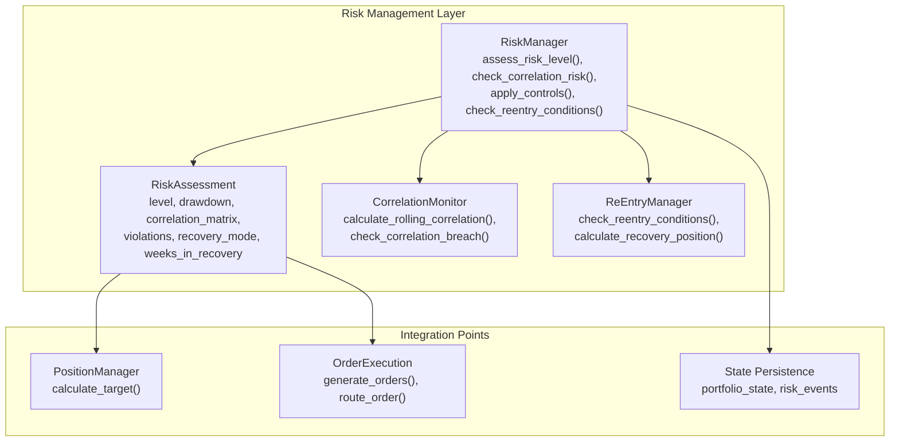
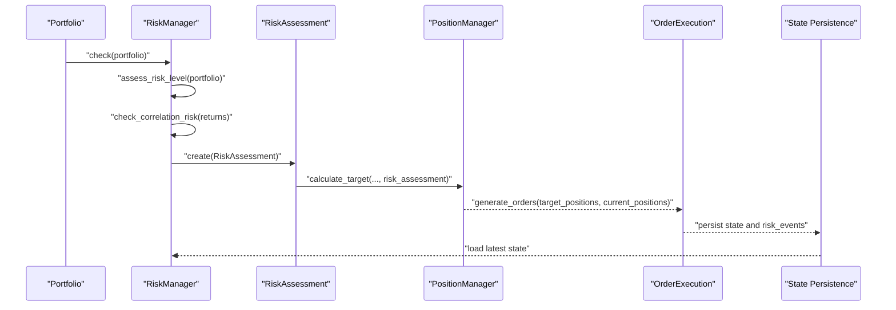
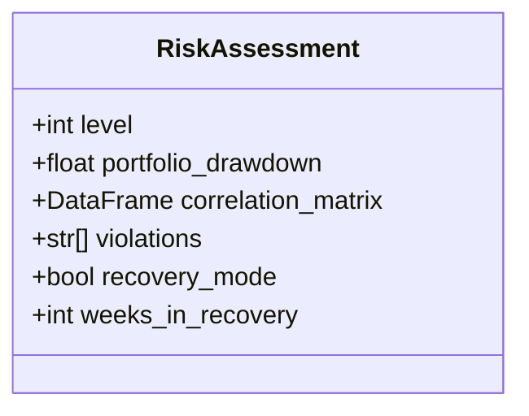
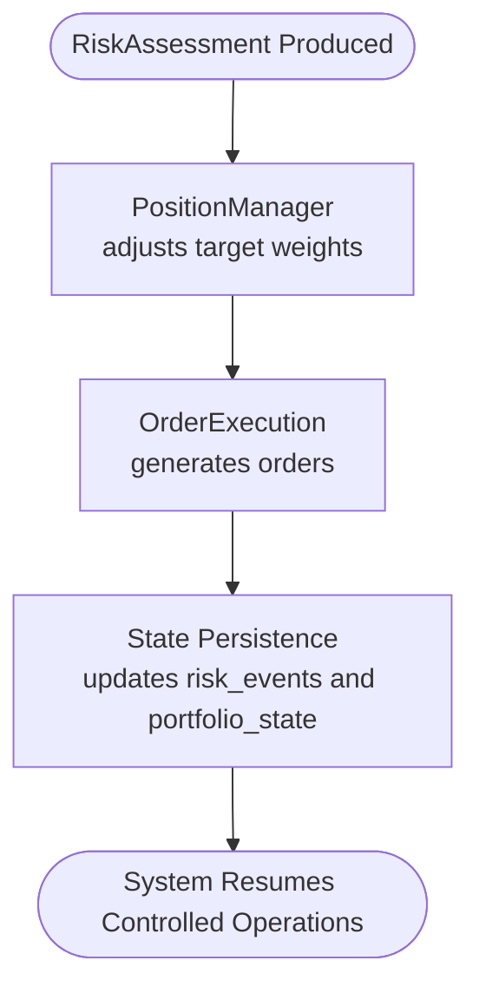
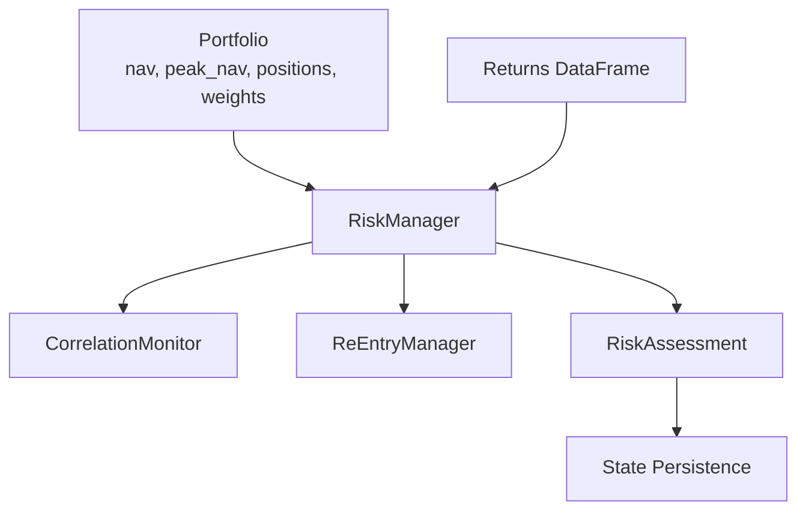

# RiskAssessment Model

<cite>
**Referenced Files in This Document**
- [Tech_Design_Document.md](file://Tech_Design_Document.md)
- [PRD_Intelligent_Trading_System_v2.md](file://PRD_Intelligent_Trading_System_v2.md)
</cite>

## Table of Contents
1. [Introduction](#introduction)
2. [Project Structure](#project-structure)
3. [Core Components](#core-components)
4. [Architecture Overview](#architecture-overview)
5. [Detailed Component Analysis](#detailed-component-analysis)
6. [Dependency Analysis](#dependency-analysis)
7. [Performance Considerations](#performance-considerations)
8. [Troubleshooting Guide](#troubleshooting-guide)
9. [Conclusion](#conclusion)

## Introduction
This document provides comprehensive data model documentation for the RiskAssessment class used in the hierarchical risk management system. It defines risk level classifications (0–4), trigger conditions, mitigation actions, and recovery procedures. It also documents field definitions (current risk level, peak NAV tracking, drawdown measurements, correlation matrix data, and re-entry condition flags), validation rules for risk thresholds, correlation limits, and de-risking triggers. Finally, it includes examples of risk assessment scenarios, escalation procedures, and integration points with position management and order execution systems.

## Project Structure
The RiskAssessment model is part of the broader technical design for a modular trading system. The relevant components include:
- RiskAssessment dataclass capturing current risk state
- RiskManager orchestrating risk checks and controls
- CorrelationMonitor for cross-asset correlation surveillance
- ReEntryManager for recovery after severe drawdown events
- Database schema supporting persistent risk state and events

**Diagram sources**
- [Tech_Design_Document.md](file://Tech_Design_Document.md#L979-L997)
- [Tech_Design_Document.md](file://Tech_Design_Document.md#L355-L404)
- [Tech_Design_Document.md](file://Tech_Design_Document.md#L442-L471)
- [Tech_Design_Document.md](file://Tech_Design_Document.md#L409-L437)
- [Tech_Design_Document.md](file://Tech_Design_Document.md#L999-L1045)

**Section sources**
- [Tech_Design_Document.md](file://Tech_Design_Document.md#L979-L997)
- [Tech_Design_Document.md](file://Tech_Design_Document.md#L355-L404)
- [Tech_Design_Document.md](file://Tech_Design_Document.md#L442-L471)
- [Tech_Design_Document.md](file://Tech_Design_Document.md#L409-L437)
- [Tech_Design_Document.md](file://Tech_Design_Document.md#L999-L1045)

## Core Components
The RiskAssessment model encapsulates the current risk state for the portfolio. It is produced by the RiskManager and consumed by downstream systems to adjust positions and orders.

- RiskAssessment fields:
  - level: integer representing current risk level (0–4)
  - portfolio_drawdown: float representing drawdown from peak NAV
  - correlation_matrix: DataFrame containing rolling correlation metrics
  - violations: list of detected constraint or threshold violations
  - recovery_mode: boolean flag indicating post-emergency recovery phase
  - weeks_in_recovery: integer count of weeks spent in recovery

These fields enable deterministic risk-aware decisions and automated control enforcement.

**Section sources**
- [Tech_Design_Document.md](file://Tech_Design_Document.md#L979-L997)

## Architecture Overview
The risk assessment process integrates with the broader trading pipeline. The RiskManager computes the RiskAssessment from portfolio state and market data, then applies controls and persists risk events. PositionManager and OrderExecution consume the RiskAssessment to adjust targets and generate orders accordingly.

**Diagram sources**
- [Tech_Design_Document.md](file://Tech_Design_Document.md#L378-L392)
- [Tech_Design_Document.md](file://Tech_Design_Document.md#L439-L442)
- [Tech_Design_Document.md](file://Tech_Design_Document.md#L999-L1045)

## Detailed Component Analysis

### RiskAssessment Data Model
The RiskAssessment dataclass captures the essential risk state for decision-making and persistence.

**Diagram sources**
- [Tech_Design_Document.md](file://Tech_Design_Document.md#L979-L997)

**Section sources**
- [Tech_Design_Document.md](file://Tech_Design_Document.md#L979-L997)

### Risk Levels, Triggers, and Mitigation Actions
The hierarchical risk control defines four levels with explicit drawdown thresholds and actions. These thresholds and actions are enforced by the RiskManager and reflected in the RiskAssessment.

- Level 1 (monitoring/alert): triggered at 5–8% drawdown; actions include alerting, raising confidence thresholds, and blocking new BTC positions.
- Level 2 (progressive reduction): triggered at 8–12% drawdown; actions include reducing positions by 25%, allowing only selling and hedging, closing BTC, and recording reasons.
- Level 3 (major reduction): triggered at 12–15% drawdown; actions include reducing positions to 50% and restricting to safe-haven assets, with manual review.
- Level 4 (emergency liquidation): triggered above 15% drawdown; actions include emergency liquidation of risky assets, retaining cash and GLD if not subject to single-asset stop loss, and requiring manual confirmation to resume trading.

Single-asset stop-loss thresholds:
- Reduce to 50% when drawdown exceeds 12%
- Exit completely when drawdown exceeds 18%

These rules are derived from the RiskManager’s assessment logic and correlation monitoring.

**Section sources**
- [Tech_Design_Document.md](file://Tech_Design_Document.md#L357-L404)
- [PRD_Intelligent_Trading_System_v2.md](file://PRD_Intelligent_Trading_System_v2.md#L288-L332)

### Correlation Matrix Monitoring and Thresholds
The system monitors cross-asset correlations using a rolling window and applies thresholds to detect systemic risk.

- Pair-level warning: any asset pair correlation exceeding 0.7 reduces allowable combined weight for that pair.
- Portfolio average warning: when average correlation exceeds 0.5, a Level 1 alert is triggered.
- Extreme event: when all assets move in the same direction with correlation exceeding 0.8, Level 2 controls are automatically applied.

The correlation matrix is computed daily and checked against these thresholds to inform risk controls and position adjustments.

**Section sources**
- [Tech_Design_Document.md](file://Tech_Design_Document.md#L442-L471)
- [PRD_Intelligent_Trading_System_v2.md](file://PRD_Intelligent_Trading_System_v2.md#L322-L327)

### Recovery Procedures and Re-Entry Conditions
After a Level 4 emergency liquidation, the system enters a recovery phase governed by the ReEntryManager.

- Re-entry eligibility requires five consecutive days where portfolio volatility is below the target volatility.
- Initial re-entry starts at 25% of normal position size, increasing weekly by 25% up to full capacity.
- During recovery, maximum leverage is capped at 1.0x.

The RiskAssessment includes recovery_mode and weeks_in_recovery flags to track and enforce these conditions.

**Section sources**
- [Tech_Design_Document.md](file://Tech_Design_Document.md#L409-L437)
- [PRD_Intelligent_Trading_System_v2.md](file://PRD_Intelligent_Trading_System_v2.md#L317-L321)

### Field Definitions and Semantics
- level: current risk level (0–4), where 0 indicates normal operations and higher levels indicate progressively stricter controls.
- portfolio_drawdown: portfolio drawdown from peak NAV, used to determine risk level transitions.
- correlation_matrix: rolling correlation DataFrame used for systemic risk detection and weight adjustments.
- violations: list of detected policy or constraint violations (e.g., leverage, turnover, trade counts).
- recovery_mode: boolean indicating whether the system is in recovery after a Level 4 event.
- weeks_in_recovery: integer count of weeks spent in recovery, used to compute gradual re-entry position sizes.

These fields collectively support deterministic, auditable risk control decisions.

**Section sources**
- [Tech_Design_Document.md](file://Tech_Design_Document.md#L979-L997)

### Validation Rules and De-Risking Triggers
- Risk thresholds:
  - Level 1: drawdown ≥ 5%
  - Level 2: drawdown ≥ 8%
  - Level 3: drawdown ≥ 12%
  - Level 4: drawdown ≥ 15%
- Single-asset stop-loss:
  - Reduce to 50% at 12% drawdown
  - Exit at 18% drawdown
- Correlation thresholds:
  - Pair warning: > 0.7
  - Portfolio average warning: > 0.5
  - Extreme event: > 0.8
- Operational constraints:
  - Maximum daily trades: 5
  - Maximum daily turnover: 30%
  - Maximum portfolio leverage: 1.5
  - Cash buffer: ≥5%

De-risking triggers activate RiskManager controls that produce a RiskAssessment reflecting the new state and required actions.

**Section sources**
- [Tech_Design_Document.md](file://Tech_Design_Document.md#L357-L404)
- [Tech_Design_Document.md](file://Tech_Design_Document.md#L442-L471)
- [PRD_Intelligent_Trading_System_v2.md](file://PRD_Intelligent_Trading_System_v2.md#L328-L332)
- [PRD_Intelligent_Trading_System_v2.md](file://PRD_Intelligent_Trading_System_v2.md#L1271-L1304)

### Risk Assessment Scenarios and Escalation Examples
- Scenario A: Moderate drawdown (9%) with elevated correlation (average 0.55) leads to Level 2 controls: reduce positions by 25%, restrict to selling and hedging, close BTC, and record reasons.
- Scenario B: Sharp intra-week drop causing single-asset drawdown of 19% on BTC triggers immediate exit of BTC and a Level 3 control response.
- Scenario C: Severe macro shock causing portfolio drawdown of 16% triggers Level 4: emergency liquidation, retain cash and GLD, require manual confirmation to resume trading.
- Scenario D: Post-Level-4 recovery: five straight days under target volatility allow re-entry; start at 25% and ramp weekly.

Escalation follows a strict hierarchy: drawdown thresholds, single-asset stops, correlation extremes, and operational limits.

**Section sources**
- [Tech_Design_Document.md](file://Tech_Design_Document.md#L357-L404)
- [Tech_Design_Document.md](file://Tech_Design_Document.md#L442-L471)
- [Tech_Design_Document.md](file://Tech_Design_Document.md#L409-L437)
- [PRD_Intelligent_Trading_System_v2.md](file://PRD_Intelligent_Trading_System_v2.md#L288-L332)

### Integration with Position Management and Order Execution
- PositionManager consumes RiskAssessment to compute revised target weights that respect risk controls (e.g., reduced positions, safe-haven-only allocations).
- OrderExecution generates orders based on differences between current and target positions, ensuring operational constraints (trade counts, turnover, leverage) are respected.
- State persistence records risk events and portfolio state for auditability and recovery.

**Diagram sources**
- [Tech_Design_Document.md](file://Tech_Design_Document.md#L439-L442)
- [Tech_Design_Document.md](file://Tech_Design_Document.md#L999-L1045)

**Section sources**
- [Tech_Design_Document.md](file://Tech_Design_Document.md#L439-L442)
- [Tech_Design_Document.md](file://Tech_Design_Document.md#L999-L1045)

## Dependency Analysis
The RiskAssessment model depends on:
- Portfolio state (NAV, peak NAV, positions, weights)
- Market returns for correlation calculations
- RiskManager for assessment and control application
- CorrelationMonitor for correlation matrix computation
- ReEntryManager for recovery eligibility and position sizing
- Persistence layer for state and risk event storage

**Diagram sources**
- [Tech_Design_Document.md](file://Tech_Design_Document.md#L378-L392)
- [Tech_Design_Document.md](file://Tech_Design_Document.md#L442-L471)
- [Tech_Design_Document.md](file://Tech_Design_Document.md#L409-L437)
- [Tech_Design_Document.md](file://Tech_Design_Document.md#L979-L997)
- [Tech_Design_Document.md](file://Tech_Design_Document.md#L999-L1045)

**Section sources**
- [Tech_Design_Document.md](file://Tech_Design_Document.md#L378-L392)
- [Tech_Design_Document.md](file://Tech_Design_Document.md#L442-L471)
- [Tech_Design_Document.md](file://Tech_Design_Document.md#L409-L437)
- [Tech_Design_Document.md](file://Tech_Design_Document.md#L979-L997)
- [Tech_Design_Document.md](file://Tech_Design_Document.md#L999-L1045)

## Performance Considerations
- Correlation computations use rolling windows; ensure efficient DataFrame operations and caching of intermediate results.
- Risk assessments should be computed early in the cycle to allow sufficient time for order generation and execution.
- Persistence writes should batch updates to minimize I/O overhead.
- Recovery calculations (weekly ramp-up) should be deterministic and idempotent to support restarts.

## Troubleshooting Guide
Common issues and resolutions:
- Missing correlation_matrix: ensure returns data is available and window size is valid.
- Violations list growing unexpectedly: verify operational constraints (turnover, leverage, trades) are properly enforced.
- Recovery_mode stuck: confirm volatility history meets re-entry criteria for five consecutive days.
- Inconsistent drawdown values: validate peak NAV tracking and NAV recalculation logic.

**Section sources**
- [Tech_Design_Document.md](file://Tech_Design_Document.md#L442-L471)
- [Tech_Design_Document.md](file://Tech_Design_Document.md#L409-L437)
- [Tech_Design_Document.md](file://Tech_Design_Document.md#L999-L1045)

## Conclusion
The RiskAssessment model provides a robust, deterministic representation of portfolio risk state. Combined with hierarchical risk levels, correlation monitoring, and recovery procedures, it enables automated, auditable risk control. Integration with position management and order execution ensures that risk decisions translate into actionable trading operations while maintaining compliance with operational constraints.