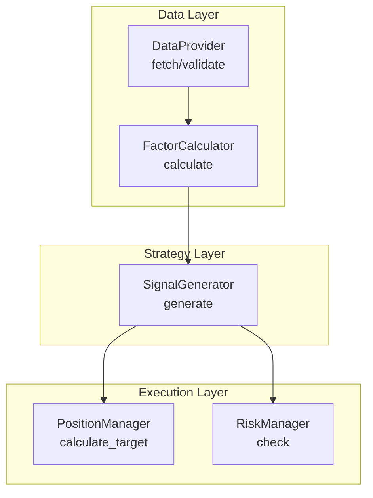
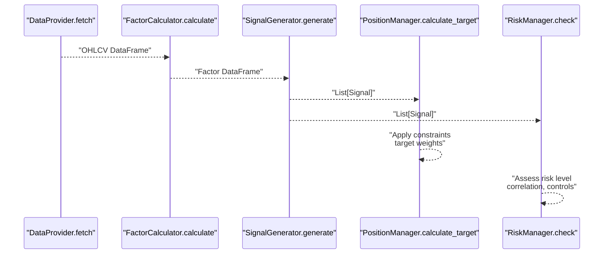
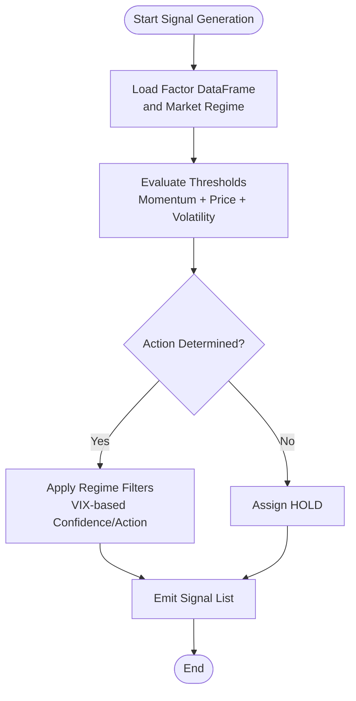
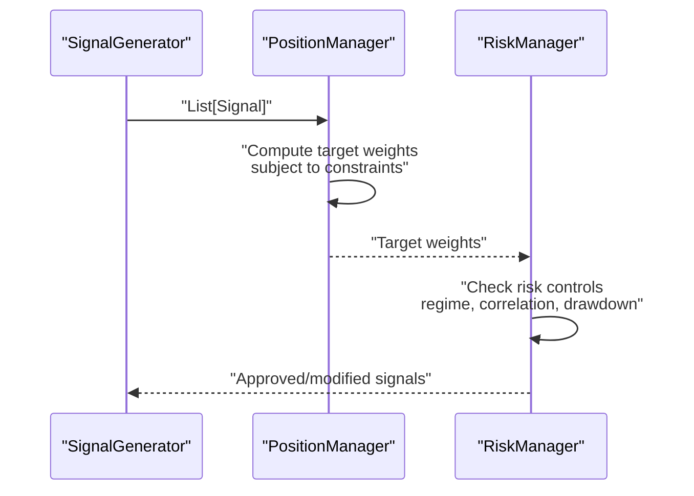
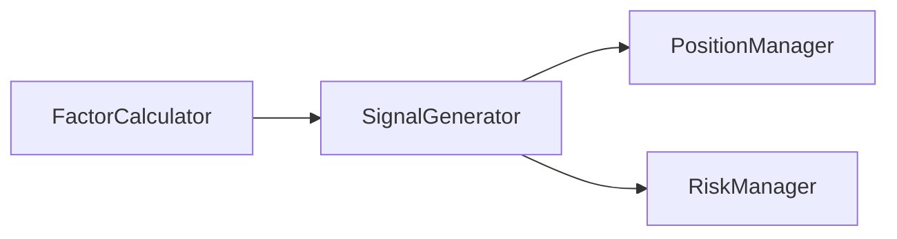

# Signal Data Model

<cite>
**Referenced Files in This Document**
- [PRD_Intelligent_Trading_System_v2.md](file://PRD_Intelligent_Trading_System_v2.md)
- [Tech_Design_Document.md](file://Tech_Design_Document.md)
</cite>

## Table of Contents
1. [Introduction](#introduction)
2. [Project Structure](#project-structure)
3. [Core Components](#core-components)
4. [Architecture Overview](#architecture-overview)
5. [Detailed Component Analysis](#detailed-component-analysis)
6. [Dependency Analysis](#dependency-analysis)
7. [Performance Considerations](#performance-considerations)
8. [Troubleshooting Guide](#troubleshooting-guide)
9. [Conclusion](#conclusion)

## Introduction
This document defines the Signal data model used by the trading pipeline to represent intermediate trading signals. It consolidates the specification of signal properties, factor inputs, calculation methodology, temporal dimensions, quality metrics, and validation rules. It also documents the integration of signals with downstream components such as position management and risk assessment.

## Project Structure
The Signal class participates in a modular pipeline:
- Data ingestion and validation produce factor datasets
- Factor datasets feed the signal generation stage
- Signals are consumed by position management and risk controls

**Diagram sources**
- [Tech_Design_Document.md](file://Tech_Design_Document.md#L88-L117)
- [PRD_Intelligent_Trading_System_v2.md](file://PRD_Intelligent_Trading_System_v2.md#L182-L245)

**Section sources**
- [Tech_Design_Document.md](file://Tech_Design_Document.md#L88-L117)
- [PRD_Intelligent_Trading_System_v2.md](file://PRD_Intelligent_Trading_System_v2.md#L182-L245)

## Core Components
This section defines the Signal data model and its role in the pipeline.

- Signal producer: SignalGenerator.generate(...)
- Signal consumer: PositionManager.calculate_target(...), RiskManager.check(...)

Key responsibilities:
- Encode a single trading recommendation per symbol at a specific time
- Include a categorical action (BUY/SELL/HOLD), a numeric confidence score, and a rationale
- Optionally include a target weight suggestion and market regime classification

Temporal dimension:
- Signals are produced for a specific date/time aligned with the latest available factor data

Downstream integration:
- PositionManager consumes signals to compute target weights subject to constraints
- RiskManager evaluates signals against portfolio-level risk controls and market regimes

**Section sources**
- [PRD_Intelligent_Trading_System_v2.md](file://PRD_Intelligent_Trading_System_v2.md#L220-L245)
- [Tech_Design_Document.md](file://Tech_Design_Document.md#L299-L350)

## Architecture Overview
The Signal class sits at the intersection of factor processing and position/risk management.

**Diagram sources**
- [Tech_Design_Document.md](file://Tech_Design_Document.md#L88-L117)
- [PRD_Intelligent_Trading_System_v2.md](file://PRD_Intelligent_Trading_System_v2.md#L418-L455)

## Detailed Component Analysis

### Signal Data Model Definition
The Signal represents a single recommendation for a symbol at a given time. The following properties are defined by the specification:

- symbol: Identifier of the asset (e.g., "GLD")
- signal: Categorical action ("BUY", "SELL", "HOLD")
- confidence: Numeric score in [0, 1] indicating signal strength
- target_weight: Suggested target weight (optional)
- reason: Human-readable explanation for the signal
- regime: Market regime category (e.g., "NORMAL") used for regime-aware adjustments

Temporal semantics:
- Signals correspond to the latest available factor observation date
- Confidence may be adjusted by regime filters

Quality metrics:
- Confidence reflects internal consistency and factor agreement
- Reason supports auditability and explainability

Validation rules:
- Factor completeness: All required factors must be present for the signal date
- Calculation accuracy: Derived values (e.g., SMA thresholds) must be computed consistently
- Signal consistency: The chosen action must align with the factor thresholds and regime constraints

Integration patterns:
- PositionManager scales signals to feasible target weights respecting individual and portfolio constraints
- RiskManager applies regime filters and portfolio-level controls prior to order generation

**Section sources**
- [PRD_Intelligent_Trading_System_v2.md](file://PRD_Intelligent_Trading_System_v2.md#L220-L245)
- [PRD_Intelligent_Trading_System_v2.md](file://PRD_Intelligent_Trading_System_v2.md#L247-L263)
- [PRD_Intelligent_Trading_System_v2.md](file://PRD_Intelligent_Trading_System_v2.md#L418-L455)

### Factor Inputs and Calculation Methodology
Signals are generated from a set of technical factors computed from price data. The factor definitions and computation pipeline are specified as follows:

Factor definitions:
- Momentum_60: 60-day cumulative return
- Momentum_120: 120-day cumulative return
- Volatility_20: 20-day annualized volatility
- Volatility_60: 60-day annualized volatility
- SMA_20: 20-day simple moving average
- SMA_50: 50-day simple moving average
- SMA_200: 200-day simple moving average
- RSI_14: 14-day relative strength index
- ATR_14: 14-day average true range

Calculation methodology:
- FactorCalculator.calculate(...) produces a DataFrame containing factor values aligned by symbol and date
- Cross-sectional ranking may be applied in extended strategies (Phase 2)

Temporal dimensions:
- Factor windows define the lookback periods for each metric
- Signals are emitted for the last date of the available factor history

Quality metrics:
- Factor values are validated for plausibility and completeness before signal generation

Validation rules:
- Missing factor values: If any required factor is absent for the signal date, the signal is invalidated
- Outlier detection: Excessive spikes or missing data proportions exceeding thresholds invalidate the signal set for that period

**Section sources**
- [PRD_Intelligent_Trading_System_v2.md](file://PRD_Intelligent_Trading_System_v2.md#L203-L218)
- [Tech_Design_Document.md](file://Tech_Design_Document.md#L250-L295)

### Signal Generation Workflow
The signal generation process transforms factor datasets into actionable recommendations with confidence and rationale.

Workflow steps:
1. Input: Factor DataFrame, current positions, market regime
2. Threshold evaluation: Compare momentum and price levels against thresholds and moving averages
3. Regime filtering: Adjust confidence or action based on VIX thresholds
4. Output: List of Signal objects with symbol, signal, confidence, optional target_weight, reason, and regime

Example logic:
- STRONG_BUY: momentum exceeds high thresholds, price above SMA_50 and SMA_200, VIX below threshold
- BUY: momentum exceeds lower threshold and price above SMA_20
- SELL: momentum below negative threshold or price below SMA_50
- STRONG_SELL: momentum below negative high threshold and price below SMA_200
- HOLD: otherwise

Regime filters:
- High volatility (VIX > 30): reduce confidence by 50%
- Extreme volatility (VIX > 40): only allow reduce-position signals

**Diagram sources**
- [PRD_Intelligent_Trading_System_v2.md](file://PRD_Intelligent_Trading_System_v2.md#L220-L245)
- [Tech_Design_Document.md](file://Tech_Design_Document.md#L317-L350)

**Section sources**
- [PRD_Intelligent_Trading_System_v2.md](file://PRD_Intelligent_Trading_System_v2.md#L220-L245)
- [Tech_Design_Document.md](file://Tech_Design_Document.md#L317-L350)

### Integration with Downstream Components
Signals are consumed by position management and risk assessment:

- PositionManager.calculate_target(...):
  - Converts signals to target weights considering individual asset constraints and portfolio-level targets
  - Applies risk budget scaling and turnover constraints

- RiskManager.check(...):
  - Assesses portfolio-level risk, including correlation monitoring and drawdown-based controls
  - May trigger regime-specific actions (e.g., reduce positions, safe-haven focus)

**Diagram sources**
- [PRD_Intelligent_Trading_System_v2.md](file://PRD_Intelligent_Trading_System_v2.md#L247-L263)
- [PRD_Intelligent_Trading_System_v2.md](file://PRD_Intelligent_Trading_System_v2.md#L418-L455)
- [Tech_Design_Document.md](file://Tech_Design_Document.md#L352-L404)

**Section sources**
- [PRD_Intelligent_Trading_System_v2.md](file://PRD_Intelligent_Trading_System_v2.md#L247-L263)
- [PRD_Intelligent_Trading_System_v2.md](file://PRD_Intelligent_Trading_System_v2.md#L418-L455)
- [Tech_Design_Document.md](file://Tech_Design_Document.md#L352-L404)

## Dependency Analysis
The Signal class depends on:
- FactorCalculator outputs for input values
- Market regime indicators (e.g., VIX) for filtering
- PositionManager and RiskManager for downstream transformations

**Diagram sources**
- [Tech_Design_Document.md](file://Tech_Design_Document.md#L88-L117)
- [PRD_Intelligent_Trading_System_v2.md](file://PRD_Intelligent_Trading_System_v2.md#L418-L455)

**Section sources**
- [Tech_Design_Document.md](file://Tech_Design_Document.md#L88-L117)
- [PRD_Intelligent_Trading_System_v2.md](file://PRD_Intelligent_Trading_System_v2.md#L418-L455)

## Performance Considerations
- Factor computation and signal generation should operate on aligned timestamps to avoid look-ahead bias
- Regime filtering adds minimal overhead but improves signal robustness under varying volatility
- Target weight computation should be vectorized to handle batch signals efficiently

## Troubleshooting Guide
Common issues and resolutions:
- Missing factor values: Ensure FactorCalculator completes successfully for the required lookback windows; invalidate signals if any factor is NaN for the signal date
- Inconsistent thresholds: Validate that SMA thresholds and momentum bounds are derived from the same lookback periods
- Regime misclassification: Confirm VIX availability and correct application of confidence reduction rules
- Position constraints violation: Review PositionManager constraints and adjust signal target_weight accordingly

**Section sources**
- [PRD_Intelligent_Trading_System_v2.md](file://PRD_Intelligent_Trading_System_v2.md#L203-L218)
- [PRD_Intelligent_Trading_System_v2.md](file://PRD_Intelligent_Trading_System_v2.md#L220-L245)
- [PRD_Intelligent_Trading_System_v2.md](file://PRD_Intelligent_Trading_System_v2.md#L247-L263)

## Conclusion
The Signal data model encapsulates a concise yet powerful representation of trading recommendations, grounded in technical factors and market regime awareness. By enforcing validation rules and integrating with position management and risk controls, the model ensures reliable, explainable, and robust decision-making across the trading pipeline.