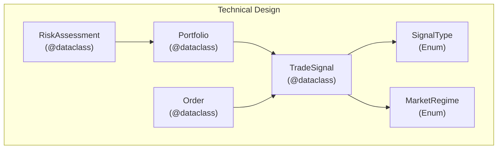
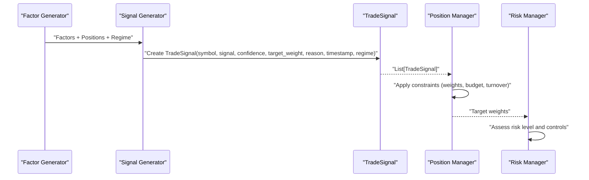
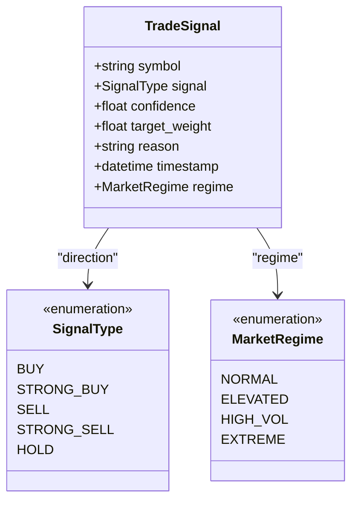
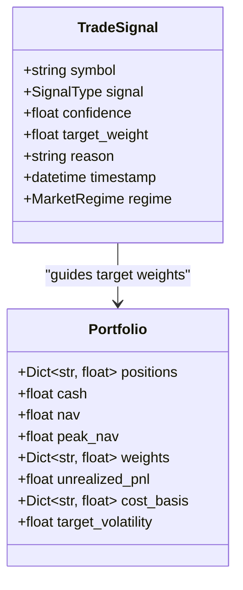
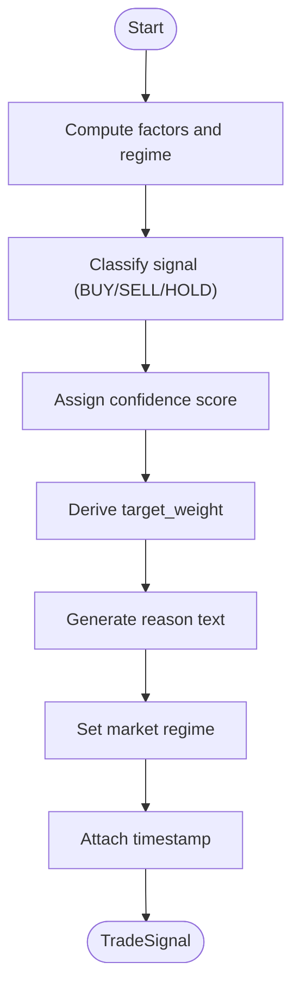
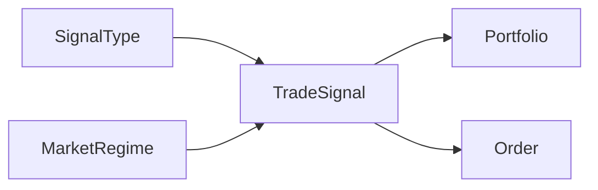

# TradeSignal Model

<cite>
**Referenced Files in This Document**
- [Tech_Design_Document.md](file://Tech_Design_Document.md)
- [PRD_Intelligent_Trading_System_v2.md](file://PRD_Intelligent_Trading_System_v2.md)
</cite>

## Table of Contents
1. [Introduction](#introduction)
2. [Project Structure](#project-structure)
3. [Core Components](#core-components)
4. [Architecture Overview](#architecture-overview)
5. [Detailed Component Analysis](#detailed-component-analysis)
6. [Dependency Analysis](#dependency-analysis)
7. [Performance Considerations](#performance-considerations)
8. [Troubleshooting Guide](#troubleshooting-guide)
9. [Conclusion](#conclusion)
10. [Appendices](#appendices)

## Introduction
This document provides comprehensive data model documentation for the TradeSignal class used throughout the intelligent trading system. It defines the signal structure, including symbol identification, signal direction, confidence scores, target weights, reason codes, and market regime classification. It also documents field definitions, data types, validation rules, business constraints, serialization formats, example signal objects, and integration patterns with other system components such as Signal and Position.

## Project Structure
The TradeSignal model is part of the technical design for the trading system. It is defined alongside related models and enums that support the signal generation and risk management workflows.

**Diagram sources**
- [Tech_Design_Document.md](file://Tech_Design_Document.md#L958-L997)

**Section sources**
- [Tech_Design_Document.md](file://Tech_Design_Document.md#L958-L997)

## Core Components
The TradeSignal model encapsulates a single trading decision with associated metadata and context. It is designed to be serializable and interoperable with downstream systems such as the position manager and execution engine.

- Field definitions and types
  - symbol: string identifier for the instrument
  - signal: enumeration representing direction (e.g., BUY, SELL, HOLD)
  - confidence: numeric score in [0.0, 1.0] indicating signal strength
  - target_weight: desired portfolio weight for the symbol derived from the signal
  - reason: textual explanation for the signal and rationale
  - timestamp: event time of the signal creation
  - regime: market environment classification (e.g., NORMAL, HIGH_VOL, EXTREME)

- Validation rules and business constraints
  - confidence must be within [0.0, 1.0]
  - target_weight is non-negative; downstream logic may constrain it by asset-specific limits and portfolio-level risk budgets
  - reason must be a non-empty, human-readable explanation
  - timestamp must be a valid datetime
  - regime must be one of the predefined MarketRegime values

- Serialization formats
  - TradeSignal is a dataclass suitable for JSON serialization; downstream components may serialize it to JSON for logging, persistence, or inter-service communication
  - The PRD specifies a JSON example format for signals, including symbol, signal, confidence, target_weight, reason, and regime

- Integration patterns
  - TradeSignal is produced by the signal generation pipeline and consumed by the position management and risk control modules
  - It integrates with Portfolio for position sizing and with Order for generating execution instructions

**Section sources**
- [Tech_Design_Document.md](file://Tech_Design_Document.md#L958-L967)
- [PRD_Intelligent_Trading_System_v2.md](file://PRD_Intelligent_Trading_System_v2.md#L220-L245)

## Architecture Overview
The signal generation pipeline produces TradeSignal objects that feed into portfolio construction and risk management.

**Diagram sources**
- [Tech_Design_Document.md](file://Tech_Design_Document.md#L317-L350)
- [PRD_Intelligent_Trading_System_v2.md](file://PRD_Intelligent_Trading_System_v2.md#L220-L263)

## Detailed Component Analysis

### TradeSignal Data Model
TradeSignal is a dataclass that carries the essential attributes of a trading decision.

**Diagram sources**
- [Tech_Design_Document.md](file://Tech_Design_Document.md#L958-L967)
- [Tech_Design_Document.md](file://Tech_Design_Document.md#L950-L957)

**Section sources**
- [Tech_Design_Document.md](file://Tech_Design_Document.md#L958-L967)
- [Tech_Design_Document.md](file://Tech_Design_Document.md#L950-L957)

### Relationship Between TradeSignal and Other Models
- TradeSignal and Signal
  - TradeSignal extends the concept of a discrete signal (SignalType) with quantitative confidence and target weight, plus explanatory reasoning and market regime context
- TradeSignal and Position
  - TradeSignal informs Position composition; the position manager derives target holdings from TradeSignal and current portfolio state

**Diagram sources**
- [Tech_Design_Document.md](file://Tech_Design_Document.md#L958-L997)

**Section sources**
- [Tech_Design_Document.md](file://Tech_Design_Document.md#L968-L977)
- [Tech_Design_Document.md](file://Tech_Design_Document.md#L958-L967)

### Signal Generation Workflow
The signal generation process applies logic to produce TradeSignal with confidence and target_weight, then adjusts for market regime.

**Diagram sources**
- [Tech_Design_Document.md](file://Tech_Design_Document.md#L317-L350)
- [PRD_Intelligent_Trading_System_v2.md](file://PRD_Intelligent_Trading_System_v2.md#L220-L245)

**Section sources**
- [Tech_Design_Document.md](file://Tech_Design_Document.md#L317-L350)
- [PRD_Intelligent_Trading_System_v2.md](file://PRD_Intelligent_Trading_System_v2.md#L220-L245)

### Example Signal Objects
Below are example TradeSignal objects representing realistic trading scenarios. These examples reflect the JSON format described in the PRD.

- Example 1: Strong Buy with Normal market regime
  - symbol: "GLD"
  - signal: "BUY"
  - confidence: 0.75
  - target_weight: 0.35
  - reason: "momentum 8.56%, price > 20-day and 50-day SMAs, VIX=22 normal"
  - regime: "NORMAL"

- Example 2: Sell signal under elevated volatility
  - symbol: "SPY"
  - signal: "SELL"
  - confidence: 0.60
  - target_weight: 0.10
  - reason: "momentum negative, price below 50-day SMA, VIX=32 elevated"
  - regime: "ELEVATED"

- Example 3: Strong Sell during extreme volatility
  - symbol: "BTC-USD"
  - signal: "SELL"
  - confidence: 0.40
  - target_weight: 0.00
  - reason: "momentum strongly negative, price below 200-day SMA, VIX=41 extreme"
  - regime: "EXTREME"

These examples illustrate how the signal direction, confidence, and target_weight vary with market regime and underlying factor signals.

**Section sources**
- [PRD_Intelligent_Trading_System_v2.md](file://PRD_Intelligent_Trading_System_v2.md#L236-L245)
- [Tech_Design_Document.md](file://Tech_Design_Document.md#L952-L957)

## Dependency Analysis
TradeSignal depends on SignalType and MarketRegime enumerations and integrates with Portfolio and Order models.

**Diagram sources**
- [Tech_Design_Document.md](file://Tech_Design_Document.md#L950-L967)
- [Tech_Design_Document.md](file://Tech_Design_Document.md#L958-L997)

**Section sources**
- [Tech_Design_Document.md](file://Tech_Design_Document.md#L950-L967)
- [Tech_Design_Document.md](file://Tech_Design_Document.md#L958-L997)

## Performance Considerations
- TradeSignal is lightweight and designed for frequent serialization and transmission across modules
- Keep reason strings concise to minimize storage and network overhead
- Use timestamp precision appropriate for the system (e.g., UTC with timezone info) to avoid ambiguity

## Troubleshooting Guide
- Invalid confidence values
  - Ensure confidence is within [0.0, 1.0]; otherwise, downstream logic may clamp or reject the signal
- Empty or missing reason
  - Provide a non-empty reason string to maintain auditability and explainability
- Incorrect market regime
  - Verify VIX thresholds and regime mapping align with MarketRegime values
- Target weight inconsistencies
  - Confirm target_weight respects asset-specific maximum weights and portfolio risk budgets

**Section sources**
- [Tech_Design_Document.md](file://Tech_Design_Document.md#L952-L957)
- [PRD_Intelligent_Trading_System_v2.md](file://PRD_Intelligent_Trading_System_v2.md#L247-L263)

## Conclusion
TradeSignal is a central data model that captures the essential attributes of a trading decision: symbol, direction, confidence, target weight, rationale, timestamp, and market regime. It is designed for robust validation, clear serialization, and seamless integration with portfolio construction and risk management workflows.

## Appendices

### Field Reference
- symbol: Instrument identifier (string)
- signal: Direction (SignalType)
- confidence: Strength indicator [0.0, 1.0] (float)
- target_weight: Desired portfolio weight (float)
- reason: Human-readable explanation (string)
- timestamp: Event time (datetime)
- regime: Market environment (MarketRegime)

**Section sources**
- [Tech_Design_Document.md](file://Tech_Design_Document.md#L958-L967)