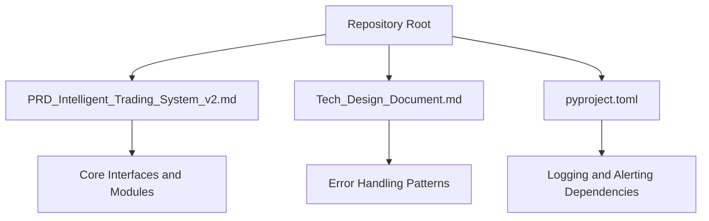
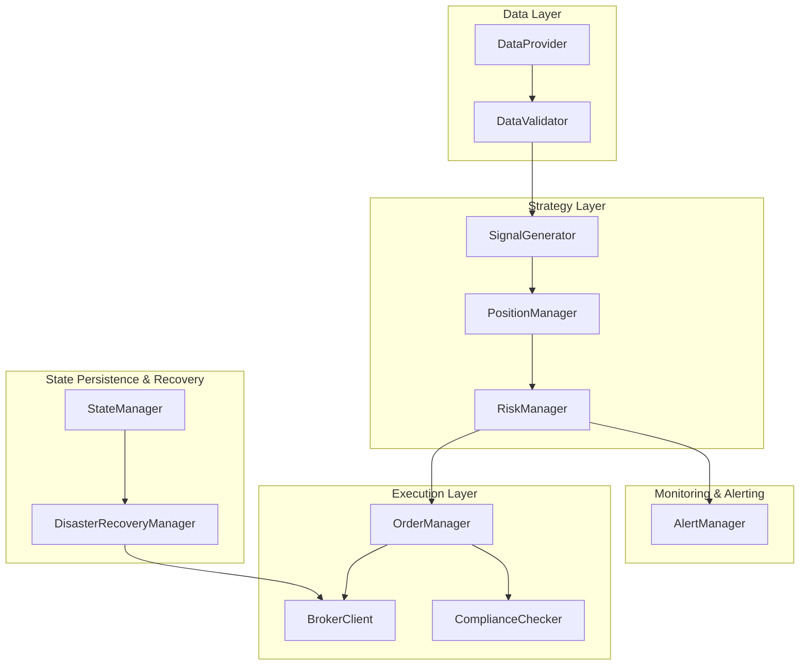
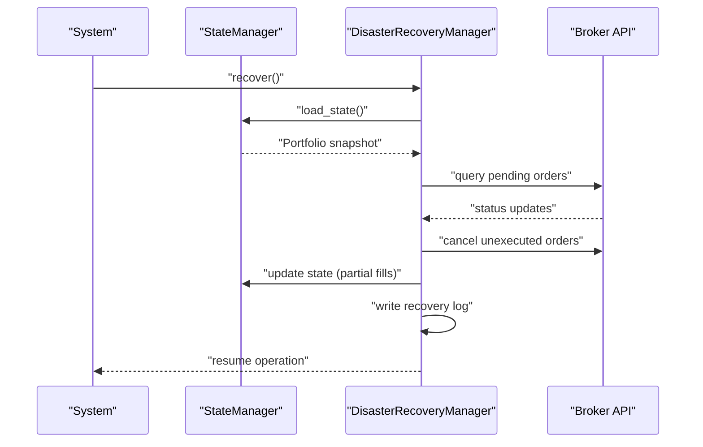
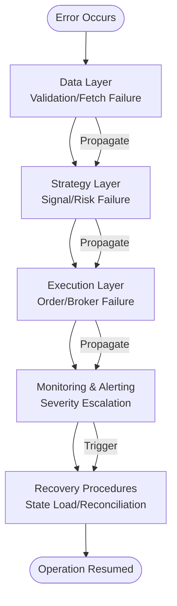
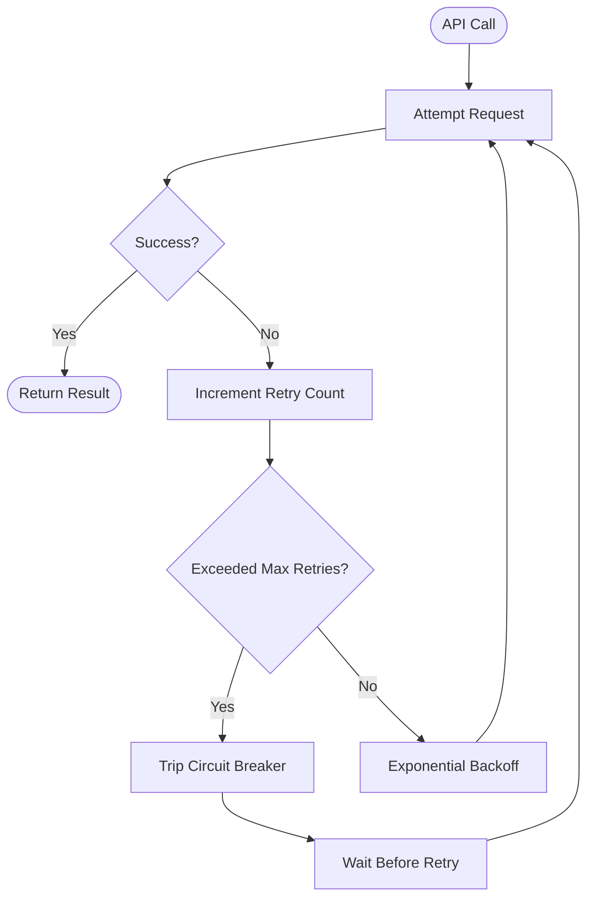
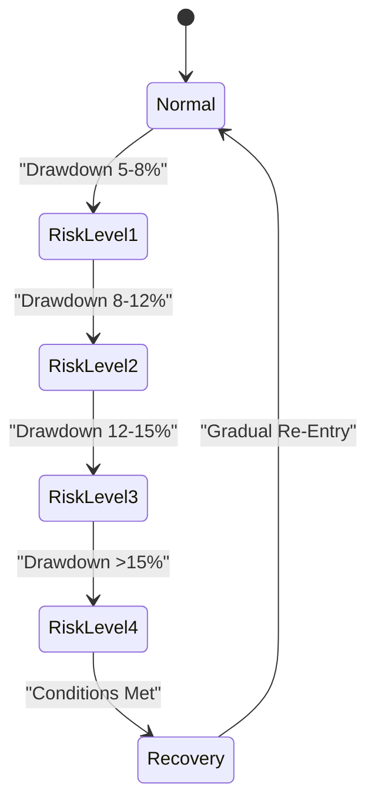
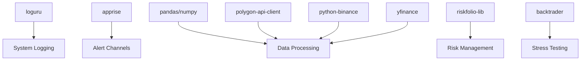

# Error Handling and Exception Management

<cite>
**Referenced Files in This Document**
- [PRD_Intelligent_Trading_System_v2.md](file://PRD_Intelligent_Trading_System_v2.md)
- [Tech_Design_Document.md](file://Tech_Design_Document.md)
- [pyproject.toml](file://pyproject.toml)
</cite>

## Table of Contents
1. [Introduction](#introduction)
2. [Project Structure](#project-structure)
3. [Core Components](#core-components)
4. [Architecture Overview](#architecture-overview)
5. [Detailed Component Analysis](#detailed-component-analysis)
6. [Dependency Analysis](#dependency-analysis)
7. [Performance Considerations](#performance-considerations)
8. [Troubleshooting Guide](#troubleshooting-guide)
9. [Conclusion](#conclusion)

## Introduction
This document provides comprehensive error handling and exception management guidance for the Intelligent Trading Decision System. It consolidates documented patterns from the product and technical design documents, focusing on exception types, error codes, logging patterns, recovery procedures, error propagation, retry strategies, circuit breakers, and graceful degradation. It also includes troubleshooting guides, common error scenarios, and diagnostic procedures for system maintenance and debugging.

## Project Structure
The repository is primarily documentation-driven, with the system architecture and error handling patterns defined in the Product Requirements Document (PRD) and Technical Design Document. The Python project configuration lists logging and alerting libraries that inform the error handling stack.

**Section sources**
- [PRD_Intelligent_Trading_System_v2.md](file://PRD_Intelligent_Trading_System_v2.md#L1006-L1113)
- [Tech_Design_Document.md](file://Tech_Design_Document.md#L121-L140)
- [pyproject.toml](file://pyproject.toml#L9-L34)

## Core Components
The system defines several core components that participate in error handling and recovery:

- Data Provider: Multi-source data acquisition with automatic fallback and validation.
- Risk Manager: Hierarchical risk control with circuit breaker-style triggers and re-entry logic.
- State Manager: Persistent state for crash recovery and reconciliation.
- Alert Manager: Multi-channel alerting with severity levels.
- Compliance Engine: Regulatory compliance enforcement with checks and safeguards.
- Disaster Recovery Manager: System crash recovery flow with reconciliation and logging.

These components collectively implement:
- Exception types and error codes derived from risk levels, data quality, and system states
- Logging patterns using modern structured logging
- Recovery procedures for crash scenarios
- Graceful degradation via risk controls and fallback mechanisms

**Section sources**
- [PRD_Intelligent_Trading_System_v2.md](file://PRD_Intelligent_Trading_System_v2.md#L418-L455)
- [Tech_Design_Document.md](file://Tech_Design_Document.md#L815-L888)

## Architecture Overview
The system’s error handling architecture integrates data quality checks, risk controls, state persistence, and alerting. The following diagram maps the documented components and their interactions.

**Diagram sources**
- [PRD_Intelligent_Trading_System_v2.md](file://PRD_Intelligent_Trading_System_v2.md#L418-L455)
- [Tech_Design_Document.md](file://Tech_Design_Document.md#L815-L888)

## Detailed Component Analysis

### Exception Types and Error Codes
The system categorizes exceptions and errors by severity and domain:

- Risk Level Exceptions (0–4): Derived from portfolio drawdown and correlation thresholds.
- Data Quality Exceptions: Triggered by missing data, price jumps, and cross-source deviations.
- System Exceptions: Unknown exceptions, API connection failures, and crash scenarios.
- Compliance Exceptions: PDT rule violations and wash sale constraints.

Severity levels:
- INFO: Normal operations and daily summaries
- WARNING: Risk Level 1, data quality issues
- CRITICAL: Risk Level 2+, system errors, API disconnections
- EMERGENCY: Risk Level 4, system crashes

Risk levels and triggers:
- Level 1: Portfolio drawdown 5–8%
- Level 2: Portfolio drawdown 8–12%
- Level 3: Portfolio drawdown 12–15%
- Level 4: Portfolio drawdown >15%

Data quality thresholds:
- Price jump >50%
- Missing data >5%
- Cross-source deviation >1%

**Section sources**
- [PRD_Intelligent_Trading_System_v2.md](file://PRD_Intelligent_Trading_System_v2.md#L401-L416)
- [PRD_Intelligent_Trading_System_v2.md](file://PRD_Intelligent_Trading_System_v2.md#L288-L332)
- [Tech_Design_Document.md](file://Tech_Design_Document.md#L815-L833)

### Logging Patterns
The system uses modern structured logging for observability and diagnostics. Logging patterns include:
- Structured log entries with timestamps, severity, module, and contextual metadata
- Audit trails for transactions, signals, and risk events
- Log retention aligned with operational needs

Logging stack:
- loguru: Structured logging library integrated into the system

**Section sources**
- [Tech_Design_Document.md](file://Tech_Design_Document.md#L137-L137)
- [Tech_Design_Document.md](file://Tech_Design_Document.md#L1001-L1045)
- [pyproject.toml](file://pyproject.toml#L23-L23)

### Recovery Procedures
The system implements crash recovery and reconciliation:
- Load last persisted state from the portfolio database
- Query broker API for pending order status
- Cancel unexecuted orders and update state for partially executed orders
- Write recovery log and resume normal operation

**Diagram sources**
- [Tech_Design_Document.md](file://Tech_Design_Document.md#L863-L888)

**Section sources**
- [Tech_Design_Document.md](file://Tech_Design_Document.md#L863-L888)

### Error Propagation Mechanisms
Error propagation follows a layered approach:
- Data layer: Validation failures propagate to strategy layer
- Strategy layer: Risk assessments and signal generation errors propagate to execution layer
- Execution layer: Broker API errors and compliance violations propagate to monitoring and alerting
- Monitoring layer: Aggregates and escalates errors based on severity levels

**Diagram sources**
- [PRD_Intelligent_Trading_System_v2.md](file://PRD_Intelligent_Trading_System_v2.md#L418-L455)
- [Tech_Design_Document.md](file://Tech_Design_Document.md#L815-L888)

### Retry Strategies and Circuit Breakers
Retry and circuit breaker patterns are embedded in the documented design:
- Data Provider: Exponential backoff with maximum retries for transient failures
- Risk Manager: Circuit breaker-style triggers based on drawdown thresholds and correlation spikes
- Compliance Engine: Enforced checks prevent risky operations until conditions are met

**Diagram sources**
- [Tech_Design_Document.md](file://Tech_Design_Document.md#L211-L239)
- [PRD_Intelligent_Trading_System_v2.md](file://PRD_Intelligent_Trading_System_v2.md#L288-L332)

### Graceful Degradation Patterns
Graceful degradation is achieved through:
- Risk controls: Reduce positions, restrict new exposures, and switch to safe-haven assets
- Fallback mechanisms: Primary and backup data sources with validation
- Re-entry logic: Gradual resumption of trading after severe drawdowns

**Diagram sources**
- [PRD_Intelligent_Trading_System_v2.md](file://PRD_Intelligent_Trading_System_v2.md#L288-L332)
- [Tech_Design_Document.md](file://Tech_Design_Document.md#L406-L437)

## Dependency Analysis
The error handling stack relies on the following dependencies:
- loguru: Structured logging
- apprise: Multi-channel alerting
- pandas, numpy: Data processing and validation
- riskfolio-lib: Risk management and optimization
- backtrader: Backtesting and stress testing
- polygon-api-client, python-binance, yfinance: Data providers

**Diagram sources**
- [pyproject.toml](file://pyproject.toml#L9-L34)

**Section sources**
- [pyproject.toml](file://pyproject.toml#L9-L34)

## Performance Considerations
- Signal latency targets and system performance metrics guide acceptable error handling overhead.
- Recovery time targets inform the design of fast crash recovery and minimal downtime.
- Data refresh and memory usage targets influence caching and retry strategies.

**Section sources**
- [Tech_Design_Document.md](file://Tech_Design_Document.md#L1075-L1112)

## Troubleshooting Guide
Common error scenarios and diagnostic procedures:

- Data Quality Issues
  - Symptoms: Missing data, extreme price jumps, cross-source inconsistencies
  - Actions: Validate data, trigger warnings, pause ingestion until resolved
  - References: Data quality thresholds and validation rules

- Risk Control Triggers
  - Symptoms: Elevated drawdown, high correlation, position concentration
  - Actions: Reduce positions, restrict new exposures, switch to safe-haven assets
  - References: Risk level thresholds and correlation monitoring

- System Crashes
  - Symptoms: Unexpected shutdown, unexecuted orders, inconsistent state
  - Actions: Load persisted state, reconcile with broker, cancel unexecuted orders, write recovery log
  - References: Disaster recovery flow and state persistence schema

- Compliance Violations
  - Symptoms: PDT rule breaches, wash sale violations
  - Actions: Block risky operations, enforce restrictions, log violations
  - References: Compliance checker interface and rules

Diagnostic procedures:
- Review structured logs for timestamps, severity, and context
- Inspect database tables for audit trails and risk events
- Validate alert channels for timely escalation
- Confirm retry/backoff behavior and circuit breaker status

**Section sources**
- [PRD_Intelligent_Trading_System_v2.md](file://PRD_Intelligent_Trading_System_v2.md#L401-L416)
- [Tech_Design_Document.md](file://Tech_Design_Document.md#L835-L888)
- [Tech_Design_Document.md](file://Tech_Design_Document.md#L1001-L1045)

## Conclusion
The Intelligent Trading Decision System’s error handling framework integrates structured logging, multi-source data validation, hierarchical risk controls, state persistence, and alerting. The documented patterns provide a robust foundation for exception management, recovery, and graceful degradation. Adhering to these guidelines ensures resilient operations, transparent diagnostics, and reliable system behavior under adverse conditions.