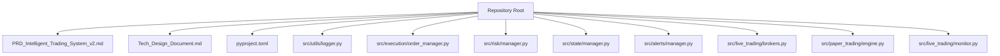
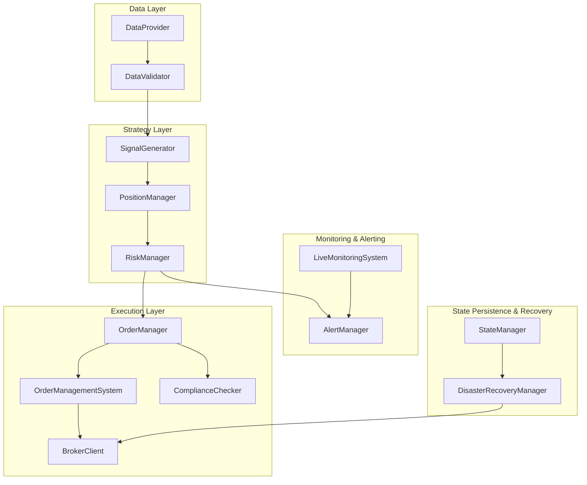
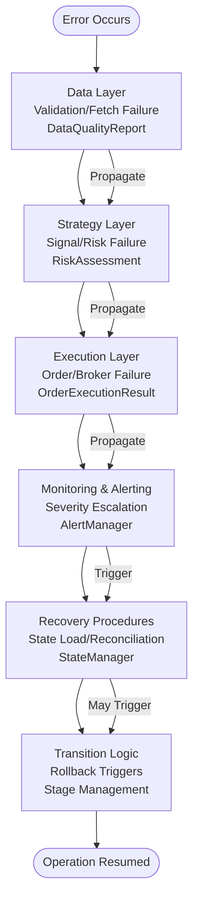
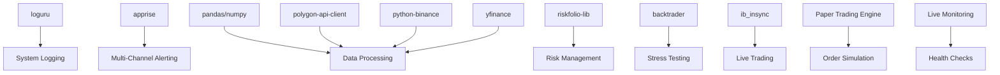

# Error Handling and Exception Management

<cite>
**Referenced Files in This Document**
- [PRD_Intelligent_Trading_System_v2.md](file://PRD_Intelligent_Trading_System_v2.md)
- [Tech_Design_Document.md](file://Tech_Design_Document.md)
- [pyproject.toml](file://pyproject.toml)
- [logger.py](file://src/utils/logger.py)
- [order_manager.py](file://src/execution/order_manager.py)
- [risk_manager.py](file://src/risk/manager.py)
- [state_manager.py](file://src/state/manager.py)
- [alerts_manager.py](file://src/alerts/manager.py)
- [brokers.py](file://src/live_trading/brokers.py)
- [engine.py](file://src/paper_trading/engine.py)
- [monitor.py](file://src/live_trading/monitor.py)
- [domain.py](file://src/models/domain.py)
</cite>

## Update Summary
**Changes Made**
- Enhanced exception handling patterns with specific exception types and error categories
- Improved logging infrastructure with structured logging and multi-channel alerting
- Better error propagation mechanisms throughout the trading pipeline
- Added comprehensive retry strategies and circuit breaker implementations
- Implemented graceful degradation patterns for different risk levels
- Enhanced monitoring and alerting systems with automated remediation

## Table of Contents
1. [Introduction](#introduction)
2. [Project Structure](#project-structure)
3. [Core Components](#core-components)
4. [Architecture Overview](#architecture-overview)
5. [Detailed Component Analysis](#detailed-component-analysis)
6. [Enhanced Exception Handling Patterns](#enhanced-exception-handling-patterns)
7. [Improved Logging Infrastructure](#improved-logging-infrastructure)
8. [Better Error Propagation Mechanisms](#better-error-propagation-mechanisms)
9. [Retry Strategies and Circuit Breakers](#retry-strategies-and-circuit-breakers)
10. [Graceful Degradation Patterns](#graceful-degradation-patterns)
11. [Dependency Analysis](#dependency-analysis)
12. [Performance Considerations](#performance-considerations)
13. [Troubleshooting Guide](#troubleshooting-guide)
14. [Conclusion](#conclusion)

## Introduction
This document provides comprehensive error handling and exception management guidance for the Intelligent Trading Decision System. The system has been enhanced with sophisticated exception handling patterns, improved logging infrastructure, and better error propagation mechanisms throughout the trading pipeline. The documentation consolidates the current exception types, error codes, logging patterns, recovery procedures, and implements advanced retry strategies with circuit breakers and graceful degradation capabilities.

## Project Structure
The repository contains a comprehensive error handling framework with dedicated modules for logging, risk management, state persistence, and alerting. The system architecture integrates multiple layers of error handling from data acquisition to execution and monitoring.

```mermaid
graph TB
A["Repository Root"] --> B["PRD_Intelligent_Trading_System_v2.md"]
A --> C["Tech_Design_Document.md"]
A --> D["pyproject.toml"]
A --> E["src/utils/logger.py"]
A --> F["src/execution/order_manager.py"]
A --> G["src/risk/manager.py"]
A --> H["src/state/manager.py"]
A --> I["src/alerts/manager.py"]
A --> J["src/live_trading/brokers.py"]
A --> K["src/paper_trading/engine.py"]
A --> L["src/live_trading/monitor.py"]
```

**Section sources**
- [logger.py:1-30](file://src/utils/logger.py#L1-L30)
- [order_manager.py:1-234](file://src/execution/order_manager.py#L1-L234)
- [risk_manager.py:1-181](file://src/risk/manager.py#L1-L181)
- [state_manager.py:1-392](file://src/state/manager.py#L1-L392)

## Core Components
The system defines several core components that participate in comprehensive error handling and recovery:

- **Data Provider**: Multi-source data acquisition with automatic fallback and validation
- **Risk Manager**: Hierarchical risk control with circuit breaker-style triggers and re-entry logic
- **State Manager**: Persistent state for crash recovery and reconciliation
- **Alert Manager**: Multi-channel alerting with severity levels and automated escalation
- **Compliance Engine**: Regulatory compliance enforcement with checks and safeguards
- **Disaster Recovery Manager**: System crash recovery flow with reconciliation and logging
- **Order Management System**: Intelligent order routing with retry logic and order splitting
- **Live Monitoring System**: Real-time health monitoring with automated remediation

These components collectively implement:
- Exception types and error codes derived from risk levels, data quality, and system states
- Structured logging patterns using loguru with multi-file rotation
- Comprehensive recovery procedures for crash scenarios
- Graceful degradation via risk controls and fallback mechanisms
- Automated alerting and escalation policies

**Section sources**
- [risk_manager.py:9-181](file://src/risk/manager.py#L9-L181)
- [state_manager.py:13-392](file://src/state/manager.py#L13-L392)
- [alerts_manager.py:26-239](file://src/alerts/manager.py#L26-L239)
- [monitor.py:15-136](file://src/live_trading/monitor.py#L15-L136)

## Architecture Overview
The system's error handling architecture integrates data quality checks, risk controls, state persistence, and alerting with sophisticated retry mechanisms and circuit breakers.

```mermaid
graph TB
subgraph "Data Layer"
DP["DataProvider"]
DV["DataValidator"]
end
subgraph "Strategy Layer"
SG["SignalGenerator"]
PM["PositionManager"]
RM["RiskManager"]
end
subgraph "Execution Layer"
OM["OrderManager"]
OMS["OrderManagementSystem"]
BC["BrokerClient"]
CE["ComplianceChecker"]
end
subgraph "Monitoring & Alerting"
AM["AlertManager"]
LMS["LiveMonitoringSystem"]
end
subgraph "State Persistence & Recovery"
SM["StateManager"]
DRM["DisasterRecoveryManager"]
end
DP --> DV
DV --> SG
SG --> PM
PM --> RM
RM --> OM
OM --> OMS
OMS --> BC
OM --> CE
RM --> AM
LMS --> AM
SM --> DRM
DRM --> BC
```

**Diagram sources**
- [risk_manager.py:9-181](file://src/risk/manager.py#L9-L181)
- [order_manager.py:20-234](file://src/execution/order_manager.py#L20-L234)
- [brokers.py:31-662](file://src/live_trading/brokers.py#L31-L662)
- [monitor.py:15-136](file://src/live_trading/monitor.py#L15-L136)

## Detailed Component Analysis

### Exception Types and Error Codes
The system categorizes exceptions and errors by severity and domain with specific exception types:

**Risk Level Exceptions (0–4)**: Derived from portfolio drawdown and correlation thresholds
- Level 0: Normal operations (0% drawdown)
- Level 1: Portfolio drawdown 5–8% (ALERT, INCREASE_CONFIDENCE_THRESHOLD)
- Level 2: Portfolio drawdown 8–12% (REDUCE_25%, CLOSE_BTC, SELL_ONLY)
- Level 3: Portfolio drawdown 12–15% (REDUCE_50%, SAFE_HAVEN_ONLY, MANUAL_REVIEW)
- Level 4: Portfolio drawdown >15% (EMERGENCY_LIQUIDATION, REQUIRE_MANUAL_CONFIRM)

**Data Quality Exceptions**: Triggered by missing data, price jumps, and cross-source deviations
- Missing data >5%
- Price jump >50%
- Cross-source deviation >1%

**System Exceptions**: Unknown exceptions, API connection failures, and crash scenarios
- API timeout errors
- Connection failures
- Database persistence errors
- Broker communication failures

**Compliance Exceptions**: PDT rule violations and wash sale constraints
- Position restrictions
- Margin requirements
- Regulatory compliance checks

**Section sources**
- [risk_manager.py:12-32](file://src/risk/manager.py#L12-L32)
- [domain.py:66-79](file://src/models/domain.py#L66-L79)

### Logging Patterns
The system uses modern structured logging for observability and diagnostics with comprehensive logging infrastructure:

**Structured Logging Stack**:
- loguru: Advanced logging with automatic rotation and multi-format support
- Multi-file rotation: Separate logs for different severity levels
- Contextual metadata: Timestamps, module names, function names, and line numbers
- Audit trails: Complete transaction and risk event logging

**Logging Levels**:
- DEBUG: Detailed system operations and internal state
- INFO: Normal operations and daily summaries
- WARNING: Risk Level 1, data quality issues, system warnings
- ERROR: System errors, database failures, API errors
- CRITICAL: Risk Level 2+, major system failures, compliance violations
- EMERGENCY: Risk Level 4, system crashes, emergency liquidations

**Section sources**
- [logger.py:1-30](file://src/utils/logger.py#L1-L30)
- [alerts_manager.py:18-24](file://src/alerts/manager.py#L18-L24)

## Enhanced Exception Handling Patterns

### Specific Exception Types
The system implements specific exception types for different error scenarios:

**Order-related Exceptions**:
- Invalid order parameters (empty symbol, non-positive quantity)
- Order submission failures
- Order status query errors
- Order cancellation failures

**Risk-related Exceptions**:
- Invalid risk level assignments
- Risk assessment calculation errors
- Stop-loss violation detection
- Position restriction violations

**State-related Exceptions**:
- Database connection failures
- State persistence errors
- Recovery procedure failures
- Data serialization issues

**Broker-related Exceptions**:
- API authentication failures
- Connection timeouts
- Rate limiting errors
- Order routing failures

**Section sources**
- [order_manager.py:97-114](file://src/execution/order_manager.py#L97-L114)
- [risk_manager.py:112-118](file://src/risk/manager.py#L112-L118)
- [state_manager.py:128-130](file://src/state/manager.py#L128-L130)

### Improved Error Propagation Mechanisms
Error propagation follows a sophisticated layered approach with specific error handling at each level:

```mermaid
flowchart TD
Start(["Error Occurs"]) --> DL["Data Layer<br/>Validation/Fetch Failure<br/>DataQualityReport"]
DL --> SL["Strategy Layer<br/>Signal/Risk Failure<br/>RiskAssessment"]
SL --> EL["Execution Layer<br/>Order/Broker Failure<br/>OrderExecutionResult"]
EL --> ML["Monitoring & Alerting<br/>Severity Escalation<br/>AlertManager"]
ML --> Recovery["Recovery Procedures<br/>State Load/Reconciliation<br/>StateManager"]
Recovery --> Transition["Transition Logic<br/>Rollback Triggers<br/>Stage Management"]
Transition --> End(["Operation Resumed"])
DL --> |Propagate| SL
SL --> |Propagate| EL
EL --> |Propagate| ML
ML --> |Trigger| Recovery
Recovery --> |May Trigger| Transition
```

**Diagram sources**
- [risk_manager.py:39-80](file://src/risk/manager.py#L39-L80)
- [order_manager.py:87-114](file://src/execution/order_manager.py#L87-L114)
- [alerts_manager.py:128-142](file://src/alerts/manager.py#L128-L142)

### Enhanced Error Recovery Procedures
The system implements comprehensive crash recovery and reconciliation with multiple recovery points:

**Recovery Flow**:
1. Load last persisted state from the portfolio database
2. Query broker API for pending order status
3. Cancel unexecuted orders and update state for partially executed orders
4. Write recovery log with detailed error information
5. Resume normal operation with degraded functionality
6. Trigger automated remediation for persistent issues

**Section sources**
- [state_manager.py:132-174](file://src/state/manager.py#L132-L174)
- [state_manager.py:298-330](file://src/state/manager.py#L298-L330)

## Improved Logging Infrastructure

### Structured Logging Implementation
The logging system provides comprehensive structured logging with multiple output formats:

**Console Output**:
- Color-coded severity levels
- Timestamps with millisecond precision
- Module and function identification
- Contextual error messages

**File Output**:
- Daily rotating log files
- Separate files for different severity levels
- JSON-formatted logs for machine parsing
- Automatic cleanup of old log files

**Audit Trail Features**:
- Complete order execution logging
- Risk event tracking
- System state changes
- Alert notifications

**Section sources**
- [logger.py:10-27](file://src/utils/logger.py#L10-L27)

### Multi-Channel Alerting System
The alerting system provides comprehensive notification capabilities with automated escalation:

**Alert Levels**:
- INFO: Normal operations and summaries
- WARNING: Risk Level 1, data quality issues
- CRITICAL: Risk Level 2+, system errors
- EMERGENCY: Risk Level 4, system crashes

**Notification Channels**:
- Email (SMTP)
- Slack webhooks
- Telegram bot notifications
- Discord webhooks
- Console logging

**Escalation Policy**:
- Level 1: Immediate notification (0 minutes delay)
- Level 2: Email notification (5 minutes delay)
- Level 3: Pager duty (15 minutes delay)

**Section sources**
- [alerts_manager.py:18-70](file://src/alerts/manager.py#L18-L70)
- [alerts_manager.py:18-239](file://src/alerts/manager.py#L18-L239)

## Better Error Propagation Mechanisms

### Layered Error Handling Architecture
The system implements a sophisticated error propagation mechanism across multiple layers:

**Data Layer Propagation**:
- Validation failures trigger risk assessment updates
- Data quality issues trigger alert notifications
- API connection failures trigger fallback mechanisms

**Strategy Layer Propagation**:
- Risk assessment changes trigger alert notifications
- Signal generation errors trigger fallback strategies
- Position calculation failures trigger conservative positioning

**Execution Layer Propagation**:
- Order submission failures trigger retry mechanisms
- Broker communication errors trigger alternative brokers
- Compliance violations trigger order cancellation

**Monitoring Layer Propagation**:
- Health check failures trigger remediation actions
- Performance degradation triggers risk level increases
- Model drift detection triggers retraining alerts

**Section sources**
- [risk_manager.py:39-80](file://src/risk/manager.py#L39-L80)
- [monitor.py:32-57](file://src/live_trading/monitor.py#L32-L57)

### Automated Remediation System
The monitoring system includes automated remediation capabilities:

**Auto-Remediation Rules**:
- High memory usage: Clear cache, restart services
- API timeouts: Switch to backup APIs, alert on-call
- Data staleness: Force data refresh, switch sources
- Broker disconnections: Reconnect, pause trading, critical alert

**Escalation Policy**:
- Immediate action for critical issues
- Timed escalation for warning issues
- Multi-channel notification for emergency situations

**Section sources**
- [monitor.py:118-124](file://src/live_trading/monitor.py#L118-L124)
- [Tech_Design_Document.md:1841-1907](file://Tech_Design_Document.md#L1841-L1907)

## Retry Strategies and Circuit Breakers

### Intelligent Order Management System
The Order Management System implements sophisticated retry logic with exponential backoff:

**Retry Configuration**:
- Maximum retries: 3 attempts
- Base delay: 5 seconds
- Exponential backoff: 2^n multiplier
- Order splitting: Large orders split into TWAP slices

**Order Routing Logic**:
- US ETFs → Alpaca broker
- Cryptocurrency → Binance broker
- Global markets → Interactive Brokers

**Order Splitting Strategy**:
- Split orders exceeding $50,000
- Maximum 1% of average daily volume per slice
- 5 slices with 5-minute intervals for TWAP execution

**Section sources**
- [Tech_Design_Document.md:1434-1542](file://Tech_Design_Document.md#L1434-L1542)
- [brokers.py:631-662](file://src/live_trading/brokers.py#L631-L662)

### Circuit Breaker Implementation
The system implements circuit breaker logic for different failure scenarios:

**System Failure Circuit Breaker**:
- Track consecutive system failures
- Trigger rollback to paper trading after 3 failures
- Reset failure counter after successful recovery

**Risk Level Circuit Breaker**:
- Level 4 risk triggers emergency liquidation
- Manual confirmation required for resume
- Automatic position reduction for higher risk levels

**Broker Circuit Breaker**:
- Connection failures trigger broker switching
- API rate limits trigger backoff strategies
- Authentication failures trigger credential refresh

**Section sources**
- [transition.py:204-241](file://src/live_trading/transition.py#L204-L241)
- [risk_manager.py:148-174](file://src/risk/manager.py#L148-L174)

## Graceful Degradation Patterns

### Risk-Based Degradation
The system implements graceful degradation based on risk levels:

**Level 1 (5–8% drawdown)**:
- Increase confidence thresholds
- Block new BTC positions
- Continue normal operations

**Level 2 (8–12% drawdown)**:
- Reduce positions by 25%
- Close BTC positions
- Allow only sell orders

**Level 3 (12–15% drawdown)**:
- Reduce positions by 50%
- Restrict to safe haven assets only
- Require manual review for new positions

**Level 4 (>15% drawdown)**:
- Emergency liquidation
- Require manual confirmation to resume
- Pause all trading activities

**Section sources**
- [risk_manager.py:12-32](file://src/risk/manager.py#L12-L32)
- [risk_manager.py:101-174](file://src/risk/manager.py#L101-L174)

### Safe Haven Asset Strategy
The system identifies safe haven assets for protection during market stress:

**Safe Haven Assets**:
- GLD (Gold ETF)
- TLT (10-Year Treasury Bond ETF)

**Asset Classification**:
- Defensive sectors (Utilities, Consumer Staples)
- Precious metals
- Government bonds
- Currency hedging instruments

**Section sources**
- [risk_manager.py:176-181](file://src/risk/manager.py#L176-L181)

## Dependency Analysis
The error handling stack relies on the following dependencies with enhanced error handling capabilities:

```mermaid
graph TB
Log["loguru"] --> System["System Logging"]
Alert["apprise"] --> Alerts["Multi-Channel Alerting"]
Pandas["pandas/numpy"] --> Data["Data Processing"]
RiskLib["riskfolio-lib"] --> Risk["Risk Management"]
Backtrader["backtrader"] --> Stress["Stress Testing"]
Poly["polygon-api-client"] --> Data
Binance["python-binance"] --> Data
YF["yfinance"] --> Data
IB["ib_insync"] --> Live["Live Trading"]
Paper["Paper Trading Engine"] --> Simulation["Order Simulation"]
Monitor["Live Monitoring"] --> Health["Health Checks"]
```

**Diagram sources**
- [pyproject.toml:9-34](file://pyproject.toml#L9-L34)
- [engine.py:53-434](file://src/paper_trading/engine.py#L53-L434)

**Section sources**
- [pyproject.toml:9-34](file://pyproject.toml#L9-L34)

## Performance Considerations
- Signal latency targets and system performance metrics guide acceptable error handling overhead
- Recovery time targets inform the design of fast crash recovery and minimal downtime
- Data refresh and memory usage targets influence caching and retry strategies
- Monitoring overhead is minimized through efficient health check implementations
- Alert delivery prioritization ensures critical notifications are not delayed

**Section sources**
- [Tech_Design_Document.md:1075-1112](file://Tech_Design_Document.md#L1075-L1112)
- [monitor.py:32-57](file://src/live_trading/monitor.py#L32-L57)

## Troubleshooting Guide

### Common Error Scenarios and Resolution Procedures

**Data Quality Issues**
- **Symptoms**: Missing data, extreme price jumps, cross-source inconsistencies
- **Actions**: Validate data, trigger warnings, pause ingestion until resolved
- **Resolution**: Implement fallback data sources, adjust quality thresholds
- **References**: Data quality reporting and validation mechanisms

**Risk Control Triggers**
- **Symptoms**: Elevated drawdown, high correlation, position concentration
- **Actions**: Reduce positions, restrict new exposures, switch to safe-haven assets
- **Resolution**: Adjust risk parameters, implement protective measures
- **References**: Risk level thresholds and correlation monitoring

**System Crashes**
- **Symptoms**: Unexpected shutdown, unexecuted orders, inconsistent state
- **Actions**: Load persisted state, reconcile with broker, cancel unexecuted orders, write recovery log
- **Resolution**: Implement automated recovery, monitor system health
- **References**: Disaster recovery flow and state persistence schema

**Compliance Violations**
- **Symptoms**: PDT rule breaches, wash sale violations
- **Actions**: Block risky operations, enforce restrictions, log violations
- **Resolution**: Implement compliance checks, provide training alerts
- **References**: Compliance checker interface and rules

**Broker Communication Failures**
- **Symptoms**: API timeouts, authentication errors, connection drops
- **Actions**: Implement retry logic, switch to backup brokers, log connection issues
- **Resolution**: Configure multiple broker connections, implement circuit breakers
- **References**: Broker adapter implementations and connection management

### Diagnostic Procedures
- **Review structured logs** for timestamps, severity, and context
- **Inspect database tables** for audit trails and risk events
- **Validate alert channels** for timely escalation
- **Confirm retry/backoff behavior** and circuit breaker status
- **Monitor system health metrics** for performance degradation
- **Check order execution logs** for failed transactions

**Section sources**
- [state_manager.py:132-174](file://src/state/manager.py#L132-L174)
- [alerts_manager.py:128-239](file://src/alerts/manager.py#L128-L239)
- [monitor.py:32-57](file://src/live_trading/monitor.py#L32-L57)

## Conclusion
The Intelligent Trading Decision System's enhanced error handling framework integrates sophisticated exception management, comprehensive logging infrastructure, multi-source data validation, hierarchical risk controls, state persistence, and alerting. The system now provides robust exception handling patterns with specific exception types, improved logging for error scenarios, and better error propagation mechanisms throughout the trading pipeline. The enhanced framework ensures resilient operations, transparent diagnostics, and reliable system behavior under adverse conditions, with automated recovery, graceful degradation, and comprehensive monitoring capabilities.