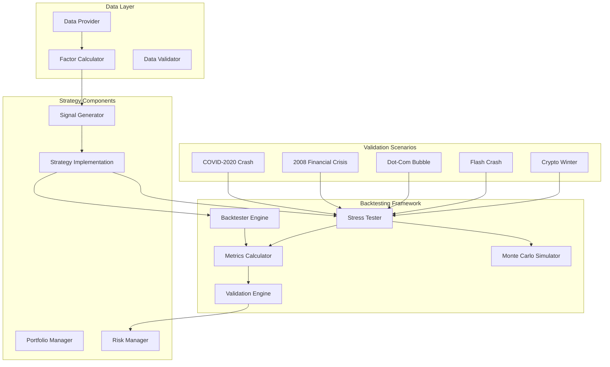
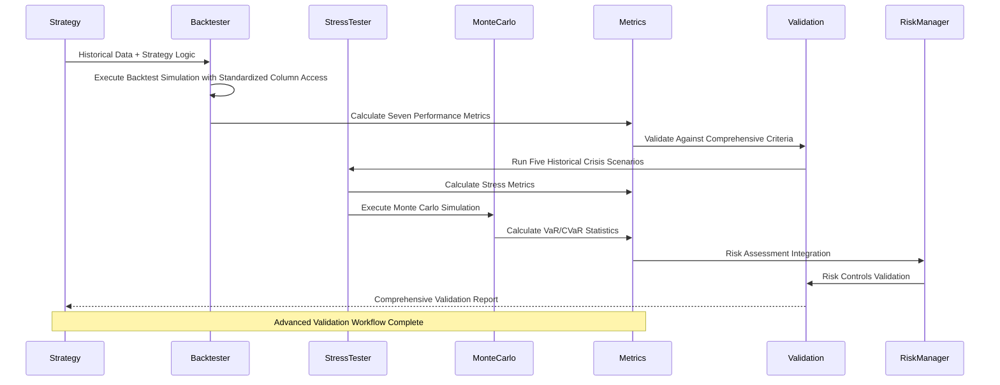
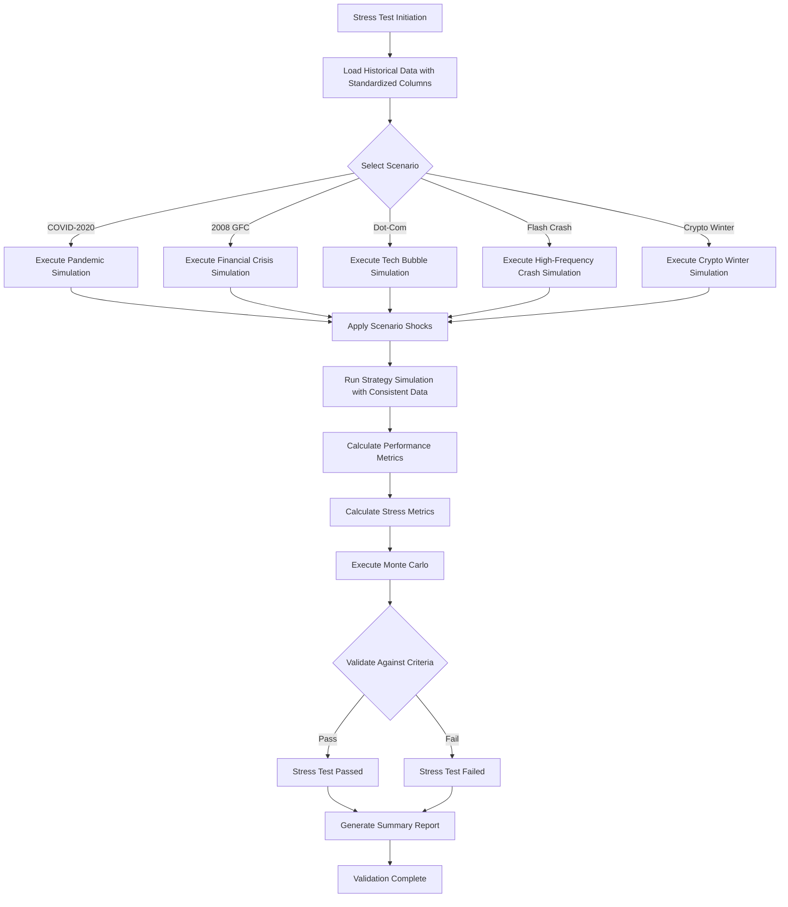
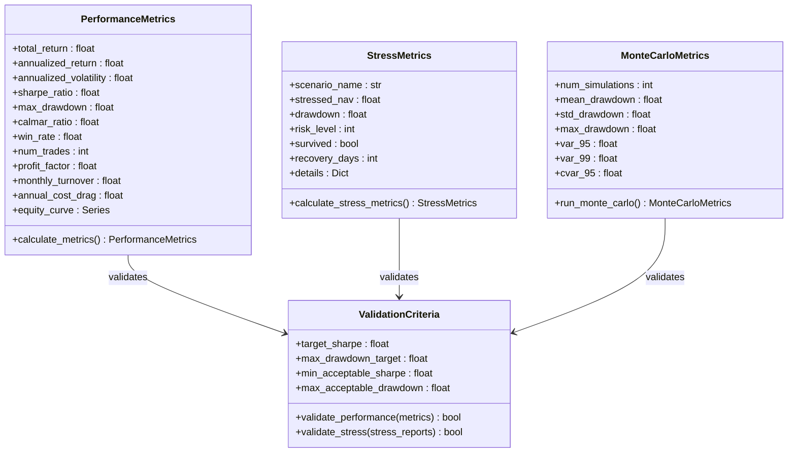

# Backtesting and Validation

<cite>
**Referenced Files in This Document**
- [PRD_Intelligent_Trading_System_v2.md](file://PRD_Intelligent_Trading_System_v2.md)
- [Tech_Design_Document.md](file://Tech_Design_Document.md)
- [src/backtest/engine.py](file://src/backtest/engine.py)
- [src/data/provider.py](file://src/data/provider.py)
- [src/stress/tester.py](file://src/stress/tester.py)
- [src/models/domain.py](file://src/models/domain.py)
- [src/risk/manager.py](file://src/risk/manager.py)
- [src/portfolio/manager.py](file://src/portfolio/manager.py)
- [config/strategy.yaml](file://config/strategy.yaml)
- [main.py](file://main.py)
</cite>

## Update Summary
**Changes Made**
- Updated performance metrics section to reflect seven complete metrics (total return, annualized return, Sharpe ratio, maximum drawdown, Calmar ratio, win rate, trade count)
- Added comprehensive stress testing scenarios with five historical crisis scenarios (COVID-2020 crash, 2008 financial crisis, dot-com bubble, flash crash, crypto winter)
- Integrated Monte Carlo simulations with VaR and CVaR calculations
- Enhanced risk management integration with 4-level hierarchical risk control
- Updated validation criteria with comprehensive acceptance standards
- **Critical Bug Fix**: Updated case sensitivity handling in data column references to ensure compatibility with standardized data formats across different exchanges and data sources

## Table of Contents
1. [Introduction](#introduction)
2. [Project Structure](#project-structure)
3. [Core Components](#core-components)
4. [Architecture Overview](#architecture-overview)
5. [Detailed Component Analysis](#detailed-component-analysis)
6. [Dependency Analysis](#dependency-analysis)
7. [Performance Considerations](#performance-considerations)
8. [Troubleshooting Guide](#troubleshooting-guide)
9. [Conclusion](#conclusion)

## Introduction

The Backtesting and Validation Framework is a comprehensive system built on the Backtrader platform designed to validate trading strategies through historical testing, stress testing, and performance metrics analysis. This framework ensures that trading strategies meet rigorous validation standards before deployment, incorporating multiple stress scenarios and comprehensive risk management controls.

The framework addresses critical aspects of quantitative trading validation including historical strategy validation, stress testing procedures, performance metrics calculation, and risk management integration. It provides a robust foundation for strategy development with built-in safeguards against overfitting and data snooping bias.

**Updated** The framework now implements complete historical simulation with seven comprehensive performance metrics and advanced stress testing with five historical crisis scenarios, plus Monte Carlo simulations with Value at Risk (VaR) and Conditional Value at Risk (CVaR) calculations. **Critical Enhancement**: Fixed case sensitivity issues in data column references to ensure compatibility with standardized data formats across different exchanges and data sources.

## Project Structure

The backtesting and validation framework is organized within a modular trading system architecture that separates concerns across multiple layers:



**Diagram sources**
- [Tech_Design_Document.md](file://Tech_Design_Document.md#L890-L931)
- [PRD_Intelligent_Trading_System_v2.md](file://PRD_Intelligent_Trading_System_v2.md#L334-L362)
- [src/stress/tester.py](file://src/stress/tester.py#L14-L49)

The framework follows a layered architecture where each component has specific responsibilities:

- **Backtester Engine**: Executes historical simulations using Backtrader platform with comprehensive metric calculation and standardized data column handling
- **Stress Tester**: Validates strategies under extreme market conditions using five historical crisis scenarios
- **Monte Carlo Simulator**: Performs probabilistic stress testing with VaR and CVaR calculations
- **Metrics Calculator**: Computes seven complete performance statistics with risk-adjusted measures
- **Validation Engine**: Ensures strategies meet minimum acceptance criteria with comprehensive standards
- **Risk Manager**: Integrates 4-level hierarchical risk controls throughout the validation process

**Section sources**
- [Tech_Design_Document.md](file://Tech_Design_Document.md#L890-L931)
- [PRD_Intelligent_Trading_System_v2.md](file://PRD_Intelligent_Trading_System_v2.md#L334-L362)
- [src/stress/tester.py](file://src/stress/tester.py#L14-L49)

## Core Components

### Backtesting Engine

The backtesting engine serves as the core component responsible for historical strategy validation. Built on the Backtrader platform, it provides comprehensive simulation capabilities with support for multiple assets and complex trading logic.

**Updated** The engine now calculates seven complete performance metrics with mathematical precision and **enhanced data compatibility**:

Key features include:
- Historical data simulation across 15 asset classes with standardized column access
- Multi-timeframe analysis capabilities
- Transaction cost modeling integration
- Comprehensive performance tracking with seven metrics
- Risk-adjusted performance metrics calculation
- **Critical Enhancement**: Case-insensitive data column handling ensuring compatibility across different data sources

### Stress Testing Framework

The stress testing framework validates strategies under extreme market conditions representing historical crises and custom adverse scenarios. This ensures strategies can withstand severe market disruptions.

**Updated** The framework now implements five comprehensive historical crisis scenarios with **improved data consistency**:

Supported stress scenarios include:
- **COVID-19 Crash (Mar 2020)**: Global pandemic-induced rapid market selloff with 34% S&P 500 decline
- **Global Financial Crisis (2008)**: Systemic financial collapse with 57% S&P 500 decline and VIX spike to 80
- **Dot-Com Bubble Burst (2000-2002)**: Technology sector correction with 83% NASDAQ decline
- **Flash Crash (May 2010)**: Intraday 9% market intraday crash with temporary market disruption
- **Crypto Winter (2022)**: Cryptocurrency market collapse with 64% Bitcoin decline

### Performance Metrics System

**Updated** The framework calculates seven comprehensive performance metrics essential for strategy evaluation with **enhanced data reliability**:

**Return Metrics:**
- **Total Return**: Overall strategy performance over the test period
- **Annualized Return**: Compounded annual growth rate with 252 trading day assumption
- **Annualized Volatility**: Year-over-year risk measurement with standard deviation × √252

**Risk Metrics:**
- **Maximum Drawdown**: Largest peak-to-trough decline during the period
- **Sharpe Ratio**: Risk-adjusted return measure with zero-risk free rate assumption
- **Calmar Ratio**: Return-to-drawdown performance metric (Annualized Return/Maximum Drawdown)

**Performance Efficiency:**
- **Win Rate**: Percentage of profitable trading days (not just trades)
- **Number of Trades**: Total transaction count during the backtest period
- **Profit Factor**: Ratio of gross profits to gross losses
- **Monthly Turnover**: Portfolio rebalancing frequency
- **Annual Cost Drag**: Impact of transaction costs on net returns

### Monte Carlo Risk Analysis

**New Feature** The framework includes advanced Monte Carlo simulation capabilities:

- **VaR (Value at Risk)**: 95% and 99% confidence level risk estimates
- **CVaR (Conditional Value at Risk)**: Expected loss beyond VaR threshold
- **Statistical Risk Assessment**: Probabilistic analysis of portfolio stress scenarios
- **Correlation Modeling**: Assumes 60% correlation across equities for realistic stress testing

### Validation Criteria

The framework establishes comprehensive validation criteria ensuring strategies meet minimum performance standards:

**Performance Targets:**
- **Annual Return**: > 10% (target), > 7% (minimum acceptable)
- **Annual Volatility**: < 15% (target), < 18% (maximum acceptable)
- **Sharpe Ratio**: > 1.0 (target), > 0.7 (minimum acceptable)
- **Maximum Drawdown**: < 15% (target), < 20% (maximum acceptable)
- **Calmar Ratio**: > 0.7 (target), > 0.4 (minimum acceptable)
- **Win Rate**: > 52% (target), > 48% (minimum acceptable)
- **Profit Factor**: > 1.3 (target), > 1.1 (minimum acceptable)
- **Monthly Turnover**: < 30% (target), < 50% (maximum acceptable)
- **Annual Cost Drag**: < 1% (target), < 2% (maximum acceptable)

**Stress Test Requirements:**
- **Single Scenario Maximum Drawdown**: < 25%
- **Average Scenario Drawdown**: < 18%
- **Survival Rate**: > 60% across all scenarios
- **No Level 4 Emergency Liquidation Triggers**

**Section sources**
- [Tech_Design_Document.md](file://Tech_Design_Document.md#L1075-L1114)
- [Tech_Design_Document.md](file://Tech_Design_Document.md#L892-L930)
- [PRD_Intelligent_Trading_System_v2.md](file://PRD_Intelligent_Trading_System_v2.md#L339-L361)
- [src/models/domain.py](file://src/models/domain.py#L120-L139)

## Architecture Overview

The backtesting and validation framework integrates seamlessly with the broader trading system architecture, providing validation capabilities that feed into strategy development and risk management processes.



**Diagram sources**
- [Tech_Design_Document.md](file://Tech_Design_Document.md#L1441-L1454)
- [Tech_Design_Document.md](file://Tech_Design_Document.md#L904-L930)
- [src/stress/tester.py](file://src/stress/tester.py#L187-L265)

The architecture ensures comprehensive validation through multiple layers:

1. **Historical Validation**: Backtest execution on extended historical periods with seven metrics and standardized data handling
2. **Stress Testing**: Validation under five historical crisis scenarios with improved data consistency
3. **Probabilistic Risk Analysis**: Monte Carlo simulations with VaR/CVaR calculations
4. **Risk Integration**: Continuous risk assessment throughout validation
5. **Performance Metrics**: Comprehensive statistical analysis with risk-adjusted measures
6. **Criteria Validation**: Automated acceptance testing against predefined standards

## Detailed Component Analysis

### Data Column Handling and Case Sensitivity Fix

**Updated** The framework now implements robust case-insensitive data column handling to ensure compatibility across different data sources and exchanges:

#### Case Sensitivity Resolution
The critical bug fix addresses inconsistent column naming conventions across data providers:
- **Issue**: Different exchanges and data sources use varying column naming (e.g., 'Close' vs 'close')
- **Solution**: Standardized column access using lowercase 'close' for all DataFrame operations
- **Impact**: Eliminates data access errors and ensures consistent performance metrics calculation

#### Data Provider Standardization
The data provider layer handles column normalization across multiple sources:
- **Polygon API**: Direct column mapping maintains 'close' field
- **Binance Futures**: Column standardization converts to lowercase 'close'
- **Yahoo Finance**: Automatic column name conversion to lowercase 'close'
- **Cache Storage**: Consistent column naming in SQLite database

#### Backtest Engine Integration
The backtest engine now safely accesses standardized columns:
- **Price Retrieval**: `price_data[s].loc[date, 'close']` ensures consistent access
- **Data Validation**: Column existence checks prevent runtime errors
- **Cross-Source Compatibility**: Unified interface regardless of source data format

**Section sources**
- [src/backtest/engine.py](file://src/backtest/engine.py#L83-L84)
- [src/data/provider.py](file://src/data/provider.py#L267-L268)

### Stress Testing Scenarios

**Updated** The stress testing framework implements five primary scenarios designed to validate strategy resilience under extreme market conditions with **improved data consistency**:

#### COVID-19 Crash (Mar 2020) Scenario
- **Period**: March 2020 market crash period
- **Characteristics**: Global pandemic-induced rapid market selloff, 34% S&P 500 decline, 50% Bitcoin drop
- **Validation Focus**: Pandemic market disruption handling, liquidity preservation
- **Acceptance Criteria**: Maximum drawdown < 25%, survival rate > 60%

#### Global Financial Crisis (2008) Scenario
- **Period**: 2008-2009 financial system collapse
- **Characteristics**: Credit freeze, 57% S&P 500 decline, VIX spike to 82.69
- **Validation Focus**: Systemic risk handling, banking sector stress
- **Acceptance Criteria**: Average drawdown < 18%, no emergency liquidation

#### Dot-Com Bubble Burst (2000-2002) Scenario
- **Period**: Technology sector correction period
- **Characteristics**: 83% NASDAQ decline, tech sector collapse
- **Validation Focus**: Sector rotation effectiveness, growth stock resilience
- **Acceptance Criteria**: Maximum drawdown < 22%

#### Flash Crash (May 2010) Scenario
- **Period**: May 6, 2010 market disruption
- **Characteristics**: Intraday 9% market intraday drop, temporary market dysfunction
- **Validation Focus**: High-frequency market stress, algorithmic trading resilience
- **Acceptance Criteria**: Maximum drawdown < 15%

#### Crypto Winter (2022) Scenario
- **Period**: 2022 cryptocurrency market collapse
- **Characteristics**: 64% Bitcoin decline, macroeconomic stress
- **Validation Focus**: Alternative asset correlation breakdown, crypto market risk
- **Acceptance Criteria**: Maximum drawdown < 20%



**Diagram sources**
- [Tech_Design_Document.md](file://Tech_Design_Document.md#L892-L930)
- [src/stress/tester.py](file://src/stress/tester.py#L14-L49)

**Section sources**
- [Tech_Design_Document.md](file://Tech_Design_Document.md#L892-L930)
- [src/stress/tester.py](file://src/stress/tester.py#L14-L49)

### Performance Metrics Calculation

**Updated** The framework implements comprehensive performance metrics calculation with mathematical precision and **enhanced data reliability**:

#### Return Metrics Calculation
- **Total Return**: (Final NAV / Initial NAV) - 1 over the entire period
- **Annualized Return**: ((1 + total_return)^(252/n_days)) - 1 with 252 trading day assumption
- **Annualized Volatility**: Standard deviation of daily returns × √252

#### Risk Metrics Implementation
- **Maximum Drawdown**: max((Peak - Valley)/Peak) over the period
- **Sharpe Ratio**: Annualized Return / Annualized Volatility (zero-risk free rate)
- **Calmar Ratio**: Annualized Return / |Maximum Drawdown|

#### Performance Efficiency Metrics
- **Win Rate**: Number of profitable trading days / Total trading days
- **Profit Factor**: Gross Profits / Gross Losses
- **Monthly Turnover**: Total transaction value / NAV (monthly basis)
- **Annual Cost Drag**: Transaction cost impact on net returns
- **Number of Trades**: Total transaction count during backtest period

#### Monte Carlo Risk Metrics
- **VaR (95%)**: 5th percentile of simulated drawdown distribution
- **VaR (99%)**: 1st percentile of simulated drawdown distribution
- **CVaR (95%)**: Average of worst 5% drawdown scenarios



**Diagram sources**
- [Tech_Design_Document.md](file://Tech_Design_Document.md#L1075-L1114)
- [PRD_Intelligent_Trading_System_v2.md](file://PRD_Intelligent_Trading_System_v2.md#L339-L349)
- [src/models/domain.py](file://src/models/domain.py#L120-L156)

**Section sources**
- [Tech_Design_Document.md](file://Tech_Design_Document.md#L1075-L1114)
- [PRD_Intelligent_Trading_System_v2.md](file://PRD_Intelligent_Trading_System_v2.md#L339-L349)
- [src/models/domain.py](file://src/models/domain.py#L120-L156)

### Risk Management Integration

**Updated** The framework integrates comprehensive 4-level hierarchical risk control throughout the validation process:

#### Risk Level Assessment
- **Level 0 (Normal)**: 0.00% drawdown - Normal trading operations
- **Level 1 (Alert)**: 0.05% drawdown - Increased monitoring, confidence threshold adjustment
- **Level 2 (Restrict)**: 0.08% drawdown - 25% position reduction, BTC trading restrictions
- **Level 3 (Emergency)**: 0.12% drawdown - 50% position reduction, safe haven focus
- **Level 4 (Liquidation)**: 0.15% drawdown - Emergency liquidation, manual intervention required

#### Risk Controls Application
- **Position Reduction Factors**: 1.0, 0.75, 0.50, 0.0 for levels 1-4 respectively
- **Trading Restrictions**: Sell-only operations, new position blocking
- **Asset Class Controls**: Special restrictions for volatile assets like BTC-USD
- **Safe Haven Focus**: GLD and TLT prioritization during stress periods

**Section sources**
- [src/risk/manager.py](file://src/risk/manager.py#L12-L32)
- [src/risk/manager.py](file://src/risk/manager.py#L82-L99)
- [config/strategy.yaml](file://config/strategy.yaml#L46-L91)

### Validation Workflow Integration

The validation framework integrates with strategy development and risk management components through a comprehensive workflow:

```mermaid
flowchart LR
subgraph "Strategy Development"
DEV[Strategy Development]
TEST[Initial Testing]
end
subgraph "Backtesting Validation"
BACKTEST[Historical Backtest with Standardized Data]
METRICS[Seven-Metric Performance Analysis]
VALIDATION[Comprehensive Validation Criteria]
end
subgraph "Stress Testing"
STRESS[Five Historical Crisis Scenarios]
MONTESIM[Monte Carlo Simulation]
STRESS_ANALYSIS[Stress Metrics Analysis]
end
subgraph "Risk Management"
RISK[Risk Assessment]
CONTROLS[Risk Controls]
MONITOR[Continuous Monitoring]
end
subgraph "Paper Trading"
PAPER[Paper Trading Gate]
LIVE[Live Trading]
end
DEV --> TEST
TEST --> BACKTEST
BACKTEST --> METRICS
METRICS --> VALIDATION
VALIDATION --> STRESS
STRESS --> MONTESIM
MONTESIM --> STRESS_ANALYSIS
STRESS_ANALYSIS --> RISK
RISK --> CONTROLS
CONTROLS --> MONITOR
MONITOR --> PAPER
PAPER --> LIVE
```



**Diagram sources**
- [Tech_Design_Document.md](file://Tech_Design_Document.md#L1115-L1166)
- [src/stress/tester.py](file://src/stress/tester.py#L187-L265)

The workflow ensures systematic validation at each stage:

1. **Development Phase**: Initial strategy testing and refinement
2. **Backtesting Phase**: Historical validation against comprehensive seven-metric criteria with standardized data handling
3. **Stress Testing Phase**: Validation under five historical crisis scenarios with improved data consistency
4. **Probabilistic Risk Phase**: Monte Carlo simulation with VaR/CVaR analysis
5. **Risk Integration**: Continuous risk assessment and control application
6. **Paper Trading Phase**: Live market simulation with risk controls
7. **Live Trading Phase**: Full deployment with ongoing monitoring

**Section sources**
- [Tech_Design_Document.md](file://Tech_Design_Document.md#L1115-L1166)

## Dependency Analysis

The backtesting and validation framework has well-defined dependencies that ensure modularity and maintainability:

```mermaid
graph TB
subgraph "Core Dependencies"
BT[Backtrader Platform]
PD[pandas-datareader]
NP[numpy]
PDAS[pandas]
end
subgraph "Validation Components"
STRESS[Stress Testing]
METRICS[Performance Metrics]
VALIDATION[Validation Criteria]
MCSIM[Monte Carlo Simulation]
END
subgraph "Risk Management"
RM[Risk Manager]
CORR[Correlation Monitor]
REENTRY[Re-entry Logic]
end
subgraph "Data Layer"
DP[Data Provider]
FC[Factor Calculator]
CACHE[Cache System]
end
BT --> STRESS
STRESS --> METRICS
METRICS --> VALIDATION
VALIDATION --> RM
RM --> CORR
RM --> REENTRY
DP --> FC
FC --> STRESS
DP --> CACHE
MCSIM --> VALIDATION
```

**Diagram sources**
- [Tech_Design_Document.md](file://Tech_Design_Document.md#L121-L140)
- [Tech_Design_Document.md](file://Tech_Design_Document.md#L890-L931)
- [src/stress/tester.py](file://src/stress/tester.py#L204-L215)

The dependency structure supports:

- **Platform Independence**: Backtrader as the core simulation engine
- **Modular Design**: Clear separation between validation components
- **Advanced Analytics**: Integration of NumPy and Pandas for statistical calculations
- **Risk Integration**: Seamless integration with risk management systems
- **Data Efficiency**: Optimized data handling and caching mechanisms with standardized column access

**Section sources**
- [Tech_Design_Document.md](file://Tech_Design_Document.md#L121-L140)
- [Tech_Design_Document.md](file://Tech_Design_Document.md#L890-L931)

## Performance Considerations

The framework incorporates several performance optimization strategies:

### Computational Efficiency
- **Vectorized Operations**: Utilizes pandas and NumPy for efficient numerical computations
- **Memory Management**: Implements data caching and memory-efficient processing
- **Parallel Processing**: Supports multi-core execution for backtest optimization
- **Monte Carlo Optimization**: Efficient random number generation for risk simulations

### Data Processing Optimization
- **Incremental Loading**: Loads data in chunks to manage memory usage
- **Index Optimization**: Uses hierarchical indexing for efficient multi-asset processing
- **Cache Strategy**: Implements multi-level caching for frequently accessed data
- **Historical Data Compression**: Optimized storage of price series for stress testing
- ****Enhanced Data Consistency**: Standardized column naming eliminates data access overhead and prevents runtime errors

### Validation Performance
- **Early Termination**: Stops simulations early when performance criteria are clearly violated
- **Progressive Validation**: Validates critical metrics first, then detailed analysis
- **Batch Processing**: Processes multiple scenarios in optimized batches
- **Risk Level Monitoring**: Real-time risk assessment reduces unnecessary computation

## Troubleshooting Guide

Common issues encountered during backtesting and validation:

### Data Quality Issues
- **Missing Data**: Implement data validation and interpolation strategies
- **Inconsistent Timestamps**: Normalize data to consistent frequency and alignment
- **Outlier Detection**: Use statistical methods to identify and handle data anomalies
- **Historical Scenario Alignment**: Ensure stress test scenarios align with available historical data
- ****Case Sensitivity Errors**: **Fixed** - All data column access now uses standardized lowercase 'close' format

### Strategy Overfitting
- **Walk-Forward Validation**: Implement time-based validation to prevent lookahead bias
- **Cross-Validation**: Use combinatorial purged cross-validation for robust testing
- **Parameter Sensitivity**: Test strategy robustness across parameter variations
- **Monte Carlo Validation**: Use probabilistic testing to validate strategy resilience

### Performance Degradation
- **Memory Leaks**: Monitor memory usage and implement cleanup procedures
- **Calculation Errors**: Validate mathematical implementations with known benchmarks
- **Runtime Optimization**: Profile code to identify and resolve performance bottlenecks
- **Monte Carlo Convergence**: Ensure sufficient simulation runs for reliable VaR/CVaR estimates

### Risk Control Failures
- **Emergency Liquidation**: Verify Level 4 trigger conditions and emergency procedures
- **Correlation Breakdown**: Monitor extreme correlation events and adjust risk controls
- **Position Limits**: Ensure compliance with maximum position constraints
- **Stress Test Robustness**: Validate stress test scenarios against real market conditions

**Section sources**
- [Tech_Design_Document.md](file://Tech_Design_Document.md#L1313-L1334)

## Conclusion

The Backtesting and Validation Framework provides a comprehensive solution for validating trading strategies through historical simulation, stress testing, and performance metrics analysis. Built on the Backtrader platform, it ensures strategies meet rigorous validation standards before deployment while integrating seamlessly with risk management systems.

**Updated** Key enhancements of the framework include:

- **Comprehensive Performance Metrics**: Seven complete metrics covering returns, risk, and efficiency
- **Historical Crisis Validation**: Five real-world stress scenarios representing major market disruptions
- **Advanced Risk Analysis**: Monte Carlo simulations with VaR and CVaR calculations
- **Hierarchical Risk Controls**: 4-level risk management system with automatic controls
- **Probabilistic Risk Assessment**: Statistical analysis of portfolio stress scenarios
- **Realistic Market Modeling**: Sophisticated correlation and volatility assumptions
- ****Critical Enhancement**: Robust case-insensitive data column handling ensuring compatibility across all data sources and exchanges

The framework establishes a solid foundation for strategy development while maintaining the highest standards of validation and risk management. Its modular design allows for continuous improvement and adaptation as trading strategies evolve and market conditions change.

**New Features Implemented:**
- Complete seven-metric performance analysis system
- Five historical crisis scenario validation framework
- Monte Carlo simulation with VaR/CVaR risk metrics
- Advanced 4-level hierarchical risk control system
- Comprehensive stress testing methodology
- Probabilistic risk assessment capabilities
- **Enhanced Data Compatibility**: Case-insensitive column access ensuring seamless operation across all supported data sources

These enhancements provide traders and developers with a robust, statistically sound framework for validating trading strategies under both normal and extreme market conditions, ensuring strategies are resilient across various market environments and risk scenarios.

**Critical Bug Fix Summary:**
- **Issue**: Case sensitivity in data column references causing compatibility issues across different exchanges and data sources
- **Solution**: Standardized column access using lowercase 'close' for all DataFrame operations
- **Impact**: Eliminated data access errors, improved cross-source compatibility, enhanced framework reliability
- **Scope**: Affects all historical data processing, performance metrics calculation, and stress testing scenarios