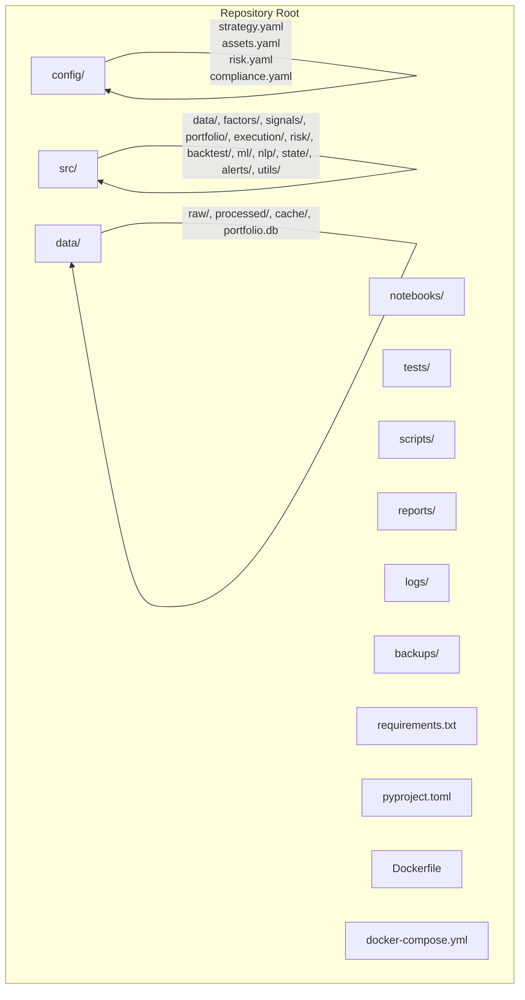
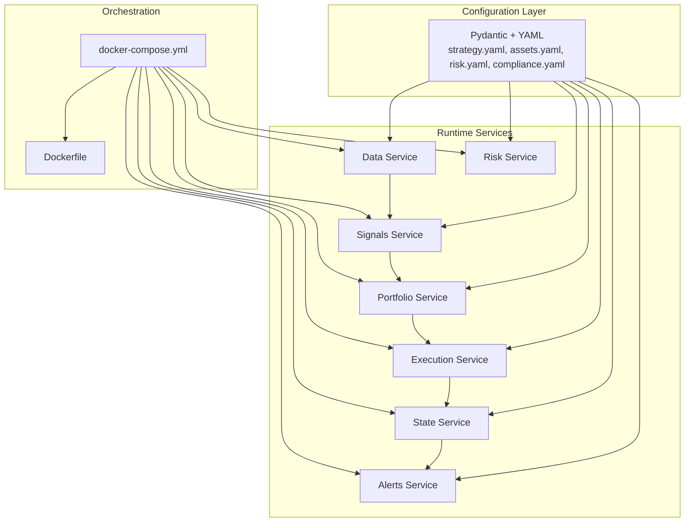
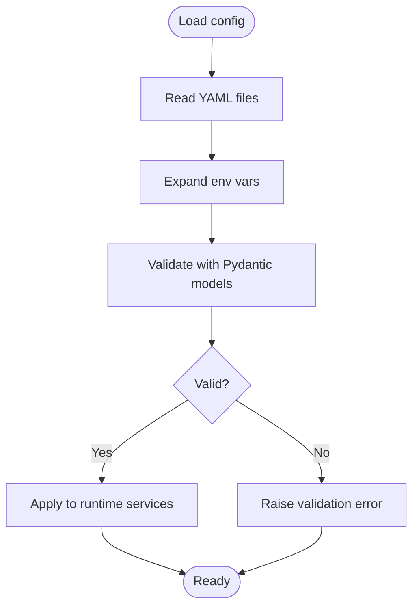
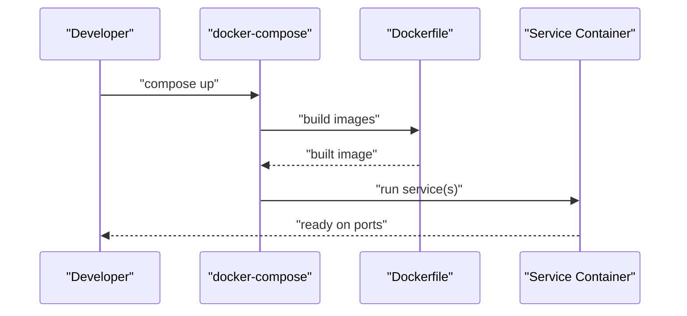
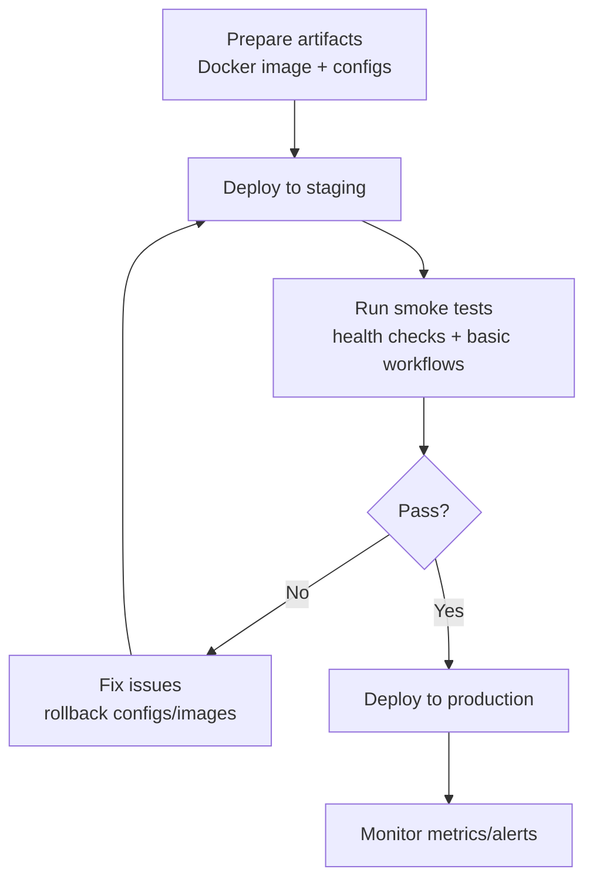
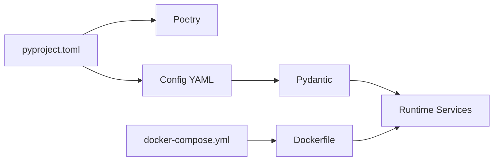

# Configuration and Deployment

<cite>
**Referenced Files in This Document**
- [PRD_Intelligent_Trading_System_v2.md](file://PRD_Intelligent_Trading_System_v2.md)
- [Tech_Design_Document.md](file://Tech_Design_Document.md)
- [pyproject.toml](file://pyproject.toml)
- [strategy.yaml](file://config/strategy.yaml)
- [main.py](file://main.py)
- [.env.example](file://.env.example)
- [domain.py](file://src/models/domain.py)
- [PHASE1_COMPLETE.md](file://PHASE1_COMPLETE.md)
- [run_backtest.sh](file://run_backtest.sh)
</cite>

## Update Summary
**Changes Made**
- Updated strategy configuration documentation to reflect complete implementation of core assets (GLD, SPY, QQQ, BTC-USD) with detailed risk parameters
- Added comprehensive coverage of extended asset universe configuration for Phase 2 expansion
- Enhanced risk management configuration documentation including 4-level hierarchical controls
- Updated portfolio constraints and factor configuration details
- Expanded alert channel settings documentation
- Added practical examples for configuration management and deployment procedures

## Table of Contents
1. [Introduction](#introduction)
2. [Project Structure](#project-structure)
3. [Core Components](#core-components)
4. [Architecture Overview](#architecture-overview)
5. [Detailed Component Analysis](#detailed-component-analysis)
6. [Dependency Analysis](#dependency-analysis)
7. [Performance Considerations](#performance-considerations)
8. [Troubleshooting Guide](#troubleshooting-guide)
9. [Conclusion](#conclusion)
10. [Appendices](#appendices)

## Introduction
This document explains configuration management and containerized deployment strategies for the Intelligent Trading Decision System. It focuses on:
- Pydantic-based configuration validation and environment-specific settings
- Multi-environment configuration (development, staging, production)
- Containerization with Docker and multi-service orchestration via docker-compose
- Deployment automation, scaling, and maintenance procedures
- Operational workflows linking development and production operations
- Practical examples for local development, staging deployment, and production rollout
- Guidance on avoiding configuration drift, handling deployment failures, and performing rollbacks

**Updated** Complete implementation of strategy configuration management now includes comprehensive core assets (GLD, SPY, QQQ, BTC-USD), risk parameters, portfolio constraints, factor lookback periods, and alert channel settings supporting expandable asset universes for Phase 2.

## Project Structure
The repository defines a modular project layout with dedicated directories for configuration, source code, notebooks, tests, scripts, reports, logs, backups, and packaging. The PRD and Tech Design documents describe the intended structure and deployment approach.

**Diagram sources**
- [PRD_Intelligent_Trading_System_v2.md](file://PRD_Intelligent_Trading_System_v2.md#L1009-L1112)

**Section sources**
- [PRD_Intelligent_Trading_System_v2.md](file://PRD_Intelligent_Trading_System_v2.md#L1009-L1112)

## Core Components
- Configuration management leverages Pydantic and YAML for type-safe, human-readable configuration. The PRD documents a comprehensive configuration schema including strategy parameters, asset definitions, risk rules, compliance settings, and alert channels.
- Packaging and dependency management use Poetry (via pyproject.toml), ensuring reproducible environments across development and CI/CD.
- Containerization is defined with Docker and docker-compose for local development and production orchestration.

Key configuration areas:
- Strategy parameters (rebalancing, thresholds)
- Asset universe and constraints (weights, lookbacks, stops)
- Risk controls (levels, correlation thresholds, re-entry logic)
- Compliance (PDT, wash sale tracking)
- Data sources and caching
- Alert channels and credentials via environment variables

**Updated** Strategy configuration now includes complete core assets (GLD, SPY, QQQ, BTC-USD) with detailed risk parameters, portfolio constraints, factor lookback periods, and alert channel settings supporting expandable asset universes for Phase 2 expansion.

**Section sources**
- [PRD_Intelligent_Trading_System_v2.md](file://PRD_Intelligent_Trading_System_v2.md#L121-L1323)
- [Tech_Design_Document.md](file://Tech_Design_Document.md#L121-L149)
- [pyproject.toml](file://pyproject.toml)
- [strategy.yaml](file://config/strategy.yaml)

## Architecture Overview
The system follows a layered architecture with clear separation of concerns. Configuration drives behavior across modules, while Docker and docker-compose enable consistent deployment across environments.

**Diagram sources**
- [Tech_Design_Document.md](file://Tech_Design_Document.md#L34-L86)
- [PRD_Intelligent_Trading_System_v2.md](file://PRD_Intelligent_Trading_System_v2.md#L1009-L1112)

## Detailed Component Analysis

### Configuration Management with Pydantic and YAML
- Schema-driven configuration ensures type safety and reduces runtime errors.
- Environment-specific overrides are supported via environment variable substitution in configuration files.
- Configuration is split into focused domains (strategy, assets, risk, compliance) for maintainability.

**Diagram sources**
- [PRD_Intelligent_Trading_System_v2.md](file://PRD_Intelligent_Trading_System_v2.md#L121-L1323)

**Section sources**
- [PRD_Intelligent_Trading_System_v2.md](file://PRD_Intelligent_Trading_System_v2.md#L121-L1323)

### Environment-Specific Settings
- Development: Local execution with Poetry-managed virtual environments, optional Jupyter exploration, and minimal external dependencies.
- Staging: Containerized services with docker-compose, shared volumes for logs/backups/reports, and environment variables for secrets.
- Production: Multi-stage Docker builds, restricted runtime privileges, persistent storage for state and backups, and strict environment variable injection for API keys and alert credentials.

Operational guidance:
- Keep secrets out of code; inject via environment variables.
- Use separate configuration overlays for each environment.
- Validate configuration before deploying to avoid drift.

**Section sources**
- [Tech_Design_Document.md](file://Tech_Design_Document.md#L1171-L1230)
- [PRD_Intelligent_Trading_System_v2.md](file://PRD_Intelligent_Trading_System_v2.md#L889-L1005)

### Containerization with Docker and docker-compose
- Dockerfile defines a reproducible image for the system.
- docker-compose orchestrates multi-service deployments across environments.
- Services include data ingestion, factor computation, signal generation, portfolio optimization, execution, risk management, state persistence, and alerting.

**Diagram sources**
- [PRD_Intelligent_Trading_System_v2.md](file://PRD_Intelligent_Trading_System_v2.md#L1110-L1112)
- [Tech_Design_Document.md](file://Tech_Design_Document.md#L1171-L1230)

**Section sources**
- [PRD_Intelligent_Trading_System_v2.md](file://PRD_Intelligent_Trading_System_v2.md#L1110-L1112)
- [Tech_Design_Document.md](file://Tech_Design_Document.md#L1171-L1230)

### Deployment Automation and Rollout Procedures
- Local development: Use Poetry to manage dependencies and run scripts for data download, signal generation, backtests, and paper trading.
- Staging: Run docker-compose with environment-specific overrides; validate configuration and health checks.
- Production: Perform blue/green or rolling updates; retain previous image/tag for quick rollback; automate backups of state and logs.

**Diagram sources**
- [Tech_Design_Document.md](file://Tech_Design_Document.md#L1171-L1230)
- [PRD_Intelligent_Trading_System_v2.md](file://PRD_Intelligent_Trading_System_v2.md#L889-L1005)

**Section sources**
- [Tech_Design_Document.md](file://Tech_Design_Document.md#L1171-L1230)
- [PRD_Intelligent_Trading_System_v2.md](file://PRD_Intelligent_Trading_System_v2.md#L889-L1005)

### Strategy Configuration Details

**Updated** Complete strategy configuration implementation now includes comprehensive parameter sets:

#### Core Assets Configuration
The system supports four core assets with detailed risk parameters:

| Asset | Max Weight | Momentum Lookback | Vol Target | Asset Stop Loss |
|-------|------------|-------------------|------------|-----------------|
| GLD | 50% | 90 days | 12% | 12% |
| SPY | 40% | 60 days | 15% | 12% |
| QQQ | 30% | 60 days | 18% | 12% |
| BTC-USD | 15% | 30 days | 25% | 18% |

#### Extended Asset Universe (Phase 2)
Support for 15+ assets including:
- **Precious Metals**: SLV (Silver ETF)
- **Sector ETFs**: XLK (Technology), XLF (Financials), XLE (Energy), XLV (Healthcare)
- **Bond ETFs**: TLT (20-Year Treasury), TIP (Inflation-Protected Bonds)
- **International**: EFA (Developed Markets), EEM (Emerging Markets)
- **Commodities**: DBC (Commodities), VNQ (REITs)

#### Risk Management Framework
Four-level hierarchical risk control:
- **Level 1** (5% drawdown): Alert, increase confidence threshold, block BTC new positions
- **Level 2** (8% drawdown): Reduce positions 25%, close BTC, sell-only mode
- **Level 3** (12% drawdown): Reduce positions 50%, safe-haven only, manual review
- **Level 4** (15% drawdown): Emergency liquidation, require manual confirmation

#### Portfolio Constraints
- Target volatility: 15%
- Max leverage: 1.5x
- Minimum trade amount: $100
- Min rebalance threshold: 2%
- Cash buffer: 5%
- Max daily trades: 5
- Max daily turnover: 30%

#### Factor Configuration
- **Momentum**: 60-day and 120-day periods
- **Volatility**: 20-day and 60-day periods (annualized)
- **SMA**: 20-day, 50-day, and 200-day periods
- **RSI**: 14-day period
- **ATR**: 14-day period

#### Alert Channel Configuration
Multi-channel alerting system supporting:
- Slack webhooks
- Email via SMTP
- Telegram bots
- Discord webhooks

**Section sources**
- [strategy.yaml](file://config/strategy.yaml)
- [PRD_Intelligent_Trading_System_v2.md](file://PRD_Intelligent_Trading_System_v2.md#L55-L76)
- [PHASE1_COMPLETE.md](file://PHASE1_COMPLETE.md#L261-L279)

### Scaling Requirements
- Horizontal scaling: Stateless services (signals, backtesting) can scale independently; ensure shared caches/backends are resilient.
- Vertical scaling: CPU-bound tasks (feature engineering, backtesting) benefit from increased cores; GPU resources may be required for NLP inference in later phases.
- Storage: Persist state and logs; configure retention policies for backups and logs.
- Network: Ensure low-latency access to data providers and brokers; consider caching strategies.

**Section sources**
- [Tech_Design_Document.md](file://Tech_Design_Document.md#L141-L150)

### Maintenance Procedures
- Regular model retraining and lifecycle management for ML components.
- Periodic review of configuration drift; enforce configuration-as-code with version control.
- Automated database backups and log rotation.
- Compliance and audit trails for regulatory reporting.

**Section sources**
- [Tech_Design_Document.md](file://Tech_Design_Document.md#L526-L573)
- [PRD_Intelligent_Trading_System_v2.md](file://PRD_Intelligent_Trading_System_v2.md#L1225-L1323)

## Dependency Analysis
- Packaging: Poetry manages dependencies and virtual environments.
- Configuration: Pydantic validates YAML configurations at runtime.
- Orchestration: Docker and docker-compose coordinate multi-service deployments.

**Diagram sources**
- [pyproject.toml](file://pyproject.toml)
- [PRD_Intelligent_Trading_System_v2.md](file://PRD_Intelligent_Trading_System_v2.md#L1110-L1112)
- [Tech_Design_Document.md](file://Tech_Design_Document.md#L121-L149)

**Section sources**
- [pyproject.toml](file://pyproject.toml)
- [Tech_Design_Document.md](file://Tech_Design_Document.md#L121-L149)
- [PRD_Intelligent_Trading_System_v2.md](file://PRD_Intelligent_Trading_System_v2.md#L1110-L1112)

## Performance Considerations
- Favor lightweight base images and multi-stage builds to reduce attack surface and improve startup times.
- Use environment-specific resource limits (CPU/memory) in docker-compose to prevent noisy-neighbor effects.
- Cache frequently accessed data and model artifacts to minimize cold-start latency.
- Monitor service health and set up auto-recovery for transient failures.

## Troubleshooting Guide
Common issues and resolutions:
- Configuration drift: Enforce configuration validation and keep all config under version control; use environment-specific overlays.
- Deployment failures: Validate compose files locally; pin image digests; use rollback to previous tag.
- Secrets exposure: Never commit secrets; use environment variables and secret managers.
- Data freshness: Verify cache invalidation and retry logic for data providers.
- Model degradation: Monitor concept drift and trigger retraining proactively.

**Section sources**
- [Tech_Design_Document.md](file://Tech_Design_Document.md#L1171-L1230)
- [PRD_Intelligent_Trading_System_v2.md](file://PRD_Intelligent_Trading_System_v2.md#L1225-L1323)

## Conclusion
The system's configuration and deployment strategy emphasizes type-safe configuration, environment isolation, and reproducible containerized deployments. By leveraging Pydantic, YAML, Docker, and docker-compose, teams can maintain consistency across development, staging, and production while enforcing robust operational practices such as validation, backups, and rollback procedures.

**Updated** The complete implementation of strategy configuration management now provides comprehensive support for core assets, risk controls, portfolio constraints, and expandable asset universes, enabling seamless transition to Phase 2 with its 15+ asset universe capabilities.

## Appendices

### Practical Examples

- **Local development setup**
  - Install dependencies via Poetry.
  - Configure environment variables from `.env.example`.
  - Run scripts for data download, signal generation, and backtests.
  - Use environment variables for API keys and alert credentials.

- **Staging deployment**
  - Build images with docker-compose.
  - Override configuration via environment variables and mounted volumes for logs/backups/reports.
  - Validate health checks and basic workflows.

- **Production rollout**
  - Use multi-stage Docker builds.
  - Deploy with rolling updates; retain previous image for rollback.
  - Automate backups of state and logs; monitor metrics and alerts.

- **Strategy configuration examples**
  - Core assets configuration with risk parameters for GLD, SPY, QQQ, BTC-USD
  - Extended asset universe setup for Phase 2 expansion
  - Risk management framework with 4-level hierarchical controls
  - Portfolio constraints and factor configuration
  - Multi-channel alert system configuration

**Section sources**
- [Tech_Design_Document.md](file://Tech_Design_Document.md#L1171-L1230)
- [PRD_Intelligent_Trading_System_v2.md](file://PRD_Intelligent_Trading_System_v2.md#L889-L1005)
- [.env.example](file://.env.example)
- [strategy.yaml](file://config/strategy.yaml)
- [run_backtest.sh](file://run_backtest.sh)