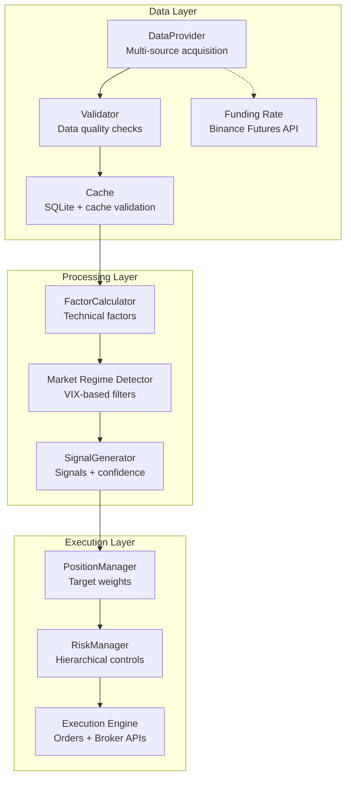
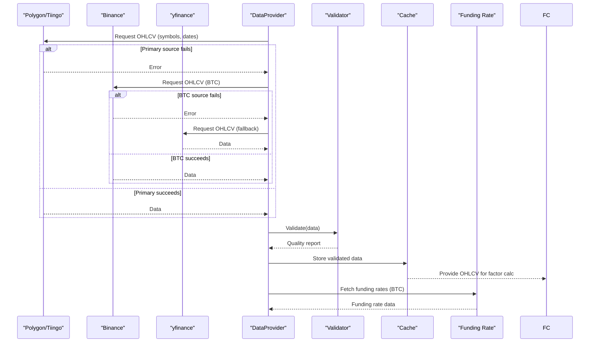
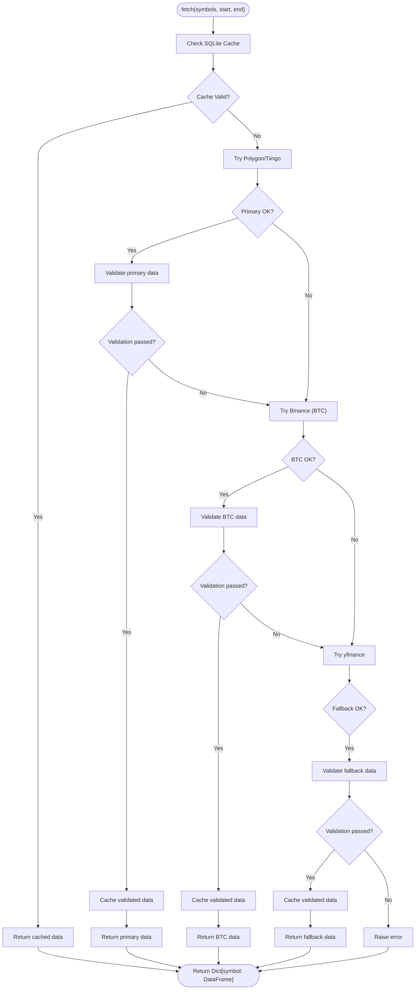
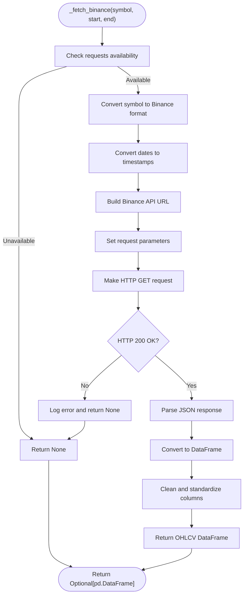
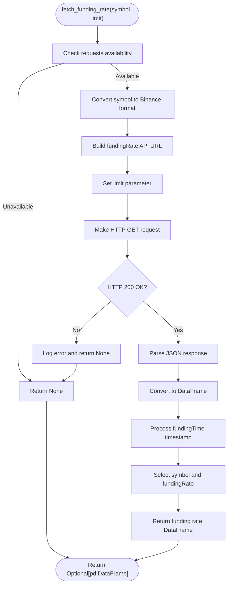
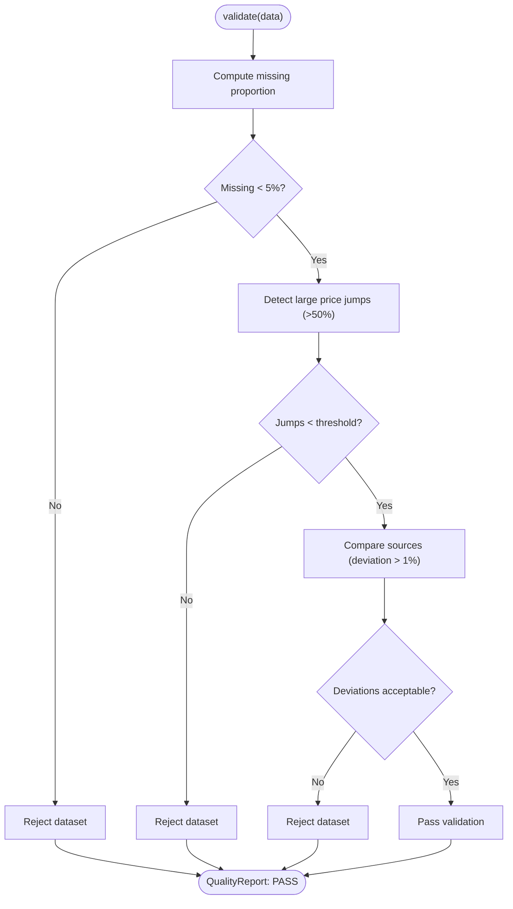
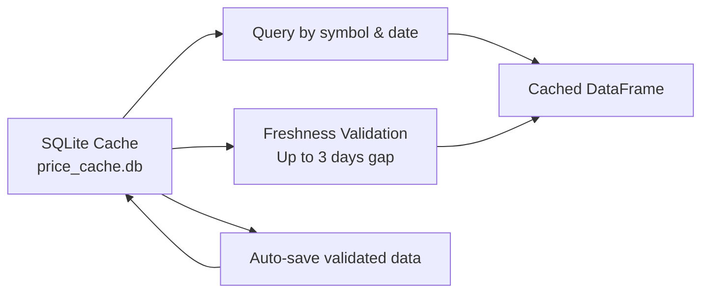
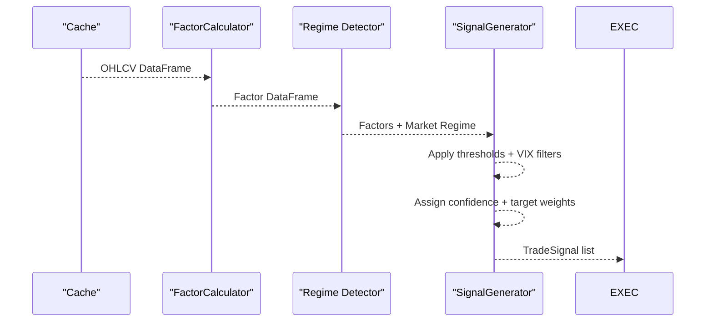
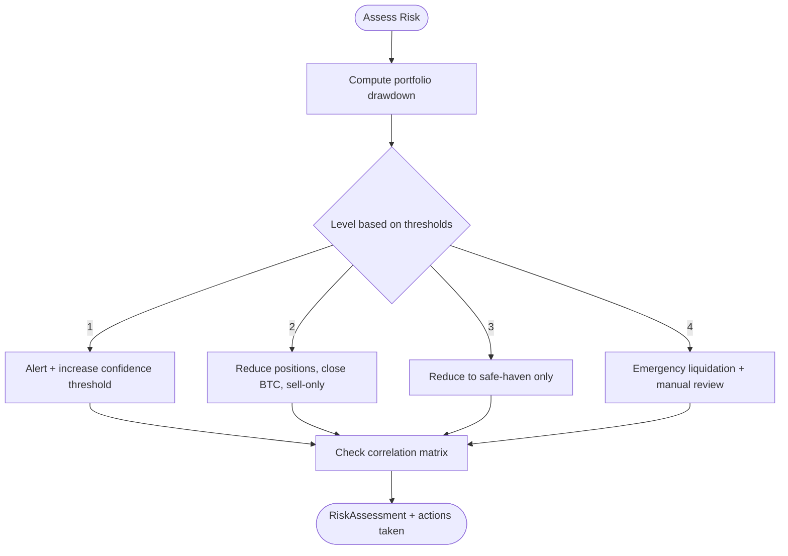
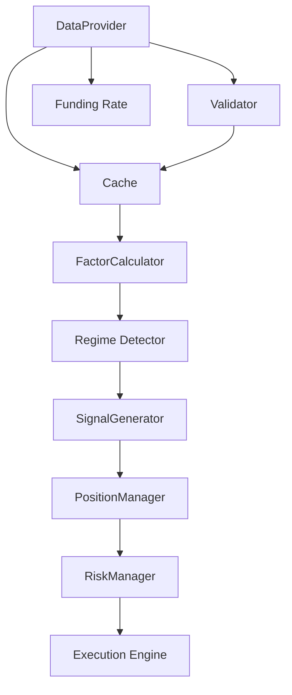

# Data Management

<cite>
**Referenced Files in This Document**
- [PRD_Intelligent_Trading_System_v2.md](file://PRD_Intelligent_Trading_System_v2.md)
- [Tech_Design_Document.md](file://Tech_Design_Document.md)
- [src/data/provider.py](file://src/data/provider.py)
- [main.py](file://main.py)
- [.env](file://.env)
- [.env.example](file://.env.example)
- [src/factors/calculator.py](file://src/factors/calculator.py)
- [src/signals/generator.py](file://src/signals/generator.py)
- [src/utils/logger.py](file://src/utils/logger.py)
- [pyproject.toml](file://pyproject.toml)
</cite>

## Update Summary
**Changes Made**
- Updated DataProvider implementation with complete multi-source integration
- Enhanced Binance public API integration with configurable base URLs via BINANCE_FAPI_BASE environment variable
- Migrated from python-binance client to direct HTTP requests using requests library for robust error handling
- Added funding rate fetching capability for Binance Futures
- Improved data validation and caching mechanisms
- Updated configuration options for API keys and cache paths
- Integrated with factor calculation and signal generation components

## Table of Contents
1. [Introduction](#introduction)
2. [Project Structure](#project-structure)
3. [Core Components](#core-components)
4. [Architecture Overview](#architecture-overview)
5. [Detailed Component Analysis](#detailed-component-analysis)
6. [Dependency Analysis](#dependency-analysis)
7. [Performance Considerations](#performance-considerations)
8. [Troubleshooting Guide](#troubleshooting-guide)
9. [Conclusion](#conclusion)
10. [Appendices](#appendices)

## Introduction
This document explains the multi-source data acquisition and management system designed for the intelligent trading platform. The system implements a complete tiered data strategy with Polygon/Tiingo as primary sources, Binance as the canonical source for Bitcoin, and yfinance as fallback. It features automatic fallback mechanisms, comprehensive data validation procedures, SQLite caching with 24-hour validity, and quality assurance processes. The system integrates tightly with factor calculation and signal generation components, providing robust data infrastructure for trading strategies.

**Updated** Enhanced with Binance public API integration supporting configurable endpoints and robust error handling for network requests.

## Project Structure
The system is organized into layered modules with clear separation of concerns. The data layer integrates multiple sources, validates quality, caches results, and exposes standardized interfaces consumed by factor calculation, risk management, and execution layers.

**Diagram sources**
- [Tech_Design_Document.md](file://Tech_Design_Document.md#L88-L117)
- [Tech_Design_Document.md](file://Tech_Design_Document.md#L209-L239)
- [Tech_Design_Document.md](file://Tech_Design_Document.md#L250-L295)
- [Tech_Design_Document.md](file://Tech_Design_Document.md#L317-L350)
- [Tech_Design_Document.md](file://Tech_Design_Document.md#L352-L404)
- [src/data/provider.py](file://src/data/provider.py#L390-L433)

**Section sources**
- [Tech_Design_Document.md](file://Tech_Design_Document.md#L34-L117)

## Core Components
- **DataProvider**: Multi-source acquisition with priority ordering and automatic fallback mechanisms.
- **Validator**: Comprehensive data quality checks including missing data thresholds, price jump detection, and cross-source deviation validation.
- **Cache**: SQLite-based caching with 24-hour validity and cache freshness validation.
- **Funding Rate**: Binance Futures funding rate fetching with configurable endpoints.
- **FactorCalculator**: Computes technical factors used by signal generation.
- **SignalGenerator**: Generates trade signals with market regime filtering.
- **RiskManager**: Enforces hierarchical risk controls and correlation monitoring.
- **Execution Engine**: Converts signals into orders routed to appropriate brokers.

**Updated** Added Funding Rate component for Binance Futures data collection.

**Section sources**
- [Tech_Design_Document.md](file://Tech_Design_Document.md#L209-L239)
- [Tech_Design_Document.md](file://Tech_Design_Document.md#L241-L248)
- [Tech_Design_Document.md](file://Tech_Design_Document.md#L250-L295)
- [Tech_Design_Document.md](file://Tech_Design_Document.md#L317-L350)
- [Tech_Design_Document.md](file://Tech_Design_Document.md#L352-L404)
- [src/data/provider.py](file://src/data/provider.py#L390-L433)

## Architecture Overview
The data acquisition pipeline follows a tiered strategy with comprehensive validation and caching:
- **Primary**: Polygon.io (US equities/ETFs) and Binance (Bitcoin).
- **Fallback**: yfinance for development/backtesting and to cover gaps.
- **Canonical BTC**: Binance ensures completeness and timeliness for Bitcoin.
- **Validation**: 50% price jumps, 5% missing data, 1% cross-source deviation thresholds.
- **Caching**: SQLite with 24-hour validity and cache freshness validation.
- **Funding Rates**: Binance Futures API for perpetual contract funding rates.

**Updated** Enhanced with Binance public API integration and funding rate capabilities.

**Diagram sources**
- [Tech_Design_Document.md](file://Tech_Design_Document.md#L213-L239)
- [PRD_Intelligent_Trading_System_v2.md](file://PRD_Intelligent_Trading_System_v2.md#L184-L201)
- [src/data/provider.py](file://src/data/provider.py#L390-L433)

## Detailed Component Analysis

### DataProvider: Complete Multi-source Implementation
The DataProvider implements a sophisticated multi-source acquisition system with automatic fallback and comprehensive validation:

- **Priority order**: Polygon/Tiingo → Binance → yfinance.
- **Automatic fallback**: Graceful degradation through source prioritization.
- **Data validation**: Post-fetch validation with configurable thresholds.
- **Cache integration**: SQLite caching with freshness validation.
- **Source status monitoring**: Health status reporting for all data sources.
- **Funding rate support**: Binance Futures funding rate fetching.

**Updated** Enhanced with Binance public API integration and funding rate capabilities.

**Diagram sources**
- [src/data/provider.py](file://src/data/provider.py#L103-L164)

**Section sources**
- [src/data/provider.py](file://src/data/provider.py#L35-L164)
- [PRD_Intelligent_Trading_System_v2.md](file://PRD_Intelligent_Trading_System_v2.md#L184-L201)

### Binance Public API Integration
The DataProvider now includes comprehensive Binance Futures API integration with configurable endpoints:

- **Public API Access**: No authentication required for market data endpoints.
- **Configurable Base URL**: BINANCE_FAPI_BASE environment variable allows custom endpoints.
- **Direct HTTP Requests**: Uses requests library for robust error handling and timeout control.
- **Symbol Mapping**: Automatic conversion between trading symbols (BTC-USD) and Binance format (BTCUSDT).
- **Date Handling**: Proper timestamp conversion for Binance API requirements.
- **Error Handling**: Comprehensive exception handling with detailed logging.

**New Section** Added to document the Binance integration capabilities.

**Diagram sources**
- [src/data/provider.py](file://src/data/provider.py#L200-L249)

**Section sources**
- [src/data/provider.py](file://src/data/provider.py#L69-L71)
- [src/data/provider.py](file://src/data/provider.py#L200-L249)
- [src/data/provider.py](file://src/data/provider.py#L40-L48)

### Funding Rate Fetching
The DataProvider includes specialized funding rate fetching capabilities for Binance Futures:

- **Endpoint**: `/fapi/v1/fundingRate` for historical funding rates.
- **Limit Control**: Configurable record limits (default 100, max 1000).
- **Symbol Conversion**: Handles both BTC-USD and direct Binance symbols.
- **Timestamp Processing**: Proper handling of fundingTime timestamps.
- **Data Standardization**: Returns symbol and fundingRate columns only.

**New Section** Added to document the funding rate capabilities.

**Diagram sources**
- [src/data/provider.py](file://src/data/provider.py#L390-L433)

**Section sources**
- [src/data/provider.py](file://src/data/provider.py#L390-L433)

### Data Validation Procedures
The system implements comprehensive data validation with precise thresholds:

- **Missing data threshold**: >5% missing data triggers validation failure.
- **Price jump detection**: Single-day change >50% triggers validation failure.
- **Cross-source deviation**: Multi-source price bias >1% triggers validation failure.
- **Additional checks**: Duplicate timestamps, inconsistent OHLC sequences, and extreme outliers.

**Diagram sources**
- [src/data/provider.py](file://src/data/provider.py#L276-L306)

**Section sources**
- [src/data/provider.py](file://src/data/provider.py#L43-L48)
- [src/data/provider.py](file://src/data/provider.py#L276-L306)
- [PRD_Intelligent_Trading_System_v2.md](file://PRD_Intelligent_Trading_System_v2.md#L197-L200)

### Caching Strategy
The system implements a robust SQLite caching mechanism with validation:

- **SQLite cache**: Persistent storage with automatic table creation.
- **Cache validation**: Freshness checking allowing up to 3 days gap for weekends/holidays.
- **Cache keys**: Symbol and date-based indexing for efficient querying.
- **Cache persistence**: Automatic saving of validated data to prevent redundant downloads.

**Diagram sources**
- [src/data/provider.py](file://src/data/provider.py#L73-L101)
- [src/data/provider.py](file://src/data/provider.py#L308-L366)

**Section sources**
- [src/data/provider.py](file://src/data/provider.py#L73-L101)
- [src/data/provider.py](file://src/data/provider.py#L308-L366)

### Factor Calculation and Signal Generation
The validated data flows seamlessly into the factor calculation and signal generation pipeline:

- **FactorCalculator**: Computes momentum, volatility, moving averages, RSI, ATR, and other technical factors.
- **Market Regime Detector**: Uses VIX thresholds to adjust signal confidence.
- **SignalGenerator**: Produces BUY/SELL/HOLD signals with confidence and target weights, incorporating regime filters.

**Diagram sources**
- [Tech_Design_Document.md](file://Tech_Design_Document.md#L268-L295)
- [Tech_Design_Document.md](file://Tech_Design_Document.md#L319-L350)

**Section sources**
- [Tech_Design_Document.md](file://Tech_Design_Document.md#L268-L295)
- [Tech_Design_Document.md](file://Tech_Design_Document.md#L319-L350)

### Risk Controls and Integrity Verification
Risk management enforces hierarchical controls based on portfolio state and correlation matrices:

- **Hierarchical risk controls**: Levels 1–4 based on portfolio drawdown and correlation monitoring.
- **Integrity verification**: Periodic reconciliation with broker state and recovery procedures after crashes.

**Diagram sources**
- [Tech_Design_Document.md](file://Tech_Design_Document.md#L355-L404)

**Section sources**
- [Tech_Design_Document.md](file://Tech_Design_Document.md#L355-L404)

## Dependency Analysis
The data layer depends on external providers and internal validators and cache. The factor calculator consumes validated data and feeds signals. Risk controls depend on portfolio state and correlation matrices. Execution depends on signals and risk assessments.

**Updated** Added Binance API dependencies and funding rate capabilities.

**Diagram sources**
- [Tech_Design_Document.md](file://Tech_Design_Document.md#L209-L239)
- [Tech_Design_Document.md](file://Tech_Design_Document.md#L250-L295)
- [Tech_Design_Document.md](file://Tech_Design_Document.md#L317-L350)
- [Tech_Design_Document.md](file://Tech_Design_Document.md#L352-L404)
- [src/data/provider.py](file://src/data/provider.py#L390-L433)

**Section sources**
- [Tech_Design_Document.md](file://Tech_Design_Document.md#L209-L239)
- [Tech_Design_Document.md](file://Tech_Design_Document.md#L250-L295)
- [Tech_Design_Document.md](file://Tech_Design_Document.md#L317-L350)
- [Tech_Design_Document.md](file://Tech_Design_Document.md#L352-L404)

## Performance Considerations
- **Multi-source fallback**: Reduces single-point-of-failure risk and improves availability.
- **Caching optimization**: SQLite cache with freshness validation minimizes repeated network calls.
- **Factor computation**: Vectorized libraries keep latency low during backtests.
- **Graceful degradation**: Optional imports prevent system failure if some data sources are unavailable.
- **Network optimization**: Direct HTTP requests with timeout control improve reliability.
- **Monitoring and alerting**: Enable quick remediation of degraded sources.

**Updated** Enhanced with Binance API performance considerations and network optimization.

## Troubleshooting Guide
Common issues and resolutions:
- **Data gaps**: Trigger fallback to yfinance; if persistent, alert and escalate to Level 1.
- **Source reliability**: Monitor source status; if unavailable, switch to alternate source and log outage.
- **Validation failures**: Investigate missing data proportions, price jumps, and cross-source deviations; reject invalid segments.
- **Cache misses**: Warm cache with recent symbols; ensure cache keys include normalization flags.
- **Execution delays**: Verify broker connectivity and order routing; confirm compliance checks (PDT, Wash Sale).
- **Binance API errors**: Check BINANCE_FAPI_BASE environment variable; verify network connectivity; review timeout settings.
- **Funding rate issues**: Ensure requests library is available; verify Binance API endpoint accessibility.

**Updated** Added Binance and funding rate troubleshooting guidance.

**Section sources**
- [PRD_Intelligent_Trading_System_v2.md](file://PRD_Intelligent_Trading_System_v2.md#L184-L201)
- [Tech_Design_Document.md](file://Tech_Design_Document.md#L817-L833)
- [src/data/provider.py](file://src/data/provider.py#L200-L249)
- [src/data/provider.py](file://src/data/provider.py#L390-L433)

## Conclusion
The data management system implements a robust, tiered acquisition strategy with automatic fallback, comprehensive validation, and SQLite caching with 24-hour validity. It integrates tightly with factor calculation and signal generation, while enforcing hierarchical risk controls and integrity verification. The system features precise validation thresholds (50% price jumps, 5% missing data, 1% cross-source deviation) and provides clear pathways for troubleshooting and performance optimization.

**Updated** Enhanced with Binance public API integration supporting configurable endpoints, robust error handling, and funding rate capabilities for comprehensive cryptocurrency data management.

## Appendices

### Configuration Options
- **Primary data source**: Polygon/Tiingo for US equities/ETFs.
- **BTC primary source**: Binance for canonical Bitcoin data with configurable endpoints.
- **Fallback**: yfinance for development/backtesting and gap coverage.
- **Cache backend**: SQLite with automatic table creation and 24-hour validity.
- **Retry policy**: Automatic fallback through source prioritization.
- **Alert channels**: Slack, Email, Telegram.
- **Binance API**: Configurable base URL via BINANCE_FAPI_BASE environment variable.

**Updated** Added Binance API configuration options.

**Section sources**
- [PRD_Intelligent_Trading_System_v2.md](file://PRD_Intelligent_Trading_System_v2.md#L1311-L1323)
- [Tech_Design_Document.md](file://Tech_Design_Document.md#L152-L159)
- [.env](file://.env#L1-L42)
- [.env.example](file://.env.example#L1-L75)
- [src/data/provider.py](file://src/data/provider.py#L69-L71)

### Data Flow Example: From Acquisition to Strategy Consumption
- **DataProvider** fetches OHLCV from Polygon/Tiingo; if unavailable, falls back to Binance for BTC or yfinance otherwise.
- **Binance Integration** uses configurable endpoints with direct HTTP requests and robust error handling.
- **Validator** checks missing data, price jumps, and cross-source deviation; rejects invalid segments.
- **Cache** persists validated data with 24-hour validity; validates cache freshness.
- **FactorCalculator** computes technical factors from validated data.
- **Regime Detector** adjusts signals based on VIX thresholds.
- **SignalGenerator** produces signals with confidence and target weights.
- **PositionManager** calculates target weights; **RiskManager** enforces controls; **Execution Engine** places orders.

**Updated** Enhanced with Binance API integration and funding rate capabilities.

**Section sources**
- [src/data/provider.py](file://src/data/provider.py#L103-L164)
- [src/data/provider.py](file://src/data/provider.py#L200-L249)
- [src/data/provider.py](file://src/data/provider.py#L276-L306)
- [src/data/provider.py](file://src/data/provider.py#L73-L101)
- [Tech_Design_Document.md](file://Tech_Design_Document.md#L213-L239)
- [Tech_Design_Document.md](file://Tech_Design_Document.md#L268-L295)
- [Tech_Design_Document.md](file://Tech_Design_Document.md#L319-L350)
- [Tech_Design_Document.md](file://Tech_Design_Document.md#L352-L404)

### Binance API Dependencies
The system requires the following dependencies for Binance API integration:
- **requests**: HTTP library for making API calls
- **python-dotenv**: Environment variable management
- **pandas**: Data processing and manipulation

**New Section** Added to document Binance API dependencies.

**Section sources**
- [pyproject.toml](file://pyproject.toml#L30-L33)
- [src/data/provider.py](file://src/data/provider.py#L28-L32)