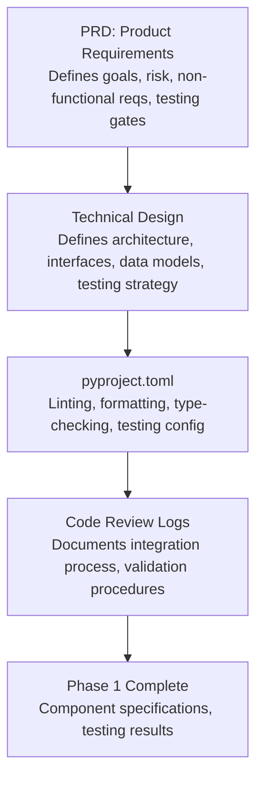
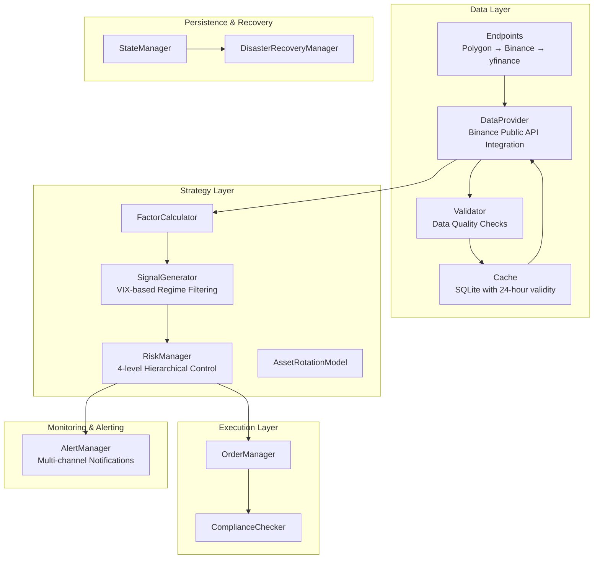
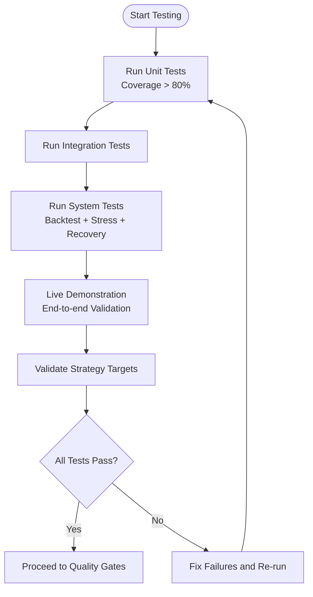
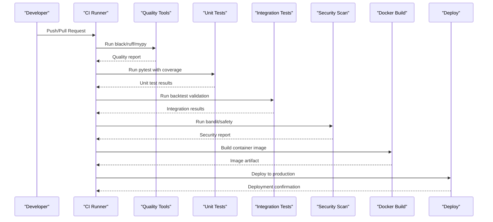
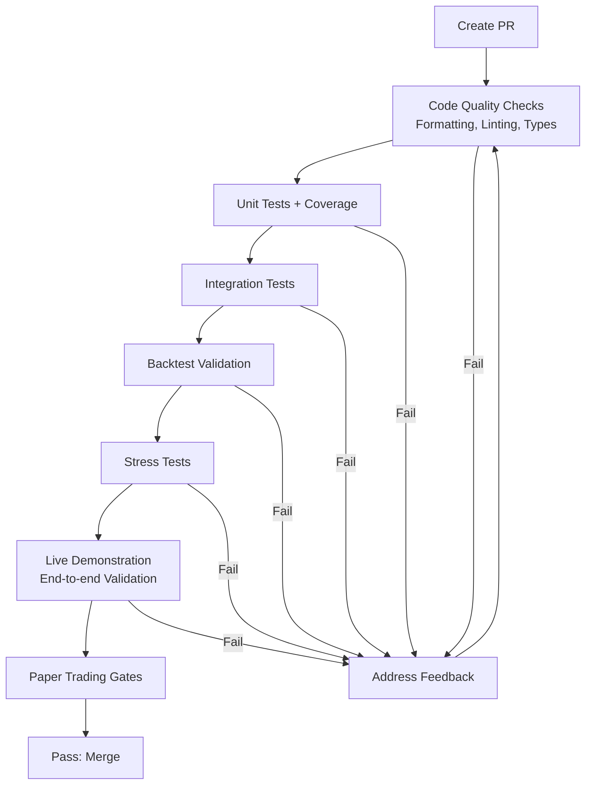
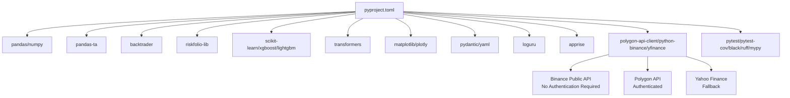

# Development Guidelines

<cite>
**Referenced Files in This Document**
- [PRD_Intelligent_Trading_System_v2.md](file://PRD_Intelligent_Trading_System_v2.md)
- [Tech_Design_Document.md](file://Tech_Design_Document.md)
- [code_review_log.md](file://code_review_log.md)
- [PHASE1_COMPLETE.md](file://PHASE1_COMPLETE.md)
- [pyproject.toml](file://pyproject.toml)
- [demo_phase1.py](file://demo_phase1.py)
- [demo_phase2.py](file://demo_phase2.py)
</cite>

## Update Summary
**Changes Made**
- Added comprehensive documentation for Binance public API integration process
- Updated code review processes to include detailed review logs and validation procedures
- Enhanced testing methodologies with live demonstration validation
- Expanded infrastructure documentation with new requirements and best practices
- Updated dependency management and environment configuration standards

## Table of Contents
1. [Introduction](#introduction)
2. [Project Structure](#project-structure)
3. [Core Components](#core-components)
4. [Architecture Overview](#architecture-overview)
5. [Detailed Component Analysis](#detailed-component-analysis)
6. [Dependency Analysis](#dependency-analysis)
7. [Performance Considerations](#performance-considerations)
8. [Troubleshooting Guide](#troubleshooting-guide)
9. [Conclusion](#conclusion)
10. [Appendices](#appendices)

## Introduction
This document defines development standards, testing strategies, and operational procedures for contributors working on the Intelligent Trading Decision System. It consolidates coding standards, testing methodologies, documentation requirements, and quality gates from the Product Requirements Document (PRD) and Technical Design Document, and aligns them with the project's configuration and tooling. The document has been updated to reflect the comprehensive code review processes and live demonstration validation procedures that ensure system reliability and production readiness.

## Project Structure
The repository provides:
- A product-level requirements document that defines goals, risk management, non-functional requirements, and testing gates.
- A technical design document that specifies architecture, interfaces, data models, testing strategy, and operational targets.
- A project configuration file that codifies linting, type checking, formatting, and testing tooling.
- Comprehensive code review logs documenting the integration process and validation procedures.
- Phase 1 completion documentation with detailed component specifications and testing results.

**Diagram sources**
- [PRD_Intelligent_Trading_System_v2.md](file://PRD_Intelligent_Trading_System_v2.md#L1-L1339)
- [Tech_Design_Document.md](file://Tech_Design_Document.md#L1-L1502)
- [pyproject.toml](file://pyproject.toml#L1-L66)
- [code_review_log.md](file://code_review_log.md#L1-L326)
- [PHASE1_COMPLETE.md](file://PHASE1_COMPLETE.md#L1-L396)

**Section sources**
- [PRD_Intelligent_Trading_System_v2.md](file://PRD_Intelligent_Trading_System_v2.md#L1-L1339)
- [Tech_Design_Document.md](file://Tech_Design_Document.md#L1-L1502)
- [pyproject.toml](file://pyproject.toml#L1-L66)
- [code_review_log.md](file://code_review_log.md#L1-L326)
- [PHASE1_COMPLETE.md](file://PHASE1_COMPLETE.md#L1-L396)

## Core Components
- Coding standards and formatting:
  - Black for formatting, Ruff for linting, MyPy for type checking.
  - Line length 88; Ruff selects common error categories with ignores aligned to project needs.
- Testing:
  - PyTest with coverage; coverage targets and reports are configured.
  - Test discovery patterns for files, classes, and functions are defined.
- Documentation:
  - PRD and TDD serve as authoritative sources for functional and technical requirements, risk controls, and testing gates.
  - Code review logs provide detailed integration documentation and validation procedures.
- Code Review Process:
  - Comprehensive review process with detailed objective documentation, issue tracking, and validation procedures.
  - Live demonstration validation ensures all components work together in production-like conditions.

Practical alignment with tooling:
- Formatting and linting are enforced via configuration keys under [tool.black], [tool.ruff], and [tool.mypy].
- Coverage reporting is enabled via [tool.pytest.ini_options] with coverage flags.
- Environment configuration uses .env.example for deployment templates.

**Section sources**
- [pyproject.toml](file://pyproject.toml#L45-L66)
- [Tech_Design_Document.md](file://Tech_Design_Document.md#L1219-L1230)
- [code_review_log.md](file://code_review_log.md#L233-L258)
- [PHASE1_COMPLETE.md](file://PHASE1_COMPLETE.md#L282-L307)

## Architecture Overview
The system follows a layered architecture with clear separation of concerns across data, strategy, execution, monitoring/alerting, and state persistence. The PRD and TDD define:
- Multi-source data ingestion with validation and caching, including Binance public API integration.
- Factor computation and signal generation with market regime filtering.
- Risk management with hierarchical controls and correlation monitoring.
- Execution layer with order management and compliance checks.
- State persistence and disaster recovery.
- Stress testing framework and paper trading gates.

**Diagram sources**
- [Tech_Design_Document.md](file://Tech_Design_Document.md#L38-L117)
- [Tech_Design_Document.md](file://Tech_Design_Document.md#L209-L888)
- [PRD_Intelligent_Trading_System_v2.md](file://PRD_Intelligent_Trading_System_v2.md#L184-L416)
- [code_review_log.md](file://code_review_log.md#L233-L258)

## Detailed Component Analysis

### Coding Standards and Formatting
- Formatting: Black enforces consistent style; line-length and target-version are configured.
- Linting: Ruff selects common error families and ignores specific checks to fit project preferences.
- Type checking: MyPy disallows untyped definitions and sets Python version for compatibility.

Guidelines for contributors:
- Run formatting and linting locally before submitting changes.
- Resolve MyPy errors; avoid disabling type checks without justification.
- Keep diffs minimal and focused on a single concern.
- Follow the established code review process with detailed documentation.

**Section sources**
- [pyproject.toml](file://pyproject.toml#L45-L59)
- [code_review_log.md](file://code_review_log.md#L46-L131)

### Testing Methodologies and Coverage
Testing categories and targets:
- Unit tests: 70% coverage, focusing on individual modules, mathematical computations, and data transformations.
- Integration tests: 20% coverage, validating module interactions, data pipeline flows, and strategy composition.
- System tests: 10% coverage, covering end-to-end backtesting, stress scenarios, and recovery procedures.
- Live demonstration validation: Comprehensive testing of all Phase 1 components with real market data.

Coverage and reporting:
- PyTest configured to collect coverage from src and produce HTML and terminal-missing reports.

Backtesting validation pattern:
- Strategies must meet minimum performance targets over extended histories and pass stress tests across predefined scenarios.
- Live demonstration validates end-to-end system functionality with real-time data feeds.

**Diagram sources**
- [Tech_Design_Document.md](file://Tech_Design_Document.md#L1273-L1311)
- [pyproject.toml](file://pyproject.toml#L60-L66)
- [code_review_log.md](file://code_review_log.md#L262-L304)

**Section sources**
- [Tech_Design_Document.md](file://Tech_Design_Document.md#L1273-L1311)
- [pyproject.toml](file://pyproject.toml#L60-L66)
- [code_review_log.md](file://code_review_log.md#L262-L304)

### Continuous Integration Workflows
CI pipeline outline:
- Code quality: black, ruff, mypy.
- Unit tests: pytest with coverage > 80%.
- Integration tests: backtest validation.
- Security scan: bandit, safety.
- Docker build: multi-stage build.
- Deployment: SSH to production server.

**Diagram sources**
- [Tech_Design_Document.md](file://Tech_Design_Document.md#L1219-L1230)

**Section sources**
- [Tech_Design_Document.md](file://Tech_Design_Document.md#L1219-L1230)

### Code Review Processes and Quality Gates
Review expectations:
- Pull requests must satisfy quality gates before merging.
- Quality gates include passing unit and integration tests, meeting coverage thresholds, and validating backtest and stress test outcomes.
- Comprehensive code review process with detailed documentation of integration steps and validation procedures.

Paper trading gates:
- Pre-paper trading: backtest validation, stress tests, data quality checks, and state persistence verification.
- Paper trading: minimum duration and performance thresholds per phase.
- Live trading progression: small capital gate followed by staged ramp-up with risk control verification.

**Updated** Enhanced with comprehensive code review logs documenting Binance API integration and live demonstration validation.

**Diagram sources**
- [Tech_Design_Document.md](file://Tech_Design_Document.md#L1115-L1166)
- [Tech_Design_Document.md](file://Tech_Design_Document.md#L1273-L1311)
- [code_review_log.md](file://code_review_log.md#L262-L304)

**Section sources**
- [Tech_Design_Document.md](file://Tech_Design_Document.md#L1115-L1166)
- [Tech_Design_Document.md](file://Tech_Design_Document.md#L1273-L1311)
- [code_review_log.md](file://code_review_log.md#L1-L326)

### Feature Development and Bug Fixes
Guidelines:
- Develop features in feature branches; keep commits small and focused.
- Add or update unit tests alongside feature implementation.
- Validate integration with related modules and ensure no regressions.
- Document rationale and assumptions in the PR description and link to relevant sections in PRD/TDD.
- Follow the established code review process with detailed documentation.

Bug fix process:
- Reproduce the issue with a failing test.
- Fix the root cause and verify with regression tests.
- Update documentation or tests if the fix affects behavior or assumptions.
- Document fixes in code review logs with detailed explanations.

**Section sources**
- [Tech_Design_Document.md](file://Tech_Design_Document.md#L1273-L1311)
- [code_review_log.md](file://code_review_log.md#L271-L304)

### Performance Optimization
Targets and considerations:
- Strategy performance targets (returns, volatility, Sharpe, drawdown, ratios).
- System performance targets (latency, backtest speed, memory usage, recovery time, data refresh).
- Scalability considerations for future horizontal scaling and microservices decomposition.

Optimization practices:
- Prefer vectorized operations and efficient libraries (pandas, numpy).
- Minimize redundant computations; cache intermediate results where safe.
- Profile critical paths and address bottlenecks identified by benchmarks.
- Optimize data source fallback chains for minimal latency.

**Section sources**
- [Tech_Design_Document.md](file://Tech_Design_Document.md#L1075-L1112)

### Governance and Release Management
Governance touchpoints:
- Risk management hierarchy and re-entry logic are part of the core governance controls.
- Regulatory compliance and tax reporting are integrated into the system design.
- Paper trading gates and live trading progression stages act as governance checkpoints.

Release-related artifacts:
- Docker images built via multi-stage builds.
- Deployment orchestrated via CI to production servers.
- Comprehensive code review logs serve as audit trail for all changes.

**Updated** Enhanced with detailed documentation of Binance API integration and live demonstration validation as part of the release process.

**Section sources**
- [Tech_Design_Document.md](file://Tech_Design_Document.md#L1049-L1072)
- [Tech_Design_Document.md](file://Tech_Design_Document.md#L1115-L1166)
- [Tech_Design_Document.md](file://Tech_Design_Document.md#L1170-L1230)
- [code_review_log.md](file://code_review_log.md#L233-L304)

## Dependency Analysis
Tooling and library dependencies are declared in the project configuration and align with the technical stack described in the TDD:
- Data processing and analysis: pandas, numpy, pandas-ta.
- Backtesting and optimization: backtrader, riskfolio-lib.
- Machine learning: scikit-learn, xgboost, lightgbm, transformers.
- Visualization and configuration: matplotlib, plotly, pydantic, pyyaml.
- Logging, alerts, and APIs: loguru, apprise, polygon-api-client, python-binance, yfinance.
- Testing and developer tooling: pytest, pytest-cov, black, ruff, mypy.

**Updated** Enhanced with Binance public API integration and improved data source fallback mechanisms.

**Diagram sources**
- [pyproject.toml](file://pyproject.toml#L9-L34)
- [Tech_Design_Document.md](file://Tech_Design_Document.md#L121-L140)
- [code_review_log.md](file://code_review_log.md#L244-L256)

**Section sources**
- [pyproject.toml](file://pyproject.toml#L9-L34)
- [Tech_Design_Document.md](file://Tech_Design_Document.md#L121-L140)
- [code_review_log.md](file://code_review_log.md#L244-L256)

## Performance Considerations
- Maintain strategy performance targets and system performance targets as defined in the TDD.
- Use efficient data structures and vectorized operations to meet latency and throughput goals.
- Monitor resource usage and adjust configurations to stay within target bounds.
- Optimize data source fallback chains to minimize latency during market data retrieval.

## Troubleshooting Guide
Common areas to inspect:
- Data quality: multi-source validation and automated alerts.
- Risk controls: hierarchical levels, correlation monitoring, and re-entry logic.
- State persistence: database schema and recovery procedures.
- Stress testing: scenario definitions and pass criteria.
- Live demonstration validation: end-to-end system testing procedures.

Operational checks:
- Verify API health status and data freshness.
- Confirm alert channels are functioning and logs are being written.
- Validate database integrity and backup schedules.
- Review code review logs for documented issues and resolutions.

**Updated** Enhanced with live demonstration validation procedures and comprehensive troubleshooting for Binance API integration.

**Section sources**
- [Tech_Design_Document.md](file://Tech_Design_Document.md#L815-L833)
- [Tech_Design_Document.md](file://Tech_Design_Document.md#L835-L888)
- [Tech_Design_Document.md](file://Tech_Design_Document.md#L890-L930)
- [Tech_Design_Document.md](file://Tech_Design_Document.md#L999-L1045)
- [code_review_log.md](file://code_review_log.md#L291-L304)

## Conclusion
These guidelines consolidate the project's coding standards, testing strategies, and operational procedures. Contributors should align their work with PRD/TDD requirements, adhere to formatting and type-checking standards, maintain coverage targets, and satisfy quality gates before merging and deploying changes. The comprehensive code review process ensures that all changes are thoroughly documented and validated, particularly for critical integrations like Binance API implementation and live demonstration validation.

## Appendices

### Practical Examples and References
- Development setup and commands:
  - Formatting and linting: run black and ruff as configured.
  - Type checking: run mypy as configured.
  - Testing and coverage: run pytest with coverage as configured.
  - Live demonstration: run demo_phase1.py for end-to-end validation.
- Testing patterns:
  - Backtesting validation and stress testing are defined in the TDD.
  - Coverage thresholds and reporting are defined in the project configuration.
  - Live demonstration validation ensures all components work together.
- Contribution guidelines:
  - Keep PRs focused, add tests, and reference PRD/TDD sections in descriptions.
  - Document all changes in code review logs with detailed explanations.
  - Follow the established review process for major integrations like Binance API.

**Updated** Enhanced with live demonstration validation procedures and comprehensive code review documentation.

**Section sources**
- [pyproject.toml](file://pyproject.toml#L45-L66)
- [Tech_Design_Document.md](file://Tech_Design_Document.md#L1273-L1311)
- [code_review_log.md](file://code_review_log.md#L262-L304)
- [demo_phase1.py](file://demo_phase1.py#L1-L279)
- [demo_phase2.py](file://demo_phase2.py#L1-L86)