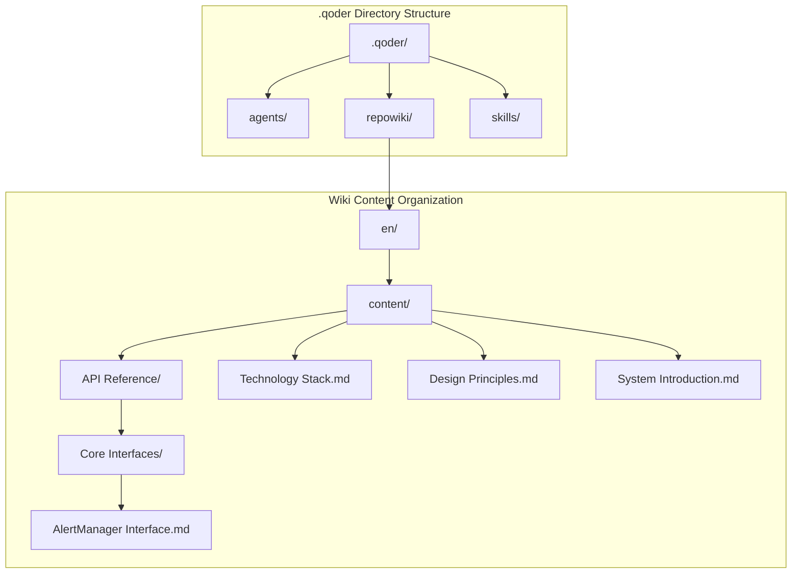
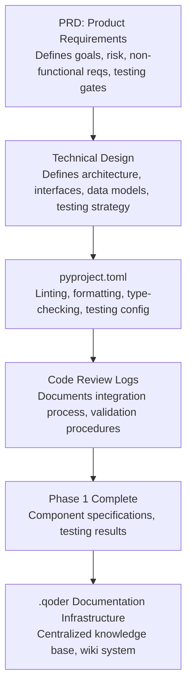
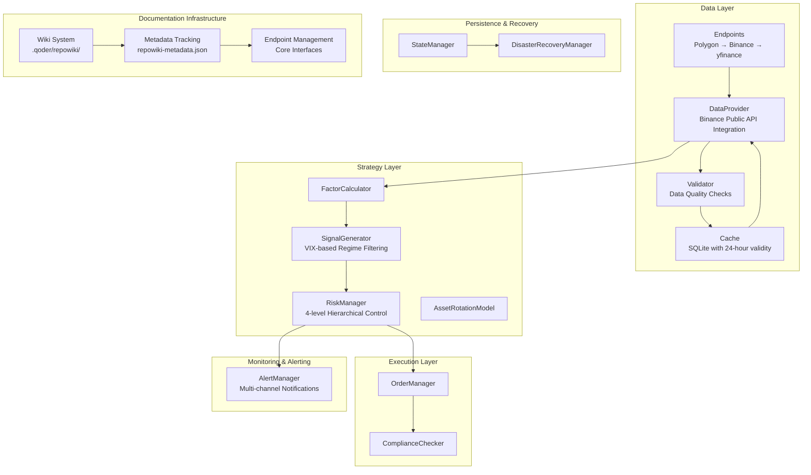
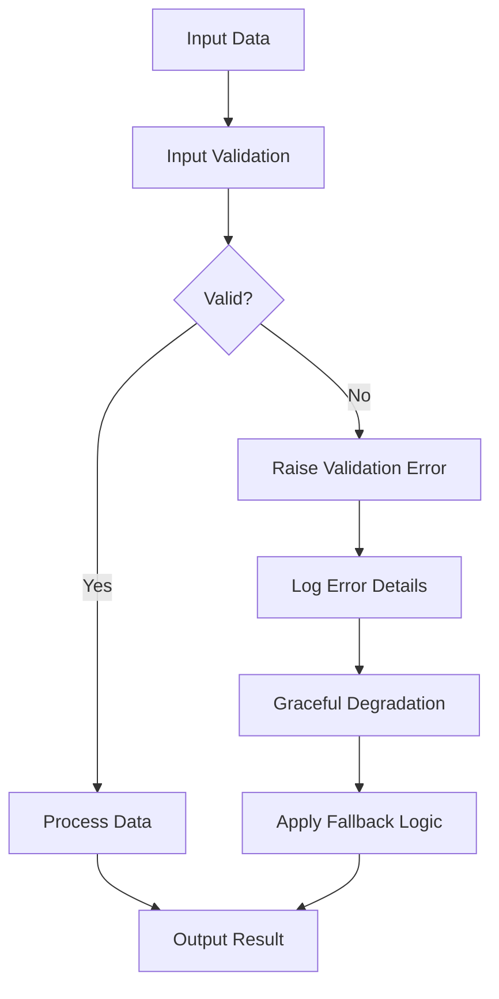
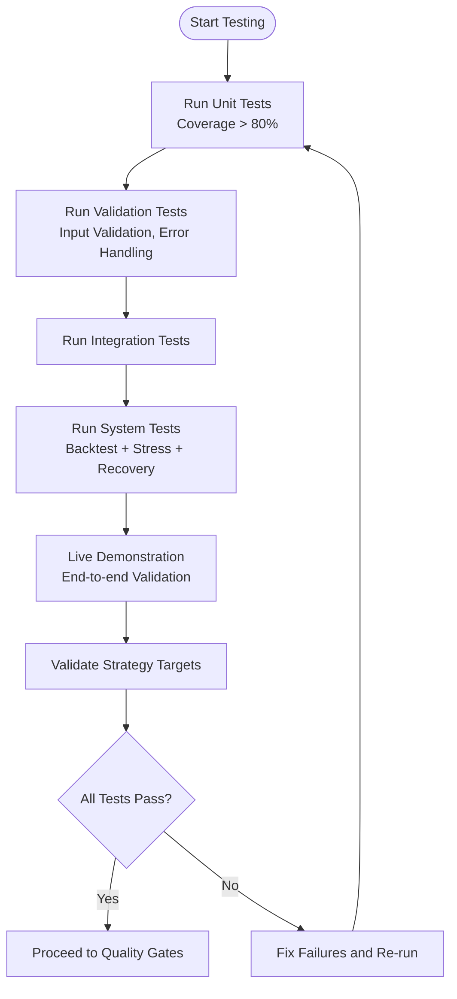
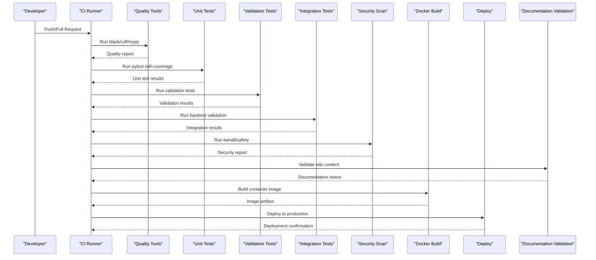
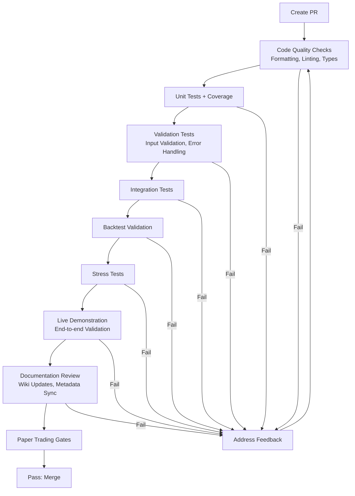
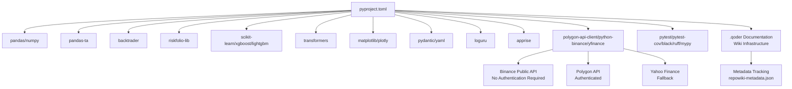

# Development Guidelines

<cite>
**Referenced Files in This Document**
- [PRD_Intelligent_Trading_System_v2.md](file://PRD_Intelligent_Trading_System_v2.md)
- [Tech_Design_Document.md](file://Tech_Design_Document.md)
- [code_review_log.md](file://code_review_log.md)
- [PHASE1_COMPLETE.md](file://PHASE1_COMPLETE.md)
- [pyproject.toml](file://pyproject.toml)
- [demo_phase1.py](file://demo_phase1.py)
- [demo_phase2.py](file://demo_phase2.py)
- [.qoder/repowiki/en/content/Development Guidelines.md](file://.qoder/repowiki/en/content/Development Guidelines.md)
- [.qoder/repowiki/en/content/Project Overview/System Introduction.md](file://.qoder/repowiki/en/content/Project Overview/System Introduction.md)
- [.qoder/repowiki/en/content/Project Overview/Design Principles.md](file://.qoder/repowiki/en/content/Project Overview/Design Principles.md)
- [.qoder/repowiki/en/content/Project Overview/Technology Stack.md](file://.qoder/repowiki/en/content/Project Overview/Technology Stack.md)
- [.qoder/repowiki/en/content/API Reference/Core Interfaces/AlertManager Interface.md](file://.qoder/repowiki/en/content/API Reference/Core Interfaces/AlertManager Interface.md)
- [.qoder/repowiki/en/meta/repowiki-metadata.json](file://.qoder/repowiki/en/meta/repowiki-metadata.json)
- [src/models/domain.py](file://src/models/domain.py)
- [src/data/provider.py](file://src/data/provider.py)
- [src/paper_trading/gates.py](file://src/paper_trading/gates.py)
- [src/nlp/integrator.py](file://src/nlp/integrator.py)
- [src/ml/features.py](file://src/ml/features.py)
- [src/paper_trading/models.py](file://src/paper_trading/models.py)
- [src/utils/logger.py](file://src/utils/logger.py)
</cite>

## Update Summary
**Changes Made**
- Enhanced defensive programming practices documentation with comprehensive input validation examples
- Updated error handling patterns to reflect improved exception handling and logging
- Added detailed type safety improvements across domain models and data validation
- Expanded code quality standards to include comprehensive validation patterns
- Updated testing methodologies to include validation and error handling coverage

## Table of Contents
1. [Introduction](#introduction)
2. [Documentation Infrastructure](#documentation-infrastructure)
3. [Project Structure](#project-structure)
4. [Core Components](#core-components)
5. [Architecture Overview](#architecture-overview)
6. [Detailed Component Analysis](#detailed-component-analysis)
7. [Dependency Analysis](#dependency-analysis)
8. [Performance Considerations](#performance-considerations)
9. [Troubleshooting Guide](#troubleshooting-guide)
10. [Conclusion](#conclusion)
11. [Appendices](#appendices)

## Introduction
This document defines development standards, testing strategies, and operational procedures for contributors working on the Intelligent Trading Decision System. It consolidates coding standards, testing methodologies, documentation requirements, and quality gates from the Product Requirements Document (PRD) and Technical Design Document, and aligns them with the project's configuration and tooling. The document has been updated to reflect the comprehensive code quality improvements including enhanced defensive programming practices, improved error handling patterns, input validation enhancements, and type safety improvements across the system.

**Updated** Enhanced with comprehensive defensive programming practices, improved error handling patterns, and enhanced input validation across all system components.

## Documentation Infrastructure
The project now maintains a comprehensive documentation infrastructure through the .qoder directory structure, providing centralized knowledge management and standardized documentation practices:

### Centralized Knowledge Base
- **.qoder/repowiki/**: Wiki-based documentation system with structured content organization
- **.qoder/agents/**: AI agent configurations and automation scripts
- **.qoder/skills/**: Specialized skill modules for documentation processing

### Documentation Organization
The wiki system organizes content into logical categories:
- **Core Interfaces**: API specifications and interface definitions
- **Data Models**: Technical data structures and schemas
- **Phase Documentation**: Implementation guides for each development phase
- **Project Overview**: System introduction and design principles
- **Technical Specifications**: Detailed technical documentation

### Metadata Management
- **repowiki-metadata.json**: Centralized metadata tracking for code snippets and documentation relationships
- **Version control integration**: Automatic tracking of documentation changes and relationships to source code

```mermaid
graph TB
subgraph ".qoder Directory Structure"
QODER[".qoder/"]
AGENTS["agents/"]
REPOWIKI["repowiki/"]
SKILLS["skills/"]
end
subgraph "Wiki Content Organization"
EN["en/"]
CONTENT["content/"]
APIREF["API Reference/"]
COREIF["Core Interfaces/"]
ALERTIF["AlertManager Interface.md"]
TECHDOC["Technology Stack.md"]
DESIGNPRINC["Design Principles.md"]
INTRO["System Introduction.md"]
end
QODER --> AGENTS
QODER --> REPOWIKI
QODER --> SKILLS
REPOWIKI --> EN
EN --> CONTENT
CONTENT --> APIREF
APIREF --> COREIF
COREIF --> ALERTIF
CONTENT --> TECHDOC
CONTENT --> DESIGNPRINC
CONTENT --> INTRO
```

**Diagram sources**
- [.qoder/repowiki/en/content/Development Guidelines.md:1-447](file://.qoder/repowiki/en/content/Development Guidelines.md#L1-L447)
- [.qoder/repowiki/en/meta/repowiki-metadata.json:1-1](file://.qoder/repowiki/en/meta/repowiki-metadata.json#L1-L1)

**Section sources**
- [.qoder/repowiki/en/content/Development Guidelines.md:1-447](file://.qoder/repowiki/en/content/Development Guidelines.md#L1-L447)
- [.qoder/repowiki/en/content/Project Overview/System Introduction.md:1-279](file://.qoder/repowiki/en/content/Project Overview/System Introduction.md#L1-L279)
- [.qoder/repowiki/en/content/Project Overview/Design Principles.md:1-397](file://.qoder/repowiki/en/content/Project Overview/Design Principles.md#L1-L397)
- [.qoder/repowiki/en/content/Project Overview/Technology Stack.md:1-521](file://.qoder/repowiki/en/content/Project Overview/Technology Stack.md#L1-L521)
- [.qoder/repowiki/en/content/API Reference/Core Interfaces/AlertManager Interface.md:1-279](file://.qoder/repowiki/en/content/API Reference/Core Interfaces/AlertManager Interface.md#L1-L279)
- [.qoder/repowiki/en/meta/repowiki-metadata.json:1-1](file://.qoder/repowiki/en/meta/repowiki-metadata.json#L1-L1)

## Project Structure
The repository provides:
- A product-level requirements document that defines goals, risk management, non-functional requirements, and testing gates.
- A technical design document that specifies architecture, interfaces, data models, testing strategy, and operational targets.
- A project configuration file that codifies linting, type checking, formatting, and testing tooling.
- Comprehensive code review logs documenting the integration process and validation procedures.
- Phase 1 completion documentation with detailed component specifications and testing results.
- **Updated** Centralized documentation infrastructure through .qoder directory with comprehensive wiki system.

```mermaid
graph TB
PRD["PRD: Product Requirements<br/>Defines goals, risk, non-functional reqs, testing gates"]
TDD["Technical Design<br/>Defines architecture, interfaces, data models, testing strategy"]
PYCONF["pyproject.toml<br/>Linting, formatting, type-checking, testing config"]
CRL["Code Review Logs<br/>Documents integration process, validation procedures"]
PH1["Phase 1 Complete<br/>Component specifications, testing results"]
QODER[".qoder Documentation Infrastructure<br/>Centralized knowledge base, wiki system"]
PRD --> TDD
TDD --> PYCONF
PYCONF --> CRL
CRL --> PH1
PH1 --> QODER
```

**Diagram sources**
- [PRD_Intelligent_Trading_System_v2.md:1-1339](file://PRD_Intelligent_Trading_System_v2.md#L1-L1339)
- [Tech_Design_Document.md:1-1502](file://Tech_Design_Document.md#L1-L1502)
- [pyproject.toml:1-66](file://pyproject.toml#L1-L66)
- [code_review_log.md:1-326](file://code_review_log.md#L1-L326)
- [PHASE1_COMPLETE.md:1-396](file://PHASE1_COMPLETE.md#L1-L396)
- [.qoder/repowiki/en/content/Development Guidelines.md:1-447](file://.qoder/repowiki/en/content/Development Guidelines.md#L1-L447)

**Section sources**
- [PRD_Intelligent_Trading_System_v2.md:1-1339](file://PRD_Intelligent_Trading_System_v2.md#L1-L1339)
- [Tech_Design_Document.md:1-1502](file://Tech_Design_Document.md#L1-L1502)
- [pyproject.toml:1-66](file://pyproject.toml#L1-L66)
- [code_review_log.md:1-326](file://code_review_log.md#L1-L326)
- [PHASE1_COMPLETE.md:1-396](file://PHASE1_COMPLETE.md#L1-L396)
- [.qoder/repowiki/en/content/Development Guidelines.md:1-447](file://.qoder/repowiki/en/content/Development Guidelines.md#L1-L447)

## Core Components
- Coding standards and formatting:
  - Black for formatting, Ruff for linting, MyPy for type checking.
  - Line length 88; Ruff selects common error categories with ignores aligned to project needs.
- Testing:
  - PyTest with coverage; coverage targets and reports are configured.
  - Test discovery patterns for files, classes, and functions are defined.
- Documentation:
  - PRD and TDD serve as authoritative sources for functional and technical requirements, risk controls, and testing gates.
  - Code review logs provide detailed integration documentation and validation procedures.
  - **Updated** Centralized documentation system through .qoder with comprehensive wiki-based knowledge management.
- Code Review Process:
  - Comprehensive review process with detailed objective documentation, issue tracking, and validation procedures.
  - Live demonstration validation ensures all components work together in production-like conditions.
  - **Updated** Documentation review processes integrated with code review procedures.
- **Updated** Defensive Programming Practices:
  - Comprehensive input validation using `__post_init__` methods in dataclasses
  - Enhanced error handling with detailed logging and graceful degradation
  - Type safety improvements with strict type hints and validation
  - Validation patterns for domain models, data providers, and trading systems

Practical alignment with tooling:
- Formatting and linting are enforced via configuration keys under [tool.black], [tool.ruff], and [tool.mypy].
- Coverage reporting is enabled via [tool.pytest.ini_options] with coverage flags.
- Environment configuration uses .env.example for deployment templates.
- **Updated** Documentation metadata tracking through repowiki-metadata.json for code-snippet relationships.

**Section sources**
- [pyproject.toml:45-66](file://pyproject.toml#L45-L66)
- [Tech_Design_Document.md:1219-1230](file://Tech_Design_Document.md#L1219-L1230)
- [code_review_log.md:233-258](file://code_review_log.md#L233-L258)
- [PHASE1_COMPLETE.md:282-307](file://PHASE1_COMPLETE.md#L282-L307)
- [.qoder/repowiki/en/content/Development Guidelines.md:72-95](file://.qoder/repowiki/en/content/Development Guidelines.md#L72-L95)
- [.qoder/repowiki/en/meta/repowiki-metadata.json:1-1](file://.qoder/repowiki/en/meta/repowiki-metadata.json#L1-L1)

## Architecture Overview
The system follows a layered architecture with clear separation of concerns across data, strategy, execution, monitoring/alerting, and state persistence. The PRD and TDD define:
- Multi-source data ingestion with validation and caching, including Binance public API integration.
- Factor computation and signal generation with market regime filtering.
- Risk management with hierarchical controls and correlation monitoring.
- Execution layer with order management and compliance checks.
- State persistence and disaster recovery.
- Stress testing framework and paper trading gates.
- **Updated** Centralized documentation architecture supporting the wiki-based knowledge management system.

```mermaid
graph TB
subgraph "Data Layer"
DP["DataProvider<br/>Binance Public API Integration"]
VAL["Validator<br/>Data Quality Checks"]
CACHE["Cache<br/>SQLite with 24-hour validity"]
ENDPT["Endpoints<br/>Polygon → Binance → yfinance"]
ENDPT --> DP
DP --> VAL
VAL --> CACHE
CACHE --> DP
end
subgraph "Strategy Layer"
FC["FactorCalculator"]
SG["SignalGenerator<br/>VIX-based Regime Filtering"]
RM["RiskManager<br/>4-level Hierarchical Control"]
ROT["AssetRotationModel"]
end
subgraph "Execution Layer"
OM["OrderManager"]
CE["ComplianceChecker"]
end
subgraph "Monitoring & Alerting"
AM["AlertManager<br/>Multi-channel Notifications"]
end
subgraph "Persistence & Recovery"
SM["StateManager"]
DR["DisasterRecoveryManager"]
end
subgraph "Documentation Infrastructure"
WIKI["Wiki System<br/>.qoder/repowiki/"]
METADATA["Metadata Tracking<br/>repowiki-metadata.json"]
ENDPOINT["Endpoint Management<br/>Core Interfaces"]
end
DP --> FC --> SG --> RM --> OM
RM --> AM
OM --> CE
SM --> DR
WIKI --> METADATA
METADATA --> ENDPOINT
```

**Diagram sources**
- [Tech_Design_Document.md:38-117](file://Tech_Design_Document.md#L38-L117)
- [Tech_Design_Document.md:209-888](file://Tech_Design_Document.md#L209-L888)
- [PRD_Intelligent_Trading_System_v2.md:184-416](file://PRD_Intelligent_Trading_System_v2.md#L184-L416)
- [code_review_log.md:233-258](file://code_review_log.md#L233-L258)
- [.qoder/repowiki/en/content/Project Overview/Design Principles.md:27-64](file://.qoder/repowiki/en/content/Project Overview/Design Principles.md#L27-L64)
- [.qoder/repowiki/en/content/API Reference/Core Interfaces/AlertManager Interface.md:27-40](file://.qoder/repowiki/en/content/API Reference/Core Interfaces/AlertManager Interface.md#L27-L40)

## Detailed Component Analysis

### Coding Standards and Formatting
- Formatting: Black enforces consistent style; line-length and target-version are configured.
- Linting: Ruff selects common error families and ignores specific checks to fit project preferences.
- Type checking: MyPy disallows untyped definitions and sets Python version for compatibility.

Guidelines for contributors:
- Run formatting and linting locally before submitting changes.
- Resolve MyPy errors; avoid disabling type checks without justification.
- Keep diffs minimal and focused on a single concern.
- Follow the established code review process with detailed documentation.
- **Updated** Include documentation updates in code review cycles, ensuring wiki content stays synchronized with code changes.
- **Updated** Implement comprehensive defensive programming practices including input validation, error handling, and type safety.

**Section sources**
- [pyproject.toml:45-59](file://pyproject.toml#L45-L59)
- [code_review_log.md:46-131](file://code_review_log.md#L46-L131)
- [.qoder/repowiki/en/content/Development Guidelines.md:149-159](file://.qoder/repowiki/en/content/Development Guidelines.md#L149-L159)

### Enhanced Defensive Programming Practices

#### Input Validation Patterns
The system implements comprehensive input validation across all domain models using `__post_init__` methods:

**Domain Model Validation Examples:**
- **TradeSignal**: Validates confidence and target weight ranges (0.0-1.0)
- **RiskAssessment**: Validates risk level range (0-4)
- **Order**: Validates side and order type enums, requires limit price for LIMIT orders
- **DataQualityReport**: Automatically determines pass/fail based on issues list
- **PaperOrder**: Validates order types and sides for paper trading

**Data Provider Validation:**
- Multi-source validation with configurable thresholds
- Price jump detection (>50% single-day jumps)
- Missing data detection (>5% missing data)
- Cross-source price deviation validation

**Paper Trading Gate Validation:**
- Automated gate requirement validation with detailed reporting
- Risk level coverage tracking
- System availability monitoring
- Performance metric validation

```mermaid
flowchart TD
Input["Input Data"] --> Validation["Input Validation"]
Validation --> Valid{"Valid?"}
Valid --> |Yes| Process["Process Data"]
Valid --> |No| Error["Raise Validation Error"]
Error --> Log["Log Error Details"]
Log --> Graceful["Graceful Degradation"]
Process --> Output["Output Result"]
Graceful --> Fallback["Apply Fallback Logic"]
Fallback --> Output
```

**Diagram sources**
- [src/models/domain.py:38-116](file://src/models/domain.py#L38-L116)
- [src/data/provider.py:276-306](file://src/data/provider.py#L276-L306)
- [src/paper_trading/gates.py:102-217](file://src/paper_trading/gates.py#L102-L217)

**Section sources**
- [src/models/domain.py:38-116](file://src/models/domain.py#L38-L116)
- [src/data/provider.py:276-306](file://src/data/provider.py#L276-L306)
- [src/paper_trading/gates.py:102-217](file://src/paper_trading/gates.py#L102-L217)

### Improved Error Handling Patterns

#### Comprehensive Exception Handling
The system implements robust error handling with detailed logging and graceful degradation:

**Error Handling Examples:**
- **DataProvider**: Graceful fallback between data sources with detailed error logging
- **NLP Integration**: SHAP validation with error handling and feature removal
- **Feature Engineering**: Lookahead bias prevention with detailed warnings
- **Paper Trading**: Gate validation with comprehensive error reporting

**Logging Improvements:**
- Structured logging with loguru for consistent formatting
- Separate console and file logging with rotation
- Detailed error messages with context information
- Warning levels for recoverable issues

**Section sources**
- [src/data/provider.py:166-274](file://src/data/provider.py#L166-L274)
- [src/nlp/integrator.py:241-243](file://src/nlp/integrator.py#L241-L243)
- [src/ml/features.py:362-413](file://src/ml/features.py#L362-L413)
- [src/utils/logger.py:1-30](file://src/utils/logger.py#L1-L30)

### Enhanced Type Safety Improvements

#### Strict Type Validation
The system implements comprehensive type safety across all components:

**Type Safety Examples:**
- **Enum Validation**: SignalType, MarketRegime, RiskAssessment enums
- **Optional Types**: Proper use of Optional[T] for nullable fields
- **Type Hints**: Comprehensive type annotations throughout
- **Dataclass Validation**: Runtime validation of field constraints

**Type Validation Patterns:**
- Range validation for numerical fields (confidence, weights, risk levels)
- Enum validation for categorical fields (sides, order types, statuses)
- Optional field validation with explicit None handling
- Complex type validation for pandas DataFrames and numpy arrays

**Section sources**
- [src/models/domain.py:10-25](file://src/models/domain.py#L10-L25)
- [src/models/domain.py:27-116](file://src/models/domain.py#L27-L116)
- [src/paper_trading/models.py:10-31](file://src/paper_trading/models.py#L10-L31)

### Testing Methodologies and Coverage
Testing categories and targets:
- Unit tests: 70% coverage, focusing on individual modules, mathematical computations, and data transformations.
- Integration tests: 20% coverage, validating module interactions, data pipeline flows, and strategy composition.
- System tests: 10% coverage, covering end-to-end backtesting, stress scenarios, and recovery procedures.
- Live demonstration validation: Comprehensive testing of all Phase 1 components with real market data.
- **Updated** Validation testing: Comprehensive testing of input validation, error handling, and defensive programming patterns.

Coverage and reporting:
- PyTest configured to collect coverage from src and produce HTML and terminal-missing reports.

Backtesting validation pattern:
- Strategies must meet minimum performance targets over extended histories and pass stress tests across predefined scenarios.
- Live demonstration validates end-to-end system functionality with real-time data feeds.
- **Updated** Validation testing ensures all defensive programming patterns are properly tested and validated.

```mermaid
flowchart TD
Start(["Start Testing"]) --> Unit["Run Unit Tests<br/>Coverage > 80%"]
Unit --> Validation["Run Validation Tests<br/>Input Validation, Error Handling"]
Validation --> Integration["Run Integration Tests"]
Integration --> System["Run System Tests<br/>Backtest + Stress + Recovery"]
System --> LiveDemo["Live Demonstration<br/>End-to-end Validation"]
LiveDemo --> Validate["Validate Strategy Targets"]
Validate --> Pass{"All Tests Pass?"}
Pass --> |Yes| Gate["Proceed to Quality Gates"]
Pass --> |No| Fix["Fix Failures and Re-run"]
Fix --> Unit
```

**Diagram sources**
- [Tech_Design_Document.md:1273-1311](file://Tech_Design_Document.md#L1273-L1311)
- [pyproject.toml:60-66](file://pyproject.toml#L60-L66)
- [code_review_log.md:262-304](file://code_review_log.md#L262-L304)

**Section sources**
- [Tech_Design_Document.md:1273-1311](file://Tech_Design_Document.md#L1273-L1311)
- [pyproject.toml:60-66](file://pyproject.toml#L60-L66)
- [code_review_log.md:262-304](file://code_review_log.md#L262-L304)

### Continuous Integration Workflows
CI pipeline outline:
- Code quality: black, ruff, mypy.
- Unit tests: pytest with coverage > 80%.
- Integration tests: backtest validation.
- Security scan: bandit, safety.
- Docker build: multi-stage build.
- Deployment: SSH to production server.
- **Updated** Documentation validation: wiki content verification and metadata synchronization.
- **Updated** Validation testing: comprehensive testing of defensive programming patterns and input validation.

```mermaid
sequenceDiagram
participant Dev as "Developer"
participant CI as "CI Runner"
participant Tools as "Quality Tools"
participant UT as "Unit Tests"
participant VT as "Validation Tests"
participant IT as "Integration Tests"
participant SEC as "Security Scan"
participant IMG as "Docker Build"
participant DEP as "Deploy"
participant DOC as "Documentation Validation"
Dev->>CI : Push/Pull Request
CI->>Tools : Run black/ruff/mypy
Tools-->>CI : Quality report
CI->>UT : Run pytest with coverage
UT-->>CI : Unit test results
CI->>VT : Run validation tests
VT-->>CI : Validation results
CI->>IT : Run backtest validation
IT-->>CI : Integration results
CI->>SEC : Run bandit/safety
SEC-->>CI : Security report
CI->>DOC : Validate wiki content
DOC-->>CI : Documentation status
CI->>IMG : Build container image
IMG-->>CI : Image artifact
CI->>DEP : Deploy to production
DEP-->>CI : Deployment confirmation
```

**Diagram sources**
- [Tech_Design_Document.md:1219-1230](file://Tech_Design_Document.md#L1219-L1230)

**Section sources**
- [Tech_Design_Document.md:1219-1230](file://Tech_Design_Document.md#L1219-L1230)

### Code Review Processes and Quality Gates
Review expectations:
- Pull requests must satisfy quality gates before merging.
- Quality gates include passing unit and integration tests, meeting coverage thresholds, and validating backtest and stress test outcomes.
- Comprehensive code review process with detailed documentation of integration steps and validation procedures.
- **Updated** Documentation review requirements: ensure wiki content is updated alongside code changes, maintain metadata consistency.
- **Updated** Defensive programming review: validate input validation, error handling, and type safety implementations.

Paper trading gates:
- Pre-paper trading: backtest validation, stress tests, data quality checks, and state persistence verification.
- Paper trading: minimum duration and performance thresholds per phase.
- Live trading progression: small capital gate followed by staged ramp-up with risk control verification.

**Updated** Enhanced with comprehensive code review logs documenting Binance API integration and live demonstration validation, plus documentation management practices.

```mermaid
flowchart TD
PR["Create PR"] --> QC["Code Quality Checks<br/>Formatting, Linting, Types"]
QC --> UT["Unit Tests + Coverage"]
UT --> VT["Validation Tests<br/>Input Validation, Error Handling"]
VT --> IT["Integration Tests"]
IT --> BT["Backtest Validation"]
BT --> ST["Stress Tests"]
ST --> LiveDemo["Live Demonstration<br/>End-to-end Validation"]
LiveDemo --> DocReview["Documentation Review<br/>Wiki Updates, Metadata Sync"]
DocReview --> PG["Paper Trading Gates"]
PG --> PT["Pass: Merge"]
QC --> |Fail| FIX["Address Feedback"]
UT --> |Fail| FIX
VT --> |Fail| FIX
IT --> |Fail| FIX
BT --> |Fail| FIX
ST --> |Fail| FIX
LiveDemo --> |Fail| FIX
DocReview --> |Fail| FIX
FIX --> QC
```

**Diagram sources**
- [Tech_Design_Document.md:1115-1166](file://Tech_Design_Document.md#L1115-L1166)
- [Tech_Design_Document.md:1273-1311](file://Tech_Design_Document.md#L1273-L1311)
- [code_review_log.md:262-304](file://code_review_log.md#L262-L304)

**Section sources**
- [Tech_Design_Document.md:1115-1166](file://Tech_Design_Document.md#L1115-L1166)
- [Tech_Design_Document.md:1273-1311](file://Tech_Design_Document.md#L1273-L1311)
- [code_review_log.md:1-326](file://code_review_log.md#L1-L326)

### Feature Development and Bug Fixes
Guidelines:
- Develop features in feature branches; keep commits small and focused.
- Add or update unit tests alongside feature implementation.
- Validate integration with related modules and ensure no regressions.
- Document rationale and assumptions in the PR description and link to relevant sections in PRD/TDD.
- Follow the established code review process with detailed documentation.
- **Updated** Include documentation updates in feature development cycle, ensuring wiki content reflects new features and changes.
- **Updated** Implement comprehensive defensive programming practices for all new features.
- **Updated** Validate input validation, error handling, and type safety for all new code.

Bug fix process:
- Reproduce the issue with a failing test.
- Fix the root cause and verify with regression tests.
- Update documentation or tests if the fix affects behavior or assumptions.
- Document fixes in code review logs with detailed explanations.
- **Updated** Verify documentation accuracy when fixing bugs that affect system behavior or user-facing features.
- **Updated** Ensure defensive programming improvements are included in bug fixes.

**Section sources**
- [Tech_Design_Document.md:1273-1311](file://Tech_Design_Document.md#L1273-L1311)
- [code_review_log.md:271-304](file://code_review_log.md#L271-L304)

### Performance Optimization
Targets and considerations:
- Strategy performance targets (returns, volatility, Sharpe, drawdown, ratios).
- System performance targets (latency, backtest speed, memory usage, recovery time, data refresh).
- Scalability considerations for future horizontal scaling and microservices decomposition.
- **Updated** Documentation performance: optimize wiki loading times, implement efficient metadata queries, and maintain searchable documentation structure.

Optimization practices:
- Prefer vectorized operations and efficient libraries (pandas, numpy).
- Minimize redundant computations; cache intermediate results where safe.
- Profile critical paths and address bottlenecks identified by benchmarks.
- Optimize data source fallback chains for minimal latency.
- **Updated** Documentation optimization: implement lazy loading for large wiki pages, optimize search indexing, and maintain efficient content organization.

**Section sources**
- [Tech_Design_Document.md:1075-1112](file://Tech_Design_Document.md#L1075-L1112)

### Governance and Release Management
Governance touchpoints:
- Risk management hierarchy and re-entry logic are part of the core governance controls.
- Regulatory compliance and tax reporting are integrated into the system design.
- Paper trading gates and live trading progression stages act as governance checkpoints.
- **Updated** Documentation governance: establish review processes for documentation changes, maintain version control for wiki content, and ensure knowledge base currency.

Release-related artifacts:
- Docker images built via multi-stage builds.
- Deployment orchestrated via CI to production servers.
- Comprehensive code review logs serve as audit trail for all changes.
- **Updated** Documentation artifacts: wiki content, metadata files, and documentation validation reports.

**Updated** Enhanced with detailed documentation of Binance API integration and live demonstration validation as part of the release process, plus comprehensive documentation management practices.

**Section sources**
- [Tech_Design_Document.md:1049-1072](file://Tech_Design_Document.md#L1049-L1072)
- [Tech_Design_Document.md:1115-1166](file://Tech_Design_Document.md#L1115-L1166)
- [Tech_Design_Document.md:1170-1230](file://Tech_Design_Document.md#L1170-L1230)
- [code_review_log.md:233-304](file://code_review_log.md#L233-L304)

## Dependency Analysis
Tooling and library dependencies are declared in the project configuration and align with the technical stack described in the TDD:
- Data processing and analysis: pandas, numpy, pandas-ta.
- Backtesting and optimization: backtrader, riskfolio-lib.
- Machine learning: scikit-learn, xgboost, lightgbm, transformers.
- Visualization and configuration: matplotlib, plotly, pydantic, pyyaml.
- Logging, alerts, and APIs: loguru, apprise, polygon-api-client, python-binance, yfinance.
- Testing and developer tooling: pytest, pytest-cov, black, ruff, mypy.
- **Updated** Documentation infrastructure: .qoder directory structure, wiki management systems, metadata tracking.

**Updated** Enhanced with Binance public API integration and improved data source fallback mechanisms, plus comprehensive documentation infrastructure.

```mermaid
graph TB
PY["pyproject.toml"]
PD["pandas/numpy"]
TA["pandas-ta"]
BT["backtrader"]
RL["riskfolio-lib"]
SK["scikit-learn/xgboost/lightgbm"]
TR["transformers"]
VIZ["matplotlib/plotly"]
CFG["pydantic/yaml"]
LOG["loguru"]
AL["apprise"]
API["polygon-api-client/python-binance/yfinance"]
TEST["pytest/pytest-cov/black/ruff/mypy"]
Binance["Binance Public API<br/>No Authentication Required"]
Polygon["Polygon API<br/>Authenticated"]
YF["Yahoo Finance<br/>Fallback"]
QODER[".qoder Documentation<br/>Wiki Infrastructure"]
META["Metadata Tracking<br/>repowiki-metadata.json"]
API --> Binance
API --> Polygon
API --> YF
PY --> PD
PY --> TA
PY --> BT
PY --> RL
PY --> SK
PY --> TR
PY --> VIZ
PY --> CFG
PY --> LOG
PY --> AL
PY --> API
PY --> TEST
PY --> QODER
QODER --> META
```

**Diagram sources**
- [pyproject.toml:9-34](file://pyproject.toml#L9-L34)
- [Tech_Design_Document.md:121-140](file://Tech_Design_Document.md#L121-L140)
- [code_review_log.md:244-256](file://code_review_log.md#L244-L256)
- [.qoder/repowiki/en/meta/repowiki-metadata.json:1-1](file://.qoder/repowiki/en/meta/repowiki-metadata.json#L1-L1)

**Section sources**
- [pyproject.toml:9-34](file://pyproject.toml#L9-L34)
- [Tech_Design_Document.md:121-140](file://Tech_Design_Document.md#L121-L140)
- [code_review_log.md:244-256](file://code_review_log.md#L244-L256)
- [.qoder/repowiki/en/meta/repowiki-metadata.json:1-1](file://.qoder/repowiki/en/meta/repowiki-metadata.json#L1-L1)

## Performance Considerations
- Maintain strategy performance targets and system performance targets as defined in the TDD.
- Use efficient data structures and vectorized operations to meet latency and throughput goals.
- Monitor resource usage and adjust configurations to stay within target bounds.
- Optimize data source fallback chains to minimize latency during market data retrieval.
- **Updated** Documentation performance: optimize wiki loading times, implement efficient search indexing, and maintain scalable content organization for the .qoder documentation system.
- **Updated** Defensive programming performance: ensure validation overhead is minimized while maintaining comprehensive error protection.

## Troubleshooting Guide
Common areas to inspect:
- Data quality: multi-source validation and automated alerts.
- Risk controls: hierarchical levels, correlation monitoring, and re-entry logic.
- State persistence: database schema and recovery procedures.
- Stress testing: scenario definitions and pass criteria.
- Live demonstration validation: end-to-end system testing procedures.
- **Updated** Documentation troubleshooting: wiki content synchronization issues, metadata tracking problems, and documentation workflow bottlenecks.
- **Updated** Defensive programming troubleshooting: validation failures, error handling issues, and type safety violations.

Operational checks:
- Verify API health status and data freshness.
- Confirm alert channels are functioning and logs are being written.
- Validate database integrity and backup schedules.
- Review code review logs for documented issues and resolutions.
- **Updated** Documentation operational checks: verify wiki content accuracy, check metadata synchronization, and ensure documentation review processes are followed.
- **Updated** Defensive programming operational checks: validate input validation patterns, error handling effectiveness, and type safety compliance.

**Updated** Enhanced with live demonstration validation procedures, comprehensive troubleshooting for Binance API integration, documentation infrastructure troubleshooting, and defensive programming validation.

**Section sources**
- [Tech_Design_Document.md:815-833](file://Tech_Design_Document.md#L815-L833)
- [Tech_Design_Document.md:835-888](file://Tech_Design_Document.md#L835-L888)
- [Tech_Design_Document.md:890-930](file://Tech_Design_Document.md#L890-L930)
- [Tech_Design_Document.md:999-1045](file://Tech_Design_Document.md#L999-L1045)
- [code_review_log.md:291-304](file://code_review_log.md#L291-L304)

## Conclusion
These guidelines consolidate the project's coding standards, testing strategies, and operational procedures. Contributors should align their work with PRD/TDD requirements, adhere to formatting and type-checking standards, maintain coverage targets, and satisfy quality gates before merging and deploying changes. The comprehensive code review process ensures that all changes are thoroughly documented and validated, particularly for critical integrations like Binance API implementation and live demonstration validation.

**Updated** The addition of the .qoder documentation infrastructure provides a centralized knowledge base that enhances collaboration, ensures documentation currency, and supports scalable knowledge management across the development team. The comprehensive defensive programming practices, enhanced error handling patterns, input validation improvements, and type safety enhancements ensure system reliability and maintainability.

## Appendices

### Practical Examples and References
- Development setup and commands:
  - Formatting and linting: run black and ruff as configured.
  - Type checking: run mypy as configured.
  - Testing and coverage: run pytest with coverage as configured.
  - Live demonstration: run demo_phase1.py for end-to-end validation.
  - **Updated** Documentation management: use .qoder directory for centralized documentation, maintain repowiki-metadata.json for code-snippet tracking.
- Testing patterns:
  - Backtesting validation and stress testing are defined in the TDD.
  - Coverage thresholds and reporting are defined in the project configuration.
  - Live demonstration validation ensures all components work together.
  - **Updated** Validation testing: comprehensive testing of input validation, error handling, and defensive programming patterns.
- Contribution guidelines:
  - Keep PRs focused, add tests, and reference PRD/TDD sections in descriptions.
  - Document all changes in code review logs with detailed explanations.
  - Follow the established review process for major integrations like Binance API.
  - **Updated** Include documentation updates in contribution workflow, ensuring wiki content stays synchronized with code changes.
  - **Updated** Implement comprehensive defensive programming practices for all contributions.
  - **Updated** Use repowiki-metadata.json to track documentation relationships and maintain code-documentation alignment.
- **Updated** Defensive programming examples:
  - Domain model validation using `__post_init__` methods
  - Input validation patterns for all dataclasses
  - Error handling with detailed logging and graceful degradation
  - Type safety improvements with strict validation
  - Validation testing patterns for defensive programming

**Updated** Enhanced with live demonstration validation procedures, comprehensive code review documentation, documentation infrastructure management practices, and comprehensive defensive programming examples.

**Section sources**
- [pyproject.toml:45-66](file://pyproject.toml#L45-L66)
- [Tech_Design_Document.md:1273-1311](file://Tech_Design_Document.md#L1273-L1311)
- [code_review_log.md:262-304](file://code_review_log.md#L262-L304)
- [demo_phase1.py:1-279](file://demo_phase1.py#L1-L279)
- [demo_phase2.py:1-86](file://demo_phase2.py#L1-L86)
- [.qoder/repowiki/en/content/Development Guidelines.md:425-447](file://.qoder/repowiki/en/content/Development Guidelines.md#L425-L447)
- [.qoder/repowiki/en/meta/repowiki-metadata.json:1-1](file://.qoder/repowiki/en/meta/repowiki-metadata.json#L1-L1)
- [src/models/domain.py:38-116](file://src/models/domain.py#L38-L116)
- [src/data/provider.py:276-306](file://src/data/provider.py#L276-L306)
- [src/nlp/integrator.py:241-243](file://src/nlp/integrator.py#L241-L243)
- [src/ml/features.py:362-413](file://src/ml/features.py#L362-L413)
- [src/utils/logger.py:1-30](file://src/utils/logger.py#L1-L30)