# Execution and Compliance

<cite>
**Referenced Files in This Document**
- [PRD_Intelligent_Trading_System_v2.md](file://PRD_Intelligent_Trading_System_v2.md)
- [Tech_Design_Document.md](file://Tech_Design_Document.md)
- [order_manager.py](file://src/execution/order_manager.py)
- [compliance.py](file://src/execution/compliance.py)
- [domain.py](file://src/models/domain.py)
</cite>

## Update Summary
**Changes Made**
- Updated Order Management section to reflect complete implementation of position delta-based order creation
- Added comprehensive transaction cost calculation documentation including commission and slippage modeling
- Enhanced Compliance Framework section with detailed pre-trade compliance checking procedures
- Updated architecture diagrams to show the complete order lifecycle with cost calculation and compliance integration
- Added practical examples demonstrating system behavior under different execution scenarios

## Table of Contents
1. [Introduction](#introduction)
2. [Project Structure](#project-structure)
3. [Core Components](#core-components)
4. [Architecture Overview](#architecture-overview)
5. [Detailed Component Analysis](#detailed-component-analysis)
6. [Dependency Analysis](#dependency-analysis)
7. [Performance Considerations](#performance-considerations)
8. [Troubleshooting Guide](#troubleshooting-guide)
9. [Conclusion](#conclusion)
10. [Appendices](#appendices)

## Introduction
This document explains the order management and regulatory compliance engines for the intelligent trading system. It covers order generation from position deltas, smart routing across multiple brokerages (Alpaca, Interactive Brokers, Binance), transaction cost modeling, and the compliance framework including Pattern Day Trader (PDT) rules, wash sale prevention, and regulatory reporting. The system now includes complete implementation of order creation from position deltas, simulated order submission, transaction cost calculation (commission + slippage), and comprehensive pre-trade compliance checking including concentration limits, leverage constraints (max 1.5x), and daily trading limits.

## Project Structure
The system is organized into modular layers: data ingestion, strategy and signals, portfolio optimization, execution, risk management, compliance, monitoring/alerting, state persistence, and reporting. The execution layer integrates order generation, brokerage routing, and compliance checks with complete transaction cost modeling.

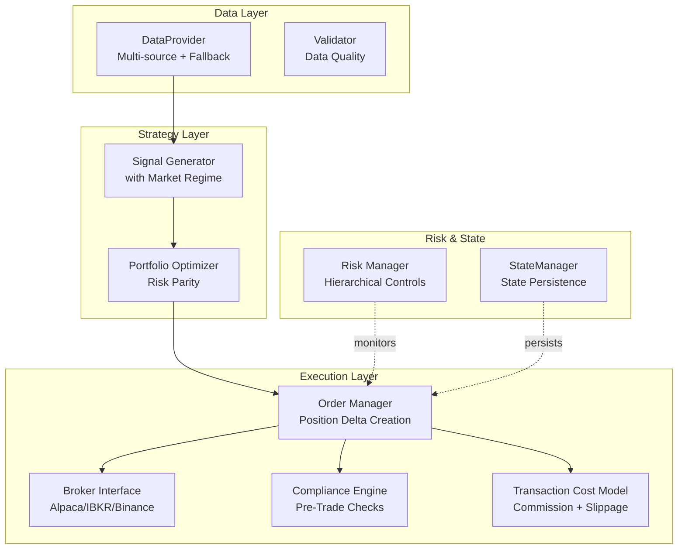

**Diagram sources**
- [Tech_Design_Document.md](file://Tech_Design_Document.md#L36-L117)
- [PRD_Intelligent_Trading_System_v2.md](file://PRD_Intelligent_Trading_System_v2.md#L1006-L1112)

**Section sources**
- [Tech_Design_Document.md](file://Tech_Design_Document.md#L34-L117)
- [PRD_Intelligent_Trading_System_v2.md](file://PRD_Intelligent_Trading_System_v2.md#L1006-L1112)

## Core Components
- **Order Manager**: Generates orders from position deltas, minimizes transaction costs, respects PDT and wash sale constraints, and simulates order submission.
- **Broker Interface**: Routes orders to appropriate brokerages (Alpaca, IBKR, Binance) with standardized execution semantics.
- **Compliance Engine**: Enforces comprehensive pre-trade and post-trade compliance checks including concentration limits, leverage constraints (max 1.5x), daily trading limits, and blacklist restrictions.
- **Transaction Cost Model**: Calculates commission and slippage costs with asset-specific rates and provides cost breakdown for decision-making.
- **Risk Manager**: Applies hierarchical controls, correlation monitoring, and re-entry logic to constrain execution.
- **State Manager**: Persists portfolio and trade state for crash recovery and reconciliation.

**Section sources**
- [Tech_Design_Document.md](file://Tech_Design_Document.md#L771-L813)
- [Tech_Design_Document.md](file://Tech_Design_Document.md#L835-L888)
- [Tech_Design_Document.md](file://Tech_Design_Document.md#L934-L998)

## Architecture Overview
The execution pipeline transforms optimized targets into broker-specific orders while enforcing comprehensive compliance and risk constraints. The flow integrates with risk management and state persistence for resilience, with complete transaction cost modeling throughout the process.

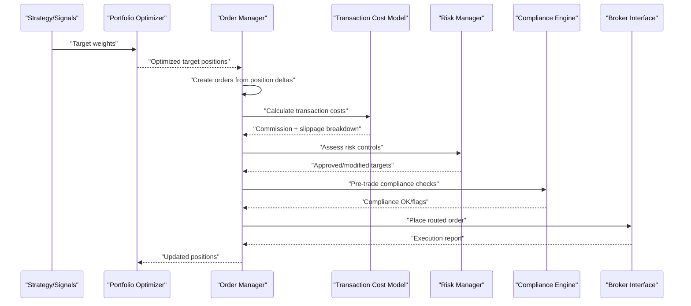

**Diagram sources**
- [Tech_Design_Document.md](file://Tech_Design_Document.md#L771-L813)
- [Tech_Design_Document.md](file://Tech_Design_Document.md#L352-L404)

## Detailed Component Analysis

### Order Management and Position Delta Creation
**Updated** Complete implementation of order creation from position deltas with comprehensive transaction cost modeling.

- **Purpose**: Convert target weights into executable orders across asset classes using position delta calculations with minimal cost drag.
- **Position Delta Logic**:
  - Computes deltas between target and current positions for all symbols
  - Splits large orders to reduce market impact
  - Uses LIMIT orders with offset bands to improve fill price
  - Respects daily turnover and trade counts via risk controls
- **Order Generation Process**:
  - Calculates trade quantity as `target_qty - current_qty`
  - Determines order side based on sign of delta
  - Creates Order objects with standardized fields
  - Validates prices and handles invalid data gracefully
- **Routing Decisions**:
  - Alpaca for US equities/ETFs
  - IBKR for global instruments
  - Binance for crypto assets

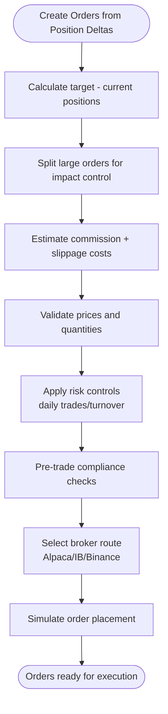

**Diagram sources**
- [order_manager.py](file://src/execution/order_manager.py#L29-L85)
- [order_manager.py](file://src/execution/order_manager.py#L188-L226)

**Section sources**
- [order_manager.py](file://src/execution/order_manager.py#L29-L85)
- [order_manager.py](file://src/execution/order_manager.py#L188-L226)

### Transaction Cost Calculation and Modeling
**Updated** Complete implementation of transaction cost calculation including commission and slippage modeling.

- **Commission Model**:
  - Alpaca: $0.00 per trade (free paper trading)
  - Fallback: 0.1% for other brokerages
  - Zero commission assumption for Phase 1 implementation
- **Slippage Model**:
  - Stocks/ETFs: 0.05% (0.0005)
  - Cryptocurrency (BTC): 0.1% (0.001)
  - Spread impact: Half-spread estimation
- **Cost Calculation Breakdown**:
  - Notional value: `quantity × filled_price`
  - Commission: `$0.00` (Alpaca)
  - Slippage: `notional × slippage_rate`
  - Total cost: `commission + slippage`
  - Cost basis points: `(total_cost / notional) × 10000`

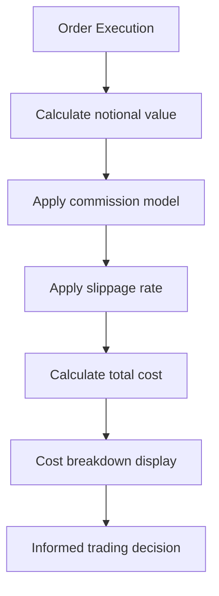

**Diagram sources**
- [order_manager.py](file://src/execution/order_manager.py#L188-L226)

**Section sources**
- [order_manager.py](file://src/execution/order_manager.py#L188-L226)

### Comprehensive Pre-Trade Compliance Checking
**Updated** Complete implementation of comprehensive pre-trade compliance checking including concentration limits, leverage constraints, and daily trading limits.

- **Pre-Trade Compliance Rules**:
  - **Blacklist Check**: Rejects orders for restricted symbols
  - **Position Concentration**: Limits single asset exposure to 50% (GLD)
  - **Leverage Constraint**: Maximum 1.5x leverage across all positions
  - **Cash Buffer**: Maintains minimum 5% cash buffer for buy orders
  - **Daily Trading Limits**: Maximum 5 trades and 30% turnover per day
- **Compliance Check Process**:
  - Validates symbol against blacklist
  - Checks position concentration after trade execution
  - Calculates leverage ratio and compares to limit
  - Verifies cash buffer for buy orders
  - Evaluates daily trading and turnover constraints
- **Post-Trade Compliance**:
  - Validates leverage after trade execution
  - Checks cash buffer maintenance
  - Monitors position concentration limits
  - Logs compliance violations for monitoring

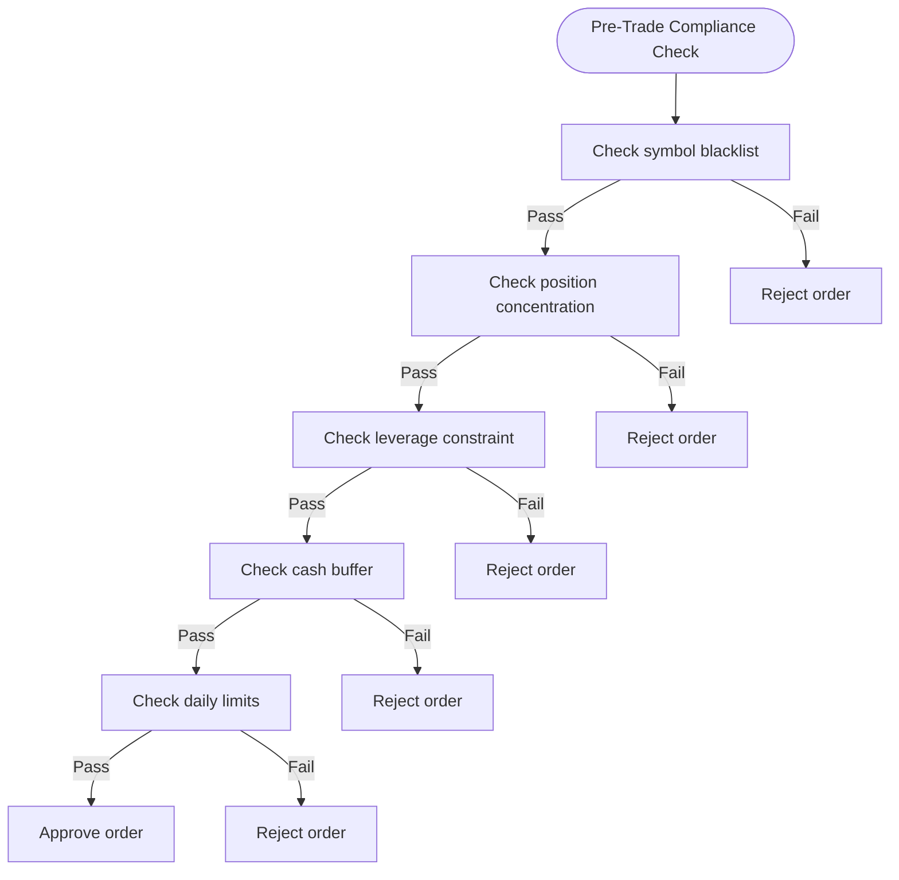

**Diagram sources**
- [compliance.py](file://src/execution/compliance.py#L26-L58)
- [compliance.py](file://src/execution/compliance.py#L189-L206)

**Section sources**
- [compliance.py](file://src/execution/compliance.py#L11-L20)
- [compliance.py](file://src/execution/compliance.py#L26-L58)
- [compliance.py](file://src/execution/compliance.py#L189-L206)

### Brokerage Integration (Alpaca, IBKR, Binance)
- **Alpaca**: REST/WebSocket for US equities/ETFs; paper trading free
- **IBKR**: TWS API for global markets; supports diverse asset classes
- **Binance**: REST/WebSocket for crypto; supports spot and futures
- **Routing Decisions**:
  - Asset class determines brokerage
  - Venue selection considers liquidity and latency
  - Execution venue may be overridden by risk or compliance rules

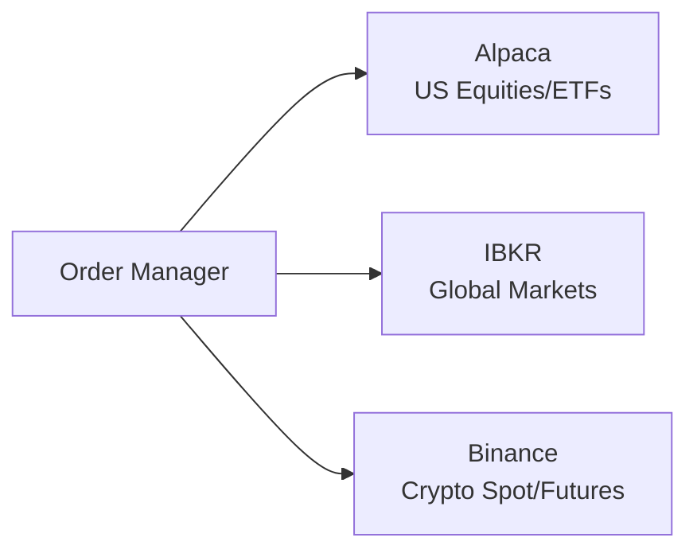

**Diagram sources**
- [PRD_Intelligent_Trading_System_v2.md](file://PRD_Intelligent_Trading_System_v2.md#L913-L920)

**Section sources**
- [PRD_Intelligent_Trading_System_v2.md](file://PRD_Intelligent_Trading_System_v2.md#L913-L920)

### Risk Management and Portfolio Optimization Coupling
- **Risk Manager** applies:
  - Hierarchical controls (levels 1–4) based on drawdown and correlation
  - Single-asset stops and portfolio-wide constraints
  - Re-entry logic after severe drawdowns
- **Portfolio Optimizer** feeds Order Manager with constrained targets
- **Execution layer** receives modified targets and executes within risk envelopes

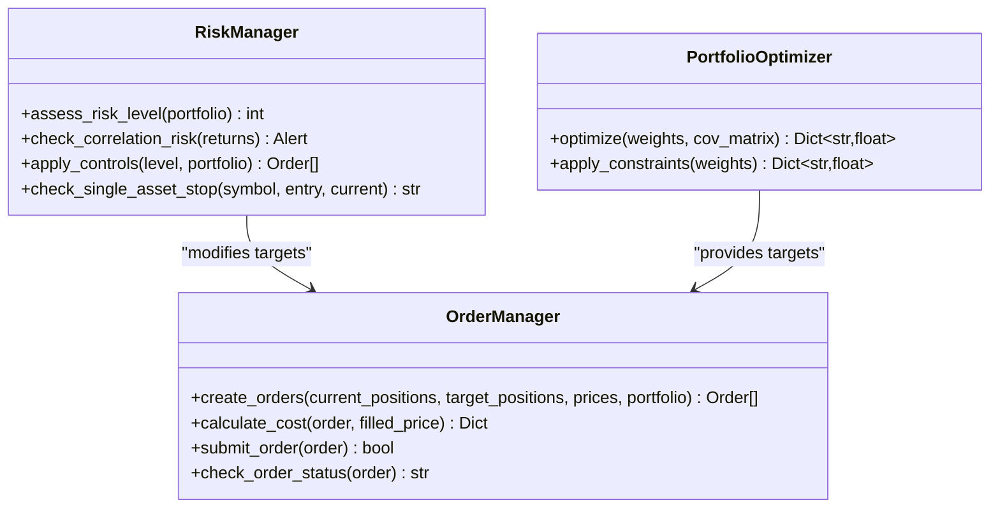

**Diagram sources**
- [Tech_Design_Document.md](file://Tech_Design_Document.md#L352-L404)
- [Tech_Design_Document.md](file://Tech_Design_Document.md#L771-L797)

**Section sources**
- [Tech_Design_Document.md](file://Tech_Design_Document.md#L352-L404)
- [Tech_Design_Document.md](file://Tech_Design_Document.md#L771-L797)

### State Persistence and Recovery Impact
- **State Manager** persists portfolio, risk state, trade history, signals, and pending orders
- **Disaster Recovery** reconciles local state with broker state, cancels pending orders, and resumes operations
- **Ensures continuity** for compliance and reporting

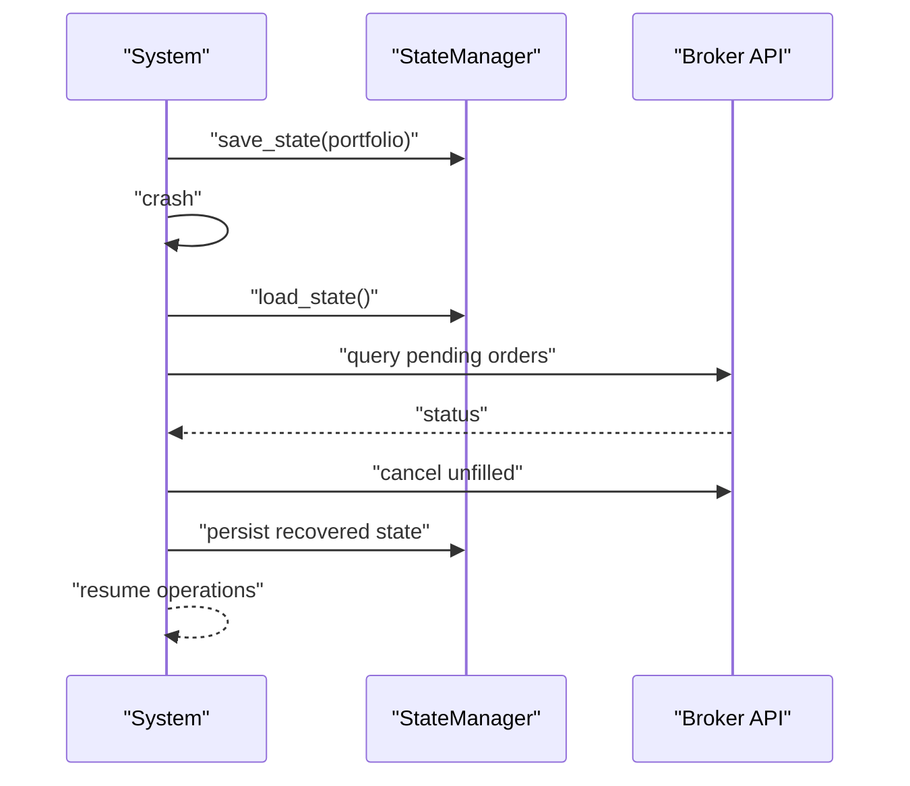

**Diagram sources**
- [Tech_Design_Document.md](file://Tech_Design_Document.md#L835-L888)

**Section sources**
- [Tech_Design_Document.md](file://Tech_Design_Document.md#L835-L888)

## Dependency Analysis
- **Execution depends on**:
  - Strategy outputs (target weights)
  - Risk Manager decisions (modified targets)
  - Compliance engine approvals
  - Broker interfaces for execution
  - Transaction cost models for decision-making
- **Data quality** feeds signals and factors; validated data ensures accurate order sizing and routing.
- **State persistence** underpins recovery and auditability.

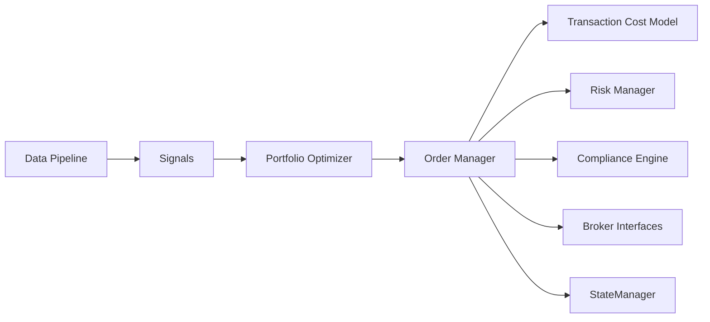

**Diagram sources**
- [Tech_Design_Document.md](file://Tech_Design_Document.md#L88-L117)

**Section sources**
- [Tech_Design_Document.md](file://Tech_Design_Document.md#L88-L117)

## Performance Considerations
- **Minimize transaction cost drag** by using conservative slippage assumptions and splitting orders appropriately.
- **Respect daily trade and turnover caps** to avoid triggering higher risk levels.
- **Use appropriate order types** (LIMIT with offsets) to balance speed and price.
- **Ensure broker routes match asset liquidity profiles** to reduce adverse selection.
- **Monitor compliance thresholds** to prevent order rejections and execution delays.

## Troubleshooting Guide
**Updated** Common issues and resolutions with comprehensive compliance troubleshooting.

- **Order rejected due to PDT**: Review recent day trades and reschedule to next session.
- **Wash sale detected**: Defer buy-back or adjust to non-identical asset to avoid disallowed loss.
- **Excessive turnover risk**: Reduce order size or batch orders to stay within daily caps.
- **Position concentration violation**: Monitor single asset exposure and diversify holdings.
- **Leverage constraint exceeded**: Reduce position sizes or increase cash allocation.
- **Blacklisted symbol error**: Remove restricted symbols from target allocations.
- **Broker connectivity failures**: Use State Manager to reconcile and cancel pending orders; retry after recovery.
- **Compliance edge cases**: Validate tax lot method and reporting windows; ensure FIFO tracking is enabled.

**Section sources**
- [PRD_Intelligent_Trading_System_v2.md](file://PRD_Intelligent_Trading_System_v2.md#L941-L991)
- [Tech_Design_Document.md](file://Tech_Design_Document.md#L835-L888)

## Conclusion
The execution and compliance subsystems are designed to safely translate optimized portfolios into executed trades across multiple brokerages while enforcing comprehensive compliance rules. The complete implementation includes position delta-based order creation, simulated order submission, transaction cost calculation (commission + slippage), and comprehensive pre-trade compliance checking including concentration limits, leverage constraints (max 1.5x), and daily trading limits. Integrated risk controls and state persistence ensure robust operations, and the cost model and routing logic aim to minimize total transaction cost. Together, these components support reliable, compliant trading across asset classes.

## Appendices

### Configuration Options
**Updated** Configuration options for the complete execution and compliance system.

- **Strategy parameters**: name, rebalance frequency, min rebalance threshold
- **Asset universe**: core and extended assets with max weights, momentum lookbacks, vol targets, and asset stop losses
- **Risk parameters**: four-tier controls, correlation thresholds, re-entry logic, max leverage, cash buffer, daily trade and turnover caps, commission and slippage rates
- **Compliance parameters**: enable PDT tracking, enable wash sale tracking, tax lot method (e.g., FIFO), position concentration limits, leverage constraints, daily trading limits
- **Data sources**: primary and fallback providers, cache backend, crypto canonical source
- **Alerts**: channels, webhook/email settings

**Section sources**
- [PRD_Intelligent_Trading_System_v2.md](file://PRD_Intelligent_Trading_System_v2.md#L1225-L1323)

### Example Workflows

#### Complete Order Lifecycle with Compliance and Cost Analysis
**Updated** Complete workflow showing position delta creation, cost calculation, and compliance checking.

- Strategy generates targets
- Portfolio optimizer constrains targets
- Order Manager computes position deltas and creates orders
- Transaction cost model calculates commission and slippage
- Risk Manager approves with potential reductions
- Compliance engine performs pre-trade checks
- Broker executes orders
- State updated and persisted

```mermaid
sequenceDiagram
participant Strat as "Strategy"
participant Opt as "Optimizer"
participant OM as "Order Manager"
participant Cost as "Cost Model"
participant Risk as "Risk Manager"
participant Comp as "Compliance"
participant Broker as "Broker"
Strat->>Opt : "Targets"
Opt-->>OM : "Constrained targets"
OM->>OM : "Create orders from position deltas"
OM->>Cost : "Calculate transaction costs"
Cost-->>OM : "Commission + slippage"
OM->>Risk : "Review"
Risk-->>OM : "Approved targets"
OM->>Comp : "Pre-trade compliance check"
Comp-->>OM : "OK or rejection"
OM->>Broker : "Execute"
Broker-->>OM : "Fill report"
OM-->>Strat : "Positions updated"
```

**Diagram sources**
- [Tech_Design_Document.md](file://Tech_Design_Document.md#L771-L813)
- [order_manager.py](file://src/execution/order_manager.py#L188-L226)
- [compliance.py](file://src/execution/compliance.py#L26-L58)

#### Transaction Cost Analysis Workflow
**New** Detailed workflow for transaction cost calculation and analysis.

- Order execution with notional value calculation
- Commission determination based on brokerage rules
- Slippage calculation using asset-specific rates
- Total cost computation and cost basis points calculation
- Decision-making based on cost analysis

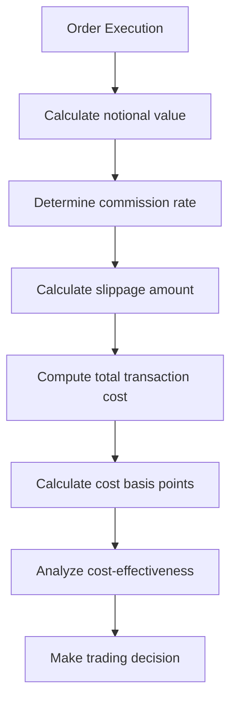

**Diagram sources**
- [order_manager.py](file://src/execution/order_manager.py#L188-L226)

#### Comprehensive Compliance Check Workflow
**New** Complete workflow for pre-trade compliance validation.

- Symbol blacklist verification
- Position concentration calculation after trade
- Leverage ratio computation and comparison
- Cash buffer validation for buy orders
- Daily trading and turnover limit evaluation
- Compliance approval or rejection with reasons

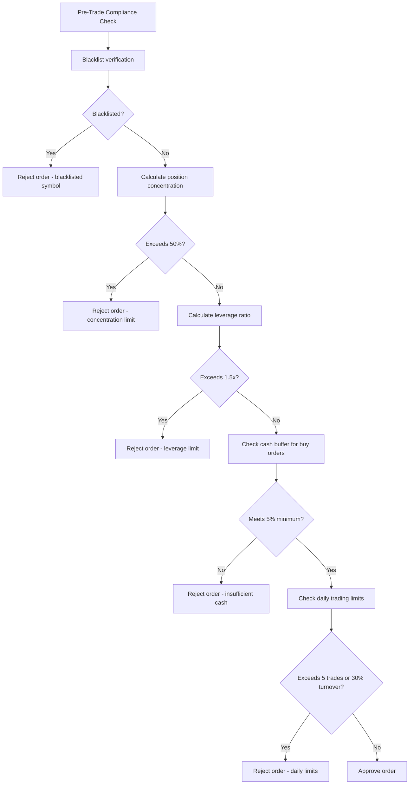

**Diagram sources**
- [compliance.py](file://src/execution/compliance.py#L26-L58)
- [compliance.py](file://src/execution/compliance.py#L189-L206)