# Execution and Compliance

<cite>
**Referenced Files in This Document**
- [PRD_Intelligent_Trading_System_v2.md](file://PRD_Intelligent_Trading_System_v2.md)
- [Tech_Design_Document.md](file://Tech_Design_Document.md)
- [order_manager.py](file://src/execution/order_manager.py)
- [compliance.py](file://src/execution/compliance.py)
- [domain.py](file://src/models/domain.py)
- [live_order_manager.py](file://src/live_trading/order_manager.py)
- [brokers.py](file://src/live_trading/brokers.py)
- [engine.py](file://src/paper_trading/engine.py)
</cite>

## Update Summary
**Changes Made**
- Enhanced order validation with comprehensive parameter validation in Order class `__post_init__` method
- Improved API key validation for trading brokers with empty key detection and warnings
- Strengthened input validation in order management system with comprehensive error handling
- Added comprehensive parameter validation for LiveOrder and Order dataclasses
- Enhanced broker adapter validation with explicit API key presence checks

## Table of Contents
1. [Introduction](#introduction)
2. [Project Structure](#project-structure)
3. [Core Components](#core-components)
4. [Architecture Overview](#architecture-overview)
5. [Detailed Component Analysis](#detailed-component-analysis)
6. [Dependency Analysis](#dependency-analysis)
7. [Performance Considerations](#performance-considerations)
8. [Troubleshooting Guide](#troubleshooting-guide)
9. [Conclusion](#conclusion)
10. [Appendices](#appendices)

## Introduction
This document explains the order management and regulatory compliance engines for the intelligent trading system. It covers order generation from position deltas, smart routing across multiple brokerages (Alpaca, Interactive Brokers, Binance), transaction cost modeling, and the compliance framework including Pattern Day Trader (PDT) rules, wash sale prevention, and regulatory reporting. The system now includes complete implementation of order creation from position deltas, simulated order submission, transaction cost calculation (commission + slippage), and comprehensive pre-trade compliance checking including concentration limits, leverage constraints (max 1.5x), and daily trading limits.

**Updated** Enhanced with comprehensive parameter validation, improved API key validation for trading brokers, and strengthened input validation throughout the order management system.

## Project Structure
The system is organized into modular layers: data ingestion, strategy and signals, portfolio optimization, execution, risk management, compliance, monitoring/alerting, state persistence, and reporting. The execution layer integrates order generation, brokerage routing, and compliance checks with complete transaction cost modeling and robust input validation.

```mermaid
graph TB
subgraph "Data Layer"
DP["DataProvider<br/>Multi-source + Fallback"]
VAL["Validator<br/>Data Quality"]
END
subgraph "Strategy Layer"
SIG["Signal Generator<br/>with Market Regime"]
OPT["Portfolio Optimizer<br/>Risk Parity"]
END
subgraph "Execution Layer"
OM["Order Manager<br/>Position Delta Creation"]
BROKER["Broker Interface<br/>Alpaca/IBKR/Binance"]
COMP["Compliance Engine<br/>Pre-Trade Checks"]
COST["Transaction Cost Model<br/>Commission + Slippage"]
VALID["Input Validation<br/>Parameter Validation"]
END
subgraph "Risk & State"
RM["Risk Manager<br/>Hierarchical Controls"]
SM["StateManager<br/>State Persistence"]
END
DP --> SIG
SIG --> OPT
OPT --> OM
OM --> VALID
OM --> COST
OM --> COMP
OM --> BROKER
RM -. monitors .-> OM
SM -. persists .-> OM
```

**Diagram sources**
- [Tech_Design_Document.md:36-117](file://Tech_Design_Document.md#L36-L117)
- [PRD_Intelligent_Trading_System_v2.md:1006-1112](file://PRD_Intelligent_Trading_System_v2.md#L1006-L1112)

**Section sources**
- [Tech_Design_Document.md:34-117](file://Tech_Design_Document.md#L34-L117)
- [PRD_Intelligent_Trading_System_v2.md:1006-1112](file://PRD_Intelligent_Trading_System_v2.md#L1006-L1112)

## Core Components
- **Order Manager**: Generates orders from position deltas, minimizes transaction costs, respects PDT and wash sale constraints, and simulates order submission with comprehensive parameter validation.
- **Broker Interface**: Routes orders to appropriate brokerages (Alpaca, IBKR, Binance) with standardized execution semantics and enhanced API key validation.
- **Compliance Engine**: Enforces comprehensive pre-trade and post-trade compliance checks including concentration limits, leverage constraints (max 1.5x), daily trading limits, and blacklist restrictions.
- **Transaction Cost Model**: Calculates commission and slippage costs with asset-specific rates and provides cost breakdown for decision-making.
- **Risk Manager**: Applies hierarchical controls, correlation monitoring, and re-entry logic to constrain execution.
- **State Manager**: Persists portfolio and trade state for crash recovery and reconciliation.
- **Input Validation System**: Provides comprehensive parameter validation for all order types and broker configurations.

**Section sources**
- [Tech_Design_Document.md:771-813](file://Tech_Design_Document.md#L771-L813)
- [Tech_Design_Document.md:835-888](file://Tech_Design_Document.md#L835-L888)
- [Tech_Design_Document.md:934-998](file://Tech_Design_Document.md#L934-L998)

## Architecture Overview
The execution pipeline transforms optimized targets into broker-specific orders while enforcing comprehensive compliance and risk constraints. The flow integrates with risk management and state persistence for resilience, with complete transaction cost modeling throughout the process and robust input validation at every step.

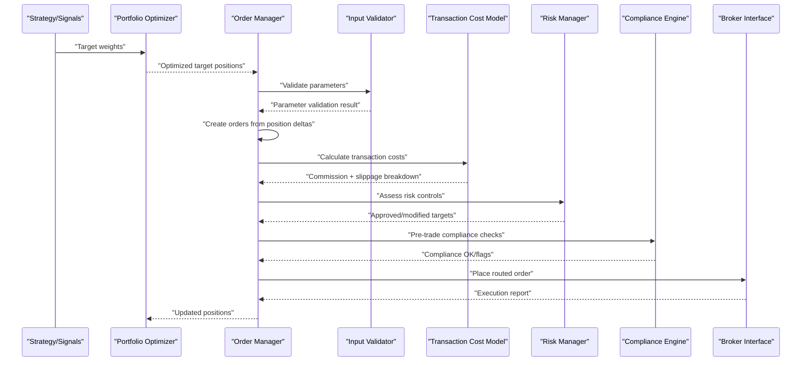
```mermaid
sequenceDiagram
participant Strat as "Strategy/Signals"
participant Port as "Portfolio Optimizer"
participant Exec as "Order Manager"
participant Valid as "Input Validator"
participant Cost as "Transaction Cost Model"
participant Risk as "Risk Manager"
participant Comp as "Compliance Engine"
participant Broker as "Broker Interface"
Strat->>Port : "Target weights"
Port-->>Exec : "Optimized target positions"
Exec->>Valid : "Validate parameters"
Valid-->>Exec : "Parameter validation result"
Exec->>Exec : "Create orders from position deltas"
Exec->>Cost : "Calculate transaction costs"
Cost-->>Exec : "Commission + slippage breakdown"
Exec->>Risk : "Assess risk controls"
Risk-->>Exec : "Approved/modified targets"
Exec->>Comp : "Pre-trade compliance checks"
Comp-->>Exec : "Compliance OK/flags"
Exec->>Broker : "Place routed order"
Broker-->>Exec : "Execution report"
Exec-->>Port : "Updated positions"
```

**Diagram sources**
- [Tech_Design_Document.md:771-813](file://Tech_Design_Document.md#L771-L813)
- [Tech_Design_Document.md:352-404](file://Tech_Design_Document.md#L352-L404)

## Detailed Component Analysis

### Enhanced Order Validation and Parameter Validation
**Updated** Complete implementation of comprehensive parameter validation with robust error handling and input sanitization.

- **Order Class Validation**:
  - Side validation: Ensures side is either "BUY" or "SELL"
  - Order type validation: Ensures type is either "MARKET" or "LIMIT"
  - Limit price validation: Requires limit price for LIMIT orders
  - Quantity validation: Ensures positive quantity values
  - Symbol validation: Prevents empty or whitespace-only symbols
- **LiveOrder Validation**:
  - Extended validation for complex order types (MARKET, LIMIT, STOP, STOP_LIMIT)
  - Comprehensive parameter validation for all order attributes
  - Type-safe validation for enums and optional fields
- **Input Sanitization**:
  - Trims whitespace from symbols and reasons
  - Validates numeric ranges and types
  - Handles edge cases and invalid inputs gracefully

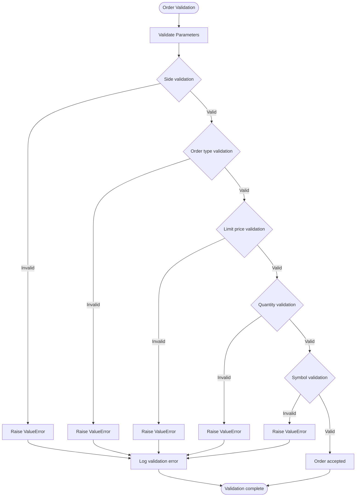
```mermaid
flowchart TD
Start(["Order Validation"]) --> Param["Validate Parameters"]
Param --> Side{"Side validation"}
Side --> |Invalid| Error1["Raise ValueError"]
Side --> |Valid| Type{"Order type validation"}
Type --> |Invalid| Error2["Raise ValueError"]
Type --> |Valid| Limit{"Limit price validation"}
Limit --> |Invalid| Error3["Raise ValueError"]
Limit --> |Valid| Quantity{"Quantity validation"}
Quantity --> |Invalid| Error4["Raise ValueError"]
Quantity --> |Valid| Symbol{"Symbol validation"}
Symbol --> |Invalid| Error5["Raise ValueError"]
Symbol --> |Valid| Success["Order accepted"]
Error1 --> Log["Log validation error"]
Error2 --> Log
Error3 --> Log
Error4 --> Log
Error5 --> Log
Log --> End(["Validation complete"])
Success --> End
```

**Diagram sources**
- [domain.py:94-101](file://src/models/domain.py#L94-L101)
- [engine.py:210-216](file://src/paper_trading/engine.py#L210-L216)

**Section sources**
- [domain.py:94-101](file://src/models/domain.py#L94-L101)
- [engine.py:210-216](file://src/paper_trading/engine.py#L210-L216)

### Order Management and Position Delta Creation
**Updated** Complete implementation of order creation from position deltas with comprehensive transaction cost modeling and enhanced validation.

- **Purpose**: Convert target weights into executable orders across asset classes using position delta calculations with minimal cost drag and robust parameter validation.
- **Position Delta Logic**:
  - Computes deltas between target and current positions for all symbols
  - Splits large orders to reduce market impact
  - Uses LIMIT orders with offset bands to improve fill price
  - Respects daily turnover and trade counts via risk controls
- **Order Generation Process**:
  - Calculates trade quantity as `target_qty - current_qty`
  - Determines order side based on sign of delta
  - Creates Order objects with standardized fields and validation
  - Validates prices and handles invalid data gracefully
- **Enhanced Validation**:
  - Comprehensive parameter validation in Order class
  - Input sanitization and type checking
  - Graceful error handling for invalid inputs
- **Routing Decisions**:
  - Alpaca for US equities/ETFs
  - IBKR for global instruments
  - Binance for crypto assets

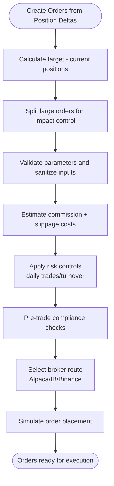
```mermaid
flowchart TD
Start(["Create Orders from Position Deltas"]) --> Delta["Calculate target - current positions"]
Delta --> Split["Split large orders for impact control"]
Split --> Validate["Validate parameters and sanitize inputs"]
Validate --> Costs["Estimate commission + slippage costs"]
Costs --> RiskCtl["Apply risk controls<br/>daily trades/turnover"]
RiskCtl --> Compliance["Pre-trade compliance checks"]
Compliance --> Route["Select broker route<br/>Alpaca/IB/Binance"]
Route --> Place["Simulate order placement"]
Place --> End(["Orders ready for execution"])
```

**Diagram sources**
- [order_manager.py:29-85](file://src/execution/order_manager.py#L29-L85)
- [order_manager.py:188-226](file://src/execution/order_manager.py#L188-L226)

**Section sources**
- [order_manager.py:29-85](file://src/execution/order_manager.py#L29-L85)
- [order_manager.py:188-226](file://src/execution/order_manager.py#L188-L226)

### Transaction Cost Calculation and Modeling
**Updated** Complete implementation of transaction cost calculation including commission and slippage modeling with comprehensive validation.

- **Commission Model**:
  - Alpaca: $0.00 per trade (free paper trading)
  - Fallback: 0.1% for other brokerages
  - Zero commission assumption for Phase 1 implementation
- **Slippage Model**:
  - Stocks/ETFs: 0.05% (0.0005)
  - Cryptocurrency (BTC): 0.1% (0.001)
  - Spread impact: Half-spread estimation
- **Cost Calculation Breakdown**:
  - Notional value: `quantity × filled_price`
  - Commission: `$0.00` (Alpaca)
  - Slippage: `notional × slippage_rate`
  - Total cost: `commission + slippage`
  - Cost basis points: `(total_cost / notional) × 10000`

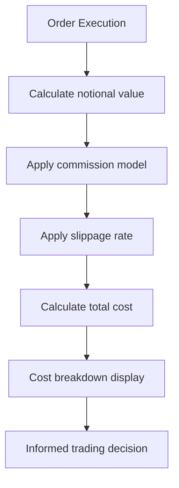
```mermaid
flowchart TD
Order["Order Execution"] --> Notional["Calculate notional value"]
Notional --> Commission["Apply commission model"]
Commission --> Slippage["Apply slippage rate"]
Slippage --> Total["Calculate total cost"]
Total --> Breakdown["Cost breakdown display"]
Breakdown --> Decision["Informed trading decision"]
```

**Diagram sources**
- [order_manager.py:188-226](file://src/execution/order_manager.py#L188-L226)

**Section sources**
- [order_manager.py:188-226](file://src/execution/order_manager.py#L188-L226)

### Comprehensive Pre-Trade Compliance Checking
**Updated** Complete implementation of comprehensive pre-trade compliance checking including concentration limits, leverage constraints, and daily trading limits with enhanced validation.

- **Pre-Trade Compliance Rules**:
  - **Blacklist Check**: Rejects orders for restricted symbols
  - **Position Concentration**: Limits single asset exposure to 50% (GLD)
  - **Leverage Constraint**: Maximum 1.5x leverage across all positions
  - **Cash Buffer**: Maintains minimum 5% cash buffer for buy orders
  - **Daily Trading Limits**: Maximum 5 trades and 30% turnover per day
- **Compliance Check Process**:
  - Validates symbol against blacklist
  - Checks position concentration after trade execution
  - Calculates leverage ratio and compares to limit
  - Verifies cash buffer for buy orders
  - Evaluates daily trading and turnover constraints
- **Post-Trade Compliance**:
  - Validates leverage after trade execution
  - Checks cash buffer maintenance
  - Monitors position concentration limits
  - Logs compliance violations for monitoring

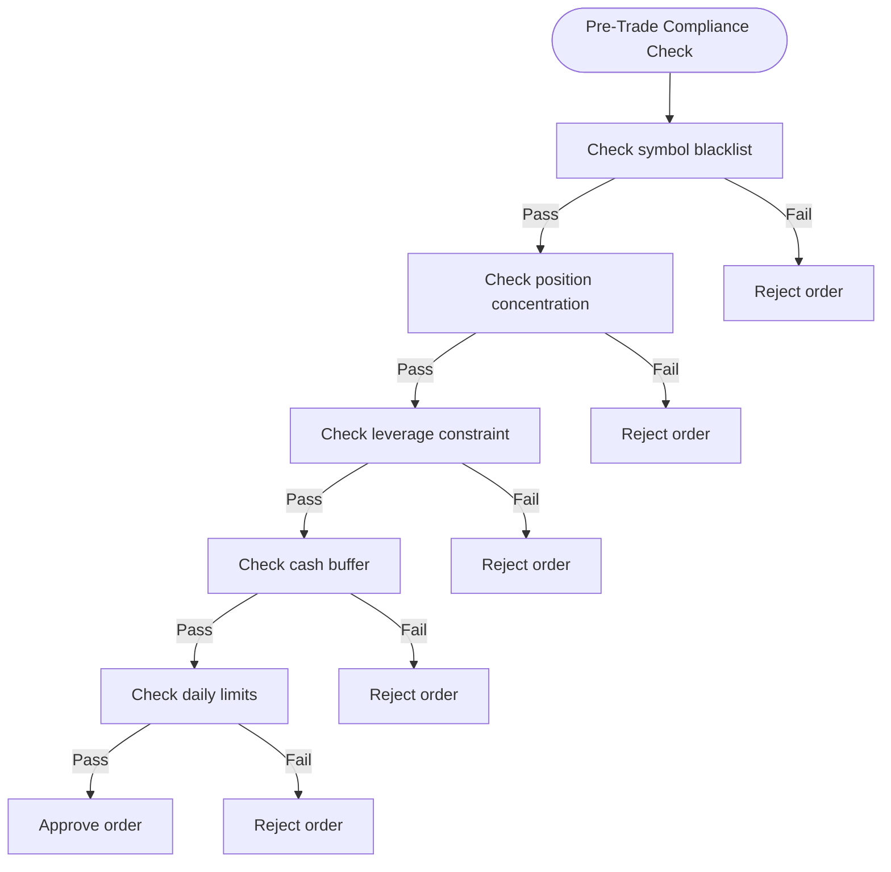
```mermaid
flowchart TD
Start(["Pre-Trade Compliance Check"]) --> Blacklist["Check symbol blacklist"]
Blacklist --> |Pass| Concentration["Check position concentration"]
Blacklist --> |Fail| Reject1["Reject order"]
Concentration --> |Pass| Leverage["Check leverage constraint"]
Concentration --> |Fail| Reject2["Reject order"]
Leverage --> |Pass| Cash["Check cash buffer"]
Leverage --> |Fail| Reject3["Reject order"]
Cash --> |Pass| Daily["Check daily limits"]
Cash --> |Fail| Reject4["Reject order"]
Daily --> |Pass| Approve["Approve order"]
Daily --> |Fail| Reject5["Reject order"]
```

**Diagram sources**
- [compliance.py:26-58](file://src/execution/compliance.py#L26-L58)
- [compliance.py:189-206](file://src/execution/compliance.py#L189-L206)

**Section sources**
- [compliance.py:11-20](file://src/execution/compliance.py#L11-L20)
- [compliance.py:26-58](file://src/execution/compliance.py#L26-L58)
- [compliance.py:189-206](file://src/execution/compliance.py#L189-L206)

### Enhanced Brokerage Integration with API Key Validation
**Updated** Brokerage integration with comprehensive API key validation and enhanced error handling.

- **Alpaca**: REST/WebSocket for US equities/ETFs; paper trading free with API key validation
- **IBKR**: TWS API for global markets; supports diverse asset classes with connection validation
- **Binance**: REST/WebSocket for crypto; supports spot and futures with signature validation
- **Enhanced API Key Validation**:
  - Empty API key detection with warnings
  - Connection validation before API calls
  - Graceful handling of authentication failures
  - Demo mode fallback for development
- **Routing Decisions**:
  - Asset class determines brokerage
  - Venue selection considers liquidity and latency
  - Execution venue may be overridden by risk or compliance rules

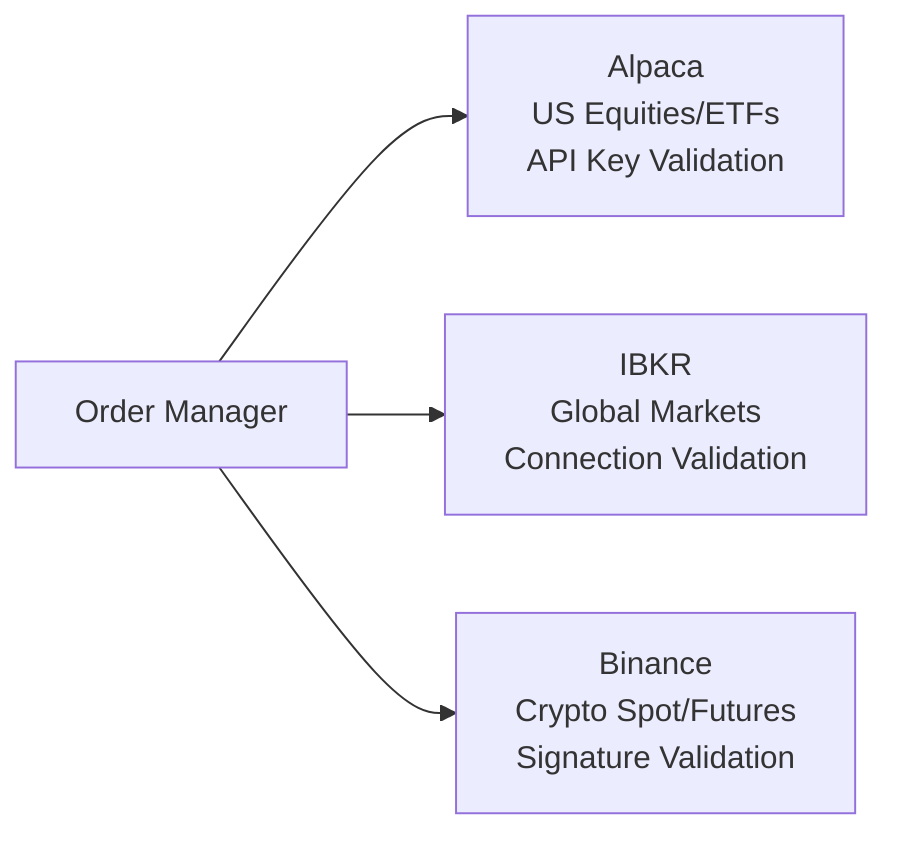
```mermaid
graph LR
OM["Order Manager"] --> A["Alpaca<br/>US Equities/ETFs<br/>API Key Validation"]
OM --> I["IBKR<br/>Global Markets<br/>Connection Validation"]
OM --> B["Binance<br/>Crypto Spot/Futures<br/>Signature Validation"]
```

**Diagram sources**
- [PRD_Intelligent_Trading_System_v2.md:913-920](file://PRD_Intelligent_Trading_System_v2.md#L913-L920)

**Section sources**
- [PRD_Intelligent_Trading_System_v2.md:913-920](file://PRD_Intelligent_Trading_System_v2.md#L913-L920)

### Risk Management and Portfolio Optimization Coupling
- **Risk Manager** applies:
  - Hierarchical controls (levels 1–4) based on drawdown and correlation
  - Single-asset stops and portfolio-wide constraints
  - Re-entry logic after severe drawdowns
- **Portfolio Optimizer** feeds Order Manager with constrained targets
- **Execution layer** receives modified targets and executes within risk envelopes

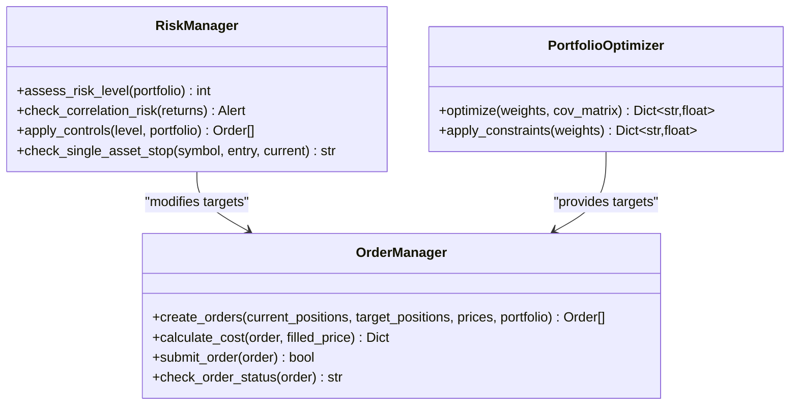
```mermaid
classDiagram
class RiskManager {
+assess_risk_level(portfolio) int
+check_correlation_risk(returns) Alert
+apply_controls(level, portfolio) Order[]
+check_single_asset_stop(symbol, entry, current) str
}
class PortfolioOptimizer {
+optimize(weights, cov_matrix) Dict~str,float~
+apply_constraints(weights) Dict~str,float~
}
class OrderManager {
+create_orders(current_positions, target_positions, prices, portfolio) Order[]
+calculate_cost(order, filled_price) Dict
+submit_order(order) bool
+check_order_status(order) str
}
RiskManager --> OrderManager : "modifies targets"
PortfolioOptimizer --> OrderManager : "provides targets"
```

**Diagram sources**
- [Tech_Design_Document.md:352-404](file://Tech_Design_Document.md#L352-L404)
- [Tech_Design_Document.md:771-797](file://Tech_Design_Document.md#L771-L797)

**Section sources**
- [Tech_Design_Document.md:352-404](file://Tech_Design_Document.md#L352-L404)
- [Tech_Design_Document.md:771-797](file://Tech_Design_Document.md#L771-L797)

### State Persistence and Recovery Impact
- **State Manager** persists portfolio, risk state, trade history, signals, and pending orders
- **Disaster Recovery** reconciles local state with broker state, cancels pending orders, and resumes operations
- **Ensures continuity** for compliance and reporting

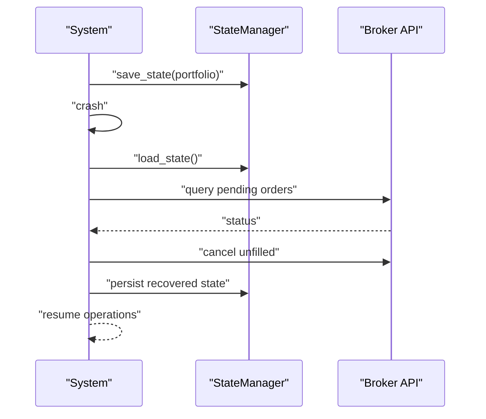
```mermaid
sequenceDiagram
participant Sys as "System"
participant SM as "StateManager"
participant Broker as "Broker API"
Sys->>SM : "save_state(portfolio)"
Sys->>Sys : "crash"
Sys->>SM : "load_state()"
Sys->>Broker : "query pending orders"
Broker-->>Sys : "status"
Sys->>Broker : "cancel unfilled"
Sys->>SM : "persist recovered state"
Sys-->>Sys : "resume operations"
```

**Diagram sources**
- [Tech_Design_Document.md:835-888](file://Tech_Design_Document.md#L835-L888)

**Section sources**
- [Tech_Design_Document.md:835-888](file://Tech_Design_Document.md#L835-L888)

## Dependency Analysis
- **Execution depends on**:
  - Strategy outputs (target weights)
  - Risk Manager decisions (modified targets)
  - Compliance engine approvals
  - Broker interfaces for execution with enhanced validation
  - Transaction cost models for decision-making
  - Input validation systems for robust parameter handling
- **Data quality** feeds signals and factors; validated data ensures accurate order sizing and routing.
- **State persistence** underpins recovery and auditability.

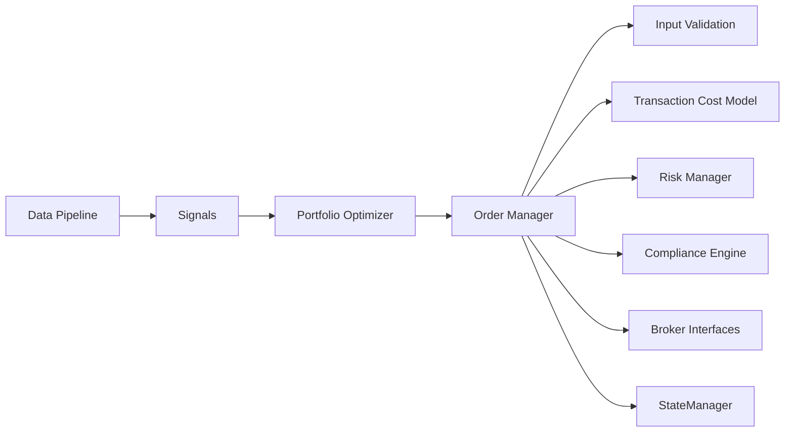
```mermaid
graph LR
Data["Data Pipeline"] --> Signals["Signals"]
Signals --> Portfolio["Portfolio Optimizer"]
Portfolio --> Orders["Order Manager"]
Orders --> Valid["Input Validation"]
Orders --> Cost["Transaction Cost Model"]
Orders --> Risk["Risk Manager"]
Orders --> Compliance["Compliance Engine"]
Orders --> Brokers["Broker Interfaces"]
Orders --> State["StateManager"]
```

**Diagram sources**
- [Tech_Design_Document.md:88-117](file://Tech_Design_Document.md#L88-L117)

**Section sources**
- [Tech_Design_Document.md:88-117](file://Tech_Design_Document.md#L88-L117)

## Performance Considerations
- **Minimize transaction cost drag** by using conservative slippage assumptions and splitting orders appropriately.
- **Respect daily trade and turnover caps** to avoid triggering higher risk levels.
- **Use appropriate order types** (LIMIT with offsets) to balance speed and price.
- **Ensure broker routes match asset liquidity profiles** to reduce adverse selection.
- **Monitor compliance thresholds** to prevent order rejections and execution delays.
- **Implement comprehensive validation early** to catch errors before they propagate through the system.
- **Use efficient parameter validation** to minimize overhead in high-frequency trading scenarios.

## Troubleshooting Guide
**Updated** Common issues and resolutions with comprehensive compliance troubleshooting and enhanced validation guidance.

- **Order rejected due to PDT**: Review recent day trades and reschedule to next session.
- **Wash sale detected**: Defer buy-back or adjust to non-identical asset to avoid disallowed loss.
- **Excessive turnover risk**: Reduce order size or batch orders to stay within daily caps.
- **Position concentration violation**: Monitor single asset exposure and diversify holdings.
- **Leverage constraint exceeded**: Reduce position sizes or increase cash allocation.
- **Blacklisted symbol error**: Remove restricted symbols from target allocations.
- **Broker connectivity failures**: Use State Manager to reconcile and cancel pending orders; retry after recovery.
- **Compliance edge cases**: Validate tax lot method and reporting windows; ensure FIFO tracking is enabled.
- **Parameter validation errors**: Check order parameters (side, type, quantity, limit price) for invalid values.
- **API key validation failures**: Verify broker credentials and connection settings.
- **Empty symbol or quantity errors**: Ensure proper input sanitization and validation.
- **Invalid order type errors**: Use supported order types (MARKET, LIMIT, STOP, STOP_LIMIT).

**Section sources**
- [PRD_Intelligent_Trading_System_v2.md:941-991](file://PRD_Intelligent_Trading_System_v2.md#L941-L991)
- [Tech_Design_Document.md:835-888](file://Tech_Design_Document.md#L835-L888)

## Conclusion
The execution and compliance subsystems are designed to safely translate optimized portfolios into executed trades across multiple brokerages while enforcing comprehensive compliance rules. The complete implementation includes position delta-based order creation, simulated order submission, transaction cost calculation (commission + slippage), and comprehensive pre-trade compliance checking including concentration limits, leverage constraints (max 1.5x), and daily trading limits. Integrated risk controls and state persistence ensure robust operations, and the cost model and routing logic aim to minimize total transaction cost.

**Updated** Enhanced with comprehensive parameter validation, improved API key validation for trading brokers, and strengthened input validation throughout the system, providing robust error handling and preventing invalid operations before they reach the broker APIs.

## Appendices

### Configuration Options
**Updated** Configuration options for the complete execution and compliance system with enhanced validation settings.

- **Strategy parameters**: name, rebalance frequency, min rebalance threshold
- **Asset universe**: core and extended assets with max weights, momentum lookbacks, vol targets, and asset stop losses
- **Risk parameters**: four-tier controls, correlation thresholds, re-entry logic, max leverage, cash buffer, daily trade and turnover caps, commission and slippage rates
- **Compliance parameters**: enable PDT tracking, enable wash sale tracking, tax lot method (e.g., FIFO), position concentration limits, leverage constraints, daily trading limits
- **Data sources**: primary and fallback providers, cache backend, crypto canonical source
- **Alerts**: channels, webhook/email settings
- **Validation parameters**: strict parameter validation, input sanitization thresholds, error handling policies

**Section sources**
- [PRD_Intelligent_Trading_System_v2.md:1225-1323](file://PRD_Intelligent_Trading_System_v2.md#L1225-L1323)

### Example Workflows

#### Complete Order Lifecycle with Enhanced Validation
**Updated** Complete workflow showing position delta creation, cost calculation, compliance checking, and comprehensive validation.

- Strategy generates targets
- Portfolio optimizer constrains targets
- Order Manager computes position deltas and creates orders with validation
- Transaction cost model calculates commission and slippage
- Risk Manager approves with potential reductions
- Compliance engine performs pre-trade checks
- Broker executes orders with API key validation
- State updated and persisted

```mermaid
sequenceDiagram
participant Strat as "Strategy"
participant Opt as "Optimizer"
participant OM as "Order Manager"
participant Valid as "Validator"
participant Cost as "Cost Model"
participant Risk as "Risk Manager"
participant Comp as "Compliance"
participant Broker as "Broker"
Strat->>Opt : "Targets"
Opt-->>OM : "Constrained targets"
OM->>Valid : "Validate order parameters"
Valid-->>OM : "Validation result"
OM->>OM : "Create orders from position deltas"
OM->>Cost : "Calculate transaction costs"
Cost-->>OM : "Commission + slippage"
OM->>Risk : "Review"
Risk-->>OM : "Approved targets"
OM->>Comp : "Pre-trade compliance check"
Comp-->>OM : "OK or rejection"
OM->>Broker : "Execute with API validation"
Broker-->>OM : "Fill report"
OM-->>Strat : "Positions updated"
```

**Diagram sources**
- [Tech_Design_Document.md:771-813](file://Tech_Design_Document.md#L771-L813)
- [order_manager.py:188-226](file://src/execution/order_manager.py#L188-L226)
- [compliance.py:26-58](file://src/execution/compliance.py#L26-L58)

#### Enhanced Parameter Validation Workflow
**New** Detailed workflow for comprehensive parameter validation and error handling.

- Order creation with parameter validation
- Input sanitization and type checking
- Validation result processing
- Error handling and logging
- Graceful degradation for invalid inputs
- Audit trail for validation events

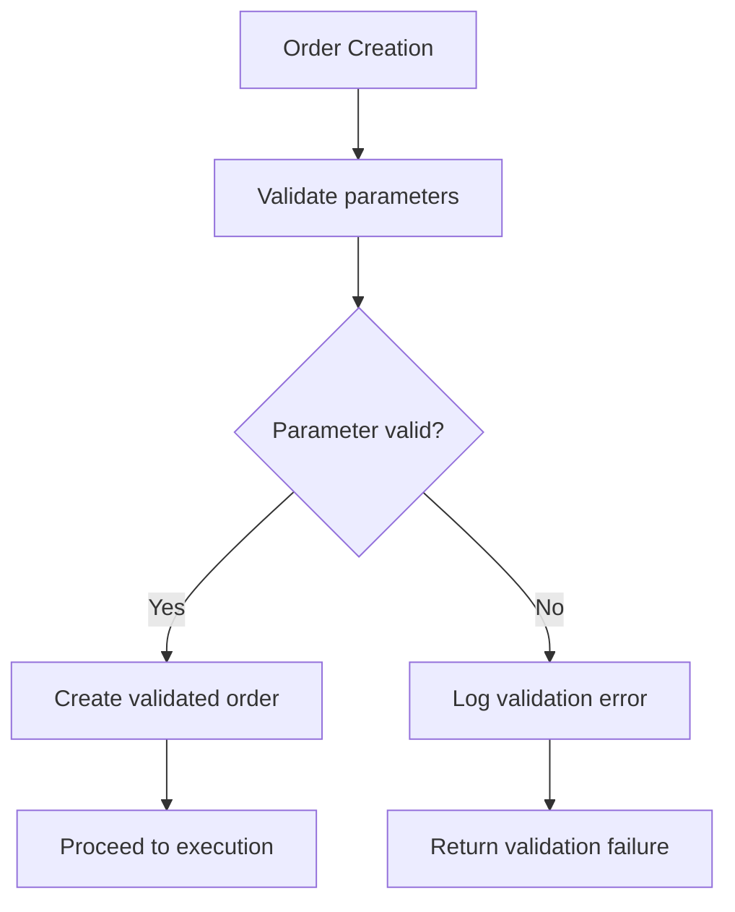
```mermaid
flowchart TD
A["Order Creation"] --> B["Validate parameters"]
B --> C{"Parameter valid?"}
C --> |Yes| D["Create validated order"]
C --> |No| E["Log validation error"]
E --> F["Return validation failure"]
D --> G["Proceed to execution"]
```

**Diagram sources**
- [domain.py:94-101](file://src/models/domain.py#L94-L101)
- [engine.py:210-216](file://src/paper_trading/engine.py#L210-L216)

#### API Key Validation Workflow
**New** Complete workflow for broker API key validation and connection establishment.

- API key initialization and validation
- Connection establishment with validation
- Authentication and authorization
- Error handling for authentication failures
- Demo mode fallback for development
- Connection status monitoring

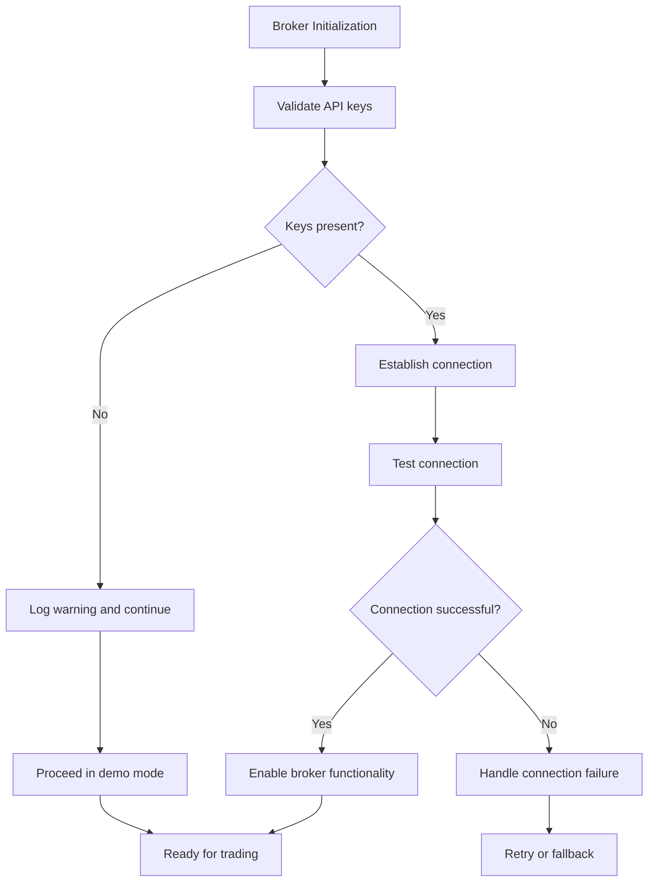
```mermaid
flowchart TD
A["Broker Initialization"] --> B["Validate API keys"]
B --> C{"Keys present?"}
C --> |Yes| D["Establish connection"]
C --> |No| E["Log warning and continue"]
D --> F["Test connection"]
F --> G{"Connection successful?"}
G --> |Yes| H["Enable broker functionality"]
G --> |No| I["Handle connection failure"]
E --> J["Proceed in demo mode"]
H --> K["Ready for trading"]
I --> L["Retry or fallback"]
J --> K
```

**Diagram sources**
- [brokers.py:126-143](file://src/live_trading/brokers.py#L126-L143)
- [brokers.py:342-360](file://src/live_trading/brokers.py#L342-L360)