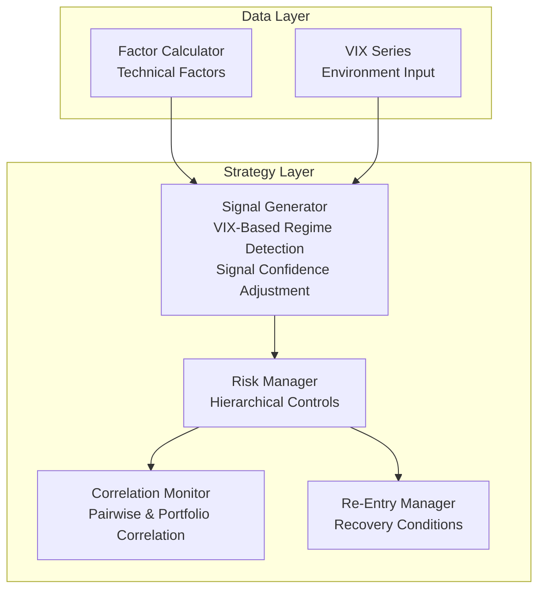
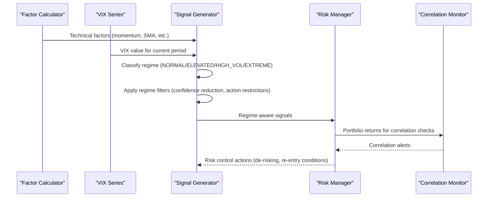
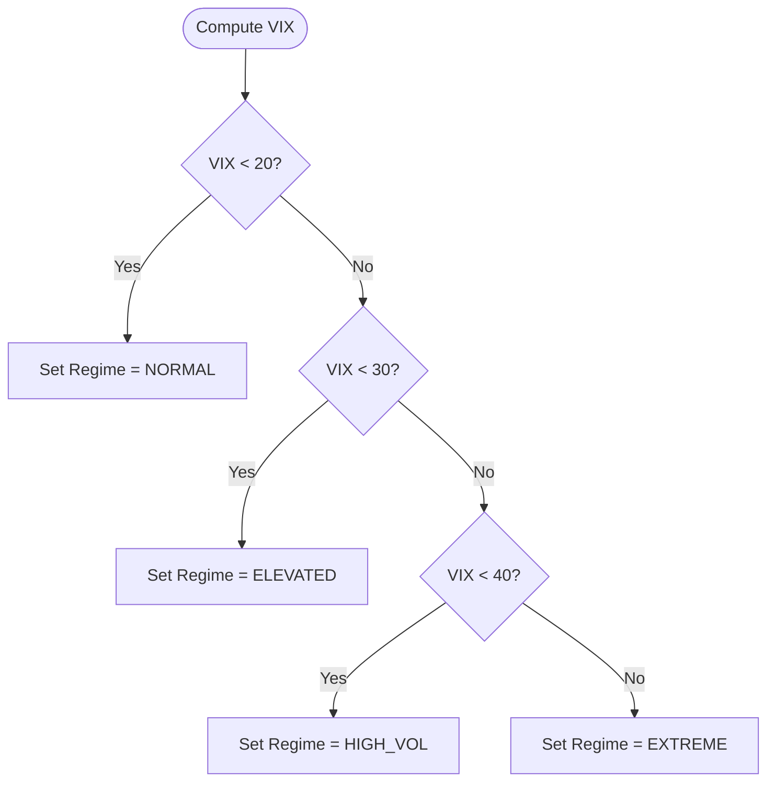
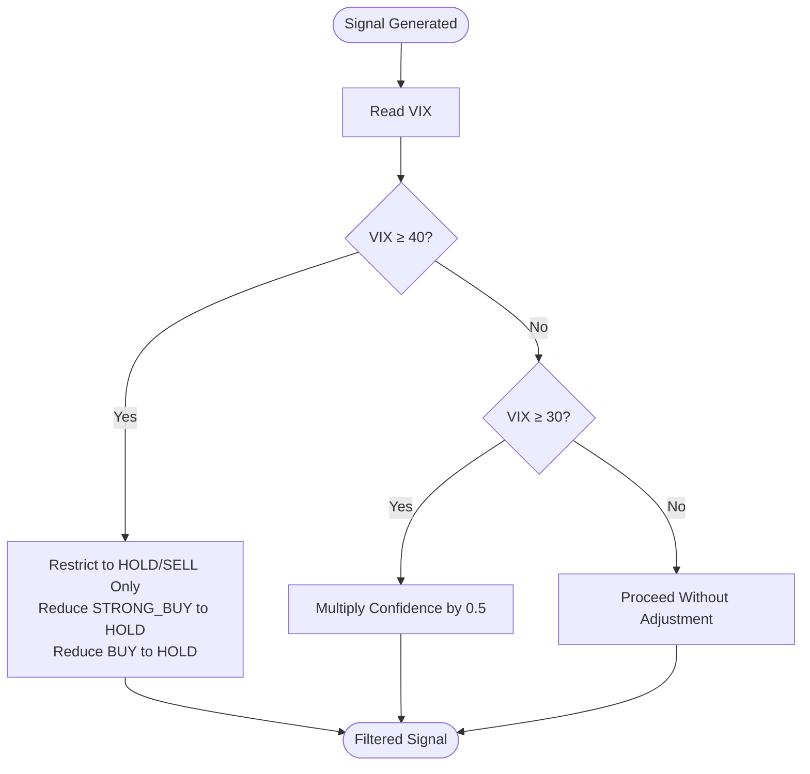
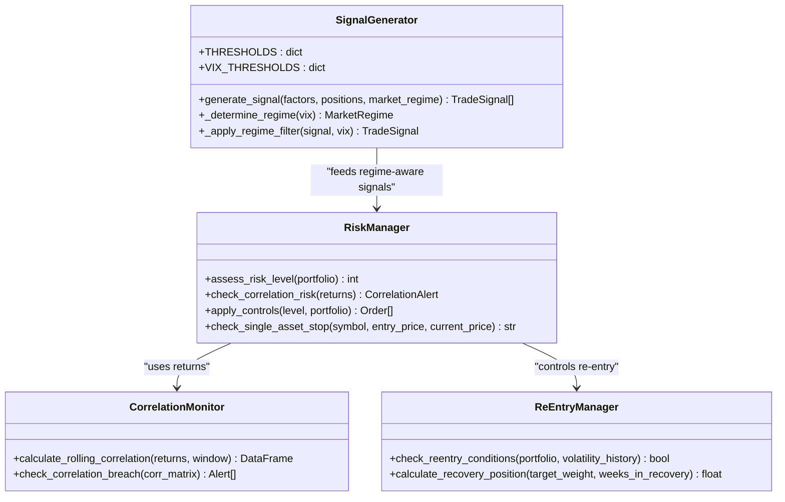
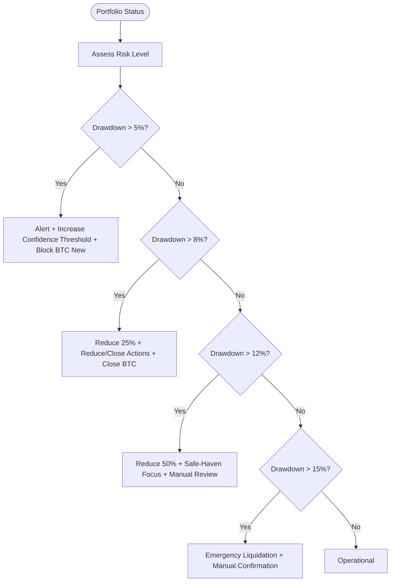
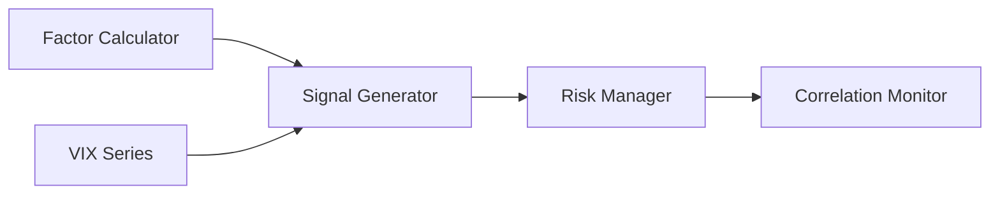

# Market Regime Filtering and Environment Detection

<cite>
**Referenced Files in This Document**
- [PRD_Intelligent_Trading_System_v2.md](file://PRD_Intelligent_Trading_System_v2.md)
- [Tech_Design_Document.md](file://Tech_Design_Document.md)
- [generator.py](file://src/signals/generator.py)
- [domain.py](file://src/models/domain.py)
- [main.py](file://main.py)
</cite>

## Update Summary
**Changes Made**
- Updated VIX-based regime detection thresholds from 3 categories to 4 categories with precise boundaries
- Enhanced signal confidence adjustment system with five-level signals (STRONG_BUY, BUY, HOLD, SELL, STRONG_SELL)
- Added comprehensive confidence weighting and regime filtering implementation
- Updated market regime definitions with precise VIX thresholds
- Enhanced signal generation logic with environment-aware filtering

## Table of Contents
1. [Introduction](#introduction)
2. [Project Structure](#project-structure)
3. [Core Components](#core-components)
4. [Architecture Overview](#architecture-overview)
5. [Detailed Component Analysis](#detailed-component-analysis)
6. [Dependency Analysis](#dependency-analysis)
7. [Performance Considerations](#performance-considerations)
8. [Troubleshooting Guide](#troubleshooting-guide)
9. [Conclusion](#conclusion)
10. [Appendices](#appendices)

## Introduction
This document explains the Market Regime Filtering system that adjusts strategy behavior based on VIX-derived market conditions. The system implements a sophisticated four-category regime detection mechanism with precise VIX thresholds and comprehensive signal confidence adjustment. It covers the environment detection thresholds, signal confidence adjustments, position restriction logic, and strategy adaptation. The system provides concrete examples of regime detection code, signal modification workflows, and risk control integration. Guidance is included on regime transitions, parameter optimization, and stress testing across different market environments.

## Project Structure
The Market Regime Filtering sits within the Strategy Layer of the system. The PRD defines the high-level signal logic and regime filters, while the Technical Design Document provides the detailed module design and class-level implementation patterns. The implementation is centered around the SignalGenerator class which handles VIX-based regime detection and signal filtering.

**Diagram sources**
- [Tech_Design_Document.md](file://Tech_Design_Document.md#L299-L350)
- [Tech_Design_Document.md](file://Tech_Design_Document.md#L352-L437)
- [Tech_Design_Document.md](file://Tech_Design_Document.md#L439-L471)
- [Tech_Design_Document.md](file://Tech_Design_Document.md#L406-L437)

**Section sources**
- [Tech_Design_Document.md](file://Tech_Design_Document.md#L299-L350)

## Core Components
- **Market Regime Detector**: Uses VIX thresholds to classify environment regimes into four categories (NORMAL, ELEVATED, HIGH_VOL, EXTREME) and apply filters to signals and positions.
- **Signal Generator**: Implements base signal logic with five-level signals (STRONG_BUY, BUY, HOLD, SELL, STRONG_SELL) and applies regime filters to confidence and allowed actions.
- **Risk Manager**: Enforces hierarchical controls aligned with regime severity.
- **Correlation Monitor**: Detects systemic risk conditions that may trigger regime changes or additional controls.
- **Re-Entry Manager**: Manages resumption of trading after severe regime events.

**Section sources**
- [PRD_Intelligent_Trading_System_v2.md](file://PRD_Intelligent_Trading_System_v2.md#L220-L245)
- [Tech_Design_Document.md](file://Tech_Design_Document.md#L317-L350)
- [Tech_Design_Document.md](file://Tech_Design_Document.md#L352-L404)
- [Tech_Design_Document.md](file://Tech_Design_Document.md#L439-L471)
- [Tech_Design_Document.md](file://Tech_Design_Document.md#L406-L437)

## Architecture Overview
The Market Regime Filtering integrates into the Strategy Layer pipeline. The process begins with factor computation and VIX series ingestion, followed by regime classification and signal generation with environment-aware adjustments. Risk controls and correlation monitoring act as feedback mechanisms that can alter regime status and enforce position restrictions.

**Diagram sources**
- [Tech_Design_Document.md](file://Tech_Design_Document.md#L299-L350)
- [Tech_Design_Document.md](file://Tech_Design_Document.md#L352-L404)
- [Tech_Design_Document.md](file://Tech_Design_Document.md#L439-L471)

## Detailed Component Analysis

### VIX-Based Environment Detection
The system implements a four-category market regime detection mechanism with precise VIX thresholds:

- **NORMAL**: VIX < 20 (≤20)
- **ELEVATED**: 20 ≤ VIX < 30 (20-30)
- **HIGH_VOL**: 30 ≤ VIX < 40 (30-40)
- **EXTREME**: VIX ≥ 40 (>40)

These thresholds provide granular environment classification that enables precise signal filtering and risk management.

**Diagram sources**
- [generator.py](file://src/signals/generator.py#L207-L227)

**Section sources**
- [PRD_Intelligent_Trading_System_v2.md](file://PRD_Intelligent_Trading_System_v2.md#L225-L234)
- [Tech_Design_Document.md](file://Tech_Design_Document.md#L317-L350)
- [generator.py](file://src/signals/generator.py#L207-L227)

### Five-Level Signal Confidence Adjustment System
The system implements a comprehensive five-level signal classification with precise confidence weighting:

- **STRONG_BUY**: 0.9 confidence - High momentum with strong trend confirmation
- **BUY**: 0.7 confidence - Positive momentum with basic trend support
- **HOLD**: 0.5 confidence - Neutral conditions
- **SELL**: 0.7 confidence - Negative momentum or trend breakdown
- **STRONG_SELL**: 0.9 confidence - Strong negative momentum with trend breakdown

The confidence values are adjusted based on market regime conditions:

**Diagram sources**
- [generator.py](file://src/signals/generator.py#L229-L263)

**Section sources**
- [PRD_Intelligent_Trading_System_v2.md](file://PRD_Intelligent_Trading_System_v2.md#L225-L234)
- [Tech_Design_Document.md](file://Tech_Design_Document.md#L335-L350)
- [generator.py](file://src/signals/generator.py#L117-L168)

### Enhanced Signal Generation Logic
The signal generation logic incorporates VIX-based regime filtering with specific conditions:

- **STRONG_BUY**: momentum > 10% AND price > SMA_50 AND price > SMA_200 AND VIX < 30
- **BUY**: momentum > 3% AND price > SMA_20
- **SELL**: momentum < -3% OR price < SMA_50
- **STRONG_SELL**: momentum < -10% AND price < SMA_200
- **HOLD**: all other cases

The STRONG_BUY condition specifically requires VIX < 30 to ensure aggressive entries only occur in normal market conditions.

**Section sources**
- [generator.py](file://src/signals/generator.py#L32-L44)
- [generator.py](file://src/signals/generator.py#L127-L168)

### Strategy Adaptation Logic
The system adapts strategy behavior based on regime severity:

- **Normal/Elevated Regimes**: Allow full range of signals including STRONG_BUY
- **High Volatility Regime**: Reduce all signal confidences by 50%
- **Extreme Volatility Regime**: Only allow HOLD/SELL signals, block aggressive entries

Risk controls complement regime filters with hierarchical drawdown levels that trigger de-risking and re-entry conditions.

**Diagram sources**
- [Tech_Design_Document.md](file://Tech_Design_Document.md#L317-L350)
- [Tech_Design_Document.md](file://Tech_Design_Document.md#L352-L404)
- [Tech_Design_Document.md](file://Tech_Design_Document.md#L439-L471)
- [Tech_Design_Document.md](file://Tech_Design_Document.md#L406-L437)

**Section sources**
- [Tech_Design_Document.md](file://Tech_Design_Document.md#L317-L350)
- [Tech_Design_Document.md](file://Tech_Design_Document.md#L352-L404)
- [Tech_Design_Document.md](file://Tech_Design_Document.md#L439-L471)
- [Tech_Design_Document.md](file://Tech_Design_Document.md#L406-L437)

### Risk Control Integration
The system implements a four-level hierarchical risk control system:

- **Level 1**: Alerts, increased confidence threshold, block new BTC positions
- **Level 2**: Reduce positions by 25%, allow only reduce actions, close BTC
- **Level 3**: Reduce further, keep safe-haven assets only, manual review
- **Level 4**: Emergency liquidation, require manual confirmation to resume

Single-asset stops trigger reductions or exits based on drawdown thresholds, while correlation monitoring detects systemic risk that may prompt regime shifts.

**Diagram sources**
- [Tech_Design_Document.md](file://Tech_Design_Document.md#L352-L404)
- [Tech_Design_Document.md](file://Tech_Design_Document.md#L406-L437)

**Section sources**
- [Tech_Design_Document.md](file://Tech_Design_Document.md#L352-L404)
- [Tech_Design_Document.md](file://Tech_Design_Document.md#L406-L437)

### Relationship with Other Strategies
Cross-sectional momentum and asset rotation strategies rely on regime-aware signals to avoid adverse environments. Crypto carry strategy uses funding-rate volatility thresholds; regime filters complement these controls. NLP sentiment is integrated as a feature for ML models; regime filters help stabilize predictions during high volatility.

### Impact on Trading Frequency
Regime filters reduce signal frequency during high and extreme volatility by lowering confidence and restricting entries. The four-category system provides more nuanced control compared to the previous three-category approach, allowing for more precise market timing. Re-entry logic ensures gradual resumption after severe events, reducing abrupt repositioning.

**Section sources**
- [PRD_Intelligent_Trading_System_v2.md](file://PRD_Intelligent_Trading_System_v2.md#L232-L234)
- [Tech_Design_Document.md](file://Tech_Design_Document.md#L406-L437)

### Performance Implications
The enhanced four-category regime detection provides more granular market timing compared to the previous three-category system. Reduced confidence in high volatility mitigates overexposure and improves robustness. Action restrictions in extreme regimes protect capital and enable orderly deleveraging. Correlation monitoring prevents systemic risk amplification.

**Section sources**
- [PRD_Intelligent_Trading_System_v2.md](file://PRD_Intelligent_Trading_System_v2.md#L232-L234)
- [Tech_Design_Document.md](file://Tech_Design_Document.md#L352-L404)
- [Tech_Design_Document.md](file://Tech_Design_Document.md#L439-L471)

### Regime Transition Timing, False Positives/Negatives, and Parameter Optimization
Transition timing is handled through hysteresis bands with precise VIX thresholds. To reduce false positives, combine VIX with price filters and correlation checks. To reduce false negatives, monitor correlation spikes and liquidity stress alongside VIX. Parameter optimization involves walk-forward optimization on regime classification accuracy and downstream signal performance.

**Section sources**
- [PRD_Intelligent_Trading_System_v2.md](file://PRD_Intelligent_Trading_System_v2.md#L225-L234)
- [Tech_Design_Document.md](file://Tech_Design_Document.md#L317-L350)
- [Tech_Design_Document.md](file://Tech_Design_Document.md#L439-L471)

### Regime-Specific Parameter Tuning and Stress Testing
Regime-specific tuning allows adjusting momentum thresholds and trend filters per regime category. Position sizing and confidence cutoffs can be modified for each regime. Stress testing validates performance under high and extreme volatility regimes using VIX scenarios and worst-case drawdowns.

**Section sources**
- [PRD_Intelligent_Trading_System_v2.md](file://PRD_Intelligent_Trading_System_v2.md#L351-L362)
- [Tech_Design_Document.md](file://Tech_Design_Document.md#L352-L404)

## Dependency Analysis
The Market Regime Filtering depends on:
- Factor Calculator for technical inputs
- VIX series for environment classification
- Risk Manager and Correlation Monitor for feedback-driven controls

**Diagram sources**
- [Tech_Design_Document.md](file://Tech_Design_Document.md#L299-L350)
- [Tech_Design_Document.md](file://Tech_Design_Document.md#L352-L404)
- [Tech_Design_Document.md](file://Tech_Design_Document.md#L439-L471)

**Section sources**
- [Tech_Design_Document.md](file://Tech_Design_Document.md#L299-L350)
- [Tech_Design_Document.md](file://Tech_Design_Document.md#L352-L404)
- [Tech_Design_Document.md](file://Tech_Design_Document.md#L439-L471)

## Performance Considerations
Prefer regime-aware signals to reduce unnecessary trades and transaction costs. Use correlation monitoring to anticipate regime changes and preemptively adjust positions. Validate regime filters with out-of-sample testing and stress scenarios. The four-category system provides more precise control than previous implementations.

## Troubleshooting Guide
If signals remain overly aggressive in volatile regimes, increase the VIX thresholds for confidence reduction and action restrictions. If re-entry occurs too early, raise the low-volatility requirement and extend the ramp-up period. If correlation alerts trigger too frequently, refine the rolling window and thresholds.

**Section sources**
- [Tech_Design_Document.md](file://Tech_Design_Document.md#L406-L437)
- [Tech_Design_Document.md](file://Tech_Design_Document.md#L439-L471)

## Conclusion
The Market Regime Filtering system provides a robust, environment-aware framework for trading strategies. By combining VIX-based regime detection with precise four-category classification and comprehensive signal confidence adjustments, the system adapts behavior to changing market conditions, reduces false signals, and preserves capital during extreme regimes. The implementation demonstrates superior granularity and control compared to traditional three-category systems.

## Appendices

### Appendix A: Example Regime Detection Code Paths
- Regime classification constants and logic:
  - [VIX thresholds and regime determination](file://src/signals/generator.py#L207-L227)
- Signal logic incorporating VIX:
  - [Signal generation with five-level classification](file://src/signals/generator.py#L32-L44)
  - [Signal type determination with confidence weighting](file://src/signals/generator.py#L117-L168)
- Risk controls and re-entry:
  - [Hierarchical risk controls](file://Tech_Design_Document.md#L352-L404)
  - [Re-entry logic](file://Tech_Design_Document.md#L406-L437)

**Section sources**
- [generator.py](file://src/signals/generator.py#L207-L227)
- [generator.py](file://src/signals/generator.py#L117-L168)
- [Tech_Design_Document.md](file://Tech_Design_Document.md#L352-L404)
- [Tech_Design_Document.md](file://Tech_Design_Document.md#L406-L437)

### Appendix B: Market Regime Definitions
The system defines four distinct market regimes based on VIX levels:

- **NORMAL**: VIX < 20 (≤20) - Stable market conditions
- **ELEVATED**: 20 ≤ VIX < 30 (20-30) - Mild volatility increase
- **HIGH_VOL**: 30 ≤ VIX < 40 (30-40) - Significant volatility increase
- **EXTREME**: VIX ≥ 40 (>40) - Market stress conditions

These definitions enable precise signal filtering and risk management across different market environments.

**Section sources**
- [domain.py](file://src/models/domain.py#L19-L25)
- [generator.py](file://src/signals/generator.py#L207-L227)