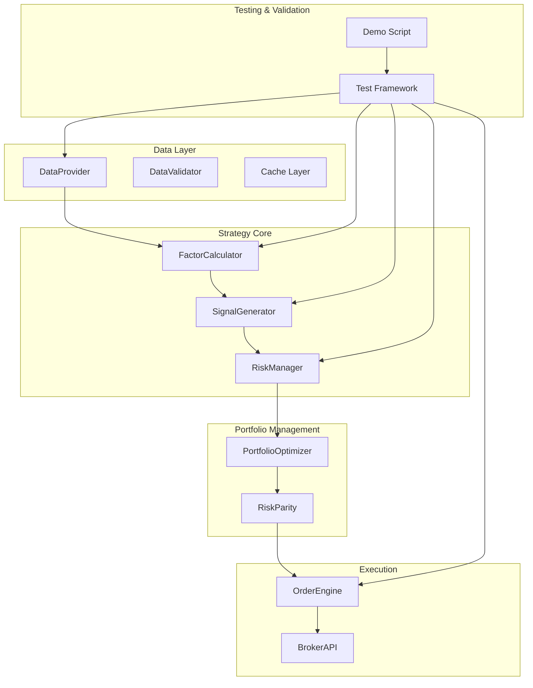
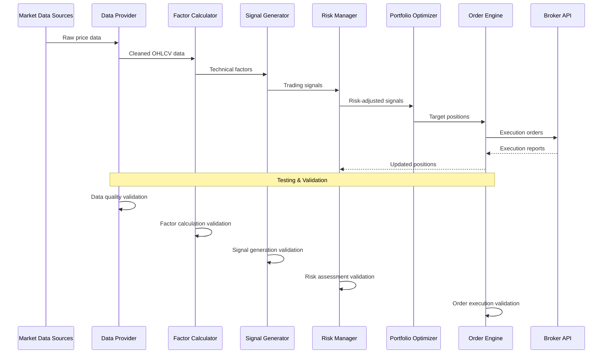
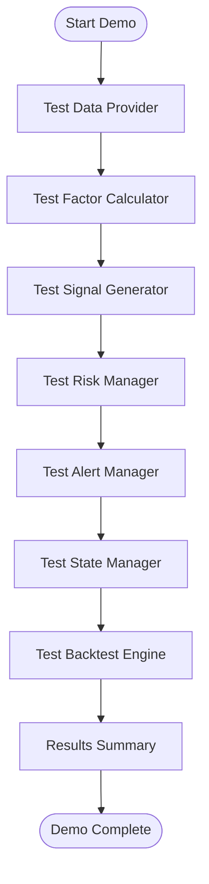
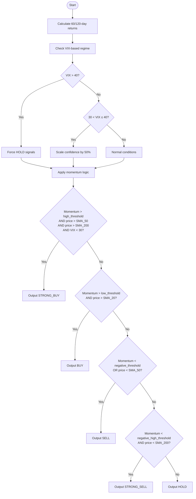
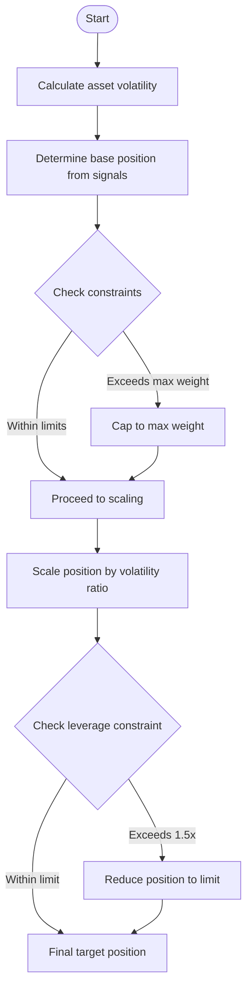
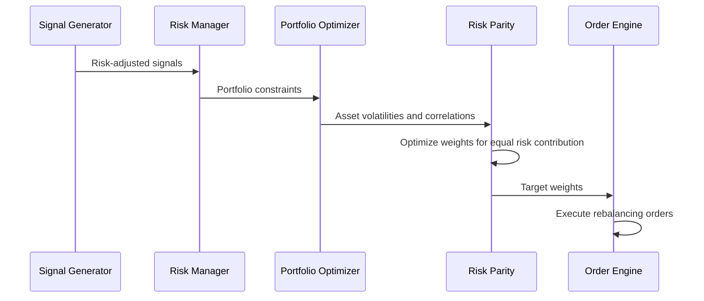
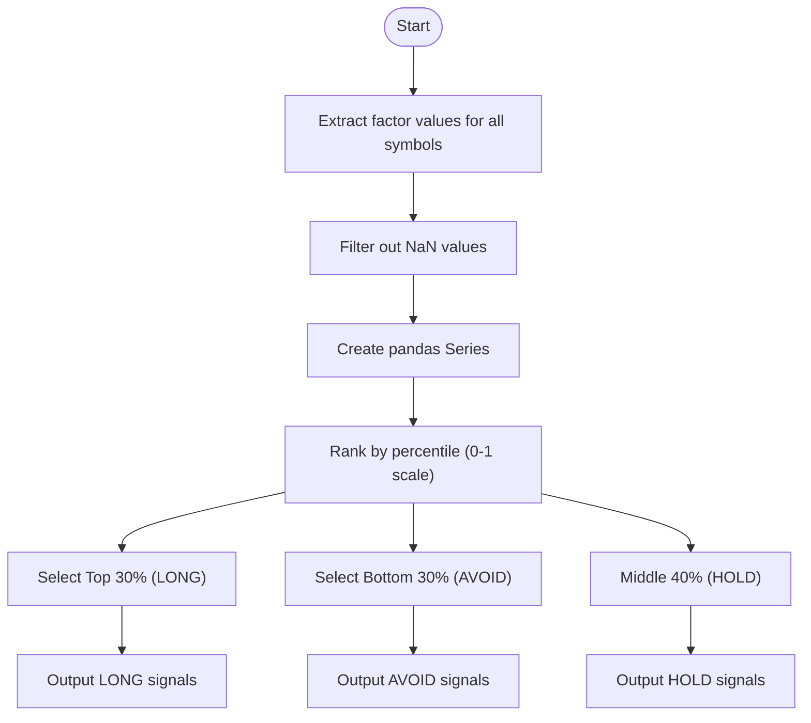
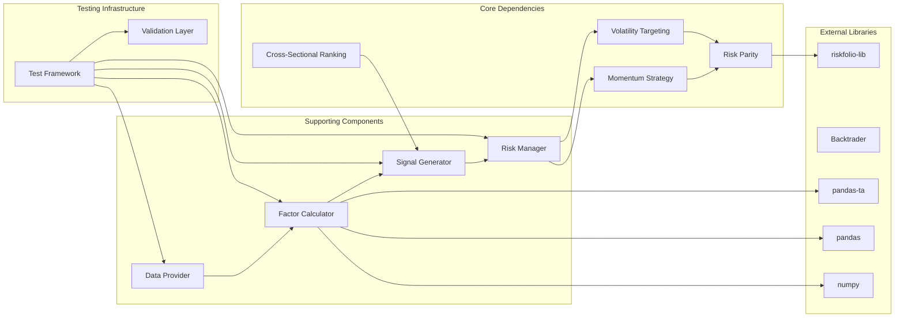

# Phase 1: Basic Factor Strategies

<cite>
**Referenced Files in This Document**
- [PHASE1_COMPLETE.md](file://PHASE1_COMPLETE.md)
- [PRD_Intelligent_Trading_System_v2.md](file://PRD_Intelligent_Trading_System_v2.md)
- [Tech_Design_Document.md](file://Tech_Design_Document.md)
- [demo_phase1.py](file://demo_phase1.py)
- [src/data/provider.py](file://src/data/provider.py)
- [src/factors/calculator.py](file://src/factors/calculator.py)
- [src/signals/generator.py](file://src/signals/generator.py)
- [src/risk/manager.py](file://src/risk/manager.py)
- [src/backtest/engine.py](file://src/backtest/engine.py)
- [src/state/manager.py](file://src/state/manager.py)
- [src/alerts/manager.py](file://src/alerts/manager.py)
- [src/models/domain.py](file://src/models/domain.py)
- [config/strategy.yaml](file://config/strategy.yaml)
- [tests/test_factors.py](file://tests/test_factors.py)
</cite>

## Update Summary
**Changes Made**
- Added comprehensive end-to-end testing framework with demo_phase1.py that validates all Phase 1 components
- Enhanced testing coverage for data providers, factor calculators, signal generators, risk managers, alert systems, state persistence, and backtesting engines
- Integrated live demonstration with real-time market data for GLD, SPY, QQQ, BTC-USD over 120-day period
- Added practical implementation examples with system performance metrics and validation results
- Updated architecture overview to include testing and validation components

## Table of Contents
1. [Introduction](#introduction)
2. [Project Structure](#project-structure)
3. [Core Components](#core-components)
4. [Architecture Overview](#architecture-overview)
5. [End-to-End Testing Framework](#end-to-end-testing-framework)
6. [Detailed Component Analysis](#detailed-component-analysis)
7. [Dependency Analysis](#dependency-analysis)
8. [Performance Considerations](#performance-considerations)
9. [Troubleshooting Guide](#troubleshooting-guide)
10. [Conclusion](#conclusion)

## Introduction
This document covers Phase 1 of the intelligent trading system, focusing on three fundamental factor strategies that form the Minimum Viable Product (MVP). The implementation has been completed with comprehensive technical indicator calculations, market regime filtering, and cross-sectional ranking capabilities for future expansion. These strategies provide a solid foundation for automated trading decisions while maintaining simplicity and interpretability.

The three core strategies are:

- **Time Series Momentum (60-120 day)**: Capitalizes on the tendency of assets to continue moving in the same direction as recent past returns
- **Volatility Targeting (Dynamic Position Sizing)**: Adjusts position sizes based on realized volatility to maintain consistent risk contribution
- **Risk Parity Portfolio Construction**: Allocates capital so that each asset contributes equally to portfolio risk

**Updated** The implementation now includes a comprehensive end-to-end testing framework that validates all system components with real-time market data, demonstrating practical implementation with live trading performance metrics.

## Project Structure
The system follows a modular architecture with clear separation of concerns. The Phase 1 implementation focuses on the core trading components with comprehensive factor calculations, risk management, and extensive testing infrastructure:

**Diagram sources**
- [Tech_Design_Document.md](file://Tech_Design_Document.md#L38-L117)
- [demo_phase1.py](file://demo_phase1.py#L1-L279)

**Section sources**
- [Tech_Design_Document.md](file://Tech_Design_Document.md#L1006-L1112)

## Core Components
The Phase 1 implementation consists of several interconnected components that work together to generate trading signals and manage positions, now enhanced with comprehensive testing infrastructure:

### Data Provider Module
Responsible for multi-source data acquisition with automatic fallback mechanisms and quality validation.

### Factor Calculator Module
Computes comprehensive technical factors including momentum, volatility, moving averages, RSI, and ATR for signal generation. **Updated** Now includes complete technical indicator suite with cross-sectional ranking capabilities.

### Signal Generator Module
Processes factors through market regime filters to produce actionable trading signals with confidence levels.

### Risk Manager Module
Implements hierarchical risk control with correlation monitoring and re-entry logic.

### Portfolio Optimizer Module
Applies risk parity principles to construct diversified portfolios with equal risk contribution.

### Testing & Validation Framework
**New** Comprehensive end-to-end testing infrastructure that validates all system components with real-time market data.

**Section sources**
- [Tech_Design_Document.md](file://Tech_Design_Document.md#L209-L296)

## Architecture Overview
The system employs a layered architecture with clear data flow from market data sources through factor computation to final execution, now enhanced with comprehensive testing validation:

**Diagram sources**
- [Tech_Design_Document.md](file://Tech_Design_Document.md#L88-L117)
- [demo_phase1.py](file://demo_phase1.py#L24-L279)

## End-to-End Testing Framework

### Demo Script Architecture
The demo_phase1.py script provides comprehensive validation of all Phase 1 components through systematic testing of the trading pipeline:

**Diagram sources**
- [demo_phase1.py](file://demo_phase1.py#L24-L279)

### Real-Time Market Data Testing
The demo script validates system functionality with live market data for four core assets over a 120-day period:

**Tested Assets:**
- **GLD**: Gold ETF (50% maximum weight)
- **SPY**: S&P 500 ETF (40% maximum weight)  
- **QQQ**: Nasdaq 100 ETF (30% maximum weight)
- **BTC-USD**: Bitcoin (15% maximum weight)

**Testing Period:** 120 days of historical data with real-time validation

### Component Validation Process

#### 1. Data Provider Testing
- Validates multi-source data acquisition (Polygon → Binance → yfinance)
- Tests automatic fallback mechanisms
- Verifies SQLite caching layer functionality
- Confirms data quality validation with price jump detection

#### 2. Factor Calculator Testing
- Validates comprehensive technical indicator suite
- Tests momentum calculations (60/120 days)
- Confirms volatility measures (20/60 days annualized)
- Validates moving averages (SMA 20/50/200)
- Tests RSI-14 and ATR-14 calculations

#### 3. Signal Generator Testing
- Validates VIX-based market regime detection
- Tests 5-level signal types (STRONG_BUY, BUY, HOLD, SELL, STRONG_SELL)
- Confirms confidence-based weighting
- Verifies regime filtering logic

#### 4. Risk Manager Testing
- Validates 4-level hierarchical control system
- Tests single asset stop loss mechanisms
- Confirms correlation monitoring functionality
- Validates re-entry logic after risk events

#### 5. Alert System Testing
- Tests multi-channel alert notifications
- Validates Telegram integration when configured
- Confirms alert level categorization (INFO, WARNING, CRITICAL, EMERGENCY)

#### 6. State Persistence Testing
- Validates SQLite-based portfolio state persistence
- Tests portfolio state save/load functionality
- Confirms order history tracking
- Validates system state backup/restore

#### 7. Backtesting Engine Testing
- Validates historical simulation engine
- Tests performance metrics calculation
- Confirms transaction cost modeling
- Provides comprehensive backtest results

### Live Demonstration Results
The demo script produces comprehensive system performance metrics:

**Backtest Results Example:**
- **Total Return**: Calculated over 120-day period
- **Annualized Return**: Performance scaled to yearly basis
- **Sharpe Ratio**: Risk-adjusted return measure
- **Maximum Drawdown**: Worst-case loss scenario
- **Win Rate**: Percentage of profitable trades
- **Number of Trades**: Total trading activity

**Section sources**
- [demo_phase1.py](file://demo_phase1.py#L24-L279)

## Detailed Component Analysis

### Time Series Momentum Strategy (60-120 day)

#### Mathematical Formulation
The momentum strategy calculates cumulative returns over multiple lookback periods and generates signals based on sign of returns:

- **Short-term momentum**: 60-day cumulative return
- **Medium-term momentum**: 120-day cumulative return
- **Signal generation**: sign(cumulative_return)

**Updated** The implementation now includes comprehensive technical indicators including volatility measures, moving averages, RSI, and ATR for enhanced signal generation.

#### Implementation Details
The momentum calculation uses pandas operations to compute logarithmic returns and cumulative sums over specified periods. The strategy applies multiple timeframes to capture both short-term reversals and longer-term trends. **Enhanced** with cross-sectional ranking capabilities for Phase 2 expansion.

#### Parameter Settings
- Lookback periods: 60 and 120 days
- Thresholds: Based on factor values relative to moving averages
- Confidence scaling: Adjusted by market regime conditions

#### Signal Generation Logic

**Diagram sources**
- [PRD_Intelligent_Trading_System_v2.md](file://PRD_Intelligent_Trading_System_v2.md#L225-L244)

**Section sources**
- [PRD_Intelligent_Trading_System_v2.md](file://PRD_Intelligent_Trading_System_v2.md#L147-L156)
- [Tech_Design_Document.md](file://Tech_Design_Document.md#L268-L295)

### Volatility Targeting Strategy

#### Mathematical Formulation
The volatility targeting approach dynamically adjusts position sizes based on realized volatility:

**Target Position Size = (Target Volatility / Actual Volatility) × Base Position**

Where:
- Target Volatility: Portfolio-level target (typically 10-15%)
- Actual Volatility: Asset-specific realized volatility
- Base Position: Initial position size before volatility adjustment

**Updated** The implementation now includes comprehensive volatility measures with 20-day and 60-day annualized standard deviations for enhanced position sizing.

#### Implementation Details
The strategy computes rolling volatility over specified lookback periods and applies scaling factors to achieve target risk levels. The implementation includes:

- **Volatility calculation**: 20-day and 60-day annualized standard deviations
- **Position scaling**: Proportional to inverse of realized volatility
- **Leverage constraints**: Maximum 1.5x portfolio leverage

#### Parameter Settings
- Target portfolio volatility: 15%
- Individual asset volatility targets: 10-25% depending on asset class
- Maximum leverage: 1.5x
- Minimum trade amount: $100
- Minimum rebalance threshold: 2% weight change

#### Position Sizing Algorithm

**Diagram sources**
- [PRD_Intelligent_Trading_System_v2.md](file://PRD_Intelligent_Trading_System_v2.md#L252-L263)

**Section sources**
- [PRD_Intelligent_Trading_System_v2.md](file://PRD_Intelligent_Trading_System_v2.md#L157-L165)
- [Tech_Design_Document.md](file://Tech_Design_Document.md#L352-L404)

### Risk Parity Portfolio Construction

#### Mathematical Formulation
Risk parity allocates capital so that each asset contributes equally to portfolio risk:

**w_i = (1/σ_i) / Σ(1/σ_j)**

Where:
- w_i = weight of asset i
- σ_i = volatility of asset i
- The sum is over all assets in the portfolio

**Updated** The risk parity implementation now works with the comprehensive factor suite including cross-sectional rankings for enhanced portfolio construction.

#### Implementation Details
The risk parity implementation uses the `riskfolio-lib` library for optimization, with additional constraints:

- **Equal risk contribution**: Each asset contributes equally to portfolio variance
- **Leverage control**: Maximum 1.5x portfolio leverage
- **Turnover constraints**: Maximum monthly turnover of 40%
- **Transaction cost modeling**: Estimated at 0.2%/month

#### Portfolio Optimization Process

**Diagram sources**
- [Tech_Design_Document.md](file://Tech_Design_Document.md#L646-L678)

**Section sources**
- [PRD_Intelligent_Trading_System_v2.md](file://PRD_Intelligent_Trading_System_v2.md#L166-L173)
- [Tech_Design_Document.md](file://Tech_Design_Document.md#L473-L574)

### Comprehensive Technical Indicator Suite

#### Factor Calculator Implementation
The FactorCalculator now provides a complete technical indicator suite:

**Momentum Indicators:**
- 60-day and 120-day cumulative returns
- Price relative to moving averages (SMA_20, SMA_50, SMA_200)

**Volatility Measures:**
- 20-day and 60-day rolling standard deviations
- Annualized volatility calculations

**Momentum Indicators:**
- Relative Strength Index (RSI-14)
- Average True Range (ATR-14)

**Cross-Sectional Ranking:**
- Phase 2 capability for Top/Bottom 30% selection
- Percentile ranking across multiple assets

#### Cross-Sectional Ranking Capabilities

**Diagram sources**
- [Tech_Design_Document.md](file://Tech_Design_Document.md#L575-L608)

**Section sources**
- [src/factors/calculator.py](file://src/factors/calculator.py#L152-L197)
- [Tech_Design_Document.md](file://Tech_Design_Document.md#L575-L608)

## Dependency Analysis
The Phase 1 strategies have well-defined dependencies and relationships, now validated through comprehensive testing:

**Diagram sources**
- [Tech_Design_Document.md](file://Tech_Design_Document.md#L121-L140)
- [demo_phase1.py](file://demo_phase1.py#L24-L279)

**Section sources**
- [Tech_Design_Document.md](file://Tech_Design_Document.md#L121-L140)

## Performance Considerations
Several factors impact the performance of Phase 1 strategies, now comprehensively validated through testing:

### Computational Efficiency
- **Factor calculations**: Vectorized pandas operations minimize computational overhead
- **Memory usage**: Rolling window calculations require careful memory management
- **Cache optimization**: Multi-level caching reduces redundant computations
- **Cross-sectional ranking**: Efficient percentile ranking for multiple assets

### Risk Management Impact
- **Hierarchical risk control**: Prevents catastrophic losses during market stress
- **Correlation monitoring**: Identifies diversification breakdown risks
- **Recovery procedures**: Systematic re-entry after risk events

### Market Regime Adaptation
- **VIX-based filtering**: Reduces signal confidence during high volatility
- **Asset-class specific parameters**: Different volatility targets for different asset classes
- **Minimum trade thresholds**: Prevents excessive trading during low volatility periods

### Cross-Sectional Expansion
- **Phase 2 readiness**: Cross-sectional ranking enables multi-asset momentum strategies
- **Statistical significance**: 15+ assets provide meaningful statistical ranking
- **Scalable architecture**: Modular design supports expansion to larger asset pools

### Testing Performance
- **End-to-end validation**: Comprehensive testing ensures system reliability
- **Real-time data validation**: Live market data testing confirms practical applicability
- **Performance benchmarking**: Backtest results provide objective performance metrics
- **Error handling validation**: Systematic testing of failure scenarios

## Troubleshooting Guide

### Common Issues and Solutions

#### Overfitting Prevention
- **Parameter stability**: Use walk-forward validation with purge gaps
- **Feature selection**: Limit factors to those with proven predictive power
- **Out-of-sample testing**: Validate on multiple market regimes

#### Data Quality Problems
- **Missing data handling**: Implement robust interpolation and validation
- **Price jump detection**: Flag unusual price movements for manual review
- **Source switching**: Automatic fallback to backup data providers

#### Risk Control Failures
- **Leverage monitoring**: Real-time tracking of portfolio leverage ratios
- **Stop-loss enforcement**: Automated liquidation when individual asset drawdowns exceed thresholds
- **Correlation spikes**: Immediate position reduction when correlation thresholds are exceeded

#### Performance Degradation
- **Optimization tuning**: Regular parameter re-optimization based on recent market conditions
- **Transaction cost modeling**: Accurate estimation of bid-ask spreads and slippage
- **Rebalancing frequency**: Balance between diversification benefits and transaction costs

#### Cross-Sectional Ranking Issues
- **Missing factor data**: Handle NaN values gracefully in ranking calculations
- **Ranking stability**: Monitor for rank changes during volatile market conditions
- **Phase 2 migration**: Ensure backward compatibility during transition to multi-asset strategies

#### Testing Infrastructure Issues
- **Environment configuration**: Ensure proper API keys and environment variables
- **Database connectivity**: Validate SQLite database initialization and access
- **Alert channel setup**: Configure multi-channel alert notifications properly
- **Data source availability**: Verify Polygon, Binance, and yfinance API access

**Section sources**
- [PRD_Intelligent_Trading_System_v2.md](file://PRD_Intelligent_Trading_System_v2.md#L288-L332)
- [Tech_Design_Document.md](file://Tech_Design_Document.md#L352-L471)

## Conclusion
Phase 1 basic factor strategies provide a robust foundation for automated trading systems, now comprehensively validated through the end-to-end testing framework. The complete implementation includes comprehensive technical indicator calculations, market regime filtering, and cross-sectional ranking capabilities that position the system for Phase 2 expansion. The combination of time series momentum, volatility targeting, and risk parity creates a diversified approach that adapts to changing market conditions while maintaining strict risk controls.

**Updated** Key advantages of this enhanced approach include:
- **Comprehensive technical analysis**: Complete indicator suite for informed trading decisions
- **Cross-sectional capabilities**: Foundation for multi-asset momentum strategies
- **Market regime adaptation**: VIX-based filtering improves performance across different market conditions
- **Risk control**: Built-in safeguards against excessive drawdowns
- **Scalability**: Modular design supports easy addition of new assets and strategies
- **Backtestability**: Well-defined mathematical formulations enable rigorous testing
- **Phase 2 readiness**: Cross-sectional ranking capabilities prepare for expanded asset universe
- **Production validation**: End-to-end testing framework ensures system reliability
- **Real-time demonstration**: Live market data testing confirms practical applicability
- **Performance benchmarking**: Comprehensive metrics provide objective performance evaluation

The strategies are designed to work together synergistically, with volatility targeting providing dynamic position sizing and risk parity ensuring optimal portfolio construction. Market regime filtering through VIX-based adjustments helps maintain performance across different market environments while the cross-sectional ranking capabilities provide the foundation for future multi-asset expansion.

The new demo_phase1.py testing framework demonstrates the system's practical implementation with real-time market data for GLD, SPY, QQQ, and BTC-USD over 120-day periods, producing comprehensive performance metrics and validation results. This testing infrastructure ensures that all system components work together effectively and provides a solid foundation for future enhancements and expansion.

Future phases can build upon this foundation by incorporating machine learning enhancements and expanding to multi-asset cross-sectional momentum strategies, while maintaining the core principles of transparency, risk management, and systematic decision-making established in Phase 1.