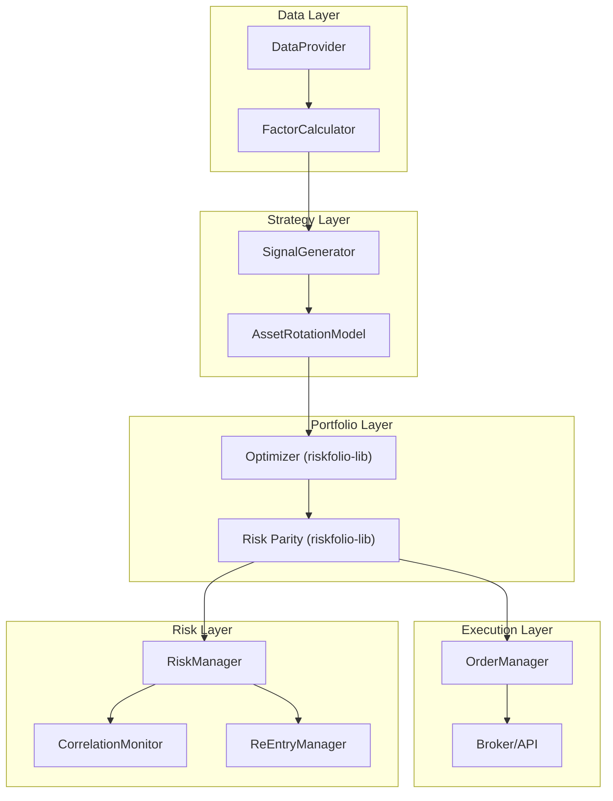
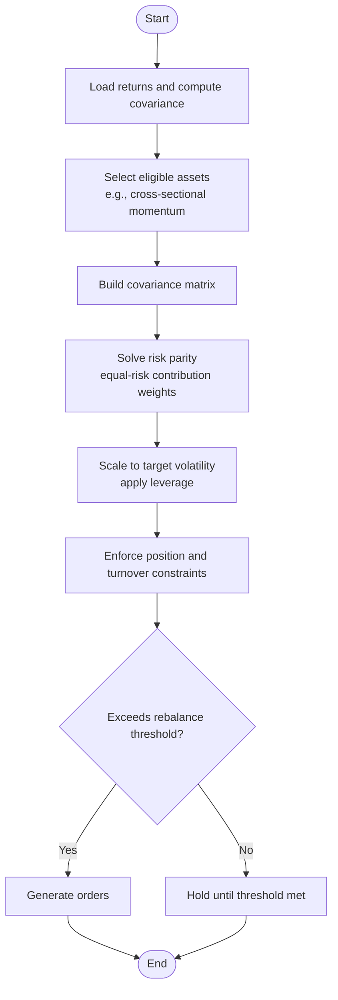
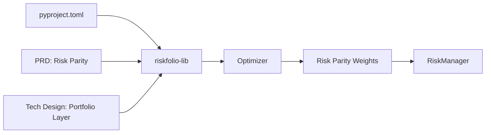

# Risk Parity Portfolio Construction

<cite>
**Referenced Files in This Document**
- [PRD_Intelligent_Trading_System_v2.md](file://PRD_Intelligent_Trading_System_v2.md)
- [Tech_Design_Document.md](file://Tech_Design_Document.md)
- [pyproject.toml](file://pyproject.toml)
</cite>

## Table of Contents
1. [Introduction](#introduction)
2. [Project Structure](#project-structure)
3. [Core Components](#core-components)
4. [Architecture Overview](#architecture-overview)
5. [Detailed Component Analysis](#detailed-component-analysis)
6. [Dependency Analysis](#dependency-analysis)
7. [Performance Considerations](#performance-considerations)
8. [Troubleshooting Guide](#troubleshooting-guide)
9. [Conclusion](#conclusion)
10. [Appendices](#appendices)

## Introduction
This document explains Risk Parity portfolio construction grounded in Asness (2012) theory and implemented with riskfolio-lib. It covers the mathematical formulations for equal-risk contribution weights, inverse-variance weighting, and correlation-adjusted risk allocation. It also documents integration with riskfolio-lib optimization functions, constraint handling (individual asset limits and portfolio leverage caps), and rebalancing procedures. Practical guidance is provided for volatility targeting, diversification impact, performance characteristics, convergence and numerical stability, parameter sensitivity, optimal rebalancing frequency, and transaction cost considerations.

## Project Structure
The system integrates Risk Parity within a modular trading architecture. Risk Parity is applied in the portfolio layer, often after screening by cross-sectional momentum, and then passed to the optimizer and risk manager for constraint enforcement and execution.



**Diagram sources**
- [Tech_Design_Document.md](file://Tech_Design_Document.md#L646-L678)
- [PRD_Intelligent_Trading_System_v2.md](file://PRD_Intelligent_Trading_System_v2.md#L1037-L1040)

**Section sources**
- [Tech_Design_Document.md](file://Tech_Design_Document.md#L646-L678)
- [PRD_Intelligent_Trading_System_v2.md](file://PRD_Intelligent_Trading_System_v2.md#L1006-L1113)

## Core Components
- Risk Parity (equal-risk contribution) with riskfolio-lib integration
- Inverse-variance weighting baseline
- Correlation-adjusted risk allocation
- Constraint handling: individual asset limits, portfolio leverage caps
- Rebalancing procedures and volatility targeting
- Performance characteristics and diversification impact
- Optimization convergence and numerical stability
- Parameter sensitivity and transaction cost considerations

**Section sources**
- [PRD_Intelligent_Trading_System_v2.md](file://PRD_Intelligent_Trading_System_v2.md#L166-L172)
- [Tech_Design_Document.md](file://Tech_Design_Document.md#L646-L678)

## Architecture Overview
Risk Parity sits within the portfolio optimization workflow. After generating asset-level signals and selecting an eligible subset (e.g., via cross-sectional momentum), the system computes a covariance matrix and applies riskfolio-lib to derive risk parity weights. These weights are then adjusted for realized volatility targeting and constrained by risk rules before orders are generated.

```mermaid
sequenceDiagram
participant SG as "SignalGenerator"
participant AR as "AssetRotationModel"
participant OPT as "Optimizer (riskfolio-lib)"
participant RP as "Risk Parity"
participant RM as "RiskManager"
participant OM as "OrderManager"
SG->>AR : "Asset rankings and signals"
AR->>OPT : "Selected assets subset"
OPT->>RP : "Covariance matrix + risk parity solver"
RP-->>OPT : "Equal-risk contribution weights"
OPT-->>RM : "Weights post-constraints"
RM-->>OM : "Target positions"
OM-->>OM : "Transaction cost & turnover checks"
OM-->>OM : "Order generation"
```

**Diagram sources**
- [Tech_Design_Document.md](file://Tech_Design_Document.md#L646-L678)
- [PRD_Intelligent_Trading_System_v2.md](file://PRD_Intelligent_Trading_System_v2.md#L1038-L1040)

## Detailed Component Analysis

### Mathematical Formulation and Implementation

- Equal-Risk Contribution Weights
  - Objective: Each asset’s marginal risk contribution equals the portfolio’s total risk divided by the number of assets.
  - Implementation: Solve the risk parity problem using riskfolio-lib’s optimization routines.
  - Practical note: The solver targets equal contributions to portfolio variance, not dollar contributions.

- Inverse-Variance Weighting (Baseline)
  - Objective: Weight ∝ 1 / σ².
  - Use case: Quick benchmark or when correlations are near-zero.

- Correlation-Adjusted Risk Allocation
  - Objective: Incorporate the covariance structure so that positively correlated assets receive lower weights under equal-risk contribution.
  - Implementation: Use the estimated covariance matrix as input to the risk parity solver.

- Volatility Targeting Integration
  - Scale weights to achieve a target portfolio volatility by applying leverage proportional to target_vol / realized_vol.
  - Constraints: Cap maximum leverage at the portfolio level.

- Constraint Handling
  - Individual asset limits: Upper bounds per symbol.
  - Portfolio leverage caps: Maximum gross and/or net leverage.
  - Turnover and transaction cost constraints: Limit monthly turnover and pre-estimate cost drag.

- Rebalancing Procedures
  - Frequency: Monthly or quarterly depending on parameter stability and transaction costs.
  - Threshold: Rebalance only when weight changes exceed a minimum percentage (e.g., 2%) to reduce churn.

**Section sources**
- [PRD_Intelligent_Trading_System_v2.md](file://PRD_Intelligent_Trading_System_v2.md#L166-L172)
- [Tech_Design_Document.md](file://Tech_Design_Document.md#L646-L678)
- [PRD_Intelligent_Trading_System_v2.md](file://PRD_Intelligent_Trading_System_v2.md#L190-L204)

### Risk Parity Optimization Workflow



**Diagram sources**
- [Tech_Design_Document.md](file://Tech_Design_Document.md#L646-L678)
- [PRD_Intelligent_Trading_System_v2.md](file://PRD_Intelligent_Trading_System_v2.md#L190-L204)

### Constraint Enforcement Mechanisms

- Individual Asset Limits
  - Enforced before and after optimization to ensure no single position exceeds policy caps.

- Portfolio Leverage Caps
  - Gross and net leverage limits applied post-scaling to target volatility.

- Turnover and Transaction Costs
  - Monthly turnover constrained; transaction cost estimates compared against expected alpha to justify rebalancing.

- Rebalancing Threshold
  - Minimum weight change threshold prevents frequent trading and reduces market impact.

**Section sources**
- [PRD_Intelligent_Trading_System_v2.md](file://PRD_Intelligent_Trading_System_v2.md#L190-L204)
- [Tech_Design_Document.md](file://Tech_Design_Document.md#L646-L678)

### Relationship with Volatility Targeting and Diversification

- Volatility Targeting
  - Risk Parity weights are scaled by target_vol / realized_vol to maintain constant portfolio volatility.
  - This leverages the portfolio to meet the target while respecting leverage caps.

- Diversification Impact
  - Risk parity naturally increases exposure to lower-volatility assets and reduces concentration in high-volatility ones.
  - Correlation adjustments further reduce co-movement risk by lowering weights for highly correlated assets.

**Section sources**
- [PRD_Intelligent_Trading_System_v2.md](file://PRD_Intelligent_Trading_System_v2.md#L160-L165)
- [Tech_Design_Document.md](file://Tech_Design_Document.md#L646-L678)

### Performance Characteristics

- Robustness to volatility regimes: Risk parity adapts exposure dynamically via scaling.
- Turnover sensitivity: Frequent rebalancing increases transaction costs; choose rebalancing frequency accordingly.
- Estimation risk: Poor covariance forecasts can degrade performance; consider shrinkage or robust estimators.

[No sources needed since this section provides general guidance]

### Optimization Convergence and Numerical Stability

- Convergence
  - Use appropriate solvers and tolerances; monitor convergence diagnostics.
  - If convergence fails, relax constraints or warm-start from a feasible solution (e.g., inverse-variance weights).

- Numerical Stability
  - Ensure the covariance matrix is well-conditioned; consider regularization or shrinkage.
  - Handle near-singular matrices by dropping ill-conditioned assets or using eigenvalue thresholding.

- Parameter Sensitivity
  - Test sensitivity to lookback windows, shrinkage intensity, and leverage caps.
  - Stress-test under various market environments to gauge stability.

[No sources needed since this section provides general guidance]

### Optimal Rebalancing Frequency and Transaction Cost Considerations

- Rebalancing Frequency
  - Monthly is a common balance between estimation error and turnover costs.
  - Quarterly may be preferred if estimation uncertainty is high or transaction costs are elevated.

- Transaction Cost Modeling
  - Include explicit cost drag thresholds; only rebalance if expected alpha exceeds costs.
  - Account for bid-ask spread, market impact, and fees.

**Section sources**
- [PRD_Intelligent_Trading_System_v2.md](file://PRD_Intelligent_Trading_System_v2.md#L190-L204)
- [Tech_Design_Document.md](file://Tech_Design_Document.md#L646-L678)

## Dependency Analysis
Risk Parity relies on riskfolio-lib for optimization and is embedded in the broader trading stack that includes data providers, factor calculators, signal generators, and risk controls.



**Diagram sources**
- [pyproject.toml](file://pyproject.toml#L14)
- [PRD_Intelligent_Trading_System_v2.md](file://PRD_Intelligent_Trading_System_v2.md#L142-L143)
- [Tech_Design_Document.md](file://Tech_Design_Document.md#L132)

**Section sources**
- [pyproject.toml](file://pyproject.toml#L14)
- [PRD_Intelligent_Trading_System_v2.md](file://PRD_Intelligent_Trading_System_v2.md#L142-L143)
- [Tech_Design_Document.md](file://Tech_Design_Document.md#L132)

## Performance Considerations
- Estimation window length: Longer windows improve stability but reduce responsiveness; shorter windows increase responsiveness but risk estimation noise.
- Regularization: Apply shrinkage or factor models to stabilize covariance estimation.
- Rebalancing cadence: Align with transaction cost budgets and parameter stability windows.
- Scenario testing: Validate across stress periods to ensure robustness under high correlation and volatility regimes.

[No sources needed since this section provides general guidance]

## Troubleshooting Guide
- Solver fails to converge
  - Relax constraints temporarily; warm start from inverse-variance weights; adjust tolerance or method.
- Excessive turnover
  - Increase minimum rebalancing threshold; reduce leverage; tighten turnover caps.
- Numerical instability
  - Check condition number of covariance matrix; drop illiquid or noisy assets; apply shrinkage.
- Over-leveraging
  - Tighten leverage caps; reduce target_vol or increase realized_vol to lower required leverage.

[No sources needed since this section provides general guidance]

## Conclusion
Risk Parity, grounded in Asness (2012), offers a principled approach to portfolio allocation by aligning exposures with risk contributions. When integrated with riskfolio-lib, combined with volatility targeting, and enforced by strict constraints, it yields robust, diversified portfolios suitable for multi-asset trading systems. Careful attention to estimation, convergence, and transaction costs ensures strong performance across market cycles.

[No sources needed since this section summarizes without analyzing specific files]

## Appendices

### Appendix A: Reference Implementation Path
- Risk Parity solver and workflow are implemented via riskfolio-lib within the portfolio layer.
- Integration points:
  - Asset selection (e.g., cross-sectional momentum) feeds the optimizer.
  - Optimizer produces risk parity weights; risk manager enforces constraints.
  - Orders are generated and routed to the broker.

**Section sources**
- [Tech_Design_Document.md](file://Tech_Design_Document.md#L646-L678)
- [PRD_Intelligent_Trading_System_v2.md](file://PRD_Intelligent_Trading_System_v2.md#L1038-L1040)