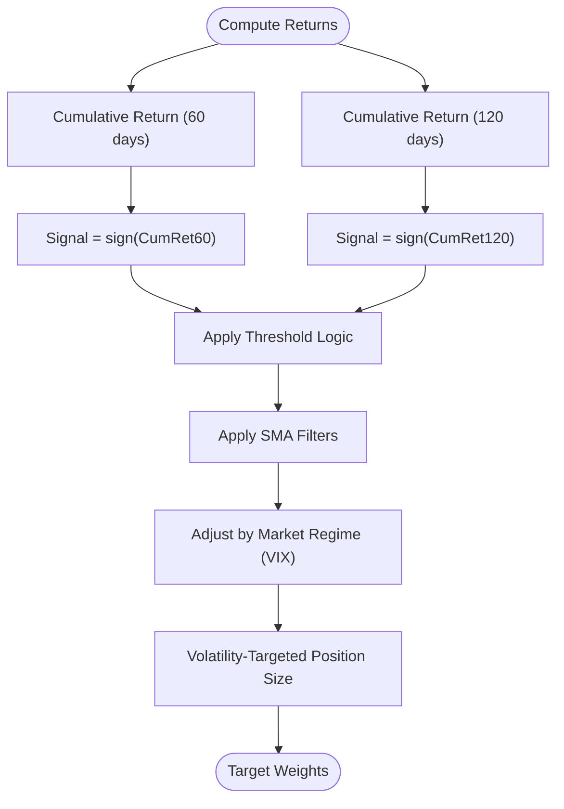

# Time Series Momentum Strategy

<cite>
**Referenced Files in This Document**
- [PRD_Intelligent_Trading_System_v2.md](file://PRD_Intelligent_Trading_System_v2.md)
- [Tech_Design_Document.md](file://Tech_Design_Document.md)
</cite>

## Table of Contents
1. [Introduction](#introduction)
2. [Project Structure](#project-structure)
3. [Core Components](#core-components)
4. [Architecture Overview](#architecture-overview)
5. [Detailed Component Analysis](#detailed-component-analysis)
6. [Dependency Analysis](#dependency-analysis)
7. [Performance Considerations](#performance-considerations)
8. [Troubleshooting Guide](#troubleshooting-guide)
9. [Conclusion](#conclusion)
10. [Appendices](#appendices)

## Introduction
This document explains the Time Series Momentum strategy implementation grounded in Moskowitz & Grinblatt (1999) and its practical instantiation in the Intelligent Trading Decision System. The strategy computes 60–120 day momentum as cumulative returns and generates signals based on sign(cumulative_return), filtered by technical trend filters and market regime conditions. It integrates position sizing via volatility targeting and risk management with multi-level controls.

The system emphasizes robustness through:
- Clear mathematical formulation for momentum and signal generation
- Market regime filtering using VIX thresholds
- SMA-based trend filters
- Volatility-targeted position sizing
- Comprehensive risk controls and stress testing
- Anti-overfitting safeguards and parameter validation

## Project Structure
The repository defines the strategy and supporting modules in two key documents:
- Product Requirements Document (PRD): specifies the theoretical foundation, factor definitions, signal logic, risk controls, and configuration parameters
- Technical Design Document: details the modular architecture, data flow, and implementation interfaces

**Diagram sources**
- [Tech_Design_Document.md](file://Tech_Design_Document.md#L88-L117)
- [PRD_Intelligent_Trading_System_v2.md](file://PRD_Intelligent_Trading_System_v2.md#L137-L181)

**Section sources**
- [Tech_Design_Document.md](file://Tech_Design_Document.md#L34-L117)
- [PRD_Intelligent_Trading_System_v2.md](file://PRD_Intelligent_Trading_System_v2.md#L129-L181)

## Core Components
- Factor Calculator: Computes momentum (60- and 120-day cumulative returns), SMA filters, volatility, RSI, and ATR
- Signal Generator: Applies thresholds and trend filters; adjusts confidence under market regime conditions
- Position Manager: Implements volatility-targeted position sizing with constraints
- Risk Manager: Enforces hierarchical controls, correlation monitoring, and re-entry logic
- Backtester/Stress Tester: Validates strategy performance and resilience across crises

**Section sources**
- [PRD_Intelligent_Trading_System_v2.md](file://PRD_Intelligent_Trading_System_v2.md#L203-L286)
- [Tech_Design_Document.md](file://Tech_Design_Document.md#L250-L295)
- [Tech_Design_Document.md](file://Tech_Design_Document.md#L317-L404)

## Architecture Overview
The system follows a layered architecture:
- Data ingestion with multi-source fallback and validation
- Factor computation and market regime detection
- Signal generation with regime-adjusted confidence
- Position sizing and risk control
- Execution and state persistence

**Diagram sources**
- [Tech_Design_Document.md](file://Tech_Design_Document.md#L88-L117)
- [PRD_Intelligent_Trading_System_v2.md](file://PRD_Intelligent_Trading_System_v2.md#L220-L245)

## Detailed Component Analysis

### Theoretical Foundation and Mathematical Formulation
- Time Series Momentum (Moskowitz & Grinblatt, 1999): Use past returns to predict future direction
- 60–120 day lookback: Cumulative return over 60 and 120 days
- Signal generation: sign(cumulative_return) with thresholds
- Position sizing: volatility scaling to target portfolio volatility

**Diagram sources**
- [PRD_Intelligent_Trading_System_v2.md](file://PRD_Intelligent_Trading_System_v2.md#L145-L156)
- [PRD_Intelligent_Trading_System_v2.md](file://PRD_Intelligent_Trading_System_v2.md#L220-L245)
- [Tech_Design_Document.md](file://Tech_Design_Document.md#L250-L295)

**Section sources**
- [PRD_Intelligent_Trading_System_v2.md](file://PRD_Intelligent_Trading_System_v2.md#L145-L156)
- [PRD_Intelligent_Trading_System_v2.md](file://PRD_Intelligent_Trading_System_v2.md#L203-L218)

### Factor Calculation Details
- Momentum_60: 60-day cumulative return
- Momentum_120: 120-day cumulative return
- SMA_20, SMA_50, SMA_200: trend filters
- Volatility_20, Volatility_60: annualized standard deviations
- RSI_14, ATR_14: auxiliary filters

These factors are computed from OHLCV data and used for signal generation and risk control.

**Section sources**
- [PRD_Intelligent_Trading_System_v2.md](file://PRD_Intelligent_Trading_System_v2.md#L203-L218)
- [Tech_Design_Document.md](file://Tech_Design_Document.md#L250-L295)

### Signal Generation Logic
- STRONG_BUY: momentum > high_threshold AND price > SMA_50 AND price > SMA_200 AND VIX < 30
- BUY: momentum > low_threshold AND price > SMA_20
- SELL: momentum < negative_threshold OR price < SMA_50
- STRONG_SELL: momentum < negative_high_threshold AND price < SMA_200
- HOLD: otherwise

Market regime filtering:
- High volatility (VIX > 30): reduce all signal confidence by 50%
- Extreme volatility (VIX > 40): allow only reduce-position signals

**Diagram sources**
- [PRD_Intelligent_Trading_System_v2.md](file://PRD_Intelligent_Trading_System_v2.md#L220-L245)

**Section sources**
- [PRD_Intelligent_Trading_System_v2.md](file://PRD_Intelligent_Trading_System_v2.md#L220-L245)

### Market Regime Filtering Integration
- Regime classification by VIX bands
- Confidence reduction or signal suppression based on regime severity
- Ensures momentum signals are applied under appropriate market conditions

**Section sources**
- [Tech_Design_Document.md](file://Tech_Design_Document.md#L317-L350)
- [PRD_Intelligent_Trading_System_v2.md](file://PRD_Intelligent_Trading_System_v2.md#L225-L235)

### Position Sizing Adjustments (Volatility Targeting)
- Target portfolio volatility set at 15%
- Asset-level position constrained by:
  - Maximum individual weight per asset
  - Risk budget derived from target volatility divided by asset volatility
  - Relatedness adjustments (correlation monitoring)
- Minimum trade size and rebalance thresholds enforced

**Diagram sources**
- [PRD_Intelligent_Trading_System_v2.md](file://PRD_Intelligent_Trading_System_v2.md#L247-L263)

**Section sources**
- [PRD_Intelligent_Trading_System_v2.md](file://PRD_Intelligent_Trading_System_v2.md#L247-L263)

### Relationship with Technical Indicators (SMA Filters)
- SMA_200 acts as a long-term trend filter for momentum eligibility
- SMA_50 and SMA_20 act as medium/short-term trend filters for entry/exit decisions
- These filters reduce false signals during strong countertrends

**Section sources**
- [PRD_Intelligent_Trading_System_v2.md](file://PRD_Intelligent_Trading_System_v2.md#L225-L231)
- [Tech_Design_Document.md](file://Tech_Design_Document.md#L250-L295)

### Risk Management Components
- Hierarchical risk controls (Levels 1–4) with actions such as reducing positions, closing BTC, selling-only mode, emergency liquidation
- Single-asset stop-loss thresholds (reduce to 50% or exit)
- Correlation monitoring: pairwise and portfolio-level thresholds
- Re-entry logic after severe drawdowns with gradual ramp-up and reduced leverage

**Section sources**
- [Tech_Design_Document.md](file://Tech_Design_Document.md#L352-L437)
- [PRD_Intelligent_Trading_System_v2.md](file://PRD_Intelligent_Trading_System_v2.md#L288-L332)

### Configuration Parameters
Key configuration categories:
- Strategy parameters: name, rebalance frequency, minimum rebalance threshold
- Asset-level parameters: max weight, momentum lookback, target volatility, asset stop loss
- Risk parameters: levels, correlation thresholds, re-entry rules, leverage limits, cash buffer, daily trade/turover constraints
- Compliance parameters: PDT tracking, wash sale tracking, tax lot method
- Data source preferences and alert channels

**Section sources**
- [PRD_Intelligent_Trading_System_v2.md](file://PRD_Intelligent_Trading_System_v2.md#L1225-L1323)

### Parameter Optimization and Validation
- Backtesting across multiple market regimes and stress scenarios
- Performance targets validated against Sharpe, volatility, drawdown, turnover, and cost drag
- Anti-overfitting measures: walk-forward validation, purged cross-validation, CPCV, feature stability checks, and model lifecycle management

**Section sources**
- [Tech_Design_Document.md](file://Tech_Design_Document.md#L890-L930)
- [PRD_Intelligent_Trading_System_v2.md](file://PRD_Intelligent_Trading_System_v2.md#L850-L864)
- [Tech_Design_Document.md](file://Tech_Design_Document.md#L473-L573)

## Dependency Analysis
The strategy pipeline exhibits clear dependency chains:
- Data Provider → Validator → Factor Calculator
- Factor Calculator → Market Regime Detector → Signal Generator
- Signal Generator → Position Manager → Execution Engine
- Risk Manager monitors portfolio and factors, influencing Position Manager constraints

**Diagram sources**
- [Tech_Design_Document.md](file://Tech_Design_Document.md#L88-L117)

**Section sources**
- [Tech_Design_Document.md](file://Tech_Design_Document.md#L88-L117)

## Performance Considerations
- Target performance metrics include Sharpe > 1.0, volatility < 15%, max drawdown < 15%, turnover < 30%, cost drag < 1%
- Backtest speed and memory usage targets support rapid iteration and scalability
- Risk controls and correlation monitoring help maintain performance consistency across regimes

**Section sources**
- [PRD_Intelligent_Trading_System_v2.md](file://PRD_Intelligent_Trading_System_v2.md#L850-L864)
- [Tech_Design_Document.md](file://Tech_Design_Document.md#L1075-L1111)

## Troubleshooting Guide
Common issues and mitigations:
- Look-ahead bias
  - Use point-in-time data, avoid future information leakage, and apply walk-forward validation
  - Prevent forward-fill of features and ensure strict temporal ordering
- Data quality problems
  - Enforce multi-source validation, price jump detection, missing data thresholds, and cross-source deviation checks
  - Maintain cache hygiene and monitor source health
- Overfitting
  - Use purged walk-forward and CPCV; monitor IC stability and concept drift; enforce conservative hyperparameter search
- Execution and compliance
  - Enforce PDT rules and wash sale tracking; ensure order routing and brokerage reconciliation
- Regime misclassification
  - Validate VIX thresholds and adjust confidence accordingly; avoid acting in extreme volatility regimes

**Section sources**
- [Tech_Design_Document.md](file://Tech_Design_Document.md#L473-L573)
- [Tech_Design_Document.md](file://Tech_Design_Document.md#L815-L833)
- [Tech_Design_Document.md](file://Tech_Design_Document.md#L799-L813)
- [PRD_Intelligent_Trading_System_v2.md](file://PRD_Intelligent_Trading_System_v2.md#L197-L201)

## Conclusion
The Time Series Momentum strategy in this system combines a robust theoretical foundation with practical safeguards. Its implementation integrates:
- Clear mathematical formulation for momentum and signal logic
- Trend filters and market regime adjustments
- Volatility-targeted position sizing and comprehensive risk controls
- Strong anti-overfitting practices and performance validation

This approach balances simplicity with resilience, enabling reliable backtesting and controlled deployment across multiple market regimes.

## Appendices

### Appendix A: Signal Processing Workflow

**Diagram sources**
- [Tech_Design_Document.md](file://Tech_Design_Document.md#L297-L350)

### Appendix B: Configuration Reference
- Strategy YAML: strategy name, rebalance frequency, minimum rebalance threshold
- Assets YAML: per-asset max weight, momentum lookback, target volatility, stop loss
- Risk YAML: hierarchical risk levels, correlation thresholds, re-entry parameters, leverage and turnover constraints
- Compliance YAML: PDT and wash sale tracking, tax lot method
- Data YAML: primary and fallback sources, cache backend, alert channels

**Section sources**
- [PRD_Intelligent_Trading_System_v2.md](file://PRD_Intelligent_Trading_System_v2.md#L1225-L1323)