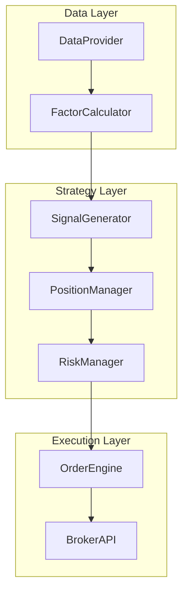
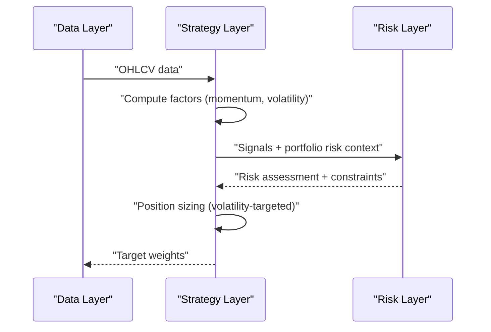
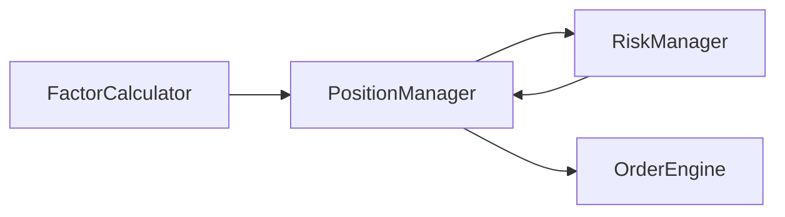

# Volatility Targeting System

<cite>
**Referenced Files in This Document**
- [PRD_Intelligent_Trading_System_v2.md](file://PRD_Intelligent_Trading_System_v2.md)
- [Tech_Design_Document.md](file://Tech_Design_Document.md)
</cite>

## Table of Contents
1. [Introduction](#introduction)
2. [Project Structure](#project-structure)
3. [Core Components](#core-components)
4. [Architecture Overview](#architecture-overview)
5. [Detailed Component Analysis](#detailed-component-analysis)
6. [Dependency Analysis](#dependency-analysis)
7. [Performance Considerations](#performance-considerations)
8. [Troubleshooting Guide](#troubleshooting-guide)
9. [Conclusion](#conclusion)
10. [Appendices](#appendices)

## Introduction
This document provides a comprehensive guide to the Volatility Targeting system implemented in the Intelligent Trading Decision System. It explains the dynamic position sizing methodology aligned with the Perchet et al. (2016) framework, including target volatility settings, volatility estimation windows, position scaling algorithms, leverage constraints, and portfolio-level risk budgeting. It also covers practical examples of volatility estimation and position adjustment logic, integration with other strategies, turnover and transaction cost implications, parameter sensitivity analysis, and performance characteristics across market regimes.

## Project Structure
The Volatility Targeting system is part of a broader multi-phase trading platform. The relevant components are defined in the Product Requirements Document (PRD) and the Technical Design Document (TDD). The PRD specifies volatility targets per asset class and the high-level volatility targeting implementation, while the TDD provides the technical interfaces and data models that support position sizing and risk management.

**Diagram sources**
- [Tech_Design_Document.md](file://Tech_Design_Document.md#L300-L350)
- [Tech_Design_Document.md](file://Tech_Design_Document.md#L420-L470)
- [Tech_Design_Document.md](file://Tech_Design_Document.md#L770-L800)

**Section sources**
- [PRD_Intelligent_Trading_System_v2.md](file://PRD_Intelligent_Trading_System_v2.md#L145-L173)
- [Tech_Design_Document.md](file://Tech_Design_Document.md#L300-L350)

## Core Components
- Volatility Targeting Framework: Implements dynamic position sizing based on target volatility and realized volatility.
- Factor Calculation: Provides short- and medium-term volatility estimates (20-day and 60-day annualized).
- Position Manager: Computes target weights considering volatility scaling and portfolio risk budgeting.
- Risk Manager: Enforces leverage constraints, correlation monitoring, and re-entry logic.

Key references:
- Target volatility settings per asset class and volatility estimation windows are defined in the PRD.
- Position sizing and risk budgeting logic are integrated into the PositionManager interface and Portfolio model in the TDD.

**Section sources**
- [PRD_Intelligent_Trading_System_v2.md](file://PRD_Intelligent_Trading_System_v2.md#L48-L54)
- [PRD_Intelligent_Trading_System_v2.md](file://PRD_Intelligent_Trading_System_v2.md#L157-L165)
- [Tech_Design_Document.md](file://Tech_Design_Document.md#L250-L295)
- [Tech_Design_Document.md](file://Tech_Design_Document.md#L420-L470)
- [Tech_Design_Document.md](file://Tech_Design_Document.md#L938-L997)

## Architecture Overview
The Volatility Targeting system sits within the Strategy Layer and interacts with the Data Layer for price data and factors, and with the Risk Manager for leverage and correlation constraints. The Position Manager computes target weights using volatility estimates and applies portfolio-level risk budgeting.

**Diagram sources**
- [Tech_Design_Document.md](file://Tech_Design_Document.md#L250-L295)
- [Tech_Design_Document.md](file://Tech_Design_Document.md#L300-L350)
- [Tech_Design_Document.md](file://Tech_Design_Document.md#L352-L404)

## Detailed Component Analysis

### Volatility Targeting Framework
- Target Volatility Setting: Defined per asset class in the PRD (e.g., 10–12% for GLD, 15% for SPY, 18% for QQQ, 20–25% for BTC-USD).
- Volatility Estimation Windows: 20-day and 60-day annualized volatility computed by the FactorCalculator.
- Position Scaling Algorithm: The PRD describes position sizing proportional to target volatility divided by realized volatility. This aligns with the Perchet et al. (2016) framework.

Mathematical formulation (conceptual):
- Position Scale Factor = Target Volatility / Realized Volatility
- Target Weight = min(Signal Weight, Scale Factor, Max Weight Constraint)

Portfolio-level risk budgeting:
- The PRD mentions a portfolio target volatility of 15% and a maximum portfolio leverage of 1.5x (including implied leverage from volatility targeting).
- Risk budgeting ensures that the sum of weighted contributions does not exceed the portfolio’s risk capacity.

Practical example references:
- Volatility estimation code path: [Volatility_20 and Volatility_60 calculations](file://Tech_Design_Document.md#L250-L295)
- Position sizing and leverage constraints: [Position sizing and risk budgeting](file://PRD_Intelligent_Trading_System_v2.md#L247-L263), [Portfolio constraints](file://Tech_Design_Document.md#L190-L204)

**Section sources**
- [PRD_Intelligent_Trading_System_v2.md](file://PRD_Intelligent_Trading_System_v2.md#L48-L54)
- [PRD_Intelligent_Trading_System_v2.md](file://PRD_Intelligent_Trading_System_v2.md#L157-L165)
- [Tech_Design_Document.md](file://Tech_Design_Document.md#L250-L295)
- [Tech_Design_Document.md](file://Tech_Design_Document.md#L190-L204)

### Position Sizing and Leverage Constraints
- Maximum Portfolio Leverage: 1.5x (including implied leverage from volatility targeting).
- Single-Asset Weight Caps: Defined per asset class in the PRD (e.g., GLD up to 50%, SPY up to 40%, QQQ up to 30%, BTC up to 15%).
- Minimum Trade Amount and Rebalance Threshold: $100 minimum trade and 2% weight change minimum rebalance to manage turnover and costs.
- Cash Buffer: Always keep at least 5% cash.

Position adjustment logic (conceptual):
- Compute scale factor from target vs realized volatility.
- Cap target weight by max weight per asset and portfolio risk budget.
- Only act if the absolute change exceeds the minimum rebalance threshold.

References:
- [Portfolio constraints](file://Tech_Design_Document.md#L190-L204)
- [Position sizing and risk budgeting](file://PRD_Intelligent_Trading_System_v2.md#L247-L263)

**Section sources**
- [Tech_Design_Document.md](file://Tech_Design_Document.md#L190-L204)
- [PRD_Intelligent_Trading_System_v2.md](file://PRD_Intelligent_Trading_System_v2.md#L247-L263)

### Integration with Other Strategies
- Volatility Targeting complements time-series momentum and cross-sectional momentum by dynamically adjusting position sizes to maintain a constant risk profile.
- In Phase 2, volatility targeting integrates with cross-sectional momentum and risk parity optimization for tactical asset allocation.

References:
- [Volatility Targeting implementation note](file://PRD_Intelligent_Trading_System_v2.md#L157-L165)
- [Cross-sectional momentum and risk parity integration](file://Tech_Design_Document.md#L575-L678)

**Section sources**
- [PRD_Intelligent_Trading_System_v2.md](file://PRD_Intelligent_Trading_System_v2.md#L157-L165)
- [Tech_Design_Document.md](file://Tech_Design_Document.md#L575-L678)

### Turnover and Transaction Cost Implications
- Maximum daily turnover: 30%.
- Transaction cost model: 0.10% commission for ETFs and 0.10% for BTC, with slippage of 0.05% for liquidity ETFs and 0.15% for BTC.
- Minimum trade amount: $100 and minimum rebalance threshold: 2% weight change to reduce turnover and cost drag.

References:
- [Portfolio constraints](file://Tech_Design_Document.md#L190-L204)
- [Cost model](file://Tech_Design_Document.md#L190-L204)

**Section sources**
- [Tech_Design_Document.md](file://Tech_Design_Document.md#L190-L204)

### Parameter Sensitivity and Optimal Target Volatility Selection
- Sensitivity Analysis: Changing target volatility affects leverage and turnover. Higher target volatility increases implied leverage and reduces turnover; lower target volatility decreases leverage and increases turnover.
- Selection Guidelines: Choose target volatility to balance Sharpe ratio and turnover. The PRD sets portfolio target volatility at 15% and defines asset-specific targets to reflect risk profiles.
- Market Conditions: In high-volatility regimes, volatility targeting naturally reduces position sizes to maintain target risk; in low-volatility regimes, it increases exposure.

References:
- [Target volatility per asset](file://PRD_Intelligent_Trading_System_v2.md#L48-L54)
- [Portfolio target volatility and leverage](file://Tech_Design_Document.md#L190-L204)

**Section sources**
- [PRD_Intelligent_Trading_System_v2.md](file://PRD_Intelligent_Trading_System_v2.md#L48-L54)
- [Tech_Design_Document.md](file://Tech_Design_Document.md#L190-L204)

### Performance Characteristics Under Different Market Conditions
- Normal Volatility: Volatility targeting maintains steady risk exposure and moderate turnover.
- Elevated Volatility (VIX > 30): Signals confidence reduced by 50%; volatility targeting reduces exposure to meet target risk.
- Extreme Volatility (VIX > 40): Only reduce-position signals allowed; volatility targeting further reduces exposure.
- Stress Testing: The system includes stress tests across 2008, 2020, and 2022 crises, with maximum drawdown limits and no Level 4 triggers.

References:
- [Market regime filtering](file://Tech_Design_Document.md#L317-L350)
- [Stress testing scenarios](file://Tech_Design_Document.md#L890-L930)

**Section sources**
- [Tech_Design_Document.md](file://Tech_Design_Document.md#L317-L350)
- [Tech_Design_Document.md](file://Tech_Design_Document.md#L890-L930)

## Dependency Analysis
The Volatility Targeting system depends on:
- FactorCalculator for 20-day and 60-day annualized volatility estimates.
- PositionManager for computing target weights and applying leverage constraints.
- RiskManager for enforcing portfolio-level constraints and correlation monitoring.

**Diagram sources**
- [Tech_Design_Document.md](file://Tech_Design_Document.md#L250-L295)
- [Tech_Design_Document.md](file://Tech_Design_Document.md#L420-L470)
- [Tech_Design_Document.md](file://Tech_Design_Document.md#L352-L404)

**Section sources**
- [Tech_Design_Document.md](file://Tech_Design_Document.md#L250-L295)
- [Tech_Design_Document.md](file://Tech_Design_Document.md#L420-L470)
- [Tech_Design_Document.md](file://Tech_Design_Document.md#L352-L404)

## Performance Considerations
- Volatility Estimation Accuracy: Use sufficient lookback windows (20-day and 60-day) to capture short- and medium-term volatility regimes.
- Turnover Control: Enforce minimum rebalance thresholds and daily turnover caps to minimize transaction costs.
- Leverage Management: Monitor implied leverage from volatility targeting to stay within the 1.5x maximum.
- Rebalancing Frequency: Align rebalancing cadence with volatility regime changes to avoid unnecessary churn.

[No sources needed since this section provides general guidance]

## Troubleshooting Guide
Common issues and resolutions:
- Excessive Turnover: Increase minimum rebalance threshold or reduce volatility targeting aggressiveness.
- Overleveraging: Reduce target volatility or increase max weight caps cautiously; monitor implied leverage.
- Data Quality Problems: Validate volatility inputs and ensure missing data handling is in place.
- Risk Controls Triggered: Review correlation matrix and adjust asset weights; consider re-entry ramp-up rules.

References:
- [Risk manager controls](file://Tech_Design_Document.md#L352-L404)
- [Correlation monitoring](file://Tech_Design_Document.md#L439-L471)
- [Re-entry logic](file://Tech_Design_Document.md#L406-L437)

**Section sources**
- [Tech_Design_Document.md](file://Tech_Design_Document.md#L352-L404)
- [Tech_Design_Document.md](file://Tech_Design_Document.md#L439-L471)
- [Tech_Design_Document.md](file://Tech_Design_Document.md#L406-L437)

## Conclusion
The Volatility Targeting system provides a disciplined approach to dynamic position sizing aligned with Perchet et al. (2016). By anchoring position sizes to target volatility and scaling with realized volatility, it stabilizes portfolio risk across market cycles. Combined with portfolio-level risk budgeting, leverage constraints, and turnover controls, it offers a robust foundation for integrating with other strategies while managing transaction costs and maintaining resilience under stress.

[No sources needed since this section summarizes without analyzing specific files]

## Appendices

### Practical Example References
- Volatility estimation (20-day and 60-day annualized):
  - [Volatility factor definitions](file://Tech_Design_Document.md#L250-L295)
- Position sizing and leverage constraints:
  - [Position sizing and risk budgeting](file://PRD_Intelligent_Trading_System_v2.md#L247-L263)
  - [Portfolio constraints](file://Tech_Design_Document.md#L190-L204)
- Integration with other strategies:
  - [Volatility Targeting note](file://PRD_Intelligent_Trading_System_v2.md#L157-L165)
  - [Cross-sectional momentum and risk parity](file://Tech_Design_Document.md#L575-L678)
- Turnover and transaction costs:
  - [Cost model and constraints](file://Tech_Design_Document.md#L190-L204)
- Market regime filtering:
  - [Regime filters](file://Tech_Design_Document.md#L317-L350)
- Stress testing:
  - [Stress test scenarios](file://Tech_Design_Document.md#L890-L930)