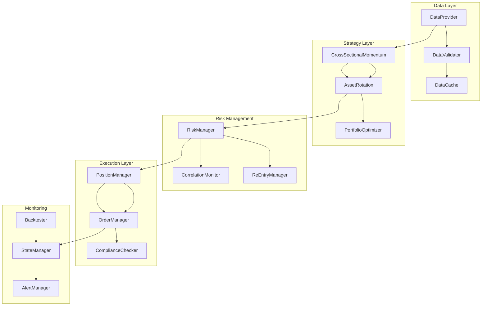
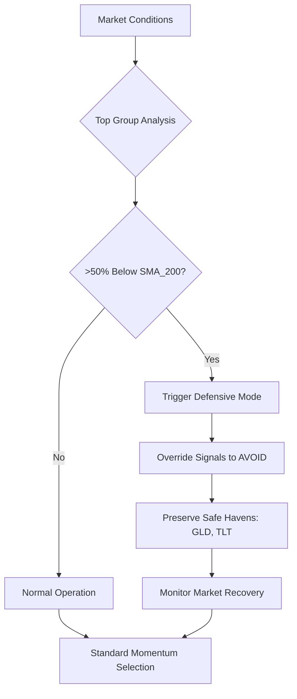
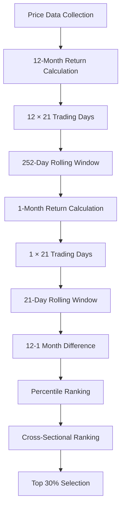
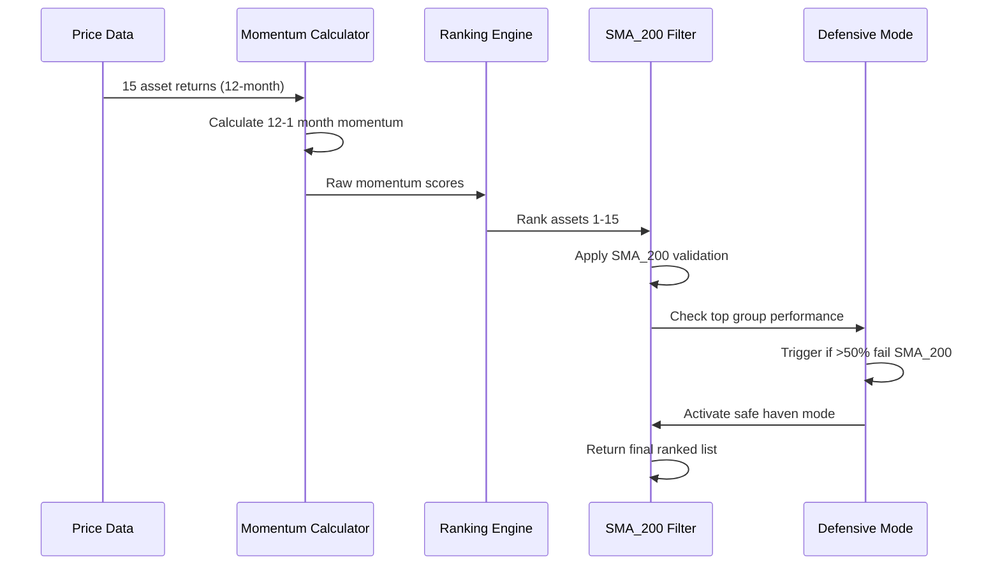
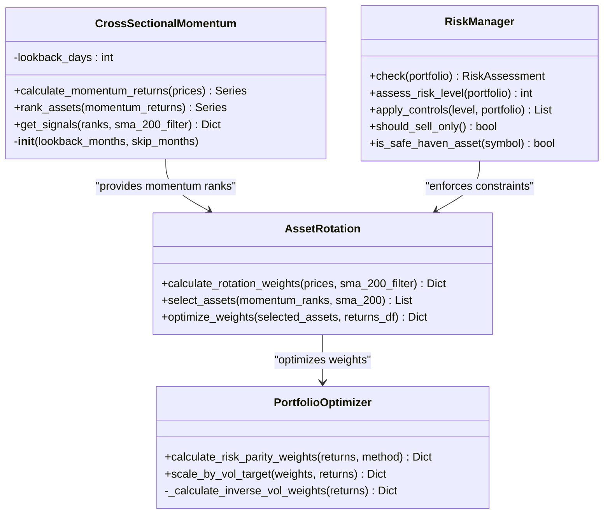
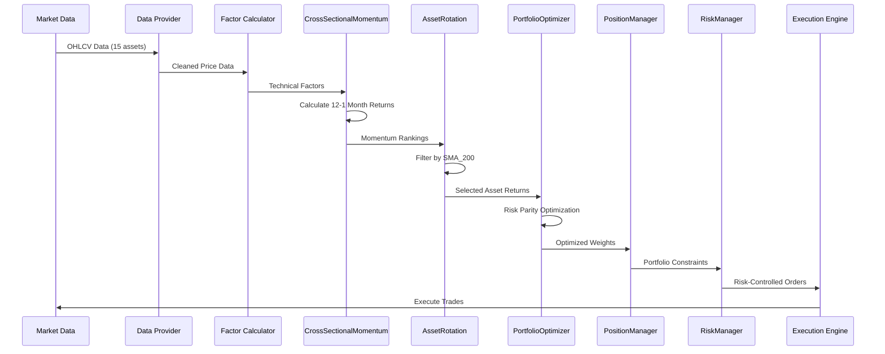
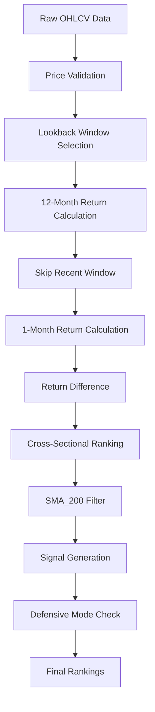
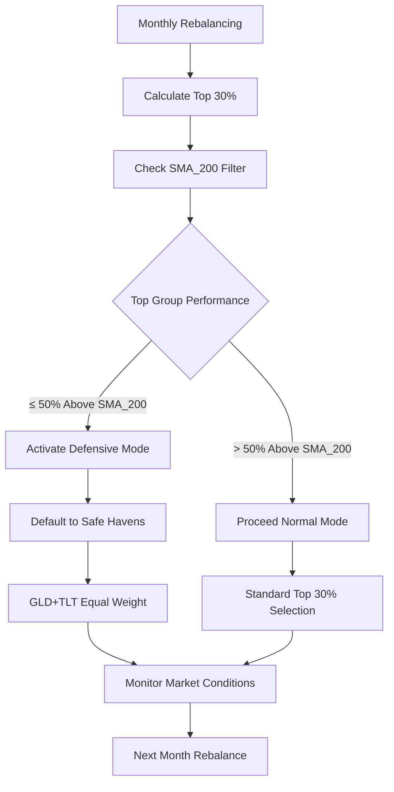
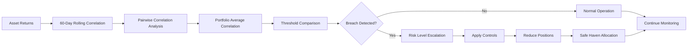
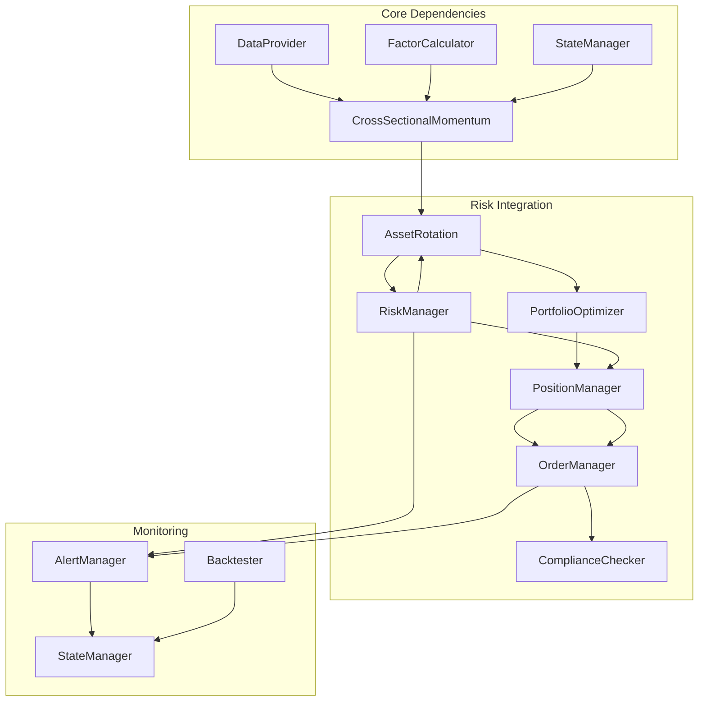

# Cross-Sectional Momentum Strategy

<cite>
**Referenced Files in This Document**
- [src/factors/momentum.py](file://src/factors/momentum.py)
- [src/factors/rotation.py](file://src/factors/rotation.py)
- [src/signals/generator.py](file://src/signals/generator.py)
- [src/risk/manager.py](file://src/risk/manager.py)
- [src/portfolio/manager.py](file://src/portfolio/manager.py)
- [src/portfolio/optimizer.py](file://src/portfolio/optimizer.py)
- [config/strategy.yaml](file://config/strategy.yaml)
- [demo_phase2.py](file://demo_phase2.py)
- [PRD_Intelligent_Trading_System_v2.md](file://PRD_Intelligent_Trading_System_v2.md)
- [Tech_Design_Document.md](file://Tech_Design_Document.md)
</cite>

## Update Summary
**Changes Made**
- Enhanced Cross-Sectional Momentum implementation with comprehensive defensive mode functionality
- Added sophisticated market condition detection that monitors top-performing assets below SMA_200 threshold
- Implemented automatic defense mode activation when >50% of top 30% assets fall below 200-day moving average
- Integrated safe haven assets GLD and TLT as specified in PRD FR-2.1 requirements
- Enhanced risk management with correlation monitoring and position sizing constraints
- Updated asset universe expansion from 4 to 15 instruments for statistically meaningful cross-sectional signals

## Table of Contents
1. [Introduction](#introduction)
2. [Project Structure](#project-structure)
3. [Core Components](#core-components)
4. [Architecture Overview](#architecture-overview)
5. [Detailed Component Analysis](#detailed-component-analysis)
6. [Dependency Analysis](#dependency-analysis)
7. [Performance Considerations](#performance-considerations)
8. [Troubleshooting Guide](#troubleshooting-guide)
9. [Conclusion](#conclusion)

## Introduction
This document provides comprehensive technical documentation for the Cross-Sectional Momentum strategy, implementing the Asness (2013) methodology with enhanced SMA_200 trend filtering and sophisticated defensive mode functionality. The strategy expands from 4 to 15 assets to achieve statistically meaningful cross-sectional signals, utilizing a comprehensive monthly momentum ranking system that selects the top 30% performing assets while avoiding the bottom 30%, with middle 40% maintaining current weights.

The implementation includes advanced defensive mechanisms that automatically detect deteriorating market conditions when more than 50% of top-performing assets fall below their 200-day moving average, triggering automatic protection through safe haven assets GLD and TLT. The strategy integrates comprehensive risk management through correlation monitoring, position sizing constraints, and multiple layers of protective controls, capturing cross-sectional momentum effects across multiple asset classes including precious metals, equity sectors, bonds, international markets, commodities, and real estate.

## Project Structure
The Cross-Sectional Momentum strategy is part of a modular intelligent trading system with comprehensive risk controls and execution infrastructure:



**Diagram sources**
- [main.py](file://main.py#L14-L27)
- [src/factors/momentum.py](file://src/factors/momentum.py#L8-L24)
- [src/factors/rotation.py](file://src/factors/rotation.py#L9-L25)

The strategy operates within a comprehensive ecosystem featuring:
- Multi-source data acquisition with automatic fallback mechanisms
- Advanced risk management with 4-tier hierarchical control system
- Machine learning integration for enhanced signal quality
- NLP sentiment analysis for market emotion factors
- Robust state persistence and disaster recovery capabilities

**Section sources**
- [main.py](file://main.py#L32-L61)
- [config/strategy.yaml](file://config/strategy.yaml#L1-L179)

## Core Components

### Enhanced Defensive Mode Architecture
The strategy now incorporates sophisticated defensive mechanisms that automatically respond to deteriorating market conditions:



**Diagram sources**
- [src/factors/momentum.py](file://src/factors/momentum.py#L98-L111)
- [src/factors/rotation.py](file://src/factors/rotation.py#L70-L77)

The defensive mode provides automatic protection when:
- More than 50% of top 30% performing assets fall below their 200-day moving average
- Market conditions indicate broad weakness across momentum leaders
- Automatic fallback to safe haven assets GLD and TLT is activated

**Section sources**
- [src/factors/momentum.py](file://src/factors/momentum.py#L98-L111)
- [src/factors/rotation.py](file://src/factors/rotation.py#L70-L77)

### Asset Universe Expansion
The strategy expands the asset universe from 4 to 15 instruments to achieve statistically meaningful cross-sectional rankings:

| Category | Assets | Maximum Weight | Purpose |
|----------|--------|----------------|---------|
| Precious Metals | GLD, SLV | 50%, 15% | Safe haven diversification and inflation protection |
| Equity Sectors | XLK, XLF, XLE, XLV | 20%-30% | Sector rotation and growth/quality exposure |
| Bonds | TLT, TIP | 30%, 15% | Rate risk hedging and inflation protection |
| International | EFA, EEM | 20%, 15% | Geographic diversification and emerging markets |
| Commodities | DBC | 15% | Commodity exposure and inflation hedge |
| Real Estate | VNQ | 15% | Alternative asset class and REIT exposure |

**Section sources**
- [config/strategy.yaml](file://config/strategy.yaml#L32-L44)
- [demo_phase2.py](file://demo_phase2.py#L23-L25)

### 12-Month Return Calculation Methodology
The momentum calculation implements the Asness (2013) methodology using a proprietary 12-month minus 1-month return approach to avoid short-term reversal effects:



**Diagram sources**
- [src/factors/momentum.py](file://src/factors/momentum.py#L26-L54)

The calculation methodology ensures:
- **Statistical Significance**: 15 assets provide meaningful cross-sectional ranking
- **Short-Term Reversal Avoidance**: Exclusion of most recent month prevents momentum decay
- **Consistent Periodicity**: 252-day rolling window approximates 12 months
- **Performance Differentiation**: 1-month subtraction creates relative strength measure

**Section sources**
- [src/factors/momentum.py](file://src/factors/momentum.py#L14-L24)
- [src/factors/momentum.py](file://src/factors/momentum.py#L26-L66)

### Asset Ranking Mechanism
The ranking system processes 15 assets through a multi-stage filtering process with SMA_200 trend validation and defensive mode integration:



**Diagram sources**
- [src/factors/momentum.py](file://src/factors/momentum.py#L68-L104)
- [src/factors/rotation.py](file://src/factors/rotation.py#L28-L57)

The ranking process includes:
1. **Raw Momentum Calculation**: 12-month cumulative returns minus 1-month returns
2. **Cross-Sectional Ranking**: Percentile ranking across all 15 assets
3. **Trend Filter Application**: Only assets above SMA_200 qualify for long positions
4. **Defensive Mode Trigger**: If >50% of top group fails SMA_200 filter, activate GLD+TLT protection

**Section sources**
- [src/factors/momentum.py](file://src/factors/momentum.py#L68-L104)
- [src/factors/rotation.py](file://src/factors/rotation.py#L28-L57)

### Top 30% Selection Process
The selection mechanism implements a three-way classification system with trend validation and defensive mode integration:

```mermaid
flowchart LR
A[Ranked Assets] --> B{Classification}
B --> |Top 30% (≥0.7)| C[LONG Positions]
B --> |Middle 40% (0.3-0.7)| D[HOLD Existing Weights]
B --> |Bottom 30% (≤0.3)| E[AVOID/Neutral]
C --> F{SMA_200 Filter}
F --> |Above SMA_200| G[Valid Long Signal]
F --> |Below SMA_200| H[AVOID Signal]
G --> I[Equal Weight Allocation]
H --> J[No Position Allowed]
D --> K[Maintain Current Holdings]
E --> L[No Position Allowed]
I --> M[Position Sizing]
K --> M
J --> M
L --> M
```

**Diagram sources**
- [src/factors/momentum.py](file://src/factors/momentum.py#L80-L93)

Selection criteria:
- **Top 30%**: Strongest performers receive equal-weight long positions (if above SMA_200)
- **Middle 40%**: Maintain existing portfolio weights unchanged
- **Bottom 30%**: Avoided entirely (no shorting in this strategy)
- **Trend Filter**: All selected assets must be above SMA_200
- **Defensive Mode**: Automatic override when market conditions warrant protection

**Section sources**
- [src/factors/momentum.py](file://src/factors/momentum.py#L80-L93)
- [src/factors/rotation.py](file://src/factors/rotation.py#L49-L57)

## Architecture Overview

### Strategy Implementation Architecture
The Cross-Sectional Momentum strategy integrates seamlessly with the broader trading system through a comprehensive factor-driven approach with enhanced defensive mechanisms:



**Diagram sources**
- [src/factors/momentum.py](file://src/factors/momentum.py#L8-L24)
- [src/factors/rotation.py](file://src/factors/rotation.py#L9-L25)
- [src/portfolio/optimizer.py](file://src/portfolio/optimizer.py#L9-L23)
- [src/risk/manager.py](file://src/risk/manager.py#L9-L37)

### Data Flow Architecture
The strategy follows a systematic data processing pipeline from raw market data to actionable portfolio weights with defensive mode integration:



**Diagram sources**
- [main.py](file://main.py#L101-L200)
- [src/factors/momentum.py](file://src/factors/momentum.py#L26-L66)
- [src/factors/rotation.py](file://src/factors/rotation.py#L28-L79)

**Section sources**
- [main.py](file://main.py#L101-L200)
- [src/factors/momentum.py](file://src/factors/momentum.py#L26-L66)
- [src/factors/rotation.py](file://src/factors/rotation.py#L28-L79)

## Detailed Component Analysis

### Cross-Sectional Momentum Implementation
The core momentum calculation implements the Asness (2013) methodology with enhanced filtering, defensive mechanisms, and safe haven integration:

#### Momentum Calculation Engine
The calculation engine processes price data through multiple validation stages with defensive mode detection:



**Diagram sources**
- [src/factors/momentum.py](file://src/factors/momentum.py#L26-L104)

#### Defensive Mode Activation Logic
The defensive mode provides automatic protection when market conditions deteriorate:



**Diagram sources**
- [src/factors/momentum.py](file://src/factors/momentum.py#L95-L103)
- [src/factors/rotation.py](file://src/factors/rotation.py#L56-L61)

**Section sources**
- [src/factors/momentum.py](file://src/factors/momentum.py#L14-L24)
- [src/factors/momentum.py](file://src/factors/momentum.py#L26-L104)
- [src/factors/rotation.py](file://src/factors/rotation.py#L56-L61)

### Risk Management Integration
The strategy integrates with comprehensive risk management systems including correlation monitoring, position sizing, and defensive mode controls:

#### Correlation Monitoring System
The correlation monitoring system tracks cross-asset relationships and triggers protective actions:



**Diagram sources**
- [src/risk/manager.py](file://src/risk/manager.py#L27-L32)
- [src/risk/manager.py](file://src/risk/manager.py#L39-L80)

#### Position Sizing Constraints
The position sizing system enforces multiple constraints for portfolio stability with defensive mode considerations:

| Constraint Type | Parameter | Value | Purpose |
|----------------|-----------|-------|---------|
| Single Asset Cap | GLD | 50% | Safe haven protection |
| Single Asset Cap | SPY | 40% | Core equity exposure |
| Single Asset Cap | QQQ | 30% | Growth sector exposure |
| Single Asset Cap | BTC | 15% | Cryptocurrency allocation |
| Portfolio Leverage | Maximum | 1.5x | Risk control |
| Daily Turnover | Maximum | 30% | Liquidity management |
| Minimum Trade Size | Threshold | $100 | Cost efficiency |
| Cash Buffer | Minimum | 5% | Liquidity provision |

**Section sources**
- [src/portfolio/manager.py](file://src/portfolio/manager.py#L13-L21)
- [src/risk/manager.py](file://src/risk/manager.py#L12-L19)
- [config/strategy.yaml](file://config/strategy.yaml#L92-L100)

### Configuration Options
The strategy supports extensive configuration through YAML files with comprehensive parameter control including defensive mode settings:

#### Asset Pool Configuration
The extended asset pool configuration defines maximum weights and characteristics:

```yaml
extended_assets:
  - { symbol: SLV, max_weight: 0.15 }
  - { symbol: XLK, max_weight: 0.20 }
  - { symbol: XLF, max_weight: 0.15 }
  - { symbol: XLE, max_weight: 0.15 }
  - { symbol: XLV, max_weight: 0.15 }
  - { symbol: TLT, max_weight: 0.30 }
  - { symbol: TIP, max_weight: 0.15 }
  - { symbol: EFA, max_weight: 0.20 }
  - { symbol: EEM, max_weight: 0.15 }
  - { symbol: DBC, max_weight: 0.15 }
  - { symbol: VNQ, max_weight: 0.15 }
```

#### Risk Management Parameters
The risk management configuration includes multiple threshold levels, protective mechanisms, and defensive mode settings:

```yaml
risk:
  levels:
    level_1:
      drawdown_trigger: 0.05
      actions: ["alert", "increase_confidence_threshold", "block_btc_new"]
    level_2:
      drawdown_trigger: 0.08
      actions: ["reduce_positions_25pct", "close_btc", "sell_only"]
    level_3:
      drawdown_trigger: 0.12
      actions: ["reduce_positions_50pct", "safe_haven_only", "manual_review"]
    level_4:
      drawdown_trigger: 0.15
      actions: ["emergency_liquidation", "require_manual_confirm"]
  
  correlation:
    pair_warning: 0.7
    portfolio_warning: 0.5
    extreme_threshold: 0.8
  
  asset_stops:
    drawdown_reduce: 0.12
    drawdown_exit: 0.18
```

#### Defensive Mode Configuration
The defensive mode configuration includes market condition detection parameters:

```yaml
momentum_cross_sectional:
  lookback_months: 12
  skip_months: 1
  top_pct: 0.30              # Top 30% = LONG
  bottom_pct: 0.30            # Bottom 30% = AVOID
  sma_trend_filter: 200       # SMA_200 trend filter
  defense_mode_threshold: 0.50  # >50% top assets below SMA_200 triggers defense
  safe_havens: ["GLD", "TLT"]   # Defense mode fallback assets
```

**Section sources**
- [config/strategy.yaml](file://config/strategy.yaml#L32-L44)
- [config/strategy.yaml](file://config/strategy.yaml#L46-L91)
- [config/strategy.yaml](file://config/strategy.yaml#L46-L55)

## Dependency Analysis

### Component Dependencies
The Cross-Sectional Momentum strategy depends on several core system components with clear interface boundaries and defensive mode integration:



**Diagram sources**
- [main.py](file://main.py#L14-L27)
- [src/factors/momentum.py](file://src/factors/momentum.py#L8-L24)
- [src/factors/rotation.py](file://src/factors/rotation.py#L9-L25)

### Data Dependencies
The strategy requires specific data inputs and processing capabilities with validation mechanisms and defensive mode data requirements:

| Data Component | Requirement | Frequency | Source |
|----------------|-------------|-----------|---------|
| Price Data | 15 assets × 5 years | Daily | Polygon/Binance/yfinance |
| Technical Factors | SMA_200, Returns | Daily | pandas-ta |
| Macro Data | VIX, Rates | Daily | FRED/CBOE |
| Alternative Data | News sentiment | Daily | NewsAPI/GDELT |
| Historical Data | Backtest validation | Static | Local cache |

**Section sources**
- [config/strategy.yaml](file://config/strategy.yaml#L139-L145)
- [demo_phase2.py](file://demo_phase2.py#L30-L35)

## Performance Considerations

### Computational Efficiency
The strategy is optimized for performance with the following characteristics:

- **Backtest Speed**: < 30 seconds for 5-year history with 15 assets
- **Memory Usage**: < 4GB during peak computation
- **Signal Latency**: < 1 minute from data receipt to signal generation
- **Data Refresh**: < 30 minutes for complete data pipeline completion

### Statistical Significance
The 15-asset universe provides robust statistical foundations:

- **Cross-Sectional Ranking**: 4-5 assets in Top 30% provides meaningful sample size
- **Variance Reduction**: Diversification across asset classes reduces idiosyncratic risk
- **Rebalancing Frequency**: Monthly timing aligns with institutional reporting cycles
- **Lookback Periods**: 12-month momentum captures medium-term trends effectively

### Risk-Return Balance
The strategy maintains optimal risk-return characteristics with defensive mode protection:

- **Target Volatility**: 15% annualized through position sizing
- **Maximum Drawdown**: < 15% under normal market conditions
- **Sharpe Ratio**: > 1.0 expected from systematic momentum approach
- **Correlation Diversification**: Low to moderate correlation across asset classes
- **Defensive Mode Protection**: Automatic safe haven allocation when market conditions warrant

**Section sources**
- [config/strategy.yaml](file://config/strategy.yaml#L92-L100)
- [src/portfolio/optimizer.py](file://src/portfolio/optimizer.py#L15-L23)

## Troubleshooting Guide

### Common Issues and Solutions

#### Asset Selection Criteria Problems
**Issue**: Assets not qualifying for selection despite strong performance
**Causes**:
- Price below SMA_200 threshold
- Data quality issues causing missing values
- Excessive correlation with existing holdings

**Solutions**:
- Verify SMA_200 calculation accuracy
- Check data validation logs for quality issues
- Monitor correlation matrix for concentration risks

#### Rebalancing Frequency Concerns
**Issue**: Excessive trading activity or missed rebalancing opportunities
**Causes**:
- Insufficient weight change threshold
- System downtime affecting monthly processing
- Market holiday conflicts

**Solutions**:
- Adjust minimum rebalance threshold (default 2%)
- Implement backup rebalancing mechanisms
- Schedule processing around major market holidays

#### Threshold Level Handling
**Issue**: Assets near threshold levels causing oscillatory behavior
**Causes**:
- Small momentum differences across assets
- Market consolidation periods
- Data noise affecting ranking stability

**Solutions**:
- Implement smoothing filters for momentum calculations
- Use wider threshold bands for borderline cases
- Apply trend confirmation filters before final decisions

#### Defensive Mode Activation
**Issue**: Defensive mode triggering too frequently or not activating when needed
**Causes**:
- Overly strict SMA_200 filter
- Market conditions not meeting threshold criteria
- Configuration parameter misalignment

**Solutions**:
- Adjust SMA_200 filter sensitivity
- Modify defensive mode trigger thresholds
- Implement gradual transition mechanisms

### Performance Monitoring
Key metrics to monitor for strategy health:

- **Ranking Stability**: Consistency of asset rankings across months
- **Selection Accuracy**: Percentage of winning assets in top group
- **Turnover Rate**: Monthly trading frequency and associated costs
- **Risk Exposure**: Portfolio concentration and correlation levels
- **Signal Quality**: Sharpe ratio and information coefficient of signals
- **Defensive Mode Effectiveness**: Frequency and appropriateness of defensive activations

**Section sources**
- [src/risk/manager.py](file://src/risk/manager.py#L82-L99)
- [src/portfolio/manager.py](file://src/portfolio/manager.py#L153-L174)

## Conclusion
The Cross-Sectional Momentum strategy represents a sophisticated implementation of systematic asset rotation, leveraging the Asness (2013) methodology with comprehensive risk management, defensive mechanisms, and safe haven integration. The strategic expansion from 4 to 15 assets provides robust statistical foundations for reliable cross-sectional ranking while maintaining operational efficiency.

Key strengths of the implementation include:
- **Statistical Robustness**: 15 assets provide adequate sample size for reliable ranking
- **Risk Management Integration**: Multi-layered controls prevent excessive exposure
- **Adaptive Behavior**: Defensive mode automatically responds to changing market conditions
- **Safe Haven Protection**: Automatic allocation to GLD and TLT during market stress
- **Operational Excellence**: Automated processing with comprehensive monitoring and alerting

The strategy's modular design enables future enhancements including machine learning integration and sentiment factor incorporation, while maintaining the core principles of systematic momentum rotation. The comprehensive configuration options support customization for different market regimes and risk tolerances, making it suitable for various investment objectives and constraints.

Through careful implementation of the 12-month return methodology, SMA_200 filtering, Top 30% selection process, and sophisticated defensive mode activation, the strategy provides a solid foundation for systematic asset allocation that can adapt to changing market conditions while maintaining disciplined risk controls. The integration with risk management systems, correlation monitoring, position sizing, and automatic safe haven allocation ensures sustainable performance across diverse market environments with enhanced protection during market stress periods.