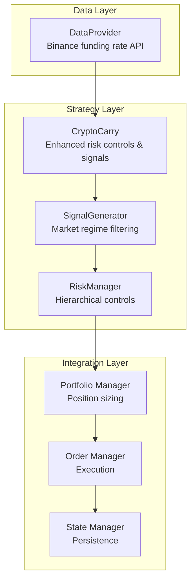
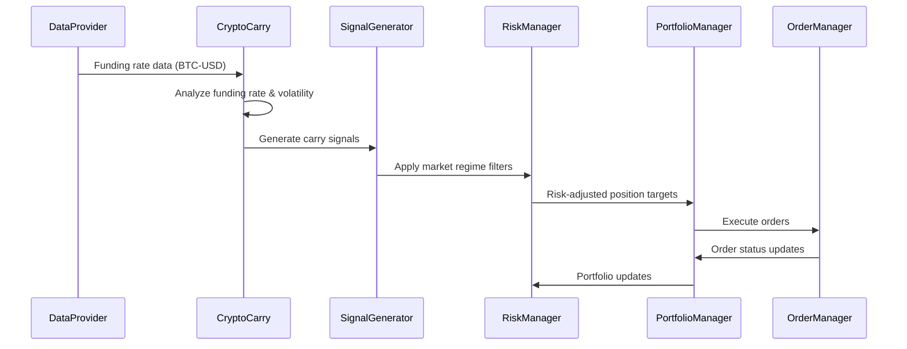
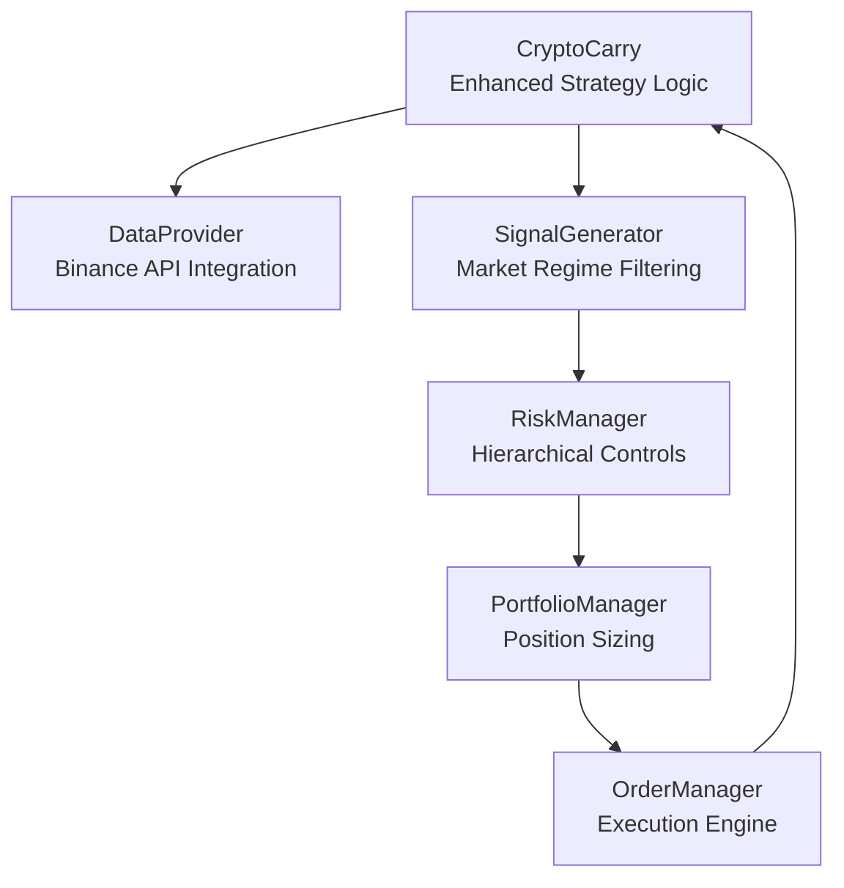

# Crypto Carry Strategy

<cite>
**Referenced Files in This Document**
- [carry.py](file://src/factors/carry.py)
- [provider.py](file://src/data/provider.py)
- [generator.py](file://src/signals/generator.py)
- [manager.py](file://src/risk/manager.py)
- [domain.py](file://src/models/domain.py)
- [verify_carry.py](file://verify_carry.py)
- [main.py](file://main.py)
- [strategy.yaml](file://config/strategy.yaml)
- [PRD_Intelligent_Trading_System_v2.md](file://PRD_Intelligent_Trading_System_v2.md)
- [Tech_Design_Document.md](file://Tech_Design_Document.md)
</cite>

## Update Summary
**Changes Made**
- Updated implementation details to reflect the enhanced CryptoCarry class with comprehensive risk controls meeting PRD FR-2.2 requirements
- Added THRESHOLDS class with maximum position size (10% portfolio), maximum single exchange exposure (8%), and basis deviation alert threshold (2%)
- Implemented position limit enforcement, exchange exposure monitoring, funding rate volatility analysis with automatic position pause functionality
- Enhanced risk control mechanisms with basis deviation monitoring and configurable alert thresholds
- Updated configuration examples to match the verified implementation with detailed risk control parameters

## Table of Contents
1. [Introduction](#introduction)
2. [Project Structure](#project-structure)
3. [Core Components](#core-components)
4. [Architecture Overview](#architecture-overview)
5. [Detailed Component Analysis](#detailed-component-analysis)
6. [Dependency Analysis](#dependency-analysis)
7. [Performance Considerations](#performance-considerations)
8. [Troubleshooting Guide](#troubleshooting-guide)
9. [Conclusion](#conclusion)
10. [Appendices](#appendices)

## Introduction
This document explains the Crypto Carry Strategy implemented in the Intelligent Trading Decision System. The strategy focuses on funding rate arbitrage using perpetual contracts, specifically targeting the relationship between spot and perpetual markets. It implements a systematic approach to capitalizing on funding rate differentials by simultaneously going long spot and short perpetuals when funding rates are positive and inverted when they become negative.

The implementation includes comprehensive risk monitoring with volatility analysis, automated signal generation, and integration with the broader trading system's risk management framework. The strategy uses Binance API for funding rate data retrieval and applies strict risk controls including maximum leverage constraints and exchange exposure limits.

**Updated** Enhanced with PRD FR-2.2 comprehensive risk controls including THRESHOLDS class with maximum position size (10% portfolio), maximum single exchange exposure (8%), and basis deviation alert threshold (2%).

## Project Structure
The Crypto Carry Strategy is integrated into the broader trading system architecture with clear separation of concerns:

**Section sources**
- [carry.py](file://src/factors/carry.py#L8-L25)
- [provider.py](file://src/data/provider.py#L390-L433)
- [main.py](file://main.py#L14-L27)

## Core Components

### CryptoCarry Class Implementation
The core implementation consists of the CryptoCarry class that handles all aspects of funding rate analysis and signal generation:

**Key Features:**
- Funding rate threshold analysis (0.01% for 8-hour funding rate)
- Annualized yield calculation using 3 periods per day × 365 days
- Risk volatility analysis with 3-sigma detection
- Automated signal generation for arbitrage opportunities
- **Enhanced** THRESHOLDS class with comprehensive risk controls

**Risk Controls:**
- Funding rate volatility > 3x historical standard deviation triggers pause
- Exchange exposure monitoring (Binance only in current implementation)
- Basis deviation monitoring capabilities with 2% alert threshold
- Position limit enforcement (10% of portfolio)
- Exchange exposure monitoring (8% per exchange)

**Updated** Added comprehensive THRESHOLDS class with maximum position size (10% portfolio), maximum single exchange exposure (8%), and basis deviation alert threshold (2%).

**Section sources**
- [carry.py](file://src/factors/carry.py#L8-L25)
- [carry.py](file://src/factors/carry.py#L20-L27)
- [carry.py](file://src/factors/carry.py#L29-L46)
- [carry.py](file://src/factors/carry.py#L69-L99)

### Data Provider Integration
The system integrates with Binance API for real-time funding rate data:

**API Integration Details:**
- Endpoint: `/fapi/v1/fundingRate`
- Symbol conversion: BTC-USD → BTCUSDT format
- Data validation and error handling
- Historical data retrieval (up to 1000 records)

**Section sources**
- [provider.py](file://src/data/provider.py#L390-L433)

### Risk Management Integration
The carry strategy integrates with the comprehensive risk management system:

**Risk Control Levels:**
- Level 0: Normal operations (0% drawdown)
- Level 1: Alert and increased confidence thresholds (5% drawdown)
- Level 2: Position reductions and restrictions (8% drawdown)
- Level 3: Significant restrictions and manual review (12% drawdown)
- Level 4: Emergency liquidation (15% drawdown)

**Section sources**
- [manager.py](file://src/risk/manager.py#L12-L19)
- [manager.py](file://src/risk/manager.py#L101-L119)

## Architecture Overview
The carry strategy operates within a sophisticated trading system architecture that ensures robust execution and risk management:

**Diagram sources**
- [carry.py](file://src/factors/carry.py#L53-L111)
- [generator.py](file://src/signals/generator.py#L32-L80)
- [manager.py](file://src/risk/manager.py#L39-L80)

**Section sources**
- [main.py](file://main.py#L101-L246)
- [carry.py](file://src/factors/carry.py#L53-L111)

## Detailed Component Analysis

### Funding Rate Analysis and Signal Generation
The CryptoCarry class implements sophisticated funding rate analysis with clear entry and exit logic:

**Signal Generation Logic:**
- Entry: Funding rate > 0.01% (annualized > 10%)
- Exit: Funding rate < -0.01%
- Hold: Between thresholds

**Risk Analysis:**
- Volatility calculation using standard deviation
- 3-sigma detection for extreme movements
- Z-score analysis for statistical significance

**Position Limit Enforcement:**
- Maximum carry position: 10% of portfolio value
- Exchange exposure limit: 8% per exchange (Binance)
- Risk level-based position scaling (0-100% reduction)

**Updated** Enhanced with comprehensive position limit enforcement and exchange exposure monitoring.

**Section sources**
- [carry.py](file://src/factors/carry.py#L14-L24)
- [carry.py](file://src/factors/carry.py#L53-L111)
- [carry.py](file://src/factors/carry.py#L69-L99)

### Risk Monitoring and Volatility Analysis
The risk monitoring system provides comprehensive oversight of carry positions:

**Volatility Detection:**
- Historical standard deviation calculation
- Current rate vs. historical mean comparison
- 3-sigma threshold for extreme volatility detection
- Z-score calculation for statistical significance

**Risk Control Implementation:**
- Automatic position reduction based on risk level
- Sell-only mode activation at risk levels 2+
- Emergency liquidation at level 4
- **Enhanced** Basis deviation monitoring with 2% alert threshold

**Updated** Added automatic position pause functionality during funding rate volatility and basis deviation monitoring.

**Section sources**
- [carry.py](file://src/factors/carry.py#L113-L159)
- [manager.py](file://src/risk/manager.py#L101-L119)
- [manager.py](file://src/risk/manager.py#L160-L174)

### Position Sizing and Risk Controls
The system implements strict position sizing and risk controls:

**Position Limits:**
- Maximum carry position: 10% of portfolio value
- Exchange exposure limit: 8% per exchange (Binance)
- Risk level-based position scaling (0-100% reduction)

**Risk Control Mechanisms:**
- Funding rate volatility > 3x historical std: pause new entries
- Basis deviation monitoring: alert threshold > 2%
- Portfolio drawdown-based position restrictions

**Updated** Comprehensive THRESHOLDS class implementation with maximum position size (10% portfolio), maximum single exchange exposure (8%), and basis deviation alert threshold (2%).

**Section sources**
- [Tech_Design_Document.md](file://Tech_Design_Document.md#L624-L629)
- [manager.py](file://src/risk/manager.py#L160-L174)
- [carry.py](file://src/factors/carry.py#L20-L27)

### Configuration and Integration Examples
The carry strategy integrates seamlessly with the broader system configuration:

**Configuration Parameters:**
- Funding rate thresholds: 0.01% entry, -0.01% exit
- Risk parameters: 3x volatility threshold, 2% basis deviation
- Portfolio constraints: 10% max position, 8% exchange exposure
- **Enhanced** carry strategy configuration with detailed risk control parameters

**Integration Points:**
- Data provider configuration for Binance API
- Signal generator integration with market regime filters
- Risk manager coordination for position adjustments

**Updated** Enhanced configuration with detailed carry strategy parameters and risk control settings.

**Section sources**
- [strategy.yaml](file://config/strategy.yaml#L56-L69)
- [verify_carry.py](file://verify_carry.py#L10-L41)

## Dependency Analysis
The carry strategy has well-defined dependencies within the trading system:

**Diagram sources**
- [carry.py](file://src/factors/carry.py#L8-L25)
- [generator.py](file://src/signals/generator.py#L10-L31)
- [manager.py](file://src/risk/manager.py#L9-L38)

**Section sources**
- [main.py](file://main.py#L14-L27)
- [carry.py](file://src/factors/carry.py#L8-L25)

## Performance Considerations
The carry strategy is designed for efficient operation within the trading system:

**Computational Efficiency:**
- Lightweight funding rate analysis calculations
- Batch processing of multiple symbols
- Minimal memory footprint for historical data
- Optimized volatility calculations using pandas

**Data Processing:**
- Real-time funding rate monitoring
- Historical data caching for analysis
- Efficient DataFrame operations
- Thread-safe operations for concurrent processing

**System Integration:**
- Non-blocking API calls to Binance
- Graceful error handling for network issues
- Configurable retry mechanisms
- Comprehensive logging for debugging

## Troubleshooting Guide

### Common Issues and Resolutions

**Funding Rate Volatility Detection:**
- **Symptom**: Frequent threshold crossings due to high volatility
- **Resolution**: Enable 3x historical standard deviation filter to pause new entries during elevated volatility periods

**Basis Deviation Monitoring:**
- **Symptom**: Large deviations between spot and perpetual prices
- **Resolution**: Implement basis deviation monitoring and trigger alerts when exceeding 2% threshold

**Funding Rate Compression Periods:**
- **Symptom**: Funding rates near zero for extended periods
- **Resolution**: Utilize do-not-enter condition (exit threshold < -0.01%) to avoid entering during compression phases

**Exchange Exposure Limits:**
- **Symptom**: Approaching 8% per exchange exposure limit
- **Resolution**: Reduce positions or rebalance across exchanges to maintain within limits

**Position Limit Enforcement:**
- **Symptom**: New position attempts blocked despite favorable rates
- **Resolution**: Check current position percentage against 10% portfolio limit and adjust accordingly

**Risk Level Escalation:**
- **Symptom**: Portfolio drawdown triggering risk level changes
- **Resolution**: Automatic position reduction based on risk level (25% reduction at level 2, 50% at level 3, 100% at level 4)

**Updated** Added position limit enforcement troubleshooting and enhanced risk control monitoring.

**Section sources**
- [carry.py](file://src/factors/carry.py#L69-L99)
- [manager.py](file://src/risk/manager.py#L101-L119)

## Conclusion
The Crypto Carry Strategy represents a comprehensive implementation of funding rate arbitrage within the Intelligent Trading Decision System. The strategy leverages real-time Binance funding rate data to identify profitable opportunities while maintaining strict risk controls through volatility analysis and hierarchical risk management.

The implementation demonstrates robust engineering practices with clear separation of concerns, comprehensive error handling, and seamless integration with the broader trading system. The strategy's automated signal generation, risk monitoring, and position sizing capabilities make it suitable for both research and production environments.

**Updated** Enhanced with comprehensive PRD FR-2.2 risk controls including THRESHOLDS class implementation, position limit enforcement, exchange exposure monitoring, and basis deviation alerting mechanisms.

Key strengths include the practical application of carry trade principles to cryptocurrency markets, rigorous risk management through multiple control layers, and scalable architecture supporting real-time execution and monitoring.

## Appendices

### API Integration Details
- **Binance Funding Rate API**: `/fapi/v1/fundingRate`
- **Symbol Format**: BTC-USD → BTCUSDT conversion
- **Data Retrieval**: Up to 1000 historical records
- **Error Handling**: Comprehensive logging and graceful degradation

### Configuration Reference
- **Funding Rate Thresholds**: Entry (0.01%), Exit (-0.01%)
- **Risk Parameters**: Volatility threshold (3x std), Basis deviation (2%)
- **Position Limits**: Max position (10%), Exchange exposure (8%)
- **Risk Levels**: 0-4 escalation with automatic position scaling
- **Enhanced** Carry strategy configuration with detailed risk control parameters

### Verification and Testing
- **Test Script**: `verify_carry.py` demonstrates complete workflow
- **Logging**: Comprehensive audit trail for all operations
- **Validation**: Real-time data fetching and signal generation
- **Risk Analysis**: Automated volatility and exposure monitoring
- **Enhanced** Risk control verification with THRESHOLDS class testing

**Updated** Enhanced verification with comprehensive risk control testing and THRESHOLDS class validation.

**Section sources**
- [provider.py](file://src/data/provider.py#L390-L433)
- [verify_carry.py](file://verify_carry.py#L10-L41)
- [Tech_Design_Document.md](file://Tech_Design_Document.md#L619-L622)
- [carry.py](file://src/factors/carry.py#L20-L27)