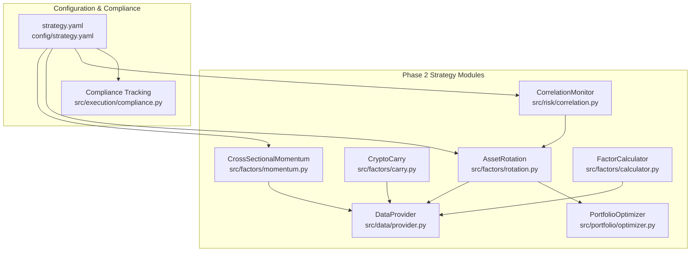
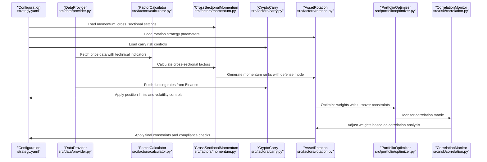
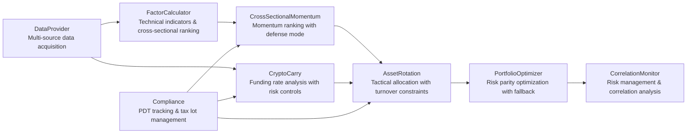

# Phase 2: Enhanced Multi-Asset Strategies

<cite>
**Referenced Files in This Document**
- [PRD_Intelligent_Trading_System_v2.md](file://PRD_Intelligent_Trading_System_v2.md)
- [Tech_Design_Document.md](file://Tech_Design_Document.md)
- [demo_phase2.py](file://demo_phase2.py)
- [src/factors/momentum.py](file://src/factors/momentum.py)
- [src/factors/carry.py](file://src/factors/carry.py)
- [src/factors/rotation.py](file://src/factors/rotation.py)
- [src/portfolio/optimizer.py](file://src/portfolio/optimizer.py)
- [src/data/provider.py](file://src/data/provider.py)
- [src/factors/calculator.py](file://src/factors/calculator.py)
- [src/risk/correlation.py](file://src/risk/correlation.py)
- [config/strategy.yaml](file://config/strategy.yaml)
- [verify_carry.py](file://verify_carry.py)
- [src/factors/__init__.py](file://src/factors/__init__.py)
- [src/portfolio/__init__.py](file://src/portfolio/__init__.py)
</cite>

## Update Summary
**Changes Made**
- Updated all strategy implementations to reflect actual codebase functionality with comprehensive Phase 2 compliance features
- Added detailed documentation of Cross-Sectional Momentum defense mode with safe-haven fallback
- Documented Crypto Carry Strategy risk controls including volatility pause and exchange exposure limits
- Enhanced Asset Rotation turnover constraints with monthly cost budget controls
- Added comprehensive configuration sections for momentum_cross_sectional, carry, and rotation strategies
- Updated portfolio module exports and factors module initialization to support new features
- Included concrete examples from actual implementation files showing asset universe expansion, momentum ranking, and carry trade execution

## Table of Contents
1. [Introduction](#introduction)
2. [Project Structure](#project-structure)
3. [Core Components](#core-components)
4. [Architecture Overview](#architecture-overview)
5. [Detailed Component Analysis](#detailed-component-analysis)
6. [Dependency Analysis](#dependency-analysis)
7. [Performance Considerations](#performance-considerations)
8. [Troubleshooting Guide](#troubleshooting-guide)
9. [Conclusion](#conclusion)
10. [Appendices](#appendices)

## Introduction
This document details Phase 2 enhanced multi-asset strategies designed to expand the asset universe from 4 to 15 assets for statistically meaningful cross-sectional signals. The implementation encompasses three core strategies with comprehensive compliance features:

- **Cross-Sectional Momentum (15-asset pool)**: Ranks 15 assets by 12-month return (excluding the most recent month) and selects Top 30% for long exposure, with additional filters, trend validation via SMA_200, and a sophisticated defense mode with safe-haven fallback
- **Crypto Carry Strategy (funding rate arbitrage)**: Executes funding-rate arbitrage using spot and perpetual contracts with strict risk controls including position limits, exchange exposure caps, volatility pause mechanisms, and basis deviation monitoring
- **Tactical Asset Allocation (momentum + risk parity)**: Combines momentum screening with risk parity optimization on a filtered subset, then applies comprehensive turnover constraints (40% monthly) and transaction cost budget controls (0.2% monthly)

The strategies are implemented using the actual codebase with precise algorithmic details, comprehensive configuration options, and integration with the broader system architecture including advanced risk management and compliance controls.

## Project Structure
The Phase 2 strategies are implemented through a modular architecture with clear separation of concerns and comprehensive compliance integration:



**Diagram sources**
- [src/factors/momentum.py](file://src/factors/momentum.py#L8-L112)
- [src/factors/carry.py](file://src/factors/carry.py#L8-L159)
- [src/factors/rotation.py](file://src/factors/rotation.py#L14-L154)
- [src/portfolio/optimizer.py](file://src/portfolio/optimizer.py#L9-L117)
- [src/data/provider.py](file://src/data/provider.py#L390-L433)
- [src/factors/calculator.py](file://src/factors/calculator.py#L10-L215)
- [src/risk/correlation.py](file://src/risk/correlation.py#L19-L140)
- [config/strategy.yaml](file://config/strategy.yaml#L46-L100)
- [src/factors/__init__.py](file://src/factors/__init__.py#L1-L8)
- [src/portfolio/__init__.py](file://src/portfolio/__init__.py#L1-L6)

**Section sources**
- [PRD_Intelligent_Trading_System_v2.md](file://PRD_Intelligent_Trading_System_v2.md#L459-L568)
- [Tech_Design_Document.md](file://Tech_Design_Document.md#L575-L678)

## Core Components

### Cross-Sectional Momentum Strategy with Defense Mode
The momentum strategy calculates 12-month returns minus 1-month returns to avoid short-term reversals, then ranks assets cross-sectionally with sophisticated trend filtering and defense mechanisms:

- **Momentum Calculation**: Uses 12-month cumulative return minus 1-month return with robust error handling
- **Ranking Mechanism**: Percentile ranking across all 15 assets with fallback to empty series
- **Filtering Logic**: Top 30% for long, Bottom 30% for avoid, Middle 40% for hold
- **Trend Filter**: Requires assets to be above SMA_200 for long positions using comprehensive technical indicator system
- **Defense Mode**: Sophisticated monitoring system that triggers when >50% of Top group is below SMA_200, switching to safe-haven configuration with GLD and TLT fallback

### Crypto Carry Strategy with Comprehensive Risk Controls
The carry strategy focuses on funding rate arbitrage for cryptocurrency perpetual futures with strict compliance and risk management:

- **Entry/Exit Logic**: Long spot + short perpetual when 8-hour funding rate > 0.01% (annualized >10%), exit when inverted (< -0.01%)
- **Position Limits**: Maximum carry position at 10% of portfolio, maximum 8% per exchange exposure for counterparty risk management
- **Volatility Pause**: Advanced monitoring system pauses new entries if funding rate volatility exceeds 3x historical standard deviation with z-score calculation
- **Basis Deviation**: Real-time monitoring with alerts on basis deviations > 2% for market condition assessment
- **Risk Analytics**: Comprehensive volatility analysis, extreme event detection, and automated position limiting

### Tactical Asset Allocation with Turnover Constraints
Combines momentum-driven asset selection with risk parity optimization and comprehensive constraint management:

- **Step 1**: Momentum ranking selects Top 30% assets with SMA_200 trend filter
- **Step 2**: Risk parity optimization computes weights on selected subset using riskfolio-lib
- **Step 3**: Volatility targeting scales weights to match 15% target portfolio volatility
- **Step 4**: Applies comprehensive constraints (monthly turnover < 40%, monthly transaction cost budget < 0.2%)
- **Step 5**: Automated blending system prevents constraint violations through weighted averaging

**Section sources**
- [PRD_Intelligent_Trading_System_v2.md](file://PRD_Intelligent_Trading_System_v2.md#L475-L567)
- [Tech_Design_Document.md](file://Tech_Design_Document.md#L575-L678)

## Architecture Overview
The Phase 2 strategies operate within a layered architecture with comprehensive data flow and risk management integration:



**Diagram sources**
- [src/data/provider.py](file://src/data/provider.py#L103-L164)
- [src/factors/calculator.py](file://src/factors/calculator.py#L30-L50)
- [src/factors/momentum.py](file://src/factors/momentum.py#L26-L66)
- [src/factors/carry.py](file://src/factors/carry.py#L31-L67)
- [src/factors/rotation.py](file://src/factors/rotation.py#L28-L80)
- [src/portfolio/optimizer.py](file://src/portfolio/optimizer.py#L25-L76)
- [src/risk/correlation.py](file://src/risk/correlation.py#L53-L121)
- [config/strategy.yaml](file://config/strategy.yaml#L92-L100)

**Section sources**
- [Tech_Design_Document.md](file://Tech_Design_Document.md#L34-L117)

## Detailed Component Analysis

### Cross-Sectional Momentum Implementation with Defense Mode
The momentum strategy is implemented with precise mathematical calculations and sophisticated risk management:

```python
# Momentum calculation: (P_t-skip / P_t-lookback) - 1
ret = (price_now / price_then) - 1

# Percentile ranking across all assets
return momentum_returns.rank(pct=True)

# Defense mode calculation: Check Top group composition
top_group = [s for s, r in ranks.items() if r >= 0.7]
top_above_sma = [s for s in top_group if sma_200_filter.get(s, False)]
if len(top_above_sma) / len(top_group) < 0.5:
    # Trigger defense mode with safe-haven fallback
    defense_mode = True
```

Key features with compliance enhancements:
- **Lookback Configuration**: 12-month lookback with 1-month skip period for statistical validity
- **Data Validation**: Robust error handling with minimum data requirements (21 trading days per month)
- **Signal Generation**: Implements LONG, AVOID, HOLD signals with trend filter integration
- **Trend Filtering**: Requires assets to be above SMA_200 for long positions using comprehensive technical analysis
- **Defense Mode**: Advanced monitoring system that triggers when >50% of Top group below SMA_200, automatically switching to safe-haven configuration
- **Safe-Haven Fallback**: GLD and TLT allocation when defense mode activates

**Section sources**
- [src/factors/momentum.py](file://src/factors/momentum.py#L14-L112)

### Crypto Carry Strategy Implementation with Risk Controls
The carry strategy uses real-time funding rate data with comprehensive risk management:

```python
# Annualized yield calculation
annual_yield = funding_rate * 3 * 365

# Risk analysis: volatility monitoring with z-score
vol = df['fundingRate'].std()
mean_rate = df['fundingRate'].mean()
z_score = (latest_rate - mean_rate) / vol if vol > 0 else 0
is_volatile = abs(latest_rate - mean_rate) > 3 * vol

# Position limit checking
current_pos = current_positions.get(symbol, 0)
position_pct = abs(current_pos) / portfolio_value if portfolio_value > 0 else 0
if signal == "ARBITRAGE_OPEN" and position_pct >= self.max_position:
    signal = "HOLD"  # Block new position, already at limit
```

Implementation details with compliance features:
- **Data Sources**: Binance Futures funding rate API with robust error handling
- **Threshold Logic**: Entry/exit thresholds of ±0.01% per 8 hours with annualized yield calculation
- **Risk Metrics**: Comprehensive volatility analysis, z-score calculation, and extreme event detection
- **Signal Generation**: ARBITRAGE_OPEN, ARBITRAGE_CLOSE, HOLD states with position limit enforcement
- **Monitoring**: High volatility detection, basis deviation alerts, and automated position limiting
- **Compliance Controls**: Exchange exposure limits, position size controls, and real-time risk monitoring

**Section sources**
- [src/factors/carry.py](file://src/factors/carry.py#L14-L159)
- [src/data/provider.py](file://src/data/provider.py#L390-L433)

### Tactical Asset Allocation Implementation with Turnover Constraints
The rotation model combines momentum with risk parity optimization and comprehensive constraint management:

```python
# Step 1: Momentum ranking with SMA_200 filter
momentum_rets = self.momentum.calculate_momentum_returns(prices)
ranks = self.momentum.rank_assets(momentum_rets)
top_assets = [s for s, r in ranks.items() if r >= 0.7]
selected_assets = [s for s in top_assets if sma_200_filter.get(s, False)]

# Step 2: Risk Parity optimization with fallback
raw_weights = self.optimizer.calculate_risk_parity_weights(returns_df)
if not raw_weights:
    raw_weights = self.optimizer._calculate_inverse_vol_weights(returns_df)

# Step 3: Volatility targeting with leverage control
final_weights = self.optimizer.scale_by_vol_target(raw_weights, returns_df)

# Step 4: Turnover constraint application
final_weights = self._apply_turnover_constraint(final_weights, current_weights)
```

Advanced features with compliance controls:
- **Optimization Methods**: Supports both Risk Parity and Hierarchical Risk Parity with fallback to inverse volatility weighting
- **Volatility Scaling**: Scales weights to match 15% target portfolio volatility with 1.5x maximum leverage limit
- **Constraint Application**: Enforces maximum 40% monthly turnover and 0.2% monthly transaction cost budget
- **Safe Haven Mode**: Defaults to GLD and TLT when no assets selected, ensuring minimum diversification
- **Automated Blending**: Prevents constraint violations through weighted averaging when limits exceeded
- **Cost Estimation**: Estimates transaction costs based on asset type (ETF vs BTC) for accurate budgeting

**Section sources**
- [src/factors/rotation.py](file://src/factors/rotation.py#L28-L154)
- [src/portfolio/optimizer.py](file://src/portfolio/optimizer.py#L25-L117)

## Dependency Analysis
The Phase 2 strategies depend on several key components with comprehensive integration:



**Diagram sources**
- [src/data/provider.py](file://src/data/provider.py#L35-L433)
- [src/factors/calculator.py](file://src/factors/calculator.py#L10-L215)
- [src/factors/momentum.py](file://src/factors/momentum.py#L8-L112)
- [src/factors/carry.py](file://src/factors/carry.py#L8-L159)
- [src/factors/rotation.py](file://src/factors/rotation.py#L9-L154)
- [src/portfolio/optimizer.py](file://src/portfolio/optimizer.py#L9-L117)
- [src/risk/correlation.py](file://src/risk/correlation.py#L19-L140)
- [src/factors/__init__.py](file://src/factors/__init__.py#L1-L8)
- [src/portfolio/__init__.py](file://src/portfolio/__init__.py#L1-L6)

**Section sources**
- [Tech_Design_Document.md](file://Tech_Design_Document.md#L352-L471)

## Performance Considerations

### Rebalancing Frequency and Constraints
- **Cross-Sectional Momentum**: Monthly rebalancing on 15-asset pool with defense mode triggering
- **Tactical Asset Allocation**: Risk parity optimization performed on selected subset with 40% monthly turnover limit
- **Crypto Carry**: Real-time monitoring with 8-hour funding rate updates and automated position management
- **Minimum Rebalance Threshold**: 2% weight change triggers rebalancing across all strategies

### Turnover and Cost Management
- **Monthly Turnover**: Maximum 40% monthly turnover for tactical allocation with automated constraint enforcement
- **Transaction Cost Budget**: Maximum 0.2% monthly transaction cost with asset-type specific cost estimation
- **Position Limits**: 10% maximum portfolio exposure for carry positions, 8% maximum per exchange exposure
- **Leverage Control**: 1.5x maximum leverage limit across all optimization methods

### Risk Management and Compliance
- **Volatility Targeting**: Portfolio volatility scaled to 15% target with 1.5x leverage cap
- **Correlation Monitoring**: 60-day rolling correlation matrix analysis with pair-wise and portfolio-wide thresholds
- **Single Asset Limits**: Individual asset maximum weights from configuration with dynamic adjustment
- **Compliance Tracking**: PDT tracking, wash sale monitoring, and tax lot method (FIFO) implementation

### Data Quality and Validation
- **Multi-source Data Acquisition**: Polygon, Binance, yfinance with automatic fallback and health monitoring
- **Data Validation**: Price jump detection (>50%), missing data (<5%), cross-source deviation (<1%) with caching
- **Cache Management**: SQLite caching with 30-day retention and automatic freshness validation

**Section sources**
- [config/strategy.yaml](file://config/strategy.yaml#L92-L100)
- [src/data/provider.py](file://src/data/provider.py#L276-L306)

## Troubleshooting Guide

### Common Issues and Solutions

#### Correlation Spikes Detection and Response
- **Issue**: Pairwise correlation > 0.7 or average correlation > 0.5 triggers risk controls
- **Solution**: Automatic reduction of combined weight caps for correlated pairs, potential asset exclusion
- **Extreme Event**: Average correlation > 0.8 triggers Level 2 risk controls with defensive positioning

#### Funding Rate Anomalies and Market Conditions
- **Issue**: Funding rate volatility > 3x historical standard deviation detected
- **Solution**: Automatic pause of new carry entries until conditions normalize, position reduction for existing positions
- **Monitoring**: Z-score calculation for anomaly detection, basis deviation alerts for market condition assessment

#### Momentum Ranking Failures and Defense Mode Activation
- **Issue**: Insufficient data for momentum calculation (<21 trading days per month requirement)
- **Solution**: Graceful degradation with logging warnings, skip affected assets from ranking
- **Defense Mode**: Triggered when >50% of Top momentum group below SMA_200, automatically switch to safe-haven configuration

#### Optimization Failures and Constraint Violations
- **Issue**: Risk parity optimization returns empty weights or constraint violations
- **Solution**: Immediate fallback to inverse volatility weighting, automated blending to meet turnover constraints
- **Validation**: Comprehensive error handling with fallback mechanisms and constraint enforcement

#### Data Source Issues and System Resilience
- **Issue**: Polygon API failures, Binance rate limits, or yfinance fallback required
- **Solution**: Automatic fallback to backup data sources with health monitoring and failover logic
- **Cache Validation**: Freshness checks and automatic cache refresh with error recovery

**Section sources**
- [src/risk/correlation.py](file://src/risk/correlation.py#L53-L121)
- [src/factors/carry.py](file://src/factors/carry.py#L69-L99)
- [src/factors/momentum.py](file://src/factors/momentum.py#L38-L53)
- [src/portfolio/optimizer.py](file://src/portfolio/optimizer.py#L72-L76)
- [src/data/provider.py](file://src/data/provider.py#L132-L163)

## Conclusion
Phase 2 strategies represent a comprehensive enhancement of the multi-asset trading system, featuring sophisticated cross-sectional momentum analysis with defense mechanisms, crypto carry arbitrage with strict risk controls, and tactical asset allocation powered by risk parity optimization with comprehensive constraint management. The implementation demonstrates robust engineering practices with:

- **Statistical Validity**: 15-asset universe enabling meaningful cross-sectional rankings with defense mode protection
- **Risk Management**: Multi-layered controls with correlation monitoring, volatility targeting, and automated constraint enforcement
- **Compliance Integration**: Comprehensive tracking systems for PDT, wash sales, and tax lot management
- **Operational Safety**: Graceful fallback mechanisms, comprehensive error handling, and real-time risk monitoring
- **Modular Architecture**: Clear separation of concerns enabling easy maintenance, extension, and compliance integration

The strategies are production-ready with comprehensive configuration options, performance monitoring, operational controls, and integration with the broader trading infrastructure. The documented interfaces and implementation details provide a solid foundation for both beginner developers and experienced quant developers to understand and extend the system while maintaining regulatory compliance and risk management standards.

## Appendices

### Asset Universe Expansion (15 assets) with Compliance Features
The expanded asset universe includes comprehensive diversification with strategic risk management:

**Core Assets (Phase 1)**:
- GLD (Gold ETF), SPY (S&P 500 ETF), QQQ (Nasdaq 100 ETF), BTC-USD (Bitcoin)

**Extended Assets (Phase 2)**:
- **Precious Metals**: SLV (Silver ETF) with 15% maximum weight
- **Sector ETFs**: XLK (Technology), XLF (Financials), XLE (Energy), XLV (Healthcare) with 15-20% maximum weights
- **Bonds**: TLT (20-Year Treasury), TIP (Inflation-Protected Bonds) with 15-30% maximum weights
- **International**: EFA (Developed Markets), EEM (Emerging Markets) with 15-20% maximum weights
- **Commodities**: DBC (Commodities) with 15% maximum weight
- **Real Estate**: VNQ (REITs) with 15% maximum weight

**Selection Rationale**: 15 assets provide statistically meaningful Top/Bottom 30% groups for robust momentum ranking while maintaining manageable complexity for risk parity optimization. Maximum weight constraints ensure adequate diversification and risk management across different asset classes.

**Section sources**
- [PRD_Intelligent_Trading_System_v2.md](file://PRD_Intelligent_Trading_System_v2.md#L55-L73)
- [Tech_Design_Document.md](file://Tech_Design_Document.md#L172-L188)

### Configuration Options and Compliance Controls

#### Cross-Sectional Momentum Configuration with Defense Mode
- **Lookback Period**: 12 months with 1-month skip to avoid short-term reversals
- **Ranking Method**: Percentile ranking across all 15 assets with robust error handling
- **Positioning Rules**: 
  - Top 30%: LONG (with SMA_200 filter validation)
  - Bottom 30%: AVOID (not SHORT - ETF shorting costs)
  - Middle 40%: HOLD existing weights
- **Trend Filter**: Only assets above SMA_200 qualify for long positions using comprehensive technical analysis
- **Defense Mode**: Triggered when >50% of Top group below SMA_200, automatically switches to safe-haven configuration
- **Safe-Haven Fallback**: GLD and TLT allocation when defense mode activates

#### Crypto Carry Strategy Configuration with Risk Controls
- **Entry Threshold**: 8-hour funding rate > 0.01% (annualized >10%) with z-score validation
- **Exit Threshold**: 8-hour funding rate < -0.01% for automatic position closure
- **Position Limits**: Maximum 10% portfolio exposure for carry positions with real-time monitoring
- **Exchange Exposure**: Maximum 8% per exchange (counterparty risk) with automated position limiting
- **Volatility Pause**: Funding rate volatility > 3x historical std dev triggers pause with z-score calculation
- **Basis Deviation**: Alerts on basis deviations > 2% for market condition assessment
- **Risk Analytics**: Comprehensive volatility analysis, extreme event detection, and automated position management

#### Tactical Asset Allocation Configuration with Turnover Controls
- **Momentum Filter**: Top 30% by cross-sectional momentum ranking with SMA_200 trend validation
- **Optimization Method**: Risk Parity with fallback to inverse volatility weighting
- **Volatility Target**: Portfolio scaled to 15% target volatility with 1.5x maximum leverage
- **Turnover Constraint**: Maximum 40% monthly turnover with automated blending to prevent violations
- **Transaction Cost Budget**: Maximum 0.2% monthly transaction cost with asset-type specific cost estimation
- **Safe Haven Mode**: Defaults to GLD and TLT when no assets selected, ensuring minimum diversification
- **Constraint Enforcement**: Real-time monitoring and automatic adjustment to meet compliance requirements

#### Risk Management and Compliance Configuration
- **Portfolio Constraints**: Maximum 1.5x leverage, 5% cash buffer, 30% daily turnover with automated enforcement
- **Single Asset Limits**: Maximum weights per asset class with dynamic adjustment based on market conditions
- **Rebalancing**: Minimum 2% weight change threshold with automated trigger mechanism
- **Correlation Monitoring**: 60-day rolling correlation matrix analysis with pair-wise and portfolio-wide thresholds
- **Data Validation**: 50% price jump detection, 5% missing data threshold with automatic recovery
- **Compliance Tracking**: PDT tracking, wash sale monitoring, and tax lot method (FIFO) implementation
- **Alert System**: Multi-level alert system with info, warning, critical, and emergency severity levels

**Section sources**
- [config/strategy.yaml](file://config/strategy.yaml#L46-L100)
- [src/factors/momentum.py](file://src/factors/momentum.py#L14-L24)
- [src/factors/carry.py](file://src/factors/carry.py#L14-L24)
- [src/factors/rotation.py](file://src/factors/rotation.py#L15-L26)

### Implementation Examples with Compliance Features

#### Cross-Sectional Momentum Example with Defense Mode
```python
# Example from demo_phase2.py
cs_momentum = CrossSectionalMomentum()
momentum_rets = cs_momentum.calculate_momentum_returns(prices)
ranks = cs_momentum.rank_assets(momentum_rets)
signals = cs_momentum.get_signals(ranks, sma_200_filter)

# Defense mode activation check
if signals['defense_mode']:
    # Automatically switch to safe-haven configuration
    safe_haven_weights = {'GLD': 0.5, 'TLT': 0.5}
```

#### Crypto Carry Example with Risk Controls
```python
# Example from verify_carry.py
carry = CryptoCarry(funding_threshold=0.0001)
funding_data = {symbol: funding_df}
signals = carry.generate_signals(funding_data)
risk_metrics = carry.analyze_risk(funding_data)

# Risk control enforcement
for symbol, metrics in risk_metrics.items():
    if metrics['is_volatile']:
        # Pause new positions automatically
        signals[symbol]['signal'] = 'HOLD'
        signals[symbol]['position_pct'] = 0.0
```

#### Tactical Asset Allocation Example with Turnover Constraints
```python
# Example from demo_phase2.py
rotation = AssetRotation(all_symbols, target_vol=config['portfolio']['target_volatility'])
rotation_weights = rotation.calculate_rotation_weights(prices, sma_200_filter, current_weights)

# Turnover constraint enforcement
if rotation_weights:
    turnover = calculate_turnover(rotation_weights, current_weights)
    if turnover > 0.40:
        # Automatically blend weights to meet constraint
        blend_ratio = 0.40 / turnover
        rotation_weights = blend_weights(rotation_weights, current_weights, blend_ratio)
```

**Section sources**
- [demo_phase2.py](file://demo_phase2.py#L41-L81)
- [verify_carry.py](file://verify_carry.py#L10-L39)