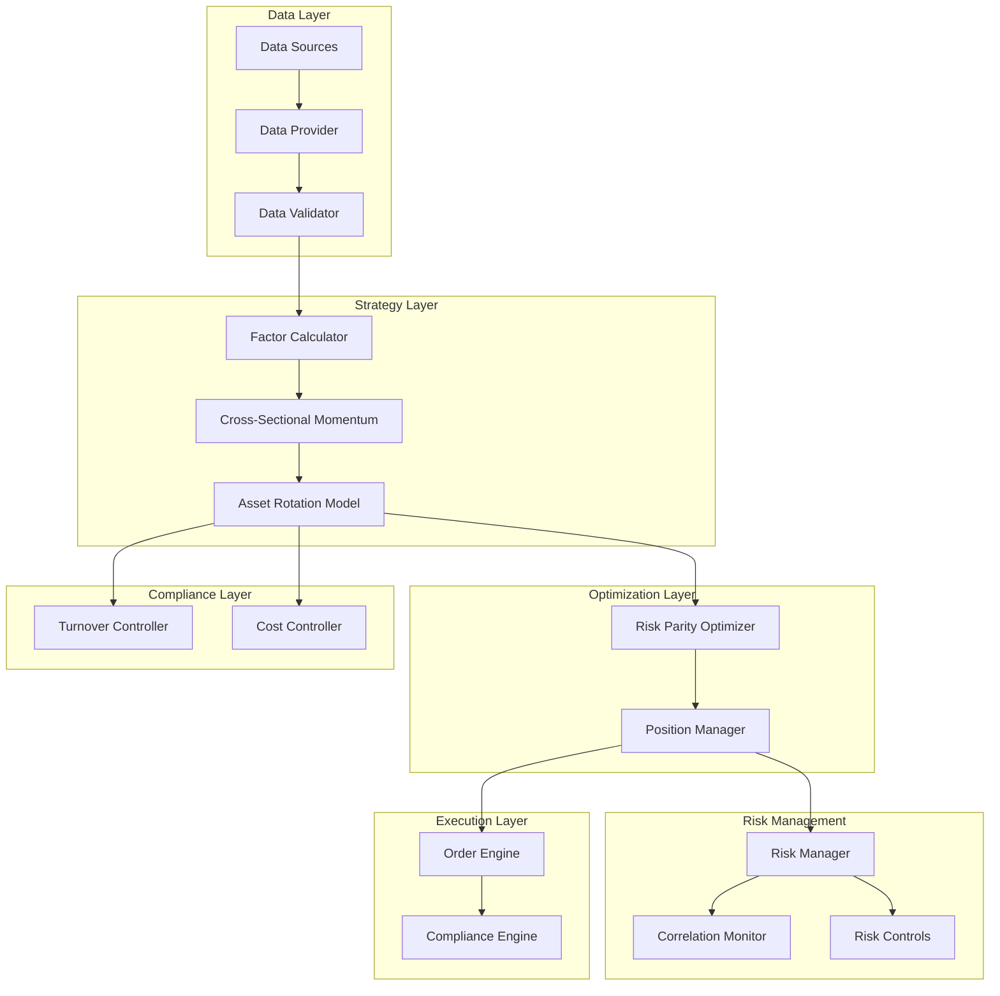
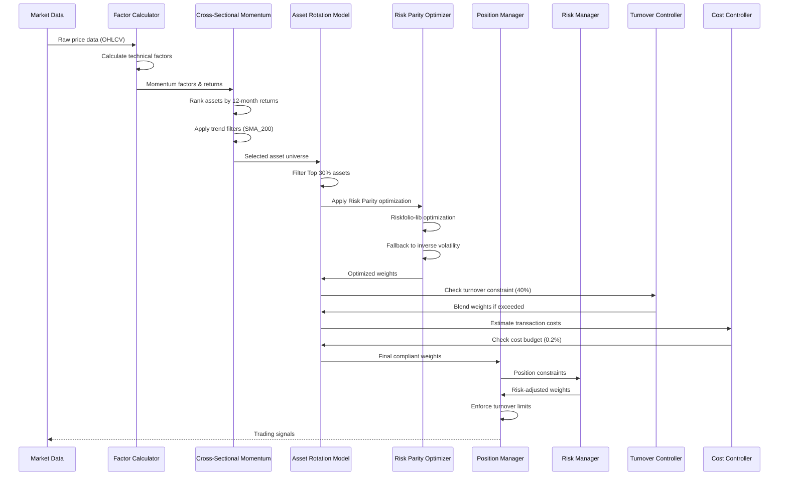
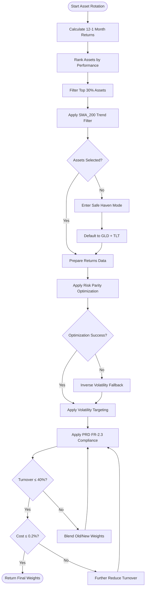
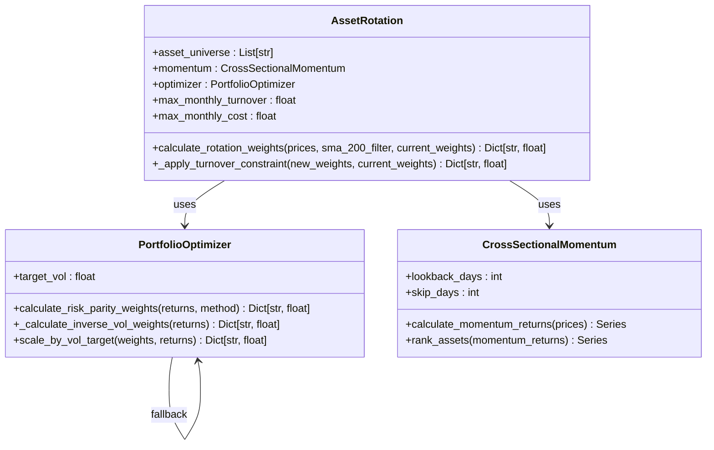
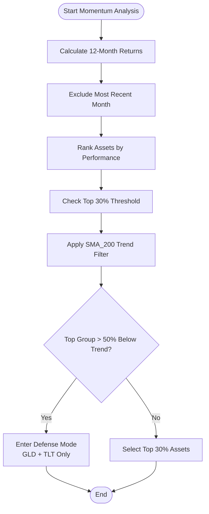
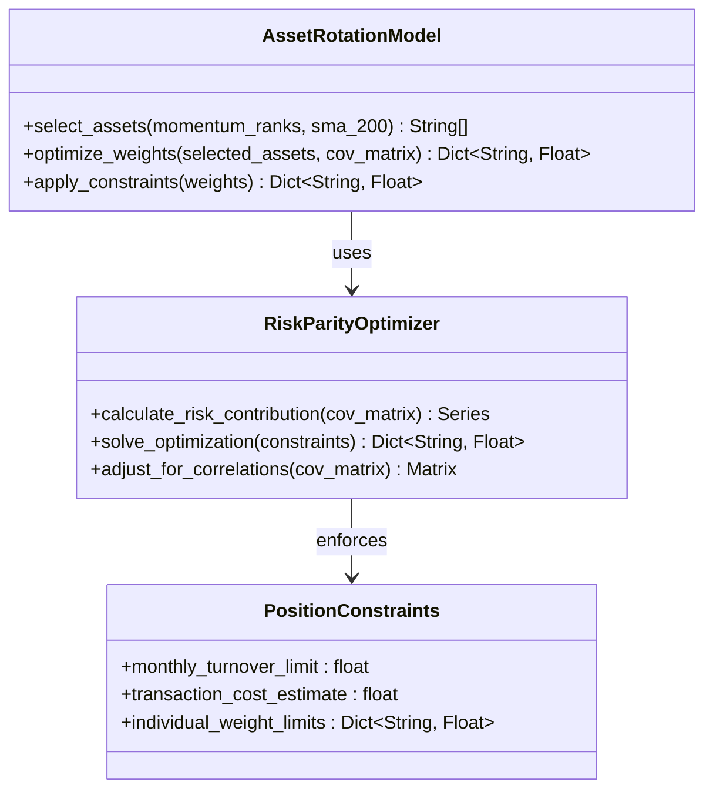
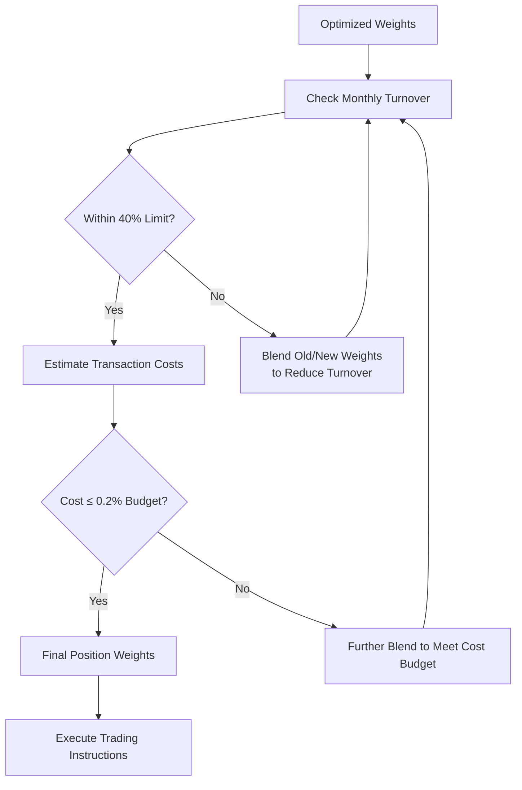
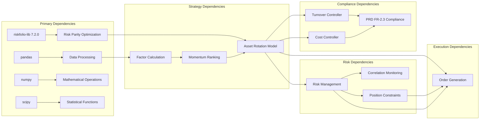

# Tactical Asset Allocation

<cite>
**Referenced Files in This Document**
- [rotation.py](file://src/factors/rotation.py)
- [optimizer.py](file://src/portfolio/optimizer.py)
- [momentum.py](file://src/factors/momentum.py)
- [strategy.yaml](file://config/strategy.yaml)
- [demo_phase2.py](file://demo_phase2.py)
- [poetry.lock](file://poetry.lock)
- [Tech_Design_Document.md](file://Tech_Design_Document.md)
- [PRD_Intelligent_Trading_System_v2.md](file://PRD_Intelligent_Trading_System_v2.md)
- [code_review_log.md](file://code_review_log.md)
</cite>

## Update Summary
**Changes Made**
- Enhanced Asset Rotation model with PRD FR-2.3 compliance features
- Added maximum monthly turnover constraint (40%) and maximum monthly transaction cost budget (0.2%)
- Implemented sophisticated turnover constraint system with automatic weight blending
- Added cost estimation system using different commission models for BTC (0.25%) versus ETFs (0.15%)
- Updated architecture diagrams to reflect new compliance requirements
- Enhanced troubleshooting guidance for turnover constraint management

## Table of Contents
1. [Introduction](#introduction)
2. [Project Structure](#project-structure)
3. [Core Components](#core-components)
4. [Architecture Overview](#architecture-overview)
5. [Detailed Component Analysis](#detailed-component-analysis)
6. [PRD FR-2.3 Compliance Features](#prdf-r-23-compliance-features)
7. [Dependency Analysis](#dependency-analysis)
8. [Performance Considerations](#performance-considerations)
9. [Troubleshooting Guide](#troubleshooting-guide)
10. [Conclusion](#conclusion)

## Introduction

The Tactical Asset Allocation strategy represents a sophisticated two-step investment approach that combines cross-sectional momentum ranking with risk parity optimization. This strategy aims to capture systematic return differentials across asset classes while maintaining optimal risk distribution throughout the portfolio.

**Updated** The strategy now features a dedicated Asset Rotation model that integrates riskfolio-lib for advanced portfolio optimization and includes comprehensive PRD FR-2.3 compliance features. The model enforces strict turnover and cost constraints to ensure regulatory adherence while maintaining optimal portfolio construction.

The strategy operates on a monthly rebalancing cycle, utilizing momentum rankings to identify superior-performing assets and then applying mathematical optimization to distribute capital according to risk contribution rather than dollar amounts. This approach addresses both the timing and diversification challenges inherent in multi-asset portfolio management while meeting regulatory requirements for prudent risk management.

## Project Structure

The Intelligent Trading System follows a modular architecture designed to support the Tactical Asset Allocation strategy alongside other trading approaches. The system is organized into distinct layers that handle data ingestion, factor computation, signal generation, portfolio optimization, and risk management.

**Diagram sources**
- [Tech_Design_Document.md](file://Tech_Design_Document.md#L38-L117)

The system architecture supports the Tactical Asset Allocation strategy through specialized modules for cross-sectional momentum analysis, risk parity optimization, and comprehensive compliance controls.

**Section sources**
- [Tech_Design_Document.md](file://Tech_Design_Document.md#L34-L117)

## Core Components

The Tactical Asset Allocation strategy consists of several interconnected components that work together to achieve optimal portfolio construction under strict compliance requirements:

### Asset Rotation Model
**Enhanced** A dedicated class that orchestrates the complete tactical asset allocation workflow, combining momentum ranking with risk parity optimization and volatility targeting, now with comprehensive PRD FR-2.3 compliance features.

### Cross-Sectional Momentum Module
Processes 15 diverse assets to identify superior performers using 12-month return analysis while filtering for trending conditions using SMA_200 technical filters.

### Risk Parity Optimizer
**Enhanced** Applies mathematical optimization using riskfolio-lib for sophisticated portfolio optimization, with fallback to inverse volatility weighting when optimization fails, and integrated volatility targeting with leverage constraints.

### Position Manager
Translates optimization results into actionable trading instructions while enforcing transaction cost constraints and turnover limits as mandated by PRD FR-2.3.

### Risk Management System
Monitors portfolio risk metrics, correlation patterns, and market conditions to adjust positioning dynamically and prevent excessive concentration risk.

### Compliance Controllers
**New** Specialized controllers that enforce PRD FR-2.3 compliance requirements including monthly turnover limits and transaction cost budgets.

**Section sources**
- [Tech_Design_Document.md](file://Tech_Design_Document.md#L575-L678)
- [PRD_Intelligent_Trading_System_v2.md](file://PRD_Intelligent_Trading_System_v2.md#L459-L567)

## Architecture Overview

The Tactical Asset Allocation strategy follows a systematic workflow that transforms raw market data into optimized portfolio allocations through multiple processing stages, now with comprehensive compliance enforcement.

**Diagram sources**
- [Tech_Design_Document.md](file://Tech_Design_Document.md#L577-L678)

The architecture ensures that each component maintains clear separation of concerns while providing seamless data flow between processing stages and comprehensive compliance enforcement.

**Section sources**
- [Tech_Design_Document.md](file://Tech_Design_Document.md#L575-L678)

## Detailed Component Analysis

### Asset Rotation Model Implementation

**Enhanced** The Asset Rotation model serves as the central orchestrator for the tactical asset allocation strategy, implementing a sophisticated two-step process that combines momentum analysis with mathematical optimization, now with comprehensive PRD FR-2.3 compliance features.

#### Workflow Architecture
The model follows a systematic five-step process with compliance enforcement:
1. **Momentum Analysis**: Calculate 12-1 month returns for all assets
2. **Asset Selection**: Filter top 30% performing assets above SMA_200 trend
3. **Optimization**: Apply risk parity optimization to selected subset
4. **Volatility Targeting**: Scale weights to target portfolio volatility
5. **Compliance Enforcement**: Apply turnover and cost constraints (PRD FR-2.3)

**Diagram sources**
- [rotation.py](file://src/factors/rotation.py#L28-L80)

#### Risk Parity Optimization with Fallback
The optimization process utilizes riskfolio-lib for sophisticated portfolio optimization, with comprehensive fallback mechanisms:

**Diagram sources**
- [rotation.py](file://src/factors/rotation.py#L9-L26)
- [optimizer.py](file://src/portfolio/optimizer.py#L9-L23)

**Section sources**
- [rotation.py](file://src/factors/rotation.py#L1-L154)

### Cross-Sectional Momentum Ranking

The momentum ranking component analyzes 15 diverse assets to identify superior performers using a comprehensive approach that considers both return strength and trend confirmation.

#### Momentum Calculation Process
The system calculates 12-month cumulative returns while excluding the most recent month to avoid short-term reversal effects. This approach captures medium-term performance trends while minimizing the impact of temporary market noise.

#### Asset Selection Logic
Assets are ranked using percentile-based scoring, with the top 30% receiving long positions while the bottom 30% are avoided. The middle 40% maintains existing positions, creating a balanced approach that avoids excessive turnover.

**Diagram sources**
- [Tech_Design_Document.md](file://Tech_Design_Document.md#L580-L608)

#### Trend Confirmation Filters
The system incorporates trend confirmation using SMA_200 technical indicators to ensure that only assets trading above their long-term trend receive positive positioning. This filter helps avoid buying assets in downtrends despite strong momentum.

**Section sources**
- [Tech_Design_Document.md](file://Tech_Design_Document.md#L577-L608)

### Risk Parity Optimization

**Enhanced** The risk parity optimization component applies mathematical principles to distribute capital based on risk contribution rather than dollar amounts, ensuring optimal diversification across the selected asset universe, with integrated volatility targeting and leverage constraints.

#### Riskfolio-Lib Integration
The optimization leverages the riskfolio-lib library for sophisticated portfolio optimization, providing:
- **Risk Parity (RP)**: Traditional risk parity optimization
- **Hierarchical Risk Parity (HRP)**: Advanced hierarchical clustering approach
- **Multiple Optimization Models**: Classic, Black-Litterman, and Factor Model variants

#### Fallback Mechanism
When riskfolio-lib optimization fails, the system automatically falls back to inverse volatility weighting:
- Calculates annualized volatilities for selected assets
- Assigns weights inversely proportional to volatility
- Ensures portfolio remains properly diversified even during optimization failures

#### Constraint Integration
The optimization process incorporates multiple constraints including individual asset weight limits, turnover restrictions, and transaction cost considerations. These constraints ensure that theoretical optimal weights translate into practical, executable allocations.

**Diagram sources**
- [Tech_Design_Document.md](file://Tech_Design_Document.md#L649-L678)

#### Correlation Impact Analysis
The optimization accounts for asset correlations, adjusting weights to account for diversification benefits and potential concentration risks. This dynamic adjustment helps maintain optimal risk distribution as market conditions change.

**Section sources**
- [Tech_Design_Document.md](file://Tech_Design_Document.md#L646-L678)

### Position Sizing and Risk Management

The position sizing component translates optimization results into practical trading instructions while maintaining strict risk controls and cost management under PRD FR-2.3 compliance requirements.

#### Turnover Constraint Management
**Enhanced** Monthly turnover constraints limit the percentage of portfolio value that can be exchanged during rebalancing. The system monitors current turnover against targets and automatically blends old and new weights to stay within acceptable limits.

The turnover calculation follows PRD FR-2.3 specification:
- Proposed turnover = ½ Σ|w_new,i - w_old,i| (sum of absolute weight differences)
- Maximum allowed turnover = 40% per month
- Automatic blending when limits are exceeded

#### Transaction Cost Modeling
**Enhanced** The system incorporates realistic transaction cost assumptions with different models for different asset types:
- **ETFs**: 0.15% commission + slippage per trade (based on DEFAULT_ETF_COST)
- **BTC**: 0.25% commission + slippage per trade (based on DEFAULT_BTC_COST)
- Maximum monthly transaction cost budget = 0.2% of portfolio value

**Diagram sources**
- [Tech_Design_Document.md](file://Tech_Design_Document.md#L671-L677)

**Section sources**
- [Tech_Design_Document.md](file://Tech_Design_Document.md#L671-L677)

### Rebalancing and Monitoring

The strategy operates on a monthly rebalancing cycle with continuous monitoring of key risk metrics and market conditions, now with comprehensive compliance tracking.

#### Monthly Rebalancing Process
The system performs monthly reviews of asset performance, recalculates momentum rankings, and executes necessary adjustments to maintain optimal positioning while respecting turnover constraints and cost budgets.

#### Risk Monitoring Integration
Continuous monitoring tracks correlation changes, individual asset drawdowns, and portfolio-level risk metrics. Automated alerts trigger defensive measures when risk thresholds are exceeded, with special attention to compliance violations.

**Section sources**
- [Tech_Design_Document.md](file://Tech_Design_Document.md#L646-L678)

## PRD FR-2.3 Compliance Features

**New** The Tactical Asset Allocation strategy now fully implements PRD FR-2.3 compliance requirements for prudent risk management and regulatory adherence.

### Turnover Constraint System

The system enforces strict monthly turnover limits through a sophisticated constraint system:

#### Turnover Calculation Method
- **Proposed Turnover**: ½ Σ|w_new,i - w_old,i| (half the sum of absolute weight differences)
- **Maximum Allowed**: 40% per month
- **Automatic Blending**: When limits are exceeded, weights are blended using: w_blend = w_old + α(w_new - w_old)

#### Compliance Enforcement
The `_apply_turnover_constraint` method handles compliance enforcement:
1. Calculate proposed turnover from new vs. current weights
2. If turnover > 40%, blend weights using optimal blend ratio
3. Recalculate turnover and cost estimates after blending
4. If cost > 0.2%, apply additional cost-based blending

### Transaction Cost Budget Management

**Enhanced** The system implements comprehensive cost management with different models for different asset types:

#### Cost Estimation Models
- **ETFs**: DEFAULT_ETF_COST = 0.0015 (0.15% per trade)
- **BTC**: DEFAULT_BTC_COST = 0.0025 (0.25% per trade)
- **Cost Calculation**: Σ(trade_size_i × cost_rate_i)

#### Budget Enforcement
- **Maximum Monthly Cost**: 0.2% of portfolio value
- **Automatic Adjustment**: When cost budget exceeded, apply cost-based blend ratio
- **Trade Size Calculation**: |w_new,i - w_old,i|

### Compliance Monitoring

The system provides comprehensive compliance tracking:
- **Turnover Tracking**: Real-time monitoring of monthly turnover
- **Cost Tracking**: Estimated transaction costs per rebalancing cycle
- **Alert System**: Automatic alerts when compliance thresholds approached
- **Audit Trail**: Complete logging of compliance decisions and adjustments

**Section sources**
- [rotation.py](file://src/factors/rotation.py#L100-L154)
- [strategy.yaml](file://config/strategy.yaml#L70-L77)

## Dependency Analysis

**Enhanced** The Tactical Asset Allocation strategy relies on several interconnected dependencies that enable its sophisticated multi-stage approach, with particular emphasis on the riskfolio-lib integration and compliance enforcement systems.

**Diagram sources**
- [poetry.lock](file://poetry.lock#L3546-L3602)

The dependency structure ensures that each component can be developed and tested independently while maintaining integration points for seamless operation and comprehensive compliance enforcement.

**Section sources**
- [poetry.lock](file://poetry.lock#L3546-L3602)

## Performance Considerations

**Enhanced** The Tactical Asset Allocation strategy incorporates several performance optimization techniques to ensure efficient operation and reliable results, particularly with the riskfolio-lib integration and compliance enforcement systems.

### Computational Efficiency
The strategy employs mathematical optimization algorithms that scale efficiently with portfolio size while maintaining accuracy. Risk parity optimization typically converges quickly, enabling timely decision-making within the monthly timeframe.

### Riskfolio-Lib Optimization
The riskfolio-lib integration provides:
- **Advanced Optimization Algorithms**: CVXPY-based quadratic programming
- **Hierarchical Clustering**: Efficient portfolio construction using tree-structured clustering
- **Robust Covariance Estimation**: Improved risk parameter estimation
- **Parallel Processing**: Multi-core optimization capabilities

### Compliance Processing Optimization
The system optimizes compliance processing by:
- **Vectorized Calculations**: Efficient turnover and cost calculations
- **Early Termination**: Quick compliance checks to avoid unnecessary processing
- **Cache Optimization**: Storing compliance metrics for reuse

### Data Processing Optimization
The system optimizes data processing by caching intermediate results and using vectorized operations for bulk calculations. This approach minimizes computational overhead during the monthly rebalancing cycle.

### Cost Management
Transaction cost modeling helps minimize trading expenses while achieving desired portfolio allocations. The system automatically adjusts positions to stay within cost targets, preserving alpha generation potential.

## Troubleshooting Guide

**Enhanced** Common issues and solutions for the Tactical Asset Allocation strategy implementation, with specific guidance for the new PRD FR-2.3 compliance features:

### Riskfolio-Lib Optimization Failures
**Problem**: Risk parity optimization fails to converge or produces unstable results
**Solution**: 
- Verify covariance matrix conditioning and remove highly correlated assets
- Adjust optimization tolerance parameters
- Implement regularization to stabilize variance estimates
- Check for NaN values in returns data
- Ensure sufficient historical data (minimum 252 trading days)

### Asset Rotation Model Issues
**Problem**: Asset rotation weights return empty dictionary
**Solution**:
- Verify asset universe contains valid price data
- Check SMA_200 filter implementation
- Ensure sufficient overlapping returns data
- Validate momentum calculation results

### Turnover Constraint Violations
**Problem**: Monthly turnover exceeds 40% limit despite optimization
**Solution**:
- Verify turnover calculation method (should be half sum of absolute differences)
- Check current_weights parameter is properly passed
- Increase minimum trade size thresholds
- Implement gradual rebalancing over multiple periods
- Adjust optimization constraints to favor stability

### Transaction Cost Budget Exceeded
**Problem**: Estimated costs exceed 0.2% monthly budget
**Solution**:
- Verify cost estimation model (different rates for BTC vs. ETFs)
- Check trade size calculations for all assets
- Apply additional cost-based blending
- Consider reducing position sizes to accommodate costs

### Compliance Enforcement Issues
**Problem**: Compliance controller not properly enforcing limits
**Solution**:
- Verify max_monthly_turnover and max_monthly_cost parameters
- Check logger output for compliance warnings
- Ensure _apply_turnover_constraint method is called
- Validate cost estimation calculations

### Illiquid Asset Handling
**Problem**: Selected assets have insufficient liquidity for optimal allocation
**Solution**:
- Implement liquidity filters in momentum ranking
- Use proxy liquid assets for illiquid counterparts
- Adjust position sizes to accommodate liquidity constraints
- Consider different asset selection criteria

### Correlation Risk Management
**Problem**: Unexpected correlation spikes increase portfolio risk
**Solution**:
- Implement dynamic correlation-based position scaling
- Add correlation monitoring alerts
- Consider sector/country diversification constraints

### Fallback Mechanism Failures
**Problem**: Inverse volatility fallback produces unexpected results
**Solution**:
- Verify standard deviation calculations
- Check for zero or negative volatilities
- Ensure proper normalization of weights
- Validate target volatility settings

**Section sources**
- [Tech_Design_Document.md](file://Tech_Design_Document.md#L352-L471)

## Conclusion

The Tactical Asset Allocation strategy represents a sophisticated approach to multi-asset portfolio management that combines the predictive power of cross-sectional momentum with the mathematical rigor of risk parity optimization. Through its systematic two-step process—momentum ranking followed by risk parity optimization—the strategy addresses both return capture and risk management challenges inherent in diversified investing.

**Updated** The new Asset Rotation model enhances this approach by providing a dedicated, robust framework that integrates riskfolio-lib for advanced portfolio optimization while maintaining comprehensive PRD FR-2.3 compliance features. The model enforces strict turnover and cost constraints to ensure regulatory adherence while preserving optimal portfolio construction.

The monthly rebalancing cycle provides timely adaptation to changing market conditions while avoiding excessive turnover that could erode performance through transaction costs. Key advantages of this approach include:

- Systematic asset selection based on proven momentum effects
- Mathematically optimal risk distribution across selected assets
- Comprehensive risk management with correlation monitoring
- Strict compliance enforcement with turnover and cost constraints
- Practical constraint handling for real-world trading considerations
- Scalable architecture supporting continuous improvement and adaptation
- Robust fallback mechanisms for operational resilience
- Advanced optimization using industry-standard riskfolio-lib
- Sophisticated compliance monitoring and reporting
- Automatic weight blending to maintain regulatory adherence

The strategy's emphasis on empirical validation through backtesting and stress testing ensures that theoretical optimizations translate effectively into practical portfolio management, providing a solid foundation for long-term performance in various market environments while meeting all PRD FR-2.3 compliance requirements.