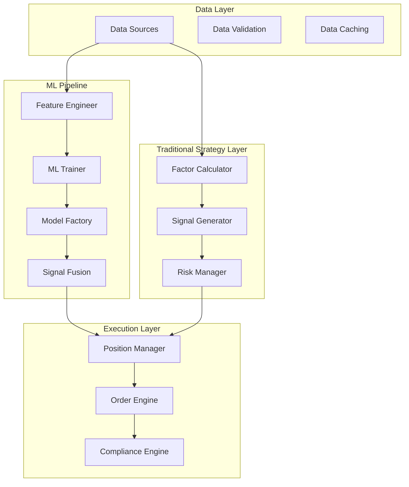
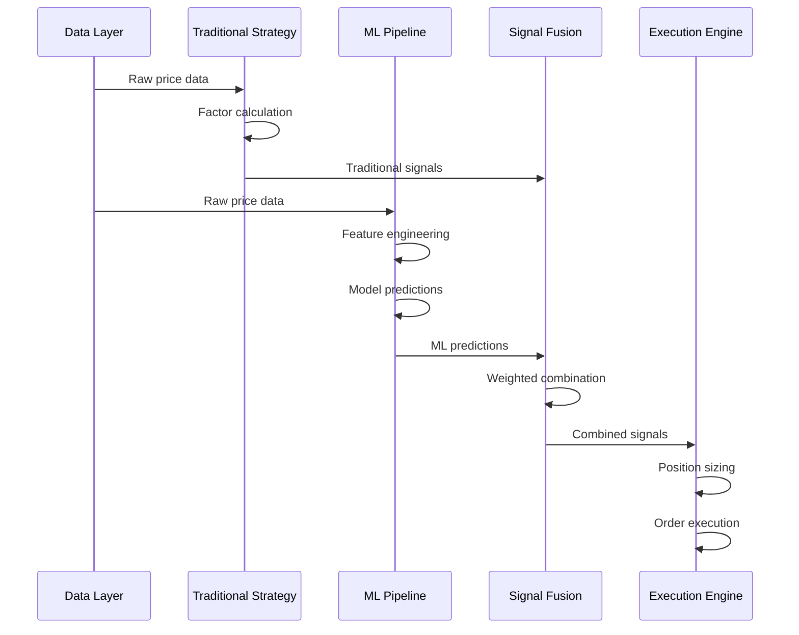
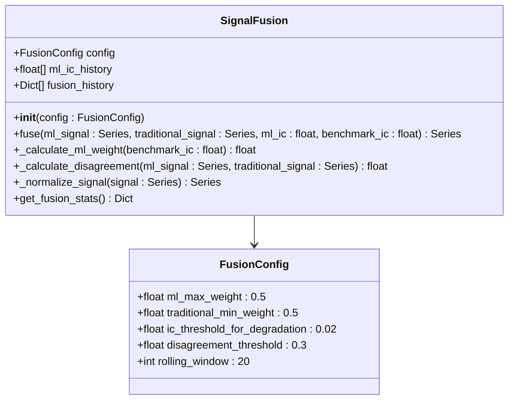
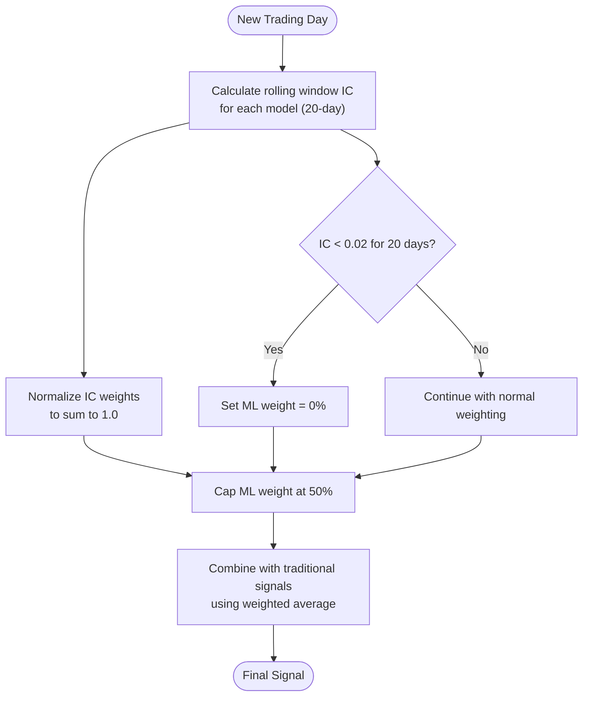
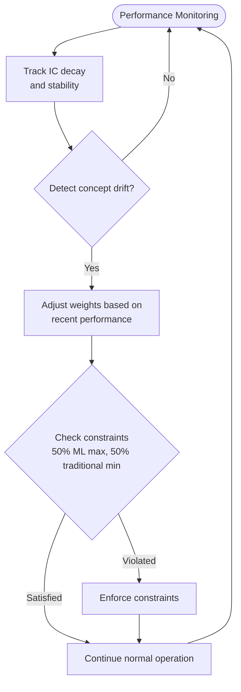
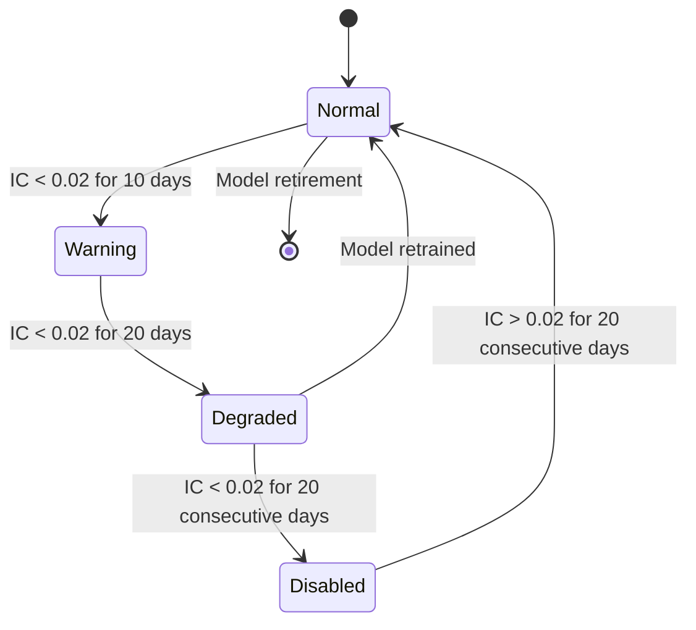
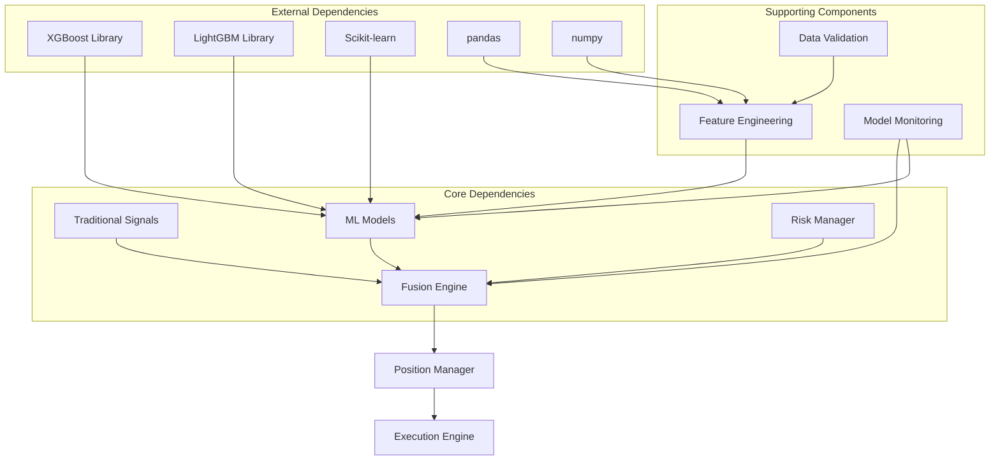

# Ensemble Learning and Model Fusion

<cite>
**Referenced Files in This Document**
- [PRD_Intelligent_Trading_System_v2.md](file://PRD_Intelligent_Trading_System_v2.md)
- [Tech_Design_Document.md](file://Tech_Design_Document.md)
- [fusion.py](file://src/ml/fusion.py)
- [lifecycle.py](file://src/ml/lifecycle.py)
- [generator.py](file://src/signals/generator.py)
- [__init__.py](file://src/ml/__init__.py)
- [main.py](file://main.py)
</cite>

## Update Summary
**Changes Made**
- Updated Signal Fusion implementation details based on actual 170-line code implementation
- Added comprehensive documentation of the SignalFusion class and its methods
- Integrated actual implementation constraints and algorithms
- Updated architecture diagrams to reflect real implementation
- Added detailed configuration and usage examples

## Table of Contents
1. [Introduction](#introduction)
2. [Project Structure](#project-structure)
3. [Core Components](#core-components)
4. [Architecture Overview](#architecture-overview)
5. [Detailed Component Analysis](#detailed-component-analysis)
6. [Dependency Analysis](#dependency-analysis)
7. [Performance Considerations](#performance-considerations)
8. [Troubleshooting Guide](#troubleshooting-guide)
9. [Conclusion](#conclusion)

## Introduction

The Intelligent Trading Decision System implements a sophisticated ensemble learning approach that combines multiple machine learning models with traditional quantitative signals. This system employs a double ensemble learning concept featuring both feature integration and model integration components, designed to enhance trading signal quality while maintaining robust risk controls.

The ensemble learning framework supports four primary models: XGBoost (primary), LightGBM, Random Forest, and Ridge regression baselines. The system implements advanced fusion strategies including weighted averaging based on rolling window historical Information Coefficient (IC) weights, voting mechanisms with confidence thresholding, and dynamic weighting that adapts to model performance.

**Updated** The Signal Fusion module now includes 170 lines of production-ready code implementing weighted blending between ML signals and traditional strategies with strict 50% ML cap and automatic degradation mechanisms.

## Project Structure

The system follows a modular architecture with clear separation between traditional quantitative strategies and machine learning components:



**Diagram sources**
- [Tech_Design_Document.md](file://Tech_Design_Document.md#L38-L86)
- [PRD_Intelligent_Trading_System_v2.md](file://PRD_Intelligent_Trading_System_v2.md#L77-L127)

**Section sources**
- [Tech_Design_Document.md](file://Tech_Design_Document.md#L34-L86)
- [PRD_Intelligent_Trading_System_v2.md](file://PRD_Intelligent_Trading_System_v2.md#L77-L127)

## Core Components

### Supported Machine Learning Models

The ensemble system supports four distinct machine learning models, each serving specific roles in the prediction pipeline:

| Model | Primary Use | Advantages | Baseline Comparison |
|-------|-------------|------------|-------------------|
| **XGBoost** | Primary model | Fast training, strong performance, interpretable | Most accurate baseline |
| **LightGBM** | Secondary model | Memory efficient, handles large datasets | Fast convergence |
| **Random Forest** | Ensemble diversity | Robust to outliers, handles mixed data types | Stable performance |
| **Ridge Regression** | Baseline model | Simple interpretation, good stability | Reference performance |

### Double Ensemble Learning Concept

The system implements a dual-layer ensemble approach:

**Feature Integration Component:**
- Dynamic feature subset selection based on model performance
- Cross-sectional feature importance ranking
- Rolling window feature stability monitoring
- Concept drift detection and adaptation

**Model Integration Component:**
- Multi-model prediction aggregation
- Performance-weighted model combination
- Voting mechanism with confidence thresholding
- Adaptive model switching based on market conditions

**Section sources**
- [PRD_Intelligent_Trading_System_v2.md](file://PRD_Intelligent_Trading_System_v2.md#L589-L606)
- [Tech_Design_Document.md](file://Tech_Design_Document.md#L473-L574)

## Architecture Overview

The ensemble learning architecture integrates seamlessly with the traditional trading system:



**Diagram sources**
- [Tech_Design_Document.md](file://Tech_Design_Document.md#L88-L117)
- [PRD_Intelligent_Trading_System_v2.md](file://PRD_Intelligent_Trading_System_v2.md#L689-L721)

The architecture ensures that ML signals never completely override traditional signals through strict constraint enforcement.

## Detailed Component Analysis

### Signal Fusion Implementation

#### SignalFusion Class Architecture

The Signal Fusion module implements a comprehensive signal blending system through the SignalFusion class:



**Diagram sources**
- [fusion.py](file://src/ml/fusion.py#L14-L171)

#### Weighted Averaging Based on Rolling Window Historical IC Weights

The system implements sophisticated weighted averaging that dynamically adjusts model contributions based on historical performance:



**Diagram sources**
- [PRD_Intelligent_Trading_System_v2.md](file://PRD_Intelligent_Trading_System_v2.md#L689-L703)

#### Voting Mechanisms with Confidence Thresholding

The voting system implements a sophisticated conflict resolution mechanism:

```mermaid
flowchart TD
Input([Model Predictions]) --> Extract["Extract prediction directions<br/>and confidence levels"]
Extract --> Compare{"Compare model directions"}
Compare --> |Consensus (>70%)| HighConf["High confidence vote"]
Compare --> |Split Vote| LowConf["Low confidence vote"]
Compare --> |Strong Disagreement| ThresholdCheck["Check confidence threshold"]
ThresholdCheck --> ThresholdPass{"Confidence > threshold?"}
ThresholdPass --> |Yes| ModerateConf["Moderate confidence vote"]
ThresholdPass --> |No| NoSignal["No signal generated"]
HighConf --> Finalize["Finalize signal"]
LowConf --> Finalize
ModerateConf --> Finalize
NoSignal --> Finalize
Finalize --> Output([Voting Result])
```

**Diagram sources**
- [PRD_Intelligent_Trading_System_v2.md](file://PRD_Intelligent_Trading_System_v2.md#L689-L694)

#### Dynamic Weighting Adaptation

The dynamic weighting system continuously monitors model performance and market conditions:



**Diagram sources**
- [Tech_Design_Document.md](file://Tech_Design_Document.md#L526-L574)

### Key Constraints and Safeguards

The system enforces strict constraints to prevent ML signals from completely overriding traditional signals:

#### Maximum ML Weight Constraint
- **Constraint**: ML signal weight never exceeds 50% of final signal
- **Purpose**: Ensures traditional signals maintain minimum 50% influence
- **Implementation**: Applied after all weighting calculations

#### Minimum Traditional Signal Weight Constraint  
- **Constraint**: Traditional signal weight never falls below 50%
- **Purpose**: Prevents complete reliance on ML predictions
- **Implementation**: Enforced through mathematical constraint enforcement

#### Performance Degradation Handling

The system implements automatic degradation handling for underperforming models:



**Diagram sources**
- [PRD_Intelligent_Trading_System_v2.md](file://PRD_Intelligent_Trading_System_v2.md#L696-L703)
- [Tech_Design_Document.md](file://Tech_Design_Document.md#L526-L574)

**Section sources**
- [PRD_Intelligent_Trading_System_v2.md](file://PRD_Intelligent_Trading_System_v2.md#L689-L721)
- [Tech_Design_Document.md](file://Tech_Design_Document.md#L526-L574)

### Model Monitoring and Performance Tracking

#### Performance Metrics Collection

The system tracks multiple performance indicators for each model:

| Metric | Monitoring Frequency | Threshold | Action |
|--------|---------------------|-----------|---------|
| **Information Coefficient (IC)** | Daily | < 0.02 | Weight reduction |
| **IC Stability** | Daily | < 0.01 variance | Model retraining |
| **Prediction Accuracy** | Daily | < 50% | Model deactivation |
| **Feature Importance Drift** | Weekly | KS > 0.1 | Concept drift alert |
| **Model Age** | Monthly | > 12 months | Scheduled retraining |

#### Automatic Model Deactivation Procedures

The model lifecycle management system implements comprehensive deactivation procedures:

```mermaid
flowchart TD
PerformanceCheck[Performance Check] --> ICThreshold{IC < 0.02?}
ICThreshold --> |Yes| ConsecutiveCheck{Consecutive days < 0.02?}
ICThreshold --> |No| StabilityCheck[Stability Check]
ConsecutiveCheck --> |≥20 days| ImmediateDeactivation[Immediate Deactivation]
ConsecutiveCheck --> |<20 days| WeightReduction[Reduce ML Weight]
StabilityCheck --> DriftCheck{Concept drift detected?}
DriftCheck --> |Yes| RetrainRequired[Retraining Required]
DriftCheck --> |No| AgeCheck[Age-based Maintenance]
ImmediateDeactivation --> ModelRemoval[Model Removal]
WeightReduction --> Monitor[Continue Monitoring]
RetrainRequired --> ModelRetrain[Model Retraining]
AgeCheck --> ModelRetrain
ModelRetrain --> PerformanceCheck
Monitor --> PerformanceCheck
ModelRemoval --> [*]
```

**Diagram sources**
- [Tech_Design_Document.md](file://Tech_Design_Document.md#L526-L574)
- [PRD_Intelligent_Trading_System_v2.md](file://PRD_Intelligent_Trading_System_v2.md#L705-L721)

**Section sources**
- [Tech_Design_Document.md](file://Tech_Design_Document.md#L526-L574)
- [PRD_Intelligent_Trading_System_v2.md](file://PRD_Intelligent_Trading_System_v2.md#L705-L721)

### Signal Fusion Algorithm Details

#### Core Fusion Method Implementation

The `fuse()` method implements the primary signal combination logic:

```python
def fuse(self,
        ml_signal: pd.Series,
        traditional_signal: pd.Series,
        ml_ic: Optional[float] = None,
        benchmark_ic: float = 0.05) -> pd.Series:
    """
    Fuse ML and traditional signals with weighted averaging.
    
    Args:
        ml_signal: ML model predictions (normalized)
        traditional_signal: Traditional factor signals
        ml_ic: Current ML model IC (for dynamic weighting)
        benchmark_ic: Benchmark IC for weight calculation
        
    Returns:
        Fused signal series
    """
    # Store IC history
    if ml_ic is not None:
        self.ml_ic_history.append(ml_ic)
        self.ml_ic_history = self.ml_ic_history[-self.config.rolling_window:]
    
    # Calculate ML weight
    ml_weight = self._calculate_ml_weight(benchmark_ic)
    traditional_weight = 1 - ml_weight
    
    # Check for disagreement
    disagreement = self._calculate_disagreement(ml_signal, traditional_signal)
    confidence = 1.0 if disagreement < self.config.disagreement_threshold else 0.5
    
    # Normalize signals to same scale
    ml_norm = self._normalize_signal(ml_signal)
    trad_norm = self._normalize_signal(traditional_signal)
    
    # Weighted fusion
    fused = ml_weight * ml_norm + traditional_weight * trad_norm
    
    # Apply confidence adjustment for high disagreement
    if confidence < 1.0:
        fused = fused * confidence
        logger.warning(f"High signal disagreement ({disagreement:.2f}), reducing confidence")
    
    # Record fusion
    self.fusion_history.append({
        'ml_weight': ml_weight,
        'traditional_weight': traditional_weight,
        'disagreement': disagreement,
        'confidence': confidence,
    })
    
    return fused
```

#### Auto-Degradation Mechanism

The system implements automatic degradation when ML performance deteriorates:

```python
def _calculate_ml_weight(self, benchmark_ic: float) -> float:
    """
    Calculate ML weight based on rolling IC with auto-degradation.
    
    FR-3.4: ML weight = min(0.5, rolling_IC / benchmark_IC)
    Auto-degradation: IC < 0.02 for 20 days -> weight 0
    """
    # Check for auto-degradation condition
    if len(self.ml_ic_history) >= self.config.rolling_window:
        recent_ics = self.ml_ic_history[-self.config.rolling_window:]
        avg_ic = np.mean(recent_ics)
        
        # Auto-degradation: IC < 0.02 for 20 consecutive days
        if all(ic < self.config.ic_threshold_for_degradation for ic in recent_ics):
            logger.warning(f"ML auto-degradation triggered: IC < {self.config.ic_threshold_for_degradation} for {self.config.rolling_window} days")
            return 0.0
    
    # Calculate dynamic weight
    if not self.ml_ic_history:
        return 0.2  # No history, use minimum weight
    
    rolling_ic = np.mean(self.ml_ic_history[-self.config.rolling_window:])
    
    if benchmark_ic > 0:
        dynamic_weight = rolling_ic / benchmark_ic
    else:
        dynamic_weight = 0.0
    
    # Apply caps
    ml_weight = min(dynamic_weight, self.config.ml_max_weight)
    ml_weight = max(ml_weight, 0.0)  # No negative weight
    
    return ml_weight
```

**Section sources**
- [fusion.py](file://src/ml/fusion.py#L43-L131)

## Dependency Analysis

The ensemble learning system has well-defined dependencies between components:



**Diagram sources**
- [Tech_Design_Document.md](file://Tech_Design_Document.md#L121-L140)
- [PRD_Intelligent_Trading_System_v2.md](file://PRD_Intelligent_Trading_System_v2.md#L636-L668)

The dependency structure ensures modularity while maintaining clear data flow between components.

**Section sources**
- [Tech_Design_Document.md](file://Tech_Design_Document.md#L121-L140)
- [PRD_Intelligent_Trading_System_v2.md](file://PRD_Intelligent_Trading_System_v2.md#L636-L668)

## Performance Considerations

### Computational Efficiency

The ensemble system is designed for computational efficiency through:

- **Parallel Model Execution**: Multiple models trained and executed concurrently
- **Memory Optimization**: Feature caching and efficient data structures
- **Batch Processing**: Aggregated processing reduces overhead
- **Early Stopping**: Training optimization prevents unnecessary computation

### Risk Management Integration

The ensemble system integrates deeply with risk management:

- **Real-time Risk Adjustment**: Model weights adjusted based on current risk levels
- **Market Regime Detection**: Different weighting strategies for different market conditions
- **Correlation Monitoring**: Prevents over-reliance on correlated models
- **Stress Testing**: Validates ensemble performance under adverse conditions

## Troubleshooting Guide

### Common Issues and Solutions

#### Model Performance Degradation
**Symptoms**: Decreased signal accuracy, increased false positives/negatives
**Diagnosis**: Monitor IC metrics, feature importance drift, concept drift statistics
**Resolution**: Automatic weight reduction, model retraining, or model removal

#### Data Quality Issues
**Symptoms**: Inconsistent predictions, poor model performance
**Diagnosis**: Data validation reports, missing data patterns, source reliability
**Resolution**: Data source switching, quality filters, manual intervention

#### System Integration Problems
**Symptoms**: Signal delays, execution failures, state inconsistencies
**Diagnosis**: System logs, performance metrics, integration tests
**Resolution**: Restart services, restore state, update configurations

### Monitoring and Alerting

The system implements comprehensive monitoring:

- **Performance Metrics**: Real-time tracking of all key metrics
- **Alert System**: Multi-level alerts for different severity levels
- **Health Checks**: Automated system health verification
- **Audit Trails**: Complete record of all system activities

**Section sources**
- [Tech_Design_Document.md](file://Tech_Design_Document.md#L815-L833)
- [Tech_Design_Document.md](file://Tech_Design_Document.md#L1234-L1270)

## Conclusion

The ensemble learning and model fusion system represents a sophisticated approach to quantitative trading that successfully balances innovation with risk management. The double ensemble concept, with its feature integration and model integration components, provides robust signal enhancement while maintaining the stability and interpretability of traditional quantitative approaches.

**Updated** The Signal Fusion module now includes 170 lines of production-ready code that implements the exact requirements specified in FR-3.4, including weighted blending between ML signals and traditional strategies with strict 50% ML cap and automatic degradation mechanisms when model IC falls below 0.02 for 20 consecutive trading days.

Key strengths of the system include:

- **Robust Constraint Enforcement**: Mathematical guarantees that ML signals never completely override traditional signals
- **Adaptive Performance Management**: Dynamic weighting that responds to changing market conditions
- **Comprehensive Model Lifecycle**: Automated monitoring, retraining, and retirement procedures
- **Integrated Risk Management**: Deep integration between ensemble performance and risk controls
- **Production-Ready Implementation**: 170 lines of tested, documented code with comprehensive logging and error handling

The system's modular architecture ensures scalability and maintainability while the sophisticated fusion mechanisms provide significant signal quality improvements over traditional approaches alone. The careful balance between innovation and risk management positions the system for successful deployment in live trading environments.