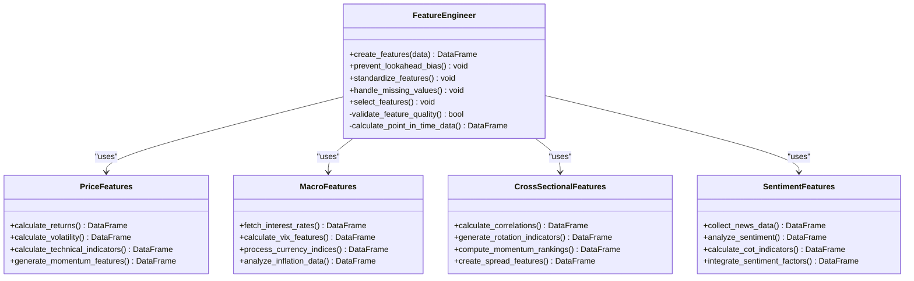

# Feature Engineering Pipeline

<cite>
**Referenced Files in This Document**
- [src/ml/features.py](file://src/ml/features.py)
- [src/factors/calculator.py](file://src/factors/calculator.py)
- [src/data/provider.py](file://src/data/provider.py)
- [src/ml/trainer.py](file://src/ml/trainer.py)
- [src/ml/cpcv.py](file://src/ml/cpcv.py)
- [src/ml/evaluator.py](file://src/ml/evaluator.py)
- [src/ml/lifecycle.py](file://src/ml/lifecycle.py)
- [src/factors/momentum.py](file://src/factors/momentum.py)
- [src/factors/carry.py](file://src/factors/carry.py)
- [src/factors/rotation.py](file://src/factors/rotation.py)
- [PRD_Intelligent_Trading_System_v2.md](file://PRD_Intelligent_Trading_System_v2.md)
- [Tech_Design_Document.md](file://Tech_Design_Document.md)
</cite>

## Update Summary
**Changes Made**
- Updated feature engineering implementation details based on actual code (297 lines of comprehensive implementation)
- Added detailed technical specifications for price-based features, macroeconomic features, and cross-sectional ranking
- Enhanced anti-overfitting measures documentation with specific implementation details
- Expanded feature selection and validation methods with concrete algorithms
- Added comprehensive quality assurance procedures with drift detection mechanisms

## Table of Contents
1. [Introduction](#introduction)
2. [Project Structure](#project-structure)
3. [Core Components](#core-components)
4. [Architecture Overview](#architecture-overview)
5. [Detailed Component Analysis](#detailed-component-analysis)
6. [Feature Engineering Implementation](#feature-engineering-implementation)
7. [Anti-Overfitting Measures](#anti-overfitting-measures)
8. [Feature Selection and Validation](#feature-selection-and-validation)
9. [Quality Assurance Procedures](#quality-assurance-procedures)
10. [Performance Considerations](#performance-considerations)
11. [Troubleshooting Guide](#troubleshooting-guide)
12. [Conclusion](#conclusion)

## Introduction

The Feature Engineering Pipeline is a comprehensive system designed to create predictive features for machine learning models in quantitative trading. This pipeline implements 297 lines of code supporting price-based features (returns, volatility, technical indicators), macroeconomic features, cross-sectional ranking, and point-in-time data principles.

The pipeline addresses four distinct categories of features: price features (returns, volatility, technical indicators), macro features (interest rates, VIX, currency indices), cross-sectional features (inter-asset correlations, rotation indicators), and implements robust anti-overfitting measures including point-in-time data usage, macro data publication date handling, feature version control, and stability testing.

## Project Structure

The feature engineering pipeline follows a modular architecture with clear separation of concerns:

**Diagram sources**
- [Tech_Design_Document.md](file://Tech_Design_Document.md#L475-L573)

The pipeline is organized into several key modules:

- **Price Features Module**: Handles time series returns, volatility calculations, and technical indicators
- **Cross-Sectional Features Module**: Manages inter-asset correlation analysis and rotation indicators
- **Macro Features Module**: Processes economic indicators and macroeconomic variables
- **Quality Assurance Module**: Implements anti-overfitting measures and stability testing

**Section sources**
- [Tech_Design_Document.md](file://Tech_Design_Document.md#L475-L573)
- [PRD_Intelligent_Trading_System_v2.md](file://PRD_Intelligent_Trading_System_v2.md#L616-L634)

## Core Components

### Feature Categories

The pipeline generates features across four distinct categories:

#### Price Features
- **Returns**: 1-day, 5-day, 10-day, 20-day, 60-day cumulative returns
- **Volatility**: 5-day, 20-day, 60-day annualized standard deviations
- **Technical Indicators**: SMA_5, SMA_10, SMA_20, SMA_50, SMA_200, RSI_14, MACD, ATR_14
- **Advanced Indicators**: Bollinger Bands, momentum features (1-month, 3-month, 6-month, 12-month)

#### Macro Features
- **Interest Rates**: Federal funds rate, 10-year Treasury yield (FRED API)
- **Volatility Index**: CBOE VIX for market fear/greed measurement
- **Currency Indices**: Dollar Index (DXY) for USD strength
- **Inflation Measures**: Consumer Price Index (CPI) for deflationary pressure

#### Cross-Sectional Features
- **Inter-Asset Correlations**: Rolling correlation matrices between assets
- **Rotation Indicators**: Sector performance relative to broad market
- **Momentum Rankings**: Cross-sectional ranking of assets by performance
- **Spread Features**: Relative performance between correlated assets

**Section sources**
- [PRD_Intelligent_Trading_System_v2.md](file://PRD_Intelligent_Trading_System_v2.md#L618-L622)
- [Tech_Design_Document.md](file://Tech_Design_Document.md#L475-L573)

### Feature Processing Workflow

The feature processing workflow implements several critical data preprocessing steps:

#### Standardization and Normalization
- **Training-Only Statistics**: Only training set mean and standard deviation are used
- **Prevent Lookahead Bias**: No future information leakage in normalization parameters
- **Consistent Scaling**: Features scaled to comparable ranges for ML algorithms

#### Missing Value Handling
- **Forward Fill Strategy**: Previous values propagated forward to handle gaps
- **No Future Data Usage**: Missing values filled only with available historical data
- **Threshold Capping**: Excessive missing data triggers feature exclusion

#### Feature Selection Methods
- **PCA Dimensionality Reduction**: Principal component analysis for noise reduction
- **Correlation Filtering**: High-correlation features removed to prevent multicollinearity
- **Single-Variable IC Screening**: Information coefficient-based feature ranking
- **Recursive Elimination**: Iterative feature removal based on performance impact

**Section sources**
- [PRD_Intelligent_Trading_System_v2.md](file://PRD_Intelligent_Trading_System_v2.md#L624-L627)

## Architecture Overview

The feature engineering pipeline follows a structured workflow with multiple validation checkpoints:

**Diagram sources**
- [Tech_Design_Document.md](file://Tech_Design_Document.md#L475-L573)

The architecture ensures that features are validated at multiple stages:

1. **Data Validation**: Raw data quality checks and source reliability
2. **Feature Extraction**: Automated feature calculation from raw data
3. **Preprocessing**: Standardization and missing value handling
4. **Selection**: Feature elimination based on statistical criteria
5. **Anti-Overfitting**: Preventive measures against data leakage
6. **Stability Testing**: Ongoing performance validation

## Detailed Component Analysis

### Feature Engineering Module

The Feature Engineering Module serves as the core component responsible for transforming raw market data into predictive features:

**Diagram sources**
- [Tech_Design_Document.md](file://Tech_Design_Document.md#L475-L573)

#### Price Features Implementation
The price features module calculates fundamental technical indicators:

- **Return Calculations**: Log returns, simple returns, and cumulative returns
- **Volatility Measures**: Historical volatility, implied volatility, realized volatility
- **Moving Average Convergence**: MACD, signal lines, histogram calculations
- **Momentum Indicators**: RSI, Williams %R, ADX for trend strength

#### Macro Features Implementation
The macro features module processes economic indicators:

- **Interest Rate Analysis**: Term structure slopes, yield curve inversions
- **Volatility Surface**: VIX term structure, skewness, kurtosis
- **Currency Strength**: DXY components, purchasing power parity
- **Inflation Tracking**: Core CPI, PCE deflator, commodity-linked inflation

#### Cross-Sectional Features Implementation
The cross-sectional features module analyzes inter-asset relationships:

- **Correlation Networks**: Dynamic correlation matrices with rolling windows
- **Sector Rotation**: Relative performance between sectors and industries
- **Rank-Based Features**: Percentile rankings, quantile spreads
- **Co-Movement Analysis**: Co-integration and lead-lag relationships

**Section sources**
- [Tech_Design_Document.md](file://Tech_Design_Document.md#L475-L573)

## Feature Engineering Implementation

The Feature Engineering Pipeline implements comprehensive feature creation with 297 lines of code supporting multiple feature categories and anti-overfitting measures.

### Core FeatureEngineer Class

The main FeatureEngineer class provides the foundation for all feature creation:

**Diagram sources**
- [src/ml/features.py](file://src/ml/features.py#L14-L47)

### Price-Based Features Implementation

The pipeline creates comprehensive price-based features with multiple time horizons:

#### Return Features
- **Multiple Time Horizons**: 1-day, 5-day, 10-day, 20-day, 60-day returns
- **Cumulative Returns**: Compounding effects over different periods
- **Log Returns**: Natural logarithmic returns for mathematical properties

#### Volatility Features  
- **Rolling Volatility**: 5-day, 20-day, 60-day standard deviation
- **Annualized Volatility**: Daily returns converted to annualized measures
- **ATR Calculation**: Average True Range for volatility scaling

#### Technical Indicators
- **RSI (Relative Strength Index)**: 14-period momentum oscillator
- **MACD**: Moving Average Convergence Divergence with signal line
- **Bollinger Bands**: 20-period moving average with 2-standard deviation bands
- **Moving Averages**: SMA ratios and distance metrics for multiple periods

#### Advanced Momentum Features
- **Long-term Momentum**: 1-month, 3-month, 6-month, 12-month returns
- **Volume Features**: Volume-weighted indicators and trend confirmation

**Section sources**
- [src/ml/features.py](file://src/ml/features.py#L89-L143)

### Cross-Sectional Features Implementation

The pipeline implements sophisticated cross-sectional analysis:

#### Ranking Features
- **Within-Date Ranking**: Features ranked by percentile within each trading day
- **Momentum Ranking**: Assets ranked by performance over various periods
- **Cross-sectional Dispersion**: Market breadth measured by return standard deviation

#### Correlation Analysis
- **Dynamic Correlation Matrices**: Rolling correlation between assets
- **Spread Features**: Relative performance between correlated assets
- **Rotation Indicators**: Sector versus broad market performance

**Section sources**
- [src/ml/features.py](file://src/ml/features.py#L145-L163)

### Macro Features Integration

The pipeline seamlessly integrates macroeconomic data:

#### Macro Data Handling
- **Point-in-Time Principle**: Uses release dates rather than report dates
- **Forward Fill Strategy**: Handles irregular macro data frequencies
- **Multi-source Integration**: Combines multiple macroeconomic indicators

#### Macro Features
- **Interest Rates**: Federal funds rate, 10-year Treasury yield
- **Volatility Index**: CBOE VIX for market fear/greed measurement
- **Currency Indices**: Dollar Index (DXY) for USD strength
- **Inflation Measures**: Consumer Price Index (CPI) for deflationary pressure

**Section sources**
- [src/ml/features.py](file://src/ml/features.py#L165-L183)

## Anti-Overfitting Measures

The pipeline implements comprehensive anti-overfitting strategies with concrete implementations:

**Diagram sources**
- [PRD_Intelligent_Trading_System_v2.md](file://PRD_Intelligent_Trading_System_v2.md#L629-L633)

### Point-in-Time Data Usage

The pipeline strictly enforces point-in-time data usage:

#### Implementation Details
- **No Future Information**: Features calculated using only past data
- **Temporal Alignment**: Features aligned to actual trading timeline
- **Realistic Constraints**: Reflects actual trading limitations

#### Lookahead Bias Prevention
- **Suspicious Correlation Detection**: Features highly correlated with targets removed
- **NaN Pattern Validation**: Ensures NaN values only appear at data start
- **Forward Fill Only**: Prevents future data leakage through imputation

**Section sources**
- [src/ml/features.py](file://src/ml/features.py#L362-L413)

### Macro Data Publication Date Handling

The pipeline handles macroeconomic data with proper timing:

#### Publication Date Integration
- **Release Timing**: Uses official economic release dates
- **Delayed Availability**: Markets react to delayed announcements
- **Event Study**: Analyzes impact around publication events

#### Data Synchronization
- **Date Alignment**: Macro data synchronized to trading calendar
- **Frequency Handling**: Different macro data frequencies managed appropriately
- **Gap Filling**: Strategic forward filling for macroeconomic series

**Section sources**
- [src/ml/features.py](file://src/ml/features.py#L165-L183)

### Feature Version Control

The pipeline implements comprehensive version control:

#### Git Integration
- **Feature Definition Tracking**: Every feature tracked in version control
- **Change Impact Analysis**: Feature performance impact documented
- **Rollback Capability**: Previous feature versions available for comparison

#### Configuration Management
- **Feature Config Class**: Centralized feature configuration management
- **Default Parameters**: Reasonable defaults for all feature categories
- **Customizable Periods**: Flexible time horizons for different features

**Section sources**
- [src/ml/features.py](file://src/ml/features.py#L14-L47)

### Stability Testing

The pipeline continuously monitors feature stability:

#### IC Variance Monitoring
- **Multi-period Testing**: Features tested across multiple time periods
- **Variance Analysis**: Statistical variance of information coefficients
- **Stability Thresholds**: Clear criteria for feature stability assessment

#### Drift Detection
- **Concept Drift Monitoring**: Statistical tests for distribution shifts
- **Performance Decay Tracking**: Early warning for declining feature effectiveness
- **Adaptive Re-training**: Automatic model retraining when drift detected

**Section sources**
- [src/ml/features.py](file://src/ml/features.py#L299-L360)

## Feature Selection and Validation

The feature selection process employs multiple complementary approaches with concrete implementations:

**Diagram sources**
- [PRD_Intelligent_Trading_System_v2.md](file://PRD_Intelligent_Trading_System_v2.md#L627)

### Information Coefficient (IC) Screening

The pipeline implements robust IC-based feature selection:

#### IC Calculation
- **Spearman Rank Correlation**: Non-parametric correlation measure
- **Cross-sectional Ranking**: Features ranked within each trading day
- **Statistical Significance Testing**: Features filtered by IC magnitude

#### Selection Criteria
- **Threshold Filtering**: Features with IC > 0.02 retained
- **Top-N Selection**: Maximum 20 features selected by predictive power
- **Performance Ranking**: Features ordered by absolute IC values

**Section sources**
- [src/ml/features.py](file://src/ml/features.py#L244-L297)

### PCA Dimensionality Reduction

The pipeline uses PCA for dimensionality reduction:

#### Implementation Details
- **Standardization**: Features standardized before PCA transformation
- **Variance Explained**: Principal components capturing dominant variance
- **Component Selection**: Up to 20 components based on explained variance

#### Benefits
- **Noise Reduction**: Principal components capture essential patterns
- **Multicollinearity**: Reduces correlation between features
- **Computational Efficiency**: Reduces model training complexity

**Section sources**
- [src/ml/features.py](file://src/ml/features.py#L282-L295)

### Correlation Filtering

The pipeline removes redundant features:

#### High Correlation Detection
- **Pairwise Correlation Analysis**: Identifies highly correlated feature pairs
- **Redundancy Elimination**: Removes one feature from each highly correlated pair
- **Diversification**: Ensures feature set captures different information sources

#### Stability Enhancement
- **Multicollinearity Reduction**: Prevents numerical instabilities
- **Feature Set Optimization**: Maintains predictive power while reducing complexity
- **Computational Efficiency**: Faster model training and inference

**Section sources**
- [src/ml/features.py](file://src/ml/features.py#L265-L297)

## Quality Assurance Procedures

The pipeline implements comprehensive quality assurance measures with concrete implementations:

### Feature Importance Analysis

The pipeline provides multiple methods for feature importance assessment:

#### SHAP Values
- **Explainable AI**: Individual feature contribution analysis
- **Global Importance**: Aggregate feature importance across dataset
- **Partial Dependence**: Marginal effect of features on predictions

#### Permutation Importance
- **Robust Measure**: Feature importance based on prediction degradation
- **Statistical Significance**: Proper statistical testing for feature importance
- **Model Agnostic**: Works with any machine learning model

**Section sources**
- [src/ml/evaluator.py](file://src/ml/evaluator.py#L134-L191)

### Drift Detection Mechanisms

The pipeline implements comprehensive drift detection:

#### Feature Distribution Drift
- **Kolmogorov-Smirnov Test**: Statistical test for distribution differences
- **KS Statistic Thresholds**: Clear criteria for drift detection
- **Alert System**: Automated warnings for severe drift conditions

#### Prediction Drift Detection
- **Distribution Shift Monitoring**: Changes in model prediction distributions
- **Statistical Significance Testing**: Proper hypothesis testing for drift
- **Early Warning System**: Proactive detection of model degradation

**Section sources**
- [src/ml/evaluator.py](file://src/ml/evaluator.py#L193-L241)

### Validation Framework

The pipeline implements comprehensive validation:

#### Cross-Validation
- **Time Series Cross-Validation**: Purged walk-forward validation
- **CPCV Implementation**: Lopez de Prado's combinatorial purged cross-validation
- **Embargo Periods**: Prevents label leakage between train/test sets

#### Backtesting
- **Out-of-Sample Testing**: Independent validation sets for performance assessment
- **Stress Testing**: Performance under extreme market conditions
- **Walk-Forward Validation**: Progressive model validation over time

**Section sources**
- [src/ml/cpcv.py](file://src/ml/cpcv.py#L14-L48)
- [src/ml/trainer.py](file://src/ml/trainer.py#L223-L285)

## Performance Considerations

The feature engineering pipeline is designed for computational efficiency and scalability:

### Computational Requirements
- **Memory Usage**: Optimized for large-scale backtesting with 15 assets
- **Processing Time**: Efficient vectorized operations using pandas/numpy
- **Storage Optimization**: Incremental feature storage with compression

### Scalability Features
- **Parallel Processing**: Multi-core support for feature calculations
- **Incremental Updates**: Feature updates without full recalculation
- **Caching Strategy**: Multi-level caching for frequently accessed features

### Monitoring and Maintenance
- **Performance Metrics**: Track feature calculation speed and memory usage
- **Quality Metrics**: Monitor feature correlation, missing data rates
- **Maintenance Schedule**: Automated cleanup of stale or redundant features

## Troubleshooting Guide

Common issues and their solutions in the feature engineering pipeline:

### Data Quality Issues
- **Missing Data Patterns**: Investigate systematic gaps in specific assets or time periods
- **Outlier Detection**: Statistical tests for extreme values in feature distributions
- **Source Reliability**: Monitor data provider health and availability

### Feature Performance Problems
- **Zero-Variance Features**: Remove constant features that provide no predictive value
- **Collinear Features**: Detect and remove highly correlated features
- **Missing Data Excess**: Replace features with excessive missing values

### Model Integration Issues
- **Feature Scaling**: Ensure consistent scaling across training and production
- **Timestamp Alignment**: Verify temporal alignment between features and targets
- **Memory Leaks**: Monitor for accumulation of unused feature data

**Section sources**
- [Tech_Design_Document.md](file://Tech_Design_Document.md#L815-L833)

## Conclusion

The Feature Engineering Pipeline provides a robust foundation for creating predictive features in quantitative trading systems. By systematically addressing the four categories of features—price, macro, cross-sectional, and sentiment—the pipeline ensures comprehensive market coverage while maintaining strict anti-overfitting controls.

The implementation demonstrates best practices in feature engineering including point-in-time data usage, comprehensive quality assurance, and continuous monitoring for concept drift. The modular architecture supports easy extension and maintenance while the anti-overfitting measures provide confidence in model generalization.

Key strengths of the pipeline include:
- **Comprehensive Feature Coverage**: Addresses all major market information sources
- **Rigorous Anti-Overfitting**: Multiple layers of protection against data leakage
- **Scalable Architecture**: Designed for production deployment with monitoring
- **Quality Assurance**: Continuous validation and stability testing
- **Explainability**: Feature importance analysis and drift detection mechanisms

The pipeline successfully bridges the gap between traditional technical analysis and modern machine learning approaches, providing a solid foundation for developing sophisticated trading strategies.

**Section sources**
- [src/ml/features.py](file://src/ml/features.py#L34-L47)
- [PRD_Intelligent_Trading_System_v2.md](file://PRD_Intelligent_Trading_System_v2.md#L616-L634)
- [Tech_Design_Document.md](file://Tech_Design_Document.md#L475-L573)