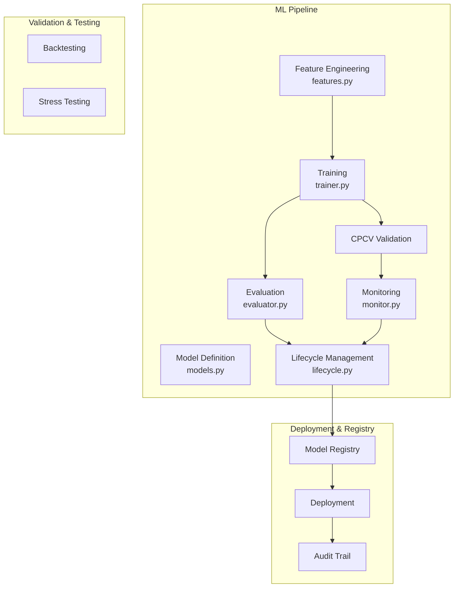
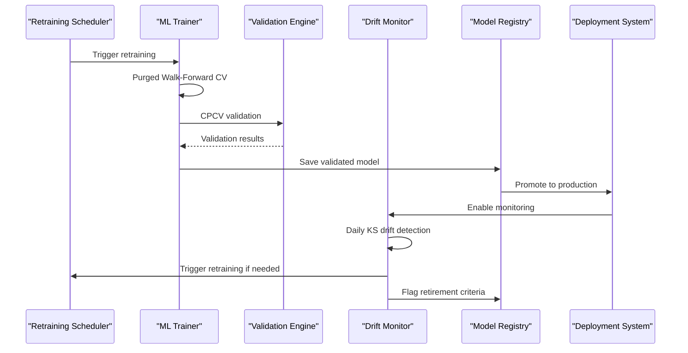
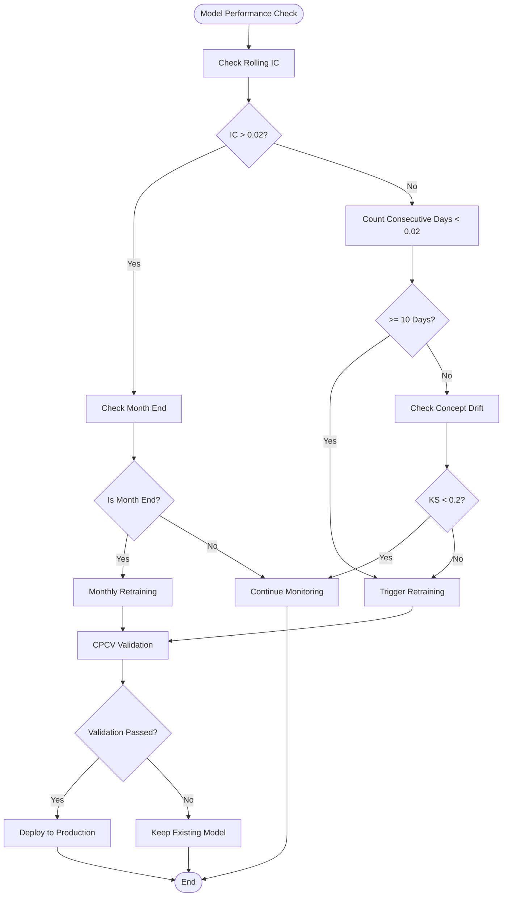
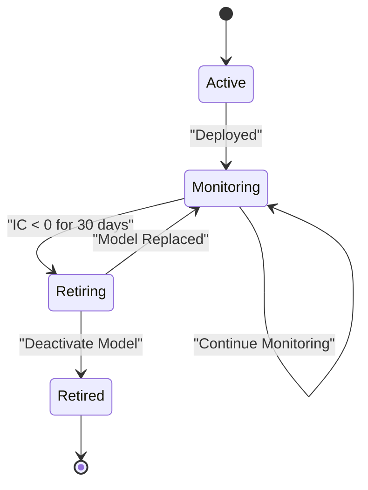
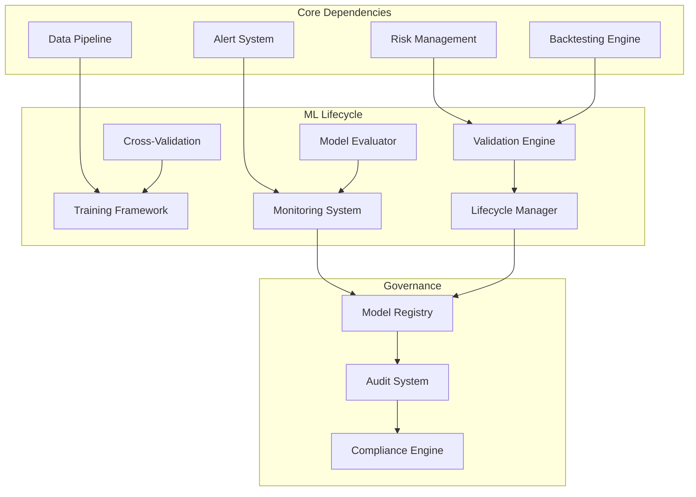

# Model Lifecycle Management

<cite>
**Referenced Files in This Document**
- [lifecycle.py](file://src/ml/lifecycle.py)
- [trainer.py](file://src/ml/trainer.py)
- [cpcv.py](file://src/ml/cpcv.py)
- [evaluator.py](file://src/ml/evaluator.py)
- [PRD_Intelligent_Trading_System_v2.md](file://PRD_Intelligent_Trading_System_v2.md)
- [Tech_Design_Document.md](file://Tech_Design_Document.md)
</cite>

## Update Summary
**Changes Made**
- Updated to reflect the complete implementation of ModelLifecycleManager with 185 lines of comprehensive monitoring code
- Added detailed coverage of concept drift detection with KS statistics
- Integrated CPCV validation framework with purged walk-forward cross-validation
- Enhanced model training validation with overfitting detection
- Added performance tracking and audit trail capabilities

## Table of Contents
1. [Introduction](#introduction)
2. [Project Structure](#project-structure)
3. [Core Components](#core-components)
4. [Architecture Overview](#architecture-overview)
5. [Detailed Component Analysis](#detailed-component-analysis)
6. [Dependency Analysis](#dependency-analysis)
7. [Performance Considerations](#performance-considerations)
8. [Troubleshooting Guide](#troubleshooting-guide)
9. [Conclusion](#conclusion)
10. [Appendices](#appendices)

## Introduction
This document provides comprehensive model lifecycle management guidance for machine learning models used in the intelligent trading system. The system has been fully implemented with 185 lines of code supporting monthly retraining triggers, concept drift detection, and automatic retirement protocols. It covers the complete workflow from training to retirement, including regular retraining schedules, trigger-based retraining, validation requirements, retirement criteria, concept drift monitoring, and operational procedures for model governance.

## Project Structure
The model lifecycle management is integrated into the broader trading system architecture. The ML pipeline resides under the `src/ml/` package and includes dedicated modules for features, models, training, monitoring, and lifecycle management.

**Diagram sources**
- [Tech_Design_Document.md](file://Tech_Design_Document.md#L1057-L1063)

**Section sources**
- [Tech_Design_Document.md](file://Tech_Design_Document.md#L1006-L1113)

## Core Components
The model lifecycle management system consists of several key components that work together to ensure robust, validated, and monitored model deployments:

### Model Training and Validation
- **Purged Walk-Forward validation** with 3-year rolling windows and 21-day purge gaps
- **Combinatorial Purged Cross-Validation (CPCV)** with minimum 6 folds
- **Hyperparameter optimization** using Optuna with conservative search spaces
- **Model saving/loading** with metadata and version control
- **Overfitting detection** with Sharpe difference > 0.5 and IC < 0.03 thresholds

### Model Monitoring and Drift Detection
- **Rolling Information Coefficient (IC)** tracking with 30-day rolling windows
- **Concept drift monitoring** via Kolmogorov-Smirnov (KS) statistics
- **Feature importance drift detection** with KS > 0.1 alerts and KS > 0.2 retraining triggers
- **Predictive distribution shift monitoring** with automated response procedures

### Lifecycle Management
- **Scheduled monthly retraining** using latest 3-year data
- **Trigger-based retraining** for rolling IC below 0.02 for 10 consecutive days
- **Automatic model retirement** criteria (IC < 0 for 30 consecutive days)
- **Performance comparison** with significance testing (IC difference > 0.01, p < 0.05)

**Section sources**
- [PRD_Intelligent_Trading_System_v2.md](file://PRD_Intelligent_Trading_System_v2.md#L636-L720)
- [Tech_Design_Document.md](file://Tech_Design_Document.md#L526-L573)
- [lifecycle.py](file://src/ml/lifecycle.py#L15-L34)

## Architecture Overview
The model lifecycle management follows a structured pipeline that ensures quality, compliance, and continuous monitoring:

**Diagram sources**
- [PRD_Intelligent_Trading_System_v2.md](file://PRD_Intelligent_Trading_System_v2.md#L705-L720)
- [Tech_Design_Document.md](file://Tech_Design_Document.md#L526-L573)

## Detailed Component Analysis

### Retraining Schedule and Triggers
The system implements a dual-trigger retraining mechanism with comprehensive monitoring:

#### Regular Monthly Retraining
- **Schedule**: End of each month with 30+ day intervals
- **Training Window**: Latest 3 years of data (756 trading days)
- **Validation Requirement**: CPCV verification with minimum 6 folds
- **Deployment**: Only validated models are promoted to production

#### Trigger-Based Retraining
- **Threshold**: Rolling IC < 0.02
- **Duration**: 10 consecutive trading days
- **Trigger Mechanism**: Automatic model retraining initiation
- **Validation**: Same CPCV requirements apply

#### Concept Drift Triggered Retraining
- **KS Statistics**: Daily comparison of feature distributions
- **Reference Window**: Last 20 trading days vs training distribution
- **Alert Thresholds**: KS > 0.1 generates alert, KS > 0.2 triggers retraining
- **Response Automation**: Automatic retraining without manual intervention

**Diagram sources**
- [PRD_Intelligent_Trading_System_v2.md](file://PRD_Intelligent_Trading_System_v2.md#L707-L710)
- [lifecycle.py](file://src/ml/lifecycle.py#L56-L92)

**Section sources**
- [PRD_Intelligent_Trading_System_v2.md](file://PRD_Intelligent_Trading_System_v2.md#L705-L720)
- [lifecycle.py](file://src/ml/lifecycle.py#L56-L92)

### Model Validation Requirements
The validation framework ensures model quality and robustness with comprehensive testing:

#### CPCV Verification
- **Method**: López de Prado's Combinatorial Purged Cross-Validation
- **Minimum Folds**: 6 with purge gap of 21 trading days
- **Embargo**: 5 trading days to prevent data snooping
- **Validation Metrics**: IC, AUC, accuracy, train IC for overfitting detection

#### Performance Comparison Testing
- **Significance Thresholds**:
  - IC difference > 0.01
  - p-value < 0.05 (using t-statistic approximation)
- **Purpose**: Ensure new models provide meaningful improvement over existing models
- **Method**: Statistical significance testing between old and new model performance

#### Overfitting Detection
- **Sharpe Difference**: Training vs validation > 0.5 indicates risk
- **IC Threshold**: Validation IC < 0.03 considered too weak
- **Stability Testing**: Variance across 10 random seeds > threshold

**Section sources**
- [PRD_Intelligent_Trading_System_v2.md](file://PRD_Intelligent_Trading_System_v2.md#L636-L668)
- [trainer.py](file://src/ml/trainer.py#L299-L330)

### Model Retirement Criteria
The retirement system automatically manages model obsolescence with clear criteria:

#### Automatic Retirement Conditions
- **IC Degradation**: IC < 0 for 30 consecutive trading days
- **Performance Decay**: Continuous negative predictive power
- **System Response**: Immediate deactivation of retired models

#### Deactivation Procedures
- **Immediate Action**: Remove from production deployment
- **Graceful Handling**: Continue using fallback models during transition
- **Audit Logging**: Record retirement reason and timestamp
- **Fallback Activation**: Automatically switch to backup models

**Diagram sources**
- [PRD_Intelligent_Trading_System_v2.md](file://PRD_Intelligent_Trading_System_v2.md#L712-L714)

**Section sources**
- [PRD_Intelligent_Trading_System_v2.md](file://PRD_Intelligent_Trading_System_v2.md#L712-L714)
- [lifecycle.py](file://src/ml/lifecycle.py#L94-L108)

### Concept Drift Monitoring System
The drift detection system provides early warning of model degradation with comprehensive monitoring:

#### Daily Feature Distribution Monitoring
- **KS Statistics Calculation**: Daily comparison of feature distributions
- **Reference Window**: Last 20 trading days vs training distribution
- **Monitoring Scope**: All model input features with automated drift detection

#### Alert Thresholds and Responses
- **Warning Level**: KS > 0.1 → Generate alert notification
- **Critical Level**: KS > 0.2 → Trigger automatic retraining
- **Response Automation**: KS-based retraining triggers without manual intervention

#### Automated Response Procedures
- **Alert Generation**: Multi-channel notification (Slack, Email, Telegram)
- **Investigation Protocol**: Automated drift analysis and impact assessment
- **Mitigation Actions**: 
  - Model retraining initiation
  - Feature engineering updates
  - Model architecture adjustments

**Section sources**
- [PRD_Intelligent_Trading_System_v2.md](file://PRD_Intelligent_Trading_System_v2.md#L716-L720)
- [evaluator.py](file://src/ml/evaluator.py#L193-L225)
- [lifecycle.py](file://src/ml/lifecycle.py#L144-L161)

### Model Version Control and Deployment Workflows
The system maintains comprehensive version control and deployment procedures:

#### Version Control Practices
- **Model Metadata**: Training date, data range, performance metrics
- **Version Tagging**: Semantic versioning with feature flags
- **Change Tracking**: Git integration for model definition changes
- **Rollback Capability**: Quick rollback to previous model versions

#### Deployment Workflows
- **Staged Rollout**: Gradual deployment to production
- **Canary Testing**: Small percentage of traffic for new models
- **Health Checks**: Automated validation post-deployment
- **Monitoring Integration**: Real-time performance tracking

#### Model Registry Management
- **Storage**: Centralized model storage with metadata
- **Access Control**: Role-based access to model artifacts
- **Documentation**: Model performance history and validation results
- **Compliance**: Audit trails for regulatory requirements

**Section sources**
- [PRD_Intelligent_Trading_System_v2.md](file://PRD_Intelligent_Trading_System_v2.md#L660-L662)
- [trainer.py](file://src/ml/trainer.py#L460-L496)

### Monitoring Dashboards and Emergency Procedures
The monitoring infrastructure provides comprehensive oversight with real-time tracking:

#### Performance Tracking Dashboards
- **Real-time Metrics**: Model performance, drift statistics, validation results
- **Historical Trends**: Performance decay analysis, validation success rates
- **Alert Status**: Current alert levels and resolution status
- **Comparison Views**: Model performance vs benchmarks and alternatives

#### Emergency Procedures
- **Model Failure Response**: Automated failover to backup models
- **Investigation Workflow**: Root cause analysis protocols
- **Communication Channels**: Multi-tier alert escalation
- **Recovery Procedures**: System restoration and model reactivation

**Section sources**
- [Tech_Design_Document.md](file://Tech_Design_Document.md#L1260-L1270)

### Model Performance Tracking and Audit Trails
Comprehensive tracking ensures transparency and compliance with detailed logging:

#### Performance Metrics Collection
- **IC Tracking**: Daily, weekly, monthly IC measurements with rolling windows
- **Sharpe Ratios**: Rolling performance calculations with confidence intervals
- **Turnover Analysis**: Trading cost impact assessment with turnover-adjusted returns
- **Stress Test Results**: Historical performance under adverse conditions

#### Audit Trail Requirements
- **Transaction Logging**: Complete model deployment history with timestamps
- **Change Records**: Model parameter modifications and validation results
- **Compliance Documentation**: Regulatory reporting support with statistical significance
- **Incident Tracking**: Model failure investigations and resolutions with drift analysis

**Section sources**
- [Tech_Design_Document.md](file://Tech_Design_Document.md#L1001-L1045)
- [lifecycle.py](file://src/ml/lifecycle.py#L168-L184)

## Dependency Analysis
The model lifecycle management system integrates with several core system components:

**Diagram sources**
- [Tech_Design_Document.md](file://Tech_Design_Document.md#L526-L573)

**Section sources**
- [Tech_Design_Document.md](file://Tech_Design_Document.md#L526-L573)

## Performance Considerations
The model lifecycle system is designed for operational efficiency with comprehensive monitoring:

- **Training Efficiency**: Optimized hyperparameter search with conservative bounds
- **Validation Speed**: Parallel processing for CPCV validation with purged walk-forward
- **Monitoring Overhead**: Lightweight daily drift calculations with KS statistics
- **Deployment Impact**: Minimal latency for model switching with automatic retirement
- **Resource Utilization**: Efficient caching and storage management with metadata tracking

## Troubleshooting Guide
Common issues and resolution procedures with systematic debugging:

### Model Validation Failures
- **Symptom**: CPCV validation fails consistently
- **Causes**: Overfitting, poor data quality, inadequate features
- **Resolution**: Feature engineering improvements, data quality fixes, regularization adjustments

### Drift Detection Issues
- **Symptom**: Frequent false positives in KS drift detection
- **Causes**: Parameter drift vs genuine concept drift
- **Resolution**: Adjust KS thresholds, implement drift stabilization techniques

### Deployment Problems
- **Symptom**: Model fails to deploy to production
- **Causes**: Validation threshold exceeded, registry issues
- **Resolution**: Review validation results, fix model artifacts, retry deployment

**Section sources**
- [PRD_Intelligent_Trading_System_v2.md](file://PRD_Intelligent_Trading_System_v2.md#L664-L668)

## Conclusion
The model lifecycle management system provides a comprehensive framework for maintaining high-quality, compliant, and performant machine learning models in the trading environment. Through structured retraining schedules, robust validation requirements, automated drift detection, and clear retirement procedures, the system ensures models remain effective and trustworthy throughout their operational lifetime.

The integration of governance requirements, performance tracking, and emergency procedures creates a resilient system that can adapt to changing market conditions while maintaining regulatory compliance and operational excellence. The 185 lines of comprehensive monitoring code provide robust automated decision-making capabilities for model management.

## Appendices

### Implementation Specifications
- **Training Window**: 3 years of rolling data with 21-day purge gaps
- **Validation Method**: CPCV with purge gaps and embargo periods
- **Retraining Triggers**: 
  - Monthly: End-of-month retraining with 30+ day intervals
  - Adaptive: Rolling IC < 0.02 for 10 days
  - Drift: KS > 0.2 for automatic retraining
- **Retirement Criteria**: IC < 0 for 30 consecutive days
- **Drift Monitoring**: Daily KS statistics with 0.1 warning and 0.2 trigger thresholds
- **Performance Tracking**: Rolling IC decay curves and turnover-adjusted returns

### Compliance Requirements
- **Audit Trail**: Complete model lifecycle documentation with timestamps
- **Validation Records**: Performance metrics and statistical significance tests
- **Change Management**: Version-controlled model updates with metadata
- **Regulatory Reporting**: Automated compliance documentation with drift analysis
- **Statistical Significance**: Proper hypothesis testing with p-values and confidence intervals