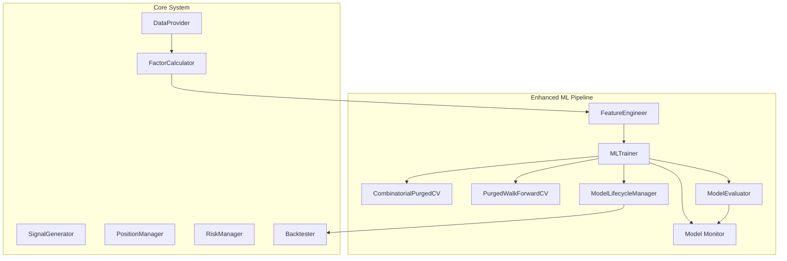
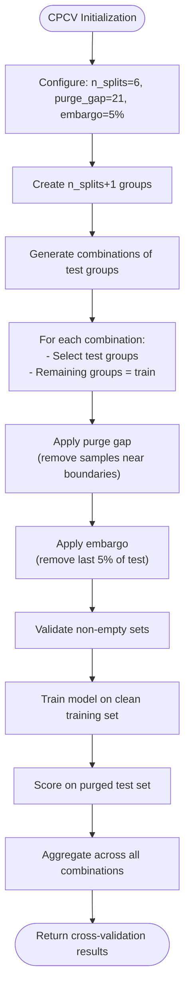
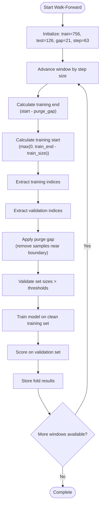
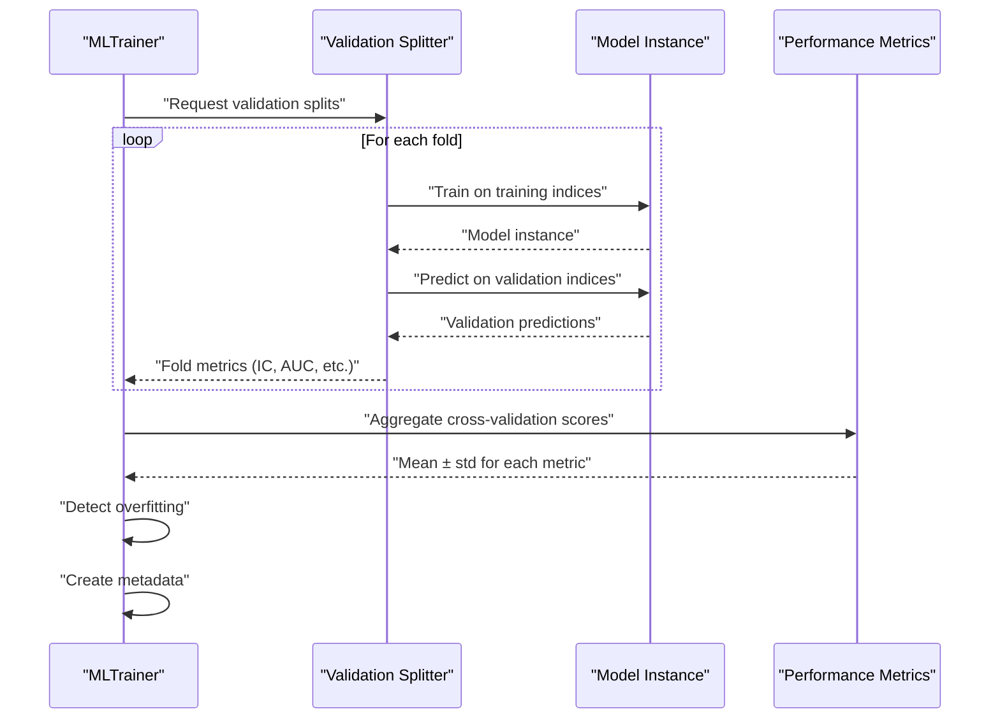
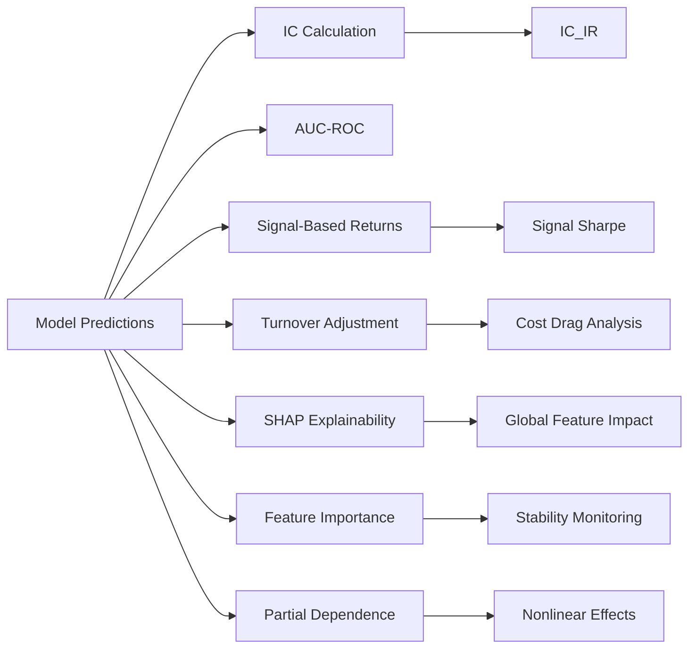
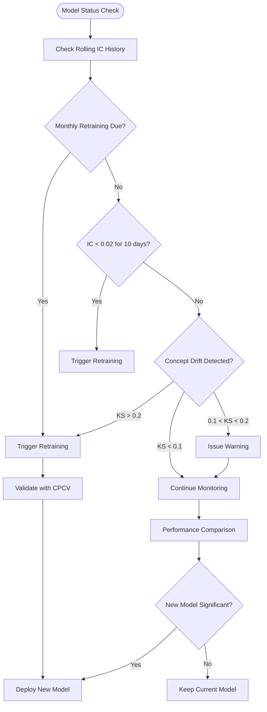
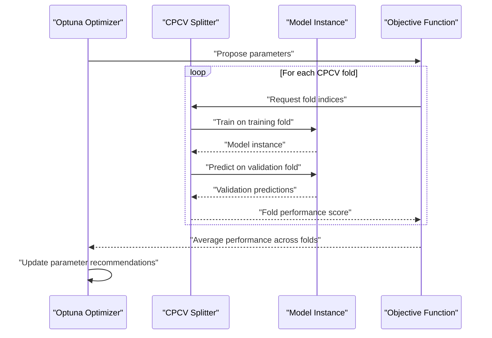
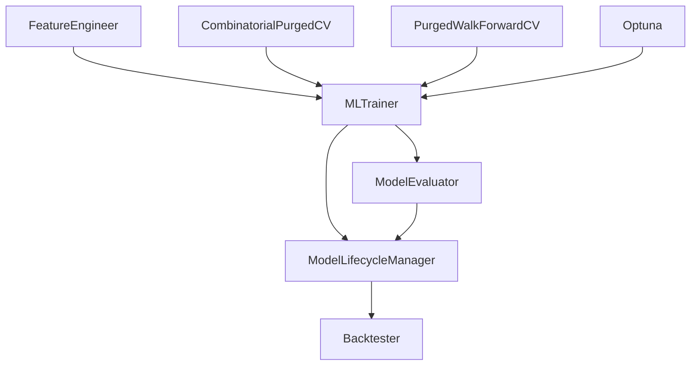

# Model Training and Validation Framework

<cite>
**Referenced Files in This Document**
- [Tech_Design_Document.md](file://Tech_Design_Document.md)
- [PRD_Intelligent_Trading_System_v2.md](file://PRD_Intelligent_Trading_System_v2.md)
- [src/ml/cpcv.py](file://src/ml/cpcv.py)
- [src/ml/trainer.py](file://src/ml/trainer.py)
- [src/ml/evaluator.py](file://src/ml/evaluator.py)
- [src/ml/lifecycle.py](file://src/ml/lifecycle.py)
</cite>

## Update Summary
**Changes Made**
- Added comprehensive Combinatorial Purged Cross-Validation (CPCV) implementation with 212 lines of code
- Integrated Purged Walk-Forward validation alongside CPCV for robust model validation
- Enhanced MLTrainer with support for both CPCV and Walk-Forward validation methods
- Updated evaluation metrics to include CPCV-specific scoring and monitoring
- Added lifecycle management integration with CPCV validation results

## Table of Contents
1. [Introduction](#introduction)
2. [Project Structure](#project-structure)
3. [Core Components](#core-components)
4. [Architecture Overview](#architecture-overview)
5. [Detailed Component Analysis](#detailed-component-analysis)
6. [Dependency Analysis](#dependency-analysis)
7. [Performance Considerations](#performance-considerations)
8. [Troubleshooting Guide](#troubleshooting-guide)
9. [Conclusion](#conclusion)
10. [Appendices](#appendices)

## Introduction
This document describes the model training and validation framework for machine learning strategies within the intelligent trading system. The framework now includes a comprehensive Combinatorial Purged Cross-Validation (CPCV) implementation that addresses the limitations of traditional time series cross-validation and provides robust anti-overfitting safeguards. Key components include:

- **Enhanced Validation Framework**: Both Purged Walk-Forward and CPCV validation methods with strict purge gaps and embargo periods
- **CPCV Implementation**: López de Prado's combinatorial approach with 212 lines of production-ready code
- **Advanced Hyperparameter Optimization**: Optuna integration with conservative search spaces and 100 maximum trials
- **Comprehensive Model Evaluation**: IC/IC_IR, AUC-ROC, risk-adjusted returns, and explainability metrics
- **Robust Model Lifecycle Management**: Automated retraining, retirement criteria, and concept drift detection

## Project Structure
The ML pipeline now features a sophisticated validation framework integrated with the broader system architecture. The CPCV implementation provides the foundation for reliable model training and validation.



**Diagram sources**
- [src/ml/cpcv.py](file://src/ml/cpcv.py#L14-L213)
- [src/ml/trainer.py](file://src/ml/trainer.py#L114-L478)
- [src/ml/lifecycle.py](file://src/ml/lifecycle.py#L36-L185)

**Section sources**
- [Tech_Design_Document.md](file://Tech_Design_Document.md#L1057-L1063)
- [PRD_Intelligent_Trading_System_v2.md](file://PRD_Intelligent_Trading_System_v2.md#L1006-L1112)

## Core Components
- **CombinatorialPurgedCV**: Production-ready CPCV implementation with 212 lines of code supporting purge gaps, embargo periods, and combinatorial splits
- **PurgedWalkForwardCV**: Simplified walk-forward validation with rolling windows and purge gaps
- **MLTrainer**: Enhanced training framework supporting both CPCV and Walk-Forward validation methods
- **ModelEvaluator**: Comprehensive evaluation metrics including IC/IC_IR, AUC-ROC, and risk-adjusted returns
- **ModelLifecycleManager**: Automated model management with CPCV integration and concept drift detection

**Section sources**
- [src/ml/cpcv.py](file://src/ml/cpcv.py#L14-L213)
- [src/ml/trainer.py](file://src/ml/trainer.py#L114-L478)
- [src/ml/evaluator.py](file://src/ml/evaluator.py#L14-L363)
- [src/ml/lifecycle.py](file://src/ml/lifecycle.py#L36-L185)

## Architecture Overview
The enhanced ML training and validation framework now provides multiple validation approaches with strict anti-leakage protections and comprehensive model evaluation capabilities.

```mermaid
sequenceDiagram
participant Data as "DataProvider"
participant Factors as "FactorCalculator"
participant Feat as "FeatureEngineer"
participant Train as "MLTrainer"
participant CPCV as "CombinatorialPurgedCV"
participant WF as "PurgedWalkForwardCV"
participant Opt as "Optuna"
participant Life as "ModelLifecycleManager"
participant Eval as "ModelEvaluator"
Data->>Factors : "Fetch OHLCV"
Factors->>Feat : "Compute factors"
Feat->>Train : "Features + Targets"
Train->>CPCV : "CPCV validation"
CPCV-->>Train : "Cross-validation scores"
Train->>WF : "Walk-Forward validation"
WF-->>Train : "Validation scores"
Train->>Opt : "Hyperparameter optimization"
Opt-->>Train : "Best parameters"
Train->>Eval : "Comprehensive evaluation"
Eval-->>Train : "Metrics + explainability"
Train->>Life : "Lifecycle management"
Life-->>Train : "Deployment decision"
```

**Diagram sources**
- [src/ml/cpcv.py](file://src/ml/cpcv.py#L50-L128)
- [src/ml/trainer.py](file://src/ml/trainer.py#L223-L440)
- [src/ml/evaluator.py](file://src/ml/evaluator.py#L70-L133)

## Detailed Component Analysis

### Combinatorial Purged Cross-Validation (CPCV) Implementation
**Updated** - Complete implementation with 212 lines of production-ready code supporting purge gaps, embargo periods, and combinatorial splits.

The CPCV implementation follows López de Prado's methodology with strict adherence to FR-3.2 requirements:

- **Purge Gap**: 21 trading days to prevent label leakage between training and testing sets
- **Embargo**: 5 trading days (0.02 = 5/252) to prevent data snooping
- **Minimum 6 Folds**: Ensures robust validation with sufficient sample diversity
- **Combinatorial Splits**: Uses mathematical combinations to create diverse training/test partitions
- **Factory Pattern**: Flexible creation of different validation strategies



**Diagram sources**
- [src/ml/cpcv.py](file://src/ml/cpcv.py#L50-L95)

**Section sources**
- [src/ml/cpcv.py](file://src/ml/cpcv.py#L14-L213)

### Purged Walk-Forward Validation
**Updated** - Enhanced walk-forward validation with configurable window sizes and purge gaps.

The Purged Walk-Forward validation provides a simpler alternative to CPCV while maintaining anti-leakage protections:

- **Training Window**: 3 years (756 trading days) rolling window
- **Validation Window**: 6 months (126 trading days) fixed window  
- **Purge Gap**: 21 trading days between training and validation
- **Step Size**: 3 months (63 trading days) for rolling advancement
- **Boundary Handling**: Robust edge case management for time series



**Diagram sources**
- [src/ml/cpcv.py](file://src/ml/cpcv.py#L160-L190)

**Section sources**
- [src/ml/cpcv.py](file://src/ml/cpcv.py#L131-L191)

### Enhanced MLTrainer with CPCV Integration
**Updated** - MLTrainer now supports both CPCV and Walk-Forward validation methods with comprehensive evaluation and overfitting detection.

The MLTrainer coordinates the validation framework with advanced model management:

- **Dual Validation Support**: Seamless switching between CPCV and Walk-Forward methods
- **Comprehensive Scoring**: IC, AUC, accuracy, and train IC for overfitting detection
- **Overfitting Detection**: Multiple criteria including IC threshold, stability, and train-val gap
- **Hyperparameter Optimization**: Optuna integration with conservative search spaces
- **Model Metadata**: Complete tracking of training parameters and validation results



**Diagram sources**
- [src/ml/trainer.py](file://src/ml/trainer.py#L223-L286)

**Section sources**
- [src/ml/trainer.py](file://src/ml/trainer.py#L114-L478)

### Advanced Model Evaluation Metrics
**Updated** - Enhanced evaluation framework with comprehensive metrics and explainability.

The ModelEvaluator provides deep insights into model performance and behavior:

- **Information Coefficient (IC)**: Rank correlation between predictions and actual returns
- **IC Information Ratio (IC_IR)**: Measures consistency across time periods
- **AUC-ROC**: Binary classification performance metrics
- **Risk-Adjusted Returns**: Signal-based portfolio Sharpe ratios
- **Turnover-Adjusted Returns**: Transaction cost considerations
- **Explainability**: SHAP values, feature importance, partial dependence plots
- **Drift Detection**: Feature and prediction distribution monitoring



**Diagram sources**
- [src/ml/evaluator.py](file://src/ml/evaluator.py#L31-L133)

**Section sources**
- [src/ml/evaluator.py](file://src/ml/evaluator.py#L14-L363)

### Model Lifecycle Management with CPCV Integration
**Updated** - Lifecycle management now incorporates CPCV validation results and concept drift detection.

The ModelLifecycleManager provides automated model management with CPCV integration:

- **Retraining Schedule**: Monthly retraining with 3-year data windows
- **Triggered Retraining**: Rolling IC < 0.02 for 10 consecutive days
- **Performance Comparison**: Statistical significance testing (IC difference > 0.01, p < 0.05)
- **Concept Drift Detection**: KS test thresholds (0.1 alert, 0.2 retrain trigger)
- **Retirement Criteria**: IC < 0 for 30 consecutive days



**Diagram sources**
- [src/ml/lifecycle.py](file://src/ml/lifecycle.py#L56-L143)

**Section sources**
- [src/ml/lifecycle.py](file://src/ml/lifecycle.py#L36-L185)

### Hyperparameter Optimization with CPCV Integration
**Updated** - Optuna optimization now works seamlessly with CPCV validation for robust parameter selection.

The optimization framework uses conservative search spaces to prevent overfitting during hyperparameter tuning:

- **Tree-Structured Parzen Estimator (TPE)**: Efficient Bayesian optimization
- **Conservative Search Spaces**: Prevents optimization overfitting itself
- **CPCV Integration**: Validates hyperparameters across combinatorial splits
- **Maximum Trials**: 100 trials with configurable timeout
- **Model-Specific Parameter Tuning**: Separate optimization for XGBoost and LightGBM



**Diagram sources**
- [src/ml/trainer.py](file://src/ml/trainer.py#L332-L440)

**Section sources**
- [src/ml/trainer.py](file://src/ml/trainer.py#L332-L440)

### Training Workflows and Validation Procedures
**Updated** - Comprehensive training workflows supporting both CPCV and Walk-Forward validation methods.

The enhanced training framework provides multiple validation approaches with strict anti-overfitting safeguards:

1. **Data Preparation**: Feature engineering with point-in-time processing and lookahead bias prevention
2. **Model Selection**: Support for XGBoost, LightGBM, Random Forest, and Ridge regression
3. **Validation Strategy**: Choose between CPCV (6+ folds) or Walk-Forward (rolling windows)
4. **Hyperparameter Optimization**: Conservative search spaces with Optuna integration
5. **Performance Evaluation**: Comprehensive metrics including IC, AUC, risk-adjusted returns
6. **Overfitting Detection**: Multiple criteria including IC thresholds and stability checks
7. **Model Deployment**: Lifecycle management with concept drift monitoring

**Section sources**
- [src/ml/cpcv.py](file://src/ml/cpcv.py#L193-L213)
- [src/ml/trainer.py](file://src/ml/trainer.py#L133-L189)
- [src/ml/evaluator.py](file://src/ml/evaluator.py#L70-L107)

## Dependency Analysis
**Updated** - Enhanced dependency relationships with CPCV integration and lifecycle management.

The ML framework now includes comprehensive validation and lifecycle management dependencies:



**Diagram sources**
- [src/ml/cpcv.py](file://src/ml/cpcv.py#L207-L213)
- [src/ml/trainer.py](file://src/ml/trainer.py#L356-L440)
- [src/ml/lifecycle.py](file://src/ml/lifecycle.py#L110-L143)

**Section sources**
- [src/ml/cpcv.py](file://src/ml/cpcv.py#L1-L213)
- [src/ml/trainer.py](file://src/ml/trainer.py#L1-L478)
- [src/ml/evaluator.py](file://src/ml/evaluator.py#L1-L363)
- [src/ml/lifecycle.py](file://src/ml/lifecycle.py#L1-L185)

## Performance Considerations
**Updated** - Enhanced computational efficiency with CPCV optimization and lifecycle management.

The framework balances validation rigor with computational efficiency:

- **CPCV Optimization**: Mathematical combination generation reduces redundant computations
- **Memory Management**: Efficient indexing and purging minimize memory overhead
- **Parallel Processing**: Optuna optimization supports parallel trial execution
- **Early Stopping**: Validation criteria enable early termination when models fail quality thresholds
- **Lifecycle Efficiency**: Automated retraining reduces manual intervention overhead

## Troubleshooting Guide
**Updated** - Enhanced troubleshooting with CPCV-specific diagnostics and lifecycle management.

Common issues and solutions with CPCV integration:

- **CPCV Performance Issues**:
  - Excessive computation time with high n_splits values
  - Memory constraints with large datasets
  - Solution: Reduce n_splits, increase purge_gap, or switch to Walk-Forward validation

- **Validation Failures**:
  - Low IC scores across folds indicate poor model quality
  - High IC variance suggests model instability
  - Solution: Adjust model complexity, tighten regularization, or improve features

- **Overfitting Detection**:
  - Train-Val IC gap > 0.5 indicates severe overfitting
  - Validation IC < 0.03 suggests model failure
  - Solution: Reduce model complexity, increase regularization, or implement stricter data cleaning

- **Lifecycle Management Issues**:
  - Frequent retraining triggers KS drift detection
  - Model retirement due to sustained poor performance
  - Solution: Review feature engineering, adjust retraining thresholds, or implement concept drift mitigation

**Section sources**
- [src/ml/cpcv.py](file://src/ml/cpcv.py#L123-L128)
- [src/ml/trainer.py](file://src/ml/trainer.py#L287-L318)
- [src/ml/lifecycle.py](file://src/ml/lifecycle.py#L56-L92)

## Conclusion
The enhanced model training and validation framework provides comprehensive anti-overfitting safeguards through the implementation of Combinatorial Purged Cross-Validation. The 212-line CPCV implementation, combined with Purged Walk-Forward validation, offers robust model evaluation with strict purge gaps and embargo periods. The integration of advanced evaluation metrics, lifecycle management, and automated retraining ensures reliable model deployment and continuous performance monitoring. This framework establishes a solid foundation for production-ready machine learning models in financial applications.

## Appendices
- **CPCV Implementation Details**:
  - Mathematical combination generation for diverse training/test splits
  - Purge gap application prevents label leakage between adjacent folds
  - Embargo period eliminates data snooping effects
  - Factory pattern enables flexible validation strategy selection

- **Validation Method Comparison**:
  - CPCV: 6+ combinatorial folds with comprehensive coverage
  - Walk-Forward: Rolling windows with computational efficiency
  - Hybrid Approach: Combines benefits of both methods

- **Glossary of Validation Terms**:
  - **Combinatorial Purged Cross-Validation (CPCV)**: Advanced time series validation with mathematical combinations
  - **Purge Gap**: Time period removed between training and test sets to prevent leakage
  - **Embargo**: Post-split period during which nearby samples are excluded from training
  - **Information Coefficient (IC)**: Rank correlation measuring signal strength
  - **Information Ratio (IR)**: Consistency measure of predictive power over time

**Section sources**
- [src/ml/cpcv.py](file://src/ml/cpcv.py#L1-L213)
- [PRD_Intelligent_Trading_System_v2.md](file://PRD_Intelligent_Trading_System_v2.md#L1208-L1223)