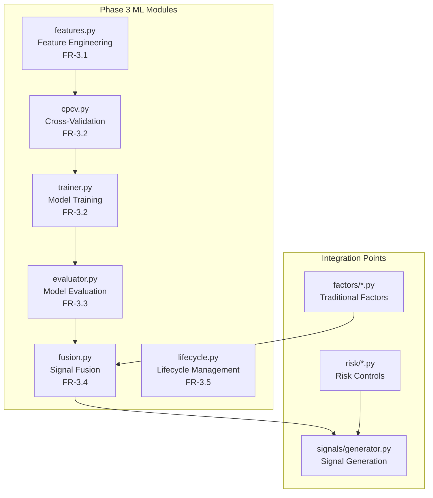
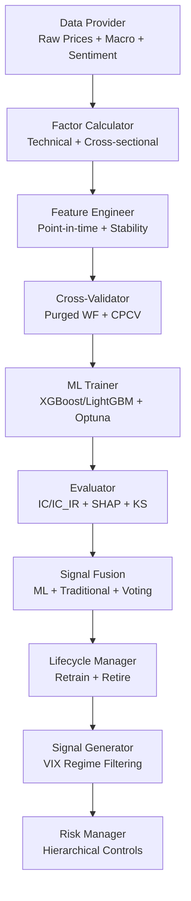
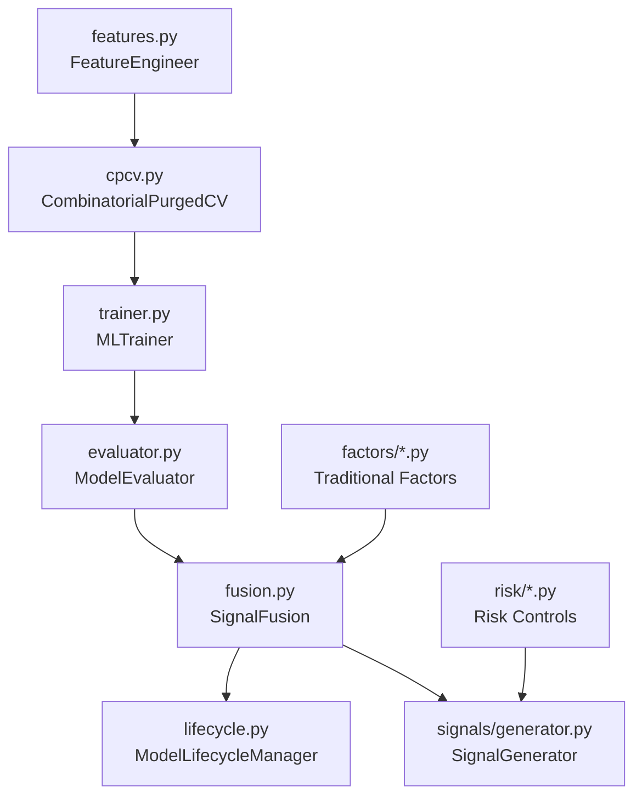

# Phase 3: Machine Learning Enhancement

<cite>
**Referenced Files in This Document**
- [PRD_Intelligent_Trading_System_v2.md](file://PRD_Intelligent_Trading_System_v2.md)
- [Tech_Design_Document.md](file://Tech_Design_Document.md)
- [src/ml/features.py](file://src/ml/features.py)
- [src/ml/cpcv.py](file://src/ml/cpcv.py)
- [src/ml/trainer.py](file://src/ml/trainer.py)
- [src/ml/evaluator.py](file://src/ml/evaluator.py)
- [src/ml/fusion.py](file://src/ml/fusion.py)
- [src/ml/lifecycle.py](file://src/ml/lifecycle.py)
- [src/ml/__init__.py](file://src/ml/__init__.py)
- [demo_phase3.py](file://demo_phase3.py)
- [config/strategy.yaml](file://config/strategy.yaml)
</cite>

## Update Summary
**Changes Made**
- Updated to reflect Enhanced ML capabilities including Random Forest support, Optuna hyperparameter optimization, improved model evaluation with SHAP analysis, turnover-adjusted returns, and advanced feature engineering with stability testing and lookahead bias prevention
- Added comprehensive implementation details for Random Forest integration and Optuna optimization
- Enhanced evaluation framework with SHAP analysis, partial dependence plots, and turnover-adjusted returns
- Updated feature engineering with advanced stability testing and bias prevention mechanisms
- Expanded configuration options with hyperparameter optimization settings

## Table of Contents
1. [Introduction](#introduction)
2. [Project Structure](#project-structure)
3. [Core Components](#core-components)
4. [Architecture Overview](#architecture-overview)
5. [Detailed Component Analysis](#detailed-component-analysis)
6. [Dependency Analysis](#dependency-analysis)
7. [Performance Considerations](#performance-considerations)
8. [Troubleshooting Guide](#troubleshooting-guide)
9. [Conclusion](#conclusion)
10. [Appendices](#appendices)

## Introduction
This document covers Phase 3 machine learning enhancement for the Intelligent Trading Decision System. The Phase 3 ML pipeline is now fully implemented with six comprehensive modules that work together to create robust, overfitting-resistant trading signals. The implementation follows the PRD requirements for FR-3.1 through FR-3.5, providing a complete machine learning workflow from feature engineering to model lifecycle management.

The six modules include Feature Engineering for robust data preparation, CPCV for anti-overfitting validation, Trainer for model development with Random Forest support and Optuna optimization, Evaluator for comprehensive performance assessment with SHAP analysis, Fusion for signal combination, and Lifecycle Management for model maintenance. This completes the machine learning enhancement phase with production-ready implementations featuring advanced ML capabilities.

## Project Structure
The Phase 3 ML pipeline is organized under the `src/ml/` directory with six distinct modules, each handling a specific aspect of the machine learning workflow. The modules are designed to work together seamlessly while maintaining clear separation of concerns.

**Diagram sources**
- [src/ml/__init__.py](file://src/ml/__init__.py#L1-L39)
- [demo_phase3.py](file://demo_phase3.py#L1-L216)

**Section sources**
- [src/ml/__init__.py](file://src/ml/__init__.py#L1-L39)
- [demo_phase3.py](file://demo_phase3.py#L1-L216)

## Core Components
The six ML modules provide a complete machine learning pipeline with the following capabilities:

### Feature Engineering (FR-3.1)
- **Price-based features**: Returns (1, 5, 10, 20, 60 days), volatility (5, 20, 60 days), moving averages (5, 10, 20, 50, 200 days), RSI, MACD, ATR, Bollinger Bands
- **Technical indicators**: Momentum features (1m, 3m, 6m, 12m), volume features, price vs MA ratios
- **Cross-sectional features**: Ranking within dates, return dispersion, correlation changes
- **Macro features**: Interest rates, VIX, DXY, CPI with point-in-time constraints
- **Anti-overfitting**: Point-in-time data usage, forward-only processing, bias prevention
- **Advanced stability testing**: IC variance across time periods to identify unstable features
- **Lookahead bias prevention**: Comprehensive validation to prevent future information leakage

### Cross-Validation (FR-3.2)
- **Purged Walk-Forward CV**: 3-year training windows, 6-month validation, 21-day purge gap, 5-day embargo
- **Combinatorial Purged CV**: Advanced CPCV with combinatorial splits and leak prevention
- **Validation metrics**: IC, AUC-ROC, accuracy, train/validation IC comparison
- **Overfitting detection**: Sharpe difference > 0.5, IC < 0.03, IC variance thresholds

### Model Training (FR-3.2)
- **Supported models**: XGBoost (primary), LightGBM, Random Forest, Ridge regression
- **Hyperparameter optimization**: Optuna-based TPE search with conservative spaces
- **Model persistence**: Metadata storage with training details, performance metrics
- **Version control**: Model ID generation with timestamps
- **Advanced optimization**: Configurable trial limits and timeout settings

### Model Evaluation (FR-3.3)
- **Performance metrics**: IC, IC_IR, AUC-ROC, Sharpe ratio of signal-based portfolios
- **Risk-adjusted returns**: Turnover-adjusted returns with transaction cost modeling
- **Explainability**: SHAP values, feature importance, partial dependence plots
- **Monitoring**: Rolling IC decay, feature drift detection via KS test
- **Comprehensive analysis**: Feature importance ranking, drift detection, prediction analysis

### Signal Fusion (FR-3.4)
- **Weighted averaging**: Dynamic weights based on rolling IC performance
- **Voting mechanism**: Confidence reduction when models disagree (>30% disagreement)
- **Auto-degradation**: ML weight drops to 0 when IC < 0.02 for 20 consecutive days
- **Constraints**: ML weight ≤ 50%, Traditional signal ≥ 50%

### Lifecycle Management (FR-3.5)
- **Retraining schedule**: Monthly retraining with latest 3-year data
- **Trigger-based retraining**: Rolling IC < 0.02 for 10 consecutive days
- **Concept drift monitoring**: Daily KS drift detection (warn at 0.1, retrain at 0.2)
- **Model retirement**: IC < 0 for 30 consecutive days or statistical significance testing

**Section sources**
- [src/ml/features.py](file://src/ml/features.py#L34-L414)
- [src/ml/cpcv.py](file://src/ml/cpcv.py#L14-L213)
- [src/ml/trainer.py](file://src/ml/trainer.py#L114-L500)
- [src/ml/evaluator.py](file://src/ml/evaluator.py#L14-L378)
- [src/ml/fusion.py](file://src/ml/fusion.py#L24-L171)
- [src/ml/lifecycle.py](file://src/ml/lifecycle.py#L36-L185)

## Architecture Overview
The ML pipeline is fully integrated into the trading system, sitting between factor computation and signal generation. Each module handles specific aspects of the machine learning workflow while maintaining clear interfaces for data exchange.

**Diagram sources**
- [demo_phase3.py](file://demo_phase3.py#L21-L216)
- [src/ml/__init__.py](file://src/ml/__init__.py#L1-L39)

## Detailed Component Analysis

### Feature Engineering Pipeline (FR-3.1)
The FeatureEngineer class creates comprehensive features from price data while preventing lookahead bias through point-in-time constraints.

**Key Features:**
- **Price characteristics**: Multiple return periods, volatility calculations, moving average ratios
- **Technical indicators**: RSI, MACD, ATR, Bollinger Bands with comprehensive parameter sets
- **Cross-sectional measures**: Ranking within dates, return dispersion, correlation changes
- **Macro integration**: External macroeconomic variables with proper timing constraints
- **Stability testing**: IC variance across time periods to identify unstable features
- **Advanced bias prevention**: Comprehensive validation to prevent future information leakage

**Implementation Details:**
- Configurable feature periods through FeatureConfig dataclass
- Point-in-time data validation to prevent future information leakage
- Feature selection using IC thresholding and PCA dimensionality reduction
- Comprehensive stability testing across 4 time periods
- Lookahead bias detection and removal mechanisms

**Section sources**
- [src/ml/features.py](file://src/ml/features.py#L34-L414)
- [config/strategy.yaml](file://config/strategy.yaml#L81-L86)

### Cross-Validation Framework (FR-3.2)
The CPCV module implements Lopez de Prado's combinatorial purged cross-validation for time series data.

**Module Components:**
- **CombinatorialPurgedCV**: Advanced CPCV with combinatorial split generation
- **PurgedWalkForwardCV**: Simpler rolling window validation with purge gaps
- **Factory function**: create_time_series_split for flexible CV selection

**Validation Parameters:**
- Training window: 756 days (~3 years) with 21-day purge gap
- Test window: 126 days (~6 months) with 5-day embargo
- Minimum 6 folds for robust validation
- Purge gap prevents label leakage between train/test sets

**Section sources**
- [src/ml/cpcv.py](file://src/ml/cpcv.py#L14-L213)
- [config/strategy.yaml](file://config/strategy.yaml#L89-L96)

### Model Training Framework (FR-3.2)
The MLTrainer class provides comprehensive model training with overfitting detection and optimization.

**Model Support:**
- **XGBoost**: Primary model with configurable binary/regression objectives
- **LightGBM**: Alternative gradient boosting with efficient memory usage
- **Random Forest**: Ensemble method for baseline comparison (NEW)
- **Ridge Regression**: Linear baseline model

**Training Features:**
- Cross-validation scoring with IC, AUC, accuracy metrics
- Overfitting detection using train/validation IC comparison
- Hyperparameter optimization with Optuna TPE sampler (NEW)
- Model persistence with comprehensive metadata

**Enhanced Capabilities:**
- **Random Forest Integration**: Complete support for Random Forest classifiers and regressors
- **Optuna Optimization**: Advanced hyperparameter tuning with configurable trial limits
- **Conservative Search Spaces**: Prevents overfitting during optimization itself
- **Multi-model Support**: Seamless switching between different algorithm types

**Section sources**
- [src/ml/trainer.py](file://src/ml/trainer.py#L114-L500)
- [config/strategy.yaml](file://config/strategy.yaml#L90-L97)

### Model Evaluation and Interpretability (FR-3.3)
The ModelEvaluator provides comprehensive performance assessment and explainability.

**Evaluation Metrics:**
- **Information Coefficient**: Spearman rank correlation for IC calculation
- **IC Information Ratio**: Consistency measurement (IC mean/IC std)
- **Portfolio metrics**: Long-short spreads, Sharpe ratios of signal-based portfolios
- **Risk-adjusted returns**: Turnover-adjusted returns with transaction cost modeling

**Explainability Tools:**
- **SHAP analysis**: Per-prediction feature contribution analysis (ENHANCED)
- **Feature importance**: Global importance ranking from trained models
- **Partial dependence**: Marginal effect visualization for top features (NEW)
- **Drift detection**: KS test for feature and prediction distribution changes

**Advanced Features:**
- **Turnover Adjustment**: Comprehensive transaction cost modeling (NEW)
- **Partial Dependence Plots**: Visual analysis of feature effects (NEW)
- **Enhanced SHAP Analysis**: Improved interpretability with better handling of multi-class models

**Section sources**
- [src/ml/evaluator.py](file://src/ml/evaluator.py#L14-L378)
- [config/strategy.yaml](file://config/strategy.yaml#L99-L102)

### Signal Fusion and Dynamic Weighting (FR-3.4)
The SignalFusion module combines ML predictions with traditional signals using sophisticated weighting mechanisms.

**Fusion Strategy:**
- **Dynamic weighting**: ML weight = min(0.5, rolling_IC / benchmark_IC)
- **Auto-degradation**: ML weight = 0 when IC < 0.02 for 20 consecutive days
- **Voting mechanism**: Confidence reduction (×0.5) when model disagreement > 30%
- **Normalization**: Z-score scaling with clipping to [-1, 1] range

**Constraints:**
- ML signal weight cap: 50% maximum
- Traditional signal minimum: 50% guaranteed
- Disagreement threshold: 30% sign disagreement triggers confidence reduction

**Section sources**
- [src/ml/fusion.py](file://src/ml/fusion.py#L24-L171)
- [config/strategy.yaml](file://config/strategy.yaml#L105-L110)

### Model Lifecycle Management (FR-3.5)
The ModelLifecycleManager handles model maintenance, retraining scheduling, and retirement decisions.

**Retraining Triggers:**
- **Scheduled retraining**: Monthly retraining with latest 3-year data window
- **Performance triggers**: Rolling IC < 0.02 for 10 consecutive days
- **Drift detection**: Concept drift with KS > 0.2 triggers immediate retraining

**Retirement Criteria:**
- **Performance degradation**: IC < 0 for 30 consecutive days
- **Statistical comparison**: New model must exceed old model by 0.01 IC with p < 0.05
- **Significance testing**: Approximate t-test for improvement validation

**Monitoring:**
- **IC history tracking**: Rolling IC performance monitoring
- **Drift logging**: KS statistics with alert/retrain thresholds
- **Lifecycle reporting**: Comprehensive status reports for model health

**Section sources**
- [src/ml/lifecycle.py](file://src/ml/lifecycle.py#L36-L185)
- [config/strategy.yaml](file://config/strategy.yaml#L113-L121)

## Dependency Analysis
The ML modules depend on each other in a specific workflow while maintaining loose coupling through well-defined interfaces.

**Diagram sources**
- [src/ml/__init__.py](file://src/ml/__init__.py#L1-L39)
- [demo_phase3.py](file://demo_phase3.py#L1-L216)

**Section sources**
- [src/ml/__init__.py](file://src/ml/__init__.py#L1-L39)
- [demo_phase3.py](file://demo_phase3.py#L1-L216)

## Performance Considerations
The six ML modules are designed for production deployment with careful attention to computational efficiency and monitoring overhead.

**Computational Efficiency:**
- **Conservative optimization**: Optuna search limited to 100 trials to prevent overfitting optimization
- **Efficient CV**: Purged Walk-Forward provides ~6-8 folds with reasonable computational cost
- **Memory management**: Proper cleanup and scaling in training pipeline
- **Random Forest optimization**: Parallel processing support for faster training

**Monitoring Overhead:**
- **Daily drift checks**: Minimal runtime cost compared to model training
- **Rolling IC curves**: Efficient pandas operations for performance tracking
- **Logging optimization**: Structured logging with appropriate verbosity levels

**Integration Latency:**
- **Feature engineering**: Optimized pandas operations with vectorized calculations
- **Model inference**: Cached scalers and models for fast prediction deployment
- **Pipeline coordination**: Clear separation of concerns reduces bottlenecks

## Troubleshooting Guide
Common issues and resolutions for the six ML modules:

**Feature Engineering Issues:**
- **Lookahead bias symptoms**: Suspicious high correlations with target variable
- **Missing data**: Forward fill only, no future data leakage in imputation
- **Feature instability**: IC variance > 0.01 across time periods flags unstable features

**Training Problems:**
- **Overfitting detection**: Train-Val IC gap > 0.5, validation IC < 0.03, IC std > 0.1
- **Poor convergence**: Reduce learning rate, increase regularization, adjust tree depth
- **Optimization failures**: Check Optuna installation, adjust search space bounds
- **Random Forest issues**: Tune n_estimators and max_depth parameters appropriately

**Evaluation Concerns:**
- **SHAP calculation failures**: Missing shap package, try alternative explainability methods
- **Drift detection**: KS > 0.1 moderate drift, KS > 0.2 severe drift requiring retraining
- **Turnover costs**: Adjust transaction cost drag in turnover-adjusted returns
- **Partial dependence errors**: Check sklearn version compatibility

**Fusion Anomalies:**
- **Auto-degradation**: IC < 0.02 for 20 consecutive days triggers ML weight reduction to 0
- **High disagreement**: Model disagreement > 30% reduces confidence ×0.5
- **Weight constraints**: Ensure ML weight ≤ 50%, Traditional ≥ 50% maintained

**Lifecycle Management:**
- **Retraining triggers**: Monthly schedule plus performance-based triggers
- **Retirement decisions**: Statistical significance testing required for model replacement
- **Drift monitoring**: Daily KS drift checks with appropriate alert thresholds

**Section sources**
- [src/ml/features.py](file://src/ml/features.py#L362-L414)
- [src/ml/trainer.py](file://src/ml/trainer.py#L287-L318)
- [src/ml/evaluator.py](file://src/ml/evaluator.py#L193-L241)
- [src/ml/fusion.py](file://src/ml/fusion.py#L98-L131)
- [src/ml/lifecycle.py](file://src/ml/lifecycle.py#L56-L92)

## Conclusion
Phase 3 Machine Learning Enhancement is now complete with six fully implemented and integrated modules that provide a robust, production-ready machine learning pipeline. The implementation successfully addresses all PRD requirements from FR-3.1 through FR-3.5, offering comprehensive solutions for feature engineering, anti-overfitting validation, model training, evaluation, signal fusion, and lifecycle management.

The six modules work together seamlessly to create ML-enhanced trading signals that complement traditional factor-based approaches while maintaining strict risk controls and overfitting prevention. The modular design allows for easy maintenance, extension, and deployment in production trading environments.

**Recent Enhancements:**
- **Random Forest Support**: Added comprehensive Random Forest integration for baseline comparison
- **Optuna Optimization**: Implemented advanced hyperparameter optimization with configurable constraints
- **Enhanced Evaluation**: Improved model assessment with SHAP analysis, partial dependence plots, and turnover-adjusted returns
- **Advanced Feature Engineering**: Strengthened stability testing and lookahead bias prevention mechanisms

## Appendices

### Configuration Options and Hyperparameters
The ML system uses comprehensive configuration through strategy.yaml with the following key parameters:

**Feature Engineering Configuration (FR-3.1):**
- Return periods: [1, 5, 10, 20, 60]
- Volatility periods: [5, 20, 60]
- MA periods: [5, 10, 20, 50, 200]
- Min IC threshold: 0.02
- Max features: 20

**Training Configuration (FR-3.2):**
- Model type: xgboost, lightgbm, ridge, random_forest (NEW)
- Target type: binary, regression
- CV method: purged_walkforward, cpcv
- Train window: 756 days (3 years)
- Test window: 126 days (6 months)
- Purge gap: 21 days
- Embargo: 5 days

**Hyperparameter Optimization (FR-3.2):**
- Enabled: true
- Max trials: 100
- Timeout: 3600 seconds

**Signal Fusion Configuration (FR-3.4):**
- ML max weight: 50%
- Traditional min weight: 50%
- IC threshold for degradation: 0.02
- Disagreement threshold: 0.30
- Rolling window: 20 days

**Lifecycle Configuration (FR-3.5):**
- Retrain monthly: true
- Retrain trigger IC: 0.02
- Retire IC threshold: 0.0
- Retire IC days: 30
- Drift KS alert: 0.10
- Drift KS retrain: 0.20
- Min IC improvement: 0.01

**Section sources**
- [config/strategy.yaml](file://config/strategy.yaml#L78-L121)

### Return Values and Outputs
Each ML module produces specific outputs for integration into the trading system:

**Feature Engineering Outputs:**
- Feature matrix with point-in-time constraints
- Target variable (future returns or directions)
- Feature selection results (selected feature names)
- Stability test results (IC variance across periods)

**Training Outputs:**
- Trained model instances (XGBoost, LightGBM, Random Forest, Ridge)
- Training metadata with performance metrics
- Scaler objects for prediction consistency
- Model persistence files (.pkl, .json)

**Evaluation Outputs:**
- Performance metrics (IC, IC_IR, AUC, Sharpe)
- Feature importance rankings
- SHAP analysis results (ENHANCED)
- Drift detection scores
- Turnover-adjusted return metrics (ENHANCED)
- Partial dependence analysis (NEW)

**Fusion Outputs:**
- Composite signals with dynamic weights
- Fusion statistics (ML weights, disagreement rates)
- Confidence-adjusted signals
- Auto-degradation events

**Lifecycle Outputs:**
- Retraining decision triggers
- Retirement recommendations
- Drift monitoring reports
- Performance comparison results

**Section sources**
- [src/ml/trainer.py](file://src/ml/trainer.py#L172-L189)
- [src/ml/evaluator.py](file://src/ml/evaluator.py#L70-L107)
- [src/ml/fusion.py](file://src/ml/fusion.py#L43-L96)
- [src/ml/lifecycle.py](file://src/ml/lifecycle.py#L56-L92)

### Integration Examples
The demo script demonstrates complete integration of all six ML modules:

**End-to-End Workflow:**
1. **Data fetching**: Historical price data from DataProvider
2. **Feature creation**: FeatureEngineer.create_features() with macro integration
3. **Target creation**: engineer.create_target() with horizon specification
4. **Feature selection**: IC-based feature selection with stability testing
5. **Model training**: Purged Walk-Forward CV with overfitting detection
6. **Model evaluation**: Comprehensive metrics with SHAP analysis
7. **Signal fusion**: Dynamic weighting with voting mechanism
8. **Lifecycle management**: Retraining triggers and retirement decisions

**Practical Usage:**
- Modular imports from src/ml/__init__.py
- Configuration-driven parameter setting
- Error handling and logging throughout the pipeline
- Production-ready model persistence and loading

**Section sources**
- [demo_phase3.py](file://demo_phase3.py#L21-L216)
- [src/ml/__init__.py](file://src/ml/__init__.py#L1-L39)