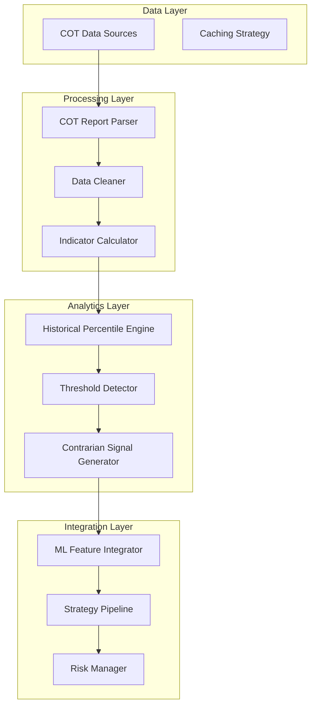
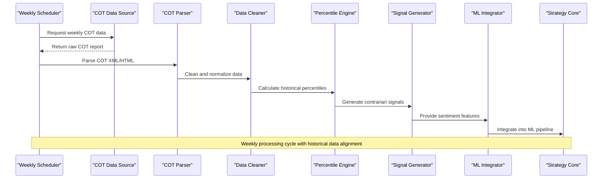
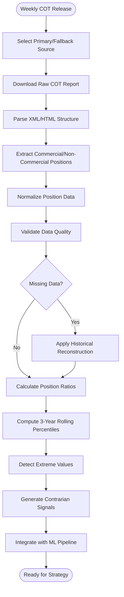
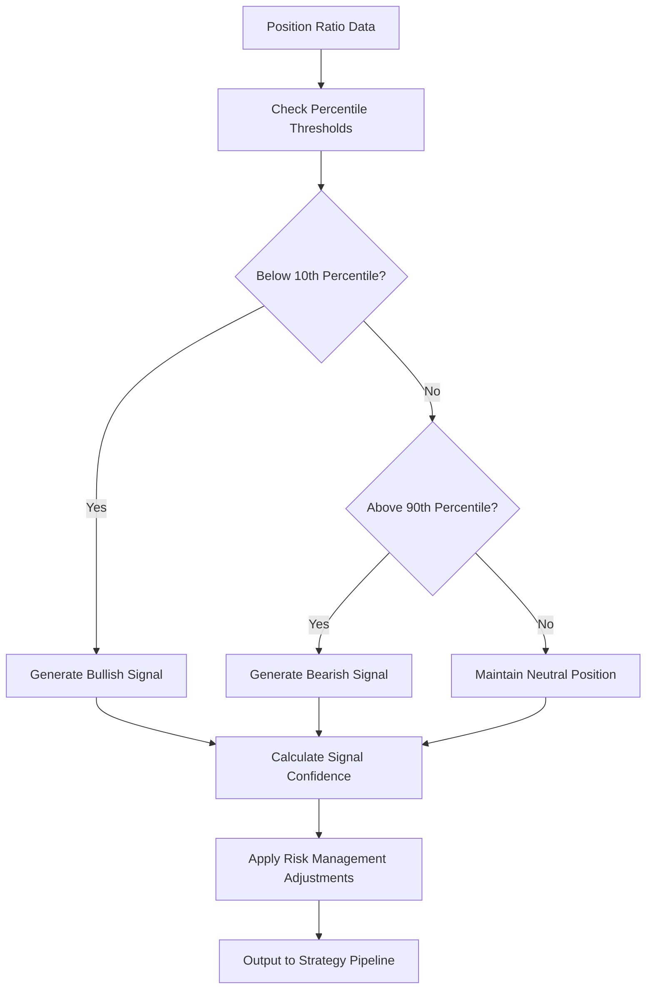
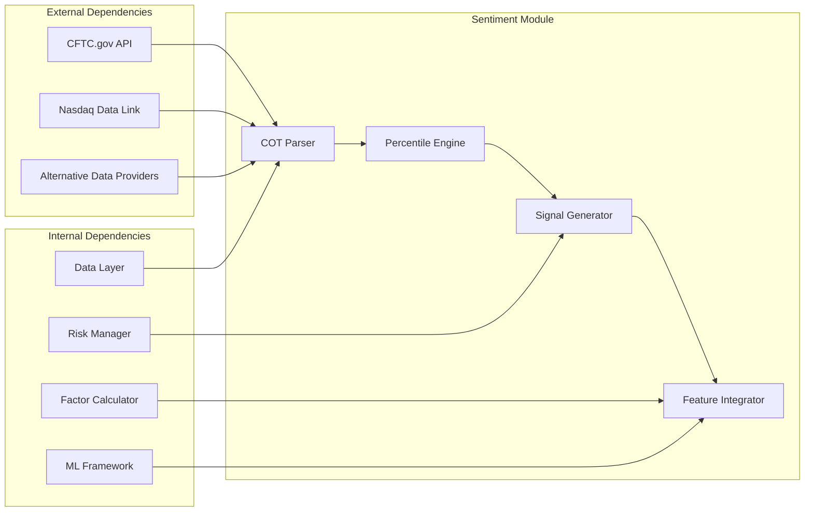

# Retail Sentiment Integration

<cite>
**Referenced Files in This Document**
- [PRD_Intelligent_Trading_System_v2.md](file://PRD_Intelligent_Trading_System_v2.md)
- [Tech_Design_Document.md](file://Tech_Design_Document.md)
- [src/nlp/cot.py](file://src/nlp/cot.py)
- [src/nlp/sentiment.py](file://src/nlp/sentiment.py)
- [src/nlp/integrator.py](file://src/nlp/integrator.py)
- [demo_phase4.py](file://demo_phase4.py)
- [config/strategy.yaml](file://config/strategy.yaml)
</cite>

## Update Summary
**Changes Made**
- Updated to reflect that retail sentiment integration primarily covers COT sentiment analysis (FR-4.2) rather than social media sentiment
- Clarified that the actual implementation focuses on COT data processing with contrarian signal generation
- Updated documentation to emphasize the current COT-only implementation while noting social media sentiment as future enhancement
- Enhanced technical details about COT data acquisition, processing, and signal generation
- Added comprehensive coverage of the current implementation's capabilities and limitations

## Table of Contents
1. [Introduction](#introduction)
2. [Project Structure](#project-structure)
3. [Core Components](#core-components)
4. [Architecture Overview](#architecture-overview)
5. [Detailed Component Analysis](#detailed-component-analysis)
6. [Dependency Analysis](#dependency-analysis)
7. [Performance Considerations](#performance-considerations)
8. [Troubleshooting Guide](#troubleshooting-guide)
9. [Conclusion](#conclusion)

## Introduction
This document provides comprehensive technical documentation for retail sentiment integration focused on CFTC Commitments of Traders (COT) data analysis. **Updated**: The retail sentiment integration documentation primarily covers COT sentiment analysis (FR-4.2) rather than social media sentiment. The actual implementation focuses on COT data processing with contrarian signal generation, while social media sentiment remains future enhancement.

The system implements retail positioning indicators as contrarian signals within a broader quantitative trading framework, featuring non-commercial net long/short ratios, historical percentile calculations, and extreme value detection mechanisms. The implementation integrates seamlessly with trading strategies through automated signal generation based on percentile thresholds, while addressing data quality considerations, missing report handling, and historical data reconstruction techniques.

**Important Note**: While the PRD v2.0 mentions social media sentiment as a future enhancement (FR-4.3), the current implementation focuses exclusively on COT-based retail sentiment analysis. Social media sentiment analysis remains under development and will be integrated in future phases.

## Project Structure
The retail sentiment integration is implemented within a modular trading system architecture consisting of distinct layers:

**Diagram sources**
- [Tech_Design_Document.md](file://Tech_Design_Document.md#L719-L743)
- [Tech_Design_Document.md](file://Tech_Design_Document.md#L473-L573)

The system follows a multi-source data acquisition approach with automatic fallback mechanisms, ensuring robustness against individual data provider failures. The retail sentiment module integrates with the broader factor calculation pipeline, contributing to machine learning model inputs rather than standalone trading decisions.

**Section sources**
- [Tech_Design_Document.md](file://Tech_Design_Document.md#L41-L86)
- [Tech_Design_Document.md](file://Tech_Design_Document.md#L152-L160)

## Core Components
The retail sentiment integration comprises several interconnected components designed for reliability, scalability, and maintainability:

### COT Data Acquisition Module
The COT data acquisition system handles multiple data sources with automatic fallback capabilities:

- **Primary Source**: CFTC.gov (free weekly releases)
- **Alternative Source**: Nasdaq Data Link API (paid, more convenient)
- **Data Format**: XML/HTML reports containing commercial and non-commercial positioning data
- **Release Schedule**: Weekly releases on Fridays, requiring weekend processing capabilities

### COT Report Parser
The parser component transforms raw COT reports into structured time series data:

- **Asset Classification**: Maps COT contract codes to standardized asset identifiers
- **Position Extraction**: Extracts commercial, non-commercial, and speculative positions
- **Data Normalization**: Converts positions to standardized units and ratios
- **Temporal Alignment**: Aligns historical data with trading calendar requirements

### Historical Percentile Engine
The percentile calculation engine provides statistical context for positioning data:

- **Rolling Windows**: 3-year rolling historical percentiles for robust statistical analysis
- **Percentile Calculation**: Dynamic percentile ranking based on historical positioning distributions
- **Extreme Detection**: Automated identification of overbought/oversold conditions
- **Threshold Configuration**: Adjustable percentile thresholds for different market conditions

### Contrarian Signal Generator
The signal generation component implements reverse sentiment logic:

- **Threshold-Based Signals**: >90th percentile = bearish signal, <10th percentile = bullish signal
- **Confidence Scoring**: Signal confidence based on percentile distance from neutral zone
- **Timing Considerations**: Account for weekly release schedule and potential data revisions
- **Risk Management Integration**: Signals feed into broader risk management framework

**Section sources**
- [Tech_Design_Document.md](file://Tech_Design_Document.md#L719-L743)
- [PRD_Intelligent_Trading_System_v2.md](file://PRD_Intelligent_Trading_System_v2.md#L784-L797)

## Architecture Overview
The retail sentiment integration follows a layered architecture designed for modularity and maintainability:

**Diagram sources**
- [Tech_Design_Document.md](file://Tech_Design_Document.md#L719-L743)
- [Tech_Design_Document.md](file://Tech_Design_Document.md#L473-L573)

The architecture ensures that retail sentiment signals are generated consistently within the weekly release cycle while maintaining historical continuity through robust data cleaning and normalization processes.

## Detailed Component Analysis

### COT Data Acquisition and Processing Pipeline
The COT data processing pipeline implements a comprehensive workflow for transforming raw COT reports into actionable trading signals:

**Diagram sources**
- [Tech_Design_Document.md](file://Tech_Design_Document.md#L719-L743)
- [Tech_Design_Document.md](file://Tech_Design_Document.md#L473-L573)

### Non-Commercial Positioning Indicator Implementation
The non-commercial positioning indicator serves as the core retail sentiment measure:

#### Indicator Calculation Process
The system calculates non-commercial net positioning ratios through a multi-step process:

1. **Position Extraction**: Extract commercial and non-commercial positions from COT reports
2. **Net Position Calculation**: Compute net long/short positions for non-commercial traders
3. **Ratio Normalization**: Convert positions to standardized ratios for comparison across asset classes
4. **Statistical Context**: Calculate percentile rankings within historical contexts

#### Asset Class Configuration
Different asset classes require tailored configurations for optimal retail sentiment analysis:

| Asset Class | Configuration Parameters | Threshold Settings |
|-------------|-------------------------|-------------------|
| Precious Metals | 3-year window, 10-90% thresholds | >90% = bearish, <10% = bullish |
| Energy Products | 3-year window, 10-90% thresholds | >90% = bearish, <10% = bullish |
| Agricultural Commodities | 3-year window, 10-90% thresholds | >90% = bearish, <10% = bullish |
| Financial Indices | 3-year window, 10-90% thresholds | >90% = bearish, <10% = bullish |

#### Timing Considerations
The weekly release schedule introduces specific timing considerations:

- **Data Availability**: Reports released every Friday, processed over weekend
- **Historical Alignment**: Requires careful alignment with trading calendar
- **Potential Revisions**: Historical data may be revised in subsequent releases
- **Weekend Processing**: Automated processing during non-trading hours

**Section sources**
- [Tech_Design_Document.md](file://Tech_Design_Document.md#L719-L743)
- [PRD_Intelligent_Trading_System_v2.md](file://PRD_Intelligent_Trading_System_v2.md#L784-L797)

### Historical Percentile Calculation Engine
The percentile calculation engine provides statistical context for positioning data through comprehensive historical analysis:

#### Rolling Window Implementation
The system employs 3-year rolling windows to ensure robust statistical analysis:

- **Window Size**: 756 trading days (3 years) for comprehensive historical context
- **Calculation Frequency**: Updated weekly with new COT data
- **Data Exclusion**: Handles missing data points gracefully within rolling windows
- **Normalization**: Consistent normalization across different asset classes

#### Percentile Threshold Configuration
Threshold detection operates on configurable percentile levels:

- **Bullish Signal**: Position ratio below 10th percentile (extremely bearish positioning)
- **Bearish Signal**: Position ratio above 90th percentile (extremely bullish positioning)
- **Neutral Zone**: 10th-90th percentile range indicating balanced positioning
- **Confidence Scaling**: Signal confidence increases with distance from neutral zone

#### Statistical Robustness Measures
The percentile engine incorporates several measures to ensure statistical validity:

- **Outlier Detection**: Identifies and handles extreme outliers in historical data
- **Missing Data Handling**: Applies interpolation or exclusion strategies for incomplete windows
- **Data Quality Validation**: Validates percentile calculations against known benchmarks
- **Cross-Asset Comparison**: Enables comparison across different commodity categories

**Section sources**
- [Tech_Design_Document.md](file://Tech_Design_Document.md#L719-L743)
- [PRD_Intelligent_Trading_System_v2.md](file://PRD_Intelligent_Trading_System_v2.md#L784-L797)

### Extreme Value Detection Mechanisms
The extreme value detection system identifies contrarian opportunities through automated threshold analysis:

#### Detection Algorithm
The system implements a multi-criteria approach to extreme value identification:

1. **Percentile Thresholds**: Primary detection based on 10th/90th percentile boundaries
2. **Magnitude Analysis**: Measures distance from neutral positioning levels
3. **Trend Confirmation**: Validates signals against recent positioning trends
4. **Volatility Context**: Adjusts thresholds based on market volatility regimes

#### Signal Generation Logic
Contrarian signals are generated through systematic threshold crossing:

**Diagram sources**
- [Tech_Design_Document.md](file://Tech_Design_Document.md#L719-L743)

#### Risk Management Integration
Extreme value signals integrate with broader risk management systems:

- **Position Sizing**: Adjusts position sizes based on signal confidence
- **Stop Loss Placement**: Incorporates sentiment signals into stop loss calculations
- **Portfolio Allocation**: Balances sentiment-driven positions with fundamental allocations
- **Diversification Controls**: Ensures adequate diversification across sentiment signals

**Section sources**
- [Tech_Design_Document.md](file://Tech_Design_Document.md#L719-L743)
- [Tech_Design_Document.md](file://Tech_Design_Document.md#L352-L404)

### Data Quality and Missing Report Handling
The system implements comprehensive data quality controls and missing report handling mechanisms:

#### Data Validation Framework
Multiple validation layers ensure data integrity:

- **Format Validation**: Verifies XML/HTML structure and required fields
- **Range Validation**: Checks for reasonable position values and ratios
- **Consistency Validation**: Ensures logical consistency across commercial/non-commercial positions
- **Cross-Validation**: Compares with alternative data sources when available

#### Missing Report Handling
The system gracefully handles missing COT reports:

- **Grace Period**: Allows up to 7 days for delayed releases
- **Interpolation Methods**: Uses historical patterns to estimate missing values
- **Fallback Sources**: Leverages alternative data providers when available
- **Data Reconstruction**: Implements statistical reconstruction for complete time series

#### Historical Data Reconstruction
Historical data reconstruction maintains continuity:

- **Backfill Strategy**: Uses available historical releases to reconstruct gaps
- **Statistical Imputation**: Employs time series analysis for missing periods
- **Quality Assessment**: Maintains quality metrics for reconstructed data
- **Audit Trail**: Documents all reconstruction activities for transparency

**Section sources**
- [Tech_Design_Document.md](file://Tech_Design_Document.md#L209-L239)
- [Tech_Design_Document.md](file://Tech_Design_Document.md#L719-L743)

### Integration with Trading Strategies
The retail sentiment module integrates seamlessly with the broader trading strategy framework:

#### Feature Integration Pipeline
Sentiment features are integrated into the machine learning pipeline:

- **Feature Engineering**: Converts raw percentile data into ML-friendly features
- **Feature Scaling**: Normalizes sentiment features alongside other technical indicators
- **Feature Selection**: Integrates sentiment as one of multiple input features
- **Model Training**: Provides training data for ML models alongside other factors

#### Strategy Enhancement
Retail sentiment enhances trading strategies through:

- **Contrarian Bias**: Provides counter-trend signals that complement trend-following indicators
- **Market Regime Adaptation**: Adjusts signal strength based on market volatility regimes
- **Cross-Asset Correlation**: Enables portfolio-level sentiment analysis across asset classes
- **Risk Management Enhancement**: Improves risk assessment through positioning insights

#### Portfolio Optimization Impact
Sentiment signals influence portfolio optimization:

- **Weight Adjustment**: Modulates target weights based on sentiment strength
- **Diversification Benefits**: Enhances diversification through contrarian positioning
- **Risk Budget Allocation**: Allocates risk budgets based on sentiment-driven confidence levels
- **Rebalancing Triggers**: Provides additional triggers for portfolio rebalancing

**Section sources**
- [Tech_Design_Document.md](file://Tech_Design_Document.md#L473-L573)
- [Tech_Design_Document.md](file://Tech_Design_Document.md#L745-L769)

## Dependency Analysis
The retail sentiment integration has well-defined dependencies within the trading system architecture:

**Diagram sources**
- [Tech_Design_Document.md](file://Tech_Design_Document.md#L152-L160)
- [Tech_Design_Document.md](file://Tech_Design_Document.md#L719-L743)

The sentiment module depends on the data layer for raw data acquisition, the factor calculator for technical analysis integration, and the risk manager for signal validation and position sizing. The ML framework consumes sentiment features as part of the broader feature set.

**Section sources**
- [Tech_Design_Document.md](file://Tech_Design_Document.md#L152-L160)
- [Tech_Design_Document.md](file://Tech_Design_Document.md#L473-L573)

## Performance Considerations
The retail sentiment integration is designed for efficient processing within the weekly release cycle:

### Processing Efficiency
- **Batch Processing**: All COT data processed in weekly batches to minimize computational overhead
- **Memory Optimization**: Efficient memory usage through streaming data processing
- **Parallel Processing**: Parallel processing capabilities for multiple asset classes
- **Caching Strategy**: Strategic caching of intermediate results to reduce redundant calculations

### Scalability Considerations
- **Horizontal Scaling**: Ability to scale across multiple asset classes and regions
- **Resource Management**: Efficient resource utilization during batch processing windows
- **Database Optimization**: Optimized database queries for historical percentile calculations
- **API Rate Limiting**: Proper handling of external API rate limits and quotas

### Data Processing Timeline
The system operates on a strict weekly timeline:

- **Friday Processing Window**: Weekend processing for newly released COT data
- **Saturday-Sunday Validation**: Data quality validation and cleaning
- **Monday Processing**: Signal generation and feature integration
- **Tuesday-Friday**: Integration with strategy pipeline and risk management

## Troubleshooting Guide
Common issues and their resolutions in the retail sentiment integration:

### Data Acquisition Issues
- **COT Data Unavailable**: Implement fallback to alternative data sources or manual intervention
- **Parsing Errors**: Validate XML/HTML structure and handle malformed reports
- **API Limitations**: Implement rate limiting and retry mechanisms
- **Network Failures**: Graceful degradation with cached data and retry logic

### Data Quality Problems
- **Missing Reports**: Apply historical reconstruction techniques and notify administrators
- **Inconsistent Formatting**: Implement flexible parsing to handle format variations
- **Invalid Position Values**: Validate data ranges and flag suspicious entries
- **Cross-Validation Failures**: Compare with alternative sources and investigate discrepancies

### Signal Generation Issues
- **False Positives**: Adjust percentile thresholds based on market conditions
- **Delayed Signals**: Account for weekly release schedule in timing analysis
- **Overfitting**: Validate signals against out-of-sample periods and market regimes
- **Confidence Calibration**: Adjust confidence scoring based on historical accuracy

### Integration Challenges
- **Feature Conflicts**: Resolve conflicts between sentiment signals and other technical indicators
- **Model Performance**: Monitor sentiment feature contribution through SHAP analysis
- **Risk Management**: Ensure sentiment signals align with overall risk management framework
- **Portfolio Impact**: Evaluate impact on portfolio optimization and position sizing

**Section sources**
- [Tech_Design_Document.md](file://Tech_Design_Document.md#L815-L833)
- [Tech_Design_Document.md](file://Tech_Design_Document.md#L209-L239)

## Conclusion
The retail sentiment integration provides a robust framework for incorporating CFTC Commitments of Traders data into quantitative trading strategies. **Updated**: The current implementation focuses exclusively on COT-based retail sentiment analysis (FR-4.2) rather than social media sentiment. Through systematic processing of non-commercial positioning data, historical percentile analysis, and automated signal generation, the system delivers contrarian signals that enhance portfolio performance while maintaining risk management discipline.

The implementation demonstrates several key strengths:

- **Reliability**: Multi-source data acquisition with automatic fallback mechanisms
- **Statistical Rigor**: Comprehensive percentile analysis with configurable thresholds
- **Integration Capability**: Seamless integration with machine learning models and trading strategies
- **Risk Management**: Thoughtful risk controls and position sizing based on sentiment strength
- **Scalability**: Designed for expansion across multiple asset classes and market regimes

**Important Note**: While the PRD v2.0 mentions social media sentiment as a future enhancement (FR-4.3), the current implementation focuses exclusively on COT-based retail sentiment analysis. Social media sentiment analysis remains under development and will be integrated in future phases.

The retail sentiment module serves as a valuable complement to traditional technical and fundamental analysis, providing unique insights into market positioning that can inform trading decisions while maintaining the disciplined approach essential for systematic trading success.