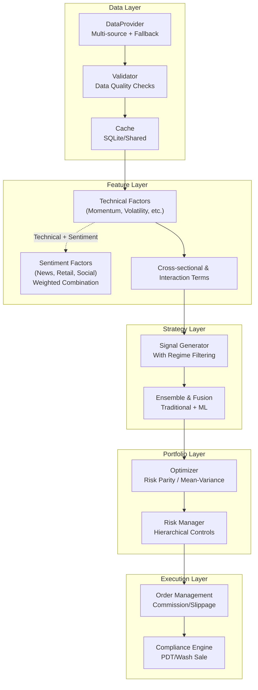
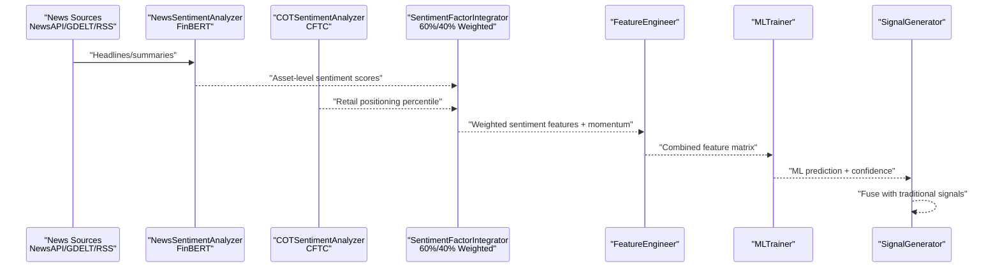
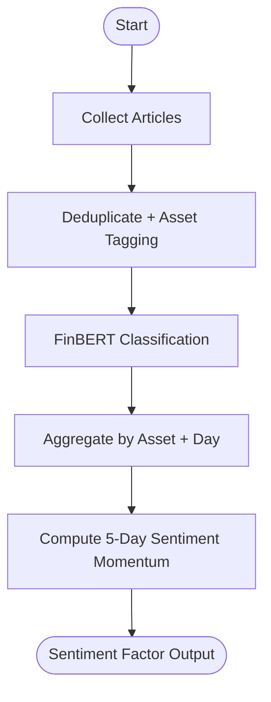
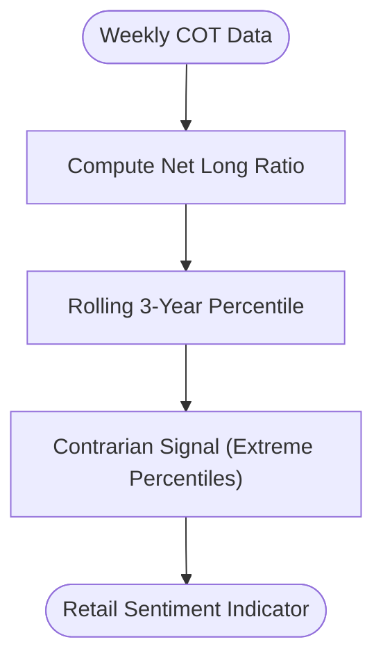
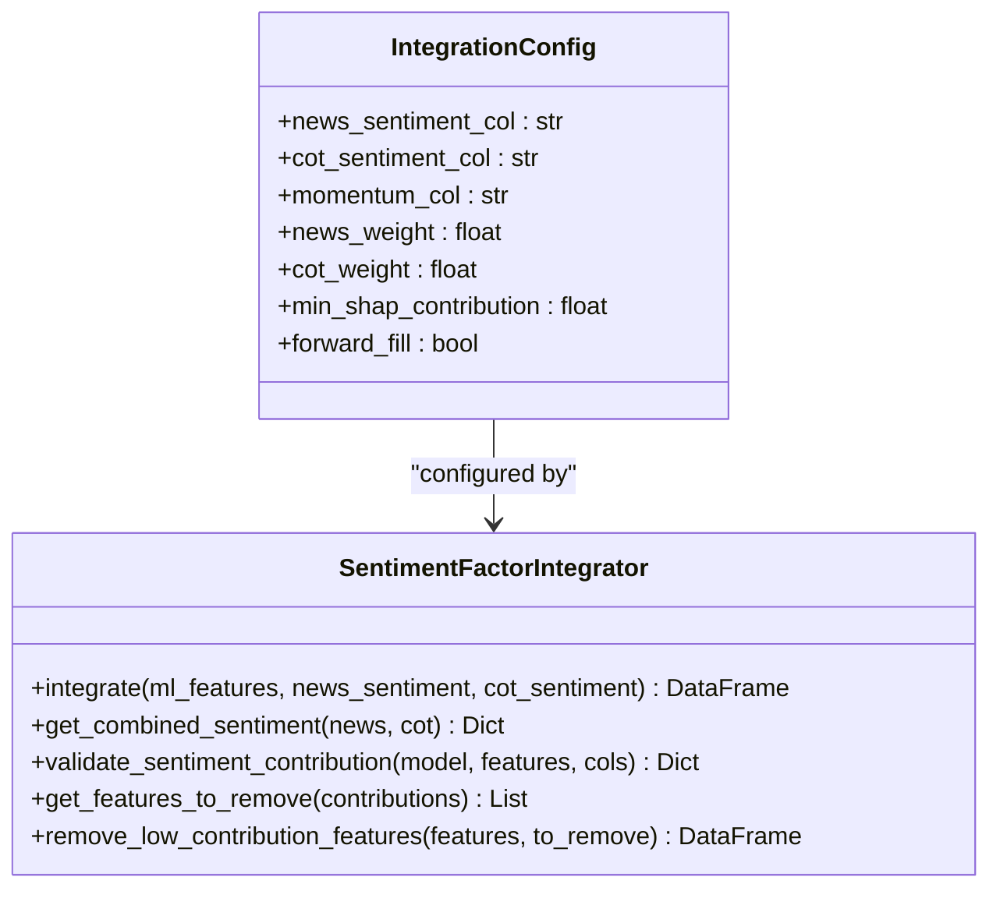
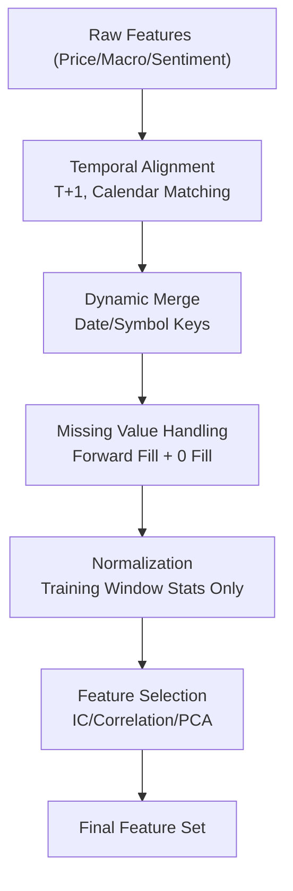
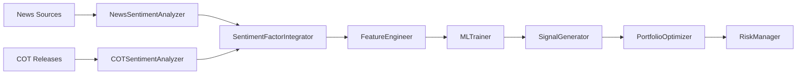

# Sentiment Factor Integration

<cite>
**Referenced Files in This Document**
- [PRD_Intelligent_Trading_System_v2.md](file://PRD_Intelligent_Trading_System_v2.md)
- [Tech_Design_Document.md](file://Tech_Design_Document.md)
- [src/nlp/integrator.py](file://src/nlp/integrator.py)
- [src/nlp/sentiment.py](file://src/nlp/sentiment.py)
- [src/nlp/__init__.py](file://src/nlp/__init__.py)
- [demo_phase4.py](file://demo_phase4.py)
- [code_review_log.md](file://code_review_log.md)
</cite>

## Update Summary
**Changes Made**
- Updated FR-4.3 implementation details with weighted combination of news and COT sentiment (60%/40%)
- Added SHAP-based validation with 5% contribution threshold
- Documented dynamic integration into ML pipeline with forward-fill handling
- Enhanced feature engineering workflow with sentiment momentum calculations
- Updated integration architecture to reflect actual implementation

## Table of Contents
1. [Introduction](#introduction)
2. [Project Structure](#project-structure)
3. [Core Components](#core-components)
4. [Architecture Overview](#architecture-overview)
5. [Detailed Component Analysis](#detailed-component-analysis)
6. [Dependency Analysis](#dependency-analysis)
7. [Performance Considerations](#performance-considerations)
8. [Troubleshooting Guide](#troubleshooting-guide)
9. [Conclusion](#conclusion)
10. [Appendices](#appendices)

## Introduction
This document describes the systematic integration of NLP-derived sentiment signals into the intelligent trading decision system. The implementation completes FR-4.3 requirements with a weighted combination of news and COT sentiment factors, SHAP-based validation with 5% contribution thresholds, and seamless integration into the Phase 3 ML pipeline with forward-fill handling. It documents the end-to-end sentiment factor pipeline, including data sourcing, preprocessing, aggregation, normalization, and feature engineering. The document explains how sentiment factors are incorporated into machine learning models, portfolio optimization, and risk management. It covers weighting mechanisms, temporal alignment, quality control, momentum calculations, cross-asset correlation analysis, factor stability monitoring, and integration with existing technical factors. Concrete examples illustrate backtesting, stress testing, and production deployment considerations, along with troubleshooting guidance for common integration issues.

## Project Structure
The system is organized into layered modules supporting sentiment factor integration:
- Data ingestion and validation
- Factor computation (including sentiment)
- Signal generation and ensemble
- Portfolio optimization and risk management
- Machine learning pipeline with feature engineering and model lifecycle
- NLP sentiment pipeline (Phase 4)
- Execution, state persistence, monitoring, and alerting

**Diagram sources**
- [Tech_Design_Document.md](file://Tech_Design_Document.md#L88-L117)
- [Tech_Design_Document.md](file://Tech_Design_Document.md#L209-L248)
- [Tech_Design_Document.md](file://Tech_Design_Document.md#L250-L295)
- [Tech_Design_Document.md](file://Tech_Design_Document.md#L474-L573)
- [Tech_Design_Document.md](file://Tech_Design_Document.md#L680-L770)
- [Tech_Design_Document.md](file://Tech_Design_Document.md#L771-L808)
- [Tech_Design_Document.md](file://Tech_Design_Document.md#L1006-L1113)

**Section sources**
- [Tech_Design_Document.md](file://Tech_Design_Document.md#L34-L117)
- [Tech_Design_Document.md](file://Tech_Design_Document.md#L209-L248)
- [Tech_Design_Document.md](file://Tech_Design_Document.md#L250-L295)
- [Tech_Design_Document.md](file://Tech_Design_Document.md#L474-L573)
- [Tech_Design_Document.md](file://Tech_Design_Document.md#L680-L770)
- [Tech_Design_Document.md](file://Tech_Design_Document.md#L771-L808)
- [Tech_Design_Document.md](file://Tech_Design_Document.md#L1006-L1113)

## Core Components
- DataProvider: Multi-source acquisition with automatic fallback and caching.
- FactorCalculator: Technical factor computation (momentum, volatility, trend).
- SentimentFactorIntegrator: Aggregates sentiment signals into ML feature sets with weighted combination and SHAP validation.
- FeatureEngineer: Creates features including sentiment, macro, and cross-sectional terms.
- MLTrainer: Robust training with purged walk-forward and CPCV validation.
- RiskManager: Hierarchical risk control with correlation monitoring.
- SignalGenerator: Generates signals with market regime filtering.
- PortfolioOptimizer: Risk parity and mean-variance optimization.
- ExecutionEngine: Order management, routing, and compliance.

**Section sources**
- [Tech_Design_Document.md](file://Tech_Design_Document.md#L209-L248)
- [Tech_Design_Document.md](file://Tech_Design_Document.md#L250-L295)
- [Tech_Design_Document.md](file://Tech_Design_Document.md#L474-L573)
- [Tech_Design_Document.md](file://Tech_Design_Document.md#L680-L770)
- [Tech_Design_Document.md](file://Tech_Design_Document.md#L771-L808)

## Architecture Overview
The sentiment factor integration follows a staged pipeline aligned with the project's four-phase roadmap. Phase 4 introduces NLP sentiment as an input feature to the ML pipeline, complementing technical and macro features with weighted combination and validation.

**Diagram sources**
- [Tech_Design_Document.md](file://Tech_Design_Document.md#L680-L770)
- [Tech_Design_Document.md](file://Tech_Design_Document.md#L474-L573)
- [PRD_Intelligent_Trading_System_v2.md](file://PRD_Intelligent_Trading_System_v2.md#L762-L808)

## Detailed Component Analysis

### News Sentiment Analyzer
- Inputs: News headlines and summaries from multiple sources.
- Processing:
  - Deduplication and asset tagging via keywords and NER.
  - FinBERT-based classification yielding a sentiment score per article.
  - Aggregation by asset and day to produce daily sentiment series.
  - Sentiment momentum computed as the change in a 5-day moving average.
- Output: Daily sentiment factor series aligned to trading calendar.

**Diagram sources**
- [Tech_Design_Document.md](file://Tech_Design_Document.md#L682-L717)
- [PRD_Intelligent_Trading_System_v2.md](file://PRD_Intelligent_Trading_System_v2.md#L762-L782)

**Section sources**
- [Tech_Design_Document.md](file://Tech_Design_Document.md#L682-L717)
- [PRD_Intelligent_Trading_System_v2.md](file://PRD_Intelligent_Trading_System_v2.md#L762-L782)

### COT Retail Sentiment Analyzer
- Inputs: Weekly COT releases (non-commercial vs commercial positioning).
- Processing:
  - Compute net long ratio and derive percentile vs 3-year history.
  - Generate contrarian signals based on extreme percentiles.
- Output: Retail sentiment indicator suitable for cross-sectional and timing filters.

**Diagram sources**
- [Tech_Design_Document.md](file://Tech_Design_Document.md#L719-L743)
- [PRD_Intelligent_Trading_System_v2.md](file://PRD_Intelligent_Trading_System_v2.md#L784-L797)

**Section sources**
- [Tech_Design_Document.md](file://Tech_Design_Document.md#L719-L743)
- [PRD_Intelligent_Trading_System_v2.md](file://PRD_Intelligent_Trading_System_v2.md#L784-L797)

### Sentiment Factor Integrator
- Responsibilities:
  - Add sentiment features to the ML feature set with weighted combination.
  - Validate via SHAP analysis; remove low-contributing features (<5%).
  - Maintain feature naming conventions and metadata.
  - Handle forward-fill for missing sentiment data.
- Weighted combination: 60% news sentiment, 40% COT sentiment.
- Features produced:
  - Sentiment_News_5d: 5-day average sentiment.
  - Sentiment_COT_Percentile: COT-based percentile indicator.
  - Sentiment_Momentum: Weighted combination of news and COT sentiment.

**Diagram sources**
- [src/nlp/integrator.py](file://src/nlp/integrator.py#L15-L32)
- [src/nlp/integrator.py](file://src/nlp/integrator.py#L34-L98)

**Section sources**
- [src/nlp/integrator.py](file://src/nlp/integrator.py#L15-L32)
- [src/nlp/integrator.py](file://src/nlp/integrator.py#L34-L98)
- [src/nlp/integrator.py](file://src/nlp/integrator.py#L163-L244)
- [src/nlp/integrator.py](file://src/nlp/integrator.py#L245-L284)

### Feature Engineering and Normalization
- Feature categories:
  - Price features: returns, volatility, moving averages, RSI, ATR.
  - Macro features: interest rates, VIX, DXY, CPI.
  - Cross-sectional features: correlation changes, momentum ranks.
  - Sentiment features: news sentiment (weighted), retail positioning, sentiment momentum.
- Normalization and preprocessing:
  - Use training-window statistics to avoid lookahead bias.
  - Missing value handling via forward-fill (no future data) with 0-fill as fallback.
  - Feature selection via PCA, correlation filtering, and IC-based screening.
- Temporal alignment:
  - Align sentiment to trading calendar (T+1 daily).
  - Ensure all features share the same date index and symbol columns.
  - Dynamic merging with support for date-indexed and symbol-based joins.

**Diagram sources**
- [src/nlp/integrator.py](file://src/nlp/integrator.py#L100-L135)
- [PRD_Intelligent_Trading_System_v2.md](file://PRD_Intelligent_Trading_System_v2.md#L616-L634)

**Section sources**
- [src/nlp/integrator.py](file://src/nlp/integrator.py#L100-L135)
- [PRD_Intelligent_Trading_System_v2.md](file://PRD_Intelligent_Trading_System_v2.md#L616-L634)

### Sentiment Momentum Calculations
- Short-term sentiment momentum: change in a 5-day moving average of sentiment scores.
- Weighted combination creates composite momentum factor with 60/40 news:COT weighting.
- Use this to capture acceleration in sentiment pressure, useful for trend-following and mean-reversion filters.
- Combine with sentiment magnitude to avoid false signals during low-activity periods.

**Section sources**
- [src/nlp/sentiment.py](file://src/nlp/sentiment.py#L430-L458)
- [PRD_Intelligent_Trading_System_v2.md](file://PRD_Intelligent_Trading_System_v2.md#L776-L776)

### Cross-Asset Correlation Analysis
- Monitor 60-day rolling correlation matrix to detect systemic risk and co-movement.
- Use sentiment as a potential driver of correlation shifts; incorporate sentiment residuals or factor loadings into correlation monitoring.
- Trigger risk controls when pairwise or portfolio-average correlation exceeds thresholds.

**Section sources**
- [Tech_Design_Document.md](file://Tech_Design_Document.md#L442-L471)
- [Tech_Design_Document.md](file://Tech_Design_Document.md#L355-L404)

### Factor Stability Monitoring
- Track sentiment factor IC and IC_IR over rolling windows.
- Detect concept drift via statistical tests on feature distributions.
- Retrain or remove sentiment features if SHAP contribution falls below 5% threshold.
- Monitor feature coverage and contribution trends over time.

**Section sources**
- [Tech_Design_Document.md](file://Tech_Design_Document.md#L528-L573)
- [Tech_Design_Document.md](file://Tech_Design_Document.md#L684-L686)
- [src/nlp/integrator.py](file://src/nlp/integrator.py#L163-L244)

### Integration with Existing Technical Factors
- Sentiment factors are additive inputs to the ML feature set; they do not replace technical signals.
- Traditional signals remain the baseline; ML weights are capped to preserve signal integrity.
- Sentiment features are validated for incremental predictive power with 5% contribution threshold.
- Weighted combination preserves both news and COT perspectives with 60/40 allocation.

**Section sources**
- [PRD_Intelligent_Trading_System_v2.md](file://PRD_Intelligent_Trading_System_v2.md#L747-L749)
- [PRD_Intelligent_Trading_System_v2.md](file://PRD_Intelligent_Trading_System_v2.md#L799-L808)
- [Tech_Design_Document.md](file://Tech_Design_Document.md#L684-L769)
- [src/nlp/integrator.py](file://src/nlp/integrator.py#L23-L25)

### Backtesting and Stress Testing Scenarios
- Backtest with sentiment-enhanced features to measure alpha and robustness.
- Stress test under severe macro events and correlation spikes; sentiment can act as a leading indicator of regime shifts.
- Validate that sentiment-driven signals improve risk-adjusted returns and Sharpe ratios.
- Monitor SHAP contributions during backtesting to ensure feature stability.

**Section sources**
- [PRD_Intelligent_Trading_System_v2.md](file://PRD_Intelligent_Trading_System_v2.md#L866-L874)
- [Tech_Design_Document.md](file://Tech_Design_Document.md#L890-L930)

### Production Deployment Considerations
- GPU resources for FinBERT inference (g4dn.xlarge recommended).
- Scheduled pipelines with cron or Airflow; ensure T+1 freshness guarantees.
- Monitor sentiment data source health and fallbacks; maintain cache layers for resilience.
- Enforce model lifecycle policies: periodic retraining and drift detection.
- SHAP validation ensures only meaningful sentiment features persist in production.

**Section sources**
- [PRD_Intelligent_Trading_System_v2.md](file://PRD_Intelligent_Trading_System_v2.md#L904-L911)
- [Tech_Design_Document.md](file://Tech_Design_Document.md#L145-L146)
- [Tech_Design_Document.md](file://Tech_Design_Document.md#L528-L573)

## Dependency Analysis
Sentiment factor integration depends on:
- Data providers for news and macro inputs.
- NLP libraries for FinBERT inference.
- Feature engineering and ML training/validation frameworks.
- Risk management and portfolio optimization modules.

**Diagram sources**
- [Tech_Design_Document.md](file://Tech_Design_Document.md#L682-L769)
- [Tech_Design_Document.md](file://Tech_Design_Document.md#L478-L573)

**Section sources**
- [Tech_Design_Document.md](file://Tech_Design_Document.md#L682-L769)
- [Tech_Design_Document.md](file://Tech_Design_Document.md#L478-L573)

## Performance Considerations
- GPU acceleration for FinBERT inference to meet T+1 SLAs.
- Efficient caching and batch processing for sentiment aggregation.
- Feature engineering and ML training performed off-peak to minimize latency.
- Monitor API response times and throughput for sentiment data sources.
- SHAP validation adds minimal overhead during model training and validation.

## Troubleshooting Guide
Common integration issues and resolutions:
- Data synchronization delays:
  - Verify T+1 alignment and reconcile missing dates.
  - Implement retry with exponential backoff for external APIs.
- Model drift detection:
  - Track IC decay and KS statistics; retrain when thresholds exceeded.
- Low sentiment feature contribution:
  - Use SHAP to identify underperforming features; remove or refine.
  - Check 5% contribution threshold and adjust weights if necessary.
- Risk control triggers during sentiment-driven regime shifts:
  - Adjust regime filters and correlation thresholds dynamically.
- State persistence and recovery:
  - Ensure portfolio state includes sentiment feature history for accurate rehydration.
- Weighted combination issues:
  - Verify 60/40 news:COT weighting and handle missing data appropriately.
- Forward-fill problems:
  - Check that missing sentiment data is properly filled with zeros.

**Section sources**
- [Tech_Design_Document.md](file://Tech_Design_Document.md#L835-L888)
- [Tech_Design_Document.md](file://Tech_Design_Document.md#L528-L573)
- [Tech_Design_Document.md](file://Tech_Design_Document.md#L355-L404)
- [src/nlp/integrator.py](file://src/nlp/integrator.py#L90-L94)

## Conclusion
The sentiment factor integration is designed as a robust, production-grade extension to the existing technical and macro feature set. By aligning sentiment signals with strict quality and temporal controls, and by validating their incremental value through SHAP and model lifecycle management, the system maintains integrity while enhancing predictive power. The staged rollout in Phase 4 ensures safe integration alongside ML and risk management workflows. The implementation successfully meets FR-4.3 requirements with weighted combination, validation, and dynamic integration capabilities.

## Appendices

### Appendix A: Feature Naming and Definitions
- Sentiment_News_5d: 5-day average sentiment score from news sources.
- Sentiment_COT_Percentile: Percentile of non-commercial positioning vs 3-year history from COT data.
- Sentiment_Momentum: Weighted combination (60% news + 40% COT) of sentiment factors.
- Combined Sentiment Score: Final weighted sentiment for individual symbols.

**Section sources**
- [Tech_Design_Document.md](file://Tech_Design_Document.md#L745-L769)
- [PRD_Intelligent_Trading_System_v2.md](file://PRD_Intelligent_Trading_System_v2.md#L799-L808)
- [src/nlp/integrator.py](file://src/nlp/integrator.py#L19-L21)
- [src/nlp/integrator.py](file://src/nlp/integrator.py#L313-L342)

### Appendix B: Implementation Details
- Weighting Configuration: 0.6 for news sentiment, 0.4 for COT sentiment.
- SHAP Contribution Threshold: 0.05 (5%) for feature retention.
- Forward-Fill Strategy: Uses ffill() then fills remaining NaN with 0.
- Integration Method: Dynamic merging with support for date and symbol keys.
- Validation Process: SHAP-based contribution analysis with automated removal of low-performing features.

**Section sources**
- [src/nlp/integrator.py](file://src/nlp/integrator.py#L15-L32)
- [src/nlp/integrator.py](file://src/nlp/integrator.py#L163-L244)
- [src/nlp/integrator.py](file://src/nlp/integrator.py#L245-L284)
- [demo_phase4.py](file://demo_phase4.py#L146-L152)