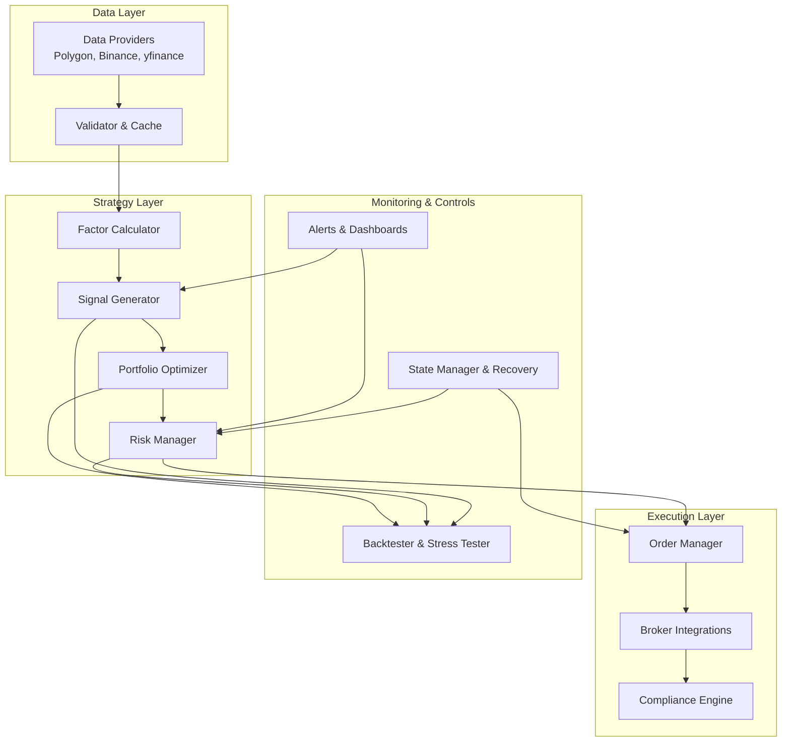
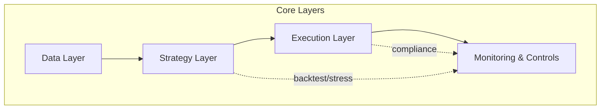
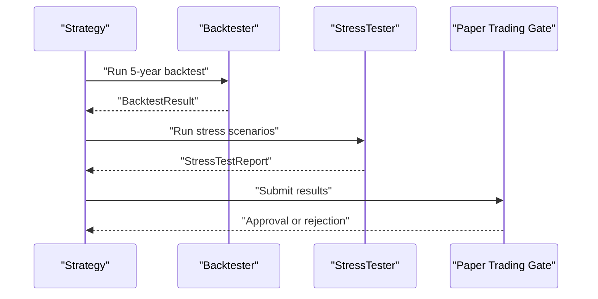
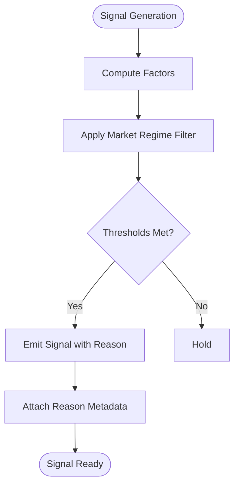
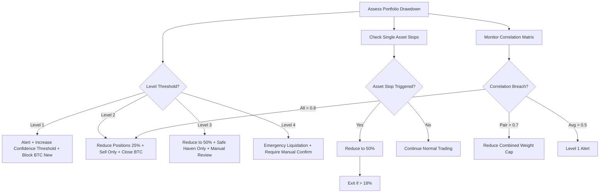
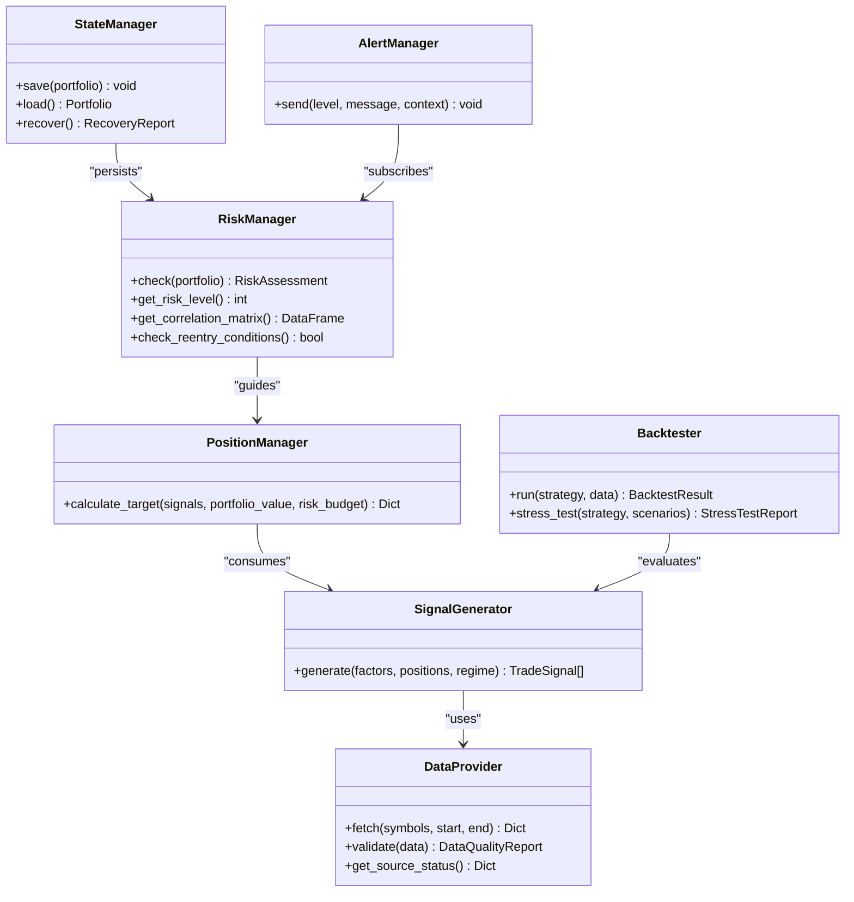
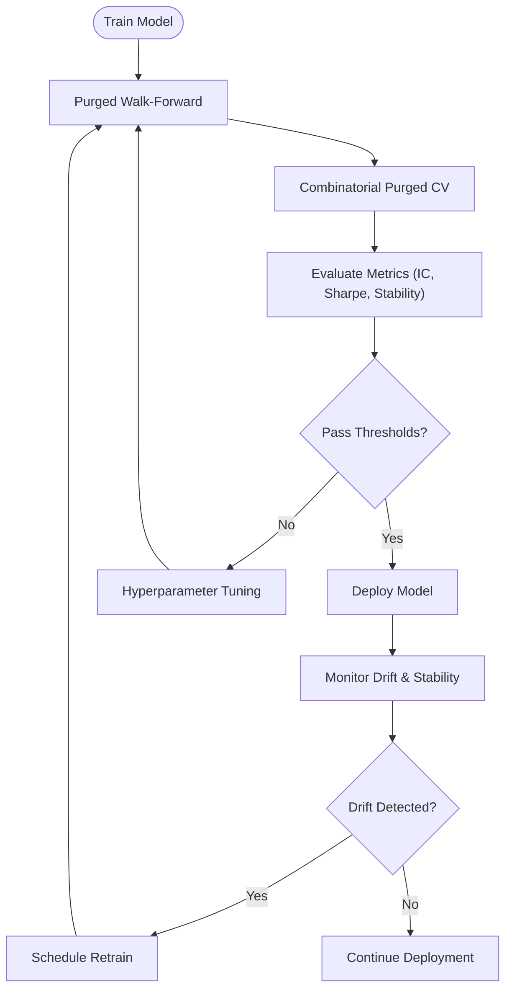
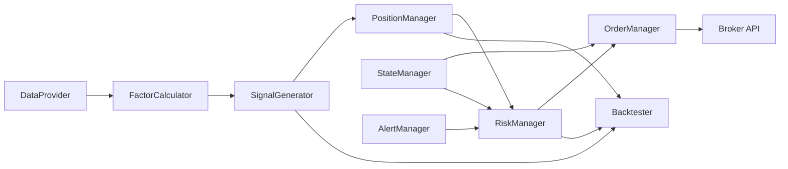

# Design Principles

<cite>
**Referenced Files in This Document**
- [PRD_Intelligent_Trading_System_v2.md](file://PRD_Intelligent_Trading_System_v2.md)
- [Tech_Design_Document.md](file://Tech_Design_Document.md)
</cite>

## Table of Contents
1. [Introduction](#introduction)
2. [Project Structure](#project-structure)
3. [Core Components](#core-components)
4. [Architecture Overview](#architecture-overview)
5. [Detailed Component Analysis](#detailed-component-analysis)
6. [Dependency Analysis](#dependency-analysis)
7. [Performance Considerations](#performance-considerations)
8. [Troubleshooting Guide](#troubleshooting-guide)
9. [Conclusion](#conclusion)
10. [Appendices](#appendices)

## Introduction
This document explains the five core design principles that underpin the Intelligent Trading Decision System, and how each principle addresses specific challenges in quantitative trading. It connects each principle to concrete system architecture, development workflows, and operational procedures, and demonstrates how these principles balance innovation with risk management.

## Project Structure
The system is organized into layered modules that support iterative development across four phases: basic factor strategies, cross-sectional momentum and carry, machine learning enhancement, and NLP sentiment integration. The PRD and Tech Design documents define the modular architecture, explicit interfaces, and operational gates that enforce rigor and robustness.

**Diagram sources**
- [Tech_Design_Document.md](file://Tech_Design_Document.md#L38-L117)
- [PRD_Intelligent_Trading_System_v2.md](file://PRD_Intelligent_Trading_System_v2.md#L77-L106)

**Section sources**
- [Tech_Design_Document.md](file://Tech_Design_Document.md#L34-L117)
- [PRD_Intelligent_Trading_System_v2.md](file://PRD_Intelligent_Trading_System_v2.md#L77-L106)

## Core Components
- Data providers with multi-source fallback and validation
- Factor calculators and signal generators with regime-aware logic
- Portfolio optimizer and risk manager with hierarchical controls
- Execution engine with compliance and order routing
- Backtesting and stress testing framework
- State persistence and disaster recovery
- Alerting and dashboards

These components are defined by explicit interfaces and documented workflows that ensure traceability, repeatability, and safety.

**Section sources**
- [Tech_Design_Document.md](file://Tech_Design_Document.md#L1369-L1483)
- [PRD_Intelligent_Trading_System_v2.md](file://PRD_Intelligent_Trading_System_v2.md#L418-L455)

## Architecture Overview
The system follows a layered architecture with clear separation of concerns:
- Data ingestion and validation
- Factor computation and signal generation
- Portfolio optimization and risk control
- Execution and compliance
- Monitoring, backtesting, and recovery

**Diagram sources**
- [Tech_Design_Document.md](file://Tech_Design_Document.md#L36-L86)

**Section sources**
- [Tech_Design_Document.md](file://Tech_Design_Document.md#L34-L86)

## Detailed Component Analysis

### Principle 1: Engineering-first approach with rigorous backtesting requirements
- Challenge: Over-optimism and false discovery in strategy development
- Solution: Mandatory multi-scenario backtests and stress tests; unified backtesting framework; explicit pass/fail criteria
- Practical implications:
  - Backtesting pipeline validates Sharpe, drawdown, turnover, and cost drag
  - Stress tests simulate severe macro regimes and synthetic scenarios
  - Gates require passing all scenarios before paper trading and before live deployment
- Technical decisions:
  - Backtrader as the sole backtesting framework
  - Purged Walk-Forward and Combinatorial Purged Cross-Validation for ML strategies
  - Paper trading gates with minimum duration and performance thresholds
- Operational procedures:
  - Daily data refresh windows and latency targets
  - Automated recovery and state persistence to minimize operational risk

**Diagram sources**
- [Tech_Design_Document.md](file://Tech_Design_Document.md#L890-L930)
- [PRD_Intelligent_Trading_System_v2.md](file://PRD_Intelligent_Trading_System_v2.md#L334-L362)
- [Tech_Design_Document.md](file://Tech_Design_Document.md#L1115-L1166)

**Section sources**
- [PRD_Intelligent_Trading_System_v2.md](file://PRD_Intelligent_Trading_System_v2.md#L334-L362)
- [Tech_Design_Document.md](file://Tech_Design_Document.md#L890-L930)
- [Tech_Design_Document.md](file://Tech_Design_Document.md#L1115-L1166)

### Principle 2: Explainability for all trading decisions
- Challenge: Black-box strategies reduce trust, increase risk, and complicate compliance
- Solution: Every signal includes reason metadata; factor-driven logic; SHAP-based interpretability for ML
- Practical implications:
  - Signals include reason text and market regime
  - Factor definitions and thresholds are documented and configurable
  - ML predictions include SHAP values and feature contributions
- Technical decisions:
  - Signal data model captures reason and confidence
  - Factor calculator exposes explicit factor computations
  - Model monitor tracks feature importance and prediction drift
- Operational procedures:
  - Audit trails for signals and trades
  - Dashboard displays reasons and risk indicators

**Diagram sources**
- [Tech_Design_Document.md](file://Tech_Design_Document.md#L317-L350)
- [PRD_Intelligent_Trading_System_v2.md](file://PRD_Intelligent_Trading_System_v2.md#L220-L245)

**Section sources**
- [Tech_Design_Document.md](file://Tech_Design_Document.md#L934-L997)
- [PRD_Intelligent_Trading_System_v2.md](file://PRD_Intelligent_Trading_System_v2.md#L220-L245)

### Principle 3: Multi-layered risk control with progressive de-risking
- Challenge: Single-stop-loss approaches can be too abrupt and fail to adapt to evolving conditions
- Solution: Hierarchical risk control with four levels and re-entry logic; correlation monitoring; intra-day constraints
- Practical implications:
  - Level 1–4 triggers reduce positions progressively; Level 4 requires manual review
  - Re-entry rules enforce gradual ramp-up and lower leverage during recovery
  - Correlation thresholds automatically adjust exposure during co-movements
- Technical decisions:
  - Risk manager computes drawdown and correlation matrices
  - Re-entry manager enforces cooldown and ramp schedules
  - Intra-day limits on trades, turnover, and volatility
- Operational procedures:
  - Automated alerts at each level
  - Manual override gates for Level 4
  - Recovery procedures reconcile with broker state

**Diagram sources**
- [Tech_Design_Document.md](file://Tech_Design_Document.md#L352-L404)
- [Tech_Design_Document.md](file://Tech_Design_Document.md#L406-L437)
- [Tech_Design_Document.md](file://Tech_Design_Document.md#L439-L471)
- [PRD_Intelligent_Trading_System_v2.md](file://PRD_Intelligent_Trading_System_v2.md#L288-L332)

**Section sources**
- [Tech_Design_Document.md](file://Tech_Design_Document.md#L352-L471)
- [PRD_Intelligent_Trading_System_v2.md](file://PRD_Intelligent_Trading_System_v2.md#L288-L332)

### Principle 4: Extensibility for seamless new asset and strategy integration
- Challenge: Rapid evolution of strategies and assets requires flexible architecture
- Solution: Plugin-style interfaces, standardized adapters, and modular components
- Practical implications:
  - Strategy plugins and data adapters enable adding new assets and strategies
  - ML model registry supports versioned deployments
  - Risk modules are configurable and pluggable
- Technical decisions:
  - Core interfaces define contracts for data providers, signal generators, position managers, risk managers, backtester, state manager, and alert manager
  - Project structure organizes modules by domain (data, factors, signals, portfolio, execution, risk, backtest, ml, nlp, state, alerts)
  - Docker-based containerization supports incremental rollout
- Operational procedures:
  - CI/CD pipeline validates code quality, unit/integration/system tests, and security scanning
  - Paper trading gates ensure validated rollouts

**Diagram sources**
- [Tech_Design_Document.md](file://Tech_Design_Document.md#L1369-L1483)
- [PRD_Intelligent_Trading_System_v2.md](file://PRD_Intelligent_Trading_System_v2.md#L418-L455)

**Section sources**
- [Tech_Design_Document.md](file://Tech_Design_Document.md#L1369-L1483)
- [Tech_Design_Document.md](file://Tech_Design_Document.md#L1006-L1112)

### Principle 5: Anti-overfitting measures for ML strategies
- Challenge: ML models often overfit training data and fail in out-of-sample environments
- Solution: Robust validation, purged walk-forward, CPCV, and continuous monitoring
- Practical implications:
  - Purge gaps and embargo periods prevent label leakage
  - Model lifecycle management includes retraining triggers and retirement criteria
  - Concept drift detection and feature importance monitoring guard against degradation
- Technical decisions:
  - ML trainer implements CPCV with purge gap and embargo
  - Model lifecycle manager schedules retraining and validates improvements
  - Model monitor tracks IC decay, feature drift, and prediction distribution shifts
- Operational procedures:
  - Minimum IC thresholds and stability checks before deployment
  - Automated retirement when performance degrades

**Diagram sources**
- [Tech_Design_Document.md](file://Tech_Design_Document.md#L501-L524)
- [Tech_Design_Document.md](file://Tech_Design_Document.md#L526-L573)
- [PRD_Intelligent_Trading_System_v2.md](file://PRD_Intelligent_Trading_System_v2.md#L636-L687)

**Section sources**
- [Tech_Design_Document.md](file://Tech_Design_Document.md#L501-L573)
- [PRD_Intelligent_Trading_System_v2.md](file://PRD_Intelligent_Trading_System_v2.md#L636-L687)

## Dependency Analysis
The system’s design emphasizes low coupling and high cohesion:
- Modules depend on interfaces rather than concrete implementations
- Data flows are explicit and validated at each stage
- Risk and compliance are embedded rather than bolted-on

**Diagram sources**
- [Tech_Design_Document.md](file://Tech_Design_Document.md#L1369-L1483)

**Section sources**
- [Tech_Design_Document.md](file://Tech_Design_Document.md#L1369-L1483)

## Performance Considerations
- Strategy performance targets include Sharpe, volatility, drawdown, win rate, profit factor, turnover, and cost drag
- System performance targets include signal latency, backtest speed, memory usage, recovery time, and data refresh windows
- Scalability considerations include horizontal scaling, microservices, message queues, and caching layers

**Section sources**
- [Tech_Design_Document.md](file://Tech_Design_Document.md#L1075-L1111)

## Troubleshooting Guide
- Data quality issues: Multi-source validation and automated alerts
- System downtime: Automated recovery, health checks, and state persistence
- Model overfitting: CPCV, out-of-sample testing, and drift detection
- Regulatory violations: Compliance engine and audit trails
- Operational risks: Paper trading gates, manual review gates, and incident response procedures

**Section sources**
- [Tech_Design_Document.md](file://Tech_Design_Document.md#L1313-L1334)
- [Tech_Design_Document.md](file://Tech_Design_Document.md#L835-L888)

## Conclusion
The five design principles—engineering-first rigor, explainability, multi-layered risk control, extensibility, and anti-overfitting—form a cohesive foundation that balances innovation with robustness. They are reflected in the architecture, interfaces, validation gates, and operational procedures, ensuring the system evolves safely from research to production while maintaining risk discipline and transparency.

## Appendices
- Configuration examples for strategy, risk, and alerts
- Data models and database schema
- Deployment architecture and CI/CD pipeline

**Section sources**
- [PRD_Intelligent_Trading_System_v2.md](file://PRD_Intelligent_Trading_System_v2.md#L1225-L1323)
- [Tech_Design_Document.md](file://Tech_Design_Document.md#L934-L1045)
- [Tech_Design_Document.md](file://Tech_Design_Document.md#L1170-L1230)