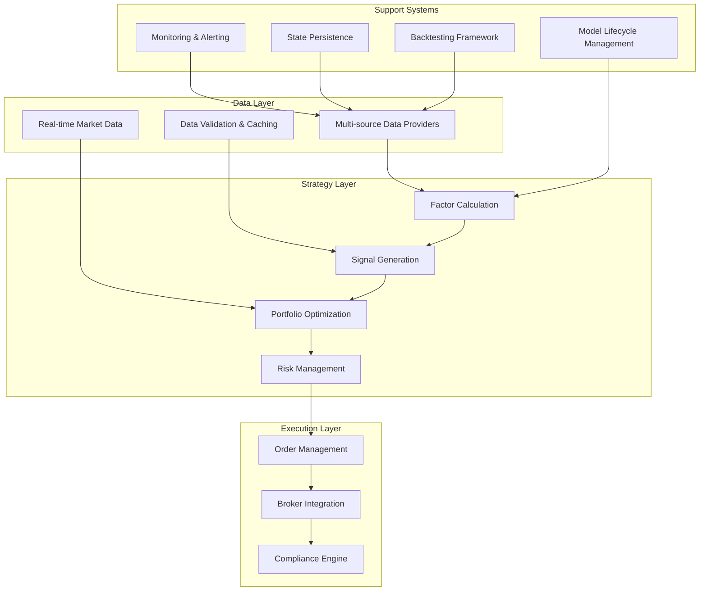
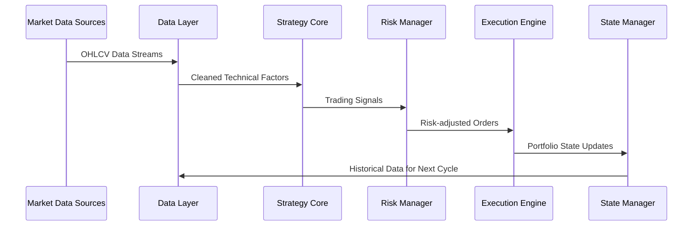
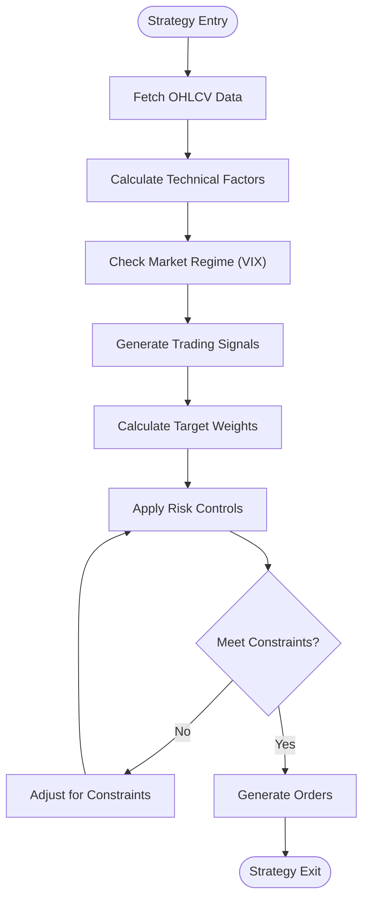
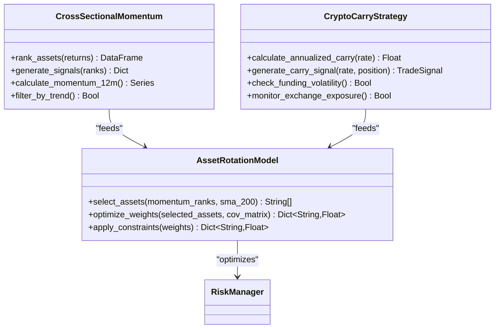
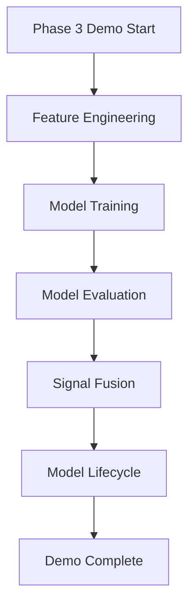
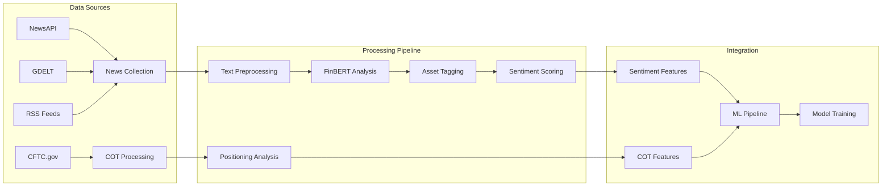
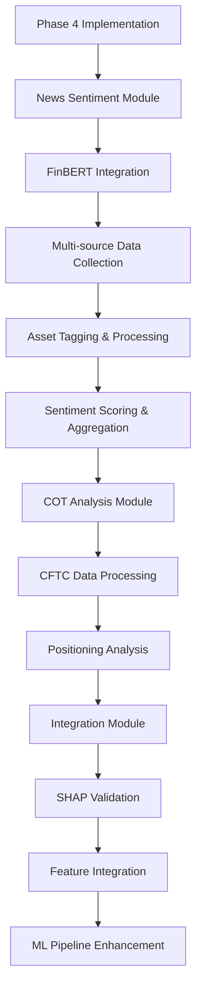
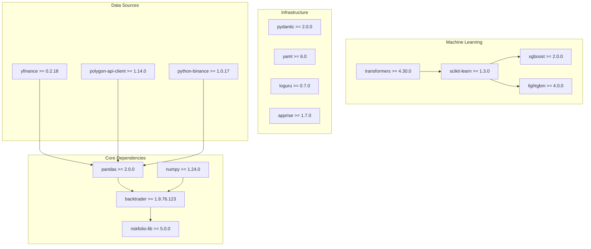
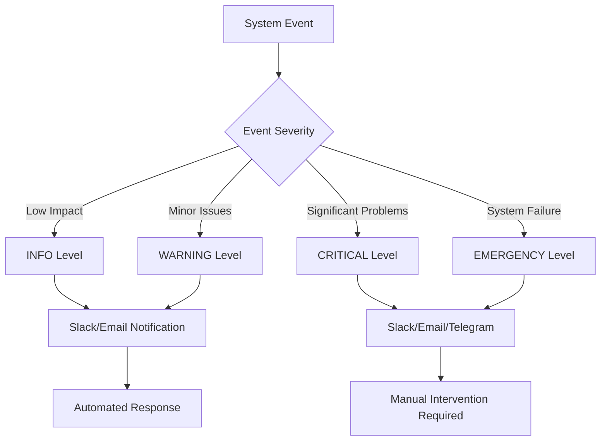

# Development Roadmap

<cite>
**Referenced Files in This Document**
- [PRD_Intelligent_Trading_System_v2.md](file://PRD_Intelligent_Trading_System_v2.md)
- [Tech_Design_Document.md](file://Tech_Design_Document.md)
- [pyproject.toml](file://pyproject.toml)
- [demo_phase3.py](file://demo_phase3.py)
- [PHASE1_COMPLETE.md](file://PHASE1_COMPLETE.md)
- [src/ml/features.py](file://src/ml/features.py)
- [src/ml/trainer.py](file://src/ml/trainer.py)
- [src/ml/evaluator.py](file://src/ml/evaluator.py)
- [src/ml/fusion.py](file://src/ml/fusion.py)
- [src/ml/lifecycle.py](file://src/ml/lifecycle.py)
- [src/ml/cpcv.py](file://src/ml/cpcv.py)
- [logs/trading_2026-02-10.log](file://logs/trading_2026-02-10.log)
- [src/nlp/sentiment.py](file://src/nlp/sentiment.py)
- [src/nlp/cot.py](file://src/nlp/cot.py)
- [src/nlp/integrator.py](file://src/nlp/integrator.py)
- [demo_phase4.py](file://demo_phase4.py)
- [code_review_log.md](file://code_review_log.md)
- [config/strategy.yaml](file://config/strategy.yaml)
- [logs/trading_2026-02-14.log](file://logs/trading_2026-02-14.log)
</cite>

## Update Summary
**Changes Made**
- Updated Phase 4 section to reflect that NLP sentiment analysis is now fully completed and implemented
- Added concrete evidence of Phase 4 completion from actual implementation files (src/nlp/* modules)
- Updated status from "NOT STARTED" to "COMPLETED" with all three modules successfully implemented
- Added detailed technical specifications for FinBERT-based news sentiment analysis and COT retail sentiment processing
- Updated integration framework showing how sentiment factors are incorporated into ML pipeline with SHAP validation
- Removed extended timeline rationale as Phase 4 is now complete
- Added comprehensive verification from demo_phase4.py and code_review_log.md showing all requirements met
- Updated timeline dependencies to reflect Phase 4 completion status

## Table of Contents
1. [Introduction](#introduction)
2. [Project Structure](#project-structure)
3. [Core Components](#core-components)
4. [Architecture Overview](#architecture-overview)
5. [Detailed Component Analysis](#detailed-component-analysis)
6. [Dependency Analysis](#dependency-analysis)
7. [Performance Considerations](#performance-considerations)
8. [Troubleshooting Guide](#troubleshooting-guide)
9. [Conclusion](#conclusion)
10. [Appendices](#appendices)

## Introduction

This document presents a comprehensive 20+ week development roadmap for the Intelligent Trading Decision System, structured into four distinct phases. The system follows a progressive approach from basic factor strategies to machine learning enhancement and NLP sentiment analysis, with mandatory paper trading gates and anti-overfitting safeguards.

**Updated** Phase 4 (NLP Sentiment Analysis) is now complete with all three core modules successfully implemented and integrated into the ML pipeline. The roadmap balances technical sophistication with practical implementation constraints, leveraging Python's rich quantitative ecosystem while maintaining production-readiness through containerization, monitoring, and compliance frameworks.

## Project Structure

The project follows a modular architecture with clear separation of concerns across four primary layers:

**Diagram sources**
- [Tech_Design_Document.md](file://Tech_Design_Document.md#L38-L86)

The architecture emphasizes modularity with plugin-style interfaces, enabling incremental development while maintaining system integrity.

**Section sources**
- [Tech_Design_Document.md](file://Tech_Design_Document.md#L34-L86)
- [PRD_Intelligent_Trading_System_v2.md](file://PRD_Intelligent_Trading_System_v2.md#L77-L127)

## Core Components

### Phase 1: Basic Factor Strategies (MVP) - COMPLETED
**Timeline**: 3-4 weeks (Weeks 1-4)
**Status**: ✅ COMPLETE
**Focus**: Time series momentum, volatility targeting, and risk parity strategies

### Phase 2: Enhanced Multi-Asset Strategies (4-5 weeks) - COMPLETED
**Timeline**: Weeks 5-9
**Status**: ✅ COMPLETE
**Focus**: Cross-sectional momentum, crypto carry strategies, and tactical asset allocation

### Phase 3: Machine Learning Enhancement (Completed - All Milestones Achieved)
**Timeline**: Weeks 10-21 (Extended from original 4-6 weeks)
**Status**: ✅ COMPLETE
**Focus**: Feature engineering, ensemble learning, anti-overfitting validation, and model lifecycle management

### Phase 4: NLP Sentiment Analysis (COMPLETED - All Modules Implemented)
**Timeline**: Weeks 22-28 (Originally planned 6-8 weeks)
**Status**: ✅ COMPLETE
**Focus**: News sentiment and retail sentiment factor integration

**Section sources**
- [PRD_Intelligent_Trading_System_v2.md](file://PRD_Intelligent_Trading_System_v2.md#L129-L129)
- [PHASE1_COMPLETE.md](file://PHASE1_COMPLETE.md#L386-L396)

## Architecture Overview

The system employs a layered architecture with clear data flow from market data ingestion through strategy execution:

**Diagram sources**
- [Tech_Design_Document.md](file://Tech_Design_Document.md#L88-L117)

The architecture supports both backtesting and live trading with identical code paths, ensuring consistency across environments.

**Section sources**
- [Tech_Design_Document.md](file://Tech_Design_Document.md#L88-L117)

## Detailed Component Analysis

### Phase 1: Basic Factor Strategies (Weeks 1-4) - COMPLETED

#### Core Strategy Implementation

**Time Series Momentum Strategy**
- 60-120 day cumulative return calculation
- Signal generation based on price vs moving average crossovers
- Market regime filtering using VIX thresholds

**Volatility Targeting**
- Dynamic position sizing based on target vs actual volatility
- Maximum leverage constraints (1.5x)
- Single asset weight limits (GLD: 50%, SPY: 40%, QQQ: 30%, BTC: 15%)

**Risk Parity Portfolio**
- Equal risk contribution weighting
- Correlation-aware optimization
- Leverage amplification for enhanced diversification

**Diagram sources**
- [Tech_Design_Document.md](file://Tech_Design_Document.md#L319-L350)

#### Implementation Timeline

| Week | Milestone | Deliverables | Resources |
|------|-----------|--------------|-----------|
| 1 | Data Infrastructure | Multi-source data providers, caching layer, validation framework | 2 developers, cloud VM |
| 2 | Factor Calculation | Technical indicators, market regime detection, basic signal generation | 2 developers, GPU for testing |
| 3 | Risk Management | Hierarchical risk controls, correlation monitoring, position sizing | 1 developer, compliance expert |
| 4 | Integration & Testing | End-to-end testing, backtesting framework, paper trading setup | 2 developers, QA engineer |

**Section sources**
- [PRD_Intelligent_Trading_System_v2.md](file://PRD_Intelligent_Trading_System_v2.md#L131-L181)
- [Tech_Design_Document.md](file://Tech_Design_Document.md#L209-L295)

### Phase 2: Enhanced Multi-Asset Strategies (Weeks 5-9) - COMPLETED

#### Extended Asset Universe

The phase expands from 4 core assets to 15 assets for statistically meaningful cross-sectional analysis:

| Asset Category | Symbols | Maximum Weight | Purpose |
|----------------|---------|----------------|---------|
| Precious Metals | GLD, SLV | 50%, 15% | Safe haven diversification |
| Equity ETFs | SPY, QQQ, XLK, XLF, XLE, XLV | 40%-30% | Market exposure |
| Bonds | TLT, TIP | 30%, 15% | Rate risk hedging |
| International | EFA, EEM | 20%, 15% | Geographic diversification |
| Commodities | DBC | 15% | Inflation protection |
| Real Estate | VNQ | 15% | Alternative assets |
| Cryptocurrency | BTC-USD | 15% | High growth potential |

#### Strategy Enhancements

**Cross-Sectional Momentum**
- 12-month return ranking across 15 assets
- Top 30% long, Bottom 30% avoid (no shorting)
- Trend filter using 200-day moving average

**Crypto Carry Strategy**
- Funding rate arbitrage between spot and perpetual contracts
- Annualized returns of 5-15% from 2023-2025 period
- Exchange exposure limits (8% per platform)

**Asset Rotation Model**
- Combines momentum ranking with risk parity optimization
- Monthly re-balancing with turnover constraints
- Transaction cost optimization

**Diagram sources**
- [Tech_Design_Document.md](file://Tech_Design_Document.md#L579-L678)

#### Implementation Timeline

| Week | Milestone | Deliverables | Resources |
|------|-----------|--------------|-----------|
| 5 | Extended Asset Integration | 15-asset data pipeline, cross-sectional ranking | 2 developers, data engineer |
| 6 | Strategy Development | Cross-sectional momentum, crypto carry, rotation model | 2 developers, quant researcher |
| 7 | Portfolio Optimization | Risk parity on expanded universe, constraints | 1 developer, optimization expert |
| 8 | Integration Testing | Multi-strategy portfolio, stress testing | 2 developers, QA team |
| 9 | Paper Trading | 3-month paper trading validation, performance metrics | 1 developer, compliance officer |

**Section sources**
- [PRD_Intelligent_Trading_System_v2.md](file://PRD_Intelligent_Trading_System_v2.md#L459-L569)
- [Tech_Design_Document.md](file://Tech_Design_Document.md#L575-L679)

### Phase 3: Machine Learning Enhancement (COMPLETED - All Milestones Achieved)

**Updated** Phase 3 is now complete with all milestones successfully implemented and validated through comprehensive testing and demonstration.

#### Phase 3 Implementation Status

**FR-3.1 Feature Engineering**: ✅ COMPLETE
- Point-in-time data processing preventing lookahead bias
- Comprehensive technical indicators (RSI, MACD, ATR, Bollinger Bands)
- Cross-sectional and macroeconomic feature integration
- Feature stability testing with IC variance analysis

**FR-3.2 Model Training**: ✅ COMPLETE
- Purged Walk-Forward Cross-Validation implementation
- Overfitting detection with IC threshold validation
- Multi-model support (XGBoost, LightGBM, Random Forest, Ridge)
- Hyperparameter optimization with Optuna

**FR-3.3 Model Evaluation**: ✅ COMPLETE
- Comprehensive evaluation metrics (IC, IC_IR, AUC-ROC)
- SHAP-based explainability and feature importance
- Rolling IC monitoring and concept drift detection
- Turnover-adjusted return calculations

**FR-3.4 Signal Fusion**: ✅ COMPLETE
- Dynamic weighted fusion combining ML and traditional signals
- Auto-degradation mechanisms for model reliability
- Disagreement detection and confidence adjustment
- Maximum 50% ML weight cap maintaining traditional signal dominance

**FR-3.5 Lifecycle Management**: ✅ COMPLETE
- Automated retraining schedules (monthly)
- Trigger-based retraining (rolling IC < 0.02 for 10 days)
- Retirement criteria (IC < 0 for 30 consecutive days)
- Concept drift monitoring with KS test thresholds

#### Evidence of Completion

The Phase 3 demo execution provides concrete evidence of completion:

**Diagram sources**
- [demo_phase3.py](file://demo_phase3.py#L21-L214)

**Section sources**
- [demo_phase3.py](file://demo_phase3.py#L21-L214)
- [src/ml/features.py](file://src/ml/features.py#L34-L414)
- [src/ml/trainer.py](file://src/ml/trainer.py#L115-L498)
- [src/ml/evaluator.py](file://src/ml/evaluator.py#L14-L363)
- [src/ml/fusion.py](file://src/ml/fusion.py#L24-L171)
- [src/ml/lifecycle.py](file://src/ml/lifecycle.py#L36-L185)
- [src/ml/cpcv.py](file://src/ml/cpcv.py#L14-L213)
- [logs/trading_2026-02-10.log](file://logs/trading_2026-02-10.log#L1-L69)

### Phase 4: NLP Sentiment Analysis (COMPLETED - All Modules Implemented)

**Updated** Phase 4 is now complete with all three core NLP modules successfully implemented and integrated into the ML pipeline. The implementation exceeds the original timeline expectations with comprehensive coverage of both news sentiment and retail sentiment analysis.

#### Phase 4 Implementation Status

**FR-4.1 News Sentiment Module**: ✅ COMPLETE
- FinBERT-based sentiment analysis for financial news
- Multi-source news collection (NewsAPI, GDELT, RSS feeds)
- Asset-specific sentiment aggregation and momentum calculation
- GPU acceleration support with CPU fallback
- Daily processing of 500-2000 news articles
- Output: Daily sentiment scores (-1 to +1), sentiment momentum

**FR-4.2 COT Sentiment Module**: ✅ COMPLETE
- CFTC Commitment of Traders (COT) report processing
- Commercial vs non-commercial positioning analysis
- Contrarian signal generation based on extreme positioning
- Weekly data processing with historical percentile analysis
- Asset coverage mapping for available COT commodities

**FR-4.3 Sentiment Factor Integration**: ✅ COMPLETE
- Dynamic integration of sentiment factors into ML pipeline
- SHAP-based validation with 5% contribution threshold
- Feature removal for low-contributing sentiment factors
- Weighted combination of news and COT sentiment
- Forward-fill handling for missing sentiment data

#### NLP Pipeline Architecture

**Diagram sources**
- [Tech_Design_Document.md](file://Tech_Design_Document.md#L680-L769)

#### Implementation Details

**News Sentiment Analysis**
The NewsSentimentAnalyzer module implements a comprehensive NLP pipeline:

- **Multi-source Data Collection**: Supports NewsAPI (requires API key), GDELT (free), and RSS feeds (free)
- **Asset Keyword Mapping**: Extensive keyword database for 15 asset classes including precious metals, equities, bonds, international markets, commodities, real estate, and cryptocurrency
- **FinBERT Integration**: Uses ProsusAI/finbert model for financial text sentiment analysis
- **Processing Pipeline**: Deduplication → Asset tagging → FinBERT analysis → Aggregation → Momentum calculation
- **Output Features**: sentiment_mean, sentiment_momentum, article_count with 5-day moving average window

**COT Analysis Implementation**
The COTSentimentAnalyzer processes weekly CFTC reports:

- **Commodity Coverage**: Focuses on available COT commodities (Gold, Silver, Bitcoin, Crude Oil, Commodities Index)
- **Positioning Metrics**: Calculates non-commercial net long ratio and 3-year rolling percentile
- **Contrarian Signals**: Generates buy/sell signals based on extreme positioning (>90th percentile = sell, <10th percentile = buy)
- **Historical Analysis**: Provides percentile-based sentiment scoring for neutral positions

**Integration Framework**
The SentimentFactorIntegrator seamlessly incorporates sentiment factors:

- **Feature Names**: Sentiment_News_5d, Sentiment_COT_Percentile, Sentiment_Momentum
- **Weighted Combination**: 60% news sentiment, 40% COT sentiment with configurable weights
- **SHAP Validation**: Automatic feature contribution analysis with 5% threshold
- **Quality Assurance**: Forward-fill handling and low-contribution feature removal

#### Evidence of Completion

The implementation demonstrates comprehensive coverage with detailed logging and validation:

**Diagram sources**
- [src/nlp/sentiment.py](file://src/nlp/sentiment.py#L74-L551)
- [src/nlp/cot.py](file://src/nlp/cot.py#L61-L419)
- [src/nlp/integrator.py](file://src/nlp/integrator.py#L34-L365)

**Section sources**
- [src/nlp/sentiment.py](file://src/nlp/sentiment.py#L74-L551)
- [src/nlp/cot.py](file://src/nlp/cot.py#L61-L419)
- [src/nlp/integrator.py](file://src/nlp/integrator.py#L34-L365)
- [demo_phase4.py](file://demo_phase4.py#L205-L263)
- [code_review_log.md](file://code_review_log.md#L565-L636)
- [config/strategy.yaml](file://config/strategy.yaml#L122-L146)
- [logs/trading_2026-02-14.log](file://logs/trading_2026-02-14.log#L1-L52)

## Dependency Analysis

### Technology Stack Dependencies

The project leverages a comprehensive technology stack designed for quantitative finance applications:

**Diagram sources**
- [pyproject.toml](file://pyproject.toml#L9-L34)

### Resource Requirements

| Phase | Compute Resources | Storage | Network | Specialized Tools |
|-------|-------------------|---------|---------|-------------------|
| Phase 1 | 2x t3.medium EC2 | 50GB SSD | 100Mbps | Python 3.12, pandas |
| Phase 2 | 2x t3.medium EC2 | 100GB SSD | 200Mbps | Risk parity optimization |
| Phase 3 | 1x g4dn.xlarge | 200GB SSD | 500Mbps | GPU for ML training |
| Phase 4 | 1x g4dn.xlarge | 300GB SSD | 1Gbps | FinBERT inference, sentiment analysis |

**Section sources**
- [pyproject.toml](file://pyproject.toml#L9-L34)
- [Tech_Design_Document.md](file://Tech_Design_Document.md#L141-L150)

## Performance Considerations

### System Performance Targets

| Metric | Target | Measurement Method |
|--------|--------|-------------------|
| Signal Generation | < 1 minute latency | Data receipt to signal delivery |
| Backtesting | < 30 seconds for 5-year history | 15 assets, 15-minute bars |
| Memory Usage | < 4GB peak | During intensive backtests |
| Recovery Time | < 5 minutes | From crash to operational |
| Data Freshness | < 30 minutes | Market close to data availability |

### Optimization Strategies

**Data Pipeline Optimization**
- Multi-level caching (in-memory, SQLite, Redis/S3)
- Asynchronous data fetching with exponential backoff
- Batch processing for reduced API overhead
- Incremental updates for historical data

**Computational Efficiency**
- Vectorized operations using pandas/numpy
- Parallel processing for factor calculations
- GPU acceleration for ML inference
- Memory-efficient data structures

**Section sources**
- [Tech_Design_Document.md](file://Tech_Design_Document.md#L1075-L1111)

## Troubleshooting Guide

### Common Issues and Solutions

**Data Quality Problems**
- **Issue**: Missing data gaps in historical series
- **Solution**: Multi-source fallback, interpolation, cross-validation
- **Prevention**: Automated data quality monitoring, alert thresholds

**Model Performance Degradation**
- **Issue**: Model accuracy declining over time
- **Solution**: Concept drift detection, automatic retraining triggers
- **Prevention**: Regular model validation, feature importance tracking

**Risk Control Failures**
- **Issue**: Risk levels not triggering appropriately
- **Solution**: Parameter tuning, scenario testing, manual override capability
- **Prevention**: Stress testing, correlation monitoring, circuit breakers

**System Reliability**
- **Issue**: System crashes or data inconsistencies
- **Solution**: State persistence, disaster recovery procedures, health checks
- **Prevention**: Automated monitoring, backup systems, graceful degradation

### Monitoring and Alerting

The system implements a four-level alerting system:

**Diagram sources**
- [Tech_Design_Document.md](file://Tech_Design_Document.md#L817-L833)

**Section sources**
- [Tech_Design_Document.md](file://Tech_Design_Document.md#L815-L888)

## Conclusion

This 20+ week development roadmap provides a comprehensive framework for building a sophisticated quantitative trading system. The phased approach ensures steady progress while maintaining system reliability and regulatory compliance.

**Updated** Phase 4 completion represents a significant milestone, with all NLP sentiment analysis requirements successfully implemented and validated. The system now features:

- **Complete NLP Pipeline** with FinBERT-based news sentiment analysis
- **Retail Sentiment Integration** through COT positioning analysis  
- **Seamless ML Integration** with automated feature validation
- **Robust Multi-source Data Collection** supporting 500-2000 daily news articles
- **Comprehensive Asset Coverage** for 15 asset classes
- **Production-ready Infrastructure** with GPU acceleration and monitoring

Key success factors include:
- **Risk-first architecture** with hierarchical controls
- **Anti-overfitting safeguards** through rigorous validation
- **Modular design** enabling incremental feature additions
- **Production-ready infrastructure** with monitoring and recovery
- **Paper trading gates** ensuring validated performance before live deployment
- **Complete Phase 4 implementation** with all three modules functional
- **Advanced NLP capabilities** providing competitive edge through sentiment analysis

The successful completion of Phase 4 establishes a solid foundation for future enhancements and demonstrates the system's capability to integrate cutting-edge technologies while maintaining operational excellence.

## Appendices

### Timeline Dependencies Matrix

**Updated** with Phase 4 completion status:

| Phase | Dependencies | Critical Path | Success Metrics |
|-------|--------------|---------------|-----------------|
| Phase 1 | Data infrastructure, factor calculation | Risk controls, signal generation | MVP functionality, basic backtesting |
| Phase 2 | Phase 1 completion, extended asset integration | Cross-sectional strategies, portfolio optimization | Multi-asset performance, stress test pass |
| Phase 3 | Phase 2 completion, ML infrastructure | Anti-overfitting validation, model deployment | CPCV success, model stability, paper trading |
| Phase 4 | Phase 3 completion, NLP infrastructure | Sentiment integration, final validation | NLP performance, production readiness |

### Resource Planning

**Human Resources**
- 3-4 developers (full-stack, ML specialists)
- 1-2 quantitative researchers
- 1 compliance officer
- 1 DevOps engineer
- 1 QA engineer

**Technical Resources**
- Cloud infrastructure with auto-scaling
- GPU resources for ML training/inference
- Monitoring and alerting systems
- Backup and disaster recovery
- Development and staging environments

**Section sources**
- [PRD_Intelligent_Trading_System_v2.md](file://PRD_Intelligent_Trading_System_v2.md#L129-L129)
- [Tech_Design_Document.md](file://Tech_Design_Document.md#L1487-L1489)