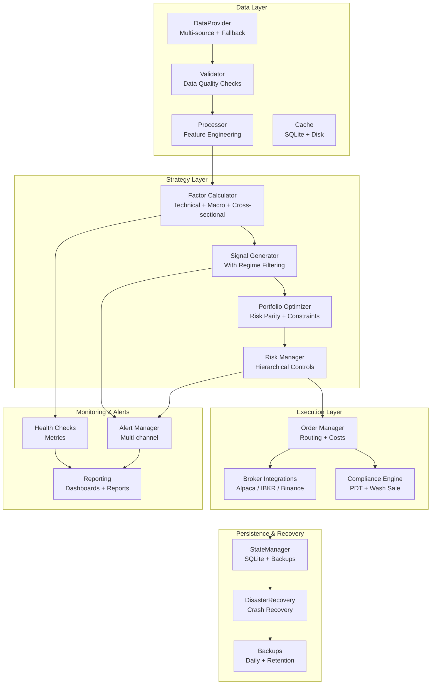
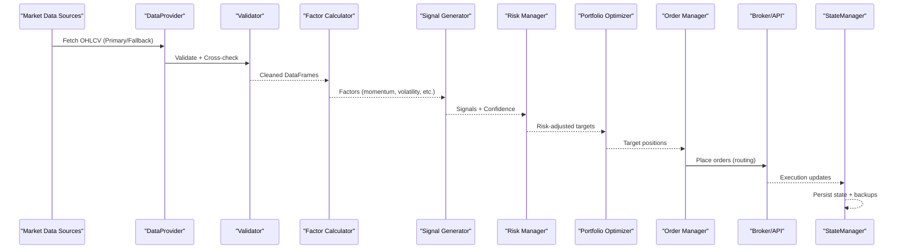
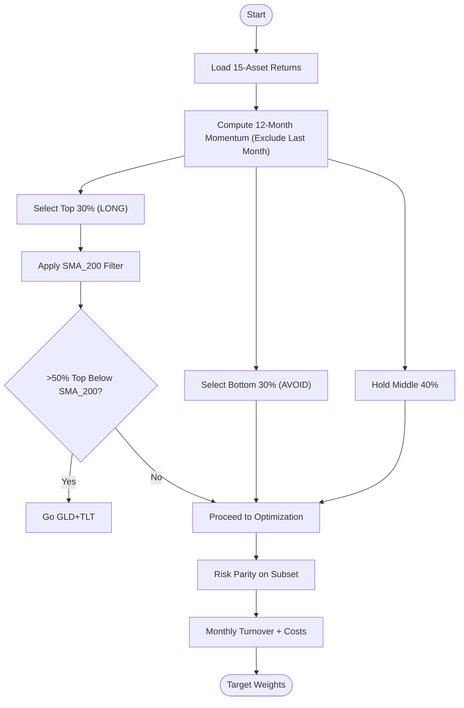
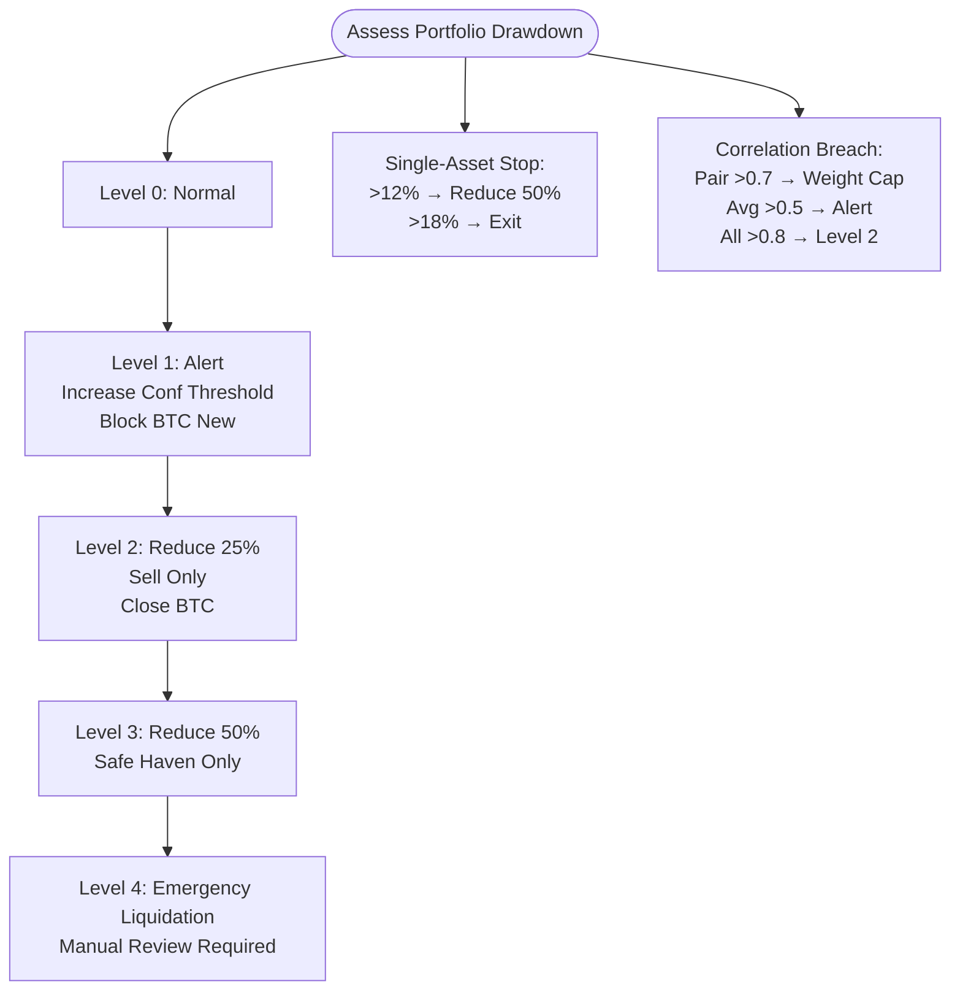
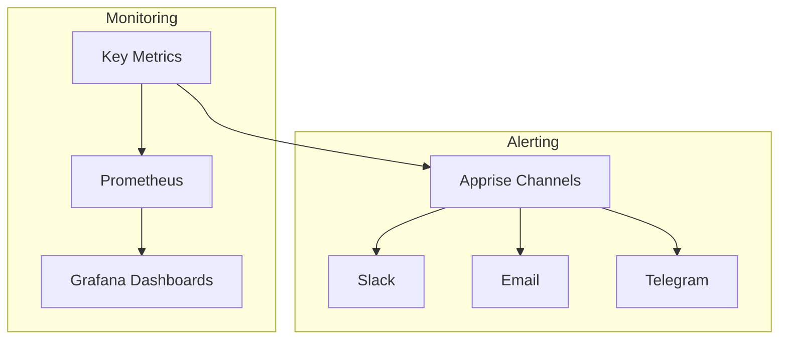
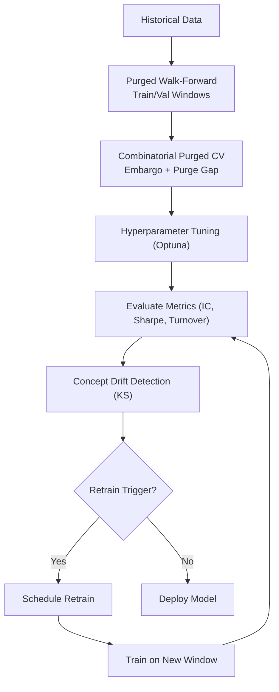
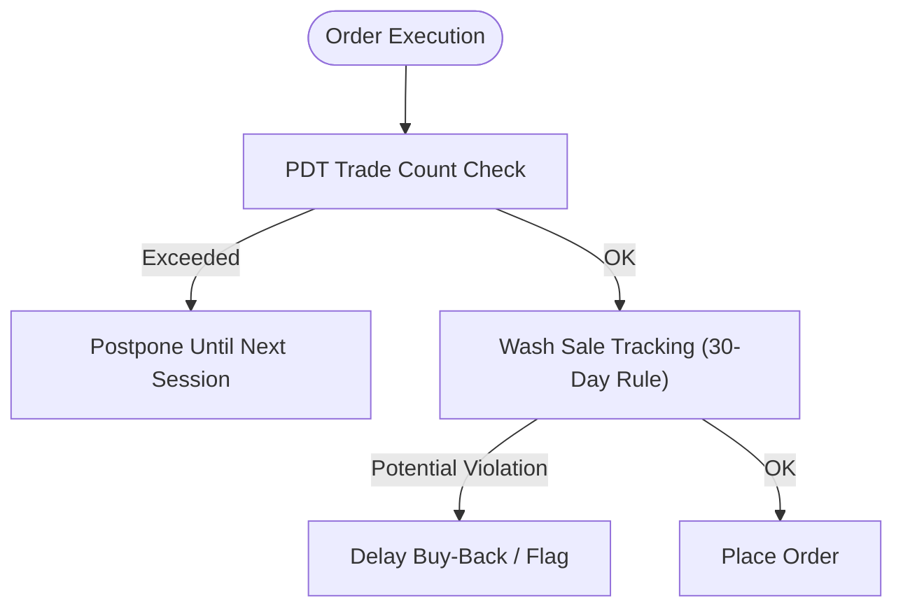
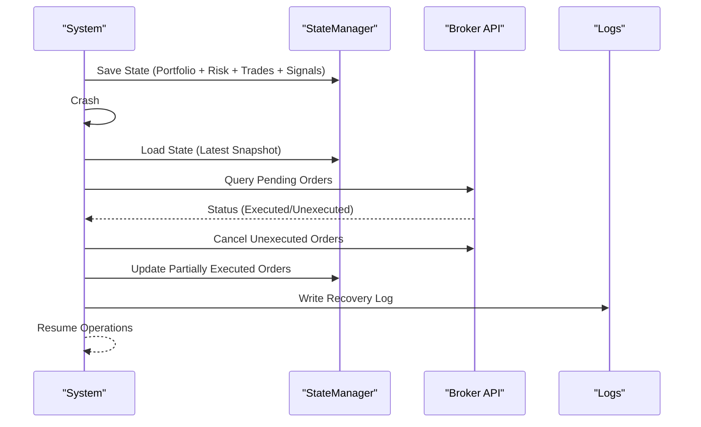
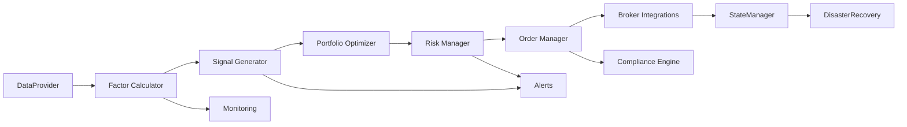

# Key Capabilities

<cite>
**Referenced Files in This Document**
- [PRD_Intelligent_Trading_System_v2.md](file://PRD_Intelligent_Trading_System_v2.md)
- [Tech_Design_Document.md](file://Tech_Design_Document.md)
</cite>

## Table of Contents
1. [Introduction](#introduction)
2. [Project Structure](#project-structure)
3. [Core Components](#core-components)
4. [Architecture Overview](#architecture-overview)
5. [Detailed Component Analysis](#detailed-component-analysis)
6. [Dependency Analysis](#dependency-analysis)
7. [Performance Considerations](#performance-considerations)
8. [Troubleshooting Guide](#troubleshooting-guide)
9. [Conclusion](#conclusion)
10. [Appendices](#appendices)

## Introduction
This document presents the key capabilities and features of the Intelligent Trading Decision System v2.0, focusing on:
- Multi-asset coverage across 15+ instrument classes spanning precious metals, US equity indices, sector ETFs, international ETFs, government bonds, commodities, and cryptocurrencies
- A hierarchical risk management system with four-level progressive de-risking replacing traditional hard stop-losses
- A production-ready architecture supporting paper trading, live trading, and comprehensive monitoring
- A modular design enabling seamless integration of new assets and strategies
- Anti-overfitting measures including Purged Walk-Forward validation and Combinatorial Purged Cross-Validation
- A regulatory compliance framework addressing PDT rules and wash sale prevention
- Disaster recovery and state persistence capabilities ensuring system reliability and data integrity

## Project Structure
The system is organized into a layered architecture with clear separation of concerns across data ingestion, strategy computation, risk management, execution, monitoring/alerting, and compliance/recovery. The modular structure supports iterative development and future extensibility.

**Diagram sources**
- [Tech_Design_Document.md](file://Tech_Design_Document.md#L38-L117)
- [PRD_Intelligent_Trading_System_v2.md](file://PRD_Intelligent_Trading_System_v2.md#L1009-L1112)

**Section sources**
- [Tech_Design_Document.md](file://Tech_Design_Document.md#L34-L117)
- [PRD_Intelligent_Trading_System_v2.md](file://PRD_Intelligent_Trading_System_v2.md#L1006-L1112)

## Core Components
- Multi-asset coverage: The system covers 15+ instrument classes including precious metals (GLD, SLV), US equity indices (SPY, QQQ), sector ETFs (XLK, XLF, XLE, XLV), government bonds (TLT, TIP), international ETFs (EFA, EEM), commodities (DBC), real estate (VNQ), and cryptocurrency (BTC-USD). See [Asset Universe](file://Tech_Design_Document.md#L161-L188) and [Extended Assets](file://PRD_Intelligent_Trading_System_v2.md#L55-L73).
- Hierarchical risk management: Four-level progressive de-risking replaces hard stops, with actions escalating from alerts to emergency liquidation, plus single-asset stops and correlation monitoring. See [Hierarchical Risk Controls](file://Tech_Design_Document.md#L352-L404) and [Risk Controls Details](file://PRD_Intelligent_Trading_System_v2.md#L288-L332).
- Production-ready architecture: Containerized deployment, cron-based scheduling, monitoring with Prometheus/Grafana, and alerting via Slack/Email/Telegram. See [Deployment](file://Tech_Design_Document.md#L141-L151) and [Alert Levels](file://Tech_Design_Document.md#L815-L833).
- Modular design: Plugin-style modules for data providers, factor calculators, signals, portfolio optimization, risk management, ML pipelines, NLP sentiment, state persistence, and compliance. See [Module Diagram](file://Tech_Design_Document.md#L60-L86) and [Project Structure](file://PRD_Intelligent_Trading_System_v2.md#L1009-L1112).
- Anti-overfitting safeguards: Purged Walk-Forward validation and Combinatorial Purged Cross-Validation (CPCV) with embargo and purge gaps. See [Anti-Overfitting Framework](file://PRD_Intelligent_Trading_System_v2.md#L636-L668).
- Regulatory compliance: PDT rule enforcement and wash sale prevention integrated into execution and compliance engines. See [Regulatory Compliance](file://PRD_Intelligent_Trading_System_v2.md#L941-L1002).
- Disaster recovery and state persistence: SQLite-backed state persistence with daily backups, crash recovery, and reconciliation with broker APIs. See [State Persistence](file://Tech_Design_Document.md#L835-L888) and [Recovery Flow](file://Tech_Design_Document.md#L863-L888).

**Section sources**
- [Tech_Design_Document.md](file://Tech_Design_Document.md#L34-L117)
- [PRD_Intelligent_Trading_System_v2.md](file://PRD_Intelligent_Trading_System_v2.md#L55-L73)
- [PRD_Intelligent_Trading_System_v2.md](file://PRD_Intelligent_Trading_System_v2.md#L288-L332)
- [Tech_Design_Document.md](file://Tech_Design_Document.md#L835-L888)
- [PRD_Intelligent_Trading_System_v2.md](file://PRD_Intelligent_Trading_System_v2.md#L941-L1002)
- [PRD_Intelligent_Trading_System_v2.md](file://PRD_Intelligent_Trading_System_v2.md#L636-L668)

## Architecture Overview
The system follows a layered architecture with explicit data flow from market data sources through factor computation, signal generation, portfolio optimization, risk control, order execution, and persistent state management. Monitoring and alerting are integrated throughout, and compliance and recovery are embedded as first-class capabilities.

**Diagram sources**
- [Tech_Design_Document.md](file://Tech_Design_Document.md#L88-L117)
- [Tech_Design_Document.md](file://Tech_Design_Document.md#L209-L248)
- [Tech_Design_Document.md](file://Tech_Design_Document.md#L250-L295)
- [Tech_Design_Document.md](file://Tech_Design_Document.md#L297-L437)
- [Tech_Design_Document.md](file://Tech_Design_Document.md#L771-L797)
- [Tech_Design_Document.md](file://Tech_Design_Document.md#L835-L888)

## Detailed Component Analysis

### Multi-Asset Coverage and Strategy Modules
- Core assets (Phase 1): GLD, SPY, QQQ, BTC-USD with distinct volatility targets and asset-level stops. See [Core Assets](file://Tech_Design_Document.md#L163-L171).
- Extended assets (Phase 2): 15 assets enabling statistically meaningful cross-sectional ranking. See [Extended Assets](file://Tech_Design_Document.md#L172-L188) and [Asset Universe](file://PRD_Intelligent_Trading_System_v2.md#L55-L73).
- Cross-sectional momentum and asset rotation: Momentum ranking across 15 assets, followed by risk parity optimization on selected subsets. See [Cross-Sectional Momentum](file://Tech_Design_Document.md#L575-L608) and [Asset Rotation Model](file://Tech_Design_Document.md#L646-L678).
- Crypto carry strategy: Funding-rate arbitrage using Binance/Bybit perpetuals with exposure caps and volatility pause rules. See [Crypto Carry Strategy](file://Tech_Design_Document.md#L610-L644).

**Diagram sources**
- [Tech_Design_Document.md](file://Tech_Design_Document.md#L575-L608)
- [Tech_Design_Document.md](file://Tech_Design_Document.md#L646-L678)

**Section sources**
- [Tech_Design_Document.md](file://Tech_Design_Document.md#L161-L188)
- [PRD_Intelligent_Trading_System_v2.md](file://PRD_Intelligent_Trading_System_v2.md#L55-L73)
- [Tech_Design_Document.md](file://Tech_Design_Document.md#L575-L608)
- [Tech_Design_Document.md](file://Tech_Design_Document.md#L610-L644)
- [Tech_Design_Document.md](file://Tech_Design_Document.md#L646-L678)

### Hierarchical Risk Management System
- Four-level de-risking escalates from alerts to emergency liquidation, with single-asset stops and correlation monitoring. See [Hierarchical Risk Controls](file://Tech_Design_Document.md#L352-L404) and [Re-Entry Logic](file://Tech_Design_Document.md#L406-L437).
- Correlation monitoring computes rolling 60-day correlation matrices and triggers warnings or auto-controls when thresholds are exceeded. See [Correlation Monitor](file://Tech_Design_Document.md#L439-L471).

**Diagram sources**
- [Tech_Design_Document.md](file://Tech_Design_Document.md#L352-L404)
- [Tech_Design_Document.md](file://Tech_Design_Document.md#L406-L437)
- [Tech_Design_Document.md](file://Tech_Design_Document.md#L439-L471)
- [PRD_Intelligent_Trading_System_v2.md](file://PRD_Intelligent_Trading_System_v2.md#L288-L332)

**Section sources**
- [Tech_Design_Document.md](file://Tech_Design_Document.md#L352-L404)
- [Tech_Design_Document.md](file://Tech_Design_Document.md#L406-L437)
- [Tech_Design_Document.md](file://Tech_Design_Document.md#L439-L471)
- [PRD_Intelligent_Trading_System_v2.md](file://PRD_Intelligent_Trading_System_v2.md#L288-L332)

### Production-Ready Architecture and Monitoring
- Technology stack includes Backtrader, riskfolio-lib, pandas-ta, transformers (FinBERT), loguru, apprise, and containerization with Docker and cron scheduling. See [Technology Stack](file://Tech_Design_Document.md#L121-L151).
- Monitoring and alerting: Prometheus/Grafana dashboards, multi-channel alerts, and health checks. See [Monitoring & Alerting](file://Tech_Design_Document.md#L815-L833).
- Backtesting and stress testing: Comprehensive metrics and scenario validation across crisis periods. See [Backtesting](file://PRD_Intelligent_Trading_System_v2.md#L334-L362) and [Stress Testing Framework](file://Tech_Design_Document.md#L890-L930).

**Diagram sources**
- [Tech_Design_Document.md](file://Tech_Design_Document.md#L141-L151)
- [Tech_Design_Document.md](file://Tech_Design_Document.md#L815-L833)

**Section sources**
- [Tech_Design_Document.md](file://Tech_Design_Document.md#L121-L151)
- [Tech_Design_Document.md](file://Tech_Design_Document.md#L815-L833)
- [PRD_Intelligent_Trading_System_v2.md](file://PRD_Intelligent_Trading_System_v2.md#L334-L362)
- [Tech_Design_Document.md](file://Tech_Design_Document.md#L890-L930)

### Anti-Overfitting Measures and Model Lifecycle
- Purged Walk-Forward validation with purge gap and embargo, complemented by CPCV with minimum 6 folds. See [Model Training Framework](file://Tech_Design_Document.md#L501-L524) and [Anti-Overfitting Framework](file://PRD_Intelligent_Trading_System_v2.md#L636-L668).
- Model lifecycle management includes regular retraining, drift detection via Kolmogorov-Smirnov statistics, and retirement criteria. See [Model Lifecycle Management](file://Tech_Design_Document.md#L526-L573).

**Diagram sources**
- [PRD_Intelligent_Trading_System_v2.md](file://PRD_Intelligent_Trading_System_v2.md#L636-L668)
- [Tech_Design_Document.md](file://Tech_Design_Document.md#L501-L524)
- [Tech_Design_Document.md](file://Tech_Design_Document.md#L526-L573)

**Section sources**
- [PRD_Intelligent_Trading_System_v2.md](file://PRD_Intelligent_Trading_System_v2.md#L636-L668)
- [Tech_Design_Document.md](file://Tech_Design_Document.md#L501-L524)
- [Tech_Design_Document.md](file://Tech_Design_Document.md#L526-L573)

### Regulatory Compliance Framework
- PDT rule enforcement and wash sale prevention are integrated into the execution and compliance engines. See [Regulatory Compliance](file://PRD_Intelligent_Trading_System_v2.md#L941-L1002).
- Compliance features include position limits, tax lot tracking, and automated reporting aids. See [Compliance Features](file://Tech_Design_Document.md#L1062-L1071).

**Diagram sources**
- [PRD_Intelligent_Trading_System_v2.md](file://PRD_Intelligent_Trading_System_v2.md#L941-L1002)
- [Tech_Design_Document.md](file://Tech_Design_Document.md#L799-L813)

**Section sources**
- [PRD_Intelligent_Trading_System_v2.md](file://PRD_Intelligent_Trading_System_v2.md#L941-L1002)
- [Tech_Design_Document.md](file://Tech_Design_Document.md#L1062-L1071)
- [Tech_Design_Document.md](file://Tech_Design_Document.md#L799-L813)

### Disaster Recovery and State Persistence
- State persistence stores portfolio state, risk state, trade history, and signal history in SQLite with daily backups and 30-day retention. See [State Persistence](file://Tech_Design_Document.md#L835-L861).
- Disaster recovery recovers from crashes by loading the last persisted state, reconciling with broker APIs, canceling unexecuted orders, updating partially executed orders, and resuming operations. See [Disaster Recovery](file://Tech_Design_Document.md#L863-L888).

**Diagram sources**
- [Tech_Design_Document.md](file://Tech_Design_Document.md#L835-L888)

**Section sources**
- [Tech_Design_Document.md](file://Tech_Design_Document.md#L835-L888)

## Dependency Analysis
The system’s modules exhibit clear cohesion around their functional domains and low coupling through well-defined interfaces. The data layer depends on external APIs and caches, the strategy layer encapsulates factor computation and signal generation, and the execution layer integrates with brokers and enforces compliance. Risk management and state persistence are cross-cutting concerns.

**Diagram sources**
- [Tech_Design_Document.md](file://Tech_Design_Document.md#L60-L86)
- [Tech_Design_Document.md](file://Tech_Design_Document.md#L209-L248)
- [Tech_Design_Document.md](file://Tech_Design_Document.md#L250-L295)
- [Tech_Design_Document.md](file://Tech_Design_Document.md#L297-L437)
- [Tech_Design_Document.md](file://Tech_Design_Document.md#L771-L797)
- [Tech_Design_Document.md](file://Tech_Design_Document.md#L835-L888)

**Section sources**
- [Tech_Design_Document.md](file://Tech_Design_Document.md#L60-L86)
- [Tech_Design_Document.md](file://Tech_Design_Document.md#L209-L248)
- [Tech_Design_Document.md](file://Tech_Design_Document.md#L250-L295)
- [Tech_Design_Document.md](file://Tech_Design_Document.md#L297-L437)
- [Tech_Design_Document.md](file://Tech_Design_Document.md#L771-L797)
- [Tech_Design_Document.md](file://Tech_Design_Document.md#L835-L888)

## Performance Considerations
- Strategy performance targets include Sharpe ratio, volatility, maximum drawdown, win rate, profit factor, turnover, and cost drag. See [Strategy Performance Targets](file://Tech_Design_Document.md#L1075-L1090).
- System performance targets include signal latency, backtest speed, memory usage, recovery time, and data refresh cadence. See [System Performance Targets](file://Tech_Design_Document.md#L1091-L1100).
- Scalability considerations include horizontal scaling, microservices decomposition, message queues, load balancing, and caching layers. See [Scalability Considerations](file://Tech_Design_Document.md#L1101-L1111).

[No sources needed since this section provides general guidance]

## Troubleshooting Guide
- Data quality issues: Multi-source validation and automated alerts mitigate missing or inconsistent data. See [Data Quality Checks](file://Tech_Design_Document.md#L209-L248).
- Model overfitting: CPCV, out-of-sample testing, and regularization guard against overfitting. See [Anti-Overfitting Framework](file://PRD_Intelligent_Trading_System_v2.md#L636-L668).
- System downtime: Automated recovery, health checks, and alerts minimize impact. See [Disaster Recovery](file://Tech_Design_Document.md#L863-L888).
- Security breaches: Secrets management, access control, and audit trails protect sensitive data. See [Data Security](file://Tech_Design_Document.md#L1049-L1061).
- Regulatory violations: Compliance engine enforces PDT and wash sale rules. See [Regulatory Compliance](file://PRD_Intelligent_Trading_System_v2.md#L941-L1002).

**Section sources**
- [Tech_Design_Document.md](file://Tech_Design_Document.md#L209-L248)
- [PRD_Intelligent_Trading_System_v2.md](file://PRD_Intelligent_Trading_System_v2.md#L636-L668)
- [Tech_Design_Document.md](file://Tech_Design_Document.md#L863-L888)
- [Tech_Design_Document.md](file://Tech_Design_Document.md#L1049-L1061)
- [PRD_Intelligent_Trading_System_v2.md](file://PRD_Intelligent_Trading_System_v2.md#L941-L1002)

## Conclusion
The Intelligent Trading Decision System v2.0 delivers a production-grade, risk-first, and compliance-aware platform with broad multi-asset coverage, robust anti-overfitting safeguards, and resilient state persistence. Its modular architecture and layered design enable seamless integration of new assets and strategies while maintaining reliability, transparency, and regulatory adherence.

[No sources needed since this section summarizes without analyzing specific files]

## Appendices
- Paper Trading Gates and Live Trading Progression: Minimum durations, performance thresholds, and staged capital ramp-up. See [Paper Trading Gates](file://Tech_Design_Document.md#L1115-L1167).
- Project Structure Reference: Directory layout and module responsibilities. See [Project Structure](file://PRD_Intelligent_Trading_System_v2.md#L1009-L1112).

**Section sources**
- [Tech_Design_Document.md](file://Tech_Design_Document.md#L1115-L1167)
- [PRD_Intelligent_Trading_System_v2.md](file://PRD_Intelligent_Trading_System_v2.md#L1009-L1112)