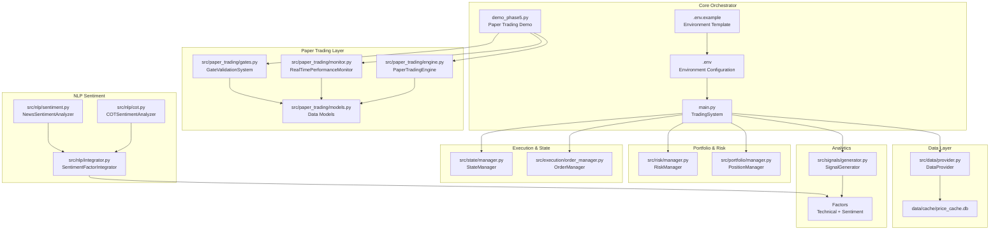
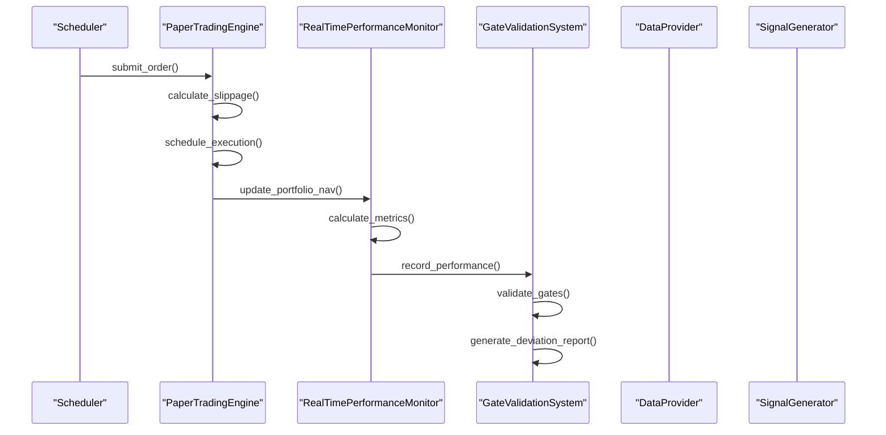
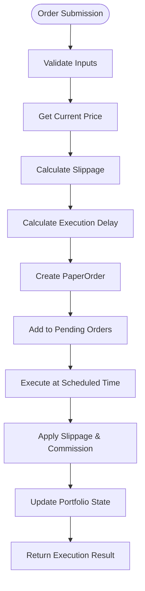
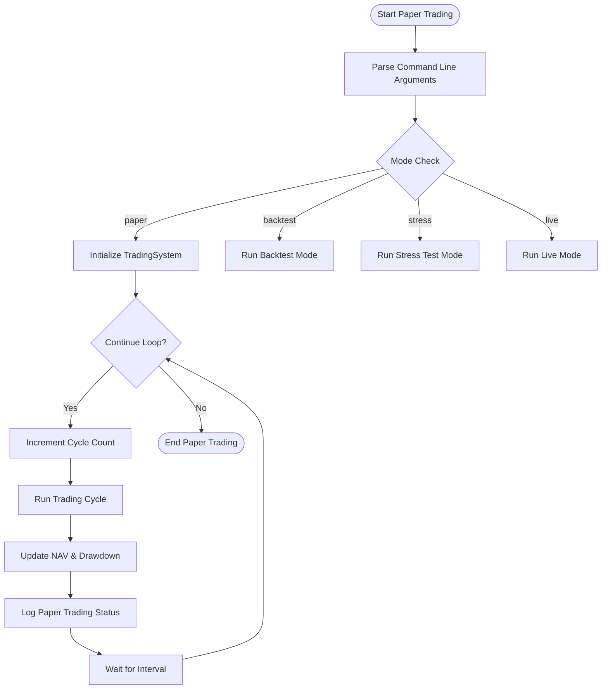
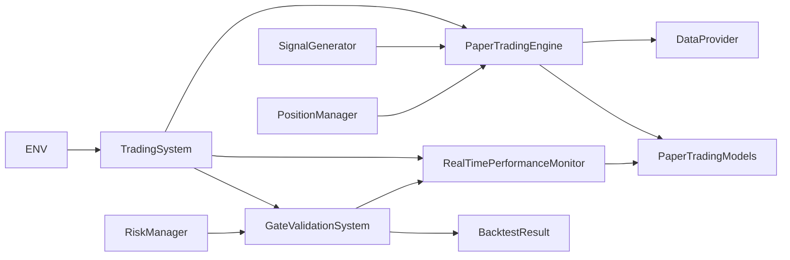

# Phase 5: Paper Trading System

<cite>
**Referenced Files in This Document**
- [README.md](file://README.md)
- [main.py](file://main.py)
- [demo_phase5.py](file://demo_phase5.py)
- [strategy.yaml](file://config/strategy.yaml)
- [.env](file://.env)
- [.env.example](file://.env.example)
- [engine.py](file://src/paper_trading/engine.py)
- [monitor.py](file://src/paper_trading/monitor.py)
- [gates.py](file://src/paper_trading/gates.py)
- [models.py](file://src/paper_trading/models.py)
- [domain.py](file://src/models/domain.py)
- [provider.py](file://src/data/provider.py)
- [generator.py](file://src/signals/generator.py)
- [manager.py](file://src/portfolio/manager.py)
- [order_manager.py](file://src/execution/order_manager.py)
- [manager.py](file://src/state/manager.py)
- [manager.py](file://src/risk/manager.py)
- [sentiment.py](file://src/nlp/sentiment.py)
- [cot.py](file://src/nlp/cot.py)
- [integrator.py](file://src/nlp/integrator.py)
</cite>

## Update Summary
**Changes Made**
- Enhanced paper trading mode implementation with --mode paper argument in main.py
- Added continuous trading cycle system with automatic NAV/drawdown tracking
- Integrated RealTimePerformanceMonitor with comprehensive metrics collection
- Added cloud deployment support through environment configuration
- Updated architecture diagrams to reflect new continuous operation model
- Enhanced troubleshooting guide with paper trading operational issues

## Table of Contents
1. [Introduction](#introduction)
2. [Project Structure](#project-structure)
3. [Core Components](#core-components)
4. [Architecture Overview](#architecture-overview)
5. [Detailed Component Analysis](#detailed-component-analysis)
6. [Continuous Trading Cycle System](#continuous-trading-cycle-system)
7. [Cloud Deployment Support](#cloud-deployment-support)
8. [Dependency Analysis](#dependency-analysis)
9. [Performance Considerations](#performance-considerations)
10. [Troubleshooting Guide](#troubleshooting-guide)
11. [Conclusion](#conclusion)

## Introduction
This document describes the Phase 5 Paper Trading System built on the Shark Quant Trader framework. The system provides a complete paper trading implementation with realistic order execution simulation, performance tracking, and automated gate validation. It simulates live trading conditions including slippage modeling, execution delays, and comprehensive performance monitoring with IC tracking and concept drift detection.

The system implements three major components: PaperTradingEngine for realistic order execution, RealTimePerformanceMonitor for comprehensive performance tracking, and GateValidationSystem for automated gate requirement validation. These components work together to provide a robust paper trading environment that bridges the gap between backtesting and live trading.

**Updated** Enhanced with continuous trading cycle system featuring automatic NAV/drawdown tracking and cloud deployment support through environment configuration.

## Project Structure
The repository follows a modular architecture with clear separation of concerns, now enhanced with comprehensive paper trading capabilities:
- Data ingestion and caching via a multi-source provider
- Technical factor calculation and signal generation
- Risk management with 4-level hierarchical controls
- Portfolio optimization and position sizing
- **Paper Trading Engine with realistic order execution simulation**
- **Real-Time Performance Monitor with IC and KS tracking**
- **Gate Validation System for automated compliance checking**
- Order simulation and compliance checks
- State persistence for disaster recovery
- NLP sentiment modules (news and COT) feeding ML features

**Diagram sources**
- [main.py](file://main.py#L32-L365)
- [demo_phase5.py](file://demo_phase5.py#L21-L29)
- [engine.py](file://src/paper_trading/engine.py#L53-L434)
- [monitor.py](file://src/paper_trading/monitor.py#L47-L465)
- [gates.py](file://src/paper_trading/gates.py#L41-L417)
- [models.py](file://src/paper_trading/models.py#L10-L210)
- [provider.py](file://src/data/provider.py#L35-L433)
- [generator.py](file://src/signals/generator.py#L10-L263)
- [manager.py](file://src/portfolio/manager.py#L10-L281)
- [manager.py](file://src/risk/manager.py#L9-L181)
- [order_manager.py](file://src/execution/order_manager.py#L20-L226)
- [manager.py](file://src/state/manager.py#L13-L392)
- [sentiment.py](file://src/nlp/sentiment.py#L74-L551)
- [cot.py](file://src/nlp/cot.py#L61-L419)
- [integrator.py](file://src/nlp/integrator.py#L34-L365)
- [.env](file://.env#L29-L30)
- [.env.example](file://.env.example#L23-L24)

**Section sources**
- [README.md](file://README.md#L64-L114)
- [main.py](file://main.py#L32-L365)
- [demo_phase5.py](file://demo_phase5.py#L1-L430)
- [.env](file://.env#L29-L30)
- [.env.example](file://.env.example#L23-L24)

## Core Components
The Phase 5 Paper Trading System consists of three comprehensive components that work together to provide realistic paper trading simulation:

### PaperTradingEngine (FR-5.1)
- **Realistic Order Execution**: Simulates market orders, limit orders, and TWAP executions with configurable delays
- **Advanced Slippage Modeling**: Implements sophisticated slippage calculation based on volatility, order size, and market conditions
- **Commission and Cost Tracking**: Accurately models trading costs including commissions and slippage impacts
- **Portfolio State Management**: Maintains cash, positions, cost basis, and performance metrics
- **Execution Simulation**: Handles partial fills, order cancellations, and real-time NAV updates

### RealTimePerformanceMonitor (FR-5.2)
- **Multi-window Performance Metrics**: Calculates rolling Sharpe ratios (20/60/252 days) with annualized returns
- **IC Tracking**: Monitors Information Coefficient for model quality assessment with rolling 20-day windows
- **KS Drift Detection**: Implements Kolmogorov-Smirnov testing for concept drift detection in ML features
- **Drawdown Analysis**: Real-time maximum drawdown calculation and tracking
- **Alert Generation**: Automated alerts for critical performance thresholds and anomalies

### GateValidationSystem (FR-5.3)
- **Gate Requirement Tracking**: Monitors progress toward Phase 1+2 and Phase 3 gate requirements
- **Automated Validation**: Comprehensive validation of trading days, Sharpe ratios, drawdown limits, and risk coverage
- **Deviation Analysis**: Compares paper trading performance against backtest expectations
- **Progress Reporting**: Provides detailed progress metrics and completion status
- **ML Enhancement Validation**: Specialized validation for machine learning strategy improvements

**Section sources**
- [engine.py](file://src/paper_trading/engine.py#L53-L434)
- [monitor.py](file://src/paper_trading/monitor.py#L47-L465)
- [gates.py](file://src/paper_trading/gates.py#L41-L417)
- [models.py](file://src/paper_trading/models.py#L10-L210)

## Architecture Overview
The paper trading system operates as an integrated layer within the broader trading framework, providing realistic simulation capabilities:

**Diagram sources**
- [engine.py](file://src/paper_trading/engine.py#L187-L360)
- [monitor.py](file://src/paper_trading/monitor.py#L98-L173)
- [gates.py](file://src/paper_trading/gates.py#L102-L217)

## Detailed Component Analysis

### PaperTradingEngine: Realistic Order Execution
The PaperTradingEngine provides comprehensive order simulation with realistic market conditions:

#### Slippage Configuration
- **Base Slippage**: 5 basis points (0.05%) as baseline market impact
- **Volatility Impact**: 0.1 additional slippage per 1% annual volatility
- **Size Impact**: Extra slippage for orders exceeding $10,000 threshold
- **Commission Rate**: 0.1% (10 basis points) for all transactions

#### Execution Delay Modeling
- **Market Orders**: 1-minute minimum delay with realistic processing
- **Limit Orders**: 5-minute delay to simulate price discovery
- **TWAP Execution**: 15-minute slice intervals for large orders
- **Randomization**: ±15% variation around configured delays

#### Order Lifecycle Management

**Diagram sources**
- [engine.py](file://src/paper_trading/engine.py#L187-L360)

**Section sources**
- [engine.py](file://src/paper_trading/engine.py#L17-L120)
- [engine.py](file://src/paper_trading/engine.py#L133-L186)
- [engine.py](file://src/paper_trading/engine.py#L187-L360)

### RealTimePerformanceMonitor: Comprehensive Metrics
The RealTimePerformanceMonitor tracks multiple performance dimensions with sophisticated analytics:

#### Performance Metrics Calculation
- **Rolling Sharpe Ratios**: 20-day, 60-day, and 252-day windows with annualized returns
- **Drawdown Analysis**: Peak-to-trough calculations with continuous monitoring
- **Return Statistics**: Daily returns, cumulative returns, and volatility measures
- **Alert Thresholds**: Configurable warning and critical levels for all metrics

#### Model Quality Monitoring
- **IC Tracking**: Rolling Information Coefficient correlation between predictions and actual returns
- **KS Drift Detection**: Kolmogorov-Smirnov testing for feature distribution changes
- **Training Distribution Comparison**: Baseline feature distributions for drift analysis
- **Quality Assessment**: Automatic evaluation of model performance trends

#### Alert Generation System
- **Threshold-based Alerts**: Automatic notifications for critical performance breaches
- **Severity Levels**: Warning and critical severity classifications
- **Historical Tracking**: Complete alert history for performance analysis
- **Drift Detection**: Early warning for concept drift in ML models

**Section sources**
- [monitor.py](file://src/paper_trading/monitor.py#L22-L97)
- [monitor.py](file://src/paper_trading/monitor.py#L98-L173)
- [monitor.py](file://src/paper_trading/monitor.py#L225-L297)
- [monitor.py](file://src/paper_trading/monitor.py#L299-L354)

### GateValidationSystem: Automated Compliance
The GateValidationSystem provides comprehensive compliance validation for paper trading readiness:

#### Phase 1+2 Gate Requirements
- **Minimum Trading Days**: 63 consecutive trading days (3-month minimum)
- **Sharpe Ratio**: Minimum 0.5 for 252-day rolling Sharpe
- **Maximum Drawdown**: Less than 15% threshold
- **System Availability**: Greater than 99.9% uptime
- **Risk Level Coverage**: All risk levels (1-4) must trigger at least once
- **Model Quality**: Rolling IC greater than 0.02 for ML-enabled phases

#### Phase 3 Gate Requirements
- **ML Outperformance**: Machine learning strategy must outperform traditional approach
- **Sustained Performance**: Maintained IC above 0.02 over extended periods
- **Enhanced Metrics**: Additional performance thresholds for ML validation

#### Deviation Analysis
- **Backtest Comparison**: Direct comparison of paper trading vs backtest performance
- **Statistical Significance**: Deviation thresholds for meaningful differences
- **Investigation Triggers**: Flags for significant performance discrepancies
- **Root Cause Analysis**: Detailed reporting for performance gaps

**Section sources**
- [gates.py](file://src/paper_trading/gates.py#L21-L56)
- [gates.py](file://src/paper_trading/gates.py#L102-L217)
- [gates.py](file://src/paper_trading/gates.py#L219-L283)
- [gates.py](file://src/paper_trading/gates.py#L285-L347)

### Data Models and Configuration
The paper trading system uses comprehensive data models for state management and reporting:

#### Core Data Structures
- **PaperOrder**: Complete order metadata with execution expectations
- **PaperExecutionResult**: Detailed execution outcomes with slippage and costs
- **PaperPortfolio**: Complete portfolio state with performance metrics
- **DailyPerformanceReport**: Consolidated daily performance metrics
- **GateValidationResult**: Comprehensive gate validation outcomes

#### Configuration Systems
- **SlippageConfig**: Customizable slippage parameters per asset class
- **DelayConfig**: Execution timing parameters for different order types
- **MonitorConfig**: Performance tracking thresholds and windows
- **Gate Requirements**: Dynamic gate criteria for different phases

**Section sources**
- [models.py](file://src/paper_trading/models.py#L10-L210)

## Continuous Trading Cycle System
The enhanced paper trading system now operates as a continuous trading cycle with automatic NAV/drawdown tracking:

### Paper Trading Mode Implementation
The main.py script now supports continuous paper trading mode with the --mode paper argument:

**Diagram sources**
- [main.py](file://main.py#L331-L351)

### Automatic NAV and Drawdown Tracking
The system automatically tracks and logs portfolio metrics during each trading cycle:

- **NAV Tracking**: Real-time Net Asset Value calculation
- **Peak NAV Maintenance**: Automatic peak tracking for drawdown calculations
- **Drawdown Calculation**: Current drawdown from peak NAV
- **Performance Logging**: Structured logging of trading cycle results

### Continuous Operation Features
- **Infinite Loop**: Paper trading runs continuously until manually stopped
- **Configurable Intervals**: Adjustable trading interval in seconds (default: 86400 = daily)
- **Automatic Rebalancing**: Same rebalancing logic as live mode
- **State Persistence**: Portfolio state saved after each cycle

**Section sources**
- [main.py](file://main.py#L331-L351)
- [main.py](file://main.py#L345-L348)

## Cloud Deployment Support
The system now includes comprehensive cloud deployment support through environment configuration:

### Environment Configuration
The .env and .env.example files provide flexible configuration for different deployment environments:

#### Key Configuration Parameters
- **INITIAL_CAPITAL**: Starting capital for paper trading ($100,000 default)
- **TRADING_MODE**: Paper trading mode activation
- **ALPACA_PAPER**: Paper trading mode for broker integration
- **DATABASE_PATH**: SQLite database location for state persistence
- **CACHE_PATH**: Price cache database location

#### Cloud-Specific Settings
- **API Keys**: Polygon, Binance, and Alpaca API credentials
- **Alert Channels**: Slack, email, Telegram, and Discord integration
- **Logging Configuration**: Log level settings for different environments
- **Broker Integration**: Support for multiple broker platforms

### Deployment Flexibility
- **Container Ready**: Environment variables for container orchestration
- **Multi-Platform Support**: Works across local development, cloud VMs, and container platforms
- **State Persistence**: Database configuration for persistent state across deployments
- **Monitoring Integration**: Alert configuration for cloud monitoring systems

**Section sources**
- [.env](file://.env#L29-L30)
- [.env](file://.env#L31-L31)
- [.env](file://.env#L23-L23)
- [.env.example](file://.env.example#L23-L24)
- [.env.example](file://.env.example#L67-L71)

## Dependency Analysis
The paper trading system introduces new dependencies while maintaining integration with existing components:

**Diagram sources**
- [main.py](file://main.py#L45-L56)
- [engine.py](file://src/paper_trading/engine.py#L14-L14)
- [monitor.py](file://src/paper_trading/monitor.py#L14-L19)
- [gates.py](file://src/paper_trading/gates.py#L12-L18)
- [.env](file://.env#L29-L30)

**Section sources**
- [main.py](file://main.py#L45-L56)

## Performance Considerations
The paper trading system introduces several performance optimizations:

### Execution Efficiency
- **Asynchronous Order Processing**: Non-blocking order submission and execution
- **Batch Processing**: Multiple order execution in single processing cycles
- **Memory Management**: Efficient handling of large order histories and performance data
- **Cache Optimization**: Price and volatility caching for simulation speed

### Realistic Simulation
- **Stochastic Modeling**: Randomized slippage and delays for realistic market conditions
- **Volume Impact**: Dynamic order sizing based on market liquidity
- **Correlation Effects**: Multi-asset slippage modeling for correlated instruments
- **Market Regime Simulation**: Different market conditions for various volatility regimes

### Monitoring Overhead
- **Incremental Calculations**: Efficient rolling window calculations for performance metrics
- **Lazy Evaluation**: On-demand metric calculations to minimize computational overhead
- **Historical Data Management**: Efficient storage and retrieval of performance histories
- **Alert Optimization**: Minimal alert processing overhead during normal operations

### Continuous Operation Performance
- **Background Processing**: Paper trading runs independently of other system components
- **Resource Isolation**: Dedicated resources for paper trading simulation
- **State Management**: Efficient state persistence and retrieval
- **Logging Optimization**: Structured logging for minimal performance impact

## Troubleshooting Guide
Common issues and resolutions for the paper trading system:

### Order Execution Issues
- **Slippage Exceeds Expectations**: Verify slippage configuration matches asset volatility; adjust base slippage for illiquid assets
- **Execution Delays Too Long**: Check delay configuration for order type; consider TWAP for large orders
- **Partial Fills Unexpected**: Review order sizing relative to available liquidity; adjust for market conditions
- **Commission Costs Higher Than Expected**: Verify commission rate configuration; check for tiered pricing effects

### Performance Monitoring Problems
- **IC Values Fluctuate Significantly**: Check training distribution stability; ensure consistent feature engineering
- **KS Drift Alerts**: Investigate feature engineering changes; validate data quality and preprocessing steps
- **Sharpe Ratio Calculation Errors**: Verify sufficient historical data; check for data gaps or outliers
- **Drawdown Calculation Issues**: Ensure proper peak NAV tracking; check for portfolio value updates

### Gate Validation Failures
- **Insufficient Trading Days**: Continue paper trading for minimum 63 consecutive days; avoid weekend gaps
- **Sharpe Ratio Below Threshold**: Improve signal quality or adjust risk parameters; validate backtest assumptions
- **Drawdown Exceeds Limits**: Implement stricter risk controls; reduce position sizes during volatile periods
- **Risk Level Coverage Missing**: Ensure comprehensive risk testing; simulate various market scenarios

### System Integration Issues
- **Data Provider Integration**: Verify price and volatility data availability; check API rate limits
- **State Persistence Conflicts**: Ensure proper synchronization between paper trading and main system
- **Alert System Integration**: Verify notification channels for critical alerts; test alert routing
- **Demo Environment Setup**: Check Python environment dependencies; verify import paths for paper trading modules

### Continuous Trading Cycle Issues
- **Paper Trading Not Starting**: Verify --mode paper argument is provided; check command line parsing
- **Infinite Loop Problems**: Ensure proper termination conditions; check for KeyboardInterrupt handling
- **NAV Tracking Errors**: Verify portfolio state initialization; check for proper NAV calculation
- **Drawdown Calculation Issues**: Ensure peak NAV is properly maintained; check for proper drawdown computation

### Cloud Deployment Issues
- **Environment Variable Loading**: Verify .env file exists and contains proper values; check file permissions
- **Database Connection Issues**: Verify DATABASE_PATH configuration; check SQLite database accessibility
- **API Key Authentication**: Verify broker API credentials; check for proper key formatting
- **Network Connectivity**: Verify external API access; check firewall and proxy configurations

**Section sources**
- [engine.py](file://src/paper_trading/engine.py#L133-L186)
- [monitor.py](file://src/paper_trading/monitor.py#L360-L390)
- [gates.py](file://src/paper_trading/gates.py#L387-L394)
- [main.py](file://main.py#L331-L351)

## Conclusion
The Phase 5 Paper Trading System represents a comprehensive implementation of realistic paper trading simulation capabilities. By integrating the PaperTradingEngine, RealTimePerformanceMonitor, and GateValidationSystem, the system provides a complete bridge between backtesting and live trading.

The implementation addresses key requirements from FR-5.1 through FR-5.3, providing sophisticated order execution simulation with realistic slippage modeling, comprehensive performance tracking with IC and KS monitoring, and automated gate validation for systematic compliance checking. The system's modular design ensures easy integration with existing trading infrastructure while providing the realism necessary for accurate performance assessment.

**Updated** The enhanced implementation now includes continuous trading cycle system with automatic NAV/drawdown tracking and comprehensive cloud deployment support through environment configuration. The --mode paper argument in main.py enables seamless paper trading operation with configurable intervals and automatic performance monitoring.

Future enhancements could include GPU acceleration for Monte Carlo simulations, expanded asset class support, and enhanced visualization dashboards for real-time performance monitoring. The foundation established in this phase provides a solid platform for continued evolution toward live trading deployment.