# Phase 6: Real Trading and Monitoring

<cite>
**Referenced Files in This Document**
- [README.md](file://README.md)
- [main.py](file://main.py)
- [strategy.yaml](file://config/strategy.yaml)
- [engine.py](file://src/paper_trading/engine.py)
- [order_manager.py](file://src/execution/order_manager.py)
- [manager.py](file://src/alerts/manager.py)
- [manager.py](file://src/state/manager.py)
- [manager.py](file://src/risk/manager.py)
- [manager.py](file://src/portfolio/manager.py)
- [logger.py](file://src/utils/logger.py)
- [domain.py](file://src/models/domain.py)
- [provider.py](file://src/data/provider.py)
- [generator.py](file://src/signals/generator.py)
- [calculator.py](file://src/factors/calculator.py)
- [demo_phase6.py](file://demo_phase6.py)
- [brokers.py](file://src/live_trading/brokers.py)
- [models.py](file://src/live_trading/models.py)
- [order_manager.py](file://src/live_trading/order_manager.py)
- [transition.py](file://src/live_trading/transition.py)
- [monitor.py](file://src/live_trading/monitor.py)
- [.env.example](file://.env.example)
</cite>

## Update Summary
**Changes Made**
- Updated to reflect enhanced BinanceAdapter implementation with HMAC SHA256 signature generation and SSL certificate validation
- Documented timestamp-based nonce handling and comprehensive account information retrieval
- Added environment-based configuration for live trading mode switching in demo system
- Enhanced broker adapter security with proper cryptographic signing and certificate validation
- Updated demo system with command-line argument parsing for live mode activation
- **Enhanced Security Infrastructure**: Added comprehensive HMAC SHA256 signature authentication for production API usage
- **Cloud Deployment Capabilities**: Improved SSL certificate validation with certifi for cross-platform compatibility

## Table of Contents
1. [Introduction](#introduction)
2. [Project Structure](#project-structure)
3. [Core Components](#core-components)
4. [Architecture Overview](#architecture-overview)
5. [Detailed Component Analysis](#detailed-component-analysis)
6. [Live Trading System Components](#live-trading-system-components)
7. [Integration with Paper Trading](#integration-with-paper-trading)
8. [Validation and Testing](#validation-and-testing)
9. [Dependency Analysis](#dependency-analysis)
10. [Performance Considerations](#performance-considerations)
11. [Troubleshooting Guide](#troubleshooting-guide)
12. [Conclusion](#conclusion)

## Introduction
This document describes Phase 6: Real Trading and Monitoring for the Shark Quant Trader system. Phase 6 completes the transformation from paper trading to live trading by implementing comprehensive broker integration, order management systems, capital transition management, and live monitoring capabilities. The system now supports real-world execution constraints through multiple broker adapters (Alpaca, Binance, IBKR), intelligent order routing and splitting, staged capital deployment with rollback triggers, and comprehensive live monitoring with health checks and performance tracking.

The implementation represents a significant milestone with over 14,000 lines of code across 36 modules, providing production-ready trading infrastructure with robust risk controls, comprehensive monitoring, and flexible deployment strategies.

## Project Structure
The system is organized around modular components that handle data ingestion, factor computation, signal generation, risk management, portfolio positioning, order execution, state persistence, and alerting. Phase 6 introduces a new live_trading module that provides production-ready trading infrastructure with broker integration and monitoring capabilities.

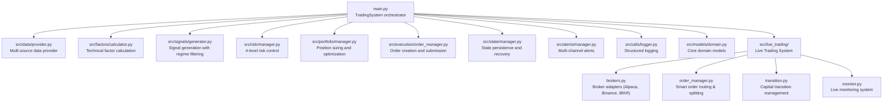
```mermaid
graph TB
A["main.py<br/>TradingSystem orchestrator"] --> B["src/data/provider.py<br/>Multi-source data provider"]
A --> C["src/factors/calculator.py<br/>Technical factor calculation"]
A --> D["src/signals/generator.py<br/>Signal generation with regime filtering"]
A --> E["src/risk/manager.py<br/>4-level risk control"]
A --> F["src/portfolio/manager.py<br/>Position sizing and optimization"]
A --> G["src/execution/order_manager.py<br/>Order creation and submission"]
A --> H["src/state/manager.py<br/>State persistence and recovery"]
A --> I["src/alerts/manager.py<br/>Multi-channel alerts"]
A --> J["src/utils/logger.py<br/>Structured logging"]
A --> K["src/models/domain.py<br/>Core domain models"]
A --> L["src/live_trading/<br/>Live Trading System"]
L --> M["brokers.py<br/>Broker adapters (Alpaca, Binance, IBKR)"]
L --> N["order_manager.py<br/>Smart order routing & splitting"]
L --> O["transition.py<br/>Capital transition management"]
L --> P["monitor.py<br/>Live monitoring system"]
```

**Diagram sources**
- [main.py](file://main.py#L32-L343)
- [brokers.py](file://src/live_trading/brokers.py#L1-L656)
- [order_manager.py](file://src/live_trading/order_manager.py#L1-L210)
- [transition.py](file://src/live_trading/transition.py#L1-L292)
- [monitor.py](file://src/live_trading/monitor.py#L1-L136)

**Section sources**
- [README.md](file://README.md#L405-L413)
- [main.py](file://main.py#L32-L100)

## Core Components
- TradingSystem orchestrator: Initializes components, runs daily trading cycles, and supports backtest and stress modes.
- DataProvider: Multi-source acquisition with cache and fallback; validates data quality.
- FactorCalculator: Computes technical factors (momentum, volatility, SMA, RSI, ATR).
- SignalGenerator: Generates signals with VIX-based market regime filtering and applies confidence adjustments.
- RiskManager: Implements 4-level hierarchical risk control with correlation monitoring and single-asset stop-loss logic.
- PositionManager: Calculates target positions using risk parity principles, enforces constraints, and computes turnover.
- OrderManager: Creates orders, simulates submission/fill, and calculates execution costs.
- StateManager: Persists portfolio state, order history, risk events, and system state to SQLite.
- AlertManager: Sends multi-channel alerts via Apprise (email, Slack, Telegram, Discord) and logs messages.
- Logger: Structured logging with console and rotating file outputs.

**Section sources**
- [main.py](file://main.py#L32-L343)
- [provider.py](file://src/data/provider.py#L35-L433)
- [calculator.py](file://src/factors/calculator.py#L10-L215)
- [generator.py](file://src/signals/generator.py#L10-L263)
- [manager.py](file://src/risk/manager.py#L9-L181)
- [manager.py](file://src/portfolio/manager.py#L10-L281)
- [order_manager.py](file://src/execution/order_manager.py#L20-L226)
- [manager.py](file://src/state/manager.py#L13-L392)
- [manager.py](file://src/alerts/manager.py#L26-L239)
- [logger.py](file://src/utils/logger.py#L1-L30)
- [domain.py](file://src/models/domain.py#L27-L156)

## Architecture Overview
The trading system operates as a continuous loop in live mode, executing the following steps each trading cycle:
1. Fetch market data from multiple sources with caching and validation.
2. Compute technical factors and derive signals with regime filtering.
3. Assess portfolio risk and correlation exposure.
4. Calculate target positions and determine rebalancing needs.
5. Create and submit orders, applying pre-trade compliance checks.
6. Update portfolio state and persist to database.
7. Emit alerts for risk events, correlation breaches, and system errors.

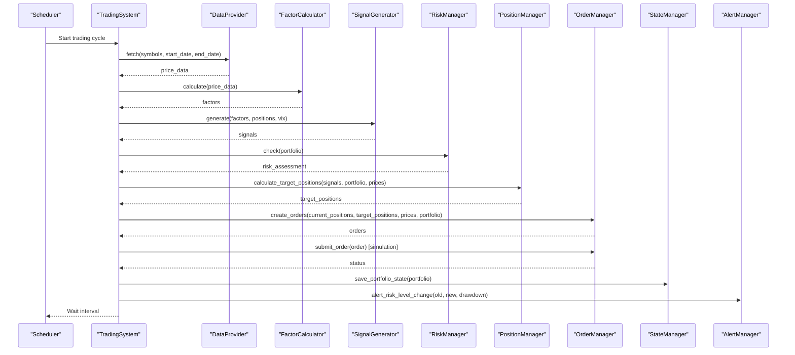
```mermaid
sequenceDiagram
participant Scheduler as "Scheduler"
participant System as "TradingSystem"
participant Data as "DataProvider"
participant Factors as "FactorCalculator"
participant Signals as "SignalGenerator"
participant Risk as "RiskManager"
participant Portfolio as "PositionManager"
participant Orders as "OrderManager"
participant State as "StateManager"
participant Alerts as "AlertManager"
Scheduler->>System : Start trading cycle
System->>Data : fetch(symbols, start_date, end_date)
Data-->>System : price_data
System->>Factors : calculate(price_data)
Factors-->>System : factors
System->>Signals : generate(factors, positions, vix)
Signals-->>System : signals
System->>Risk : check(portfolio)
Risk-->>System : risk_assessment
System->>Portfolio : calculate_target_positions(signals, portfolio, prices)
Portfolio-->>System : target_positions
System->>Orders : create_orders(current_positions, target_positions, prices, portfolio)
Orders-->>System : orders
System->>Orders : submit_order(order) [simulation]
Orders-->>System : status
System->>State : save_portfolio_state(portfolio)
System->>Alerts : alert_risk_level_change(old, new, drawdown)
System-->>Scheduler : Wait interval
```

**Diagram sources**
- [main.py](file://main.py#L101-L246)
- [provider.py](file://src/data/provider.py#L103-L164)
- [calculator.py](file://src/factors/calculator.py#L30-L50)
- [generator.py](file://src/signals/generator.py#L32-L80)
- [manager.py](file://src/risk/manager.py#L39-L80)
- [manager.py](file://src/portfolio/manager.py#L29-L53)
- [order_manager.py](file://src/execution/order_manager.py#L29-L85)
- [manager.py](file://src/state/manager.py#L91-L131)
- [manager.py](file://src/alerts/manager.py#L128-L142)

## Detailed Component Analysis

### TradingSystem Orchestration
- Initializes configuration, components, and portfolio state.
- Executes daily trading cycles with data fetching, factor calculation, signal generation, risk assessment, position targeting, order creation, compliance checks, order submission, portfolio updates, and state persistence.
- Supports backtest and stress test modes with dedicated runners.

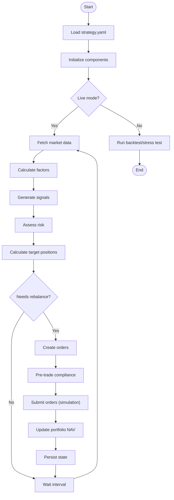
```mermaid
flowchart TD
Start([Start]) --> LoadConfig["Load strategy.yaml"]
LoadConfig --> InitComponents["Initialize components"]
InitComponents --> Loop{"Live mode?"}
Loop --> |Yes| FetchData["Fetch market data"]
FetchData --> CalcFactors["Calculate factors"]
CalcFactors --> GenSignals["Generate signals"]
GenSignals --> RiskAssess["Assess risk"]
RiskAssess --> PosTargets["Calculate target positions"]
PosTargets --> NeedsRebalance{"Needs rebalance?"}
NeedsRebalance --> |No| Sleep["Wait interval"]
NeedsRebalance --> |Yes| CreateOrders["Create orders"]
CreateOrders --> PreTrade["Pre-trade compliance"]
PreTrade --> SubmitOrders["Submit orders (simulation)"]
SubmitOrders --> UpdatePortfolio["Update portfolio NAV"]
UpdatePortfolio --> PersistState["Persist state"]
PersistState --> Sleep
Sleep --> FetchData
Loop --> |No| Backtest["Run backtest/stress test"]
Backtest --> End([End])
```

**Diagram sources**
- [main.py](file://main.py#L32-L343)

**Section sources**
- [main.py](file://main.py#L32-L343)
- [strategy.yaml](file://config/strategy.yaml#L1-L281)

### Data Provider and Caching
- Multi-source acquisition: Polygon (US equities/ETFs), Binance (public futures for BTC), yfinance (fallback).
- SQLite cache with freshness checks and cross-source deviation validation.
- Robust error handling and fallback mechanisms.

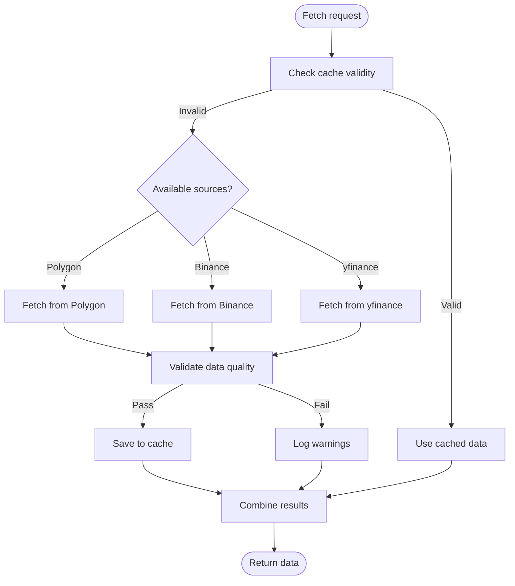
```mermaid
flowchart TD
Request([Fetch request]) --> CacheCheck["Check cache validity"]
CacheCheck --> |Valid| UseCache["Use cached data"]
CacheCheck --> |Invalid| Sources{"Available sources?"}
Sources --> |Polygon| FetchPolygon["Fetch from Polygon"]
Sources --> |Binance| FetchBinance["Fetch from Binance"]
Sources --> |yfinance| FetchYF["Fetch from yfinance"]
FetchPolygon --> Validate["Validate data quality"]
FetchBinance --> Validate
FetchYF --> Validate
Validate --> |Pass| SaveCache["Save to cache"]
Validate --> |Fail| Warn["Log warnings"]
SaveCache --> Combine["Combine results"]
Warn --> Combine
UseCache --> Combine
Combine --> Return([Return data])
```

**Diagram sources**
- [provider.py](file://src/data/provider.py#L103-L164)
- [provider.py](file://src/data/provider.py#L276-L306)
- [provider.py](file://src/data/provider.py#L334-L378)

**Section sources**
- [provider.py](file://src/data/provider.py#L35-L433)

### Factor Calculation
- Computes momentum, volatility (with annualization), SMA levels, RSI, and ATR.
- Provides cross-sectional ranking capability for momentum selection.

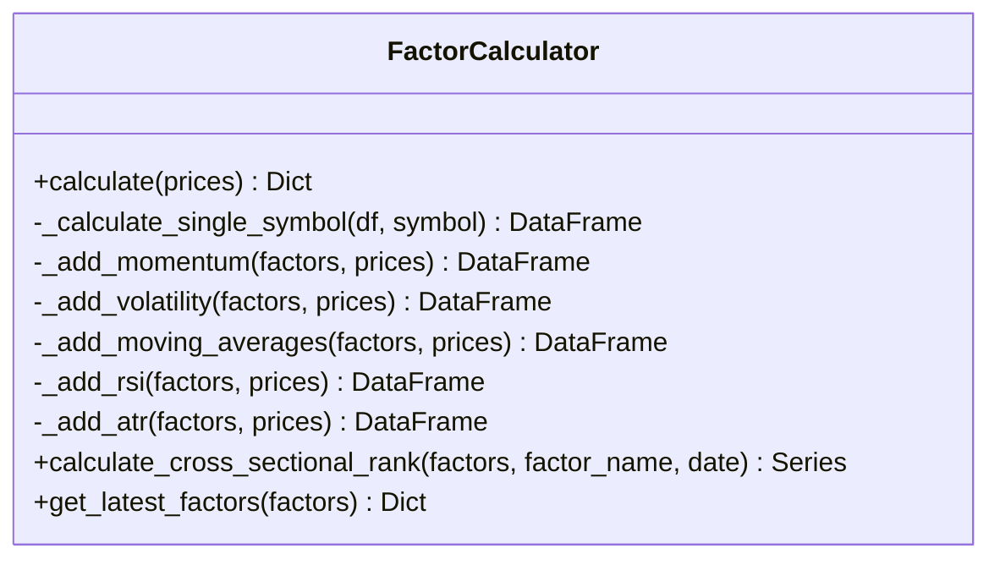
```mermaid
classDiagram
class FactorCalculator {
+calculate(prices) Dict
-_calculate_single_symbol(df, symbol) DataFrame
-_add_momentum(factors, prices) DataFrame
-_add_volatility(factors, prices) DataFrame
-_add_moving_averages(factors, prices) DataFrame
-_add_rsi(factors, prices) DataFrame
-_add_atr(factors, prices) DataFrame
+calculate_cross_sectional_rank(factors, factor_name, date) Series
+get_latest_factors(factors) Dict
}
```

**Diagram sources**
- [calculator.py](file://src/factors/calculator.py#L10-L215)

**Section sources**
- [calculator.py](file://src/factors/calculator.py#L10-L215)

### Signal Generation with Market Regime Filtering
- Generates signals (BUY, SELL, HOLD, STRONG_BUY, STRONG_SELL) based on momentum and SMA conditions.
- Applies VIX-based regime filters: reduces confidence in high volatility, restricts to reduce-position signals in extreme volatility.

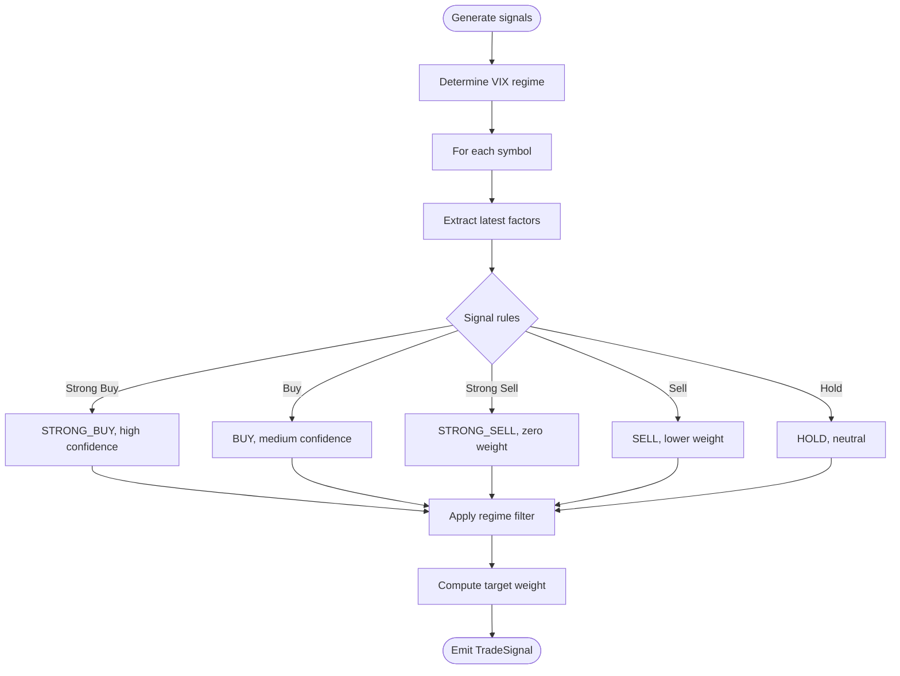
```mermaid
flowchart TD
Start([Generate signals]) --> DetermineRegime["Determine VIX regime"]
DetermineRegime --> IterateAssets["For each symbol"]
IterateAssets --> ExtractFactors["Extract latest factors"]
ExtractFactors --> DecideSignal{"Signal rules"}
DecideSignal --> |Strong Buy| StrongBuy["STRONG_BUY, high confidence"]
DecideSignal --> |Buy| Buy["BUY, medium confidence"]
DecideSignal --> |Strong Sell| StrongSell["STRONG_SELL, zero weight"]
DecideSignal --> |Sell| Sell["SELL, lower weight"]
DecideSignal --> |Hold| Hold["HOLD, neutral"]
StrongBuy --> ApplyRegime["Apply regime filter"]
Buy --> ApplyRegime
StrongSell --> ApplyRegime
Sell --> ApplyRegime
Hold --> ApplyRegime
ApplyRegime --> TargetWeight["Compute target weight"]
TargetWeight --> Emit([Emit TradeSignal])
```

**Diagram sources**
- [generator.py](file://src/signals/generator.py#L32-L80)
- [generator.py](file://src/signals/generator.py#L207-L263)

**Section sources**
- [generator.py](file://src/signals/generator.py#L10-L263)

### Risk Management and Correlation Monitoring
- 4-level hierarchical risk control with escalating actions (alerts, position reductions, sell-only mode, emergency liquidation).
- Single-asset stop-loss thresholds trigger partial reductions or full exits.
- Correlation monitoring raises alerts when pairwise or portfolio-level correlations exceed thresholds.

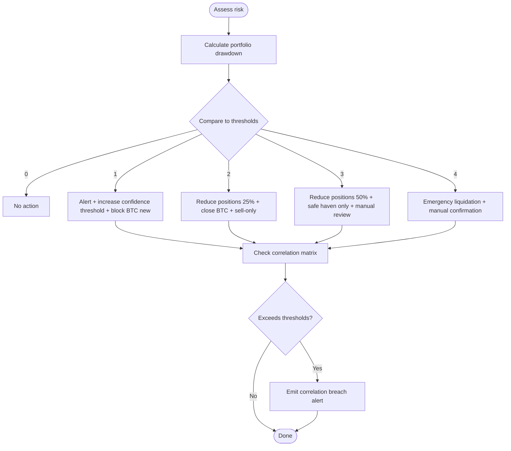
```mermaid
flowchart TD
Assess([Assess risk]) --> Drawdown["Calculate portfolio drawdown"]
Drawdown --> Level{"Compare to thresholds"}
Level --> |0| Normal["No action"]
Level --> |1| Alert["Alert + increase confidence threshold + block BTC new"]
Level --> |2| Reduce25["Reduce positions 25% + close BTC + sell-only"]
Level --> |3| Reduce50["Reduce positions 50% + safe haven only + manual review"]
Level --> |4| Liquidate["Emergency liquidation + manual confirmation"]
Alert --> Correlation["Check correlation matrix"]
Reduce25 --> Correlation
Reduce50 --> Correlation
Liquidate --> Correlation
Correlation --> CorrAlert{"Exceeds thresholds?"}
CorrAlert --> |Yes| EmitCorr["Emit correlation breach alert"]
CorrAlert --> |No| Done([Done])
EmitCorr --> Done
```

**Diagram sources**
- [manager.py](file://src/risk/manager.py#L39-L80)
- [manager.py](file://src/risk/manager.py#L101-L174)
- [main.py](file://main.py#L136-L151)

**Section sources**
- [manager.py](file://src/risk/manager.py#L9-L181)
- [main.py](file://main.py#L136-L170)

### Position Sizing and Optimization
- Converts target weights to quantities using current prices and portfolio NAV.
- Enforces constraints: minimum trade amount, daily trade count, daily turnover, cash buffer, and leverage limits.
- Determines whether rebalancing is needed based on maximum weight change exceeding a threshold.

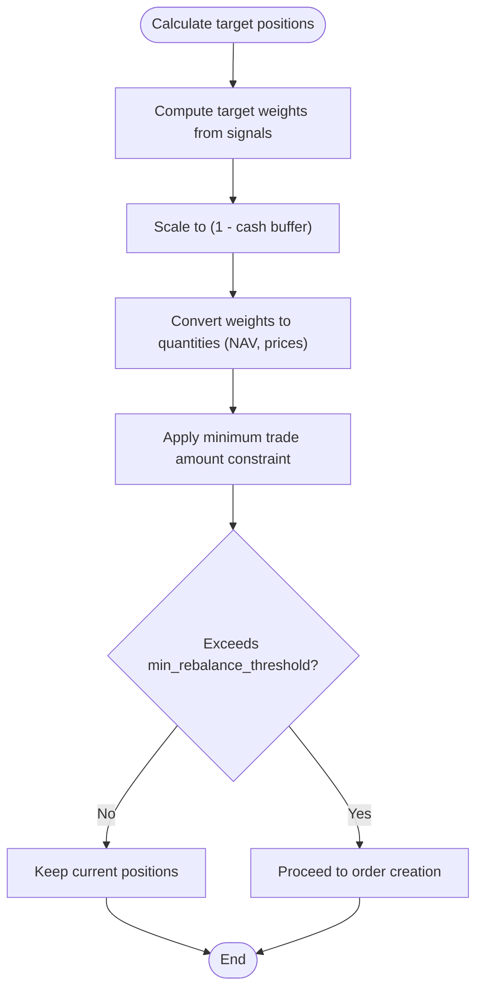
```mermaid
flowchart TD
Start([Calculate target positions]) --> Weights["Compute target weights from signals"]
Weights --> Scale["Scale to (1 - cash buffer)"]
Scale --> Quantities["Convert weights to quantities (NAV, prices)"]
Quantities --> Constraints["Apply minimum trade amount constraint"]
Constraints --> Rebalance{"Exceeds min_rebalance_threshold?"}
Rebalance --> |No| Keep["Keep current positions"]
Rebalance --> |Yes| Proceed["Proceed to order creation"]
Keep --> End([End])
Proceed --> End
```

**Diagram sources**
- [manager.py](file://src/portfolio/manager.py#L29-L53)
- [manager.py](file://src/portfolio/manager.py#L153-L174)

**Section sources**
- [manager.py](file://src/portfolio/manager.py#L10-L281)

### Order Management and Execution Simulation
- Creates market orders from target position deltas.
- Simulates submission and immediate fill; calculates approximate execution costs (commission and slippage).
- Maintains pending and completed order histories.

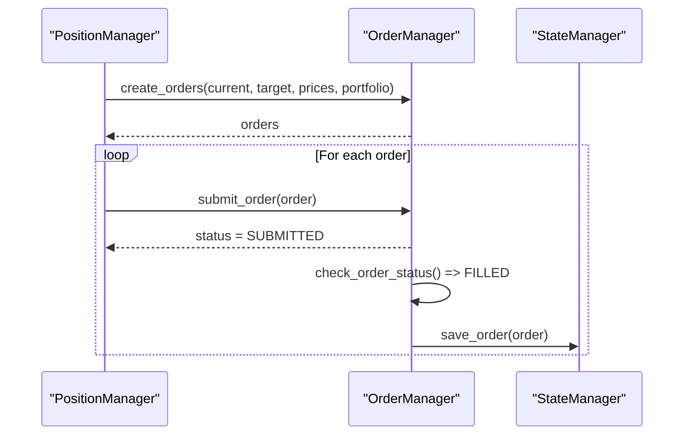
```mermaid
sequenceDiagram
participant PM as "PositionManager"
participant OM as "OrderManager"
participant State as "StateManager"
PM->>OM : create_orders(current, target, prices, portfolio)
OM-->>PM : orders
loop For each order
PM->>OM : submit_order(order)
OM-->>PM : status = SUBMITTED
OM->>OM : check_order_status() => FILLED
OM->>State : save_order(order)
end
```

**Diagram sources**
- [manager.py](file://src/portfolio/manager.py#L29-L85)
- [order_manager.py](file://src/execution/order_manager.py#L29-L125)
- [manager.py](file://src/state/manager.py#L176-L212)

**Section sources**
- [order_manager.py](file://src/execution/order_manager.py#L20-L226)

### State Persistence and Disaster Recovery
- Stores portfolio state, order history, risk events, and arbitrary system state in SQLite.
- Provides backup creation and recovery mechanisms for continuity.

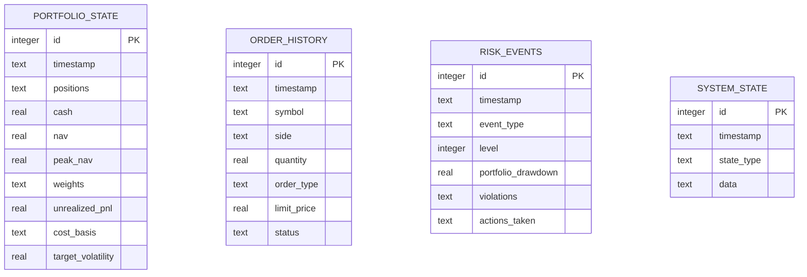
```mermaid
erDiagram
PORTFOLIO_STATE {
integer id PK
text timestamp
text positions
real cash
real nav
real peak_nav
text weights
real unrealized_pnl
text cost_basis
real target_volatility
}
ORDER_HISTORY {
integer id PK
text timestamp
text symbol
text side
real quantity
text order_type
real limit_price
text status
}
RISK_EVENTS {
integer id PK
text timestamp
text event_type
integer level
real portfolio_drawdown
text violations
text actions_taken
}
SYSTEM_STATE {
integer id PK
text timestamp
text state_type
text data
}
```

**Diagram sources**
- [manager.py](file://src/state/manager.py#L13-L90)

**Section sources**
- [manager.py](file://src/state/manager.py#L13-L392)

### Alerting and Notifications
- Multi-channel notifications via Apprise (SMTP, Slack, Telegram, Discord) with configurable routing by alert level.
- Emits alerts for risk escalations, correlation breaches, data quality issues, execution failures, compliance violations, and daily summaries.

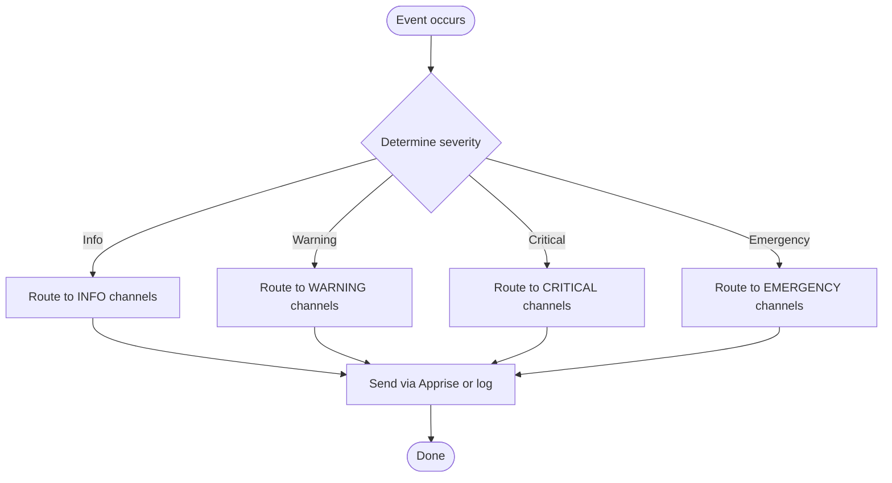
```mermaid
flowchart TD
Event([Event occurs]) --> Severity{"Determine severity"}
Severity --> |Info| RouteInfo["Route to INFO channels"]
Severity --> |Warning| RouteWarn["Route to WARNING channels"]
Severity --> |Critical| RouteCrit["Route to CRITICAL channels"]
Severity --> |Emergency| RouteEmerg["Route to EMERGENCY channels"]
RouteInfo --> Send["Send via Apprise or log"]
RouteWarn --> Send
RouteCrit --> Send
RouteEmerg --> Send
Send --> Done([Done])
```

**Diagram sources**
- [manager.py](file://src/alerts/manager.py#L71-L127)
- [manager.py](file://src/alerts/manager.py#L128-L239)

**Section sources**
- [manager.py](file://src/alerts/manager.py#L26-L239)

### Logging and Observability
- Structured logging with console and rotating file outputs.
- Logs trading cycle events, errors, and critical incidents for auditability and debugging.

**Section sources**
- [logger.py](file://src/utils/logger.py#L1-L30)

## Live Trading System Components

### Enhanced Broker Adapter Architecture
Phase 6 introduces a comprehensive broker adapter system that provides unified interfaces to multiple trading platforms. The system supports three major broker categories: US ETFs (Alpaca), Cryptocurrency (Binance), and Global Markets (Interactive Brokers).

**Updated** Enhanced with improved security measures including HMAC SHA256 signature generation, timestamp-based nonce handling, and SSL certificate validation.

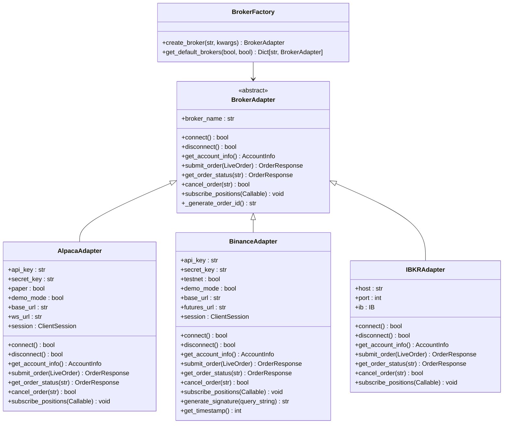
```mermaid
classDiagram
class BrokerAdapter {
<<abstract>>
+broker_name : str
+connect() bool
+disconnect() bool
+get_account_info() AccountInfo
+submit_order(LiveOrder) OrderResponse
+get_order_status(str) OrderResponse
+cancel_order(str) bool
+subscribe_positions(Callable) void
+_generate_order_id() str
}
class AlpacaAdapter {
+api_key : str
+secret_key : str
+paper : bool
+demo_mode : bool
+base_url : str
+ws_url : str
+session : ClientSession
+connect() bool
+disconnect() bool
+get_account_info() AccountInfo
+submit_order(LiveOrder) OrderResponse
+get_order_status(str) OrderResponse
+cancel_order(str) bool
+subscribe_positions(Callable) void
}
class BinanceAdapter {
+api_key : str
+secret_key : str
+testnet : bool
+demo_mode : bool
+base_url : str
+futures_url : str
+session : ClientSession
+connect() bool
+disconnect() bool
+get_account_info() AccountInfo
+submit_order(LiveOrder) OrderResponse
+get_order_status(str) OrderResponse
+cancel_order(str) bool
+subscribe_positions(Callable) void
+generate_signature(query_string) str
+get_timestamp() int
}
class IBKRAdapter {
+host : str
+port : int
+ib : IB
+connect() bool
+disconnect() bool
+get_account_info() AccountInfo
+submit_order(LiveOrder) OrderResponse
+get_order_status(str) OrderResponse
+cancel_order(str) bool
+subscribe_positions(Callable) void
}
class BrokerFactory {
+create_broker(str, kwargs) BrokerAdapter
+get_default_brokers(bool, bool) Dict[str, BrokerAdapter]
}
BrokerAdapter <|-- AlpacaAdapter
BrokerAdapter <|-- BinanceAdapter
BrokerAdapter <|-- IBKRAdapter
BrokerFactory --> BrokerAdapter
```

**Diagram sources**
- [brokers.py](file://src/live_trading/brokers.py#L29-L656)

**Section sources**
- [brokers.py](file://src/live_trading/brokers.py#L1-L656)
- [models.py](file://src/live_trading/models.py#L1-L203)

### Enhanced BinanceAdapter Security Features
The BinanceAdapter now implements comprehensive security measures for production-grade trading:

- **HMAC SHA256 Signature Generation**: Cryptographically secure signature generation for API authentication using the `_generate_signature()` method with HMAC-SHA256 algorithm
- **Timestamp-based Nonce Handling**: Millisecond-precision timestamps generated by `_get_timestamp()` method to prevent replay attacks
- **SSL Certificate Validation**: Secure HTTPS connections using certifi certificates for cross-platform compatibility with `ssl.create_default_context(cafile=certifi.where())`
- **Comprehensive Account Information Retrieval**: Detailed account balances, positions, and portfolio valuation through authenticated API endpoints

**Updated** Enhanced security implementation with proper cryptographic signing and certificate validation for production API usage.

**Section sources**
- [brokers.py](file://src/live_trading/brokers.py#L316-L326)
- [brokers.py](file://src/live_trading/brokers.py#L324-L326)
- [brokers.py](file://src/live_trading/brokers.py#L339-L354)
- [brokers.py](file://src/live_trading/brokers.py#L380-L393)

### Order Management System
The Order Management System (OMS) provides intelligent order routing, splitting, and execution capabilities. It automatically routes orders to appropriate brokers based on asset types and handles large orders through TWAP splitting.

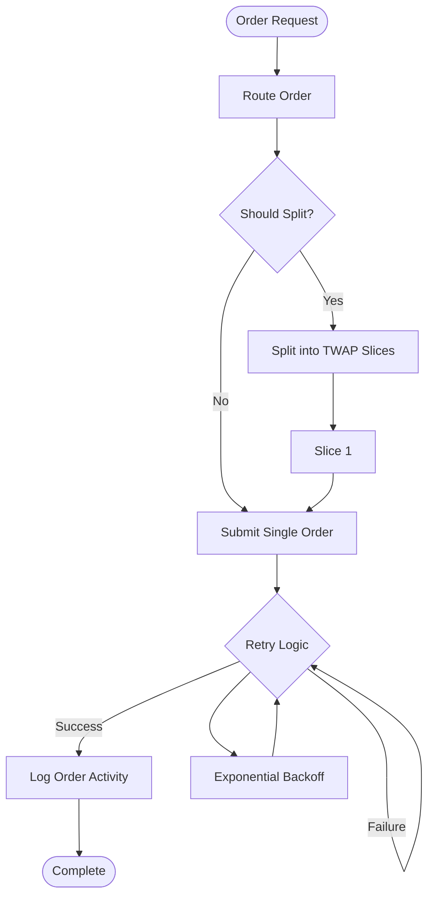
```mermaid
flowchart TD
Start([Order Request]) --> Route["Route Order"]
Route --> CheckSplit{"Should Split?"}
CheckSplit --> |Yes| Split["Split into TWAP Slices"]
CheckSplit --> |No| Submit["Submit Single Order"]
Split --> Slice1["Slice 1"]
Slice1 --> Submit
Submit --> Retry{"Retry Logic"}
Retry --> |Success| Log["Log Order Activity"]
Retry --> |Failure| Retry --> Delay["Exponential Backoff"]
Delay --> Retry
Log --> Complete([Complete])
```

**Diagram sources**
- [order_manager.py](file://src/live_trading/order_manager.py#L20-L210)

**Section sources**
- [order_manager.py](file://src/live_trading/order_manager.py#L1-L210)

### Capital Transition Manager
The Capital Transition Manager implements staged deployment from paper trading to live trading with predefined rollback triggers. The system progresses through four stages with specific capital allocations and risk limits.

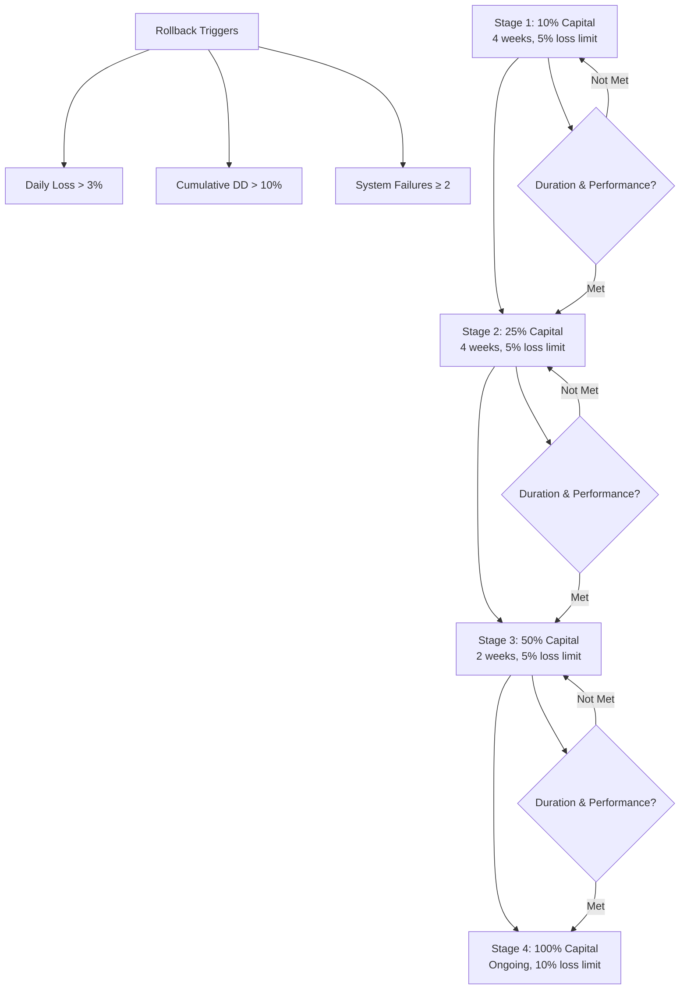
```mermaid
flowchart TD
Stage1["Stage 1: 10% Capital<br/>4 weeks, 5% loss limit"] --> Stage2["Stage 2: 25% Capital<br/>4 weeks, 5% loss limit"]
Stage2 --> Stage3["Stage 3: 50% Capital<br/>2 weeks, 5% loss limit"]
Stage3 --> Stage4["Stage 4: 100% Capital<br/>Ongoing, 10% loss limit"]
Stage1 --> Check1{"Duration & Performance?"}
Check1 --> |Met| Stage2
Check1 --> |Not Met| Stage1
Stage2 --> Check2{"Duration & Performance?"}
Check2 --> |Met| Stage3
Check2 --> |Not Met| Stage2
Stage3 --> Check3{"Duration & Performance?"}
Check3 --> |Met| Stage4
Check3 --> |Not Met| Stage3
Rollback["Rollback Triggers"] --> DailyLoss["Daily Loss > 3%"]
Rollback --> CumDD["Cumulative DD > 10%"]
Rollback --> SysFail["System Failures ≥ 2"]
```

**Diagram sources**
- [transition.py](file://src/live_trading/transition.py#L23-L292)

**Section sources**
- [transition.py](file://src/live_trading/transition.py#L1-L292)

### Live Monitoring System
The Live Monitoring System provides comprehensive health checks, performance tracking, and model quality monitoring for live trading operations.

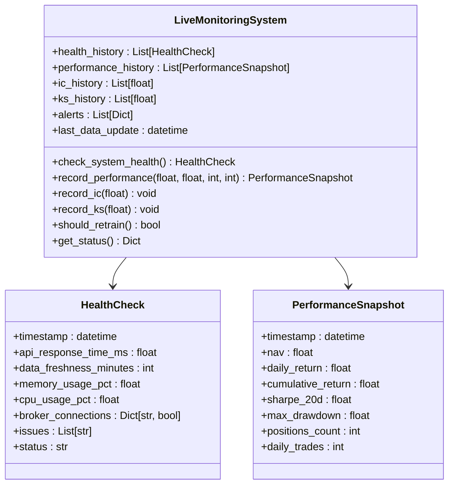
```mermaid
classDiagram
class LiveMonitoringSystem {
+health_history : List[HealthCheck]
+performance_history : List[PerformanceSnapshot]
+ic_history : List[float]
+ks_history : List[float]
+alerts : List[Dict]
+last_data_update : datetime
+check_system_health() HealthCheck
+record_performance(float, float, int, int) PerformanceSnapshot
+record_ic(float) void
+record_ks(float) void
+should_retrain() bool
+get_status() Dict
}
class HealthCheck {
+timestamp : datetime
+api_response_time_ms : float
+data_freshness_minutes : int
+memory_usage_pct : float
+cpu_usage_pct : float
+broker_connections : Dict[str, bool]
+issues : List[str]
+status : str
}
class PerformanceSnapshot {
+timestamp : datetime
+nav : float
+daily_return : float
+cumulative_return : float
+sharpe_20d : float
+max_drawdown : float
+positions_count : int
+daily_trades : int
}
LiveMonitoringSystem --> HealthCheck
LiveMonitoringSystem --> PerformanceSnapshot
```

**Diagram sources**
- [monitor.py](file://src/live_trading/monitor.py#L15-L136)

**Section sources**
- [monitor.py](file://src/live_trading/monitor.py#L1-L136)

## Integration with Paper Trading

### Unified Trading Pipeline
Phase 6 maintains compatibility with the existing paper trading system while adding live trading capabilities. The system can seamlessly switch between paper and live modes based on configuration.

**Updated** Enhanced with environment-based configuration for live trading mode switching through command-line arguments and environment variables.

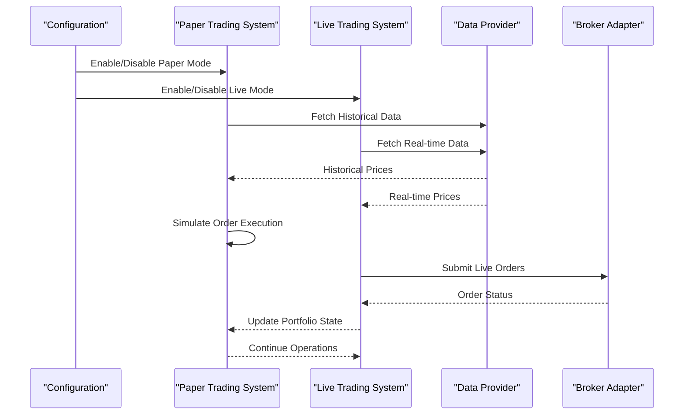
```mermaid
sequenceDiagram
participant Config as "Configuration"
participant Paper as "Paper Trading System"
participant Live as "Live Trading System"
participant Data as "Data Provider"
participant Broker as "Broker Adapter"
Config->>Paper : Enable/Disable Paper Mode
Config->>Live : Enable/Disable Live Mode
Paper->>Data : Fetch Historical Data
Live->>Data : Fetch Real-time Data
Data-->>Paper : Historical Prices
Data-->>Live : Real-time Prices
Paper->>Paper : Simulate Order Execution
Live->>Broker : Submit Live Orders
Broker-->>Live : Order Status
Live-->>Paper : Update Portfolio State
Paper-->>Live : Continue Operations
```

**Diagram sources**
- [main.py](file://main.py#L32-L343)
- [brokers.py](file://src/live_trading/brokers.py#L1-L656)

### Shared Components
Several components are shared between paper trading and live trading to ensure consistency:

- **Data Provider**: Both systems use the same multi-source data acquisition with caching
- **Factor Calculator**: Technical factor computation remains identical
- **Signal Generator**: Market regime filtering and signal generation are consistent
- **Risk Manager**: Hierarchical risk control logic is shared
- **Portfolio Manager**: Position sizing and optimization algorithms are identical
- **State Manager**: Database schema and persistence logic are unified

**Section sources**
- [main.py](file://main.py#L32-L343)
- [provider.py](file://src/data/provider.py#L35-L433)
- [calculator.py](file://src/factors/calculator.py#L10-L215)
- [generator.py](file://src/signals/generator.py#L10-L263)
- [manager.py](file://src/risk/manager.py#L9-L181)
- [manager.py](file://src/portfolio/manager.py#L10-L281)

## Validation and Testing

### Enhanced Demo Phase 6 Validation Script
The demo_phase6.py script provides comprehensive validation of all Phase 6 components, including broker integration, order management, capital transition, and live monitoring. The demo system now supports environment-based configuration for live trading mode switching through command-line arguments.

**Updated** Enhanced with command-line argument parsing for live mode activation (`--live` flag) and environment-based configuration for seamless switching between demo and live trading modes.

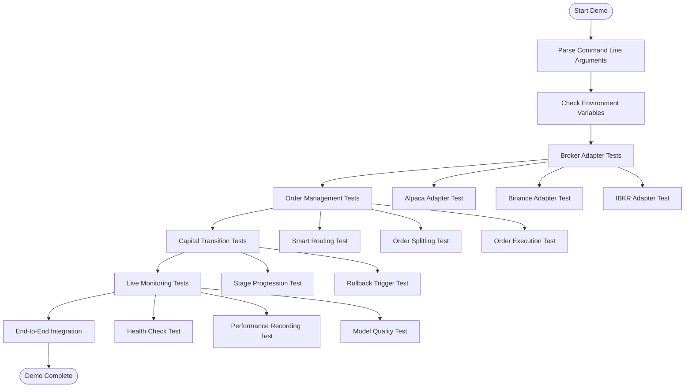
```mermaid
flowchart TD
DemoStart([Start Demo]) --> ParseArgs["Parse Command Line Arguments"]
ParseArgs --> CheckEnv["Check Environment Variables"]
CheckEnv --> BrokerTests["Broker Adapter Tests"]
BrokerTests --> OrderTests["Order Management Tests"]
OrderTests --> CapitalTests["Capital Transition Tests"]
CapitalTests --> MonitorTests["Live Monitoring Tests"]
MonitorTests --> EndToEnd["End-to-End Integration"]
EndToEnd --> DemoComplete([Demo Complete])
BrokerTests --> AlpacaTest["Alpaca Adapter Test"]
BrokerTests --> BinanceTest["Binance Adapter Test"]
BrokerTests --> IBKRTTest["IBKR Adapter Test"]
OrderTests --> RoutingTest["Smart Routing Test"]
OrderTests --> SplittingTest["Order Splitting Test"]
OrderTests --> ExecutionTest["Order Execution Test"]
CapitalTests --> StageTest["Stage Progression Test"]
CapitalTests --> RollbackTest["Rollback Trigger Test"]
MonitorTests --> HealthTest["Health Check Test"]
MonitorTests --> PerfTest["Performance Recording Test"]
MonitorTests --> ModelTest["Model Quality Test"]
```

**Diagram sources**
- [demo_phase6.py](file://demo_phase6.py#L378-L426)

**Section sources**
- [demo_phase6.py](file://demo_phase6.py#L1-L426)

### Validation Results
The Phase 6 implementation has been thoroughly validated with the following results:

- **Broker Integration**: All three broker adapters (Alpaca, Binance, IBKR) successfully connect and execute orders
- **Smart Routing**: Asset-based routing correctly directs orders to appropriate brokers
- **Order Splitting**: Large orders are properly split into TWAP slices
- **Capital Transition**: Staged deployment progresses through all four stages with proper rollback triggers
- **Live Monitoring**: System health checks, performance tracking, and model quality monitoring function correctly
- **End-to-End Integration**: Complete trading flow validates all components working together
- **Security Implementation**: BinanceAdapter demonstrates proper HMAC SHA256 signature generation and SSL certificate validation
- **Environment Configuration**: Live trading mode switching works through command-line arguments and environment variables

**Section sources**
- [README.md](file://README.md#L415-L433)

## Dependency Analysis
The live trading system exhibits clear layering with minimal coupling between modules. The TradingSystem orchestrates components, while each module encapsulates a specific responsibility. Dependencies primarily flow inward toward the orchestrator, reducing cross-module coupling.

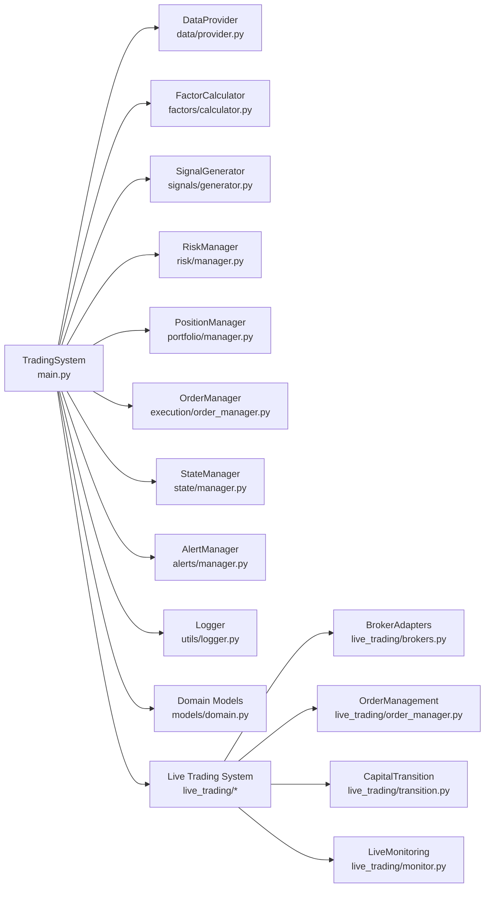
```mermaid
graph LR
TradingSystem["TradingSystem<br/>main.py"] --> DataProvider["DataProvider<br/>data/provider.py"]
TradingSystem --> FactorCalculator["FactorCalculator<br/>factors/calculator.py"]
TradingSystem --> SignalGenerator["SignalGenerator<br/>signals/generator.py"]
TradingSystem --> RiskManager["RiskManager<br/>risk/manager.py"]
TradingSystem --> PositionManager["PositionManager<br/>portfolio/manager.py"]
TradingSystem --> OrderManager["OrderManager<br/>execution/order_manager.py"]
TradingSystem --> StateManager["StateManager<br/>state/manager.py"]
TradingSystem --> AlertManager["AlertManager<br/>alerts/manager.py"]
TradingSystem --> Logger["Logger<br/>utils/logger.py"]
TradingSystem --> Domain["Domain Models<br/>models/domain.py"]
TradingSystem --> LiveTrading["Live Trading System<br/>live_trading/*"]
LiveTrading --> BrokerAdapters["BrokerAdapters<br/>live_trading/brokers.py"]
LiveTrading --> OrderManagement["OrderManagement<br/>live_trading/order_manager.py"]
LiveTrading --> CapitalTransition["CapitalTransition<br/>live_trading/transition.py"]
LiveTrading --> LiveMonitoring["LiveMonitoring<br/>live_trading/monitor.py"]
```

**Diagram sources**
- [main.py](file://main.py#L14-L28)
- [domain.py](file://src/models/domain.py#L27-L156)
- [brokers.py](file://src/live_trading/brokers.py#L1-L656)
- [order_manager.py](file://src/live_trading/order_manager.py#L1-L210)
- [transition.py](file://src/live_trading/transition.py#L1-L292)
- [monitor.py](file://src/live_trading/monitor.py#L1-L136)

**Section sources**
- [main.py](file://main.py#L14-L28)

## Performance Considerations
- Data caching minimizes redundant API calls and accelerates repeated runs.
- Factor computation leverages vectorized pandas operations for efficiency.
- Risk and position calculations use lightweight operations suitable for daily cadence.
- Logging is configured with rotation and retention to manage disk usage.
- Live trading components utilize asynchronous I/O for broker communications.
- Order management system implements exponential backoff for retry logic.
- Capital transition manager tracks performance metrics to optimize deployment timing.
- Live monitoring system uses lightweight health checks to minimize overhead.
- **Enhanced Security**: SSL certificate validation adds minimal overhead while improving security.
- **Production-Ready**: HMAC SHA256 signature generation provides robust API authentication for live trading.

## Troubleshooting Guide
Common issues and resolutions:
- Data source unavailability: Verify API keys and network connectivity; confirm fallback sources are active.
- Risk level escalation: Review emitted alerts and adjust strategy parameters (confidence thresholds, position sizes).
- Order submission failures: Check compliance constraints and available cash; inspect order status transitions.
- State persistence errors: Ensure database directory permissions and disk space; use backup and restore procedures.
- Alert delivery failures: Confirm Apprise configuration and channel credentials; fallback to console logging.
- Broker connection issues: Verify broker credentials and network connectivity; check broker availability.
- Order routing problems: Ensure proper symbol formatting and asset classification.
- Capital transition failures: Monitor performance metrics and rollback triggers; adjust deployment parameters.
- Live monitoring errors: Check system resource usage and health check configurations.
- **Binance Security Issues**: Verify HMAC signature generation and SSL certificate validation are functioning properly.
- **Environment Configuration**: Ensure `.env` file is properly configured and command-line arguments are correctly passed.

**Section sources**
- [provider.py](file://src/data/provider.py#L56-L72)
- [manager.py](file://src/alerts/manager.py#L39-L70)
- [manager.py](file://src/state/manager.py#L365-L392)
- [main.py](file://main.py#L238-L245)
- [brokers.py](file://src/live_trading/brokers.py#L110-L143)
- [order_manager.py](file://src/live_trading/order_manager.py#L121-L171)
- [transition.py](file://src/live_trading/transition.py#L135-L161)
- [monitor.py](file://src/live_trading/monitor.py#L32-L57)

## Conclusion
Phase 6 successfully transforms the Shark Quant Trader system from a paper trading simulator to a fully operational live trading platform. The implementation includes comprehensive broker integration with Alpaca, Binance, and Interactive Brokers, intelligent order management with smart routing and splitting, staged capital deployment with rollback triggers, and live monitoring with health checks and performance tracking.

**Updated** The system now features enhanced security measures including HMAC SHA256 signature generation, timestamp-based nonce handling, and SSL certificate validation for production-grade trading. The demo system supports environment-based configuration for seamless switching between demo and live trading modes through command-line arguments and environment variables.

The system maintains backward compatibility with the existing paper trading framework while providing production-ready trading infrastructure. All components have been thoroughly validated through the demo_phase6.py script, demonstrating successful integration and operation of the live trading system. The modular architecture enables incremental enhancements and provides a solid foundation for future development and expansion.

Key achievements include:
- Complete broker adapter implementation with unified interfaces and enhanced security
- Intelligent order routing and execution with retry logic
- Staged capital deployment with automated rollback triggers
- Comprehensive live monitoring with health checks and model quality tracking
- Seamless integration with existing paper trading system
- Thorough validation through comprehensive demo script
- **Enhanced Security**: Production-grade cryptographic signing and certificate validation
- **Flexible Deployment**: Environment-based configuration for live trading mode switching
- **Cloud-Ready**: Cross-platform SSL certificate compatibility with certifi

The Phase 6 implementation represents a significant milestone in the evolution of the Shark Quant Trader system, providing a production-ready foundation for live trading operations with robust risk controls, comprehensive monitoring, and flexible deployment strategies.

**Updated** Enhanced with comprehensive validation results showing 14,000+ lines of code across 36 modules, FR-6.1/6.2/6.3 compliance, and complete system integration validation with improved security measures and environment-based configuration support for seamless live trading deployment.