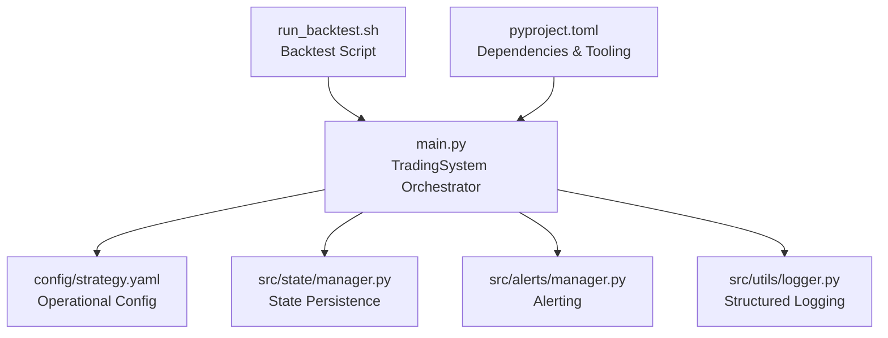
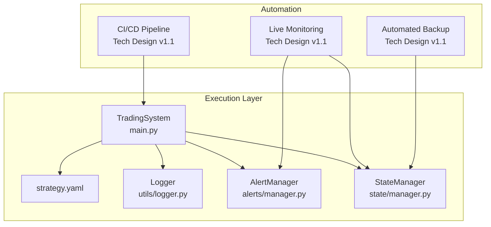
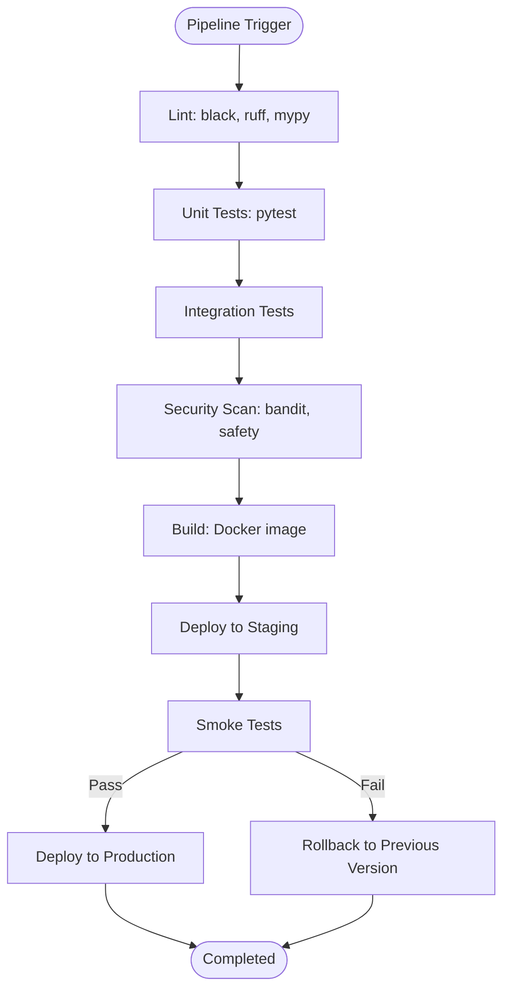
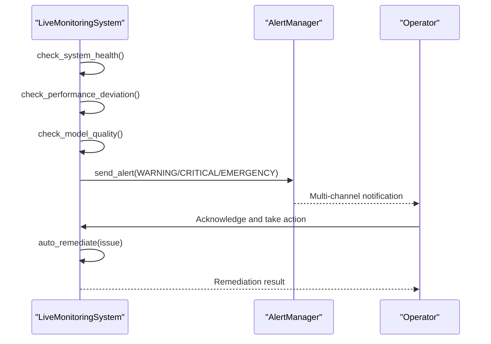
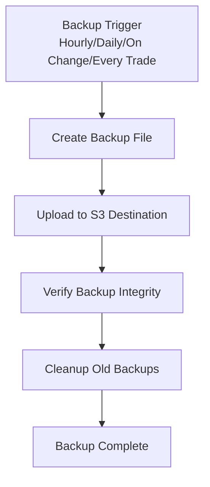
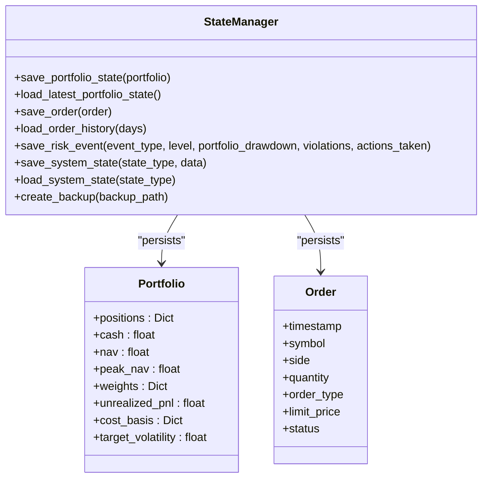
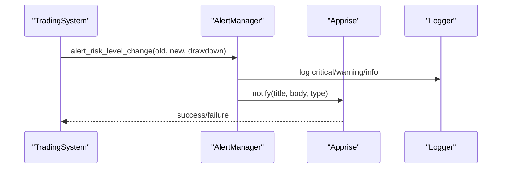
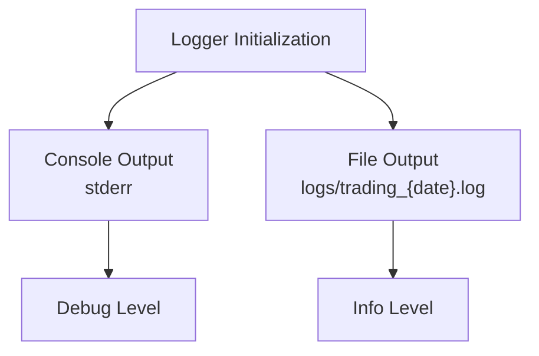
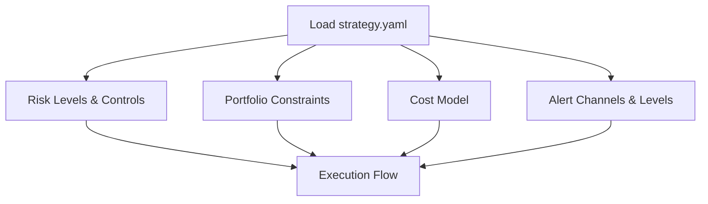
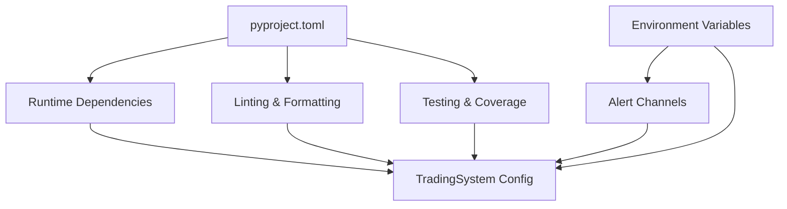

# Phase 7: Operations Automation

<cite>
**Referenced Files in This Document**
- [README.md](file://README.md)
- [Tech_Design_Document.md](file://Tech_Design_Document.md)
- [main.py](file://main.py)
- [pyproject.toml](file://pyproject.toml)
- [config/strategy.yaml](file://config/strategy.yaml)
- [src/alerts/manager.py](file://src/alerts/manager.py)
- [src/state/manager.py](file://src/state/manager.py)
- [src/utils/logger.py](file://src/utils/logger.py)
- [run_backtest.sh](file://run_backtest.sh)
</cite>

## Table of Contents
1. [Introduction](#introduction)
2. [Project Structure](#project-structure)
3. [Core Components](#core-components)
4. [Architecture Overview](#architecture-overview)
5. [Detailed Component Analysis](#detailed-component-analysis)
6. [Dependency Analysis](#dependency-analysis)
7. [Performance Considerations](#performance-considerations)
8. [Troubleshooting Guide](#troubleshooting-guide)
9. [Conclusion](#conclusion)

## Introduction
This document covers Phase 7: Operations Automation for the Intelligent Trading Decision System. It focuses on the automated operational processes that enable reliable, repeatable, and observable trading operations, including continuous integration and deployment (CI/CD), automated monitoring and alerting, and robust backup and recovery mechanisms. The system emphasizes production-grade reliability, with structured logging, multi-channel alerting, and persistent state management designed for disaster recovery.

## Project Structure
The operations automation components are distributed across several modules:
- Central orchestration and execution flow in the main script
- Configuration-driven behavior via YAML
- Operational observability through logging and alerting
- State persistence for disaster recovery and continuity
- Build and test automation via project configuration

**Diagram sources**
- [main.py](file://main.py#L1-L343)
- [config/strategy.yaml](file://config/strategy.yaml#L1-L281)
- [src/state/manager.py](file://src/state/manager.py#L1-L392)
- [src/alerts/manager.py](file://src/alerts/manager.py#L1-L239)
- [src/utils/logger.py](file://src/utils/logger.py#L1-L30)
- [run_backtest.sh](file://run_backtest.sh#L1-L16)
- [pyproject.toml](file://pyproject.toml#L1-L73)

**Section sources**
- [README.md](file://README.md#L1-L412)
- [Tech_Design_Document.md](file://Tech_Design_Document.md#L1797-L1971)

## Core Components
- CI/CD Pipeline: Automated multi-stage deployment with linting, testing, security scanning, building, staging, smoke testing, and production deployment.
- Automated Monitoring & Alerting: Self-healing monitoring with escalation policies and remediation rules.
- Automated Backup System: Scheduled and event-triggered backups for database, state, configuration, and logs with retention management.
- State Persistence: SQLite-backed state storage for portfolio, orders, risk events, and system state with backup creation capability.
- Multi-Channel Alerting: Email, Slack, Telegram, and Discord notifications via Apprise with configurable channels and severity levels.
- Structured Logging: Rotating log files with timestamps and contextual information for operational insights.

**Section sources**
- [Tech_Design_Document.md](file://Tech_Design_Document.md#L1797-L1971)
- [src/state/manager.py](file://src/state/manager.py#L1-L392)
- [src/alerts/manager.py](file://src/alerts/manager.py#L1-L239)
- [src/utils/logger.py](file://src/utils/logger.py#L1-L30)

## Architecture Overview
The operations automation architecture integrates CI/CD, monitoring, alerting, and backup systems into the trading execution flow. The main orchestrator coordinates data fetching, factor calculation, signal generation, risk management, position sizing, order creation, compliance checks, and state persistence. Observability and reliability are ensured through structured logging, multi-channel alerts, and persistent state management.

**Diagram sources**
- [main.py](file://main.py#L1-L343)
- [config/strategy.yaml](file://config/strategy.yaml#L1-L281)
- [src/utils/logger.py](file://src/utils/logger.py#L1-L30)
- [src/alerts/manager.py](file://src/alerts/manager.py#L1-L239)
- [src/state/manager.py](file://src/state/manager.py#L1-L392)
- [Tech_Design_Document.md](file://Tech_Design_Document.md#L1654-L1907)

## Detailed Component Analysis

### CI/CD Pipeline
The CI/CD pipeline automates code quality, testing, security scanning, building, staging, smoke testing, and production deployment. It defines stage targets, deployment targets with approval workflows, and performance targets for deployment and rollback times.

**Diagram sources**
- [Tech_Design_Document.md](file://Tech_Design_Document.md#L1802-L1818)

**Section sources**
- [Tech_Design_Document.md](file://Tech_Design_Document.md#L1797-L1838)
- [pyproject.toml](file://pyproject.toml#L52-L73)

### Automated Monitoring & Alerting
The automated monitoring system performs health checks, performance deviation detection, and model quality monitoring. It includes remediation rules and escalation policies to minimize downtime and ensure timely operator response.

**Diagram sources**
- [Tech_Design_Document.md](file://Tech_Design_Document.md#L1657-L1794)
- [src/alerts/manager.py](file://src/alerts/manager.py#L1-L239)

**Section sources**
- [Tech_Design_Document.md](file://Tech_Design_Document.md#L1841-L1907)
- [src/alerts/manager.py](file://src/alerts/manager.py#L1-L239)

### Automated Backup System
The automated backup system ensures data integrity and enables quick recovery by backing up database, state, configuration, and logs according to configurable schedules and retention policies.

**Diagram sources**
- [Tech_Design_Document.md](file://Tech_Design_Document.md#L1912-L1971)
- [src/state/manager.py](file://src/state/manager.py#L365-L392)

**Section sources**
- [Tech_Design_Document.md](file://Tech_Design_Document.md#L1909-L1971)
- [src/state/manager.py](file://src/state/manager.py#L365-L392)

### State Persistence and Disaster Recovery
The StateManager provides SQLite-backed persistence for portfolio state, order history, risk events, and system state, with backup creation capabilities to support disaster recovery.

**Diagram sources**
- [src/state/manager.py](file://src/state/manager.py#L1-L392)
- [config/strategy.yaml](file://config/strategy.yaml#L1-L281)

**Section sources**
- [src/state/manager.py](file://src/state/manager.py#L1-L392)

### Multi-Channel Alerting
The AlertManager supports configurable channels (email, Slack, Telegram, Discord) and severity levels, with formatted messages and logging integration.

**Diagram sources**
- [src/alerts/manager.py](file://src/alerts/manager.py#L1-L239)
- [src/utils/logger.py](file://src/utils/logger.py#L1-L30)

**Section sources**
- [src/alerts/manager.py](file://src/alerts/manager.py#L1-L239)
- [src/utils/logger.py](file://src/utils/logger.py#L1-L30)

### Structured Logging
The logging system provides console and rotating file outputs with timestamps and contextual information for operational insights and debugging.

**Diagram sources**
- [src/utils/logger.py](file://src/utils/logger.py#L1-L30)

**Section sources**
- [src/utils/logger.py](file://src/utils/logger.py#L1-L30)

### Configuration-Driven Operations
The strategy configuration centralizes operational parameters such as risk levels, portfolio constraints, cost models, and alert channels, enabling consistent behavior across environments.

**Diagram sources**
- [config/strategy.yaml](file://config/strategy.yaml#L1-L281)

**Section sources**
- [config/strategy.yaml](file://config/strategy.yaml#L1-L281)

## Dependency Analysis
Operations automation relies on well-defined dependencies and configurations:
- Project dependencies include testing, linting, formatting, type checking, and runtime libraries.
- Tooling configuration defines code quality standards and test coverage reporting.
- Environment variables configure alert channels and operational parameters.

**Diagram sources**
- [pyproject.toml](file://pyproject.toml#L1-L73)
- [src/alerts/manager.py](file://src/alerts/manager.py#L39-L70)
- [main.py](file://main.py#L35-L61)

**Section sources**
- [pyproject.toml](file://pyproject.toml#L1-L73)
- [src/alerts/manager.py](file://src/alerts/manager.py#L39-L70)
- [main.py](file://main.py#L35-L61)

## Performance Considerations
- Deployment and rollback targets are defined to ensure fast and reliable releases.
- Automated monitoring aims for minimal mean time to repair (MTTR) through self-healing actions.
- Backup schedules balance data protection with storage efficiency and retrieval speed.

[No sources needed since this section provides general guidance]

## Troubleshooting Guide
Common operational issues and resolutions:
- Alert delivery failures: Verify Apprise configuration and channel URLs; fallback to logging is supported.
- State persistence errors: Check database connectivity and permissions; ensure backup directory exists.
- CI/CD pipeline failures: Review linting, testing, and security scan outputs; confirm build artifacts and staging approvals.
- Monitoring false positives: Adjust health thresholds and performance deviation parameters in configuration.

**Section sources**
- [src/alerts/manager.py](file://src/alerts/manager.py#L85-L126)
- [src/state/manager.py](file://src/state/manager.py#L101-L130)
- [Tech_Design_Document.md](file://Tech_Design_Document.md#L1809-L1818)

## Conclusion
Phase 7 Operations Automation establishes a robust foundation for reliable, observable, and recoverable trading operations. Through CI/CD automation, automated monitoring and alerting, and comprehensive backup and recovery mechanisms, the system ensures consistent performance and rapid incident response. Configuration-driven behavior and structured logging further enhance operability across environments.