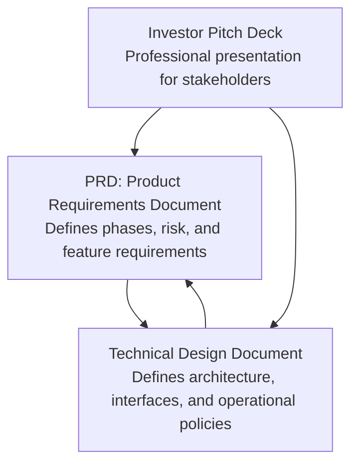
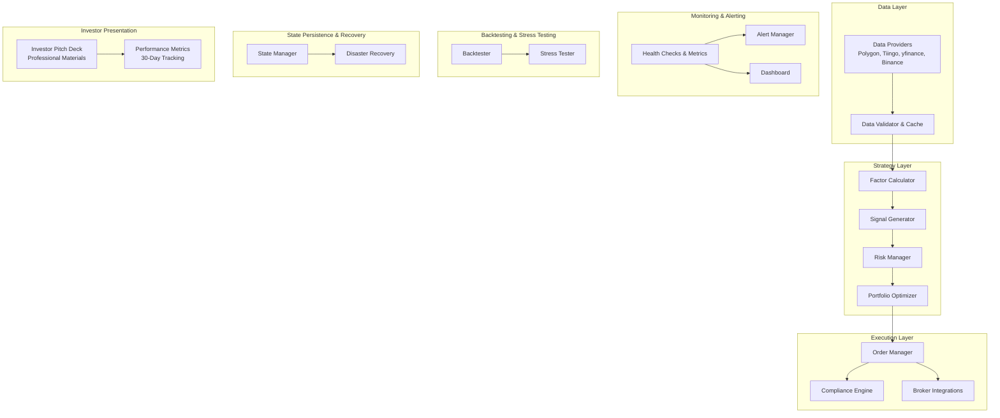
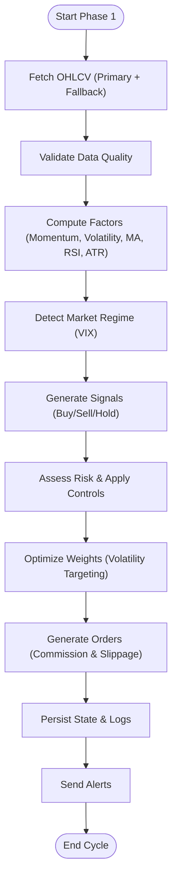
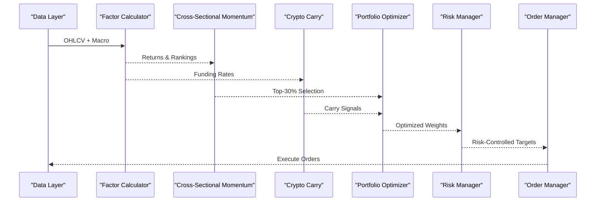
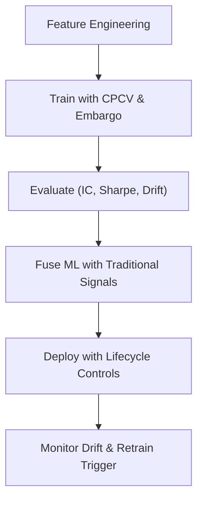
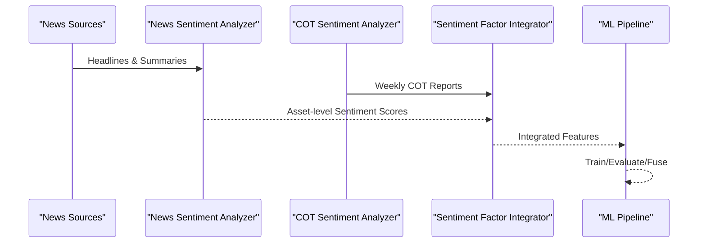
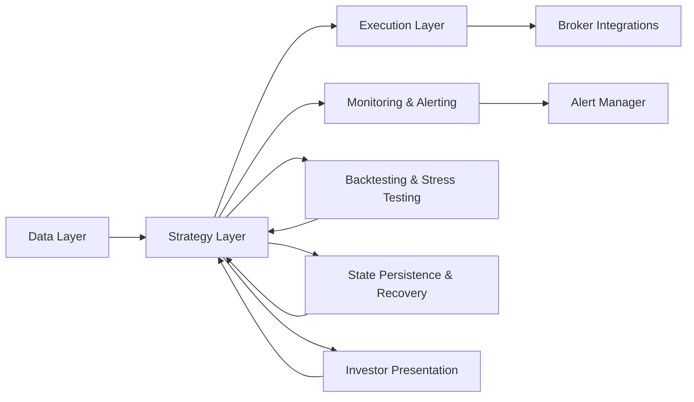

# Project Overview

<cite>
**Referenced Files in This Document**
- [INVESTOR_PITCH.md](file://INVESTOR_PITCH.md)
- [PRD_Intelligent_Trading_System_v2.md](file://PRD_Intelligent_Trading_System_v2.md)
- [Tech_Design_Document.md](file://Tech_Design_Document.md)
- [PHASE1_COMPLETE.md](file://PHASE1_COMPLETE.md)
- [demo_phase1.py](file://demo_phase1.py)
- [demo_phase2.py](file://demo_phase2.py)
- [demo_phase3.py](file://demo_phase3.py)
- [demo_phase4.py](file://demo_phase4.py)
- [main.py](file://main.py)
</cite>

## Update Summary
**Changes Made**
- Updated overfitting detection threshold parameters in Phase 3 ML enhancement documentation
- Corrected IC standard deviation threshold from 0.5 to 0.1 for improved model robustness
- Enhanced machine learning validation criteria documentation
- Updated technical specifications to reflect stricter overfitting prevention measures

## Table of Contents
1. [Introduction](#introduction)
2. [Project Structure](#project-structure)
3. [Core Components](#core-components)
4. [Architecture Overview](#architecture-overview)
5. [Detailed Component Analysis](#detailed-component-analysis)
6. [Investor Presentation Capabilities](#investor-presentation-capabilities)
7. [Dependency Analysis](#dependency-analysis)
8. [Performance Considerations](#performance-considerations)
9. [Troubleshooting Guide](#troubleshooting-guide)
10. [Conclusion](#conclusion)
11. [Appendices](#appendices)

## Introduction
The Intelligent Trading Decision System is a multi-asset quantitative trading platform designed to evolve systematically across four phases. It targets quant researchers and trading professionals who require a production-ready, modular, and risk-aware framework. The system emphasizes:
- Multi-asset coverage spanning precious metals, equity ETFs, international ETFs, bonds, commodities, real estate, and cryptocurrency.
- A phased roadmap from basic factor strategies to machine learning and NLP sentiment enhancement.
- Hierarchical risk management, robust backtesting, and compliance-aware operations.
- Practical examples demonstrating progression from Phase 1 (basic factor strategies) to Phase 4 (NLP sentiment integration).
- Professional investor presentation capabilities with comprehensive English and Chinese documentation.

This overview balances conceptual explanations for newcomers and technical depth for developers, grounded in the repository's product and technical design documents, enhanced by professional presentation materials for stakeholder engagement.

## Project Structure
The repository centers on two primary documents supplemented by comprehensive investor presentation materials:
- Product Requirements Document (PRD): Defines goals, phases, risk controls, and feature requirements.
- Technical Design Document: Outlines architecture, technology stack, module interfaces, and operational policies.
- Investor Pitch Deck: Professional presentation materials covering technology architecture, strategy phases, performance metrics, and funding requirements.

**Diagram sources**
- [PRD_Intelligent_Trading_System_v2.md](file://PRD_Intelligent_Trading_System_v2.md#L1-L1339)
- [Tech_Design_Document.md](file://Tech_Design_Document.md#L1-L1502)
- [INVESTOR_PITCH.md](file://INVESTOR_PITCH.md#L1-L242)

**Section sources**
- [PRD_Intelligent_Trading_System_v2.md](file://PRD_Intelligent_Trading_System_v2.md#L1-L1339)
- [Tech_Design_Document.md](file://Tech_Design_Document.md#L1-L1502)
- [INVESTOR_PITCH.md](file://INVESTOR_PITCH.md#L1-L242)

## Core Components
The system is organized around a layered architecture with clear separation of concerns:
- Data Layer: Multi-source ingestion, validation, caching, and persistence.
- Strategy Layer: Factor computation, signal generation, risk management, and portfolio optimization.
- Execution Layer: Order management, broker routing, and compliance enforcement.
- Monitoring & Alerting: Health checks, metrics, alerts, and dashboards.
- Backtesting & Stress Testing: Historical validation and scenario testing.
- State Persistence & Disaster Recovery: Portfolio state, trade logs, and recovery procedures.

Key capabilities include:
- 15+ asset class coverage enabling statistically meaningful cross-sectional signals.
- Hierarchical risk management with progressive controls and correlation monitoring.
- Production-ready architecture with containerization, observability, and compliance safeguards.
- Phased evolution from basic factor strategies to ML and NLP sentiment.
- Professional investor presentation materials in both English and Chinese.
- Comprehensive performance tracking and reporting capabilities.

**Section sources**
- [PRD_Intelligent_Trading_System_v2.md](file://PRD_Intelligent_Trading_System_v2.md#L44-L73)
- [Tech_Design_Document.md](file://Tech_Design_Document.md#L34-L117)
- [INVESTOR_PITCH.md](file://INVESTOR_PITCH.md#L82-L120)

## Architecture Overview
The system follows a modular, microservices-like structure with distinct layers and clear data flow:

**Diagram sources**
- [Tech_Design_Document.md](file://Tech_Design_Document.md#L38-L117)
- [PRD_Intelligent_Trading_System_v2.md](file://PRD_Intelligent_Trading_System_v2.md#L129-L417)
- [INVESTOR_PITCH.md](file://INVESTOR_PITCH.md#L20-L120)

**Section sources**
- [Tech_Design_Document.md](file://Tech_Design_Document.md#L34-L117)
- [PRD_Intelligent_Trading_System_v2.md](file://PRD_Intelligent_Trading_System_v2.md#L129-L417)
- [INVESTOR_PITCH.md](file://INVESTOR_PITCH.md#L20-L120)

## Detailed Component Analysis

### Phase 1: Basic Factor Strategies (MVP)
Goal: Establish a runnable system that generates clear buy/sell signals across core assets.

Capabilities:
- Data acquisition with multi-source fallback and quality validation.
- Factor computation (momentum, volatility, moving averages, RSI, ATR).
- Signal generation with market regime filtering (VIX-based).
- Position sizing constrained by volatility targeting and risk budgets.
- Transaction cost modeling and order generation.
- Hierarchical risk controls with progressive de-risking and correlation monitoring.
- Backtesting and stress testing across historical crises.
- State persistence and alerting.

Practical example (conceptual):
- Input: OHLCV series for GLD, SPY, QQQ, BTC-USD.
- Output: Trade signals with confidence and target weights, plus reasons and regime classification.

**Diagram sources**
- [PRD_Intelligent_Trading_System_v2.md](file://PRD_Intelligent_Trading_System_v2.md#L131-L417)
- [Tech_Design_Document.md](file://Tech_Design_Document.md#L209-L437)

**Section sources**
- [PRD_Intelligent_Trading_System_v2.md](file://PRD_Intelligent_Trading_System_v2.md#L131-L417)
- [Tech_Design_Document.md](file://Tech_Design_Document.md#L209-L437)

### Phase 2: Cross-Sectional Momentum & Carry Strategies
Goal: Expand to 15 assets and introduce cross-sectional selection and crypto carry.

Capabilities:
- Cross-sectional momentum ranking across 15 assets with trend filters.
- Crypto carry strategy using funding rates for BTC perpetuals.
- Tactical asset allocation combining momentum ranking with risk parity optimization.
- Enhanced correlation monitoring and re-entry logic after risk events.

Practical example (conceptual):
- Input: 15-asset returns and macro features.
- Output: Long-only top-performing assets, carry positions, and optimized monthly weights.

**Diagram sources**
- [PRD_Intelligent_Trading_System_v2.md](file://PRD_Intelligent_Trading_System_v2.md#L459-L567)
- [Tech_Design_Document.md](file://Tech_Design_Document.md#L575-L678)

**Section sources**
- [PRD_Intelligent_Trading_System_v2.md](file://PRD_Intelligent_Trading_System_v2.md#L459-L567)
- [Tech_Design_Document.md](file://Tech_Design_Document.md#L575-L678)

### Phase 3: Machine Learning Enhancement
Goal: Introduce ML models to improve signal quality and robustness.

Capabilities:
- Robust feature engineering with point-in-time constraints and macro features.
- Overfitting-resistant training using combinatorial purged cross-validation and embargo.
- Model fusion combining traditional signals with ML predictions.
- Model lifecycle management including retraining schedules and concept drift detection.

**Updated** Corrected overfitting detection threshold parameters for enhanced model robustness

Practical example (conceptual):
- Input: Historical features (technical + macro + cross-sectional).
- Output: Predictions fused with traditional signals, with dynamic weighting based on rolling IC.

**Diagram sources**
- [PRD_Intelligent_Trading_System_v2.md](file://PRD_Intelligent_Trading_System_v2.md#L571-L721)
- [Tech_Design_Document.md](file://Tech_Design_Document.md#L473-L573)

**Section sources**
- [PRD_Intelligent_Trading_System_v2.md](file://PRD_Intelligent_Trading_System_v2.md#L571-L721)
- [Tech_Design_Document.md](file://Tech_Design_Document.md#L473-L573)

### Phase 4: NLP Sentiment Integration
Goal: Incorporate textual sentiment as an input feature to ML models.

Capabilities:
- News sentiment analysis using FinBERT on headline-level text.
- COT-based retail sentiment as a contrarian indicator.
- Integration into ML feature sets with SHAP-based interpretability checks.

Practical example (conceptual):
- Input: Daily news headlines and COT reports.
- Output: Sentiment scores and momentum features integrated into ML pipelines.

**Diagram sources**
- [PRD_Intelligent_Trading_System_v2.md](file://PRD_Intelligent_Trading_System_v2.md#L724-L800)
- [Tech_Design_Document.md](file://Tech_Design_Document.md#L680-L769)

**Section sources**
- [PRD_Intelligent_Trading_System_v2.md](file://PRD_Intelligent_Trading_System_v2.md#L724-L800)
- [Tech_Design_Document.md](file://Tech_Design_Document.md#L680-L769)

### Modular Architecture and Technology Stack
- Programming language: Python 3.10+.
- Data processing: pandas, numpy.
- Technical analysis: pandas-ta.
- Backtesting: Backtrader.
- Portfolio optimization: riskfolio-lib.
- Machine learning: scikit-learn, XGBoost, LightGBM.
- NLP: transformers (FinBERT).
- Visualization: matplotlib, plotly.
- Configuration: pydantic, yaml.
- Logging: loguru.
- Alerts: apprise.
- Testing: pytest.
- Infrastructure: Docker, cron/Airflow, Prometheus/Grafana, SQLite/PostgreSQL, AWS EC2.
- Presentation: Markdown for professional documentation.

**Section sources**
- [Tech_Design_Document.md](file://Tech_Design_Document.md#L121-L160)
- [PRD_Intelligent_Trading_System_v2.md](file://PRD_Intelligent_Trading_System_v2.md#L108-L126)
- [INVESTOR_PITCH.md](file://INVESTOR_PITCH.md#L1-L242)

### Integration Patterns
- Multi-source data providers with automatic fallback and quality validation.
- Factor calculators feeding into signal generators and risk managers.
- Risk manager coordinating with portfolio optimizer and order manager.
- State manager persisting portfolio and trade logs for recovery.
- Alert manager broadcasting via Slack, Email, Telegram.
- Backtester and stress tester validating performance under adverse scenarios.
- Professional presentation system integrating with performance tracking.

**Section sources**
- [Tech_Design_Document.md](file://Tech_Design_Document.md#L209-L437)
- [PRD_Intelligent_Trading_System_v2.md](file://PRD_Intelligent_Trading_System_v2.md#L334-L417)

## Investor Presentation Capabilities
The system includes comprehensive investor presentation materials designed to engage stakeholders and communicate technical achievements effectively:

### Professional Documentation Suite
- **Multi-Language Support**: Complete English and Chinese versions of the investor pitch deck
- **Technology Architecture**: Detailed technical specifications presented in accessible formats
- **Strategy Phases**: Clear documentation of the four-phase evolution from MVP to NLP integration
- **Performance Metrics**: Real-time tracking of recent performance with benchmark comparisons
- **Funding Requirements**: Transparent documentation of seed/angel funding needs and use of funds

### Key Presentation Elements
- **Investment Thesis**: Four core advantages including risk-adjusted returns, downside protection, adaptive strategy, and alternative alpha
- **Phase Roadmap**: Complete documentation of technology architecture and strategy evolution
- **Performance Tracking**: Last 30 days performance metrics with asset-by-asset breakdown
- **Risk Management**: 4-level hierarchical controls with concrete thresholds and triggers
- **Cost Efficiency**: Emphasis on mostly free data sources and cost-effective infrastructure

### Stakeholder Communication
- **Executive Summary**: Concise overview of the Shark Quant Trader platform
- **Technical Details**: Implementation specifics for each phase with concrete metrics
- **Business Case**: Clear rationale for investment with measurable outcomes
- **Future Vision**: Roadmap for continued development and expansion

**Section sources**
- [INVESTOR_PITCH.md](file://INVESTOR_PITCH.md#L1-L242)

## Dependency Analysis
The system exhibits strong cohesion within layers and explicit interfaces between modules. Dependencies are primarily functional (layer-to-layer) rather than cyclic, with clear extension points for strategies, data sources, and brokers.

**Diagram sources**
- [Tech_Design_Document.md](file://Tech_Design_Document.md#L38-L117)

**Section sources**
- [Tech_Design_Document.md](file://Tech_Design_Document.md#L38-L117)

## Performance Considerations
- Strategy performance targets include Sharpe ratio, max drawdown, win rate, and turnover constraints.
- System performance targets include signal latency, backtest speed, memory usage, recovery time, and data refresh windows.
- Scalability considerations include horizontal scaling, microservices decomposition, message queues, and caching layers.
- Investor presentation performance includes real-time data updates and multi-language content synchronization.

**Section sources**
- [Tech_Design_Document.md](file://Tech_Design_Document.md#L1075-L1111)
- [PRD_Intelligent_Trading_System_v2.md](file://PRD_Intelligent_Trading_System_v2.md#L334-L362)
- [INVESTOR_PITCH.md](file://INVESTOR_PITCH.md#L82-L120)

## Troubleshooting Guide
Common areas to investigate:
- Data quality issues: Validate missing data thresholds, cross-source deviations, and price jump detection.
- Risk control escalations: Confirm risk level assessments, correlation breaches, and re-entry conditions.
- Model lifecycle: Verify retraining triggers, concept drift detection, and model retirement criteria.
- State persistence: Ensure state saves and loads correctly, and that recovery reconciles with broker positions.
- Alerts: Confirm multi-channel delivery and escalation rules.
- Investor presentation: Verify content synchronization and multi-language display consistency.

**Section sources**
- [Tech_Design_Document.md](file://Tech_Design_Document.md#L835-L888)
- [PRD_Intelligent_Trading_System_v2.md](file://PRD_Intelligent_Trading_System_v2.md#L288-L417)

## Conclusion
The Intelligent Trading Decision System provides a pragmatic, production-grade framework for multi-asset quantitative trading. Its phased evolution—from basic factor strategies to ML and NLP—ensures robustness, interpretability, and scalability. The modular architecture, comprehensive risk controls, and rigorous backtesting/stress testing make it suitable for both research and operational use. The addition of professional investor presentation materials enhances stakeholder engagement and communication capabilities, making it an attractive platform for both technical development and business growth.

## Appendices

### Appendix A: Target Audience
- Quantitative researchers: For strategy development, backtesting, and model lifecycle management.
- Trading professionals: For deploying validated strategies, managing risk, and monitoring performance.
- Potential investors: For evaluating the technical achievements and business potential of the platform.

### Appendix B: Practical Example: From MVP to NLP
- Phase 1: Generate signals for GLD, SPY, QQQ, BTC-USD using momentum and volatility factors.
- Phase 2: Extend to 15 assets, apply cross-sectional momentum and crypto carry.
- Phase 3: Train ML models with robust validation and fuse with traditional signals.
- Phase 4: Integrate NLP sentiment features into ML pipelines.

### Appendix C: Demonstration Capabilities
- **Phase 1 Demo**: Complete system validation with live data integration and multi-channel alerting.
- **Phase 2 Demo**: Enhanced strategies including cross-sectional momentum, crypto carry, and asset rotation.
- **Phase 3 Demo**: Machine learning pipeline with feature engineering, model training, evaluation, and signal fusion.
- **Phase 4 Demo**: NLP sentiment integration with FinBERT analysis and COT-based contrarian indicators.

**Section sources**
- [PRD_Intelligent_Trading_System_v2.md](file://PRD_Intelligent_Trading_System_v2.md#L131-L800)
- [Tech_Design_Document.md](file://Tech_Design_Document.md#L1-L1502)
- [PHASE1_COMPLETE.md](file://PHASE1_COMPLETE.md#L1-L396)
- [demo_phase1.py](file://demo_phase1.py#L1-L200)
- [demo_phase2.py](file://demo_phase2.py#L1-L86)
- [demo_phase3.py](file://demo_phase3.py#L1-L200)
- [demo_phase4.py](file://demo_phase4.py#L1-L200)
- [main.py](file://main.py#L1-L343)